# junior

- ### <span style="color:red">*Общие вопросы*</span>.

  #### 1. В чем заключаются основные принципы ООП?

    - <details><summary>Ответ:</summary>
      Основные принципы ООП включают в себя абстракцию, полиморфизм и наследование. Абстракция означает отделение концепции от ее экземпляра. Полиморфизм позволяет реализовывать задачи одной и той же идеи разными способами. Наследование позволяет создавать новые классы на основе уже существующих</abbr>
      </details>

  #### 2. Что такое сложность алгоритма?

    - <details><summary>Ответ:</summary>
      Сложность алгоритма - это понятие, характеризующее ресурс затратность алгоритма. Она может быть временной (сколько времени нужно центральному процессору для обработки данных) и связанной с памятью (какой объём памяти ЭВМ требуется для программной реализации алгоритма)1. Сложность обычно зависит от размеров входных данных
      </details>

  #### 3. Код работает неправильно. Что делать?
    - <details><summary>Ответ:</summary>

      ## Если ваш код работает неправильно, вы можете попробовать выполнить следующие шаги:
        - Проверьте, правильно ли вы понимаете, что должен делать ваш код.
        - Проверьте входные данные и убедитесь, что они соответствуют ожиданиям.
        - Используйте отладку или добавьте операторы вывода в ключевых местах кода, чтобы увидеть, какие значения
          принимаютпеременные во время выполнения.
        - Проверьте логику вашего кода и убедитесь, что все условия и циклы работают правильно.
        - Если вы используете сторонние библиотеки или функции, убедитесь, что вы используете их правильно.
        - Если проблема не решается, попробуйте обратиться за помощью к другим разработчикам или на форумах
          программистов.

      </details>

  #### 4. Объясните такие структуры данных, как стек и очередь.

    - <details><summary>Ответ:</summary>

        - Стек и очередь - это две разные структуры данных. Стек - это структура данных с доступом к элементам по
          принципу LIFO (Last In First Out - Последний пришел - первый вышел). Это означает, что данные добавляются в
          начало (или конец) стека, откуда же и извлекаются¹.
        - Очередь - это структура данных с доступом к элементам по принципу FIFO (First In First Out - Первый пришел -
          Первый вышел). Это означает, что данные добавляются в конец очереди, а извлекаются из начала¹.
        - В C++ вы можете использовать стандартные контейнеры `stack` и `queue` для работы со стеком и очередью
          соответственно.
        - [(1) c++ - Что такое стеки и очереди? - Stack Overflow на русском.](https://ru.stackoverflow.com/questions/32406/%D0%A7%D1%82%D0%BE-%D1%82%D0%B0%D0%BA%D0%BE%D0%B5-%D1%81%D1%82%D0%B5%D0%BA%D0%B8-%D0%B8-%D0%BE%D1%87%D0%B5%D1%80%D0%B5%D0%B4%D0%B8)
        - [пример кода](Codes/junior/code_4.cpp)
      </details>

  #### 5. Какие книги, связанные с программированием, читали? Чему с них научились?

    - <details><summary>Ответ:</summary>

        - Есть множество книг по программированию на C++, которые могут помочь вам изучить этот язык. Вот несколько
          книг, которые могут быть полезными:
        - Антон Спрол. «Думай как программист. Креативный подход к созданию кода. C++ версия» - эта книга учит решать
          проблемы с помощью программирования и развивать навыки алгоритмического мышления1.
        - Макс Шлее. «Qt 5.10. Профессиональное программирование на C++» - эта книга посвящена использованию фреймворка
          Qt для создания приложений на C++1.
        - Федор Пикус. «Идиомы и паттерны проектирования в современном С++» - эта книга знакомит с идиомами и паттернами
          проектирования, используемыми в современном C++1.
        - Алексей Васильев. «Программирование на C++ в примерах и задачах» - эта книга содержит множество примеров и
          задач для практического изучения C++1.
        - Мариус Бансила. «Решение задач на современном С++» - эта книга посвящена решению различных задач с
          использованием современного C++1.
        - Каждая из этих книг имеет свою специфику и может быть полезна в зависимости от того, что вы хотите изучить.
     </details>

  #### 6. Что интересного нашли в новых стандартах С++17, С++20, C++23 ?

    - <details><summary>Ответ:</summary>

        - Новые стандарты C++17, C++20 и C++23 вводят множество новых возможностей и улучшений в язык C++. Например, в
          C++17 были добавлены такие возможности, как if и switch с инициализацией, структурированные привязки,
          встраиваемые переменные и многое другое.
        - C++20 - это практически новый язык с большим количеством нововведений. Он вводит такие возможности, как
          модули, корутины, концепции и многое другое1.
        - C++23 - это следующая версия стандарта C++, которая находится в разработке. Она будет содержать еще больше
          новых возможностей и улучшений2.
      </details>

  #### 7. Что такое таблица ASCII?

    - <details><summary>Ответ:</summary>

        - Таблица ASCII (American Standard Code for Information Interchange) - это таблица кодировки символов, в которой
          каждой букве, числу или знаку соответствует определенное число. В стандартной таблице ASCII 128 символов,
          пронумерованных от 0 до 1271.
        - Таблица ASCII была разработана и стандартизирована в США в 1963 году и определяет коды для символов, таких как
          десятичные цифры, латинский алфавит, знаки препинания и управляющие символы2.

          
      </details>

  #### 8. Что такое Unicode?

    - <details><summary>Ответ:</summary>

        - Unicode - это стандарт информационных технологий для последовательного кодирования, представления и обработки
          текста, выраженного в большинстве письменных систем мира. Стандарт, который поддерживается Консорциумом
          Unicode, определяет 149 186 символов, охватывающих 161 современный и исторический скрипт, а также символы,
          тысячи эмодзи (включая цветные) и невизуальные управляющие и форматирующие коды1.
        - Успех Unicode в объединении наборов символов привел к его широкому и преобладающему использованию в
          интернационализации и локализации компьютерного программного обеспечения. Стандарт был реализован во многих
          современных технологиях, включая современные операционные системы, XML, JSON и большинство современных языков
          программирования, иногда только в форме UTF-81.

     </details>

  #### 9. Что такое паттерны проектирования и для чего их используют?

    - <details><summary>Ответ:</summary>

        - Паттерны проектирования - это типичные решения общих проблем проектирования, которые возникают при разработке
          программного обеспечения. Они представляют собой проверенные временем и эффективные решения, которые могут
          быть использованы для решения определенных проблем в определенных ситуациях.
        - Один из паттернов проектирования, который может быть использован в C++, - это паттерн Строитель (Builder). Это
          порождающий паттерн проектирования, который позволяет создавать объекты пошагово1. Вот простой пример
          использования этого паттерна в C++:
        - В [этом примере](Codes/junior/code_9.cpp) мы используем паттерн Строитель для создания разных видов пиццы.
          Класс Cook использует объект PizzaBuilder для построения пиццы пошагово. Мы можем использовать разные
          реализации PizzaBuilder (в нашем случае HawaiianPizzaBuilder и SpicyPizzaBuilder) для создания разных видов
          пиццы.
      </details>

  #### 10. Паттерны Singleton, Strategy, Template-Method, Decorator?

    - <details><summary>Ответ:</summary>

        - Singleton, Strategy, Template-Method и Decorator - это четыре разных паттерна проектирования, которые могут
          быть использованы в C++.
        - Singleton - это порождающий паттерн проектирования, который гарантирует, что у класса есть только один
          экземпляр, и предоставляет глобальную точку доступа к этому экземпляру.
        - Strategy - это поведенческий паттерн проектирования, который определяет семейство алгоритмов, инкапсулирует
          каждый из них и делает их взаимозаменяемыми. Он позволяет алгоритму изменяться независимо от клиентов, которые
          его используют.
        - Template-Method - это поведенческий паттерн проектирования, который определяет скелет алгоритма в операции,
          оставляя некоторые шаги для переопределения подклассами. Он позволяет подклассам переопределять определенные
          шаги алгоритма без изменения его структуры.
        - Decorator - это структурный паттерн проектирования, который позволяет динамически добавлять новую
          функциональность к объекту, обертывая его в декоратор.
        - В [этом примере](Codes/junior/jcode_10.cpp) мы используем паттерн Singleton для создания единственного
          экземпляра класса Singleton. Метод getInstance возвращает ссылку на этот единственный экземпляр. Конструктор
          класса Singleton является закрытым, чтобы предотвратить создание дополнительных экземпляров.
      </details>

  #### 11. Для чего нужны модульные тесты?

    - <details><summary>Ответ:</summary>

        - Модульные тесты - это тесты, которые проверяют отдельные модули или компоненты программного обеспечения. Они
          используются для обеспечения того, что каждый модуль работает правильно и соответствует спецификации.
        - Модульные тесты имеют множество преимуществ. Они помогают обнаруживать ошибки на ранних стадиях разработки,
          упрощают внесение изменений в код, улучшают качество кода и увеличивают скорость разработки.
        - ```c++
          #include <gtest/gtest.h>
          int add(int a, int b) {
          return a + b;
          }
          TEST(AddTest, PositiveNumbers) {
            EXPECT_EQ(add(1, 2), 3);
            EXPECT_EQ(add(10, 20), 30);
          }
          TEST(AddTest, NegativeNumbers) {
            EXPECT_EQ(add(-1, -2), -3);
            EXPECT_EQ(add(-10, -20), -30);
          }
          int main(int argc, char **argv) {
            ::testing::InitGoogleTest(&argc, argv);
            return RUN_ALL_TESTS();
          }
          ```
        - В этом примере мы определяем функцию add, которая складывает два числа. Затем мы определяем два модульных
          теста с помощью макросов TEST. Первый тест проверяет, что функция add правильно складывает положительные
          числа. Второй тест проверяет, что функция add правильно складывает отрицательные числа. Мы используем макрос
          EXPECT_EQ для проверки равенства ожидаемого и фактического результатов.
      </details>

  #### 12. Какая разница между модульными и интеграционными тестами?

    - <details><summary>Ответ:</summary>

        - Модульные и интеграционные тесты - это два разных типа тестирования, которые используются для проверки разных
          аспектов программного обеспечения.
        - Модульные тесты фокусируются на проверке отдельных модулей или компонентов программного обеспечения. Они
          используются для обеспечения того, что каждый модуль работает правильно и соответствует спецификации.
          Модульные тесты обычно пишутся разработчиками и выполняются автоматически в процессе разработки.
        - Интеграционные тесты фокусируются на проверке взаимодействия между модулями или компонентами программного
          обеспечения. Они используются для обеспечения того, что различные части программного обеспечения работают
          вместе правильно. Интеграционные тесты могут быть более сложными, чем модульные тесты, так как они требуют
          настройки и запуска всей системы.
        - Основная разница между модульными и интеграционными тестами заключается в том, что модульные тесты
          фокусируются на проверке отдельных модулей, в то время как интеграционные тесты фокусируются на проверке
          взаимодействия между модулями.

      </details>

  #### 13. Что такое TDD?

    - <details><summary>Ответ:</summary>

        - TDD (Test-Driven Development, Разработка через тестирование) - это метод разработки программного обеспечения,
          при котором тесты пишутся до написания кода. В TDD разработчик сначала пишет модульный тест, который описывает
          ожидаемое поведение новой функциональности. Затем разработчик пишет код, который удовлетворяет этому тесту.
          После этого код рефакторится, чтобы улучшить его качество и устранить дублирование.
        - Основная идея TDD - это использование тестов как способа определения требований к коду и обеспечения того, что
          код работает правильно. TDD помогает обнаруживать ошибки на ранних стадиях разработки, упрощает внесение
          изменений в код и улучшает качество кода.
        - TDD состоит из трех основных шагов: красный, зеленый и рефакторинг. На шаге "красный" разработчик пишет тест,
          который не проходит. На шаге "зеленый" разработчик пишет код, который удовлетворяет тесту. На шаге "
          рефакторинг" разработчик улучшает код, не меняя его поведение. Эти шаги повторяются для каждой новой
          функциональности.
      </details>

---

- ### <span style="color:red">Метапрограммирование</span>.

  #### 14. Что такое шаблонный класс и шаблонная функция?
    - <details><summary>Ответ:</summary>

        - Шаблонный класс и шаблонная функция - это два механизма в C++, которые позволяют создавать обобщенные классы и
          функции.
        - Шаблонный класс - это класс, который определяется с использованием параметров типа. Эти параметры типа могут
          быть использованы внутри класса для определения типов данных, которые используются классом. Шаблонный класс
          может быть использован для создания объектов с разными типами данных.
        - В [этом примере](Codes/junior/jcode_14_1.cpp) мы определяем шаблонный класс MyPair, который имеет один
          параметр типа T. Этот параметр типа используется для определения типов данных членов first и second. Мы можем
          использовать этот шаблонный класс для создания объектов с разными типами данных, например int и std::string.
        - Шаблонная функция - это функция, которая определяется с использованием параметров типа. Эти параметры типа
          могут быть использованы внутри функции для определения типов данных, которые используются функцией. Шаблонная
          функция может быть вызвана с разными типами данных.
        - В [этом примере](Codes/junior/jcode_14_2.cpp) мы определяем шаблонную функцию getMax, которая имеет один
          параметр типа T. Этот параметр типа используется для определения типов данных аргументов a и b. Мы можем
          вызывать эту шаблонную функцию с разными типами данных, например int, double и std::string.
      </details>

  #### 15. Что такое конструкторы? Какие типы знаете?

    - <details><summary>Ответ:</summary>

        - Конструктор - это специальный метод класса в C++, который вызывается при создании нового объекта этого класса.
          Конструктор используется для инициализации объекта и установки его начального состояния.
        - В C++ есть несколько типов конструкторов:
            1. Конструктор по умолчанию - это конструктор, который не принимает никаких аргументов. Он вызывается, когда
               объект создается без указания аргументов.
            2. Конструктор с параметрами - это конструктор, который принимает один или несколько аргументов. Он
               используется для инициализации объекта с помощью переданных аргументов.
            3. Конструктор копирования - это конструктор, который принимает ссылку на объект того же класса в качестве
               аргумента. Он используется для создания нового объекта как копии существующего объекта.
            4. Конструктор перемещения - это конструктор, который принимает rvalue-ссылку на объект того же класса в
               качестве аргумента. Он используется для перемещения ресурсов из одного объекта в другой.
        - В этом [примере](Codes/junior/jcode_15.cpp) мы определяем класс MyClass, который имеет четыре конструктора:
          конструктор по умолчанию, конструктор с параметрами, конструктор копирования и конструктор перемещения. Мы
          можем использовать эти конструкторы для создания разных объектов класса MyClass. В функции main мы создаем
          четыре объекта класса MyClass, используя разные типы конструкторов.
      </details>

  #### 16. Может ли конструктор быть шаблонной функцией?
    - <details><summary>Ответ:</summary>

        - Да, конструктор может быть шаблонной функцией. Шаблонные функции позволяют создавать функции, которые могут
          работать с разными типами данных без необходимости переписывать код для каждого типа. Однако, виртуальный
          метод
          не может быть шаблонным
    </details>

  #### 17. Может ли виртуальная функция быть шаблонной?

    - <details><summary>Ответ:</summary>

      Виртуальна функция не может быть шаблонной,
      потому что это слишком большое усложнение устройства таблицы виртуальных функций.
      Шаблонные функции генерируются на этапе компиляции (статическое связывание),
      а объявление функции виртуальной означает, что компилятор должен выполнить позднее связывание (динамическое)
      и на этапе выполнения вызовется "нужная функция" для каждого класса через указатель на таблицу виртуальных функций
      плюс смещение. Эта таблица должна быть фиксированного размера и содержать только одну запись для виртуальной
      функции,
      а в случае шаблонной виртуальной функции их будет несколько и их количество не будет известно
      до трансляции всей программы.

    </details>

  #### 18. Что такое инстанциация шаблона?

    - <details><summary>Ответ:</summary>

        - Инстанциация шаблона - это процесс создания конкретного экземпляра класса или функции из шаблона с
          использованием заданных аргументов шаблона. Во время компиляции компилятор автоматически генерирует код для
          каждого уникального набора аргументов шаблона, которые используются в программе. Этот процесс также называется
          “развертыванием шаблона”

    </details>

  #### 19. Что такое специализация шаблона? Частичная специализация шаблона?

    - <details><summary>Ответ:</summary>

        - Специализация шаблона - это версия шаблона, которая предназначена для определенного набора аргументов шаблона.
          Специализация шаблона может быть полной или частичной. Полная специализация шаблона определяет реализацию
          шаблона для конкретного набора аргументов шаблона, в то время как частичная специализация шаблона определяет
          реализацию для подмножества возможных аргументов шаблона .
        - Частичная специализация шаблона позволяет настроить код шаблона для определенных типов. Например, если шаблон
          имеет несколько типов, и только некоторые из них требуют специализации, то результат для остальных типов
          параметризован шаблоном.

    </details>

  #### 20. Расскажите об имплементации шаблонных классов в срр-файле?

    - <details><summary>Ответ:</summary>

        - Шаблонные классы обычно определяются в заголовочных файлах, а не в файлах с исходным кодом (cpp-файлах). Это
          связано с тем, что компилятору необходимо иметь доступ к полному определению шаблона, чтобы создать экземпляр
          шаблона для конкретного типа. Если определение шаблона находится в cpp-файле, то компилятор не сможет создать
          экземпляры шаблона для других единиц трансляции.
        - Однако, в некоторых случаях можно разделить определение и реализацию шаблонного класса между заголовочным и
          cpp-файлом. В этом случае необходимо явно инстанцировать шаблон для каждого используемого типа в cpp-файле.
          Это может быть полезно для уменьшения времени компиляции и улучшения организации кода, но может привести к
          увеличению размера исполняемого файла 1.

    </details>

----

- ### <span style="color:red"> Препроцессор и компиляция <span/>

  #### 21. Как проходит процесс компиляции срр-файлов в бинарный файл?
    - <details><summary>Ответ:</summary>

        - омпиляция срр-файлов в бинарный файл проходит в несколько этапов. Во-первых, компилятор преобразует исходный
          код
          на языке C++ в объектный код, который представляет собой машинный код, но еще не связан с другими объектными
          файлами. Затем линковщик объединяет объектные файлы и библиотеки в исполняемый бинарный файл.
        - В процессе компиляции компилятор выполняет множество задач, таких как проверка синтаксиса, оптимизация кода и
          генерация кода для целевой архитектуры. Линковщик затем связывает объектные файлы и решает все ссылки на
          символы,
          чтобы создать исполняемый бинарный файл.
        - В зависимости от используемого компилятора и настроек, этот процесс может быть настроен для оптимизации
          скорости
          выполнения или размера исполняемого файла.
    </details>

  #### 22. Что такое препроцессор?

    - <details><summary>Ответ:</summary>

        - Препроцессор - это программа, которая обрабатывает исходный код перед компиляцией. Он выполняет
          макроподстановки и обрабатывает директивы препроцессора, такие как #define, #include и #ifdef. Препроцессор
          работает на уровне текста и не имеет информации о синтаксисе или семантике языка программирования.
        - Препроцессор используется для автоматической генерации кода, условной компиляции и включения заголовочных
          файлов. Он позволяет управлять компиляцией кода с помощью директив препроцессора, которые указывают
          компилятору, какие части кода следует включить или исключить в зависимости от определенных условий.
        - В [этом примере](Codes/junior/jcode_22.cpp), если макрос DEBUG определен (что достигается с помощью директивы
          #define DEBUG), то программа выведет сообщение “Debug mode is ON”. Если же макрос DEBUG не определен (
          например, если строка #define DEBUG закомментирована), то программа выведет сообщение “Debug mode is OFF”.
      </details>

  #### 23. Как работает препроцессор?

    - <details><summary>Ответ:</summary>

        - Препроцессор работает на уровне текста и обрабатывает исходный код перед компиляцией. Он выполняет
          макроподстановки и обрабатывает директивы препроцессора, такие как `#define`, `#include` и `#ifdef`.
        - Вот как работает препроцессор:
            1. Сначала препроцессор сканирует исходный код и ищет директивы препроцессора, которые начинаются с
               символа `#`.
            2. Когда препроцессор находит директиву, он выполняет соответствующее действие. Например,
               директива `#define` используется для определения макроса, а директива `#include` используется для
               включения содержимого другого файла в текущий файл.
            3. Препроцессор также выполняет макроподстановки. Это означает, что он заменяет все вхождения макроса на его
               определение.
            4. После того, как препроцессор обработал все директивы и выполнил все макроподстановки, он генерирует новый
               текстовый файл, который содержит преобразованный код. Этот файл затем передается компилятору для
               компиляции.
        - Препроцессор работает автоматически и является частью процесса компиляции. Он позволяет программистам
          использовать макросы и директивы препроцессора для управления компиляцией кода и автоматической генерации
          кода.
        - В [этом примере](Codes/junior/jcode_23_1.cpp) мы определяем два макроса с помощью директивы #define: PI и
          SQUARE. Макрос PI имеет значение 3.14, а макрос SQUARE является функциональным макросом, который возвращает
          квадрат своего аргумента.
        - В функции main мы используем эти макросы для вывода значения PI и квадрата числа 5. Препроцессор заменит
          макросы на их определения, так что после обработки препроцессором код будет выглядеть так:
        - Этот [код затем](Codes/junior/jcode_23_2.cpp) будет скомпилирован и выполнен.
    </details>

  #### 24. Какие знаете команды препроцессора?

    - <details><summary>Ответ:</summary>

        - Препроцессор C++ поддерживает несколько директив, которые начинаются с символа #. Вот некоторые из наиболее
          часто
          используемых директив препроцессора:
            1. #define - определяет макрос.
            2. #undef - отменяет определение макроса.
            3. #include - включает содержимое другого файла в текущий файл.
            4. #if, #elif, #else, #endif - используются для условной компиляции кода.
            5. #ifdef, #ifndef - проверяют, определен ли макрос.
            6. #error - генерирует ошибку компиляции с указанным сообщением.
            7. #pragma - используется для передачи специфических для реализации инструкций компилятору.

        - Эти директивы позволяют программистам управлять компиляцией кода и использовать макросы для автоматической
          генерации кода. Они являются мощным инструментом, который может упростить написание и поддержку кода, но также
          может привести к сложностям, если используется неправильно.

     </details>

  #### 25. Как работает директива include?

    - <details><summary>Ответ:</summary>

        - Директива #include используется для включения содержимого другого файла в текущий файл. Это позволяет
          программистам разбить код на несколько файлов и повторно использовать код, определенный в одном файле, в
          других файлах.
        - Когда препроцессор находит директиву #include, он заменяет ее содержимым указанного файла. Содержимое файла
          вставляется в точку, где находится директива #include, как если бы оно было написано непосредственно в этом
          месте.
        - Вот простой пример использования директивы #include:
        - ```c++
          // main.cpp
          #include <iostream>
          #include "myheader.h"
          int main() {
            std::cout << "The value of PI is: " << PI << std::endl;
            return 0;
          }
        - ```
          ```c++
          // myheader.h
          #define PI 3.14
          ```
        - В этом примере мы имеем два файла: main.cpp и myheader.h. В файле main.cpp мы используем директиву #include,
          чтобы включить содержимое файла myheader.h. Файл myheader.h содержит определение макроса PI.
        - Когда препроцессор обрабатывает файл main.cpp, он заменит директиву #include "myheader.h" на содержимое файла
          myheader.h. Таким образом, после обработки препроцессором код будет выглядеть так:
        - ```c++
           // main.cpp
           #include <iostream>
           #define PI 3.14
           int main() {
            std::cout << "The value of PI is: " << PI << std::endl;
            return 0;
           }
          ```
        - Этот код затем будет скомпилирован и выполнен.
    </details>

  #### 26. Как работает директива define?

    - <details><summary>Ответ:</summary>

        - Директива #define используется для определения макросов. Макрос - это фрагмент текста, который заменяется на
          другой текст во время обработки препроцессором. Макросы могут быть простыми, например, для определения
          констант, или сложными, например, для генерации кода.
        - Синтаксис директивы #define выглядит так:
        - ```c++
          #define имя_макроса замена
          ```
        - имя_макроса - это имя макроса, которое будет использоваться в коде для ссылки на макрос. замена - это текст,
          который будет вставлен вместо имени макроса при обработке препроцессором.
        - Вот простой пример использования директивы #define:
        - ```c++
          #include <iostream>
          #define PI 3.14
          int main() {
          std::cout << "The value of PI is: " << PI << std::endl;
          return 0;
          }
          ```
        - В этом примере мы используем директиву #define, чтобы определить макрос с именем PI и значением 3.14. В
          функции main мы используем этот макрос для вывода значения PI.
        - Когда препроцессор обрабатывает этот код, он заменит все вхождения макроса PI на его значение 3.14. Таким
          образом, после обработки препроцессором код будет выглядеть так:
        - ```c++
          #include <iostream>
          int main() {
            std::cout << "The value of PI is: " << 3.14 << std::endl;
            return 0;
          }
          ```
        - Этот код затем будет скомпилирован и выполнен.
    </details>

  #### 27. Что именно линкует линкер?

    - <details><summary>Ответ:</summary>

        - Линкер - это программа, которая объединяет несколько объектных файлов и библиотек в один исполняемый файл. Он
          решает все ссылки на символы, которые были определены в других объектных файлах или библиотеках.
        - Объектные файлы содержат машинный код и данные, которые были сгенерированы компилятором из исходного кода. Они
          также содержат информацию о символах, которые определены в этом файле, и ссылки на символы, которые
          используются, но не определены.
        - Линкер проходит по всем объектным файлам и библиотекам и строит таблицу символов, которая содержит информацию
          обо всех определенных символах. Затем он решает все ссылки на символы, заменяя ссылки на адреса
          соответствующих символов в таблице символов.
        - Например, если функция `main` в одном объектном файле вызывает функцию `foo`, которая определена в другом
          объектном файле, то линкер найдет адрес функции `foo` в таблице символов и заменит ссылку на функцию `foo` в
          коде функции `main` на этот адрес.
        - После того, как линкер решил все ссылки на символы, он объединяет код и данные из всех объектных файлов и
          библиотек в один исполняемый файл. Этот файл содержит все необходимое для запуска программы.

        - 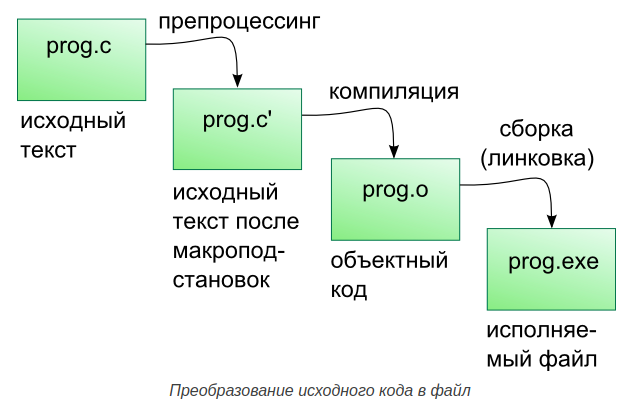

    </details>

  #### 28. Что такое оптимизация компилятора?

    - <details><summary>Ответ:</summary>

        - Оптимизация компилятора - это процесс улучшения эффективности и производительности сгенерированного
          компилятором кода. Компиляторы используют различные техники оптимизации, чтобы улучшить скорость выполнения
          кода, уменьшить размер исполняемого файла и улучшить другие аспекты производительности.
        - Оптимизация компилятора может включать в себя такие техники, как удаление недостижимого кода, устранение общих
          подвыражений, свертка констант, раскрытие циклов и многие другие. Компиляторы могут использовать различные
          уровни оптимизации, которые определяют, какие техники оптимизации будут использоваться и насколько агрессивно
          они будут применяться.
        - Оптимизация компилятора является сложным процессом, который требует глубокого понимания архитектуры компьютера
          и языка программирования. Она может значительно улучшить производительность программы, но также может привести
          к сложностям при отладке и поведению, которое может быть неожиданным для программиста.

    </details> 

  #### 29. Что такое флажки компиляции?

    - <details><summary>Ответ:</summary>

        - Флажки компиляции - это опции командной строки, которые передаются компилятору для управления различными
          аспектами процесса компиляции. Они позволяют программистам настраивать поведение компилятора и влиять на
          результаты компиляции.
        - Например, флажки компиляции могут использоваться для выбора уровня оптимизации, включения или отключения
          предупреждений, указания путей к заголовочным файлам и библиотекам, выбора стандарта языка и многого другого.
        - Флажки компиляции обычно указываются в командной строке при запуске компилятора. Например, чтобы
          скомпилировать файл main.cpp с оптимизацией уровня 3 и предупреждениями обо всех ошибках, можно использовать
          следующую команду (для компилятора GCC):
        - ```c++
          g++ -O3 -Wall main.cpp
          ```
        - В этом примере -O3 - это флажок компиляции, который указывает компилятору использовать уровень оптимизации 3,
          а -Wall - это флажок компиляции, который включает предупреждения обо всех ошибках.
        - Флажки компиляции могут быть разными для разных компиляторов, поэтому важно проверить документацию к вашему
          компилятору, чтобы узнать, какие флажки доступны и как их использовать.
      </details>

  #### 30. Как защитить хедер от повторного включения?

    - <details><summary>Ответ:</summary>

        - Чтобы защитить заголовочный файл (header) от повторного включения, можно использовать так называемые “header
          guards” (стражи заголовков). Header guards - это конструкции препроцессора, которые предотвращают повторное
          включение содержимого заголовочного файла.
        - Header guards работают следующим образом: в начале заголовочного файла определяется макрос с уникальным
          именем, а затем весь остальной код файла заключается в условную конструкцию препроцессора, которая проверяет,
          определен ли этот макрос. Если макрос уже определен, то содержимое файла не будет включено повторно.
        - Вот пример использования header guards в заголовочном файле myheader.h:
        - ```c++
           #ifndef MYHEADER_H
           #define MYHEADER_H

           // содержимое заголовочного файла

           #endif // MYHEADER_H
          ```

        - В этом примере мы используем директивы препроцессора #ifndef, #define и #endif, чтобы создать header guard.
          Макрос MYHEADER_H используется как уникальный идентификатор для этого заголовочного файла.
        - Когда этот файл включается в другой файл с помощью директивы #include, препроцессор проверяет, определен ли
          макрос MYHEADER_H. Если он не определен, то препроцессор определяет его и включает содержимое файла. Если же
          макрос уже определен (например, если файл был включен ранее), то содержимое файла не будет включено повторно.
        - Использование header guards помогает предотвратить проблемы, связанные с повторным включением заголовочных
          файлов, такие как переопределение макросов и функций.

     </details>

  #### 31. Что делает директива include?

    - <details><summary>Ответ:</summary>

        - Директива #include используется для включения содержимого другого файла в текущий файл. Это позволяет
          программистам разбить код на несколько файлов и повторно использовать код, определенный в одном файле, в
          других файлах.
        - Когда препроцессор находит директиву #include, он заменяет ее содержимым указанного файла. Содержимое файла
          вставляется в точку, где находится директива #include, как если бы оно было написано непосредственно в этом
          месте.
        - Вот простой пример использования директивы #include:
        - ```c++
           // main.cpp
           #include <iostream>
           #include "myheader.h"
           int main() {
              std::cout << "The value of PI is: " << PI << std::endl;
              return 0;
            }
          ```
        - ```c++
            // myheader.h
            #define PI 3.14
          ```  
        - В этом примере мы имеем два файла: main.cpp и myheader.h. В файле main.cpp мы используем директиву #include,
          чтобы включить содержимое файла myheader.h. Файл myheader.h содержит определение макроса PI.
        - Когда препроцессор обрабатывает файл main.cpp, он заменит директиву #include "myheader.h" на содержимое файла
          myheader.h. Таким образом, после обработки препроцессором код будет выглядеть так:
        - ```c++
            // main.cpp
            #include <iostream>
            #define PI 3.14
            int main() {
               std::cout << "The value of PI is: " << PI << std::endl;
               return 0;
            }
          ```
          Этот код затем будет скомпилирован и выполнен.
      </details>

  #### 32. Как работают макросы?

    - <details><summary>Ответ:</summary>

        - В языках С и С++ есть такой механизм, как препроцессор. Он обрабатывает исходный код программы ДО того, как
          она будет скомпилирована. Макросы в С и С++ - это инструкции препроцессору, которые позволяют заменять текст в
          исходном коде перед компиляцией1. Препроцессор развертывает макросы во всех строках, кроме директив
          препроцессора, которые имеют # в качестве первого символа, не являющегося пробелом. Он расширяет макросы в
          части некоторых директив, которые не пропускаются в рамках условной компиляции
    </details>

--- 

- ### <span style="color:red"> Язык C<span/>

  #### 33. Как static влияет на глобальные/локальные переменные?

    - <details><summary>Ответ:</summary>

        - Ключевое слово static имеет разные эффекты в зависимости от того,
          используется ли оно с глобальными или локальными переменными. Для глобальных переменных, static ограничивает
          область видимости переменной до файла, в котором она определена. Это означает, что переменная будет доступна
          только внутри этого файла и не будет видна из других файлов1. Для локальных переменных, static изменяет время
          жизни переменной. Обычно локальные переменные создаются при входе в блок кода и уничтожаются при выходе из
          него. Однако, если локальная переменная объявлена как static, ее значение сохраняется между вызовами функции,
          в которой она определена.
        - Этот [код объявляет](Codes/junior/jcode_33.cpp) переменную x, присваивает ей значение 5, затем изменяет его на
          10 и выводит оба значения на экран. Комментарии в коде начинаются с символов // и продолжаются до конца
          строки. Они используются для пояснения кода и не влияют на его выполнение
     </details>

  #### 34. Как сonst влияет на переменную?

    - <details><summary>Ответ:</summary>

        - Ключевое слово const в языке программирования C используется для обозначения переменных, которые не могут быть
          изменены после инициализации. Это может быть использовано при объявлении констант 1. Например, const int x =
          5; означает, что значение x равно 5 и не может быть изменено в дальнейшем.
        - Вот простой пример использования const в C:
        - ```c
          #include <stdio.h>
          int main(void) {
              const int x = 5;
              // x = 10; // Ошибка компиляции: нельзя изменить значение константы
              printf("x = %d\n", x);
              return 0;
          }
          ```
        - В этом примере переменная x объявлена как const int, что означает, что ее значение не может быть изменено
          после инициализации. Если вы попытаетесь раскомментировать строку x = 10;, то получите ошибку компиляции,
          потому что нельзя изменить значение константы.

    </details>

  #### 35. Какие варианты использования extern знаете?∆

    - <details><summary>Ответ:</summary>

        - Ключевое слово extern в C используется для расширения области видимости переменных и функций между несколькими
          файлами исходного кода. В случае функций, ключевое слово extern используется неявно, но для переменных его
          необходимо использовать явно .
        - Один из вариантов использования extern - это объявление глобальных переменных в одном файле и использование их
          в других файлах с помощью ключевого слова extern. Например:
        - ```c
          // file1.
          int x = 10;
          // file2.c
          #include <stdio.h>
          extern int x;
          int main(void) {
            printf("x = %d\n", x);
            return 0;
          }
          ```
        - В этом примере переменная x объявлена как глобальная переменная в файле file1.c, а затем используется в файле
          file2.c с помощью ключевого слова extern. Это позволяет расширить область видимости переменной x между двумя
          файлами. Надеюсь, это помогло вам понять, как использовать ключевое слово extern в C. Если у вас есть
          дополнительные вопросы, не стесняйтесь спрашиват
    </details>

  #### 36. Какие варианты использования volatile знаете?

    - <details><summary>Ответ:</summary>

        - Ключевое слово volatile в C используется для предотвращения оптимизации компилятором переменных, которые могут
          изменяться вне кода программы. Это может быть полезно в нескольких ситуациях, например:
            1. Когда вы работаете с аппаратным обеспечением, которое само изменяет значение переменной.
            2. Когда есть другой поток, который также использует переменную.
            3. Когда есть обработчик сигналов, который может изменить значение переменной 1.
        - Вот простой пример использования volatile в C:
        - ```c
          #include <stdio.h>
          #include <pthread.h>
          volatile int x = 0;
          void *increment(void *arg) {
           for (int i = 0; i < 1000000; i++) {
              x++;
           }
           return NULL;
          }
          int main(void) {
            pthread_t t1, t2;
            pthread_create(&t1, NULL, increment, NULL);
            pthread_create(&t2, NULL, increment, NULL);
            pthread_join(t1, NULL);
            pthread_join(t2, NULL);
            printf("x = %d\n", x);
            return 0;
          }
          ```
    </details>

  #### 37. Какие есть битовые операции?

    - <details><summary>Ответ:</summary>

      - В языке программирования C есть несколько битовых операций, которые позволяют работать с отдельными битами в числе. Вот список основных битовых операций:
        1. `&` (битовое И) - выполняет побитовое логическое И между двумя числами. 
        2. `|` (битовое ИЛИ) - выполняет побитовое логическое ИЛИ между двумя числами. 
        3. `^` (битовое исключающее ИЛИ) - выполняет побитовое логическое исключающее ИЛИ между двумя числами.
        4. `~` (битовое НЕ) - выполняет побитовое логическое НЕ над одним числом.
        5. `<<` (битовый сдвиг влево) - сдвигает биты числа влево на указанное количество позиций.
        6. `>>` (битовый сдвиг вправо) - сдвигает биты числа вправо на указанное количество позиций.
      - [Пример.](Codes/junior/jcode_37.cpp)
    </details>

  #### 38. Что такое булевая алгебра?

    - <details><summary>Ответ:</summary>

      [Булева алгебра](https://ru.wikipedia.org/wiki/%D0%90%D0%BB%D0%B3%D0%B5%D0%B1%D1%80%D0%B0_%D0%BB%D0%BE%D0%B3%D0%B8%D0%BA%D0%B8)
      — это категория алгебры, в которой значения переменных являются значениями истинности, истинными и ложными, обычно
      обозначаемыми `1` и `0` соответственно. Он используется для анализа и упрощения цифровых схем или цифровых
      вентилей. Ее также называют бинарной алгеброй или логической алгеброй. Он был основополагающим при разработке
      цифровой электроники и предусмотрен во всех современных языках программирования. Он также используется в [теории
      множеств](https://ru.wikipedia.org/wiki/%D0%A2%D0%B5%D0%BE%D1%80%D0%B8%D1%8F_%D0%BC%D0%BD%D0%BE%D0%B6%D0%B5%D1%81%D1%82%D0%B2)
      и статистике.

      Важными операциями, выполняемыми в булевой алгебре, являются конъюнкция `∧`, дизъюнкция `∨` и отрицание `¬` .
      Следовательно, эта алгебра сильно отличается от элементарной алгебры, где значения переменных являются числовыми,
      а над
      ними выполняются арифметические операции, такие как сложение, вычитание.
    </details>

  ---

#### 39. Расскажите об этапах разработки библиотеки или программы.

    - <details><summary>Ответ:</summary>

      Различные этапы разработки компьютерной программы:

        1. Определение проблемы
        2. Дизайн программы
        3. Кодирование
        4. Отладка
        5. Тестирование
        6. Документация
        7. Обслуживание

      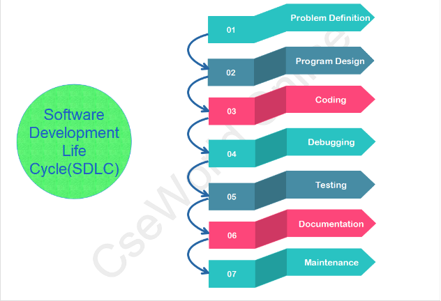

      ##### Определение проблемы:
        - Первым шагом в процессе разработки программы является полное понимание и идентификация проблемы, для решения
          которой должна быть разработана программа или программное обеспечение.
        - На этом этапе задача должна быть определена формально.
        - На этом этапе необходимо учитывать все факторы, такие как ввод/вывод, требования к обработке, требования к
          памяти, обработка ошибок, взаимодействие с другими программами.
      ##### Дизайн программы:
        - Следующий этап – разработка программы. Разработчик программного обеспечения использует такие инструменты, как
          алгоритмы и блок-схемы, для разработки дизайна программы.
            - Алгоритм
            - Блок-схема
      ##### Кодирование:
        - Как только процесс проектирования завершен, создается настоящая компьютерная программа, т. е. инструкции
          пишутся на языке программирования.
        - Кодирование, как правило, является очень небольшой частью всего процесса разработки программы, а также в
          действительности занимает меньше времени.
        - В этом процессе устраняются все синтаксические ошибки, т.е. ошибки, связанные с правописанием, пропущенными
          запятыми, неопределенными метками и т. д.
        - Для эффективного кодирования применяются следующие направляющие линии:
            - Использование осмысленных имен и меток переменных,
            - Простые и понятные выражения,
            - Модульность с упором на обобщение модулей,
            - Использование комментариев и правильный отступ кода,
            - Избегание скачков в программе передачи управления.
      ##### Отладка:
        - На этом этапе выявляются и исправляются ошибки в программах.
        - Этот этап разработки программы является важным процессом. Отладка также известна как проверка программы.
        - Некоторые распространенные ошибки, которые могут возникнуть в программах, включают:
            - Un инициализация переменных.
            - Обратный порядок операндов.
            - Путаница цифр и символов.
            - Инвертирование условий, например, переход на ноль, а не на ненулевое значение.
      ##### Тестирование:
        - Программа тестируется на ряде подходящих тестовых случаев.
        - План тестирования программы должен быть сделан на этапе проектирования самой программы.
        - Это гарантирует полное понимание спецификаций.
        - Самые тривиальные и самые частные случаи должны быть идентифицированы и протестированы.
        - Всегда полезно включать максимальные и минимальные значения всех переменных в качестве тестовых данных.
      ##### Документация:
        - Документация является очень важным шагом в разработке программы.
        - Документация помогает пользователям и людям, которые поддерживают программное обеспечение.
        - Это гарантирует, что будущая модификация, если потребуется, может быть легко выполнена. Также требуется при
          перепроектировании и обслуживании.
      ##### Обслуживание:
        - Обновление и корректировка программы под изменившиеся условия и полевой опыт учитывается в техническом
          обслуживании.
        - Техническое обслуживание становится необходимым в следующих ситуациях:
            - Изменение спецификации,
            - Смена снаряжения,
            - Ошибки, обнаруженные во время фактического выполнения программы.

      [Дополнительно](https://codilime.com/blog/the-stages-of-the-sdlc/)
      </details>

  --- 

#### 40. Что такое алгоритмы сортировки и какие вы знаете?

    - <details><summary>Ответ:</summary>

      В компьютерных науках [алгоритм сортировки](https://en.wikipedia.org/wiki/Sorting_algorithm) — это алгоритм,
      который упорядочивает элементы списка

      ##### Лучшие алгоритмов сортировки

        - [Selection sort](https://github.com/Jollu8/Algorithms/blob/main/Sort/Selection.cpp)
        - [Bubble sort](https://github.com/Jollu8/Algorithms/blob/main/Sort/Bubble.cpp)
        - [Insertion sort](https://github.com/Jollu8/Algorithms/blob/main/Sort/Insertion.cpp)
        - [Merge sort](https://github.com/Jollu8/Algorithms/blob/main/Sort/Merge.cpp)
        - [Quick sort](https://github.com/Jollu8/Algorithms/blob/main/Sort/Quick.cpp)
        - [Quick recursive sort](https://github.com/Jollu8/Algorithms/blob/main/Sort/QuicSortRecursive.cpp)
        - [Shell sort](https://github.com/Jollu8/Algorithms/blob/main/Sort/Shell.cpp)
        - [Stupid sort](https://github.com/Jollu8/Algorithms/blob/main/Sort/Stupid.cpp)
        - Radix sort
        - Heap sort
        - Tim sort
        - Cycle sort
        - Standard sort
        - Bitcoin sort
        - Tree sort
        - Gnome sort

      [Подробно](https://ru.wikipedia.org/wiki/%D0%90%D0%BB%D0%B3%D0%BE%D1%80%D0%B8%D1%82%D0%BC_%D1%81%D0%BE%D1%80%D1%82%D0%B8%D1%80%D0%BE%D0%B2%D0%BA%D0%B8)
      </details>

  ---

#### 41. Какие алгоритмы работы со строками знаете?

    - <details><summary>Ответ:</summary>

      Ответ требует доработки(требуется ру контент)

      ##### Тематики

        - [Алгоритмы точного сопоставления строк](https://www.hackerearth.com/practice/notes/exact-string-matching-algorithms/)
        - [Алгоритмы приближенного сопоставления строк](https://stackoverflow.com/questions/49263/approximate-string-matching-algorithms/50110#50110)

        1. ##### Алгоритмы, основанные на сравнении символов:

            - [Наивный алгоритм поиска шаблонов](https://www.tutorialspoint.com/Naive-Pattern-Searching)
            - [Алгоритм KMP для поиска шаблонов](https://www.tutorialcup.com/interview/algorithm/kmp-algorithm.htm)
            - [Алгоритм Бойера Мура для поиска по образцу](https://en.wikipedia.org/wiki/Boyer%E2%80%93Moore_string-search_algorithm)
            - [Trie | (Insert and Search)](https://www.techiedelight.com/trie-implementation-insert-search-delete)

        2. ##### Метод детерминированного конечного автомата (DFA):

            - [Алгоритм конечных автоматов для поиска шаблонов](https://tutorialspoint.dev/algorithm/pattern-searching-algorithms/searching-for-patterns-set-5-finite-automata)

        3. ##### Алгоритмы на основе Bit (метод параллелизма)

            - [Алгоритм Ахо-Корасика для поиска шаблонов](https://github.com/cjgdev/aho_corasick)

        4. ##### Алгоритмы сопоставления хэш-строки:

            - [Алгоритм Рабина-Карпа для поиска образов](https://en.wikipedia.org/wiki/Rabin%E2%80%93Karp_algorithm#Use_of_hashing_for_shifting_substring_search)

      </details>

  ---

#### 42. Какие алгоритмы на графах знаете?

    - <details><summary>Ответ:</summary>

      [Граф](https://ru.wikipedia.org/wiki/%D0%93%D1%80%D0%B0%D1%84_(%D0%BC%D0%B0%D1%82%D0%B5%D0%BC%D0%B0%D1%82%D0%B8%D0%BA%D0%B0))
      — это нелинейная структура данных, состоящая из узлов и ребер. Узлы иногда также называют вершинами, а ребра —
      линиями или дугами, соединяющими любые два узла в графе. Более формально график можно определить как

      Ниже приведены некоторые основные определения, относящиеся к графам. Вы можете обратиться к рисунку 1 для
      примеров.

        - Порядок: количество вершин в графе
        - Размер: количество ребер в графе.
        - Степень вершины: количество ребер, инцидентных вершине.
        - Изолированная вершина: вершина, которая не связана ни с какими другими вершинами графа.
        - Самостоятельная петля : ребро из вершины в себя
        - Направленный граф: граф, в котором все ребра имеют направление, указывающее начальную и конечную вершины.
        - Неориентированный граф: граф с ребрами, не имеющими направления .
        - Взвешенный граф: ребра графа имеют веса
        - Невзвешенный граф: ребра графа не имеют весов.

      ##### Алгоритмы

        - Поиск в ширину `DFS`
        - Поиск в глубину `DFS`
        - Кратчайший путь `Алгоритм кратчайшего пути Дейкстры`
        - Кратчайший путь `Алгоритм Беллмана - Ворда`
        - Обнаружение цикла `Алгоритм обнаружения цикла Флойда`
        - Обнаружение цикла `Алгоритм Брента`
        - Минимальное остовное дерево `Алгоритма Прима`
        - Минимальное остовное дерево `Алгоритм Крусакала`
        - Компоненты сильной связи `Алгоритм Косараджу`
        - Компоненты сильной связи `Алгоритм сильно связанных компонентов Тарьяна`
        - Топологическая сортировка `Алгоритм Кана`
        - Топологическая сортировка `Алгоритм, основанный на поиск в  глубину`
        - Раскраска графика `Алгорритм, использующие поиск в ширину или поиск в  глубину`
        - Раскраска графика `Жадная раскраска`
        - Максимальный расход `Алгоритм Форда-Фалкерсона`
        - Максимальный расход `Алгоритм Эдионса- Канда`
        - Максимальный расход `Алгоритм Динка`
        - Соответствие `Алгоритм Хопкрофта-Карпа`

    </details>

  ---

#### 43. Где может храниться переменная?

    -  <details><summary>Ответ:</summary>

       В стеке, если они являются локальными переменными функции.
       `C++` называет это [автоматической памятью](https://en.cppreference.com/w/cpp/language/storage_duration) и не
       требует, чтобы это был стек вызовов `asm`, а в некоторых редких реализациях это не так. Но в основных реализациях
       это так.
       В области данных для каждого процесса, если они являются глобальными или `static`.
       `C++` называет это «статическим классом хранения»; это реализовано на ассемблере путем размещения/резервирования
       байтов в `section .data`, `.bss`, `.rodata` или т п.

       Если переменная является указателем, инициализированным с помощью `int *p = new int[10];` или подобным,
       переменная
       указателя `p` будет помещена в автоматическое хранилище или статическое хранилище, как указано выше. Указанный
       объект в
       памяти:

        - В куче (что `C++` называет динамическим хранилищем), выделенном с помощью `new` или `malloc` и т. д.
        - В ассемблере это означает вызов функции-распределителя, которая в конечном итоге может получить новую память
          из
          `ОС` через
          какой-то системный вызов, если ее свободный список пуст. «Куча» не является единой непрерывной областью в
          современных
          реализациях ОС/С++.

       C и C++ не выполняют автоматическую сборку мусора, а именованные переменные сами по себе не могут находиться в
       динамической памяти ("куче"). Объекты в динамическом хранилище анонимны, за исключением того, что на них
       указывают
       другие объекты, некоторые из которых могут быть правильными переменными. (Объект типа структуры или класса, в
       отличие от
       примитивных типов, таких как int, может позволить вам ссылаться на именованные члены класса в этом анонимном
       объекте. В
       функции-члене они даже выглядят одинаково.)

       Вот почему вы не можете (безопасно/полезно) вернуть указатель или ссылку на локальную переменную.

       Это все в оперативной памяти, конечно. Кэширование прозрачно для процессов пользовательского пространства, хотя
       оно
       может заметно влиять на производительность.

       Компиляторы могут оптимизировать код для хранения переменных в регистрах. Это сильно зависит от компилятора и
       кода, но
       хорошие компиляторы будут делать это агрессивно.

       Забавный факт: `auto` в `C++03` и более ранних версиях, а также в `C` это означало автоматический `storage-class`
       , но теперь (C++11) он выводит типы

    </details>

  ---

#### 44. Какая разница между calloc и malloc?

    - <details><summary>Ответ:</summary>

      Попробуйте сделать это: выделите немного памяти, используя `malloc`, например

        ```c++
          char* pszKuchBhi ;
          pszKuchBhi = malloc(10) ;
          printf( "%s\n", pszKuchBhi ) ;  
          // Will give some junk values as the memory allocated is not initialized and
          // was storing some garbage values
        ```
      Теперь сделайте то же самое, заменив malloc на `calloc`. Увидеть разницу.

        ```c++
          char* pszKuchBhi ;
          pszKuchBhi = calloc( 10, 1 ) ;
          printf( "%s\n", pszKuchBhi ) ;
          //Will print nothing as the memory is initialized to 0
        ```
      Память, назначаемая `calloc`, инициализируется до `0`. Для новичков полезно инициализировать память, но с точки
      зрения
      производительности `calloc` работает медленно, поскольку ему приходится выделять, а затем инициализировать. Для
      лучшего разъяснения вы всегда можете погуглить тот же вопрос, но лучше испытать его, чтобы заглянуть внутрь. Вы
      также можете следить за своей памятью, чтобы убедиться в этом самостоятельно.

      [Дополнительно](https://byjus.com/gate/difference-between-malloc-and-calloc-functions/)
      </details>

  ---

#### 45. Для чего используют realloc?

    -  <details><summary>Ответ:</summary>

       Что такое `realloc()`?
       `realloc()` — это функция библиотеки C для добавления большего объема памяти к уже выделенным блокам памяти. Цель
       `realloc` в C — расширить текущие блоки памяти, оставив исходное содержимое без изменений. Функция `realloc()`
       помогает уменьшить размер ранее выделенной памяти функциями `malloc` или `calloc`. `realloc` означает
       перераспределение
       памяти.

       Синтаксис для `realloc` в `C`

         ```c
          ptr = realloc (ptr,newsize);
       ``` 
       Приведенный выше оператор выделяет новое пространство памяти с указанным размером в переменной `new size`. После
       выполнения функции указатель будет возвращен на первый байт блока памяти. Новый размер может быть больше или
       меньше предыдущего объема памяти. Мы не можем быть уверены, что новый выделенный блок будет указывать на то же
       место, что и предыдущий блок памяти. Функция `realloc` в C скопирует все предыдущие данные в новую область. Это
       гарантирует, что данные останутся в безопасности.

         ```c
           #include <stdio.h>
           int main () {
             char *ptr;
             ptr = (char *) malloc(10);
             strcpy(ptr, "Programming");
             printf(" %s,  Address = %u\n", ptr, ptr);

             ptr = (char *) realloc(ptr, 20); //ptr is reallocated with new size
             strcat(ptr, " In 'C'");
             printf(" %s,  Address = %u\n", ptr, ptr);
             free(ptr);
             return 0;
             }
         ```

       ##### Как использовать realloc()
       В приведенной ниже программе на C показано, как использовать `realloc` в `C` для перераспределения памяти.

          ```c
            #include <stdio.h>
            #include <stdlib.h>
            int main() {
              int i, * ptr, sum = 0;
              ptr = malloc(100);
              if (ptr == NULL) {
                printf("Error! memory not allocated.");
                 exit(0);
              }

              ptr = realloc(ptr,500);
              if(ptr != NULL)
                printf("Memory created successfully\n");
           
            return 0;

            }
          ```

       | Распределители памяти часто используются для строк, которые должны сохраниться после завершения функции. Вы
       платите (небольшую) стоимость во время использования `realloc()`(и позже `free()`). Если строка не нужна после
       завершения функции и вы можете определить для нее разумный размер, то использование локальной переменной будет
       быстрее, а пространство автоматически освобождается при завершении функции, тогда как вы должны освободить (
       `free()`) явно выделенную память себя — в противном случае у вас будет случай ужасной «утечки памяти». Итак,
       используйте локальные строки, когда можете; используйте выделенные строки, когда вам нужно.|

    </details>

  ---

#### 46. Что такое указатель?

    - <details><summary>Ответ:</summary>

      [Указатель](https://ru.wikipedia.org/wiki/%D0%A3%D0%BA%D0%B0%D0%B7%D0%B0%D1%82%D0%B5%D0%BB%D1%8C_(%D1%82%D0%B8%D0%BF_%D0%B4%D0%B0%D0%BD%D0%BD%D1%8B%D1%85))
      в C++ — это переменная, в которой хранится адрес (или место в памяти) другой переменной. Другими
      словами, указатель указывает на адрес другой переменной. Как и обычные переменные, указатели в C++ имеют типы
      данных. Указатель должен иметь тот же тип данных, что и переменная, на которую он указывает.

          - `Примечание. Причина, по которой мы объявляем типы данных указателей, заключается в том, чтобы знать, сколько байтов данных используется переменной, адрес которой она хранит. Если мы увеличиваем (или уменьшаем) указатель, мы увеличиваем (или уменьшаем) указатель на размер типа данных, на который он указывает.`

      ##### Оператор ссылки и оператор разыменования

      Указатели и ссылки, операторы разыменования идут рука об руку. Давайте узнаем о каждом из этих операторов.

      Ссылочный оператор ( `&` )
      Оператор ссылки ( `&` ) возвращает адрес любой переменной (включая указатели).

      Например:

      ```c
        float a = 23.4;
        // using the reference operator
        std::cout << &a;
      ```

      выxод:
      `0x7ffe0734e9b4`

        - `Примечание: адрес каждой переменной отличается в разных системах.`

      Как известно, указатели в C++ используются для хранения адресов переменных. Чтобы сохранить адрес любой переменной
      в указателе, мы используем оператор ссылки. Другими словами, мы можем назначать адреса указателям с помощью
      оператора ссылки.

      Пример:

      ```c++
        int var = 45;
        int* ptr;
        ptr = &var;
        std::cout << "The value of &var is: " << &var << std::endl;
        std::cout << "The value of ptr is: " << ptr;
      ```

      Выход:

      ```c++
        The value of &var is: 0x7ffc1e98dfa4
        The value of ptr is: 0x7ffc1e98dfa4
      ```

      Переменная-указатель `ptr` теперь содержит адрес переменной `var`.

      Оператор разыменования (`*`)
      Символ звездочки (`*`) называется оператором разыменования, когда он используется с указателями. Мы можем получить
      доступ к значениям, хранящимся в переменной, на которую указывает указатель, используя идентификатор указателя и
      оператор разыменования.

      По отношению к указателям символ звездочки (`*`) имеет два разных значения. Когда * используется в объявлении
      переменной, значение, записанное справа от знака `=`, должно быть адресом переменной (присутствующей в памяти).
      Унарный
      оператор (`*`) при использовании с указателем позволяет нам получить или присвоить значение, хранящееся в ячейке
      памяти,
      на которую указывает указатель. Унарный оператор может быть прочитан как `<<` значение, на которое указывает `>>`.

      Например:

      ```c++
        int var = 45;
        int* ptr;
        ptr = &var;
        // using the dereference operator
        stdd::cout << "The value returned by ptr is: " << ptr << std::endl;
        std::cout << "The value returned by *ptr is: " << *ptr;
      ```

      Выход:

      ```c++
        The value returned by ptr is: 0x7fff40bf6674
        The value returned by *ptr is: 45
      ```

      Как мы видим, чтобы получить значение переменной var , мы использовали *ptr .

      ##### Синтаксис объявления указателя

      Указатели в C++ объявляются с использованием следующего синтаксиса:

      ```c++
        datatype *pointer_name;  
        // or
        datatype* pointer_name;
        // or
        datatype * pointer_name;
      ```

      Мы используем символ звездочки (`*`) для обозначения переменной в качестве указателя в C++. Символ звездочки может
      быть
      размещен в любом месте перед именем указателя и после типа данных.

      Если нам нужно объявить два (или более) указателя вместе в одной строке, нам нужно будет использовать символ
      звездочки
      перед каждым именем переменной. Например:

      ```c++
        int* var1, *var2; // Both var1 and var2 are pointers
        int* var1, var2; // var1 is a pointer, var2 is an integer variable
      ```

      ##### Как использовать указатели в C++?

      Нам нужно выполнить несколько шагов, чтобы использовать указатели в C++:

        - Создайте переменную-указатель.
        - Присвойте указателю адрес другой переменной с помощью оператора & .
        - Доступ к значению по адресу с помощью оператора `\` .

      ##### Символы, используемые в указателях

      В следующей таблице показаны символы, используемые с указателями.

      

      Давайте теперь возьмем пример, чтобы понять указатели:

      ```c++
        #include <iostream>
        using namespace std;
        int main()
        {
          int var = 23;
          int *ptr;
          ptr = &var;
          std::cout << "Initial value of var is: " << var << std::endl;
          std::cout << "Initial value of *ptr is: " << *ptr << std::endl << std::endl;
          // changing the value of var using ptr
          *ptr = 50;
          std::cout << "New value of *ptr is: " << *ptr << std::endl;
          std::cout << "New value of var is: " << var << std::endl;
          return 0; 
        }
      ```
      Выход:
        ```c++
          Initial value of var is: 23
      
          Initial value of *ptr is: 23
          New value of *ptr is: 50
          New value of var is: 50
        ```

      В приведенном выше примере мы использовали оператор ссылки для сохранения адреса `var` в указателе `ptr`. Затем мы
      изменили значение переменной `var`, используя оператор разыменования с указателем (`*ptr`).

      ##### Способы передачи аргументов C++ в функцию
      В C++ мы можем передавать аргументы функциям тремя различными способами. Это:

        - Вызов по значению
        - Вызов по ссылке с аргументом указателя
        - Вызов по ссылке со ссылочным аргументом

      Давайте сделаем краткий обзор каждого из них.

      ##### Вызов по значению
      По умолчанию C++ использует метод вызова по значению. Этот метод копирует реальное значение аргумента в параметр
      функции. Таким образом, если параметр внутри функции будет изменен, это не повлияет на аргумент.

      Давайте возьмем пример, чтобы понять метод вызова по значению.

      ```c++
        #include <iostream>
        // Call by Value
        int triple(int var)
        {
          // address of var in triple() is different from var in main()
          std::cout << "Address of var in triple(): " << &var << std::endl;

          var = var * 3;
          return var;
        }

        int main()
        {
          int var = 10;
          std::cout << "Original value of var in main(): " << var << std::endl; 
    
          std::cout << "Address of var in main(): " << &var << std::endl << std::endl;
          triple(var);
          std::cout << "Value of var after executing triple(): " << var;

          return 0;
        }
      ```

      Выход:

      ```c++
      Original value of var in main(): 10
      Address of var in main(): 0x7ffe04a244a4

      Address of var in triple(): 0x7ffe04a2447c
      Value of var after executing triple(): 10
      ```
      Из приведенного выше примера мы можем заметить, что адрес переменной `var` внутри функции `Triple()` был другим.
      Кроме того, изменение `var` внутри функции `Triple()` никак не повлияло на `var`, присутствующий в
      функции `main()`.

      ##### Вызов по ссылке с аргументом указателя
      При вызове по ссылке с _аргументом-указателем_ мы передаем адреса переменных в качестве аргументов параметрам
      функции. Вот почему исходные переменные изменяются, если мы вносим изменения в параметры функции.

      Давайте возьмем пример, чтобы понять вызов по ссылке с аргументом указателя.

      ```c++
      #include <iostream>
      // Call by Reference with pointer argument
      void triple(int *var)
      {
      // Note that var is a pointer here
      // address of var in triple() is same as var in main() 
      std::cout << "Address of var in triple(): " << var << std::endl;  
    
      *var = *var * 3; 
      }

      int main()
      {
        int var = 10;
        std::cout << "Original value of var in main(): " << var << std::endl;  
        cout << "Address of var in main(): " << &var  << std::endl << std::endl;
        // passing the address of var in triple()
        triple(&var);
        std::cout << "Value of var after executing triple(): " << var; 
        return 0; 
      }
      ```
      Выход:
      ```c++
      Original value of var in main(): 10
      Address of var in main(): 0x7ffeb0676644
      
      Address of var in triple(): 0x7ffeb0676644
      Value of var after executing triple(): 30
      ```

      Поскольку в приведенном выше примере мы использовали вызов по ссылке, адрес переменной `var` был одинаковым как в
      функциях `triple()` , так и в `main()` . Это означает, что обе переменные `var` используют одну и ту же ячейку
      памяти.
      Вот почему изменение значения var внутри `Triple()` привело к изменению `var` внутри `main()`.

      Вызов по ссылке со ссылочным аргументом
      При вызове по ссылке со _ссылкой-аргументом_ мы передаем адреса переменных в качестве аргументов. Между двумя
      типами
      вызова по ссылкам есть только одно различие. Вызов по ссылке с _аргументом-указателем_ принимает указатели
      (указывающие на расположение аргументов в памяти) в качестве параметров функции. С другой стороны, вызов по ссылке
      с аргументом ссылки принимает исходную переменную (а не копию переменных) в качестве параметров функции.

      Чтобы передать исходную переменную в качестве параметра функции, мы используем оператор ссылки (`&`) в объявлении
      параметров функции.

      Давайте возьмем пример, чтобы понять вызов по ссылке со ссылочным аргументом.

      ```c++
      #include <iostream>
      // Call by Reference with reference argument
      void triple(int &var)  
      {
        // Note that var is an integer variable, not a pointer
        // address of var in triple() is same as var in main() 
        std::cout << "Address of var in triple(): " << &var << std::endl; 
    
        // no need of dereference operator
        var = var * 3;
      }

      int main()
      {
        int var = 10;
        std::cout << "Original value of var in main(): " << var << std::endl;
        std::cout << "Address of var in main(): " << &var << std::endl << std::endl;
        // passing var in triple()
        triple(var);
        std::cout << "Value of var after executing triple(): " << var;
      return 0;
      }
      ```

      Выход:
      ```c++
      Original value of var in main(): 10
      Address of var in main(): 0x7ffeb0676644

      Address of var in triple(): 0x7ffeb0676644
      Value of var after executing triple(): 30
      ```
      В приведенном выше примере, поскольку мы определили int& в качестве параметра вместо int , исходная переменная var
      была передана в качестве аргумента в функцию Triple() .

      ##### Расширенная нотация указателя
      Мы можем получить доступ к элементам двумерного массива, используя нотацию указателя. Элементы двумерного массива
      хранятся построчно. Можно сказать, что двумерный массив представляет собой набор нескольких одномерных массивов,
      расположенных один за другим.

      Например, рассмотрим следующий массив:
      ```c++
      int arr[2][3] = {{10, 11, 12}, {20, 21, 22}};
      ```

      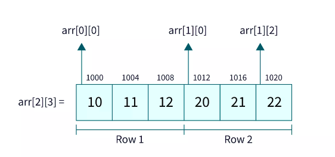

      На изображении выше мы можем рассматривать каждую строку как одномерный массив. Итак, массив arr
      содержит 22 элементы, где каждый элемент представляет собой одномерный массив, содержащий 33 целые числа.

      Мы знаем, что `arr` указывает на 22 элемент, т.е. 3 1D массивов. Точно так же `arr + 1` указывает на `1^{st}1st`
      элемент, т.е. `1^{st}1st`
      `1D` массив. Изображение ниже представляет то же самое.

      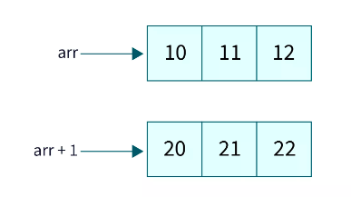

      В общем случае можно сказать, что `arr + n` указывает на `0^{й}`
      элемент массива `arr`, где элемент `arr + 1` представляет собой одномерный массив. Следовательно, разыменование
      `arr + n (i.e *(arr + n))` даст нам адрес `0^{й}`
      элемент (_базовый адрес_), присутствующий в этом массиве `1D`.

      Теперь, когда мы знаем базовый адрес `n^{й}`
      `1D` массив, мы сможем получить адрес `m^{й}`
      элемент одномерного массива с помощью `*(arr + n) + m`. Наконец, разыменование `*(arr + n) + m` , то
      есть `*(*(arr + n) + m)`
      даст нам значение отдельного целого числа 2D-массива.

      Итак, в приведенном выше примере `*(*(arr + 1) + 2)` вернет 22. Точно так же `*(*(arr) + 1)` вернет 11.
      В общем, `arr[n][m]` равно `*(*(arr + n) + m)`.

      Теперь давайте посмотрим, как получить доступ к каждому элементу этого массива, используя расширенную нотацию
      указателя.

      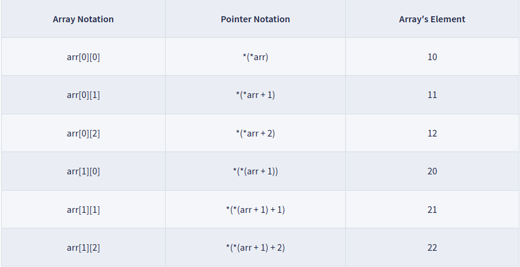

      ##### Имя массива как указатели
      Имя массива действует как указатель, потому что адрес первого элемента массива хранится в его имени. Итак, если
      указатель содержит адрес первого элемента массива, мы можем использовать этот указатель для доступа ко всем
      элементам массива.

      Например:

      ```c++
      #include <iostream>
      int main()
      {
        int arr[3] = {1, 2, 3};
        int *ptr;
        // assigning address of arr[0] to ptr
        ptr = arr;
        // ptr = &arr[0] will do the same thing
         std::cout << "The elements of the array are: "
         << ptr[0] << " "  // using ptr[0] instead of arr[0]
         << ptr[1] << " "
         << ptr[2] << endl;
    
       return 0;
       }
      ``` 
      Выход:

      ```c++
      The elements of the array are: 1 2 3
      ```

      В приведенном выше примере мы присвоили адрес arr[0] указателю ptr . Вот почему мы можем получить доступ ко всем
      элементам массива с помощью указателя (мы увидим это в следующем разделе).

      ##### Выражения указателя и арифметика указателя
      Мы можем выполнять только ограниченное количество арифметических операций над указателями в C++. Эти
      арифметические операции:

        1. Оператор приращения ( ++ )
        2. Оператор декремента ( -- )
        3. Дополнение ( + )
        4. Вычитание ( - )

      Давайте разберемся с арифметикой указателей с помощью нескольких примеров.

      ##### Пример 1: Использование оператора приращения
      Когда мы увеличиваем указатель с помощью оператора приращения ( ++ ), адрес указателя увеличивается. Увеличение
      адреса
      указателя равно размеру его типа данных.

      Поскольку все элементы массива хранятся в непрерывной памяти, мы можем использовать оператор приращения для
      указателей
      для доступа к элементам массива.

      ```c++
      #include <iostream>
      int main () {
         int arr[3] = {10, 20, 30};
          // storing address of arr in a pointer
          int  *ptr = arr;
          for (int i = 0; i < 3; i++)
          {
              std::cout << "Value of var[" << i << "] is: " << *ptr << std::endl;
              std::cout << "Address of var[" << i << "] is: " << ptr << std::endl << std::endl;
    	      // point to the next location
    	      ptr++;
          }
        return 0;
      }
      ```

      Выход:

      ```c++
      Value of var[0] is: 10
      Address of var[0] is: 0x7fff9e39b200

      Value of var[1] is: 20
      Address of var[1] is: 0x7fff9e39b204
     
      Value of var[2] is: 30
      Address of var[2] is: 0x7fff9e39b208
      ```

      В приведенном выше примере мы использовали `ptr++` для доступа к каждому элементу массива `arr`. Так как `ptr`
      имел тип
      `int`,
      адрес был увеличен на 4(потому что размер int4), когда мы использовали `ptr++`.

      ##### Пример 2: Использование оператора декремента
      Оператор декремента ( -- ) подобен оператору инкремента. Оператор декремента уменьшает адрес указателя на размер
      его
      типа данных.

      Оператор декремента также можно использовать с массивами для доступа к их элементам.

      ```c++
      #include <iostream>
      int main () {
          int arr[3] = {10, 20, 30};
          // storing address of last element of arr in a pointer
          int  *ptr = &arr[2];
          for (int i = 2; i >= 0; i--)
          {
              std::cout << "Value of var[" << i << "] is: " << *ptr << std::endl;
              std::cout << "Address of var[" << i << "] is: " << ptr << std::endl << std::endl; 
    	      // point to the previous location
    	      ptr--; 
          }
        return 0;
      }
      ```

      Выход:

      ```c++
      Value of var[2] is: 30
      Address of var[2] is: 0x7ffd19a65bb4
      Value of var[1] is: 20
      Address of var[1] is: 0x7ffd19a65bb0

      Value of var[0] is: 10
      Address of var[0] is: 0x7ffd19a65bac
      ```

      В приведенном выше примере указатель `ptr` указывал на последний элемент массива `arr`. Чтобы получить доступ к
      каждому
      элементу массива с помощью `ptr`, мы использовали `ptr--` внутри цикла `for`.

      ##### Константные указатели на константу
      В константных указателях на константу указатель указывает на константную переменную, а сам указатель является
      константой (т.е. он не может указывать куда-то еще). Таким образом, мы не можем изменить значение переменной,
      на которую он указывает, и мы даже не можем использовать указатель для хранения адреса новой переменной.

      ###### Синтаксис:
      ```c++
      const datatype *const pointer_name;
      ```

      Например:

      ```c++
      #include <iostream>
      int main()
      {
          // declaring constant variables
          const int var1 = 10;
          const int var2 = 55;
          // declaring constant pointer to constant
          const int* const ptr = &var1;
          // *ptr = 12;
          // Error: assignment of read-only

          // ptr = &var2;
          // Error: assignment of read-only

          // Address of var1
          std::cout << "Address of var1: " << ptr << std::endl;

          // Value of var1
          std::cout << "Value of var1: "<< *ptr;

          return 0;

      }
      ```

      Выход:

      ```c++
      Address of var1: 0x7ffffbd58e04
      Value of var1: 10
      ```

      В приведенном выше примере мы объявили «постоянный указатель на константу» `ptr`. Из-за этого мы не могли изменить
      значение переменной, на которую указывает `ptr`, и даже не могли сохранить в ptr другой адрес.

      ##### Указатели на функции
      Как и переменные, функции также имеют адреса. Таким образом, C++ предлагает функциональные возможности для
      создания
      указателей, которые могут хранить эти адреса. Указатели, которые могут хранить адреса функций, называются
      указателями на
      функции или указателями функций.

      Обычно указатели на функции используются, когда нам нужно передать функцию в качестве аргумента другой функции.

      ###### Синтаксис:
      ```c++
      return_type (*function_pointer_name)(parameter_type);
      ```

      Давайте посмотрим на пример, чтобы понять указатели на функции:

      ```c++
      #include<iostream>
      // creating a function
      int square(int x)
      {
          return x * x;
      }

      int main()
      {
          int num = 9;
          int result;

          // creating a pointer to function
          int (*fp)(int);

          // storing the address of square() in fp
          fp = square;
    
          // using fp to call the function square()
          result = (*fp)(num);
    
          std::cout << "The square of 9 is: " << result;
    
          return 0;
      }
      ```

      Выход:

      ```c++
      The square of 9 is: 81
      ```

      В приведенном выше примере мы создали указатель на функцию `fp`. Мы использовали этот указатель на функцию для
      хранения
      адреса функции square(). Затем мы использовали сам указатель fp для вызова функции и вычисления квадрата
      переменной num

      ##### Указатели и строковые литералы
      Строковые литералы — это массивы, содержащие последовательности символов, заканчивающиеся нулем ( \0 ). Каждый
      элемент
      строкового литерала имеет тип const char .

      Например:

      ```c++
      const char *ch_ptr = "hey";
      ```
      Строка «hey» — это массив. Указатель `ch_ptr` указывает на первый элемент этого массива, т.е. 'h'.

      Если мы предположим, что «hey» хранится в ячейках памяти, начинающихся с адреса 1000, то мы можем представить
      объявления как:

      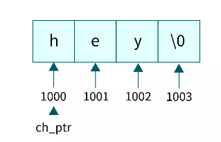

      Как мы знаем, массивы и указатели в C++ имеют одинаковое поведение в выражениях, мы можем использовать ch_ptr для
      доступа к символам строкового литерала.

      Например:

      ```c++
      const char *ch_ptr = "hey";
       
      char ch1 = *(ch_ptr + 1);
      char ch2 = ch_ptr[1];
      ```

      В приведенном выше примере и `ch1`, и `ch2` указывают на один и тот же символ строкового литерала.

      ##### Указатели на указатели
      Указатель на указатель — это цепочка указателей. Когда мы определяем указатель на указатель, первый указатель
      указывает
      на второй указатель, а второй указатель указывает на реальную переменную.

      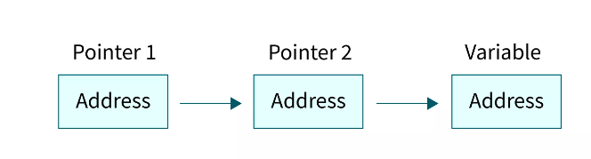

      Чтобы объявить указатель на указатель, мы используем один унарный оператор (*) для каждого уровня цепочки
      указателей.

      Например:

      ```c++
      #include <iostream>
      int main()
      {
          float var = 10;

          std::cout << "Value of &var is: " << &var << std::endl << std::endl;

          // declaring a pointer
          float *ptr1;

          // declaring a pointer to a pointer
          float **ptr2;

          // assigning address of variable var to ptr1
          ptr1 = &var;

          std::cout << "Value of ptr1 is: " << ptr1 << std::endl;
          std::cout << "Value of &ptr1 is: " << &ptr1 << std::endl << std::endl;

          // assigning address of pointer ptr1 to ptr2;
          ptr2 = &ptr1;

          std::cout << "Value of ptr2 is: " << ptr2 << std::endl;
          std::cout << "Value of *ptr2 is: " << *ptr2 << std::endl << endl;

          return 0;
       }
      ```

      Выход:

      ```c++
      Value of &var is: 0x7ffe3fbb711c

      Value of ptr1 is: 0x7ffe3fbb711c
      Value of &ptr1 is: 0x7ffe3fbb7120

      Value of ptr2 is: 0x7ffe3fbb7120
      Value of *ptr2 is: 0x7ffe3fbb711c
      ```

      В приведенном выше примере мы создали переменную var и два указателя `ptr1` и `ptr2`. Адрес var хранился в `ptr1`,
      а
      адрес `ptr1` сохранялся в `ptr2`.

      ##### void указатели
      Указатели, которые указывают на переменную, не имеющую типа данных, известны как void указатели. Поскольку
      указатели [void](https://ru.wikipedia.org/wiki/Void) не указывают ни на какой конкретный тип данных, эти указатели
      могут быть приведены к любому типу
      данных и могут использоваться для хранения адреса любого типа.

      void указатели не могут быть разыменованы напрямую. Чтобы уважать их, нам нужно преобразовать их в другой тип
      указателя, который указывает на любой конкретный тип данных.

      Например:

      ```c++
      #include <iostream>
      int main()
      {
          char var1 = 'a';
          int var2 = 1;

          // declaring a void pointer
          void *ptr;

          ptr = &var1; // void pointer holds address of char var1
    
          ptr = &var2; // void pointer holds address of int var2
    
          // dereferencing ptr without converting it to 1 particular data type
          std::cout << *ptr;  // this will generate an error
    
          // This will work:
          // cout << *(int *)ptr;
    
          return 0;
      }
      ```

      Выход:

      ```c++
      error: 'void*' is not a pointer-to-object type
      ```

      В приведенном выше примере мы создали void указатель `ptr`. Поскольку `ptr` был пустым, мы могли хранить адреса
      переменных `int` и `char` в `ptr`. Однако, когда мы попытались разыменовать `ptr`, компилятор выдал ошибку, потому
      что
      мы не
      привели `ptr` к одному конкретному типу данных.

      ##### Invalid указатели
      Указатель в C++ считается действительным, если:

        - Это значение указателя NULL или
        - указывает на объект или
        - Он указывает на элемент массива, находящийся за пределами границ диапазона, отличного от
          диапазона `array_name`
          до
          `arrry_name + array_size` (оба включительно).

      Указатель, не удовлетворяющий ни одному из трех условий, написанных выше, называется недействительным
      указателем.
      Действительный указатель может стать недействительным, если объект, на который (или после которого) он
      указывает,
      завершает свой жизненный цикл, т. е. освобождается место в памяти, на которое он указывает.

      Недопустимые указатели могут вызывать или не вызывать ошибки в программе. Доступ к этим указателям может привести
      к
      неожиданному поведению программы. Следовательно, мы всегда должны избегать недопустимых указателей.

      Например:

      ```c++
      #include <iostream>
      int main()
      {
          int *ptr1; // invalid pointer because
          // it does not point to anything

          int arr[5];
    
          int *ptr2 = &arr[0] + 7; // invalid pointer because
                             // it points to a non-existing address
    
         return 0;
      }
      ```

      В приведенном выше примере мы создали два указателя `ptr1` и `ptr2`. Указатель `ptr1` недействителен, так как он
      не
      указывает
      ни на один адрес. Указатель `ptr2` недействителен, так как `&arr[0] + 7` не указывает ни на один объект в этой
      программе.

      ##### НУЛЕВЫЕ указатели
      Мы можем
      присвоить [NULL](https://ru.wikipedia.org/wiki/Null_object_(%D1%88%D0%B0%D0%B1%D0%BB%D0%BE%D0%BD_%D0%BF%D1%80%D0%BE%D0%B5%D0%BA%D1%82%D0%B8%D1%80%D0%BE%D0%B2%D0%B0%D0%BD%D0%B8%D1%8F))
      указателю в C++. Значение `NULL` равно нулю. Указатель, которому присвоено значение `NULL`,
      называется нулевым указателем.

      `NULL` позволяет нам создавать действительные указатели без сохранения адреса какой-либо переменной в указателе.
      Рекомендуется присваивать NULL во время объявления указателя. В противном случае компилятор может сгенерировать
      ошибку
      времени выполнения.

      Например:

      ```c++
      #include <iostream>
      int main ()
      {
          // defining a null pointer
          int *ptr = NULL;

          std::cout << "The value of ptr: " << ptr;

          return 0;
      }
      ```

      Выход:

      ```c++
      The value of ptr: 0
      ```

      Как мы видим, мы создали нулевой указатель, а затем напечатали его значение в приведенном выше примере.

      ##### Распространенные ошибки при работе с указателями
      Давайте теперь рассмотрим несколько распространенных ошибок, которые допускают люди при использовании указателей.

      ```c++
      int *ptr, var;

      // Wrong
      ptr = var;

      // Correct
      ptr = &var;
      ```

      В приведенном выше примере `var` — это переменная, а не адрес. Итак, нам нужно написать `&var`, чтобы сохранить
      адрес
      `var` в
      `ptr`.

      ```c++
      int var = 10, *ptr;
      ptr = &var;
      var = 20;
      // Wrong
      *ptr = &var;
      // Correct
      *ptr = var;
      ```

      В приведенном выше примере *ptr обозначает значение, хранящееся в переменной `var`, а `&var` обозначает
      адрес `var`.
      Если мы
      хотим сохранить значение var в `*ptr`, нам нужно удалить `&` из `&var`.

      ##### Преимущества использования указателей
      Ниже приведены преимущества использования указателей:

      Мы можем динамически выделять и освобождать память с помощью указателей.
      Указатели более эффективны при работе с массивами и таблицами данных.
      Указатели можно использовать для возврата нескольких значений из функции. Это можно сделать, передав аргументы с
      их
      адресами и изменив значения аргументов с помощью указателей.
      Указатели эффективны при обработке динамических структур данных, таких как связанные списки, деревья и т. д.

      ##### Вывод
        - Указатели могут хранить адрес памяти переменных, других указателей и функций.
        - Мы можем передавать аргументы функции тремя способами: вызов по значению, вызов по ссылке с
          аргументом-указателем и вызов по ссылке с аргументом-ссылкой.
        - Мы можем выполнять четыре арифметические операции над массивами: увеличение, уменьшение, сложение и вычитание.
        - Мы можем использовать ключевое слово const с указателями, и мы можем перебирать элементы массива с помощью
          указателей.
        - Указатель может стать недействительным, если он не является указателем NULL, не указывает ни на какой
          объект/память или указывает на индекс массива, выходящий за пределы.
        - Указатели без типа данных называются пустыми указателями. Кроме того, мы можем присвоить указателям значение
          `NULL`.

    </details>

  ---

#### 47. Каков размер указателя и от чего он зависит?

    - <details><summary>Ответ:</summary>

      Указатель — это абстракция, предоставляемая языком высокого уровня; теоретически это может быть вообще любая
      ширина. Это полностью зависит от прихоти компилятора.

      На практике это обычно связано с шириной адресов памяти базового оборудования, поскольку это обычно наиболее
      эффективная
      вещь для реализации компилятором. Однако есть исключения; например, указатель на функцию-член C++ не имеет прямого
      сопоставления с аппаратными адресами, поскольку ему необходимо представлять две сущности (функцию и некоторое
      понятие
      типа).

      Однако, даже если оставить это в стороне, все равно остаются сложности. Например:

      На большинстве современных аппаратных средств ваша программа будет работать с адресами виртуальной памяти, а не с
      физическими адресами (которые могут иметь разную ширину). Если вы не пишете код пространства ядра.
      В некоторых архитектурах (например, x86) базовое оборудование использует сегментированное адресное пространство.
      Это
      действительно сложно, но в основном абстрагируется ОС и системой виртуальной памяти. Однако, если вы пишете код
      пространства ядра или код для действительно старых x86, вам придется иметь с этим дело.
      В текущих x86-64 (виртуальные) адреса памяти на самом деле имеют ширину всего 48 бит.
      x86-64 поддерживает как 32-битные, так и 64-битные исполняемые файлы.
      Вы можете работать внутри виртуальной машины, которая опять же может делать все, что захочет (относительно базовой
      физической машины).
      </details>

  ---

#### 48. Какие есть операции с указателями?

    - <details><summary>Ответ:</summary>

        - Увеличение/уменьшение указателя
        - Добавление/вычитание постоянного числа к указателю
        - Вычитание одного указателя из другого
        - Сравнение двух указателей

      ##### 1. Увеличение/уменьшение указателя

      Любая переменная-указатель при увеличении указывает на следующую ячейку памяти своего типа.

      Например:

      ```c++
      int a = 5,*x;
      x = &a;
      x++;
      ```

      Теперь предположим, что ячейка памяти, где хранится a, равна 63420 .
      Итак, x теперь содержит значение 63420 . Также обратите внимание, что x хранит адрес целочисленной переменной
      размером 4 байта. Как только значение x увеличивается, оно не сохраняет 63421, а сохраняет 63434, которое является
      следующей ячейкой памяти для целочисленной переменной. Таким образом, указатель увеличивается в соответствии с
      типом данных значения, которое он хранит. То же самое и в случае уменьшения значения переменной-указателя. Он
      указывает на предыдущую ячейку памяти своего типа.

      Эти операции не влияют на значение, хранящееся в любой из ячеек памяти.

      Вот программа, которая показывает значения увеличения и уменьшения переменной-указателя:

      ```c++
       #include <stdio.h>

       int main()
       {
         //declaring the pointer for integer variable
         int a = 5, *x;

         //declaring the pointer for char variable
         char b = 'z', *y;

         //storing the memory location of variable a in pointer variable x
         x = &a;

         /*The corresponding values of the increment and decrement operations on pointer variable x are given below*/
         //printing the actual value of x
         printf("x= %d\n", x);

         //the value gets incremented by 4 bytes because the size of one int variable is 4 bytes
         x++;
         printf("x++= %d\n", x);

         //the value gets decremented by 4 bytes and changes back to the original value
         x--;
         printf("x--= %d\n", x);

         //storing the memory location of variable b in pointer variable y
         y = &b;

         /*The corresponding values of the increment and decrement operations on pointer variable y are given below*/
         //printing the actual value of y
         printf("y= %d\n", y);

         //the value gets incremented by 1 byte because the size of one char variable is 1 bytes
         y++;
         printf("y++= %d\n", y);

         //the value gets decremented by 1 byte and changes back to the original value
         y--;
         printf("y--= %d\n", y);

         return 0;
       }
      ```

      ##### 2. Сложение/вычитание постоянного числа с указателем

      Добавление или вычитание постоянного числа к указателю разрешено. Результат аналогичен оператору увеличения или
      уменьшения с той лишь разницей, что увеличивается или уменьшается ячейка памяти на заданное постоянное число.

      Кроме того, не забывайте, что значения увеличиваются или уменьшаются в зависимости от типа хранимой переменной.

      В следующей программе показан пример сложения и вычитания постоянного числа из указателя:
      *Примечание:* – Вывод может меняться каждый раз при запуске программы, потому что ячейки памяти могут различаться
      при каждом выполнении.

      ```c++
      #include <stdio.h>

      int main()
      {
          //declaring the pointer for integer variable
          int a = 5, *x;

          //declaring the pointer for char variable
          char b = 'z', *y;

          //storing the memory location of variable a in pointer variable x
          x = &a;

          /*The corresponding values of the addition and subtraction operations on pointer variable x are given below*/
          //printing the actual value of x
          printf("x= %d\n", x);

          //the value incremented by 3
          printf("x+3= %d\n", x + 3);

          //the value decremented by 2
          printf("x-2= %d\n", x - 2);

          //storing the memory location of variable b in pointer variable y
          y = &b;

          /*The corresponding values of the addition and subtraction operations on pointer variable y are given below*/
          //printing the actual value of y
          printf("y= %d\n", y);

          //the value incremented by 3
          printf("y+3= %d\n", y + 3);

          //the value decremented by 2
          printf("y-2= %d\n", y - 2);
          return 0;
      }
      ```

      ##### 3. Вычитание одного указателя из другого

      Переменная - указатель может быть вычтена из другой переменной-указателя, только если они указывают на элементы
      одного и того же массива. Кроме того, вычитание одного указателя из другого указателя, указывающего на элементы
      того же массива, дает количество элементов между элементами массива, указанными указателем.

      Следующий пример показывает это:

      ```c++
      #include <stdio.h>
      int main()
      {
          int num[10] = {1, 5, 9, 4, 8, 3, 0, 2, 6, 7}, *a, *b;

          //storing the address of num[2] in variable a
          a = &num[2];

          //storing the address of num[6] in variable b
          b = &num[6];

          printf("a = %d\n", a);
          printf("b = %d\n", b);

          //prints the number of elements between the two elements indicated by the pointers
          printf("a-b = %d\n", b - a);

          //prints the difference in value of the two elements
          printf("*a-*b = %d\n", *a - *b);

          return 0;
      }
      ```

      ```
      Выход:-
      а= 2686680
      б = 2686696
      аб = 4
      *а-*б = 9
      ```
      Мы получаем результат как 4, который не является арифметической разностью значений адресов двух переменных. Мы
      скорее получаем количество элементов, разделяющих соответствующие элементы массива. *a-*b дает разницу значений,
      хранящихся в соответствующих позициях в массиве.

      ##### 4. Сравнение двух указателей

      Сравнение двух переменных-указателей возможно только в том случае, если эти две переменные-указатели имеют один и
      тот же тип. Становится удобнее, если они указывают на элементы одного и того же массива. Эти сравнения
      предназначены для проверки равенства или неравенства. Результат будет истинным , если оба указателя указывают на
      одно и то же место в памяти, и ложным, если они указывают на разные места в памяти.

      Программа ниже показывает результат сравнения указателей:

      ```c++
      #include <stdio.h>
      int main()
      {
          int num[10] = {1, 5, 9, 4, 8, 3, 0, 2, 6, 7}, *a, *b, *c;

          //storing the address of num[2] in variable a
          a = &num[2];

          //base address plus 2 stores the address of num[2] in the variable b
          b = (num + 2);

           //storing the address of num[6] in variable b
           c = &num[6];

           //Print values of all the pointers
           printf("a= %d\n", a);
           printf("b= %d\n", b);
           printf("c= %d\n", c);

           //comparing for equality
           if (a == b)
           printf("a and b point to the same location and the value is: %d\n", *a);

           //comparing for inequality
           if (a != c)
           printf("a and c do not point to the same location in the memory");
           return 0;
      }
      ```

      ```
      Выход:-
      а= 2686676
      б = 2686676
      с= 2686692
      a и b указывают на одно и то же место, и значение: 9
      a и c не указывают на одно и то же место в памяти
      ```

      ##### 5. Операции с указателями невозможны
      Есть несколько операций, которые невозможны с указателями. Это:

        - Добавление двух переменных-указателей
        - Умножение указателя на постоянное значение
        - Деление указателя с постоянным значением

      </details>

  ---

##### 49. Что такое struct?

    - <details><summary>Ответ:</summary>

      В
      языке [Си](https://ru.wikipedia.org/wiki/%D0%A1%D1%82%D1%80%D1%83%D0%BA%D1%82%D1%83%D1%80%D0%B0_(%D1%8F%D0%B7%D1%8B%D0%BA_%D0%A1%D0%B8))
      , структура (struct) — композитный тип данных, инкапсулирующий без сокрытия набор значений различных типов.
      Порядок размещения значений в памяти задаётся при определении типа и сохраняется на протяжении времени жизни
      объектов, что даёт возможность косвенного доступа (например, через указатели).

      ##### Важно:
      ```
      Общая идиома использует оба:

      typedef struct S {
      int x;
      } S;
      Это разные определения. Чтобы сделать обсуждение более понятным, я разделю предложение:

      struct S {
      int x;
      };

      typedef struct S S;

      В первой строке вы определяете идентификатор Sв пространстве имен структуры (не в смысле C++). Вы можете использовать
      его и определять переменные или аргументы функции вновь определенного типа, определяя тип аргумента как struct S:

      void f( struct S argument ); // struct is required here

      Вторая строка добавляет псевдоним типа Sв глобальное пространство имен и, таким образом, позволяет вам просто написать:

      void f( S argument ); // struct keyword no longer needed
      Обратите внимание, что, поскольку оба пространства имен идентификаторов различны, определение Sкак в структурах, так и в
      глобальных пространствах не является ошибкой, поскольку это не переопределение одного и того же идентификатора, а
      создание другого идентификатора в другом месте.

      Чтобы разница была понятнее:

      typedef struct S {
      int x;
      } T;

      void S() { } // correct

      //void T() {} // error: symbol T already defined as an alias to 'struct S'
      Вы можете определить функцию с тем же именем, что и у структуры, поскольку идентификаторы хранятся в разных местах, но
      вы не можете определить функцию с тем же именем, что и у a, typedefпоскольку эти идентификаторы сталкиваются.

      В C++ это немного отличается, так как правила поиска символа немного изменились. C++ по-прежнему сохраняет два разных
      пространства идентификаторов, но в отличие от C, когда вы определяете символ только в пространстве идентификатора
      класса, вам не требуется указывать ключевое слово struct/class:

      // C++
      struct S {
        int x;
      }; // S defined as a class

      void f( S a ); // correct: struct is optional
      Какие меняются правила поиска, а не где определяются идентификаторы. Компилятор будет искать глобальную таблицу
      идентификаторов, и после того S, как не будет найден, он будет искать Sвнутри идентификаторов класса.

      Код, представленный ранее, ведет себя точно так же:

      typedef struct S {
        int x;
      } T;

      void S() {} // correct [*]

      //void T() {} // error: symbol T already defined as an alias to 'struct S'
      После определения Sфункции во второй строке структура Sне может быть автоматически разрешена компилятором, и для
      создания объекта или определения аргумента этого типа вы должны вернуться к включению structключевого слова:

      // previous code here...
      int main() {
        S();
        struct S s;
      }
      ```

      </details>

  ---

##### 50. Как определить размер структур?

    - <details><summary>Ответ:</summary>

      `Ответ требует доработку`

      Вам придется самостоятельно отслеживать совокупный размер вашей структуры.

      Инфраструктура C не знает, какая память выделена для каких указателей. Даже создать сильную, обобщенную концепцию
      «владения» памятью указателя чрезвычайно сложно.

      Чтобы проиллюстрировать, поймите, что элементы вашей структуры могут содержать другие указатели, которые ссылаются
      на
      другую память. Некоторые из этих ссылок могут быть зациклены (циклически связанный список, неориентированные
      графы).

      В этом случае подсчет памяти может стать невероятно сложным. Если два разных элемента указывают на одну и ту же
      память,
      следует ли считать ее дважды или один раз? Какая система будет отслеживать, какая память учитывается, а какая нет?
      Как
      эта система впишется в минималистскую парадигму `C++`?

      Чтобы сделать то, что вы просите, я думаю, вам нужен язык с _рефлексией/самоанализом_, такой как `Java`
      или `.Net(C#)`.

    </details>

  ---

#### 51. Что такое выравнивание в структурах?

    - <details><summary>Ответ:</summary>

      `Вопрос требует корректность`

      Стандарты C и C++ не дают никаких советов или, по крайней мере, жестких правил о том, каким должно быть
      выравнивание. Выбор правильной политики зависит от каждого компилятора (и, конечно, от того, для какой цели он
      предназначен). Часто предпочтительнее, если эта политика работает для цели... ;)

      Поскольку `FPU` включая `SSE` в скалярном режиме x86 может читать «двойное число» с любого байтового адреса, и я
      считаю,
      что нет прямой выгоды ни в добавлении более 3 байтов между элементами `b` и `c`, ни в выравнивании всей структуры
      с
      чем-то
      большим. Чем 4 байта. Если делать больше, это приведет к пустой трате памяти.

      В какой-то другой архитектуре это может быть большим преимуществом (или требованием для правильной работы цели),
      и,
      таким образом, оно будет выравнивать целое `struct`до 8 байтов

      [Выравнивание памяти структуры C++](https://carlosvin.github.io/langs/en/posts/cpp-pragma-pack/)

      </details>

  ---

#### 52. Что такое union?

    - <details><summary>Ответ:</summary>

      Цель `union` довольно очевидна, но почему-то люди довольно часто ее упускают.

      Целью `uninio` является экономия памяти за счет использования одной и той же области памяти для хранения разных
      объектов в разное время. Вот и все.

      Это как номер в гостинице. В нем живут разные люди непересекающиеся промежутки времени. Эти люди никогда не
      встречаются и вообще ничего не знают друг о друге. При правильном управлении разделением времени между номерами (
      т. е. путем обеспечения того, чтобы разные люди не были назначены в один и тот же номер в одно и то же время),
      относительно небольшая гостиница может предоставить жилье относительно большому количеству людей, что и делают
      отели. для.

      Именно это и делает `union`. Если вы знаете, что несколько объектов в вашей программе содержат значения с
      непересекающимися значениями времени жизни, то вы можете "объединить" эти объекты в объединение и таким образом
      сэкономить память. Точно так же, как в гостиничном номере есть не более одного «активного» арендатора в каждый
      момент
      времени, у `union` есть не более одного «активного» члена в каждый момент времени программы. Только «активный»
      член
      может
      быть прочитан. Написав другому члену, вы переключаете «активный» статус на этого другого члена.

      По какой-то причине эта первоначальная цель союза была «переопределена» чем-то совершенно другим: запись одного
      члена
      союза, а затем проверка его через другого члена. Этот вид переосмысления памяти (также известный как «каламбур»)
      не
      ~~является допустимым использованием союзов. Обычно это приводит к неопределенному поведению~~, которое
      описывается
      как
      создание поведения, определяемого реализацией в `C89/90`.

      Использование союзов для каламбура типов (т.е. запись одного члена, а затем чтение другого) было дано более
      подробное определение в одном из технических исправлений стандарта C99
      ( см. [DR#257](https://www.open-std.org/jtc1/sc22/wg14/www/docs/dr_257.htm)
      и [DR#283](https://www.open-std.org/jtc1/sc22/wg14/www/docs/dr_283.htm)). Однако имейте в
      виду, что формально это не защищает вас от неопределенного поведения при попытке прочитать представление ловушки

    </details>

  ---

#### 53. Какой размер union?

    - <details><summary>Ответ:</summary>

      `union` всегда занимает столько же места, сколько и самый большой член. Неважно, что используется в данный момент.

       ```c++
       union {
       short x;
       int y;
       long long z;
       }
      ```

      Экземпляр вышеперечисленного `union` всегда будет занимать как минимум a long `long` для хранения.

      Примечание: как написано [здесь](https://stackoverflow.com/questions/740577/sizeof-a-union-in-c-c/740653#740653),
      фактическое пространство, которое займет любой тип (`union`, `struct`,),
      зависит от других проблем, таких как выравнивание компилятором. `class` Я не делал этого для простоты, так как
      просто
      хотел
      сказать, что объединение учитывает самый большой элемент. Важно знать, что фактический размер зависит от
      [выравнивания](https://docs.microsoft.com/en-us/cpp/cpp/alignment-cpp-declarations?view=msvc-170).
    </details>

----

- ### <span style="color:red">C++ OOP<span/>

  #### 54. Что такое класс?

    - <details><summary>Ответ:</summary>

      Я постараюсь дать более техническое объяснение, потому что класс связан понятием `Объект`  
      Я думаю, что такие определения, как «класс — это план, а объект — это что-то, сделанное из этого плана», непонятны
      новичкам просто потому, что такие определения абстрактны и вне контекста.

      Классы и объекты имеют чисто абстрактное значение в объектно-ориентированном мире, но для простоты я уменьшу
      определение
      до более практичного.

      Рассмотрим следующее утверждение:

      `int a;`

      «int» — это тип, а «a» — это переменная, имеющая тип «int».

      C++ предоставляет программисту различные способы определения новых типов;

      Например:

      ```c++
      typedef int *int_ptr;
      int_ptr a;
      ```

      В этом примере определен новый тип `int_ptr`. `int_ptr` — это тип, `a` — это переменная, имеющая тип `int_ptr`.

      Другой пример:

      ```c++
      struct Point {
          int x;
          int y;
      };
      Point a;
      ```

      Здесь определяется новый тип «Точка», а «а» — это переменная, имеющая тип «Точка».

      Так что же такое класс в C++? Класс — это еще один способ определить новый тип, как и другие способы, упомянутые
      выше.

      Что такое объект? Объект — это переменная, тип которой определяется с помощью ключевого слова class.

      Например:

      ```c++
      class SmartPoint {
      public:
          Point(x, y);
          Move(x, y);
      protecteed:
          int x, y;
      };
      SmartPoint a;
      ```

      В этом примере определен новый тип «SmartPoint», а «a» — это переменная, имеющая тип «SmartPoint».

      Тогда вы можете спросить, в чем разница между типом, определенным с помощью ключевого слова «class», ключевого
      слова
      «struct» или «typedef» — но это тема для другого обсуждения.

    </details>

  ---

  #### 55. Какие есть основные типы данных в C++?

    - <details><summary>Ответ:</summary>

      ##### Примитивные:

        - `integer`
        - `character`
        - `boolean`
        - `floating point`
        - `double Floating  point`
        - `valueless void`
        - `wide character`

      ##### Производные:

        - `function`
        - `array`
        - `pointer`
        - `reffernce`

      ##### Абстрактные или пользовательские:

        - `class`
        - `structure`
        - `union`
        - `enumeration`
        - `typedef define datatype`

    </details>

  ---

  #### 56. Что такое инкапсуляция? Как она реализуется в C++?

    - <details><summary>Ответ:</summary>

      В обычных
      условиях [Инкапсуляция](https://ru.wikipedia.org/wiki/%D0%98%D0%BD%D0%BA%D0%B0%D0%BF%D1%81%D1%83%D0%BB%D1%8F%D1%86%D0%B8%D1%8F_(%D0%BF%D1%80%D0%BE%D0%B3%D1%80%D0%B0%D0%BC%D0%BC%D0%B8%D1%80%D0%BE%D0%B2%D0%B0%D0%BD%D0%B8%D0%B5))
      определяется как объединение данных и информации в единое целое. В
      объектно-ориентированном программировании инкапсуляция определяется как связывание вместе данных и функций,
      которые ими манипулируют. Рассмотрим пример инкапсуляции из реальной жизни: в компании есть разные разделы, такие
      как раздел счетов, финансовый раздел, отдел продаж и т. д. Финансовый раздел обрабатывает все финансовые
      транзакции и ведет учет всех данных, связанных с финансами. Точно так же отдел продаж обрабатывает все действия,
      связанные с продажами, и ведет учет всех продаж. Теперь может возникнуть ситуация, когда сотруднику финансового
      отдела по каким-то причинам нужны все данные о продажах в конкретном месяце. В этом случае ему не разрешен прямой
      доступ к данным раздела продаж. Сначала ему придется связаться с другим сотрудником отдела продаж, а затем
      попросить его предоставить конкретные данные. Вот что такое инкапсуляция. Здесь данные отдела продаж и
      сотрудников, которые могут ими манипулировать, объединены одним названием «отдел продаж».

      Мы не можем получить доступ к какой-либо функции из класса напрямую. Нам нужен объект для доступа к этой функции,
      которая использует член переменной этого класса.

      Функция, которую мы делаем внутри класса, должна использовать все переменные-члены, только тогда она называется
      инкапсуляцией.

      Если мы не создаем функцию внутри класса, которая использует переменную-член класса, мы не называем это
      инкапсуляцией.

      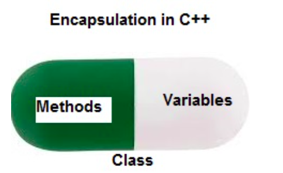

      Инкапсуляция также приводит к абстрагированию или сокрытию данных. Поскольку использование инкапсуляции также
      скрывает данные. В приведенном выше примере данные любого раздела, такого как продажи, финансы или счета, скрыты
      от любого другого раздела. В C++ инкапсуляция может быть реализована с использованием [модификаторов класса и
      доступа](https://www.geeksforgeeks.org/access-modifiers-in-c/). Посмотрите на приведенную ниже программу:

      ```c++
      // c++ program to explain
      // Encapsulation

      #include<iostream>
      using namespace std;

      class Encapsulation
      {
          private:
          // data hidden from outside world
          int x;

	  public:
		  // function to set value of
		  // variable x
		  void set(int a)
		  {
			  x =a;
		  }
		
		  // function to return value of
		  // variable x
		  int get()
		  {
			  return x;
		  }
      };

      // main function
      int main()
      {
          Encapsulation obj;

	      obj.set(5);
	
	      cout<<obj.get();
	      return 0;
      }

      ```

      В приведенной выше программе переменная x сделана частной. К этой переменной можно получить доступ и управлять ею
      только с помощью функций get() и set(), которые присутствуют внутри класса. Таким образом, мы можем сказать, что
      здесь переменная x и функции get() и set() связаны вместе, что является ничем иным, как инкапсуляцией.

      ##### Роль спецификаторов доступа в инкапсуляции

      Как мы видели в приведенном выше примере, спецификаторы доступа играют важную роль в реализации инкапсуляции в
      C++.
      Процесс реализации инкапсуляции можно разделить на два этапа:

        - Члены данных должны быть помечены как частные с помощью спецификаторов частного доступа.
        - Функция-член, которая манипулирует элементами данных, должна быть помечена как общедоступная с помощью
          спецификатора
          открытого доступа.

    </details>

  ---

  #### 57. Какие есть встроенные типы в С++?

    - <details><summary>Ответ:</summary>

        - integral type;
        - signed type;
        - arithmetic type;
        - fundamental type;
        - scalar type;
        - standard layout type;
        - trivially copyable type;
        - POD type;
        - trivial type;

      Идея объекта в C++ не такая, как в большинстве других языков, и уж точно не такая, как обычно используется в
      кругах объектно-ориентированного программирования . Объект в C++ — это область хранения.

      Если что-то имеет тип, это либо объект, либо ссылка, либо функция.

      `Какой заголовочный файл показывает, что это такое?`

      Язык просто требует, чтобы тип `int` существовал и имел определенные характеристики (например, целостность и
      наличие
      знака).
      Все известные мне компиляторы просто специально обрабатывают все встроенные типы, и поэтому вы не найдете их
      определения в заголовках стандартных библиотек. На самом деле, они не могут предоставить их определение ни в одном
      заголовке, используя C++, потому что язык не предоставляет никаких средств для определения фундаментальных типов.
      Они
      могли только либо:

      определить его как составной тип (что было бы неправильно); или же
      определите его, используя расширения, специфичные для компилятора.
      Встроенные типы фактически волшебны.

    </details>

  ---

  #### 58. Что такое enum?

    - <details><summary>Ответ:</summary>

      Перечислимый тип (`enum`) — это определяемый пользователем тип данных, которому могут быть присвоены некоторые
      ограниченные значения. Эти значения определяются программистом во время объявления перечисляемого типа.

      Если мы присвоим значение с плавающей запятой в символьном значении, то компилятор выдаст ошибку. Точно так же,
      если мы попытаемся присвоить перечисленным типам данных любое другое значение, компилятор выдаст ошибку. Типы
      значений перечислителя также известны как перечислители. Он также присваивается нулем так же, как и массив. Его
      также можно использовать с операторами switch.
      *Например*: если гендерная переменная создана со значением «мужской» или «женский». Если присваивается какое-либо
      другое значение, кроме мужского или женского, то это не подходит. В этой ситуации можно объявить перечисляемый
      тип, в котором присваиваются только мужские и женские значения.

      Синтаксис:

      `enum enumerated-type-name{value1, value2, value3…..valueN};`

      Ключевое слово enum используется для объявления перечисляемых типов после того, как это имя перечисляемого типа
      было написано, а затем в фигурных скобках определяются возможные значения. После определения переменных типа
      Enumerated создаются. Он может быть создан в двух типах: -

        - Его можно объявить при объявлении перечисляемых типов, достаточно добавить имя переменной перед точкой с
          запятой.
          или же,
        - Кроме того, мы можем создавать переменные перечисляемого типа так же, как и обычные переменные.

      `enumerated-type-name variable-name = value;`

      По умолчанию начальное кодовое значение первого элемента перечисления равно 0 (как и в случае с массивом). Но его
      можно изменить явно.
      Например: `enum перечислимое-тип-имя{значение1=1, значение2, значение3};`
      И последовательные значения перечисления будут иметь следующий набор кодовых значений.

      Например:

      ```c++
      //first_enum is the enumerated-type-name
      enum first_enum{value1=1, value2=10, value3};

      In this case,
      first_enum e;
      e=value3;
      cout<<e;

      Output:
      11
      ```
      ```c++
      #include <bits/stdc++.h>
      using namespace std;
 
      int main()
      {
          // Defining enum Gender
          enum Gender { Male, Female };

	      // Creating Gender type variable
	      Gender gender = Male;

	      switch (gender)
	      {
	          case Male:
		          cout << "Gender is Male";
		          break;
	          case Female:
		          cout << "Gender is Female";
		          break;
	          default:
		          cout << "Value can be Male or Female";
	      }
	      return 0;
      }

      ```
    </details>

  ---

  #### 59. Как соотносится класс и объект?

    - <details><summary>Ответ:</summary>

      Можете ли вы объяснить связь между классом и объектом? Объясните на примере
      Класс определяет свойства и поведение объектов, представленных абстракцией. Абстракция — это свойство
      объектно-ориентированного программирования. Он обозначает основные свойства и поведение объекта. Он скрывает код и
      данные. Таким образом, класс обозначает категорию объектов и выступает в качестве плана для создания таких
      объектов. Объект демонстрирует свойство и поведение, определенные его классом. Как правило, объект является
      экземпляром класса.

      For example:

      ```c++
      // program for adding two numbers

      class sum //declaration of a class 
      {
          int a=10; //declaration of variables
          int b=20;
          int c;
          public void add()// defining a function
          {
              c=a+b;
          System.out.println("The sum is="+c);
          }
          public static void main(String args[])// main function
          {
          sum s= new sum();// making a object of class sum
          s.add();
          //accessing the function with the help of object
          }
      };
      ```

      <details><summary>Неважный ответ:</summary>

      Чтобы ответить на вопрос, спросим у друга: "Что мы называем предметом в реальном мире ?" Оказывается все может
      быть и есть объект ! Деревья, животные , города, автомобили, люди... Даже деятельность можно свести к форме
      объектов! В программировании объектом может быть любое существо, о чем мы думаем. Создавая «мир», вы можете
      создать объект, использование которого будет более «осязаемый» ряд параметров, разбросанных по разным
      переменным. Оно отличается от структурного программирования объектно-ориентированным программированием . Прежде
      чем создавать объект , необходимо определить, что это за объект ? Что он представляет ? Какая это модель ? В
      зависимости от того, хотите ли вы создать виртуальный автомобиль или самолет , вы должны указать две вещи: » Какие
      свойства - характеристики будут иметь это свойство (например , длина) » Какой будет метод работы. (напр .
      акселератор как функция акселератора) Поэтому перед созданием любого объекта необходимо представить компилятору
      его конструкцию (паттерн ), определяющую его класс. Таким образом, класс является объектом программирования и
      определяет, какие свойства и методы будут иметь объекты, которые будет создан на его основе. Однако сам проект
      опять не сделает, чтобы мы получили объекты. Вам по-прежнему необходимо создать объект, что означает простое
      объявление объекта на основе определенного класса.

      </details>

    </details>

  ---

  #### 60. Какая разница между структурой и классом?

    - <details><summary>Ответ:</summary>

      Class:
        - Он определяется с помощью ключевого слова class.
        - Когда данные определены в классе, они сохраняются в памяти как ссылка.
        - Он получает память, выделяемую только тогда, когда создается объект этого класса.
        - Ссылочный тип (до создания объекта) размещается в куче памяти.
        - Они могут иметь конструкторы и деструкторы.
        - Он может использовать наследование для наследования свойств от базового класса.
        - Модификатор доступа «защищенный» можно использовать с элементами данных, определенными внутри класса.

      Struct:
        - Ключевое слово struct используется для определения структуры.
        - Каждому члену в структуре предоставляется уникальная ячейка памяти.
        - Когда значение одного элемента данных изменяется, это не влияет на другие элементы данных в структуре.
        - Это помогает инициализировать несколько элементов одновременно.
        - Общий размер структуры эквивалентен сумме размеров каждого члена данных.
        - Он используется для хранения различных типов данных.
        - Требуется память для каждого члена, присутствующего в структуре.
        - Участник может быть извлечен за один раз.
        - Он поддерживает гибкие массивы.
        - Его экземпляр может быть создан без ключевого слова.
        - Он не поддерживает защищенный модификатор доступа.
        - Он не поддерживает наследование.
        - У него нет конструктора или деструктора.
        - Значения, присвоенные структурам, хранятся в памяти стека.

      В C++ структуры и классы почти одинаковы; единственное отличие состоит в том, что модификаторы доступа (для
      переменных-членов, методов и базовых классов) в классах по умолчанию имеют значение private, а модификаторы
      доступа в структурах — общедоступные.

      Однако в C структура представляет собой просто агрегированный набор (общедоступных) данных и не имеет других
      класс оподобных функций: никаких методов, конструктора, базовых классов и т. д. Хотя C++ унаследовал ключевое
      слово, он расширил семантику. (Однако именно поэтому по умолчанию используются общедоступные структуры in —
      структура, написанная как структура C, ведет себя так же.)

      Хотя в C можно подделать некоторые ООП — например, определить функции, которые все принимают указатель на
      структуру в качестве своего первого параметра, или иногда принуждая структуры с одними и теми же первыми
      несколькими полями быть «подклассами / суперклассами» — это всегда своего рода прикручено и на самом деле не
      является частью языка.

    </details>

  ---

  #### 61. Разница между private/protected/public и где они используются?

    - <details><summary>Ответ:</summary>

      `Public` член доступен из любого места за пределами класса, но внутри программы. Вы можете установить и получить
      значение общедоступных переменных без какого-либо члена.

      `Protected` Доступ к закрытой переменной-члену или функции невозможен, или даже просмотрен из-за пределов класса.
      Доступ к закрытым
      членам имеют только функции класса и друга.

      `Private` переменная или функция-член очень похожа на закрытый член, но предоставляет одно дополнительное
      преимущество,
      заключающееся в том, что к ним можно получить доступ в дочерних классах, которые называются производными классами.

    </details>

  ---

  #### 62. Какие методы класса являются стандартными для класса?

    - <details><summary>Ответ:</summary>

      В С++ 03 их 4:

      Конструктор по умолчанию:
        - объявляется, только если не объявлен пользовательский конструктор. Определяется при
          использовании
        - Конструктор копирования - объявляется только в том случае, если пользователь его не объявил. Определяется,
          если
          используется

        - Оператор копирования-присваивания такой же, как и выше

        - Деструктор такой же, как и выше

      В C++11 есть еще два:

        - Move конструктор
        - Оператор перемещения-присваивания
          Также возможно, что компилятор не сможет сгенерировать некоторые из них. Например, если класс содержит,
          например,
          ссылку (или что-то еще, что нельзя присвоить копированию), то компилятор не сможет сгенерировать для вас
          оператор
          присваивания
          копирования. [Для получения дополнительной информации прочитайте](https://en.cppreference.com/w/cpp/language/classes)

    </details>

  ---

  #### 63. Что такое абстрактный класс и зачем он?

    - <details><summary>Ответ:</summary>

      Абстрактные классы действуют как выражения общих понятий, из которых могут быть получены более конкретные классы.
      Вы не можете создать объект типа абстрактного класса. Однако вы можете использовать указатели и ссылки на типы
      абстрактных классов.

      Вы создаете абстрактный класс, объявляя хотя бы одну чисто виртуальную функцию-член. Это виртуальная функция,
      объявленная с использованием чистого= 0 синтаксиса спецификатора ( ). Классы, производные от абстрактного класса,
      должны реализовывать чисто виртуальную функцию, иначе они тоже являются абстрактными классами.

      Рассмотрим пример, представленный в Виртуальные функции. Цель класса `Account` предоставить общую
      функциональность, но объекты типа `Account` слишком общие, чтобы быть полезными. Это означает Account, что это
      хороший кандидат для абстрактного класса:

      ```c++
      // deriv_AbstractClasses.cpp
      // compile with: /LD
      class Account {
      public:
         Account( double d );   // Constructor.
         virtual double GetBalance();   // Obtain balance.
         virtual void PrintBalance() = 0;   // Pure virtual function.
      private:
         double _balance;
      };
      ```

      Единственная разница между этим объявлением и предыдущим состоит в том, что PrintBalanceоно объявлено с помощью
      спецификатора pure ( = 0).

      ##### Ограничения на абстрактные классы
        - классы нельзя использовать для:
        - Переменные или данные-члены
        - Типы аргументов
        - Типы возвращаемых функций
        - Типы явных преобразований

      Если конструктор абстрактного класса вызывает чисто виртуальную функцию прямо или косвенно, результат не
      определен.
      Однако конструкторы и деструкторы абстрактных классов могут вызывать другие функции-члены.

      Назначение абстрактного класса — определить общий протокол для набора конкретных подклассов. Это полезно при
      определении объектов, которые имеют общий код, абстрактные идеи и т. д.

      Абстрактные классы не имеют экземпляров. Абстрактный класс должен иметь хотя бы один отложенный метод (или
      функцию). Для этого в C++ объявляется чистая виртуальная функция-член, но не определяется в абстрактном классе:

      ```c++
      class MyClass {
         virtual void pureVirtualFunction() = 0;
      };
      ```

      Попытки создать экземпляр абстрактного класса всегда будут приводить к ошибке компилятора.

      «Что дает определение абстрактного базового класса, чего не дает создание каждой необходимой функции в каждом
      реальном
      классе?»

      Основная идея здесь — повторное использование кода и правильное разделение по классам. Имеет смысл определить
      функцию
      один раз в родительском классе, а не определять ее снова и снова в нескольких подклассах:

      ```c++
      class A {
          void func1();
          virtual void func2() = 0;
      };

      class B : public A {
          // inherits A's func1()
          virtual void func2(); // Function defined in implementation file
      };

      class C : public A {
          // inherits A's func1()
          virtual void func2(); // Function defined in implementation file
      }
    </details>

  ---

  #### 64. Сколько памяти занимает объект пустого класса class A {}; ?

    - <details><summary>Ответ:</summary>

      Цитируя часто задаваемые вопросы по стилю и
      технике [Бьёрна Страуструпа](https://www.stroustrup.com/bs_faq2.html#sizeof-empty), причина, по которой размер не
      равен нулю,
      заключается в том, чтобы «гарантировать, что адреса двух разных объектов будут разными». И размер может быть 1,
      потому что выравнивание здесь не имеет значения, так как не на что смотреть.

    </details>

  ---

  #### 65. Что случится с функцией, если к ней добавить ключевое слово static? В контексте члена класса? В контексте метода класса?

    - <details><summary>Ответ:</summary>

      ##### Статические переменные в функции:
      когда переменная объявлена как статическая, место для нее выделяется на время
      жизни
      программы. Даже если функция вызывается несколько раз, место для статической переменной выделяется только один
      раз, и
      значение переменной в предыдущем вызове передается через следующий вызов функции. Это полезно для реализации
      сопрограмм
      на C/C++ или в любом другом приложении, где необходимо сохранить предыдущее состояние функции.

      ```c++
      // C++ program to demonstrate
      // the use of static Static
      // variables in a Function
      #include <iostream> 
      #include <string>
      using namespace std;

      void demo()
      {
          // static variable
          static int count = 0;
          cout << count << " ";

	      // value is updated and
	      // will be carried to next
	      // function calls
	      count++;
      }

      int main()
      {
          for (int i=0; i<5; i++)
          demo();
          return 0;
      }
      ```

      Вы можете видеть в приведенной выше программе, что переменная count объявлена как статическая. Таким образом,
      его значение передается через вызовы функций. Переменная count не инициализируется при каждом вызове функции.

      #### Статические переменные в классе:
      поскольку переменные, объявленные как статические, инициализируются только один раз, поскольку им выделяется место
      в отдельном статическом хранилище, статические переменные в классе совместно используются объектами. Не может быть
      нескольких копий одних и тех же статических переменных для разных объектов. Также по этой причине статические
      переменные нельзя инициализировать с помощью конструкторов.

      ```c++
      // C++ program to demonstrate static
      // variables inside a class

      #include<iostream>
      using namespace std;

      class GfG
      {
      public:
          static int i;

          GfG()
          {
              // Do nothing
          };
      };

      int main()
      {
          GfG obj1;
          GfG obj2;
          obj1.i =2;
          obj2.i = 3;

          // prints value of i
          cout << obj1.i<<" "<<obj2.i;   
      }
      ```
      Вы можете видеть в приведенной выше программе, что мы попытались создать несколько копий статической переменной i
      для нескольких объектов. Но этого не произошло. Таким образом, статическая переменная внутри класса должна быть
      явно инициализирована пользователем с использованием имени класса и оператора разрешения области действия вне
      класса, как показано ниже

      ##### Объекты класса как статические:
      так же, как и переменные, объекты, объявленные как статические, имеют область действия до времени жизни программы.
      Рассмотрим приведенную ниже программу, в которой объект не является статическим.

      ```c++
      // CPP program to illustrate
      // when not using static keyword
      #include<iostream>
      using namespace std;

      class GfG
      {
          int i;
          public:
          GfG()
          {
              i = 0;
              cout << "Inside Constructor\n";
          }
          ~GfG()
          {
               cout << "Inside Destructor\n";
          }
      };

      int main()
      {
          int x = 0;
          if (x==0)
          {
              GfG obj;
          }
          cout << "End of main\n";
      }
      ```

      *Зависит от контекста:*

      Как и многие вещи в C++, `static` означает разные вещи в зависимости от контекста.

      В C++ очень часто одно и то же слово может означать разные вещи в зависимости от его контекста.

      Например:

      `*` используется для умножения, разыменования указателя и создания указателей.
      `&` используется для получения адреса переменных, для объявления ссылки и в качестве побитового оператора AND.
      Глобальное использование статики:

      Если вы объявляете функцию или переменную статической вне класса и в глобальной области видимости, она относится
      только
      к этому файлу. Если вы попытаетесь использовать эту переменную или функцию в другом файле (через предварительное
      объявление), вы получите ошибку связывания.

      Пример:

      ```c++
      // a.cpp:

      static void fn()
      {
          cout<<"hello a!"<<endl;
      }
      
      // b.cpp:

      void fn();
      void gn()
      {
         fn();//causes linking error
      }
      ```

      Эта функция позволяет вам использовать функцию, которую ни один другой файл никогда не увидит, таким образом, вы
      не
      вызовете возможных ошибок компоновщика символа, определенного несколько раз. Однако предпочтительный способ
      сделать это
      с анонимными пространствами имен:

      ```c++
      // a.cpp:

      namespace
      {
          void fn() // will be static to a.cpp
          {
          cout<<"hello a!"<<endl;
          }
      }
      ```

      Внутри класса использование статического:

      Если вы объявляете функцию или переменную статической внутри класса (или структуры), это функция класса или
      переменная
      класса. Это означает, что существует только один для всего класса. Функция класса может использовать только
      переменные
      класса. Переменная класса является общей для всех экземпляров этого класса.

      ```c++
      class C
      {
      public:
          static void fn()
          {
              y = 4;//<--- compiling error
              // can't access member variable within a static function.
          }

          int y;
      };
      ```

      Это отличная функция, которую можно использовать, если у вас есть что-то, относящееся к классу ваших объектов, но
      не
      относящееся к экземпляру.

      Внутри функции использование статики:

      Если вы объявляете переменную статической внутри функции, вы можете считать, что значение переменной будет
      сохраняться
      при вызовах. Он будет инициализирован только один раз.

      Пример:

      ```c++
      //Will print 0, then 1, then 2, ...
      void persistentPrintX()
      {
          static int x = 0;
          cout << x << endl;
          x++;
      }
      ```

      Я лично стараюсь избегать этого, и вам, вероятно, следует. Нехорошо иметь глобальное состояние. Лучше иметь
      функции,
      которые при одинаковых входных данных гарантируют одинаковый результат.

      Как и в английском языке:

      Концепция контекстно-зависимого значения не специфична для C++, вы даже можете увидеть ее в английском языке.

      Я иду в `screen` кино (Означает показ фильма)
      На `screen` телевизоре сломан (означает, что это часть телевизора)
      Другие значения в других языках программирования:

      В зависимости от языка программирования может быть разное значение, но первое, о чем думает большинство людей,
      когда вы
      говорите static, это переменная/функция класса против переменной/функции-члена.

    </details>

  ---

  #### 66. Какие особенности статических полей класса?

    - <details><summary>Ответ:</summary>
      Ответ требует доработки:
    </details>

  ---

  #### 67. Какая особенность константных методов-членов класса?

    - <details><summary>Ответ:</summary>

      Пример методы класса:

      ```c++
      class Foo {
      private:
          int n;
      public:
          void f(int n) const {
          n = 6 // Error;
          } 
      }
      ```

      ```c++
      Пример члены класса:
      class Foo {
      private:
      const int n;
      public:
      void f(int n) {
      n = 6 // Error;
      }
      }
      ```
      Константные члены класса инициализируется один раз при обяление класса. больше не меняется.

     </details>

  ---

  #### 68. Как изменить поле класса в константном методе класса?

    - <details><summary>Ответ:</summary>

      ```c++
      class A (){
          mutable int x; // Обяавить как Mutable
      public:
          void func () const {
          // И вот здесь можно менять)
          }
      };
      ```

      Хотя это не приветствуется, но C++ предоставляет «черные ходы», которые можно использовать для нарушения его
      собственных правил, точно так же, как грязные трюки с указателями. В любом случае вы можете легко сделать это,
      используя приведенную версию указателя `this`:

      ```c++
      class A (){
           int x;
        public:
           void func () const {
              //change value of x here
         A* ptr =  const_cast<A*> (this);
         ptr->x= 10;     // Вот здесь 
        }
      }
      ```

    </details>

  --- 

  #### 69. Какие методы можно вызвать из константных объектов?

    - <details><summary>Ответ:</summary>

      Константные функции-члены в C++

      Объяснение:

      Объект, вызываемый этими функциями, не может быть изменен. Рекомендуется использовать ключевое слово const, чтобы
      избежать случайных изменений объекта. Константная функция-член может быть вызвана объектом любого типа .
      _Неконстантные_
      функции могут вызываться только _неконстантными_ объектами.

    </details>

  ---

  #### 70. Что такое куча и стек? Различия, принцип работы.

    - <details><summary>Ответ:</summary>

      ##### Что такое стек?
      Стек — это специальная область памяти компьютера, в которой хранятся временные переменные, созданные функцией. В
      стеке переменные объявляются, сохраняются и инициализируются во время выполнения.

      Это временное запоминающее устройство. Когда вычислительная задача будет завершена, память переменной будет
      автоматически стерта. Раздел стека в основном содержит методы, локальную переменную и ссылочные переменные.

      ##### Что такое куча?
      Куча — это память, используемая языками программирования для хранения глобальных переменных. По умолчанию все
      глобальные переменные хранятся в куче памяти. Он поддерживает динамическое выделение памяти.

      Куча не управляется автоматически для вас и не так жестко управляется процессором. Это больше похоже на свободно
      плавающую область памяти.

      ##### КЛЮЧЕВОЕ ОТЛИЧИЕ
      Стек — это линейная структура данных, а куча — иерархическая структура данных.
      Память стека никогда не будет фрагментирована, тогда как память кучи может стать фрагментированной, поскольку
      блоки памяти сначала выделяются, а затем освобождаются.
      Stack имеет доступ только к локальным переменным, в то время как Heap позволяет вам обращаться к переменным
      глобально.
      Переменные стека не могут быть изменены, тогда как переменные кучи могут быть изменены.
      Память стека выделяется в непрерывном блоке, тогда как память кучи выделяется в любом случайном порядке.
      Стек не требует де-распределения переменных, тогда как в куче де-распределение необходимо.
      Выделение и освобождение стека выполняются инструкциями компилятора, тогда как выделение и освобождение кучи
      выполняется программистом.

    </details>

  ---

  #### 71. В чем разница между указателем и ссылкой?

    - <details><summary>Ответ:</summary>

        - Указатель может быть переназначен:

      ```c++
      int x = 5;
      int y = 6;
      int *p;
      p = &x;
      p = &y;
      *p = 10;
      assert(x == 5);
      assert(y == 10);
      ```

      Ссылка не может быть повторно привязана и должна быть связана при инициализации:

      ```c++
      int x = 5;
      int y = 6;
      int &q; // error
      int &r = x;
      ```

        - Переменная-указатель имеет свою собственную идентичность: отдельный видимый адрес памяти, который можно
          получить с помощью унарного `&` оператора, и определенный объем памяти, который можно измерить с помощью
          `sizeof` оператора. Использование этих операторов для ссылки возвращает значение, соответствующее тому, к чему
          привязана ссылка; собственный адрес и размер ссылки невидимы. Поскольку таким образом ссылка предполагает
          идентичность исходной переменной, удобно думать о ссылке как о другом имени той же самой переменной.

      ```c++
      int x = 0;
      int &r = x;
      int *p = &x;
      int *p2 = &r;

      assert(p == p2); // &x == &r
      assert(&p != &p2);
      ```

        - Вы можете иметь произвольно вложенные указатели на указатели, предлагающие дополнительные уровни косвенности.
          Ссылки предлагают только один уровень косвенности.

      ```c++
      int x = 0;
      int y = 0;
      int *p = &x;
      int *q = &y;
      int **pp = &p;

      **pp = 2;
      pp = &q; // *pp is now q
      **pp = 4;

      assert(y == 4);
      assert(x == 2);
      ```
        - Указатель может быть назначен `nullptr`, тогда как ссылка должна быть привязана к существующему объекту. Если
          вы
          достаточно постараетесь, вы можете привязать ссылку к `nullptr`, но это
          не [определено](https://stackoverflow.com/questions/2397984/undefined-unspecified-and-implementation-defined-behavior)
          и не будет вести себя
          последовательно.

      ```c++
      /* the code below is undefined; your compiler may optimise it
      * differently, emit warnings, or outright refuse to compile it */

      int &r = *static_cast<int *>(nullptr);

      // prints "null" under GCC 10
      std::cout << (&r != nullptr ? "not null" : "null") << std::endl;

      bool f(int &r) { return &r != nullptr; }

      // prints "not null" under GCC 10
      std::cout << (f(*static_cast<int *>(nullptr)) ? "not null" : "null") << std::endl;
      ```
      Однако вы можете иметь ссылку на указатель, значение которого равно `nullptr`.

        - Указатели могут перебирать массив; вы можете использовать `++` для перехода к следующему элементу, на который
          указывает
          указатель, и `+4` для перехода к `5-му` элементу. Это не имеет значения, какого размера объект, на который
          указывает
          указатель.

        - Указатель необходимо разыменовать `*`, чтобы получить доступ к ячейке памяти, на которую он указывает, тогда
          как
          ссылку
          можно использовать напрямую. Указатель на класс/структуру используется `->` для доступа к его членам, тогда
          как
          ссылка
          использует файл `..`

        - Ссылки нельзя помещать в массив, тогда как указатели можно

        - Постоянные ссылки могут быть привязаны к временным. Указатели не могут (не без некоторой косвенности):

        ```c++
        const int &x = int(12); // legal C++
        int *y = &int(12); // illegal to take the address of a temporary.
        ```

      Это делает const &более удобным использование в списках аргументов и т.д.

    </details>

  ---

  #### 72. Для чего нужен указатель на функцию? Как его объявить?

    - <details><summary>Ответ:</summary>

      В `C++`(`Здесь формально имеется ввиду язык си`), подобно обычным указателям данных (int *, char * и т. д.), мы
      можем иметь указатели на функции. Ниже
      приведен простой пример, демонстрирующий объявление и вызов функции с использованием указателя на функцию.

      ```c++
      #include <stdio.h>
      // A normal function with an int parameter
      // and void return type
      void fun(int a)
      {
          printf("Value of a is %d\n", a);
      }

      int main()
      {
          // fun_ptr is a pointer to function fun()
          void (*fun_ptr)(int) = &fun;

          /* The above line is equivalent of following two
          void (*fun_ptr)(int);
          fun_ptr = &fun; 
          */
  
          // Invoking fun() using fun_ptr
          (*fun_ptr)(10);
  
          return 0;
      }
      ```

      Зачем нам нужны дополнительные скобки вокруг указателей функций, таких как fun_ptr в приведенном выше примере?
      Если мы удалим скобку, то выражение `void (*fun_ptr)(int)` станет `void *fun_ptr(int)`, что является объявлением
      функции, возвращающей указатель void. Подробности смотрите в следующем посте.

        - <details><summary>Как объявить указатель на функцию?</summary>

          Итак, мы предполагаем, что вы знаете, что означает указатель в C. Итак, как же нам создать указатель на целое
          число в C?
          Хм.. это довольно просто..

          ````
          int * ptrInteger; /*We have put a * operator between int 
                    and ptrInteger to create a pointer.*/
          ````

          Здесь `ptrInteger` — указатель на целое число. Если вы это понимаете, то по логике у нас не должно возникнуть
          проблем с объявлением указателя на функцию🙂

          ```c++
          #include <stdio.h>
          // A normal function with an int parameter
          // and void return type

          void fun(int a) {
              printf("Value of a is %d\n", a);
          }
          int main() {
              void(*fun_ptr)(int) = &fun;

              (*fun_ptr)(10);

          }
          ```
          Итак, давайте сначала посмотрим... как мы объявляем функцию? Например,

          `int foo(int);`

          Здесь foo — функция, которая возвращает int и принимает один аргумент типа int. Итак, как подумает логичный
          парень, поместив оператор * между int и foo(int) должен создать указатель на функцию, т.е.

          `int * foo(int);`

          Но здесь также играет роль приоритет оператора Oops..C .. поэтому в этом случае оператор () будет иметь
          приоритет над оператором *. И вышеприведенное объявление будет означать – функция foo с одним аргументом типа
          int и возвращаемым значением int * т.е. целочисленный указатель. Так что он сделал что-то, что мы не хотели
          делать.🙁

          Поэтому в качестве следующего логического шага мы должны каким-то образом связать оператор * с foo. И для
          этого мы бы изменили приоритет операторов C по умолчанию, используя оператор ().

          `int (*foo)(int);`

          Вот и все. Здесь оператор * с foo, который является именем функции. И он сделал то, что мы хотели сделать.

          Так что это было не так сложно, как мы думали раньше!
          </details>
      *Ниже приведены некоторые интересные факты об указателях на функции.*

        1) В отличие от обычных указателей, указатель на функцию указывает на код, а не на данные. Обычно указатель на
           функцию хранит начало исполняемого кода.

        2) В отличие от обычных указателей, мы не выделяем `de-allocate` память с помощью указателей на функции.

        3) Имя функции также можно использовать для получения адреса функции. Например, в приведенной ниже программе
           мы удалили оператор адреса '&' в присваивании. Мы также изменили вызов функции, удалив *, программа все
           еще работает.

           ```c++
           #include <stdio.h>
           // A normal function with an int parameter
           // and void return type
           void fun(int a)
           {
               printf("Value of a is %d\n", a);
           }

           int main()
           {
               void (*fun_ptr)(int) = fun;  // & removed

               fun_ptr(10);  // * removed
  
               return 0;
           }
           ```
        4) Как и обычные указатели, мы можем иметь массив указателей на функции. Ниже пример в пункте 5 показывает
           синтаксис для массива указателей.

        5) Указатель функции можно использовать вместо корпуса переключателя. Например, в приведенной ниже программе
           пользователю предлагается выбрать между 0 и 2 для выполнения разных задач.

           ```c++
           #include <stdio.h>
           void add(int a, int b)
           {
               printf("Addition is %d\n", a+b);
           }
           void subtract(int a, int b) 
           {
               printf("Subtraction is %d\n", a-b);
           }
           void multiply(int a, int b)
           {
           printf("Multiplication is %d\n", a*b);
           }

           int main()
           {
               // fun_ptr_arr is an array of function pointers
               void (*fun_ptr_arr[])(int, int) = {add, subtract, multiply};
               unsigned int ch, a = 15, b = 10;

               printf("Enter Choice: 0 for add, 1 for subtract and 2 "
               "for multiply\n");
               scanf("%d", &ch);
  
               if (ch > 2) return 0;
  
               (*fun_ptr_arr[ch])(a, b);
  
               return 0;
           }
           ```
        6) Как и обычные указатели данных, указатель функции может быть передан в качестве аргумента, а также может быть
           возвращен из функции.
           Например, рассмотрим следующую программу на C, где wrapper() получает в качестве параметра void fun() и
           вызывает переданную функцию

           ```c++
           // A simple C program to show function pointers as parameter
           #include <stdio.h>

           // Two simple functions
           void fun1() { printf("Fun1\n"); }
           void fun2() { printf("Fun2\n"); }

           // A function that receives a simple function
           // as parameter and calls the function
           void wrapper(void (*fun)())
           {
               fun();
           }

           int main()
           {
               wrapper(fun1);
               wrapper(fun2);
               return 0;
           }
           ```
           Этот момент особенно полезен в C. В C мы можем использовать указатели на функции, чтобы избежать избыточности
           кода. Например, простая функция qsort() может использоваться для сортировки массивов в порядке возрастания
           или убывания или в любом другом порядке в случае массива структур. Мало того, с указателями на функции и
           указателями void можно использовать qsort для любого типа данных.

           ```c++
           // An example for qsort and comparator
           #include <stdio.h>
           #include <stdlib.h>

           // A sample comparator function that is used
           // for sorting an integer array in ascending order.
           // To sort any array for any other data type and/or
           // criteria, all we need to do is write more compare
           // functions.  And we can use the same qsort()
           int compare (const void * a, const void * b)
           {
           return ( *(int*)a - *(int*)b );
           }

           int main ()
           {
               int arr[] = {10, 5, 15, 12, 90, 80};
               int n = sizeof(arr)/sizeof(arr[0]), i;

               qsort (arr, n, sizeof(int), compare);

               for (i=0; i<n; i++)
               printf ("%d ", arr[i]);
               return 0;
           }
           ```
           Подобно qsort(), мы можем написать свои собственные функции, которые можно использовать для любого типа
           данных и выполнять разные задачи без избыточного кода. Ниже приведен пример функции поиска, которую можно
           использовать для любого типа данных. На самом деле мы можем использовать эту функцию поиска, чтобы найти
           близкие элементы (ниже порога), написав специальную функцию сравнения.

           ```c++
           #include <stdio.h>
           #include <stdbool.h>

           // A compare function that is used for searching an integer
           // array
           bool compare (const void * a, const void * b)
           {
               return ( *(int*)a == *(int*)b );
           }

               char *ptr = (char *)arr;

               int i;
               for (i=0; i<arr_size; i++)
                   if (compare(ptr + i*ele_size, x))
               return i;
  
               // If element not found
           return -1;
           }

           int main()
           {
              int arr[] = {2, 5, 7, 90, 70};
              int n = sizeof(arr)/sizeof(arr[0]);
              int x = 7;
              printf ("Returned index is %d ", search(arr, n, sizeof(int), &x, compare));
              return 0;
           }
           ```
           Приведенную выше функцию поиска можно использовать для любого типа данных, написав отдельный настраиваемый
           метод compare().
        7) Многие объектно-ориентированные функции в C++ реализованы с использованием указателей функций в C.
           Например, [виртуальные функции](https://www.geeksforgeeks.org/virtual-functions-and-runtime-polymorphism-in-cpp/)
           Методы класса — еще один пример реализации с использованием указателей на функции. Обратитесь
           к [этой книге](https://www.cs.rit.edu/~ats/books/ooc.pdf) за более подробной информацией.
    </details>

  ---

  #### 73. Что будет, если забыть вызвать delete? Когда освободится эта память?

    - <details><summary>Ответ:</summary>

      *Концептуально* вы теряете память.

      На практике:

      Все зависит от того, что делает ваша программа и сколько памяти она использует - в любой момент времени и в целом
      на протяжении всего времени выполнения.

      Скажем, например, вы пишете почтовый сервер, который выделяет память для хранения каждого получаемого письма. Но
      на
      самом деле ему не нужно хранить каждое электронное письмо, которое проходит через него. Таким образом, после
      нескольких
      дней получения и пересылки электронных писем почтовый сервер больше не может выделять память, он использует каждый
      доступный байт памяти, но на самом деле он не делает ничего полезного с этой памятью, поскольку электронные письма
      больше не используются. - с ними разобрались.

      С другой стороны, если мы напишем нашу программу почтового сервера, которая выделяет, скажем, 1 МБ буфера для
      чтения в
      электронном письме, обрабатывает его, а когда это делается, память повторно используется для другого электронного
      письма, то нет особого смысла освобождать эта память, когда-либо.

      И если мы напишем программу, которая просто читает файл, загружает весь файл в память, и когда она подсчитывает
      все
      буквы для статистических целей, печатает статистику и завершает работу, независимо от того, выделяет ли это много
      памяти
      или нет, на самом деле это не так.

      Конечно, все это предполагает, что вызов `new` ПРОСТО предназначен для выделения памяти. Если конструктор объекта
      делает
      что-то более сложное, например открывает файл, получает блокировку или что-то еще, то довольно скоро могут
      произойти
      всевозможные плохие вещи, если деструктор не вызывается.

      ОС (для широко используемых ОС, таких как `Linux`, `macOS`, `iOS`, других `Unix-систем`, `Windows`, `DOS`, `OS/2`
      и т.
      д.) освобождает
      память, используемую вашим приложением.

    </details>

  ---

  #### 74. Что такое умный указатель? Какие умные указатели есть в стандартной библиотеке?

    - <details><summary>Ответ:</summary>

      ```c++
      std::unique_ptr;
      std::shared_ptr;
      std::weak_ptr;
      ```
      ##### Что такое умный указатель?
      Это тип, значения которого можно использовать как указатели, но который предоставляет дополнительную функцию
      автоматического управления памятью: когда интеллектуальный указатель больше не используется, память, на которую он
      указывает, освобождается (см. также более подробное определение
      в [Википедии](https://ru.wikipedia.org/wiki/%D0%A3%D0%BC%D0%BD%D1%8B%D0%B9_%D1%83%D0%BA%D0%B0%D0%B7%D0%B0%D1%82%D0%B5%D0%BB%D1%8C) )
      .
      ##### "Когда я должен использовать?"
      В коде, который включает в себя отслеживание владения частью памяти, выделение или освобождение; умный указатель
      часто
      избавляет вас от необходимости делать это явно.
      ##### «Но какой интеллектуальный указатель я должен использовать в каком из этих случаев?»

        - Используйте [std::unique_ptr](https://en.cppreference.com/w/cpp/memory/unique_ptr), когда вы хотите, чтобы ваш
          объект жил до тех пор, пока существует единственная
          ссылка на
          него. Например, используйте его для указателя на память, которая выделяется при входе в некоторую область и
          освобождается при выходе из области.
        - Используйте [std::shared_ptr](https://en.cppreference.com/w/cpp/memory/shared_ptr), когда вы хотите ссылаться
          на свой объект из нескольких мест - и не хотите, чтобы
          ваш объект
          был освобожден, пока все эти ссылки сами не исчезнут.
        - Используйте [std::weak_ptr](https://en.cppreference.com/w/cpp/memory/weak_ptr), когда вы хотите ссылаться на
          свой объект из нескольких мест - для тех ссылок, для
          которых
          можно игнорировать и освобождать (поэтому они просто заметят, что объект исчез, когда вы пытаетесь
          разыменовать).
        - Не используйте `boost::` интеллектуальные указатели или `std::auto_ptr` за исключением особых случаев, о
          которых вы
          можете
          прочитать, если необходимо.
          Есть [предложение](https://www.open-std.org/jtc1/sc22/wg21/docs/papers/2022/p2530r0.pdf)
          добавить [Hazard pointer](https://en.wikipedia.org/wiki/Hazard_pointer) в C++26, но пока у вас их нет.
          *Эй, я не спросил, какой использовать!*😁
          Ах, но ты действительно хотел, признайся.
          «Так когда же мне следует использовать обычные указатели?»
          В основном в коде, который не обращает внимания на владение памятью. Обычно это относится к функциям, которые
          получают
          указатель откуда-то еще, не выделяют и не освобождают память, а также не сохраняют копию указателя, которая
          переживает
          их выполнение.
      </details>

  ---

  #### 75. Как работает std::unique_ptr?

    - <details><summary>Ответ:</summary>

      Конструктор `std::unique_ptr<T>` принимает необработанный указатель на объект типа T(поэтому он принимает T*).

      В первом примере:
      ```c++
      std::unique_ptr<int> uptr (new int(3));
      ```

      Указатель является результатом `new` выражения, а во втором примере:

      ```c++
      unique_ptr<double> uptr2 (pd);
      ```

      Указатель хранится в `pd` переменной.

      Концептуально ничего не меняется (вы строите `unique_ptr` из необработанного указателя), но второй подход
      потенциально более опасен, поскольку он позволит вам, например, сделать:

      ```c++
      unique_ptr<double> uptr2 (pd);
      // ...
      unique_ptr<double> uptr3 (pd);
      ```

      Таким образом, имеется два уникальных указателя, которые эффективно инкапсулируют один и тот же объект (тем самым
      нарушая семантику уникального указателя).

      Вот почему первая форма для создания уникального указателя лучше, когда это возможно. Обратите внимание, что в
      C++14 мы сможем сделать:

      ```c++
      std::unique_ptr<int> p = std::make_unique<int>(42);
      ```
      Предполагается, что умные указатели моделируют владение объектом и автоматически уничтожают указанный объект,
      когда последний (умный, владеющий) указатель на этот объект выходит за пределы области видимости.

      Таким образом, вам не нужно помнить, что делать `delete` с объектами, размещенными динамически — деструктор
      интеллектуального указателя сделает это за вас — и не беспокоиться о том, не будете ли вы разыменовывать (висячий)
      указатель на объект, который уже был уничтожен:

      ```c++
      {
      unique_ptr<int> p = make_unique<int>(42);
      // Going out of scope...
      }
      // I did not leak my integer here! The destructor of unique_ptr called delete
      ```

      Теперь `unique_ptr` это интеллектуальный указатель, который моделирует уникальное владение, а это означает, что в
      любое время в вашей программе должен быть только один (владеющий) указатель на указанный объект, поэтому
      `unique_ptr` он не может быть скопирован.

      Пока вы используете интеллектуальные указатели таким образом, чтобы не нарушать неявный контракт, который они
      требуют от
      вас соблюдать, вы будете иметь гарантию, что не будет утечки памяти, и будет применяться надлежащая политика
      владения
      для вашего объекта. Необработанные указатели не дают вам этой гарантии.

      [Исходный код](https://github.com/Jollu8/Algorithms/blob/main/SmartPointes/UniquePtr.cpp)
    </details>

  ---

  #### 76. Как работает std::shared_ptr?

    - <details><summary>Ответ:</summary>

      В отличие от `std::unique_ptr`, который предназначен для единоличного владения и управления ресурсом, `std::
      shared_ptr` предназначен для решения случая, когда вам нужно несколько интеллектуальных указателей, совместно
      владеющих ресурсом.

      Это означает, что можно иметь несколько `std::shared_ptr`, указывающих на один и тот же ресурс. Внутри `std::
      shared_ptr`
      отслеживает, сколько std::shared_ptr совместно используют ресурс. Пока хотя бы один `std::shared_ptr` указывает на
      ресурс,
      ресурс не будет освобожден, даже если отдельные `std::shared_ptr` будут уничтожены. Как только последний `std::
      shared_ptr`,
      управляющий ресурсом, выходит за пределы области действия (или переназначается, чтобы указывать на что-то другое),
      ресурс будет освобожден.

      Как и `std::unique_ptr`, `std::shared_ptr` находится в заголовке `<memory>`.

      ```c++
      #include <iostream>
      #include <memory> // for std::shared_ptr

      class Resource
      {
      public:
         Resource() { std::cout << "Resource acquired\n"; }
         ~Resource() { std::cout << "Resource destroyed\n"; }
      };

      int main()
      {
          // allocate a Resource object and have it owned by std::shared_ptr
          Resource *res { new Resource };
          std::shared_ptr<Resource> ptr1{ res };
          {
          std::shared_ptr<Resource> ptr2 { ptr1 }; // make another std::shared_ptr pointing to the same thing

		  std::cout << "Killing one shared pointer\n";
	      } // ptr2 goes out of scope here, but nothing happens

          std::cout << "Killing another shared pointer\n";

          return 0;
          } // ptr1 goes out of scope here, and the allocated Resource is destroyed
      ```

      В приведенном выше коде мы создаем динамический объект `Resource` и устанавливаем `std::shared_ptr` с
      именем `ptr1` для
      управления им. Внутри вложенного блока мы используем конструктор копирования для создания второго `std::
      shared_ptr (ptr2)`, указывающего на тот же ресурс. Когда `ptr2` выходит за пределы области действия, ресурс не
      освобождается, потому что `ptr1` все еще указывает на ресурс. Когда `ptr1` выходит за пределы области
      видимости, `ptr1`
      замечает, что больше нет `std::shared_ptr`, управляющих ресурсом, поэтому он освобождает ресурс.

      Обратите внимание, что мы создали второй общий указатель из первого общего указателя. Это важно. Рассмотрим
      следующую
      аналогичную программу:

      ```c++
      #include <iostream>
      #include <memory> // for std::shared_ptr

      class Resource
      {
      public:
          Resource() { std::cout << "Resource acquired\n"; }
          ~Resource() { std::cout << "Resource destroyed\n"; }
      };

      int main()
      { 
          Resource *res { new Resource };
          std::shared_ptr<Resource> ptr1 { res };
          {
          std::shared_ptr<Resource> ptr2 { res }; // create ptr2 directly from res (instead of ptr1)

		  std::cout << "Killing one shared pointer\n";
	      } // ptr2 goes out of scope here, and the allocated Resource is destroyed

	      std::cout << "Killing another shared pointer\n";

	      return 0;
      } // ptr1 goes out of scope here, and the allocated Resource is destroyed again
      ```

      а потом вылетает (по крайней мере на машине автора).

      Разница здесь в том, что мы создали два `std::shared_ptr` независимо друг от друга. Как следствие, хотя они оба
      указывают на один и тот же ресурс, они не знают друг о друге. Когда `ptr2` выходит за пределы области действия, он
      считает себя единственным владельцем ресурса и освобождает его. Когда позже `ptr1` выходит из области действия, он
      думает так же и снова пытается удалить ресурс. Потом случаются плохие вещи.

      К счастью, этого легко избежать: если вам нужно более одного `std::shared_ptr` для данного ресурса, скопируйте
      существующий `std::shared_pt`

      ##### Лучшая практика
        - Всегда делайте копию существующего std::shared_ptr, если вам нужно более одного std::shared_ptr, указывающего
          на один и тот же ресурс.

      `std:: make_shared`

      Так же, как std::make_unique() можно использовать для создания std::unique_ptr в C++14, std::make_shared() можно (
      и нужно) использовать для создания std::shared_ptr. std::make_shared() доступен в C++11.

      Вот наш исходный пример с использованием std::make_shared():

      ```c++
      #include <iostream>
      #include <memory> // for std::shared_ptr

      class Resource
      {
      public:
          Resource() { std::cout << "Resource acquired\n"; }
          ~Resource() { std::cout << "Resource destroyed\n"; }
      };

      int main()
      {
          // allocate a Resource object and have it owned by std::shared_ptr
          auto ptr1 { std::make_shared<Resource>() };
          {
              auto ptr2 { ptr1 }; // create ptr2 using copy of ptr1

    		  std::cout << "Killing one shared pointer\n";
	      } // ptr2 goes out of scope here, but nothing happens

	      std::cout << "Killing another shared pointer\n";

	      return 0;
          } // ptr1 goes out of scope here, and the allocated Resource is destroyed
      ```

      Причины использования std::make_shared() те же, что и std::make_unique() -- std::make_shared() проще и
      безопаснее (нет возможности напрямую создать два std::shared_ptr, указывающих на один и тот же ресурс, используя
      Этот способ). Однако std::make_shared() также более эффективен, чем его отсутствие. Причина этого заключается в
      том, что std::shared_ptr отслеживает, сколько указателей указывает на данный ресурс.

      ##### Копаемся в std::shared_ptr

      В отличие от `std::unique_ptr`, который внутренне использует один указатель, `std::shared_ptr` внутренне
      использует
      два
      указателя. Один указатель указывает на управляемый ресурс. Другой указывает на «контрольный блок», который
      представляет
      собой динамически выделяемый объект, отслеживающий множество вещей, в том числе количество `std::shared_ptr`,
      указывающих
      на ресурс. Когда `std::shared_ptr` создается с помощью конструктора `std::shared_ptr`, память для управляемого
      объекта
      (который обычно передается) и блока управления (который создает конструктор) выделяются отдельно. Однако при
      использовании `std::make_shared()` это может быть оптимизировано для выделения одной памяти, что приводит к
      повышению
      производительности.

      Это также объясняет, почему независимое создание двух `std::shared_ptr`, указывающих на один и тот же ресурс,
      приводит к
      проблемам. Каждый `std::shared_ptr` будет иметь один указатель, указывающий на ресурс. Однако
      каждый `std::shared_ptr`
      будет
      независимо выделять свой собственный управляющий блок, который будет указывать, что это единственный указатель,
      владеющий этим ресурсом. Таким образом, когда этот `std::shared_ptr` выходит за пределы области видимости, он
      освобождает
      ресурс, не осознавая, что другие `std::shared_ptr` также пытаются управлять этим ресурсом.

      Однако, когда `std::shared_ptr` клонируются с помощью назначения копии, данные в блоке управления могут быть
      соответствующим образом обновлены, чтобы указать, что теперь есть дополнительные `std::shared_ptr`, совместно
      управляющие
      ресурсом.

      ##### Общие указатели могут быть созданы из уникальных указателей.

      `std::unique_ptr` можно преобразовать в `std::shared_ptr` с помощью специального конструктора `std::shared_ptr`,
      который принимает `r-значение` `std::unique_ptr`. Содержимое `std::unique_ptr` будет перемещено в файл `std::
      shared_ptr`.

      Однако `std::shared_ptr` нельзя безопасно преобразовать в `std::unique_ptr`. Это означает, что если вы создаете
      функцию,
      которая будет возвращать интеллектуальный указатель, вам лучше вернуть `std::unique_ptr` и присвоить его `std::
      shared_ptr`,
      если и когда это уместно.

      ##### Опасности std::shared_ptr

      `std::shared_ptr` имеет некоторые из тех же проблем, что и `std::unique_ptr` -- если `std::shared_ptr` не
      удаляется
      должным
      образом (либо потому, что он был динамически выделен и никогда не удалялся, либо он был частью объекта, который
      был
      динамически выделен и никогда не удалялся), то ресурс, которым он управляет, также не будет освобожден. С `std::
      unique_ptr` вам нужно беспокоиться только о правильном удалении одного умного указателя. С `std::shared_ptr` вам
      придется
      беспокоиться обо всех них. Если какой-либо из `std::shared_ptr`, управляющий ресурсом, не уничтожен должным
      образом,
      ресурс не будет освобожден должным образом.

      ##### std::shared_ptr и массивы

      В C++17 и более ранних версиях `std::shared_ptr` не имеет надлежащей поддержки для управления массивами и не
      должен
      использоваться для управления массивом в стиле C. Начиная с C++20, `std::shared_ptr` поддерживает массивы.

      ##### Вывод:

      `std::shared_ptr` предназначен для случая, когда вам нужно несколько интеллектуальных указателей, совместно
      управляющих
      одним и тем же ресурсом. Ресурс будет освобожден, когда последний `std::shared_ptr`, управляющий ресурсом, будет
      уничтожен.

      [Мой исходный код](https://github.com/Jollu8/Algorithms/blob/main/SmartPointes/SharedPtr.cpp)

    </details>

  ---

  #### 77. Расскажите о константности переменной, ссылки, указателя. Что такое константный указатель и указатель на константу? Размер указателя в памяти?

    - <details><summary>Ответ:</summary>

        - *Константная переменная* — это переменная, значение которой нельзя обновить или изменить где-либо в вашей
          программе. Константная переменная должна быть инициализирована при ее объявлении.

          Чтобы объявить константную переменную в C++, ключевое слово `const` записывается перед типом данных
          переменной.
          Постоянные
          переменные могут быть объявлены для любых типов данных, таких как `int`, `double`, `char` или `string`.

          Взгляните на это объявление и инициализацию константной переменной:

          ```c++
          const int sum = 100;
          ```

          Теперь целочисленная переменная выше содержит только присвоенное значение, и ей нельзя присвоить новое
          значение.
        - В C++ вы можете написать ссылку на const двумя способами. Например, если мне нужно создать ссылку на const
          integer, я могу написать выражение двумя способами. Большинству программистов нравится первое выражение.

          ```
          1. const int& rData = data;
          2. int const &rData = data;
          ```
          *Примечание* Ссылка на const означает, что сама ссылка не может изменить указанный объект.

        - Указатели имеют два режима константности: указатели, которые не позволяют модифицировать данные, и указатели,
          которые всегда должны указывать на один и тот же адрес. Два могут быть объединены. Полную информацию о
          const-корректности см. в const-корректности
          — [зачем беспокоиться](https://www.cprogramming.com/tutorial/const_correctness.html)?
          ##### Указатель на постоянные данные
          Указатель на константные данные не позволяет изменять данные с помощью указателя. Объявление константных
          данных просто требует, чтобы константа предшествовала *, поэтому любое из следующих двух объявлений допустимо.

          `const int * var;`

          или же

          `int const *var;`

          Адрес памяти, хранящийся в указателе на константные данные, не может быть присвоен обычным указателям (то есть
          указателям на неконстантные данные)
          без [приведения](https://www.cprogramming.com/reference/typecasting/constcast.html) к константе.

          ##### Указатели с постоянным адресом памяти
          Указатели с постоянным адресом памяти объявляются путем включения const после *. Поскольку адрес является
          константой, указателю должно быть немедленно присвоено значение.

          `type * const variable = some memory address;`

          Константные данные с константным указателем,
          Чтобы объединить два режима константности с указателями, вы можете просто включить const как для данных, так и
          для указателя, поместив const как до, так и после *:

          `const type * const variable = some memory address;`

          или

          `type const * const variable = some memory address;`

          [Дополнительно](https://linuxhint.com/const-pointer-c/)

    </details>

  ---

  #### 78. Расскажите о передаче аргументов по значению, по ссылке и по указателю.

    - <details><summary>Ответ:</summary>

        - Передача по значению
          Вы передаете аргумент по значению, указав ключевое
          слово [ByVal ](https://docs.microsoft.com/en-us/dotnet/visual-basic/language-reference/modifiers/byval)для
          соответствующего параметра в определении
          процедуры. Когда вы используете этот механизм передачи, Visual Basic копирует значение базового элемента
          программирования в локальную переменную в процедуре. Код процедуры не имеет никакого доступа к базовому
          элементу в вызывающем коде.

        - Передача по ссылке
          Вы передаете аргумент по ссылке, указав ключевое слово [ByRef]() для соответствующего параметра в определении
          процедуры. Когда вы используете этот механизм передачи, Visual Basic предоставляет процедуре прямую ссылку на
          базовый программный элемент в вызывающем коде

        - Передача по указателю означает передачу аргумента-указателя в вызывающей функции соответствующему формальному
          параметру вызываемой функции. Вызываемая функция может изменить значение переменной, на которую указывает
          аргумент-указатель.

          В следующем примере показано, как аргументы передаются указателем:

          ```c++
          #include <stdio.h>
          void swapnum(int *i, int *j) {
              int temp = *i;
              *i = *j;
              *j = temp;
          }

          int main(void) {
              int a = 10;
              int b = 20;

              swapnum(&a, &b);
              printf("A is %d and B is %d\n", a, b);
              return 0;
          }
          ```
          При `swapnum()` вызове функции значения переменных aи bменяются местами, поскольку они передаются по
          указателю.
          Результат:

          ```
          A is 20 and B is 10
          ```
          При использовании передачи по указателю в функцию передается копия указателя. Если вы изменяете указатель
          внутри вызываемой функции, вы изменяете только копию указателя, но исходный указатель остается неизменным и
          по-прежнему указывает на исходную переменную.

          Разница между передачей по указателю и передачей по значению заключается в том, что изменения, сделанные в
          аргументах, переданных по указателю в вызываемой функции, действуют в вызывающей функции, тогда как изменения,
          сделанные в аргументах, переданных по значению в вызываемой функции, не могут быть изменены. влияют на
          вызывающую функцию. Используйте передачу по указателю, если вы хотите изменить значение аргумента в вызывающей
          функции. В противном случае используйте передачу по значению для передачи аргументов.
    </details>

  ---

  #### 79. Расскажите о порядке вычисления аргументов функции?

    - <details><summary>Ответ:</summary>

      Это не указано в соответствии со стандартом C++.

      Бьярн Страус труп также прямо говорит об этом в разделе 6.2.2 третьего издания «Язык программирования С++» с
      некоторыми рассуждениями:

      `Лучший код может быть сгенерирован при отсутствии ограничений на порядок вычисления выражений.`

      Хотя технически это относится к более ранней части того же раздела, в которой говорится, что порядок вычисления
      частей выражения также не определен, т.е.

      ```c++
      int x = f(2) + g(3);   // unspecified whether f() or g() is called first
      ```

    </details>

  ---

  #### 80. Что произойдет, если вернуть ссылку на временный объект?

    - <details><summary>Ответ:</summary>

      это возвращает объект, который будет уничтожен после возвращения. Таким образом,
      это временная переменная с временем жизни, ограниченным объемом этой функции.

    </details>

  ---

  #### 81. Что такое перегрузки функции? Виды перегрузки.

    - <details><summary>Ответ:</summary>

      C++ позволяет указать более одной функции с одним и тем же именем в одной и той же области. Эти функции называются
      перегруженными функциями или перегрузками . Перегруженные функции позволяют задавать для функции различную
      семантику в зависимости от типов и количества ее аргументов.

      Например, рассмотрим `print` функцию, которая принимает `std::string` аргумент. Эта функция может выполнять совсем
      другие задачи, чем функция, принимающая аргумент типа double. Перегрузка избавляет вас от необходимости
      использовать такие имена, как `print_string` или `print_double`. Во время компиляции компилятор выбирает, какую
      перегрузку использовать, основываясь на типах и количестве аргументов, переданных вызывающей стороной. Если вы
      вызываете print(42.0), то void print(double d)вызывается функция. Если вы вызываете print("hello world"), то void
      `print(std::string)`
      вызывается перегрузка.

      Вы можете перегружать как функции-члены, так и бесплатные функции. В следующей таблице показано, какие части
      объявления функции C++ использует для различения групп функций с одинаковыми именами в одной области.

        1. [Дополнительно](https://en.wikipedia.org/wiki/Function_overloading)
        2. [Дополнительно](https://habr.com/ru/post/489666/)
    </details>

  ---

  #### 82. Что такое явное и неявное приведение типов в С++? Расскажите о функциях явного приведения типов в C++.

    - <details><summary>Ответ:</summary>

      ##### Неявное преобразование типов
        - Преобразование типа, которое автоматически выполняется компилятором, известно как неявное преобразование. Этот
          тип также известен, как автоматическое преобразование. Давайте посмотрим на два примера неявного
          преобразования типов.

          ```c++
          // Working of implicit type-conversion #include using namespace std; 
          int main() {
             // assigning an int value to num_int 
             int num_int = 9; 
             // declaring a double type variable 
             double num_double; 
             // implicit conversion 
             // assigning int value to a double variable 
             num_double = num_int; 
             cout << "num_int = " << num_int << endl; 
             cout << "num_double = " << num_double << endl; return 0; }
          ```
          В программе мы присвоили данные типа int переменной типа double.
          ```
          num_double = num_int;
          ```
          Здесь значение `int` автоматически преобразуется компилятором в `double`, прежде чем оно будет присвоено
          переменной `num_double`

          ```c++
          //Working of Implicit type-conversion 
          #include using namespace std; 
          int main() { 
              int num_int; 
              double num_double = 9.99; 
              // implicit conversion 
              // assigning a double value to an int variable 
              num_int = num_double; 
              cout << "num_int = " << num_int << endl; 
              cout << "num_double = " << num_double << endl; 
              return 0; 
          }
          ```
          В программе мы присвоили данные типа double переменной типа int.
          ```num_double = num_int;```
          Здесь двойное значение автоматически преобразуется компилятором в int, прежде чем оно будет присвоено
          переменной num_int.

          *Примечание* Поскольку `int` не может иметь десятичную часть, цифры после десятичной точки в приведенном выше
          примере усекаются.

          ##### Потеря данных (сужение преобразования)
          Как мы видели из приведенного выше примера, преобразование из одного
          типа данных C++ в другой в С++ подвержено потере данных. Это происходит, когда данные большего типа
          преобразуются в данные меньшего типа.

          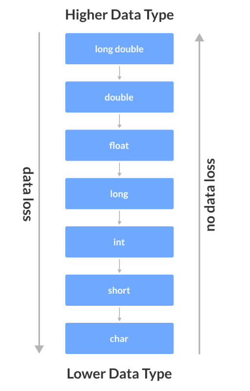

        - ##### Явное преобразование
          Когда пользователь в C++ вручную меняет данные с одного типа на другой, это называется явным преобразованием.
          Этот тип преобразования также известен, как приведение типов. Есть три основных способа использования явного
          преобразования в C++:
            1. Приведение типов в C-style (также известное, как обозначение приведения).
            2. Обозначение
               функций (также известное, как приведение типов в старом стиле С++)
            3. Операторы преобразования типов.
          ##### C-style Как
          следует из названия, этому типу приведения предпочитает язык программирования C. Это также известно как
          обозначение приведения. Синтаксис этого стиля:

          ```c++
          // initializing int variable int num_int = 26; 
          // declaring double variable double num_double; 
          // converting from int to 
          double num_double = (double)num_int;
          ```
          ##### Использование функционального стиля
          Мы также можем использовать такую функцию, как нотация, для преобразования данных из одного типа в другой.
          Синтаксис:

          ```data_type(expression)```

    </details>

  ---

  #### 83. Что такое инициализация переменной в if?

    - <details><summary>Ответ:</summary>

      `такую фичу видел только в С++17 и выше`

      ```if (int length = 2; length == 2)```

        - Это ограничивает область применения `length` в `if` одиночку. Таким образом, вы получаете те же преимущества,
          что и
          мы, когда нам разрешили писать.

        ```c++
        for(int i = 0; i < ... ; ++i) {
        // ...
        }
        ```
      Вместо утечки переменной

      ```c++
      int i;
      for(i = 0; i < ... ; ++i) {
      // ...
      }
      ```
      Короткоживущие переменные лучше по нескольким причинам. Но назову пару:

        1. Чем короче что-то живет, тем меньше вещей вам нужно помнить при чтении несвязанных строк кода. Если `i` не
           существует вне
           цикла или `if` оператора, то нам не нужно обращать внимание на его значение вне их. Нам также не нужно
           беспокоиться о том,
           что его значение будет взаимодействовать с другими частями программы, которые находятся за пределами его
           предполагаемой
           области действия (что может произойти, если `i` вышеуказанное используется повторно в другом цикле). Коду
           легче
           следовать и
           рассуждать.

        2. Если переменная содержит ресурс, то этот ресурс теперь удерживается в течение кратчайшего возможного периода.
           И это без
           лишних фигурных скобок. Также было ясно, что ресурс связан с `if` файлом `single`. Считайте это мотивирующим
           примером

      ```c++
      if(std::lock_guard _(mtx); guarded_thing.is_ready()) {}
      ```

      Если ваши коллеги не знают об этой функции, научите их! Умиротворение программистов, которые не хотят учиться, —
      плохой
      предлог, чтобы избегать фич.
    </details>

  ---

  #### 84. Что такое ленивые вычисления в С++?

    - <details><summary>Ответ:</summary>

      _ Общий смысл «ленивых вычислений» в том, что экономится время на проведении вычислений, результаты которых
      заведомо не будут использованы в дальнейшем программой. Соответственно, за счет снижения объемов вычислений
      повышается и производительность программы, а за счет отсутствия необходимости хранить в памяти результаты
      вычислений снижаются и требования программы к памяти. Помимо этого, ленивые вычисления избавляют программиста от
      необходимости следить за тем, какие именно вычисления будут в дальнейшем востребованы программой, а какие,
      напротив, окажутся совершенно бесполезными. Последнее не всегда хорошо, учитывая опять же гибкость плюсов, в
      которых компилятор не даст, вопреки обычному подходу, поступать как заблагорассудится программисту. Но на то в
      принципе и расчет.

      Основным механизмом, способствующим этому, является перегрузка операторов. Рассмотрим случай сложения матриц.
      Сигнатура функции обычно
      выглядит примерно так:

      ```c++
      matrix operator +(matrix const& a, matrix const& b);
      ```
      Теперь, чтобы сделать эту функцию ленивой, достаточно вернуть прокси вместо фактического результата:

      ```c++
      struct matrix_add;
      matrix_add operator +(matrix const& a, matrix const& b) {
      return matrix_add(a, b);
      }
      ```

      Теперь все, что нужно сделать, это написать этот прокси:

      ```c++
      struct matrix_add {
      matrix_add(matrix const& a, matrix const& b) : a(a), b(b) { }
      operator matrix() const {
        matrix result;
        // Do the addition.
        return result;
      }
      private:
        matrix const& a, b;
      };
      ```

      Магия заключается в методе, operator `matrix()` который является неявным оператором преобразования  `matrix_add` в
      `plain`
      matrix. Таким образом, вы можете связать несколько операций (конечно, предоставив соответствующие перегрузки).
      Оценка
      происходит только тогда, когда окончательный результат назначается `matrix` экземпляру.

      Как бы то ни было, код не имеет смысла, потому что хотя вычисление
      происходит лениво, оно все равно происходит в одном и том же выражении. В частности, другое добавление будет
      оценивать
      этот код, если только `matrix_add` структура не будет изменена, чтобы разрешить добавление по цепочке. C++0x
      значительно
      облегчает это, позволяя использовать вариативные шаблоны (т. е. списки шаблонов переменной длины).

      Однако есть один очень простой случай, когда этот код на самом деле может принести реальную прямую пользу:

      ```c++
      int value = (A + B)(2, 3);
      ```

      Здесь предполагается, что `A` и `B` являются двумерными матрицами и что разыменование выполняется в нотации
      Фортрана, т.
      е.
      вышеизложенное вычисляет один элемент из суммы матриц. Конечно, расточительно добавлять целые матрицы.
      `matrix_add` на
      помощь:

      ```c++
      struct matrix_add {
      // … yadda, yadda, yadda …

      int operator ()(unsigned int x, unsigned int y) {
          // Calculate *just one* element:
          return a(x, y) + b(x, y);
          }
      };
      ```

      Других примеров предостаточно. Я только что вспомнил, что недавно реализовал что-то связанное. По сути, мне
      пришлось
      реализовать строковый класс, который должен соответствовать фиксированному, заранее определенному интерфейсу.
      Однако мой
      конкретный класс строк имел дело с огромными строками, которые на самом деле не хранились в памяти. Обычно
      пользователь
      просто получает доступ к небольшим подстрокам исходной строки с помощью функции `infix`. Я перегрузил эту функцию
      для
      моего строкового типа, чтобы она возвращала прокси, который содержал ссылку на мою строку вместе с желаемой
      начальной и
      конечной позицией. Только когда эта подстрока действительно использовалась, он запрашивал `C` `API` для извлечения
      этой
      части строки.

    </details>

  ---

  #### 85. Расскажите о циклах for и range-for.

    - <details><summary>Ответ:</summary>

      ##### Range for
        - Используется как более читаемый эквивалент традиционного цикла for, работающего с диапазоном значений,
          например со всеми элементами в контейнере
        - Синтаксис:

          ```
          attr(optional) for ( init-statement(optional) range-declaration : range-expression )
          loop-statement
          ```
        - Пример:

          ```c++
          std::vector<int> v = {0, 1, 2, 3, 4, 5};
          for (const int& i : v) // access by const reference
              std::cout << i << ' ';
          ```
      ##### for
        - Выполняет оператор инициализации один раз, затем повторно выполняет оператор и выражение итерации , пока
          значение условия не станет ложным. Проверка проводится перед каждой итерацией.
        - Синтаксис:

          ```
          formal syntax:		
          attr(optional) for ( init-statement condition(optional) ; iteration-expression(optional) ) statement		
          informal syntax:		
          attr(optional) for ( declaration-or-expression(optional) ; declaration-or-expression(optional) ; expression(optional) ) statement
          ```
        - Пример:

          ```c++
          std::cout << "1) typical loop with a single statement as the body:\n";
          for (int i = 0; i < 10; ++i)
              std::cout << i << ' ';

          std::cout << "\n\n" "2) init-statement can declare multiple names, as "
                       "long as they can use the same decl-specifier-seq:\n";
          for (int i = 0, *p = &i; i < 9; i += 2) {
              std::cout << i << ':' << *p << ' ';
          }
          ```
    </details>

  ---

  #### 86. Что делает ключевое слово auto? auto-определение return-типа, аргументов функции?

    - <details><summary>Ответ:</summary>

      Используя `auto&& var = <initializer>`, вы говорите: я приму любой инициализатор независимо от того, является ли
      он выражением `lvalue` или `rvalue`, и я сохраню его `constness` . Это обычно используется для пересылки (обычно
      с `T&&`).
      Причина, по которой это работает, заключается в том, что «универсальная ссылка» `auto&&` или `T&&`, будет
      привязана к
      чему угодно.

      Вы можете сказать, почему бы просто не использовать a `const auto&`, потому что это также будет связано с чем
      угодно?
      Проблема с использованием `const`ссылки заключается в том, что это `const`! Позже вы не сможете связать его с
      какими-либо
      не константными ссылками или вызвать какие-либо функции-члены, которые не помечены как `const`.

      В качестве примера представьте, что вы хотите получить `std::vector`, перевести итератор к его первому элементу и
      каким-то
      образом изменить значение, на которое указывает этот итератор:

      ```c++
      auto&& vec = some_expression_that_may_be_rvalue_or_lvalue;
      auto i = std::begin(vec);
      (*i)++;
      ```

      Этот код прекрасно с компилируется независимо от выражения инициализатора. Возможны следующие варианты
      `auto&&` отказа:

      ```c++
      auto => will copy the vector, but we wanted a reference
      auto& => will only bind to modifiable lvalues
      const auto& => will bind to anything but make it const, giving us const_iterator
      const auto&& => will bind only to rvalues
      ```

      Так что для этого `auto&&` работает отлично! Примером такого использования является цикл `auto&&` на основе
      диапазона.
      `for` Смотрите мой другой вопрос для более подробной информации.

      Если вы затем используете `std::forward` свою `auto&&` ссылку, чтобы сохранить тот факт, что изначально она была
      либо `lvalue`,
      либо `rvalue`, ваш код говорит: теперь, когда я получил ваш объект либо из выражения `lvalue`, либо из
      выражения `rvalue`, я
      хочу сохранить любое значение, которое оно изначально имел, чтобы я мог использовать его наиболее эффективно - это
      может
      сделать его недействительным. Как в:

      ```c++
      auto&& var = some_expression_that_may_be_rvalue_or_lvalue;
      // var was initialized with either an lvalue or rvalue, but var itself
      // is an lvalue because named rvalues are lvalues
      use_it_elsewhere(std::forward<decltype(var)>(var));
      ```

      Это позволяет `use_it_elsewhere` вырвать его кишки ради производительности (избегая копирования), когда исходный
      инициализатор был модифицируемым `rvalue`.

      Что это означает в отношении того, можем ли мы и когда мы можем красть ресурсы из `var`? Что ж,
      поскольку `auto&&will`
      привязывается к чему угодно, мы не можем пытаться вырвать `var` кишки самостоятельно — это вполне может
      быть `lvalue` или
      даже `const`. Однако мы можем `std::forward` использовать другие функции, которые могут полностью разрушить его
      внутренности.
      Как только мы это сделаем, мы должны считать, что находимся `var` в недопустимом состоянии.

      Теперь давайте применим это к случаю `auto&& var = foo()`;, как указано в вашем вопросе, где `foo` возвращает a
      Tпо
      значению. В этом случае мы точно знаем, что тип `var` будет выведен как `T&&`. Поскольку мы точно знаем, что
      это `rvalue`, нам
      не нужно `std::forward` разрешение на кражу его ресурсов. В этом конкретном случае, зная, что `foo` возвращается
      по значению,
      читатель должен просто прочитать это как: я беру ссылку `rvalue` на временное значение, возвращаемое из `foo`,
      поэтому
      я
      могу с радостью перейти от него.

      В качестве дополнения, я думаю, стоит упомянуть, когда может появиться такое выражение
      `some_expression_that_may_be_rvalue_or_lvalue`, кроме ситуации «ну, ваш код может измениться». Итак, вот
      надуманный
      пример:

      ```c++
      std::vector<int> global_vec{1, 2, 3, 4};

      template <typename T>
      T get_vector()
      {
          return global_vec;
      }

      template <typename T>
      void foo()
      {
          auto&& vec = get_vector<T>();
          auto i = std::begin(vec);
          (*i)++;
          std::cout << vec[0] << std::endl;
      }
      ```

      Вот `get_vector<T>()` это прекрасное выражение, которое может быть либо `lvalue`, либо `rvalue` в зависимости от
      универсального
      типа T. Мы существенно меняем возвращаемый тип `get_vector` через параметр шаблона `foo`.

      Когда мы вызываем `foo<std::vector<int>>`, `get_vector` вернет `global_vec` значение, которое дает
      выражение `rvalue`. В качестве
      альтернативы, когда мы вызываем `foo<std::vector<int>&>`, `get_vector` будет возвращаться `global_vec` по ссылке,
      что приводит к
      выражению `lvalue`.

      Если мы делаем:

      ```c++
      foo<std::vector<int>>();
      std::cout << global_vec[0] << std::endl;
      foo<std::vector<int>&>();
      std::cout << global_vec[0] << std::endl;
      ```

      Мы получаем следующий вывод, как и ожидалось:

      Если бы вы изменили `auto&&` в коде на любой из `auto`, `auto&`, `const auto&` или , `const auto&&` то мы не
      получили бы желаемого
      результата.

      Альтернативный способ изменить логику программы в зависимости от того `auto&&`, инициализируется ли ваша ссылка
      выражением
      `lvalue` или `rvalue`, — это использовать признаки типа:

      ```c++
      if (std::is_lvalue_reference<decltype(var)>::value) {
      // var was initialised with an lvalue expression
      } else if (std::is_rvalue_reference<decltype(var)>::value) {
      // var was initialised with an rvalue expression
      }
      ```

     </details>

  ---

  #### 87. Чем отличаются delete и delete [ ] ? Что случится, если вызвать delete у объекта, созданного через new [ ] ?

    - <details><summary>Ответ:</summary>

      [Оператор](https://en.cppreference.com/w/cpp/memory/new/operator_delete) `delete[]` используется для удаления
      массивов. Оператор `delete` используется для удаления объектов без
      массива. Он вызывает функцию `operator delete[]` и `operator delete` соответственно, чтобы удалить память, занятую
      массивом или объектом без массива после (в конечном счете) вызова деструкторов для элементов массива или объекта
      без массива.

      Ниже показаны соотношения:

      Оператор `delete` освобождает память и вызывает деструктор для одного объекта, созданного с помощью `new`.

      Оператор `delete[]` освобождает память и вызывает деструкторы для массива объектов, созданных с помощью `new[]`.

      Использование `delete` с указателем, возвращаемым `new[]` или `delete[]` с указателем, возвращаемым, `new`
      приводит к
      неопределенному поведению.

    </details>

  ---

  #### 88. Обработка ошибок в С++. Каки конструкции используют при обработке exception?

    - <details><summary>Ответ:</summary>

      Одним из преимуществ C++ перед C является обработка исключений. Исключения — это аномалии времени выполнения или
      ненормальные условия, с которыми программа сталкивается во время своего выполнения. Существует два типа
      исключений: а) синхронные, б) асинхронные (т. е. исключения, не зависящие от программы, такие как сбой диска,
      прерывания клавиатуры и т. д.). C++ предоставляет для этой цели следующие специальные ключевые слова:
      try : представляет блок кода, который может вызвать исключение.
      catch : представляет блок кода, который выполняется при возникновении определенного исключения.
      throw : используется для создания исключения. Также используется для перечисления исключений, которые выдает
      функция, но не обрабатывает сама себя.

      Почему обработка исключений?  
      Ниже приведены основные преимущества обработки исключений по сравнению с традиционной обработкой ошибок:

        1) Отделение кода обработки ошибок от обычного кода: в традиционных кодах обработки ошибок всегда есть условия
           if-else для обработки ошибок. Эти условия и код для обработки ошибок смешиваются с обычным потоком. Это
           делает код менее читабельным и ремонтопригодным. С блоками try/catch код для обработки ошибок отделяется от
           обычного потока.

        2) Функции/методы могут обрабатывать только те исключения, которые они выбирают: функция может генерировать
           много исключений, но может выбрать обработку некоторых из них. Другие исключения, которые выбрасываются, но
           не перехватываются, могут быть обработаны вызывающей стороной. Если вызывающая сторона решает не
           перехватывать их, то исключения обрабатываются вызывающей стороной вызывающей стороны.
           В C++ функция может указывать исключения, которые она генерирует, с помощью ключевого слова throw. Вызывающий
           эту функцию должен каким-то образом обработать исключение (либо указав его снова, либо перехватив его).

        3) Группировка типов ошибок: в C++ как базовые типы, так и объекты могут быть выброшены как исключения. Мы можем
           создать иерархию объектов исключений, сгруппировать исключения в пространствах имен или классах и
           классифицировать их в соответствии с их типами.

      Исключения С++:

      При выполнении кода C++ могут возникать различные ошибки: ошибки кодирования, допущенные программистом, ошибки
      из-за неправильного ввода или другие непредвиденные вещи.

      При возникновении ошибки C++ обычно останавливается и генерирует сообщение об ошибке. Технический термин для
      этого: C++ вызовет исключение (ошибку).

      С++ попробуйте и поймайте:

      Обработка исключений в C++ состоит из трех ключевых слов: try, throw и catch:

      Оператор try позволяет определить блок кода, который будет проверяться на наличие ошибок во время его выполнения.

      Ключевое слово throw генерирует исключение при обнаружении проблемы, что позволяет нам создать пользовательскую
      ошибку.

      Оператор catch позволяет определить блок кода, который будет выполняться, если в блоке try произойдет ошибка.

      Ключевые слова try and catch идут парами:

      Мы используем блок try для тестирования некоторого кода: если значение переменной age меньше 18, мы создадим
      исключение и обработаем его в нашем блоке catch.

      В блоке catch мы перехватываем ошибку, если она возникает, и что-то с ней делаем. Оператор catch принимает один
      параметр. Итак, если значение age равно 15 и поэтому мы выбрасываем исключение типа int в блоке try (возраст), мы
      можем передать «int myNum» в качестве параметра оператору catch, где переменная «myNum» используется для вывода
      значения возраста.

      Если ошибки не возникает (например, если age равен 20 вместо 15, что означает, что он будет больше 18), блок catch
      пропускается.

      Обработка исключений в C++

        - Ниже приведен простой пример, показывающий обработку исключений в C++. Вывод программы объясняет ход
          выполнения блоков try/catch.

      ```c++
      #include <iostream>
      using namespace std;
      int main()
      {
         int x = -1;
         // Some code
         cout << "Before try \n";
         try {
             cout << "Inside try \n";
             if (x < 0)
             {
                 throw x;
                 cout << "After throw (Never executed) \n";
             }
         }
         catch (int x ) {
             cout << "Exception Caught \n";
         }

         cout << "After catch (Will be executed) \n";
         return 0;
      }
      ```

        - Существует специальный блок перехвата, называемый блоком перехвата всех, написанный как catch(…), который
          можно использовать для перехвата всех типов исключений. Например, в следующей программе в качестве исключения
          генерируется тип int, но для него нет блока catch, поэтому будет выполнен блок catch(…).

      ```c++
      #include <iostream>
      using namespace std;
      int main()
      {
          try {
              throw 10;
          } 
          catch (char *excp)  {
              cout << "Caught " << excp;
          }
          catch (...)  {
              cout << "Default Exception\n";
          }
          return 0;
      }
      ```

        - Неявное преобразование типов не происходит для примитивных типов. Например, в следующей программе 'a' неявно
          преобразуется в int.

      ```c++
      #include <iostream>
      using namespace std;

      int main()
      {
          try {
              throw 'a';
          }
          catch (int x)  {
              cout << "Caught " << x;
          }
          catch (...)  {
              cout << "Default Exception\n";
          }
          return 0;
      }
      ```

        - Если возникает исключение, которое нигде не перехвачено, программа аварийно завершается. Например, в
          следующей
          программе выбрасывается char, но нет блока catch для перехвата char.

      ```c++
      #include <iostream>
      using namespace std;

      int main()
      { 
         try {
             throw 'a';
         }
         catch (int x)  {
             cout << "Caught ";
         }
         return 0;
      }
      ```
      Это приложение запросило среду выполнения, чтобы завершить его в
      необычный способ. Обратитесь в службу поддержки приложения для
      дополнительной информации.
      Мы можем изменить это ненормальное поведение завершения, написав нашу собственную неожиданную функцию.
        - Исключение производного класса должно быть перехвачено до исключения базового класса. Подробнее см . здесь .
        - Как и в Java, в библиотеке C++ есть стандартный класс исключений, который является базовым классом для всех
          стандартных исключений. Все объекты, создаваемые компонентами стандартной библиотеки, являются производными
          от этого
          класса. Следовательно, все стандартные исключения могут быть перехвачены путем перехвата этого типа

        - В отличие от Java, в C++ все исключения не проверяются, т.е. компилятор не проверяет, перехвачено ли
          исключение
          или
          нет (см .для подробностей). Таким образом, нет необходимости указывать все не перехваченные исключения в
          объявлении
          функции. Хотя это рекомендуется делать. Например, следующая программа компилируется нормально, но в идеале
          сигнатура
          функции fun() должна содержать список непроверенных исключений.

      ```c++
      #include <iostream>
      using namespace std;

      void fun(int *ptr, int x)
      {
          if (ptr == NULL)
          throw ptr;
          if (x == 0)
          throw x;
          /* Some functionality */
      }

      int main()
      {
          try {
          fun(NULL, 0);
          }
          catch(...) {
              cout << "Caught exception from fun()";
          }
          return 0;
      }
      ```
      Лучший способ написать приведенный выше код:

      ```c++
      w#include <iostream>
      using namespace std;

      // Here we specify the exceptions that this function
      // throws.
      void fun(int *ptr, int x) throw (int *, int) // Dynamic Exception specification
      {
          if (ptr == NULL)
          throw ptr;
          if (x == 0)
              throw x;
          /* Some functionality */
      }

      int main() 
      {
          try {
              fun(NULL, 0);
          }
          catch(...) {
              cout << "Caught exception from fun()";
          }
          return 0;
      }
      ```

      Примечание. Использование спецификации динамических исключений устарело, начиная с C++11. Одной из причин этого
      может
      быть то, что он может случайно прервать вашу программу. Это может произойти, когда вы создаете исключение другого
      типа,
      не упомянутого в спецификации динамического исключения. Ваша программа прервет себя, потому что в этом сценарии
      она
      вызывает (косвенно) функцию terminate(), которая по умолчанию вызывает abort().

        - В C++ блоки try/catch могут быть вложенными. Кроме того, исключение можно повторно сгенерировать с помощью
          команды
          «throw; “.

      ```c++ 
      #include <iostream>
      using namespace std;

      int main()
      {
          try {
              try {
                  throw 20;
              }
              catch (int n) {
                  cout << "Handle Partially ";
                  throw; // Re-throwing an exception
              }
          }
          catch (int n) {
          cout << "Handle remaining ";
         }
         return 0;
      }
      ```

      Обработать частично Обработать оставшееся
      Функция также может повторно вызвать функцию, используя тот же «throw; синтаксис. Функция может обрабатывать часть
      и
      просить вызывающую программу обработать оставшуюся часть.

        - При возникновении исключения все объекты, созданные внутри окружающего блока try, уничтожаются до того, как
          управление будет передано в блок catch.

      ```c++
      #include <iostream>
      using namespace std;

      class Test {
      public:
          Test() { cout << "Constructor of Test " << endl; }
          ~Test() { cout << "Destructor of Test " << endl; }
      };

      int main()
      {
          try {
              Test t1;
              throw 10;
          }
          catch (int i) {
              cout << "Caught " << i << endl;
          }
      }
      ```

        - Вы можете
          попробовать [Quiz on Exception Handling in C++](https://www.geeksforgeeks.org/c-plus-plus-gq/exception-handling-gq/)
          .
          Пожалуйста, пишите комментарии, если вы обнаружите что-то неправильное, или вы хотите поделиться
          дополнительной
          информацией по теме, обсуждаемой выше.

    </details>

  ---

  #### 89. Можно ли выбрасывать exception из конструктора? Какие поля будут сконструированы, какие поля будут разрушены?

    - <details><summary>Ответ:</summary>

      Если конструктор класса завершает работу исключением, значит он не завершает свою работу — следовательно объект не
      будет создан. Из-за этого могут возникать утечки памяти, т.к. для не полностью сконструированных объектов не будет
      вызван деструктор. Из-за этого распространено мнение, что конструктор никогда не должен вырабатывать исключения,
      однако это не так — утечки памяти возникнут не во всех случаях.

      Стандарт языка С++ гарантирует, что если исключение возникнет в конструкторе, то памяти из под членов-данных
      класса будет освобождена корректно вызовом деструктора — т.е. если вы используете идиому RAII [2], то проблем не
      будет. Часто для этого достаточно использовать std::vector/std::string вместо старых массивов и строк, и умные
      указатели вместо обычных [3]. Если же вы продолжите использовать сырые указатели и динамически выделять память —
      нужно будет очень тщательно следить за ней, например в следующем фрагменте кода нет утечки, т.к. исключение будет
      выработано только если память не будет выделена [4]:

      ```c++
      template <class ElementType>
      Array<ElementType>::Array() : m_realSize(Step), m_size(0), m_array(0) {
      m_array = (ElementType*)malloc(sizeof(ElementType)*m_realSize);
          if (0 == m_array) {
             throw bad_allocation();
          }
      }
      ```
      ##### Исключения в деструкторе класса
      В связи с этим, в большинстве случаев разрушение объектов созданных на стеке (без использования `new/malloc`)
      произойдет корректно — вызовом деструктора. Однако исключения в конструкторе или деструкторе могут приводить к
      нежелательным последствиям.

      Во-первых, программа не должна вырабатывать исключения во время обработки другого исключения (когда происходит
      раскрутка
      стека) — это приведет к аварийному завершению работы программы (фактически вызову `abort()`), которое уже не
      получится
      корректно обработать. Причина такой ошибки заключается в том, что один из деструкторов вырабатывает исключение или
      не
      обрабатывает исключение функции, которую вызывает:

      ```c++
      struct PrinterBusyException {};

      class Printer {
          std::string m_location, m_port;
      public:
          Printer(std::string location,
          std::string port) : m_location(location), m_port(port) {
          }
          bool is_busy() {
              return false; // for example
          }
          ~Printer() {
               if (is_busy()) {
                   throw PrinterBusyException();
               }
          }
      };

      struct SomeException {};

      int main() {
          try {
               Printer printer("localhost", "usb://Kyocera/FS-1020MFP?serial=LDA4322583");
               // some actions ...
               throw SomeException();
          }
          catch(SomeException exception) {
               std::cout << "SomeException handled\n";
          }
          catch(PrinterBusyException exception) {
               std::cout << "PrinterBusyException handled\n";
          }
      }
      ```
      ##### Вспомогательная литература по теме исключений в С++
        - [Обработка исключений](https://pro-prof.com/forums/topic/exception_handling) — описание процессов, которые
          происходят при возникновении исключения в программе, сравнение их с возвратом кодом ошибки функцией и общие
          рекомендации по использованию исключений (без привязки к конкретному языку программирования);
        - [Идиома RAII](https://pro-prof.com/forums/topic/resources-control-objects-raii). Объекты управления ресурсами
          в C++ — описание идиомы RAII, следование которой помогает безопасно управлять ресурсами при обработке
          исключений;
        - [описание класса unique_ptr](https://pro-prof.com/forums/topic/cplusplus-unique_ptr-smart_pointers)
          являющегося простейшим умных указателем и реализующему идиому RAII;
        - [Реализация класса одномерного массива](https://pro-prof.com/forums/topic/cplusplus_custom_array_class) —
          содержит пример безопасного конструктора, вырабатывающего исключение.
        - Мейерс С. Эффективное использование С++. 35 новых рекомендаций по улучшению ваших программ и проектов. – М.:
          ДМК Пресс, 2014. — третья глава книги полностью посвящена вопросам обработки исключений в С++.
        - [Могу ли я создать исключение из конструктора? От деструктора?](https://isocpp.org/wiki/faq/exceptions#ctors-can-throw)

    </details>

  ---

  #### 90. Что такое memory leak?

    - <details><summary>Ответя:</summary>

      [Memory leak](https://ru.wikipedia.org/wiki/%D0%A3%D1%82%D0%B5%D1%87%D0%BA%D0%B0_%D0%BF%D0%B0%D0%BC%D1%8F%D1%82%D0%B8)
      — это неправильное использование динамической памяти .

      Это происходит, когда мы получаем некоторую память (`new`) в куче и не освобождаем ее (`delete`), когда не
      использовали ее, поэтому наше приложение использует некоторую неиспользуемую память в куче.

      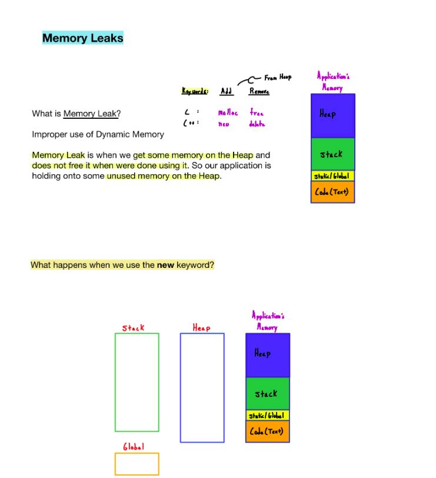

    </details>

  ---

  #### 91. Можно ли выбрасывать exception из деструктора?

    - <details><summary>Ответ:</summary>

      Выбрасывать исключение из деструктора опасно.
      Если другое исключение уже распространяется, приложение будет прекращено.

      ```c++
       example is designed to show that terminate is called
        // if two exceptions are propagating at the same time.
        ~Bad() noexcept(false)
        {
            throw 1;
        }
        };
        class Bad2
        {
        public:
           ~Bad2()
           {
              throw 1;
           }
        };
        int main(int argc, char* argv[])
        {
            try
            {
               Bad   bad;
            }
            catch(...)
            {
                std::cout << "Print This\n";
            }

            try
            {
               if (argc > 3)
            {
                Bad   bad; // This destructor will throw an exception that escapes (see above)
                throw 2;   // But having two exceptions propagating at the
                       // same time causes terminate to be called.
            }
            else
            {
                Bad2  bad; // The exception in this destructor will
                       // cause terminate to be called.
            }
            }
             catch(...)
            {
            std::cout << "Never print this\n";
            }
        }
      ```
      ##### Это в основном сводится к:

      Все опасное (то есть, что может вызвать исключение) должно быть сделано с помощью открытых методов (не обязательно
      напрямую). Пользователь вашего класса может потенциально справиться с этими ситуациями, используя открытые методы
      и перехватывая любые потенциальные исключения.

      Затем деструктор завершит работу объекта, вызвав эти методы (если пользователь не сделал этого явно), но любые
      исключения throw будут перехвачены (после попытки решить проблему).

      Таким образом, вы фактически перекладываете ответственность на пользователя. Если пользователь может исправить
      исключения, он вручную вызовет соответствующие функции и обработает все ошибки. Если пользователь объекта не
      беспокоится (так как объект будет уничтожен), то деструктор остается заниматься бизнесом.

      Пример:
      `std::fstream`

      Метод `close()` потенциально может вызвать исключение. Деструктор вызывает close (), если файл был открыт, но
      следит за тем, чтобы любые исключения не распространялись из деструктора.

      Поэтому, если пользователь файлового объекта хочет выполнить специальную обработку для проблем, связанных с
      закрытием файла, он будет вручную вызывать `close()` и обрабатывать любые исключения. Если, с другой стороны, им
      все равно, деструктор останется справиться с ситуацией.

      Скотт Майерс имеет отличную статью на эту тему в своей книге
      «[Эффективный C++](https://www.ozon.ru/product/effektivnyy-i-sovremennyy-s-42-rekomendatsii-po-ispolzovaniyu-c11-i-c14-effektivnyy-i-sovremennyy-34747131/?partner=alenacpp&sh=_LSiJgU3eg)
      »

      Редактировать:
      По-видимому, также в «Более эффективный C ++»
      [пункт 11: Предотвращение исключения из деструкторов](http://bin-login.name/ftp/pub/docs/programming_languages/cpp/cffective_cpp/MEC/MI11_FR.HTM)
    </details>

  ---

  #### 92. Как отловить деление на 0 в С++?

    - <details><summary>Ответ:</summary>

        1) Использование класса `runtime_error`
           Класс runtime_error является производным классом исключения класса стандартной библиотеки, определенным в
           заголовочном файле исключения для представления ошибок времени выполнения.
           Теперь рассмотрим точно такой же код, но с возможностью обработки деления на ноль. Здесь у нас есть блок try
           внутри main, который вызывает функцию Division. Функция Division проверяет, равен ли переданный знаменатель
           нулю, если нет, возвращает частное, если да, генерирует исключение runtime_error. Это исключение
           перехватывается блоком catch, который печатает сообщение «Произошло исключение», а затем вызывает функцию
           what с объектом runtime_error e. Функция what() {используется в приведенном ниже коде} — это виртуальная
           функция класса Standard exception, определенная в заголовочном файле stdexcept, она используется для
           идентификации исключения. При этом выводится сообщение «Математическая ошибка: попытка деления на ноль»,
           после чего программа возобновляет обычную последовательность инструкций.

           ```c++
              #include <iostream>
              #include <stdexcept> // To use runtime_error
              using namespace std;
        
              // Defining function Division
              float Division(float num, float den)
              {
                  // If denominator is Zero
                  // throw runtime_error
                  if (den == 0) {
                      throw runtime_error("Math error: Attempted to divide by Zero\n");
                  }
        
                  // Otherwise return the result of division
                  return (num / den);
        
                  } // end Division
        
              int main()
              {
                  float numerator, denominator, result;
                  numerator = 12.5;
                  denominator = 0;

                  // try block calls the Division function
              try {
                  result = Division(numerator, denominator);
  
                  // this will not print in this example
                  cout << "The quotient is "
                  << result << endl;
              }
  
              // catch block catches exception thrown
              // by the Division function
              catch (runtime_error& e) {
  
              // prints that exception has occurred
              // calls the what function
              // using runtime_error object
              cout << "Exception occurred" << endl << e.what();
              }

           } // end main
           ```
        2) Использование определяемой пользователем обработки исключений
           Здесь мы определяем класс Exception, который публично наследуется от класса runtime_error. Внутри класса
           Exception мы определяем только конструктор, который будет отображать сообщение «Математическая ошибка:
           попытка деления на ноль» при вызове с использованием объекта класса. Мы определяем функцию Division, которая
           вызывает конструктор класса Exception, когда знаменатель равен нулю, в противном случае возвращает частное.
           Внутри main мы даем некоторые значения числителю и знаменателю, 12,5 и 0 соответственно. Затем мы переходим к
           блоку try, который вызывает функцию Division, которая либо возвращает частное, либо генерирует исключение.
           Блок catch перехватывает исключение типа Exception, отображает сообщение «Произошло исключение» и затем
           вызывает функцию what. После обработки исключения программа возобновляет работу.

        ```c++
        #include <iostream>
        #include <stdexcept>
        // For using runtime_error
    
        using namespace std;
    
        // User defined class for handling exception
        // Class Exception publicly inherits
        // the runtime_error class
    
        class Exception : public runtime_error {
        public:
            // Defining constructor of class Exception
            // that passes a string message to the runtime_error class
            Exception() : runtime_error("Math error: Attempted to divide by Zero\n")
            {
             }
        };
    
        // defining Division function
        float Division(float num, float den)
        {
    
            // If denominator is Zero
            // throw user defined exception of type Exception
            if (den == 0)
                throw Exception();
      
                // otherwise return the result of division
            return (num / den);
    
        } // end Division
    
        int main()
        {
            float numerator, denominator, result;
            numerator = 12.5;
            denominator = 0;
    
            // try block calls the Division function
            try {
                 result = Division(numerator, denominator);
      
                 // this will not print in this example
                 cout << "The quotient is " << result << endl;
            }
      
            // catch block catches exception if any
            // of type Exception
            catch (Exception& e) {
      
                // prints that exception has occurred
                // calls the what function using object of
                // the user defined class called Exception
                cout << "Exception occurred" << endl  << e.what();
            }
    
       } // end main
            
        ```

        - Использование раскручивания стека
          При раскручивании стека у нас есть main, внутри которого блок try вызывает функцию Division, которая, в свою
          очередь, вызывает функцию CheckDenominator. Функция CheckDenominator проверяет, равен ли знаменатель нулю,
          если true генерирует исключение, в противном случае возвращает значение знаменателя. Функция деления
          вычисляет значение частного {если было передано ненулевое значение знаменателя} и возвращает его в основную.
          Блок catch перехватывает любое сгенерированное исключение и отображает сообщение «Произошло исключение» и
          вызывает функцию what, которая печатает «Математическая ошибка: попытка деления на ноль». После этого
          программа возобновляется.

        ```c++
        #include <iostream>
        #include <stdexcept>
        using namespace std;

        // defining the CheckDenominator function
        float CheckDenominator(float den)
        {

            // if denominator is zero
            // throw exception
            if (den == 0) {
            throw runtime_error("Math error: Attempted to divide by zero\n");
        }
        else
            return den; 
        } // end CheckDenominator

        // defining Division function
        float Division(float num, float den)
        {
             // Division function calls CheckDenominator
             return (num / CheckDenominator(den));

        } // end Division

        int main()
        {
            float numerator, denominator, result;
            numerator = 12.5;
            denominator = 0;

            // try block calls the Division function
            try {
                 result = Division(numerator, denominator);
  
                 // This will not print in this example
                 cout << "The quotient is " << result << endl;
            }
  
            // catch block catches exception if any
            catch (runtime_error& e) {
  
               // prints that exception has occurred
               // calls the what function using object of
               // runtime_error class
               cout << "Exception occurred" << endl << e.what();
           }
        } // end main
        ```
        - Использование try и catch(…)
          В этом коде блок try вызывает функцию CheckDenominator. В функции CheckDenominator мы проверяем, равен ли
          знаменатель нулю, если true, выбрасываем исключение, передавая строку «Ошибка». Эта строка перехватывается
          блоком catch и поэтому выводит сообщение «Произошло исключение». Блок catch здесь способен перехватывать
          исключения любого типа.

        ```c++
        #include <iostream>
        #include <stdexcept>
        using namespace std;

        // defining CheckDenominator
        float CheckDenominator(float den)
        {
            if (den == 0)
                 throw "Error";
            else
                 return den;
        } // end CheckDenominator

        int main()
        {
             float numerator, denominator, result;
             numerator = 12.5;
             denominator = 0;

             // try block
             try {
  
                  // calls the CheckDenominator function
                  // by passing a string "Error"
                  if (CheckDenominator(denominator)) {
  
                      result = (numerator / denominator);
                      cout << "The quotient is " << result << endl;
                  }
             }
  
             // catch block
             // capable of catching any type of exception
             catch (...) {
  
                 // Display a that exception has occurred
                 cout << "Exception occurred" << endl;
             }

        } // end main
        ```
    </details>

  ---

  #### 93. Как работают константные методы?

    - <details><summary>Ответ:</summary>

      В нестатические методы класса компилятор неявно передаёт константный указатель на объект от которого был вызван
      метод, его сигнатура

      ```c++
      T* const this   // адресс на который указывает this поменять нельзя
      ```

      благодаря ему можно связать обращение к переменным и методам с фактическим адрессом экземпляра.
      Следовательно код:

      ```c++
      void f()
      {
          m_a = 10;
      }
      ```

      эквивалентен

      ```c++
      void f()
      {
          this->m_a = 10;
      }
      ```

      В случаи с константными методами, вы меняем два поведения:

      Теперь данный метод может быть вызван для константного объекта.

      ```c++
      const Foo a;
      a->f(); // only if f() is const method
      ```

      Теперь внутрь данных методов передаётся константный указатель на константу.

      ```c++
      const T* const this; // адрес и состояние объекта на который указывает this поменять нельзя 
      ```

      следовательно

      ```c++
      void f()
      {
          this->m_a = 10; // ошибка нельзя менять состояние константного объекта
      }
      ```

      Преимущества константного метода:

      можно вызывать для константных объектов и указателей на константу.
      применения `grammar const` (всё что должно быть const - должно иметь данный спецификатор) - если метод не меняет
      объект то
      почему бы программисту явно не указать это себе, другим программистам и компилятору?
      Можно перегрузить метод через его константность:

      ```c++
      struct Array
      {
          int x;
          int operator[]( int index ) const
          {
              return x;
          }
          int& operator[]( int index )
          {
              return x;
          }
      };
    
      int main()
      {
          Array a;
          a[1] = 10; // int& operator[]( int index )
          // ok
          const Array b;
          b[1] = 10; // int operator[]( int index ) const
          // error: `int` is not lvalue
      }
      ```

    </details>

  ---

  #### 94. Что такое лямбда-функция в С++? Как получить доступ к переменным во внешней области видимости?

    - <details><summary>Ответ:</summary>

      В C++11 и более поздних версиях лямбда-выражение, часто называемое лямбда , представляет собой удобный способ
      определения объекта анонимной функции ( замыкания ) прямо в том месте, где он вызывается или передается в качестве
      аргумента функции. Обычно лямбда-выражения используются для инкапсуляции нескольких строк кода, которые передаются
      алгоритмам или асинхронным функциям. Эта статья определяет, что такое лямбда-выражения, и сравнивает их с другими
      методами программирования. В нем описаны их преимущества и приведены некоторые основные примеры.

      Части лямбда-выражения
      Стандарт ISO C++ показывает простую лямбду, которая передается в качестве третьего аргумента std::sort()функции:

      ```c++
      #include <algorithm>
      #include <cmath>

      void abssort(float* x, unsigned n) {
          std::sort(x, x + n,
          // Lambda expression begins
          [](float a, float b) {
                 return (std::abs(a) < std::abs(b));
              } // end of lambda expression
          );
      }
      ```
      На этой иллюстрации показаны части лямбды:

      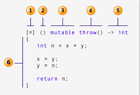

      1- предложение захвата (также известное как лямбда-интродьюсер в спецификации C++).

      2- список параметров Необязательный. (также известный как декларатор лямбда )

      3- изменяемая спецификация Необязательный.

      4- спецификация исключения Необязательный.

      5- Тип трейлинг-возврата Необязательный.

      6 - лямбда тело.

      Примечания:
      1- Если `[=]` поменять на `[&]` будет и ссылка на внешним переменные

      Например:

      ```c++
      int n = 0;
      [&]() /* можно не писать круглые скобки*/ {
          n = 5;
      ```

      Более подробно о захвате:
        - Лямбда-выражение может вводить новые переменные в свое тело (в `C++14` ), а также может получать доступ или
          захватывать переменные из окружающей области. Лямбда начинается с предложения захвата. Он указывает, какие
          переменные захватываются, и осуществляется ли захват по значению или по ссылке. Доступ к переменным с
          префиксом
          амперсанда `&` осуществляется по ссылке, а к переменным без него — по значению.

          Пустое предложение захвата `[ ]` указывает, что тело лямбда-выражения не имеет доступа к переменным в
          охватывающей
          его области.

          Вы можете использовать режим захвата по умолчанию, чтобы указать, как захватывать любые внешние переменные, на
          которые
          есть ссылки в теле лямбда-выражения: `[&]`означает, что все переменные, на которые вы ссылаетесь,
          захватываются
          по ссылке
          и `[=]`означают, что они захватываются по значению. Вы можете использовать режим захвата по умолчанию, а затем
          явно
          указать противоположный режим для конкретных переменных. Например, если тело лямбда обращается к внешней
          переменной
          `total` по ссылке и к внешней переменной `factor` по значению, то следующие предложения захвата эквивалентны:

          ```
          [&total, factor]
          [factor, &total]
          [&, factor]
          [=, &total]
          ```

          Только переменные, упомянутые в теле лямбда-выражения, захватываются, когда используется захват по умолчанию.

          Если предложение захвата включает в себя Capture-Default &, то ни один идентификатор в захвате этого
          предложения захвата
          не может иметь форму &identifier. Аналогичным образом, если предложение захвата включает в себя
          `Capture-Default =`, то
          никакой захват этого предложения захвата не может иметь форму =identifier. Идентификатор or `this` не может
          появляться
          более одного раза в предложении захвата. Следующий фрагмент кода иллюстрирует некоторые примеры

          ```c++
          struct S { void f(int i); };
    
          void S::f(int i) {
               [&, i]{};      // OK
               [&, &i]{};     // ERROR: i preceded by & when & is the default
               [=, this]{};   // ERROR: this when = is the default
               [=, *this]{ }; // OK: captures this by value. See below.
               [i, i]{};      // ERROR: i repeated
          }
          ```
    </details>

  ---

  #### 95. Для чего использовать namespace, anonymous namespace?

    - <details><summary>Ответ:</summary>

        - Пространство имен — это декларативная область, предоставляющая область действия идентификаторам (именам типов,
          функций, переменных и т. д.) внутри нее. Пространства имен используются для организации кода в логические
          группы и
          для предотвращения конфликтов имен, которые могут возникнуть, особенно когда ваша кодовая база включает
          несколько
          библиотек. Все идентификаторы в области пространства имен видны друг другу без уточнения. Идентификаторы за
          пределами пространства имен могут получить доступ к членам, используя полное имя для каждого идентификатора,
          например `std::vector<std::string> vec`;, или же с помощью объявления использования для одного
          идентификатора (
          using std::string) или директивы использования для всех идентификаторов в пространстве имен ( `using namespace
          std;`). Код в файлах заголовков всегда должен использовать полное имя пространства имен.
        - Анонимное пространство имен похоже на статическое ключевое слово, когда оно применяется на глобальном уровне.
          Анонимное пространство имен делает так, что вы не можете вызывать что-либо внутри пространства имен из другого
          файла.
          Анонимные пространства имен позволяют ограничить область действия только текущим файлом.

          Программист сделал бы это, чтобы избежать конфликтов имен. Никакие глобальные имена не будут конфликтовать
          таким образом во время компоновки .

          Пример:

          Файл: test.cpp

          ```c++
          namespace
          {
              void A()
              {
              }
              void B()
              {
               }
              void C()
              {
               }
               }
  
          void CallABC()
           {
               A();
               B();
               C();
           }
           Файл: main.cpp
  
           void CallABC();//You can use ABC from this file but not A, B and C
  
           void A()
           {
               //Do something different
           }
  
           int main(int argc, char** argv)
           {
               CallABC();
               A();//<--- calls the local file's A() not the other file.
               return 0; 
           }
          ```

          Вышеприведенное будет скомпилировано нормально. Но если вы попытаетесь написать CallABC()функцию в своем
          основном файле, у вас будет ошибка связывания.

          Таким образом, вы не можете вызывать A()функции B()и по C()отдельности, но вы можете вызывать CallABC()их все
          одну за другой.

          Вы можете перенаправить объявление CallABC()внутри вашего main.cpp и вызвать его. Но вы не можете пересылать
          объявление test.cpp A(), B() или C() внутри вашего main.cpp, так как у вас будет ошибка связывания.

          Что касается того, почему внутри пространства имен есть класс. Это делается для того, чтобы внешние файлы не
          использовали этот класс. Что-то внутри .cpp, вероятно, использует этот класс.

    </details>

  --- 

  #### 96. Как вызвать объект из nested namespace?

    - <details><summary>Ответ:</summary>

      Вы можете получить доступ к членам вложенного пространства имен с помощью операторов результата следующим образом:

      ```c++
      #include <iostream>
      using namespace std;
    
       // first name space
       namespace first_space{
          void func(){
          cout << "Inside first_space" << endl;
       }
       // second name space
       namespace second_space{
           void func(){
              cout << "Inside second_space" << endl;
           }
       }
       }
       using namespace first_space::second_space;
       int main ()
       {
           // This calls function from second name space.
           func();
    
           return 0;
      }
      ```
    </details>

  --- 

  #### 97. Как работают inline-функции? Может ли такая функция быть рекурсивной?

    - <details><summary>Ответ:</summary>

      Как в `С` так и в `С++` ключевое слово `inline` не гарантирует встраивания функции в вызывающий код, а является
      лишь
      пожеланием компилятору, что данная функция должна вызываться настолько быстро, насколько возможно. Поэтому
      осязаемым эффектом ключевого слова `inline` является только то, как оно влияет на правила объявления и определения
      функций.

      Если рассматривать функции с внутренним связыванием, т.е. функции, объявленные как `static inline`, то разницы
      между
      `C` и `С++` фактически нет (если я ничего не упускаю).

      Однако как только речь заходит о функциях с внешним связыванием, то разница между языками довольна значительна.

      В `С++` правила просты: допускаются множественные определения `inline` функций (в разных единицах трансляции). При
      этом если функция объявлена `inline` в одной единице трансляции, то и во всех остальных единицах трансляции, где
      она
      объявлена, она должна быть объявлена именно `inline`. Во всех единицах трансляции, где эта функция определена, она
      должна быть определена одинаково.

      В языке `С` же проводится довольно запутанное деление между `inline`-определениями функции и `external`
      -определениями
      функции.

      `Inline`-определение возникает тогда, когда в данной единице трансляции все объявления данной функции сделаны с
      ключевым словом `inline`, но ни одно не содержит ключевого слова `extern`. В такой ситуации определение функции не
      создает внешнего символа - к нему нельзя прилинковаться из другого объектного файла.

      В `inline`-определениях запрещается определять модифицируемые статические объекты и thread-локальные объекты.
      Также
      оттуда нельзя ссылаться на сущности (объекты и функции) с внутренним связыванием.

      External-определение возникает тогда, когда в данной единице трансляции либо есть "обычное" объявление функции (
      без `inline`), либо объявление сразу с двумя ключевыми словами `extern inline`. `External`-определение является
      обычной
      функцией - оно порождает внешний символ к которому можно прилинковаться из другого объектного файла - достаточно
      сделать там объявление этой функции.

      Например

      ```c++
      inline void foo(); // Объявление
      inline void bar(); // Объявление
    
      inline void foo()  // Определение
      {
          static int i = 42;
      }
    
      inline void bar()  // Определение
      {
          static int j = 42; // Ошибка!
      }
    
      void foo();        // Объявление
      inline void bar(); // Объявление
      ```

      В данном примере определение функции bar является ошибочным, т.к. это `inline` -определение, а в `inline`
      -определениях
      нельзя определять модифицируемые статические объекты.

      В то же время определение функции foo является external-определением потому, что ниже по тексту встречается
      объявление это функции без слова `inline`. На такое определение никаких ограничений не накладывается.

      Далее

      Если в какой-то единице трансляции наличествует `inline`-определение функции, и нигде в проекте нет
      extern-определения этой функции - то вызываться будет именно `inline` -определение.

      Если в какой-то единице трансляции наличествует `inline`-определение функции, и где-то в проекте есть
      `extern`-определение этой функции - то компилятор имеет право сам выбрать, какое определение вызывать.

    </details>

  --- 

  #### 98. Что такое полиморфизм?

    - <details><summary>Ответ:</summary>

      Слово [полиморфизм](https://www.geeksforgeeks.org/polymorphism-in-c/) означает наличие множества форм. Как
      правило, полиморфизм возникает, когда существует иерархия
      классов и они связаны наследованием.

      Полиморфизм C++ означает, что вызов функции-члена приведет к выполнению другой функции в зависимости от типа
      объекта,
      который вызывает функцию.

    </details>

  ---

  #### 99. Для чего используется наследование?

    - <details><summary>Ответ:</summary>

      Способность класса получать свойства и характеристики от другого класса
      называется [наследованием](https://en.cppreference.com/book/intro/inheritance). Наследование —
      одна из важнейших особенностей объектно-ориентированного программирования.

      Наследование — это функция или процесс, в котором новые классы создаются из существующих классов. Созданный новый
      класс
      называется «производным классом» или «дочерним классом», а существующий класс известен как «базовый класс» или
      «родительский класс». Теперь говорят, что производный класс наследуется от базового класса.

    </details>

  --- 

  #### 100. Какие бывают типы наследования?

    - <details><summary>Ответ:</summary>

      [Типы наследования](https://habr.com/ru/post/445948/)
        - Единое наследование
        - Множественное наследование
        - Многоуровневое наследование
        - Иерархическое наследование
        - Гибридное наследование

      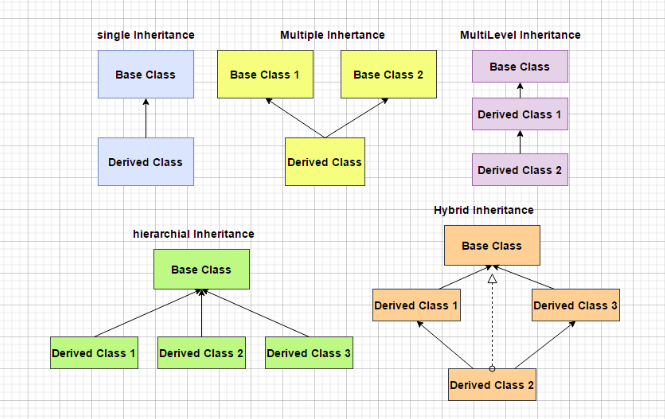

    </details>

  --- 

  #### 101. Для чего используют виртуальное наследование?

    - <details><summary>Ответ:</summary>

      [Виртуальное наследование](https://www.sandordargo.com/blog/2020/12/23/virtual-inheritance) используется для
      решения проблемы DDD (Dreadful Diamond on Derivation).
    </details>

  ---

  #### 102. Как можно решить проблему ромбовидного наследования без использования виртуального наследования?

    - <details><summary>Овтет:</summary>

      ```c++
      class A {
      public:
          int a;
      };
    
      class B : public A {
      public:
          int b;
      };
    
      class C : public A {
      public:
          int c;
      };
    
      class D : public B, C {
      public:
          int d;
      };
    
      int main() {
    
          D d;
          d.B::a = 4;
          std::cout << d.B::a;
      }
      ```
      ##### Дополнительно:

        - [Как можно решить проблему ромбовидного наследования без использования](https://triatlon-nn.ru/ves/kak-mozhno-reshit-problemu-rombovidnogo-nasledovaniya-bez-ispolzovaniya-virtualnogo-nasledovaniya.html)
        - [Что такое алмазная проблема в C++?](https://www.makeuseof.com/what-is-diamond-problem-in-cpp/)
        - [ What is the "dreaded diamond"?](http://www.parashift.com/c++-faq/mi-diamond.html)
    </details>

  ---

  #### 103. Что случится, если класс-наследник передать по значению в функцию, которая принимает базовый класс?

    - <details><summary>Ответ:</summary>

        - Ответ требует проверку!

      Функция, принимающая ссылку или указатель, относится к переданному исходному объекту, а аргументы по значению
      создадут копию вашего объекта. Поскольку вы копируете только базовую часть (поскольку она принимает базовый
      объект), вы в конечном итоге работаете с копией только базовой части, и она действует как база, потому что она
      является базой.

      Это «только базовое» копирование называется «нарезкой», потому что оно копирует только часть вашего объекта,
      «отсекая» производную часть.
    </details>

  ---

  #### 104. Что случится, если пронаследоваться от базового класса, который не имеет виртуального конструктора?

    - <details><summary>Ответ:</summary>

      Это зависит от того, о чем мы говорим:

        - для классов Traits (нет данных) это нормально ( `std::unary_function` приходит на ум)
        - для `private` наследования (используется вместо композиции, чтобы извлечь выгоду из оптимизации пустой базы)
          это
          тоже нормально

      Проблема возникает, когда вы начинаете полиморфно обрабатывать такой производный объект относительно этого
      базового класса. Если вы когда-нибудь достигнете такого положения, то это определенно запах кода.

      Примечание. Даже если выше указано, что все в порядке, вы по-прежнему предоставляете возможность полиморфного
      использования класса и, таким образом, подвергаете себя незаметным ошибкам.

    </details>

  ---

  #### 105. Что случится, если вызвать переопределенную virtual function из конструктора? Может ли конструктор быть виртуальным?

    - <details><summary>Ответ:</summary>

        - Любая реализация С++ должна вызывать в конструкторе или деструкторе реализацию функции объявленную на уровне
          текущего класса в иерархии.

          Выдержка из [CPP FAQ](https://isocpp.org/wiki/faq/strange-inheritance#calling-virtuals-from-ctors):

          ```

             In a constructor, the virtual call mechanism is disabled because overriding from derived classes hasn’t yet happened.
             Objects are constructed from the base up, “base before derived”.

             Destruction is done “derived class before base class”, so virtual functions behave as in constructors: Only the local
             definitions are used – and no calls are made to overriding functions to avoid touching the (now destroyed) derived class
             part of the object.
          ```

          Если в двух словах, то в конструкторе виртуальные функции не работают потому что конечный объект еще не
          сконструрован, а в деструкторах - потому что конечный объект уже разрушен.

            1) [Параметризовать функцию, и передать ей всё необходимое](Codes/105_1.cpp)
               `Суть: нет виртуальных функций - нет проблем.`
            2) [Фабричный метод](Codes/105_2.cpp)
               `Суть: вместо конструктора используем метод construct, который сначала целиком создаст объект, и только потом начнет вызывать виртуальные функции.`
            3) [Конверт/Письмо](Codes/105_3.cpp)
               `Суть: тот же фабричный метод ввиде класса. Конверт Envelope хранит внутри себя письмо Derived и делегирует ему все вызовы виртуальных функций.`

        - В C++ конструктор не может быть виртуальным, потому что при выполнении конструктора класса в памяти нет
          виртуальной таблицы, что означает, что виртуальный указатель еще не определен. Итак, конструктор всегда должен
          быть невиртуальным.

          Но виртуальный деструктор возможен.
    </details>

  ---

  #### 106. Может ли pure virtual function иметь имплементацию? Что случится, если вызвать pure virtual function из конструктора?

    - <details><summary>Ответ:</summary>

        - Можно ли реализовать виртуальные функции?
          Чисто виртуальная функция должна быть реализована в производном типе, экземпляр которого создается мгновенно,
          но базовый тип по-прежнему может определять реализацию.

        - Должны ли быть реализованы чисто виртуальные функции?
          Абстрактные классы и чисто виртуальные функции Чисто виртуальная функция или чисто виртуальный метод — это
          виртуальная
          функция, которая должна быть реализована производным классом, если производный класс не является абстрактным.
          Классы,
          которые содержат чисто виртуальные методы, называются «абстрактными» и не могут быть созданы напрямую.

        - Может ли чистая виртуальная функция иметь реализацию на C++?
          C++ поддерживает чисто виртуальные функции с реализацией, поэтому разработчики классов могут заставить
          производные
          классы переопределять функцию для добавления конкретных деталей, но при этом предоставлять полезную реализацию
          по
          умолчанию, которую они могут использовать в качестве общей базы. Если вы определяете его как чисто
          виртуальный,
          производный класс должен реализовать эту функцию.

        - Какова реализация, чтобы сделать функцию чисто виртуальной?
          Чисто виртуальная функция предотвращает создание экземпляра базового класса, а производные классы вынуждены
          определять
          эти функции до того, как они могут быть созданы. Это гарантирует, что производные классы не забудут
          переопределить
          функциональные возможности, ожидаемые базовым классом.

        - Может ли чистая виртуальная функция иметь тело C++?
          Чисто виртуальные функции (если set = 0) также могут иметь тело функции.

        - Что правильно с чисто виртуальной функцией?
          Какое утверждение о чисто виртуальных функциях верно? Объяснение: Чисто виртуальная функция не имеет
          определения,
          соответствующего базовому классу. Все производные классы могут иметь или не иметь чисто виртуальную реализацию
          функции.

        - Нужно ли мне реализовывать чисто виртуальную функцию на С++?
          C++ не запрещает Base предоставлять определение чисто виртуальной функции. Однако производный класс еще не
          реализовал
          чисто виртуальную функцию. Определение чистой виртуальной функции должно быть вне объявления (в заголовке или
          в исходном
          файле, не имеет значения).

        - Как реализованы виртуальные методы в C++?
          Правила для виртуальных функций в C++: Виртуальные функции должны быть объявлены в разделе public класса. Они
          не могут
          быть статическими, а дружественная функция не может быть виртуальной функцией другого класса. Доступ к
          виртуальным
          функциям должен осуществляться с помощью указателя для получения полиморфизма во время выполнения.

        - Можно ли определить чистую виртуальную функцию в базовом классе?
          Чисто виртуальная функция — это функция-член базового класса, единственное объявление, объявление которого
          предоставляется в базовом классе и должно быть определено в производном классе; в противном случае производный
          класс
          становится абстрактным.

        - Например, что такое чистая виртуальная функция в С++?
          Чисто виртуальная функция — это функция-член в базовом классе, объявление которой предоставлено в базовом
          классе и
          реализовано в производном классе. Классы, содержащие виртуальные функции, не являются абстрактными классами.
          Классы,
          содержащие чисто виртуальные функции, являются абстрактными классами.

        - Может ли чисто виртуальная функция иметь параметры?
          Да, виртуальные функции C++ могут иметь параметры по умолчанию.

        - Законно ли иметь абстрактный класс со всеми чисто виртуальными функциями-членами?
          Чистые виртуальные определения Чистым виртуальным функциям можно дать небольшое определение в абстрактном
          классе,
          которое должно быть у всех производных классов. Вы по-прежнему не можете создать объект в классе Abstract.
          Чисто
          виртуальное онлайн-определение является незаконным.

        - Что, если класс, производный от абстрактного класса, не обеспечивает реализацию чисто виртуальной функции?
          Если мы не переопределим чистую виртуальную функцию производного класса, производный класс также станет
          абстрактным
          классом. Следующий пример демонстрирует то же самое.
    </details>

  ---

  #### 107. Какие методы генерируются для класса по умолчанию? В каком случае такие методы не будут генерироваться? Как заставить компилятор добавить/удалить эти методы?

    - <details><summary>Ответ:</summary>

        - Конструктор по умолчании:
          объявляется, только если не объявлен пользовательский конструктор. Определяется при использовании

        - Конструктор копирования:
          объявляется только в том случае, если пользователь его не объявил. Определяется, если используется

        - Оператор копирования-присваивания:
          такой же, как и выше

        - Деструктор такой:
          же как и выше

          ##### В C++11 есть еще два:
        - Move constructor
        - Move-assignment operator

          Также возможно, что компилятор не сможет сгенерировать некоторые из них. Например, если класс содержит,
          например, ссылку (или что-то еще, что нельзя присвоить копированию), то компилятор не сможет сгенерировать для
          вас оператор присваивания копирования. Для получения дополнительной
          информации [прочитайте это](https://en.cppreference.com/w/cpp/language/classes)

      Если ты определишь хоть какой-то конструктор (с параметрами или без), то конструктор по умолчанию не будет
      сгенерирован.

      Конструктор копирования, оператор присваивания и деструктор, не будут генерироваться только в случае, если ты сам
      их
      определишь.

        - Если не хотим методы по умолчанию, то делаем свои или отменяем их генерацию через `= delete`;
        - Можем явно указать, что используем метод по умолчанию через `= default;`

    </details>

  ---

  #### 108. Как запретить наследовать класс?

    - <details><summary>Ответ:</summary>

      Начиная с `С++11`, вы можете добавить ключевое слово `final` в свой класс, например

      ```c++
      class CBase final
      {
       ...
      ```
    </details>

  ---

  #### 109. Какой порядок конструирования и разрушения классов в иерархии? Порядок инициализации полей класса?

    - <details><summary>Ответ:</summary>

      ```c++
      class B
      {
      public:
         B()
          {  
             cout<<"Construct B"<<endl;
          }
    
         virtual ~B()
         {
             cout<<"Destruct B"<<endl;
         }
      };
    
      class D : public B
      {
      public:
          D()
          {  
              cout<<"Construct D"<<endl;
          }
     
          virtual ~D()
         {
              cout<<"Destruct D"<<endl;
         }
      };

      int main(int argc, char **argv)
      {
          D d;
          return 0;
      }
      ```

      Output of example:

      ```
      Construct B
    
      Construct D
    
      Destruct D
    
      Destruct B
      ```
      Многоуровневое наследование работает подобно стеку:

      Если вы рассматриваете помещение элемента в стек как создание, а снятие - как уничтожение, то вы можете
      рассматривать многоуровневое наследование как стек.
      Это работает для любого количества уровней.
      Пример `D2` происходит от `D`, происходит от `B`.
      Поместим `B` в стек, поместим `D` в стек, поместим `D2` в стек. Таким образом, порядок построения будет `B`, `D`
      , `D2`. Затем,
      чтобы выяснить порядок разрушения, начните тыкать. `D2`, `D`, B`
      Более сложные [примеры:](https://isocpp.org/wiki/faq/multiple-inheritance#mi-vi-ctor-order)

    </details>

  ---

  #### 110. Какие есть способы инициализации полей класса?

    - <details><summary>Ответ:</summary>

      Из [авторитетного](http://www.stroustrup.com/C++11FAQ.html#member-init) источника (это очень похоже на более
      раннее стандартное предложение [N2756](http://www.open-std.org/jtc1/sc22/wg21/docs/papers/2008/n2756.htm) ):

        - ##### Инициализаторы членов класса

      В C++98 в классе могут быть инициализированы только статические константные члены целочисленных типов, и
      инициализатор должен быть константным выражением. Эти ограничения гарантируют, что мы можем выполнить
      инициализацию во время компиляции. Например:

      интервал переменная = 7;

      ```c++
      class X {
          static const int m1 = 7; // ok
          const int m2 = 7; // error: not static
          static int m3 = 7; // error: not const
          static const int m4 = var; // error: initializer not constant expression
          static const string m5 = "odd"; // error: not integral type
          // ...
      };
      ```

      Основная идея C++11 состоит в том, чтобы позволить инициализировать нестатический член данных там, где он
      объявлен (в
      своем классе). Затем конструктор может использовать инициализатор, когда требуется инициализация во время
      выполнения.

      Рассмотреть возможность:

      ```c++
      class A {
      public:
          int a = 7;
      };
      ```

      Это эквивалентно:

      ```c++
      class A {
      public:
          int a;
          A() : a(7) {}
      };
      ```

      Это избавляет от необходимости печатать, но настоящие преимущества проявляются в классах с несколькими
      конструкторами.
      Часто все конструкторы используют общий инициализатор для члена:

      ```c++
      class A {
      public:
          A(): a(7), b(5), hash_algorithm("MD5"), s("Constructor run") {}
          A(int a_val) : a(a_val), b(5), hash_algorithm("MD5"), s("Constructor run") {}
          A(D d) : a(7), b(g(d)), hash_algorithm("MD5"), s("Constructor run") {}
          int a, b;
      private:
          HashingFunction hash_algorithm; // Cryptographic hash to be applied to all A instances
          std::string s; // String indicating state in object lifecycle
      };
      ```

      Тот факт, что hash_algorithm и s имеют одно значение по умолчанию, теряется в беспорядке кода и может легко стать
      проблемой во время обслуживания. Вместо этого мы можем исключить инициализацию элементов данных:

      ```c++
      class A {
      public:
          A(): a(7), b(5) {}
          A(int a_val) : a(a_val), b(5) {}
          A(D d) : a(7), b(g(d)) {}
          int a, b;
      private:
          HashingFunction hash_algorithm{"MD5"}; // Cryptographic hash to be applied to all A instances
          std::string s{"Constructor run"}; // String indicating state in object lifecycle
      };
      ```

      Если член инициализируется как инициализатором в классе, так и конструктором, выполняется только инициализация
      конструктора (он «отменяет» значение по умолчанию). Таким образом, мы можем упростить дальше:

      ```c++
      class A {
      public:
          A() {}
          A(int a_val) : a(a_val) {}
          A(D d) : b(g(d)) {}
          int a = 7;
          int b = 5;  
      private:
          HashingFunction hash_algorithm{"MD5"}; // Cryptographic hash to be applied to all A instances
          std::string s{"Constructor run"}; // String indicating state in object lifecycle
      };
      ```` 
    </details>

  ----

  #### 111. Может ли деструктор быть виртуальным?

    - <details><summary>Ответ:</summary>

      Виртуальный деструктор необходим, когда в классе есть хоть одна виртуальная функция или класс является базовым.
      При удалении объекта производного класса через указатель на базовый класс, деструктор которого не является
      виртуальным, результат не определен. Чаще всего результатом будет утечка памяти, так как не вызовется деструктор
      производного класса.

      Пример:

      ```c++
      #include <iostream>
    
      class A{
      public:
          A(){ std::cout << "A constructor\n"; }
          ~A(){ std::cout << "A destructor\n"; }
      };
      class B : public A{
      public:
          B(){ std::cout << "B constructor\n"; }
          ~B(){ std::cout << "B destructor\n"; }
      };
    
      int main() {
          A *pb = new B;
          delete pb;
      }
      ```
    </details>

  ---

  #### 112. Что делает ключевое слово virtual?

    - <details><summary>Ответ:</summary>

      Если функция объявлена виртуальной в базовом классе, то она становится виртуальной и в производных классах и там
      писать слово virtual избыточно. Тело этой функции может быть переопределено в производном классе. Для
      безошибочного переопределения виртуальной функции лучше добавлять ключевое слово override.
        - Пример:

      ```virtual void draw() = 0;```
    </details>

  --- 

  #### 113. Для чего используют виртуальный деструктор?

    - <details><summary>Ответ:</summary>

      Деструктор — это функция-член экземпляра, которая вызывается автоматически всякий раз, когда объект будет
      уничтожен. Это означает, что деструктор — это последняя функция, которая будет вызываться перед уничтожением
      объекта.

        - Деструктор также является специальной функцией-членом, такой, как конструктор. Деструктор уничтожает объекты
          класса, созданные конструктором.
        - Деструктор имеет то же имя, что и имя их класса, которому предшествует мозаичный символ `-`.
        - Невозможно определить более одного деструктора.
        - Деструктор — это только один из способов уничтожить объект, созданный конструктором. Следовательно, деструктор
          не может быть перегружен.
        - Деструктор не требует никаких аргументов и не возвращает никакого значения.
        - Он вызывается автоматически, когда объект выходит за пределы области видимости.
        - Деструктор освобождает место в памяти, занятое объектами, созданными конструктором.
        - В деструкторе объекты уничтожаются в обратном порядке создания объекта.

      Здесь следует отметить, что если объект создается с использованием new или конструктор использует `new` для
      выделения памяти, которая находится в куче памяти или в свободном хранилище, деструктор должен
      использовать `delete`
      для освобождения памяти.
    </details>

  ---

  #### 114. Что такое глубокое копирование?

    - <details><summary>Ответ:</summary>

      В Deep copy объект создается путем копирования данных всех переменных, а также выделяет объекту аналогичные
      ресурсы памяти с тем же значением. Чтобы выполнить глубокое копирование, нам нужно явно определить конструктор
      копирования и при необходимости также выделить динамическую память. Кроме того, требуется динамическое выделение
      памяти для переменных в других конструкторах.

      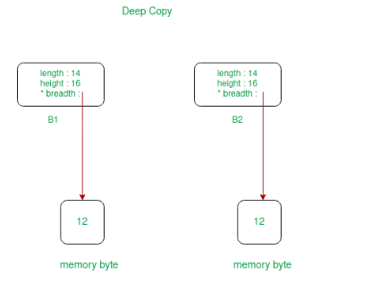

        - Пример:

      ```c++
      #include <iostream>
      using namespace std;
    
      // Box Class
      class box {
      private:
          int length;
          int* breadth;
          int height; 
      public:
          // Constructor
          box()
          {
              breadth = new int;
          }

          // Function to set the dimensions
          // of the Box
          void set_dimension(int len, int brea, int heig)
          {
              length = len;
              *breadth = brea;
              height = heig;
          }
 
          // Function to show the dimensions
          // of the Box
          void show_data()
          {
              cout << " Length = " << length << "\n Breadth = " << *breadth
                   << "\n Height = " << height
                   << endl;
          }
 
          // Parameterized Constructors for
          // for implementing deep copy
          box(box& sample)
          {
              length = sample.length;
              breadth = new int;
              *breadth = *(sample.breadth);
              height = sample.height;
          }
 
          // Destructors
          ~box()
          {
              delete breadth;
          }
      };
    
      // Driver Code
      int main()
      {
          // Object of class first
          box first;

          // Set the dimensions
          first.set_dimension(12, 14, 16);
 
          // Display the dimensions
          first.show_data();
 
          // When the data will be copied then
          // all the resources will also get
          // allocated to the new object
          box second = first;
 
          // Display the dimensions
          second.show_data();
 
          return 0; 
      }
      ````
    </details>

  ---

  #### 115. Что такое виртуальные функции и зачем они нужны?

    - <details><summary>Ответ:</summary>

      виртуальная функция - это функция, объявление которой содержит ключевое слово `virtual`. Если функция объявлена
      виртуальной в базовом классе, то она становится виртуальной и в производных классах и там писать слово `virtual`
      избыточно. Тело этой функции может быть переопределено в производном классе. Для безошибочного переопределения
      виртуальной функции лучше добавлять ключевое слово `override`.

      При вызове виртуальной функции происходит динамическое или позднее связывание компилятор вставляет в программу
      фрагмент кода для определения и вызова правильной функции, зависящей от типа объекта.

      Как работает механизм определения типа объекта: компилятор создает таблицу `VTABLE` виртуальных функций для
      каждого
      класса, содержащего виртуальные функции. И помещает туда адреса виртуальных функций данного класса. В каждом таком
      классе скрыто хранится указатель на таблицу виртуальных функций VPTR. При вызове виртуальной функции через
      указатель на базовый класс, компилятор вставляет в программу код, который получает указатель `VPTR` и добавляет
      смещение для нужной функции.

      Чисто виртуальная функция - это функция, тело которой отсутствует и `= 0`; Её необходимо определить в производном
      классе.

    </details>

  ---

  #### 116. Как защитить объект от копирования?

    - <details><summary>Ответ:</summary>

      ```Foo(Foo &foo) = delete;```
    </details>

  ---

  #### 117. Что такое семантика перемещения?

    - <details><summary>Ответ:</summary>

      Мне проще всего понять семантику перемещения на примере кода. Начнем с очень простого строкового класса, который
      содержит только указатель на блок памяти, выделенный в куче:

      ```c++
      #include <cstring>
      #include <algorithm>
    
      class string
      {
         char* data;
      public:
          string(const char* p)
          {
              size_t size = std::strlen(p) + 1;
              data = new char[size];
              std::memcpy(data, p, size);
          }
      ```

      Поскольку мы решили сами управлять памятью, нам нужно
      следовать [правилу трех](https://en.wikipedia.org/wiki/Rule_of_three_%28C++_programming%29). Я собираюсь отложить
      написание
      оператора присваивания и пока реализую только деструктор и конструктор копирования:

      ```c++
      ~string()
      {
          delete[] data;
      }
      string(const string& that)
      {
          size_t size = std::strlen(that.data) + 1;
          data = new char[size];
          std::memcpy(data, that.data, size);
      }
      ```

      Конструктор копирования определяет, что означает копирование строковых объектов. Параметр `const string&
      that` привязывается ко всем выражениям типа `string`, что позволяет делать копии в следующих примерах:

      ```c++
      string a(x); // Line 1
      string b(x + y); // Line 2
      string c(some_function_returning_a_string()); // Line 3
      ```

      Теперь приходит ключевое понимание семантики ходов. Обратите внимание, что `x` эта глубокая копия действительно
      необходима
      только в первой строке, которую мы копируем, потому что мы могли бы захотеть проверить `x` позже и были бы очень
      удивлены,
      если бы что-xто изменилось. Вы заметили, что я только что сказал `x` три раза (четыре раза, если включить это
      предложение)
      и каждый раз имел в виду один и тот же объект ? Мы вызываем такие выражения, как `x` «lvalues».

      Аргументы в строках 2 и 3 являются не `lvalue`, а `r-value`, потому что базовые строковые объекты не имеют имен,
      поэтому у
      клиента нет возможности проверить их снова в более поздний момент времени. `r-values` обозначают временные
      объекты,
      которые уничтожаются в следующей точке с запятой (точнее, в конце полного выражения, которое лексически содержит
      `r-value`). Это важно, потому что во время инициализации `b` и `c` мы могли делать с исходной строкой все, что
      хотели, и клиент не
      мог
      заметить разницы !

      C++0x представляет новый механизм под названием «ссылка на `r-value`», который, среди прочего, позволяет нам
      обнаруживать
      аргументы rvalue посредством перегрузки функций. Все, что нам нужно сделать, это написать конструктор со ссылочным
      параметром rvalue. Внутри этого конструктора мы можем делать с источником все, что захотим , пока мы оставляем его
      в
      каком-то допустимом состоянии:

      ```c++
      string(string&& that)   // string&& is an rvalue reference to a string
      {
          data = that.data;
          that.data = nullptr;
      }
      ```

      Что мы здесь сделали? Вместо того чтобы глубоко копировать данные кучи, мы просто скопировали указатель, а затем
      установили исходный указатель в нуль (чтобы предотвратить «delete []» из деструктора исходного объекта от
      выпуска
      наших «только что украденных данных»). По сути, мы «украли» данные, которые изначально принадлежали исходной
      строке.
      Опять же, ключевым моментом является то, что ни при каких обстоятельствах клиент не может обнаружить, что источник
      был
      изменен. Поскольку здесь мы не делаем копию, мы называем этот конструктор «конструктором перемещения». Его работа
      заключается в перемещении ресурсов из одного объекта в другой, а не в их копировании.

      Поздравляем, теперь вы понимаете основы семантики движений! Продолжим реализацию оператора присваивания. Если вы
      не
      знакомы с идиомой [copy and swap](https://stackoverflow.com/questions/3279543/what-is-the-copy-and-swap-idiom),
      изучите ее и вернитесь, потому что это потрясающая идиома C++, связанная с
      безопасностью исключений.

      ```c++
      string& operator=(string that)
      {
          std::swap(data, that.data);
          return *this;
      }
      };
      ```

      А, это все? "Где ссылка на r-value?" Вы можете спросить. "Нам это здесь не нужно!" это мой ответ :)

      Обратите внимание, что мы передаем параметр `that` по значению, поэтому `that` он должен быть инициализирован так
      же,
      как и
      любой другой строковый объект. Как именно `that` будет инициализировано? В старые времена C++98 ответ был бы "
      конструктором
      копирования". В C++0x компилятор выбирает между конструктором копирования и конструктором перемещения в
      зависимости от
      того, является ли аргумент оператора присваивания `l-value` или `r-value`.

      Поэтому, если вы скажете a = b, конструктор копирования инициализируется `that`(поскольку выражение `b`
      является `l-value`), а
      оператор присваивания заменяет содержимое только что созданной глубокой копией. Это и есть определение идиомы
      копирования и подкачки: сделайте копию, замените содержимое копией, а затем избавьтесь от копии, покинув область
      действия. Здесь нет ничего нового.

      Но если вы скажете a = x + y, конструктор перемещения будет инициализирован that(поскольку выражение x + y
      является
      значением r), так что не будет задействовано глубокое копирование, только эффективное перемещение. `that`
      по-прежнему
      является независимым объектом от аргумента, но его конструкция была тривиальной, поскольку данные кучи не нужно
      было
      копировать, а просто перемещать. Его не нужно было копировать, потому что x + y это `r-value`, и опять же, можно
      перейти от
      строковых объектов, обозначенных `r-values`.

      Подводя итог, конструктор копирования делает глубокую копию, потому что источник должен оставаться нетронутым.
      Конструктор перемещения, с другой стороны, может просто скопировать указатель, а затем установить указатель в
      источнике
      равным нулю. Можно «аннулировать» исходный объект таким образом, потому что у клиента нет возможности снова
      проверить
      объект.

      Я надеюсь, что этот пример донес основную мысль. Существует гораздо больше ссылок на `r-value` и перемещения
      семантики,
      которые я намеренно опустил, чтобы упростить задачу. Если вы хотите получить более подробную информацию, см. мой
      дополнительный ответ.

    </details>

  ---

---

- ### <span style="color:red">STL / Algorithms<span/>

  #### 118 Из чего состоит STL?

    - <details><summary>Ответ:</summary>

      Википедия пишет: Стандартная библиотека шаблонов `STL` — это программная библиотека, первоначально разработанная
      Александром Степановым для языка программирования C++ , которая повлияла на многие части стандартной библиотеки
      C++. Он предоставляет четыре компонента: `алгоритмы`, `контейнеры`, `функции` и `итераторы`.

      STL предоставляет набор общих для C++ классов, таких как контейнеры и ассоциативные массивы , которые можно
      использовать с любым встроенным типом и с любым определяемым пользователем типом, поддерживающим некоторые
      элементарные
      операции (такие, как копирование и присваивание). Алгоритмы STL не зависят от контейнеров, что значительно снижает
      сложность библиотеки.

    </details>

  ---

  ### 119. Какие алгоритмы применяли с STL? В чем преимущество использования алгоритмов перед собственноручно написанными функциями?

    - <details><summary>Ответ:</summary>

      Стоит ли изобретать велосипеды? вот и все ответ

        - Список [алгоритмов](https://cplusplus.com/reference/algorithm/)
    </details>
    
  ---

  #### 120. Расскажите о контейнерах стандартной библиотеки vector, list, map, unordered_map.

    - <details><summary>Ответ:</summary>

        - [std::vector](https://en.cppreference.com/w/cpp/container/vector) представляет собой контейнер
          последовательности, который инкапсулирует массивы динамического
          размера.
        - [std::list ](https://en.cppreference.com/w/cpp/container/list)— это контейнер, который поддерживает вставку и
          удаление элементов с постоянным временем из любого
          места в контейнере. Быстрый произвольный доступ не поддерживается. Обычно он реализуется в виде двусвязного
          списка. По сравнению с [std::forward_list](https://en.cppreference.com/w/cpp/container/forward_list) этот
          контейнер обеспечивает возможность двунаправленной итерации, при
          этом занимая меньше места.
        - [std::map](https://en.cppreference.com/w/cpp/container/map) представляет собой отсортированный ассоциативный
          контейнер, содержащий пары ключ-значение с
          уникальными ключами. Ключи сортируются с помощью функции сравнения Compare. Операции поиска, удаления и
          вставки имеют логарифмическую сложность. Карты обычно реализуются в
          виде [красно-черных деревьев ](https://en.wikipedia.org/wiki/Red%E2%80%93black_tree).
        - [std::unordered_map](https://en.cppreference.com/w/cpp/container/unordered_map) это ассоциативный контейнер,
          содержащий пары ключ-значение с уникальными ключами. Поиск, вставка и удаление элементов имеют среднюю
          сложность с постоянным временем.

          Внутри элементы не сортируются в каком-либо определенном порядке, а организованы в сегменты. В какое ведро
          помещается элемент, полностью зависит от хэша его ключа. Ключи с одинаковым хеш-кодом появляются в одном
          сегменте.
          Это обеспечивает быстрый доступ к отдельным элементам, поскольку после вычисления хэша он относится к точному
          сегменту, в который помещен элемент.
    </details>

  ---

  #### 121. Какие знаете типы итераторов? Чем они отличаются? В каких контейнерах используются?

    - <details><summary>Ответ:</summary>

        - 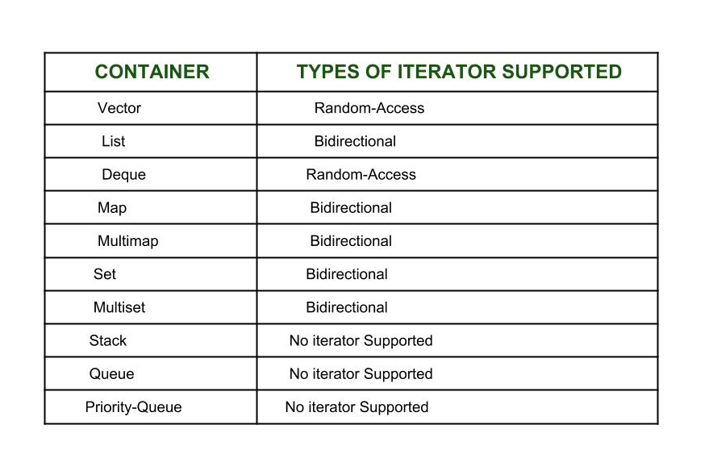

      Типы итераторов. В зависимости от функциональности итераторов их можно разделить на пять основных категорий:
        - Итераторы ввода: они самые слабые из всех итераторов и имеют очень ограниченную функциональность. Их можно
          использовать только в однопроходных алгоритмах, т. е. таких алгоритмах, которые обрабатывают контейнер
          последовательно, так что ни к одному элементу не обращаются более одного раза.
        - Итераторы вывода: Так же, как итераторы ввода , они также очень ограничены в своей функциональности и могут
          использоваться только в однопроходном алгоритме, но не для доступа к элементам, а для присвоения элементов.
        - Прямой итератор: они выше в иерархии, чем входные и выходные итераторы , и содержат все функции,
          присутствующие в этих двух итераторах. Но, как следует из названия, они также могут двигаться только в прямом
          направлении, и это тоже шаг за шагом.
        - Двунаправленные итераторы: у них есть все функции прямых итераторов , а также тот факт, что они преодолевают
          недостаток прямых итераторов, поскольку они могут двигаться в обоих направлениях, поэтому их имя
          двунаправленное.
        - Итераторы с произвольным доступом: это самые мощные итераторы. Они не ограничены последовательным
          перемещением, как следует из их названия, они могут произвольно обращаться к любому элементу внутри
          контейнера. Это те, чья функциональность такая же, как у указателей.

      Следующая диаграмма показывает разницу в их функциональности по отношению к различным операциям

        - 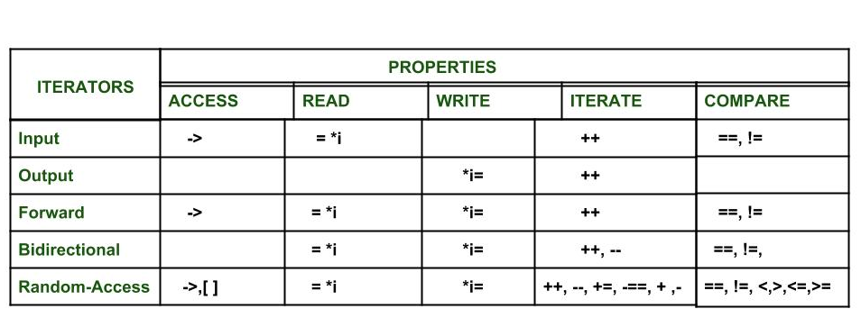

    </details>

  ---

  #### 122. Какая разница между std::set, std::map, std::unordered_multimap?

    - <details><summary>Ответ:</summary>

      Оба [std::set](https://en.cppreference.com/w/cpp/container/set)
      и [std::map](https://en.cppreference.com/w/cpp/container/map) есть `associative containers`. Разница в том, что
      std::set содержат только ключ,
      в то время как в std::map есть связанное значение, то есть если `A->B` , то `map[A]=B` , это работает
      как `hashing` но не `O(1)`, вместо этого `O(log N)`.

      Вы можете дополнительно посмотреть [unordered_map](https://en.cppreference.com/w/cpp/container/unordered_map),
      который обеспечивает работу во `O(1)` времени.

      std::set сохраняет данные в отсортированном формате.
      Реализация обоих выполняется с помощью сбалансированных деревьев (например, AVL или красно-черных деревьев), что
      `O(logN)`
      усложняет время.

      Unordered multimap — это неупорядоченный ассоциативный контейнер, который поддерживает эквивалентные ключи (
      unordered_multimap может содержать несколько копий каждого значения ключа) и связывает с ключами значения другого
      типа. Класс unordered_multimap поддерживает прямые итераторы. Поиск, вставка и удаление имеют среднюю сложность с
      постоянным временем.

      Но важно отметить, что оба могут хранить уникальные значения . Чтобы преодолеть это, вы также должны видеть
      [multimap](https://en.cppreference.com/w/cpp/container/multimap) и
      [multiset](https://en.cppreference.com/w/cpp/container/multiset).

    </details>

  ---

  #### 123. Что такое идиома remove-erase?

    - <details><summary>Ответ:</summary>

      Идиома [стереть-удалить](https://en.wikipedia.org/wiki/Erase%E2%80%93remove_idiom) — это распространенный метод
      C++ для удаления элементов, соответствующих определенному критерию, из контейнера стандартной библиотеки C++
    </details>

  ---

  #### 124. Как получить наименьшее значение типа?

    - <details><summary>Ответ:</summary>

      ```c++
      #include <algorithm>
      #include <iostream>
      #include <vector>
    
      int main()
      {
          std::vector<int> v{3, 1, 4, 1, 5, 9};

          std::vector<int>::iterator result = std::min_element(v.begin(), v.end());
          std::cout << "min element at: " << std::distance(v.begin(), result);
      }
      ```
     </details>

  ---

  #### 125. Какая разница между std::map и std::hashmap?

    - <details><summary>Ответ:</summary>

        - map использует красно-черное дерево в качестве структуры данных, поэтому элементы, которые вы туда помещаете,
          сортируются, а вставка/удаление выполняется за O(log(n)). Элементы нужно реализовать хотя бы `operator<`.

        - hashmap использует хэш, поэтому элементы не сортируются, вставка/удаление выполняется за O(1). Элементы нужно
          реализовать как минимум `operator==` и нужна хеш-функция.

    </details>

  ---

  #### 126. Как подсчитать количество элементов в std::list?

    - <details><summary>Ответ:</summary>

      ```c++
     
      #include <list>
      #include <iostream>

      int main()
      {
          std::list<int> nums {1, 3, 5, 7};

          std::cout << "nums contains " << nums.size() << " elements.\n";
      }
      ```
    </details>

  ---

  #### 127. Что такое сложность алгоритма и от чего она зависит?

    - <details><summary>Ответ:</summary>

      [Вычисли́тельная сло́жность](https://habr.com/ru/post/188010/) — понятие в информатике и теории алгоритмов,
      обозначающее функцию зависимости объёма
      работы, которая выполняется некоторым алгоритмом, от размера входных данных. Раздел, изучающий вычислительную
      сложность, называется теорией сложности вычислений. Объём работы обычно измеряется абстрактными понятиями времени
      и пространства, называемыми вычислительными ресурсами.
    </details>

  ---

  #### 128. В чем разница между vector и list и в каких случаях их лучше использовать?

    - <details><summary>Ответ:</summary>

        - [std::vector](https://en.cppreference.com/w/cpp/container/vector): Вектор — это тип динамического массива,
          который может автоматически изменять размер после вставки или
          удаления элементов. Элементы в векторе размещаются в непрерывном хранилище, чтобы к ним можно было получить
          доступ и пройти с помощью итераторов. Элемент вставляется в конец вектора.
        - [std::list](https://en.cppreference.com/w/cpp/container/list): Список представляет собой двойную связанную
          последовательность, которая поддерживает как прямой, так и
          обратный обход. Время, затрачиваемое на вставку и удаление в начале, конце и середине, постоянно. Он имеет
          несмежную память и не имеет предварительно выделенной памяти.

        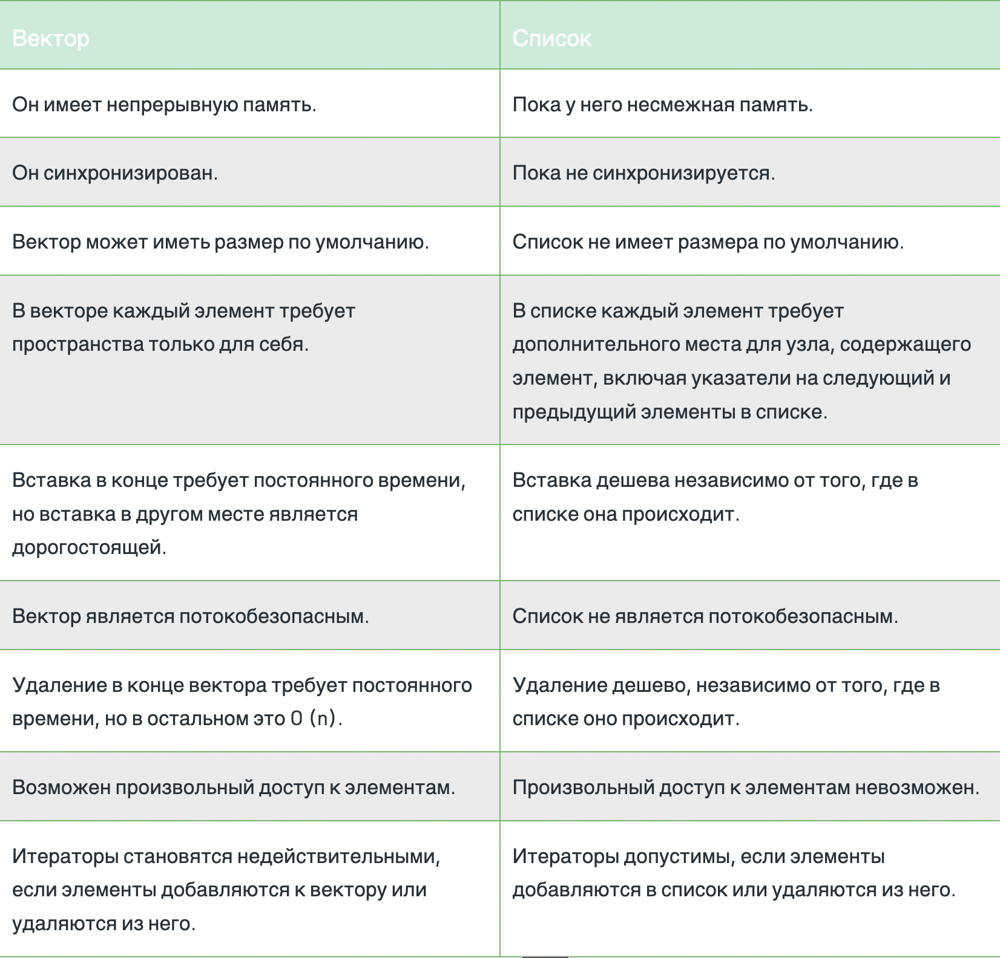

    </details>

  ---

---

- ### <span style="color:red">Многопоточность<span/>

  #### 129. Что вам известно о многопоточности?

    - <details><summary>Ответ:</summary>

      Поддержка многопоточности была введена в C+11. До C++11 нам приходилось использовать
      потоки  [POSIX threads or p threads library in C](https://www.geeksforgeeks.org/multithreading-c-2/). Хотя эта
      библиотека выполняла свою работу, отсутствие какого-либо стандартного языкового набора функций вызывало серьезные
      проблемы с переносимостью. C++ 11 избавился от всего этого и дал нам std::thread . Классы потоков и связанные с
      ними функции определены в заголовочном файле потока .

      [std::thread](https://en.cppreference.com/w/cpp/thread/thread) — это класс потока, представляющий один поток в
      C++. Чтобы запустить поток, нам просто нужно создать новый
      объект потока и передать исполняемый код, который будет вызываться (т. е. вызываемый объект) в конструктор
      объекта.
      После создания объекта запускается новый поток, который будет выполнять код, указанный в callable.

      Вызываемый может быть любым из трех

        - Указатель функции
        - Функциональный объект
        - Лямбда-выражение

      После определения callable передайте его конструктору.

      ```c++
      #include<thread>
      std::thread thread_object(callable)
      ```

      Запуск потока с помощью указателя на функцию
      В следующем фрагменте кода показано, как это делается.

      ```c++
      void foo(param)
      {
          // Do something
      }

      // The parameters to the function are put after the comma
      std::thread thread_obj(foo, params);
      ```

      Запуск потока с использованием лямбда-выражения

      Следующий фрагмент кода демонстрирует, как это делается

      ```c++
           // Define a lamda expression
           auto f = [](params) {
          // Do Something
      };
    
      // Pass f and its parameters to thread
      // object constructor as
      std::thread thread_object(f, params);
      ```

      Мы также можем передавать лямбда-функции непосредственно в конструктор.

      ```c++
      std::thread thread_object([](params) {
      // Do Something
      };, params);
      ```

      Запуск потоков с использованием функциональных объектов

      Следующий фрагмент кода демонстрирует, как это делается

      ```c++
      // Define the class of function object
      class fn_object_class {
          // Overload () operator
          void operator()(params)
          {
          // Do Something
          }
      }
    
      // Create thread object
      std::thread thread_object(fn_object_class(), params)
      ```

      Ожидание завершения потоков

      После запуска потока нам может потребоваться дождаться завершения потока, прежде чем мы сможем предпринять
      какие-либо действия. Например, если мы передаем задачу инициализации графического интерфейса приложения потоку,
      нам нужно дождаться завершения потока, чтобы убедиться, что графический интерфейс загружен правильно.

      Чтобы дождаться потока, используйте функцию std::thread::join() . Эта функция заставляет текущий поток ждать, пока
      поток, указанный *this , не завершит выполнение.
      Например, чтобы заблокировать основной поток до завершения потока t1, мы должны сделать

      ```c++
      int main()
      {
          // Start thread t1
          std::thread t1(callable);
    
          // Wait for t1 to finish
          t1.join();
      
          // t1 has finished do other stuff
      
          ...
      }
      ```

      Полная программа на C++

      Программа C++ приведена ниже. Он запускает три потока из основной функции. Каждый поток вызывается с
      использованием одного из вызываемых объектов, указанных выше.

      ```c++
      // CPP program to demonstrate multithreading
      // using three different callables.
      #include <iostream>
      #include <thread>
      using namespace std;
     
      // A dummy function
      void foo(int Z)
      {
          for (int i = 0; i < Z; i++) {
          cout << "Thread using function"
               " pointer as callable\n";
          }
      }
    
      // A callable object
      class thread_obj {
      public:
          void operator()(int x)
          {
              for (int i = 0; i < x; i++)
                  cout << "Thread using function"
                      " object as  callable\n";
          }
      };
    
      int main()
      {
          cout << "Threads 1 and 2 and 3 "
              "operating independently" << endl;

          // This thread is launched by using 
          // function pointer as callable
          thread th1(foo, 3);
  
          // This thread is launched by using
          // function object as callable
          thread th2(thread_obj(), 3);
  
           // Define a Lambda Expression
           auto f = [](int x) {
               for (int i = 0; i < x; i++)
                   cout << "Thread using lambda"
                       " expression as callable\n";
           };
   
          // This thread is launched by using 
          // lamda expression as callable
          thread th3(f, 3);
  
          // Wait for the threads to finish
          // Wait for thread t1 to finish
          th1.join();
  
          // Wait for thread t2 to finish
          th2.join();
  
          // Wait for thread t3 to finish
          th3.join();
  
          return 0;
      }
      ```

    </details>

  ---

  #### 130. Что общего и различного в процессах и потоках?

    - <details><summary>ответ:</summary>

        - Процесс. Процессы — это в основном программы, которые отправляются из состояния готовности и планируются в ЦП
          для
          выполнения. PCB (блок управления процессом) содержит концепцию процесса. Процесс может создавать другие
          процессы, которые называются дочерними процессами. Процессу требуется больше времени для завершения, и он
          изолирован, что означает, что он не использует память совместно с каким-либо другим процессом.

        - Поток: поток — это сегмент процесса, что означает, что процесс может иметь несколько потоков, и эти несколько
          потоков содержатся внутри процесса. Поток имеет три состояния: выполняется, готов и заблокирован.

          Поток занимает меньше времени для завершения по сравнению с процессом, но, в отличие от процесса, потоки не
          изолируются.

       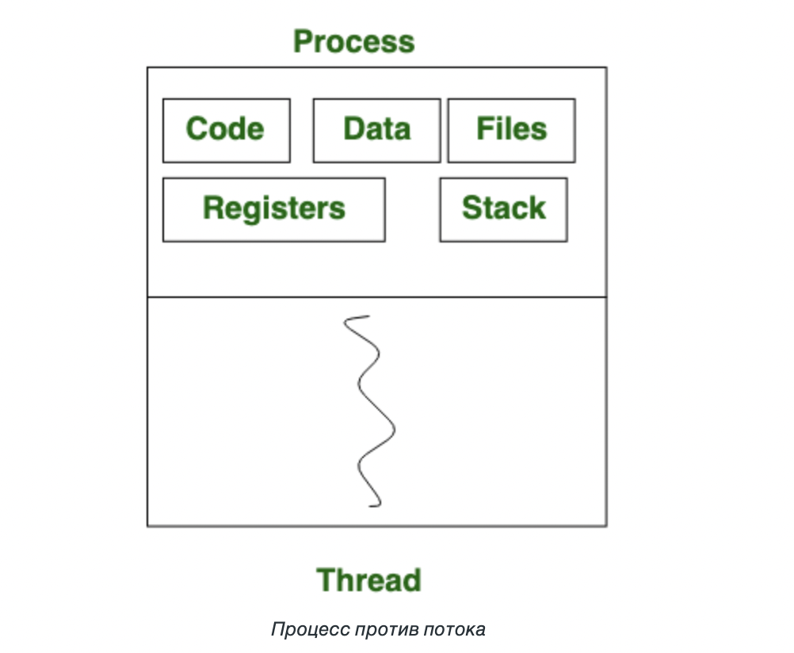

      Разница между процессом и потоком:

      

      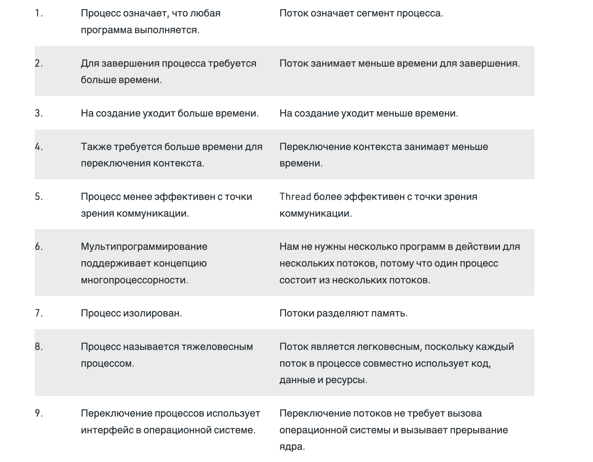

  </details>

  ---

  #### 131. Как синхронизировать передачи информации между потоками?

    - <details><summary>Ответ:</summary>

      Ответ требует доработки!
        - https://www.modernescpp.com/index.php/c-core-guidelines-sharing-data-between-threads

    </details>

  --- 

  #### 132. Какая разница между мьютексом и семафором?

    - <details><summary>Ответ:</summary>

      В чем разница между мьютексом и семафором? Когда вы должны использовать мьютекс и когда вы должны использовать
      семафор?

        - Для проектирования/разработки интеллектуальных приложений требуется конкретное понимание концепций
          операционной системы. Наша цель — обучить читателя этим концепциям и поучиться у других опытных гиков.

        - Согласно терминологии операционной системы, мьютексы и семафоры — это ресурсы ядра, предоставляющие службы
          синхронизации (также называемые примитивами синхронизации ). Зачем нужны такие примитивы синхронизации? Не
          будет ли достаточно одного? Чтобы ответить на эти вопросы, нам нужно понять несколько ключевых слов.
          Пожалуйста, прочтите посты об атомарности и критическом разделе . Мы проиллюстрируем их примерами, чтобы лучше
          понять эти концепции, а не следовать обычному текстовому описанию ОС.

      ##### Проблема [производителя-потребителя](https://en.wikipedia.org/wiki/Producer%E2%80%93consumer_problem) :

        - Обратите внимание, что содержание является обобщенным объяснением. Практические детали зависят от реализации.

        - Рассмотрим стандартную проблему производителя-потребителя. Предположим, у нас есть буфер длиной 4096 байт.
          Поток-производитель собирает данные и записывает их в буфер. Поток-потребитель обрабатывает собранные данные
          из буфера. Цель состоит в том, чтобы оба потока не запускались одновременно.

      ##### Использование мьютекса:

        - Мьютекс обеспечивает взаимное исключение, либо производитель, либо потребитель могут иметь ключ (мьютекс) и
          продолжать свою работу. Пока буфер заполнен производителем, потребитель должен ждать, и наоборот.

        - В любой момент времени со всем буфером может работать только один поток. Концепцию можно обобщить с помощью
          семафора.

      ##### Использование семафора:

        - `Семафор` — это обобщенный мьютекс. Вместо одного буфера мы можем разделить буфер размером 4 КБ на четыре
          буфера по 1 КБ (идентичные ресурсы). С этими четырьмя буферами может быть связан семафор. Потребитель и
          производитель могут одновременно работать с разными буферами.

      ##### Заблуждение:

        - Существует неоднозначность между двоичным семафором и мьютексом . Возможно, мы сталкивались с тем, что мьютекс
          — это двоичный семафор. Но это не так ! Назначение мьютекса и семафора различно. Возможно, из-за схожести их
          реализации мьютекс будет называться бинарным семафором.

        - Строго говоря, мьютекс — это `блокирующий механизм`, используемый для синхронизации доступа к ресурсу. Только
          одна задача (может быть поток или процесс на основе абстракции ОС) может получить мьютекс. Это означает, что с
          мьютексом связано право собственности, и только владелец может снять блокировку (мьютекс).

        - `Семафор` — это сигнальный механизм («я закончил, можешь продолжать»). Например, если вы слушаете песни (
          предположим, что это одна задача) на своем мобильном телефоне, и в то же время вам звонит ваш друг,
          срабатывает прерывание, после чего процедура обслуживания прерывания (ISR) сигнализирует задаче обработки
          вызова, чтобы вставай.

      ##### Основные вопросы:

        1. Может ли поток получить более одной блокировки (мьютекс)?
            - Да, возможно, что потоку требуется более одного ресурса, отсюда и блокировка. Если какая-либо блокировка
              недоступна, поток будет ожидать (блокировать) блокировку.
        2. Можно ли блокировать мьютекс более одного раза?
            - Мьютекс — это замок. С ним связано только одно состояние (заблокировано/разблокировано). Однако
              рекурсивный мьютекс может быть заблокирован более одного раза (системы, совместимые с POSIX), в которых с
              ним связан счет, но при этом сохраняется только одно состояние (заблокировано/разблокировано). Программист
              должен разблокировать мьютекс столько раз, сколько он был заблокирован.
        3. Что произойдет, если нерекурсивный мьютекс блокируется более одного раза.
            - Тупик. Если поток, который уже заблокировал мьютекс, попытается снова заблокировать мьютекс, он войдет в
              список ожидания этого мьютекса, что приведет к взаимоблокировке. Это потому, что никакой другой поток не
              может разблокировать мьютекс. Разработчик операционной системы может тщательно идентифицировать владельца
              мьютекса и вернуться, если он уже заблокирован тем же потоком, чтобы предотвратить взаимоблокировки.
        4. Бинарный семафор и мьютекс — одно и то же?
            - Нет. Мы предлагаем рассматривать их отдельно, как это объясняется в разделе «Механизмы сигнализации и
              блокировки». Но с бинарным семафором могут возникать те же критические проблемы (например, инверсия
              приоритета), что и с мьютексом. Мы рассмотрим их в следующей статье.
            - Программист может предпочесть мьютекс, а не создание семафора со счетчиком 1.
        5. Что такое мьютекс и критическая секция?
            - Некоторые операционные системы используют один и тот же критический раздел слова в API. Обычно мьютекс
              является дорогостоящей операцией из-за связанных с ним протоколов защиты. Наконец, целью мьютекса является
              атомарный доступ. Есть и другие способы добиться атомарного доступа, такие как отключение прерываний,
              которые могут быть намного быстрее, но снижают скорость отклика. Альтернативный API использует отключение
              прерываний.
        6. Что такое события?
            - Семантика мьютекса, семафора, события, критической секции и т. д. одинакова. Все являются примитивами
              синхронизации. По стоимости их использования они разные. Мы должны обратиться к документации ОС для
              получения точных деталей.
        7. Можем ли мы получить мьютекс/семафор в подпрограмме обслуживания прерывания?
            - ISR будет работать асинхронно в контексте текущего запущенного потока. Не рекомендуется запрашивать (
              блокировать вызов) доступность примитивов синхронизации в ISR. Предполагается, что ISR должен быть
              коротким, вызов мьютекса/семафора может заблокировать текущий запущенный поток. Однако ISR может
              сигнализировать о семафоре или разблокировать мьютекс.
        8. Что мы подразумеваем под «блокировкой потока на мьютексе/семафоре», когда они недоступны?
            - Каждый примитив синхронизации имеет связанный с ним список ожидания. Когда ресурс недоступен,
              запрашивающий поток будет
              перемещен из списка работающих процессоров в список ожидания примитива синхронизации. Когда ресурс
              доступен, поток с
              более высоким приоритетом в списке ожидания получает ресурс (точнее, это зависит от политик планирования).
        9. Нужно ли, чтобы поток всегда блокировался, когда ресурс недоступен?
            - Необязательно. Если проект уверен, что « что нужно сделать, когда ресурс недоступен », поток может взять
              на себя эту
              работу (другая ветвь кода). Для поддержки требований приложений ОС предоставляет неблокирующий API.

            - Например, API POSIX pthread_mutex_trylock(). Когда мьютекс недоступен, функция немедленно возвращает
              значение, в то
              время как API pthread_mutex_lock() блокирует поток до тех пор, пока ресурс не будет доступен.

      ##### Использованная литература:
        - [Mutexes and Semaphores Demystified](http://www.netrino.com/node/202)

    </details>

  ---

  #### 133. Что такое deadlock?

    - <details><summary>Ответ:</summary>

      `Block` возникает , когда несколько процессов пытаются одновременно получить доступ к одному и тому же ресурсу.

      Один процесс проигрывает и должен ждать завершения другого.

      Взаимная блокировка (`Deadlock`) возникает, когда ожидающий процесс все еще удерживает другой ресурс, который
      нужен первому, прежде чем он сможет завершиться.

      Итак, пример:

      Ресурс A и ресурс B используются процессом X и процессом Y.

        - Х начинает использовать А.
        - X и Y пытаются начать использовать B
        - Y «выигрывает» и получает B первым
        - теперь Y нужно использовать A
        - A заблокирован X, который ждет Y
        - Лучший способ избежать взаимных блокировок — избежать такого пересечения процессов. Уменьшите необходимость
          блокировать что-либо настолько, насколько это возможно.

      В базах данных избегайте внесения большого количества изменений в разные таблицы в одной транзакции, избегайте
      триггеров и максимально переключайтесь на оптимистическое/грязное чтение/чтение без блокировки.

    </details>

  --- 

  #### 134. Является ли С++ thread-safe?

    - <details><summary>Ответ:</summary>

      Существует несколько способов, которыми функция может быть потокобезопасной.

        - Он может быть реентерабельным . Это означает, что функция не имеет состояния и не затрагивает какие-либо
          глобальные или статические переменные, поэтому ее можно вызывать из нескольких потоков одновременно. Этот
          термин происходит от разрешения одному потоку войти в функцию, в то время как другой поток уже находится
          внутри нее.

        - Он может иметь критическую секцию . Этот термин часто используется, но, честно говоря, я предпочитаю
          критические данные . Критическая секция возникает каждый раз, когда ваш код касается данных, которые совместно
          используются несколькими потоками. Поэтому я предпочитаю сосредоточить внимание на этих важных данных.

        - Если вы используете мьютекс правильно, вы можете синхронизировать доступ к критическим данным, должным образом
          защищая от модификаций, небезопасных для потоков. Мьютексы и блокировки очень полезны, но с большой силой
          приходит и большая ответственность. Вы не должны блокировать один и тот же мьютекс дважды в одном потоке (это
          самоблокировка). Вы должны быть осторожны, если вы приобретаете более одного мьютекса, так как это увеличивает
          риск взаимоблокировки. Вы должны постоянно защищать свои данные с помощью мьютексов.

        - Если все ваши функции являются потокобезопасными и все ваши общие данные должным образом защищены, ваше
          приложение должно быть потокобезопасным.

        - Как
          сказал [Сумасшедший Эдди](https://www.mentalfloss.com/article/77976/crazy-eddie-rise-and-fall-electronics-stores-insanely-successful-criminal-enterprise)
          , это огромная тема. Я рекомендую читать о потоках повышения и использовать их соответствующим образом.

      _предостережение низкого уровня_: компиляторы могут переупорядочивать операторы, что может нарушить безопасность
      потоков. При использовании нескольких ядер каждое ядро ​​имеет свой собственный кеш, и вам необходимо правильно
      синхронизировать кеши, чтобы обеспечить безопасность потоков. Кроме того, даже если компилятор не меняет порядок
      операторов, это может сделать аппаратное обеспечение. Таким образом, полная, гарантированная потокобезопасность
      сегодня невозможна. Однако вы можете пройти 99,99% пути, и работа ведется с поставщиками компиляторов и
      производителями процессоров, чтобы исправить это затянувшееся предостережение.

      В любом случае, если вы ищете контрольный список, чтобы сделать класс потокобезопасным:

        1. Определите любые данные, которые совместно используются в потоках (если вы пропустите их, вы не сможете их
           защитить).
        2. создайте член `boost::mutex m_mutex` и используйте его всякий раз, когда вы пытаетесь получить доступ к этим
           общим данным члена (в идеале общие данные являются частными для класса, поэтому вы можете быть более уверены,
           что защищаете их должным образом).
        3. почистить глобальные. В любом случае глобальные переменные — это плохо, и удачи вам в попытках сделать
           что-нибудь поточно-ориентированное с глобальными переменными.
        4. Остерегайтесь `static` ключевого слова. На самом деле это не `потокобезопасно`. Поэтому, если вы пытаетесь
           сделать
           `синглтон`, это не сработает.
        5. Остерегайтесь парадигмы двойной проверки блокировки. Большинство людей, которые его используют, в некоторых
           тонкостях ошибаются, и он склонен к поломке из-за предостережения низкого уровня.

      Это неполный контрольный список. Я добавлю больше, если подумаю об этом, но, надеюсь, этого достаточно, чтобы вы
      начали.

   </details>

  ---

  #### 135. Что такое race-condition?

    - <details><summary>Ответ:</summary>

        - Состояние гонки возникает, когда два или более потока могут получить доступ к общим данным и одновременно
          попытаться их изменить. Поскольку алгоритм планирования потоков может переключаться между потоками в любое
          время, вы не знаете порядок, в котором потоки будут пытаться получить доступ к общим данным. Таким образом,
          результат изменения данных зависит от алгоритма планирования потоков, т.е. оба потока «соревнуются» в
          доступе/изменении данных.

        - Проблемы часто возникают, когда один поток выполняет действие «проверить, а затем действовать» (например,
          «проверить», если значение равно X, затем «действовать», чтобы сделать что-то, что зависит от значения,
          равного X), а другой поток делает что-то со значением в «проверкой» и «актом». Например:

      ```c++
      if (x == 5) // The "Check"
      {
          y = x * 2; // The "Act"
    
          // If another thread changed x in between "if (x == 5)" and "y = x * 2" above,
          // y will not be equal to 10.
      }
      ```

        - Дело в том, что у может быть 10 или что угодно, в зависимости от того, изменил ли другой поток х между
          проверкой и действием. У вас нет реального способа узнать.

    </details>

  ---

  #### 136. Как избежать состояния гонки?

    - <details><summary>Ответ:</summary>

        - Чтобы предотвратить возникновение условий гонки, вы обычно блокируете общие данные, чтобы гарантировать, что
          только один поток может получить доступ к данным за раз. Это будет означать что-то вроде этого:

      ```c++
      // Obtain lock for x
      if (x == 5)
      {
          y = x * 2; // Now, nothing can change x until the lock is released.
          //Therefore, y = 10
      }
      // release lock for x
      ```
      </details>
  ---

  #### 137. Что такое атомарная операция?

    - <details><summary>Ответ:</summary>

      Библиотека atomic предоставляет компоненты для мелкозернистых атомарных операций, позволяющих параллельное
      программирование без блокировки. Каждая атомарная операция неделима по отношению к любой другой атомарной
      операции, в которой задействован тот же объект. Атомарные объекты свободны от гонок данных

      Читать [подробно ](https://blog.devgenius.io/a-simple-guide-to-atomics-in-c-670fc4842c8b)

    </details>

  ---

  #### 138. Как работать с std::mutex?

    - <details><summary>Ответ:</summary>

        - Многие люди бегут к одинокой телефонной будке (мобильных телефонов у них нет), чтобы поговорить со своими
          близкими. Первый, кто поймает ручку двери будки, тот, кому разрешено пользоваться телефоном. Ему приходится
          держаться за ручку двери, пока он разговаривает по телефону, иначе кто-то еще схватится за ручку, вышвырнет
          его и поговорит с женой:) Очереди как таковой нет. Когда человек закончит свой звонок, выйдет из будки и
          отпустит дверную ручку, следующий человек, который возьмется за дверную ручку, получит право пользоваться
          телефоном.

        - Поток: каждый человек. Мьютекс : дверная ручка. Замок : рука человека . Ресурс : телефон.

        - Любой поток, который должен выполнить некоторые строки кода, которые не должны быть изменены другими потоками
          в то же время (используя телефон для разговора с женой), должен сначала получить блокировку мьютекса (сжимая
          дверную ручку будки). ). Только тогда поток сможет запустить эти строки кода (сделать телефонный звонок).

        - Как только поток выполнит этот код, он должен снять блокировку мьютекса, чтобы другой поток мог получить
          блокировку мьютекса (другие люди могли получить доступ к телефонной будке).

      [Концепция наличия мьютекса немного абсурдна при рассмотрении монопольного доступа в реальном мире, но в мире программирования, я думаю, не было другого способа позволить другим потокам «видеть», что поток уже выполняет некоторые строки кода. Существуют концепции рекурсивных мьютексов и т. д., но этот пример предназначен только для того, чтобы показать вам основную концепцию. Надеюсь, что пример дает вам четкое представление о концепции. ]

      ##### С потоками С++ 11:

        ```c++
        #include <iostream>
        #include <thread>
        #include <mutex>
    
        std::mutex m;//you can use std::lock_guard if you want to be exception safe
        int i = 0;
    
        void makeACallFromPhoneBooth()
        {
            m.lock();//man gets a hold of the phone booth door and locks it. The other men wait outside
            //man happily talks to his wife from now....
            std::cout << i << " Hello Wife" << std::endl;
            i++;//no other thread can access variable i until m.unlock() is called
            //...until now, with no interruption from other men
            m.unlock();//man lets go of the door handle and unlocks the door
        }
    
        int main()
        {
            //This is the main crowd of people uninterested in making a phone call
 
            //man1 leaves the crowd to go to the phone booth
            std::thread man1(makeACallFromPhoneBooth);
            //Although man2 appears to start second, there's a good chance he might
            //reach the phone booth before man1
            std::thread man2(makeACallFromPhoneBooth);
            //And hey, man3 also joined the race to the booth
           std::thread man3(makeACallFromPhoneBooth);

            man1.join();//man1 finished his phone call and joins the crowd
            man2.join();//man2 finished his phone call and joins the crowd
            man3.join();//man3 finished his phone call and joins the crowd
            return 0;
        }
        ```
      Скомпилируйте и запустите с помощью `g++-std=c++0x -pthread -o thread thread.cpp;./thread`

        - Вместо явного использования `lock and unlock` вы можете использовать квадратные скобки , как показано здесь ,
          если
          вы используете блокировку с ограниченной областью действия для того преимущества, которое она дает . Однако
          замки
          с ограниченной областью действия имеют небольшое снижение производительности.

    </details>

  ---

---

- ### Networking

  #### 139. Что такое сокет?

    - <details><summary>Ответ:</summary>

        - Сокеты обеспечивают связь между двумя разными процессами на одной или разных машинах. Точнее, это способ
          общения с другими компьютерами с использованием стандартных файловых дескрипторов Unix. В Unix каждое действие
          ввода-вывода выполняется путем записи или чтения файлового дескриптора. Дескриптор файла — это просто целое
          число, связанное с открытым файлом, и это может быть сетевое соединение, текстовый файл, терминал или что-то
          еще.

        - Для программиста сокет выглядит и ведет себя как низкоуровневый файловый дескриптор. Это связано с тем, что
          такие команды, как `read()` и `write()`, работают с сокетами так же, как с файлами и каналами

      Читать С++ [socket](https://beej.us/guide/bgnet/html/#client-server-background)
    </details>

  ---

  #### 140. Какие операции можно делать с сокетом?

    - <details><summary>Ответ:</summary>

        - constructing(immediate)
        - Binding(immediate)
        - Listening(immediate)
        - Accepting(delayed)
        - Connecting(delayed)
        - Reading(delayed)
        - Writing(delayed)
        - Disconnecting down(immediate)
        - Shutting down(immediate)
        - Closing(immediate or delayed)

      Доп материал
        - [Socket operations](https://blog.stephencleary.com/2009/05/socket-operations.html)
        - [Socket operations C++](https://www.geeksforgeeks.org/socket-programming-cc/)
  </details>

  ---

  #### 141. Какая информация нужна, чтобы создать сокет?

    - <details><summary>Ответ:</summary>

        - Domain
        - type
        - Protocol

      ```c++
      #include <sys/socket.h>
      int socket (int domain, int type, int protocol);
      ```

    </details>

  ---

  #### 142. Какие бывают модели сетей?

    - <details><summary>Ответ:</summary>

      `Ответ требует доработки!`

        - Сетевая модель является расширением иерархической структуры, поскольку она позволяет управлять отношениями
          «многие ко многим» в древовидной структуре, допускающей наличие нескольких родителей.

        - Есть две фундаментальные концепции сетевой модели:

            1. Записи содержат поля, которые нуждаются в иерархической организации.
            2. Наборы используются для определения отношений «один ко многим» между записями, которые содержат одного
               владельца и множество членов.

        - Запись может действовать как владелец в любом количестве наборов и член в любом количестве наборов.

        - PS Набор не следует путать с математическим набором.

        - Набор создается с помощью круговых связанных списков, где один тип записи, владелец набора, также называемый
          родительским, появляется один раз в каждом круге, а второй тип записи, также известный как подчиненный или
          дочерний, может появляться несколько раз. раз в каждом круге.

        - Иерархия устанавливается между любыми двумя типами записей, где один тип (A) является владельцем другого
          типа (B). В то же время может быть разработан другой набор, в котором последний набор (B) является владельцем
          первого набора (A). В этой модели принадлежность определяется направлением, поэтому все множества составляют
          общий ориентированный граф. Доступ к записям обеспечивается структурой индексации круговых связанных списков.

        - Сетевая модель имеет следующие основные особенности:
            1. Он может отображать избыточность данных более эффективно, чем в иерархической модели.
            2. Может быть более одного пути от предыдущего узла к последующему узлу/узлам.
            3. Операции сетевой модели поддерживаются структурой индексирования связанного списка (кругового), где
               программа
               поддерживает текущую позицию и переходит от одной записи к другой, следуя отношениям, в которых участвует
               запись.
            4. Записи также можно найти, указав ключевые значения.

        - Следующая диаграмма изображает сетевую модель. Агент представляет нескольких клиентов и управляет несколькими
          артистами.
          Каждый клиент назначает любое количество встреч и производит оплату агенту за свои услуги. Каждый артист
          выполняет
          несколько заданий и может играть в различных музыкальных стилях.

        - 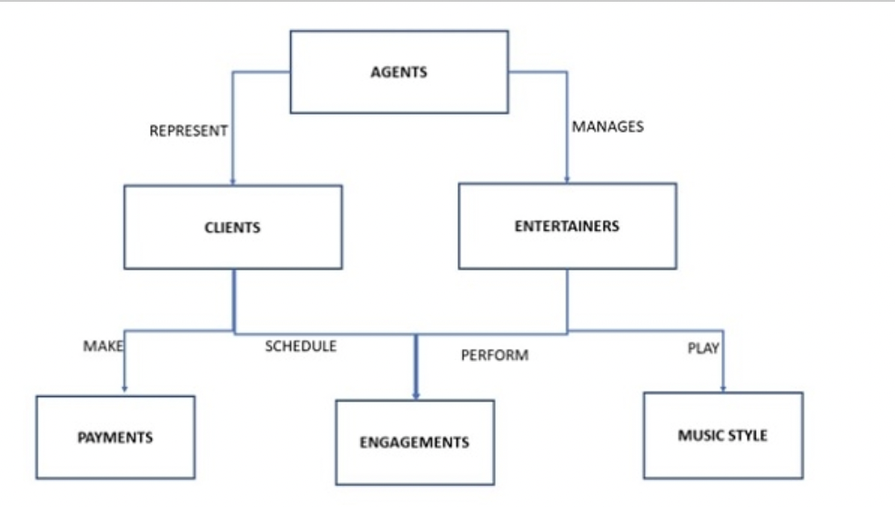

        - Набор записей представлен узлом, а структура набора помогает установить связь в сети, которая помогает. Эта
          разработка помогает связать пару узлов вместе, используя один узел в качестве владельца, а другой узел в
          качестве члена. Связь «один ко многим» управляется структурой набора, что означает, что запись в
          узле-владельце может быть связана с одной или несколькими записями в узле-члене, но одна запись в узле-члене
          связана только с одной записью в узле-члене. узел владельца.

        - Кроме того, запись в узле-члене не может существовать без связи с существующей записью в узле-владельце.
          Например, клиент должен быть назначен агенту, но агент без клиентов может быть указан в базе данных.
        - 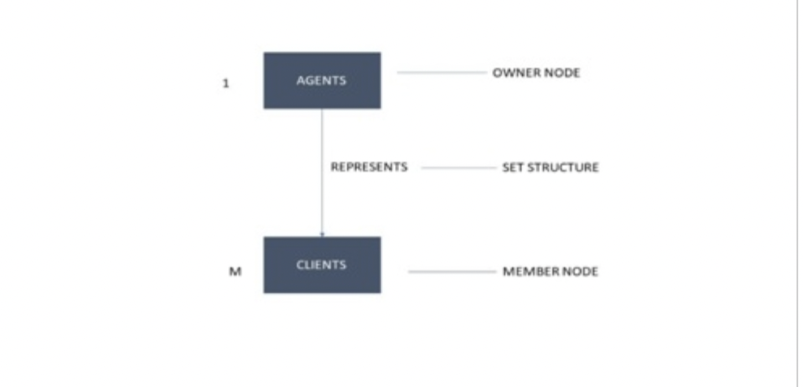

        - На приведенной выше диаграмме показана диаграмма структуры базового набора. Между определенной парой узлов
          может быть определено одно или несколько множеств (соединений), а также один узел может быть вовлечен в другие
          множества с другими узлами в базе данных.

        - К данным можно легко получить доступ внутри сетевой модели с помощью соответствующей структуры набора. нет
          ограничений на выбор корневого узла, доступ к данным возможен через любой узел и прогон назад или вперед с
          помощью связанных наборов.

        - Например, когда пользователь хочет найти агента, забронировавшего конкретное мероприятие. Он/она начинает с
          поиска соответствующей записи задания в узле ЗАЯВЛЕНИЯ, а затем определяет, какой клиент «владеет» этой
          записью задания с помощью структуры набора расписаний. Наконец, он/она идентифицирует агента, который
          «владеет» записью клиента, через структуру набора представлений.

      ##### Преимущества

        - быстрый доступ к данным.
        - Это также позволяет пользователям создавать более сложные запросы, чем те, которые они создали с помощью
          иерархической базы данных. Таким образом, по этой модели можно выполнять различные запросы.
      ##### Недостатки

        - Пользователь должен хорошо знать структуру базы данных, чтобы работать с заданными структурами.
        - Обновление внутри этой базы данных является утомительной задачей. Нельзя изменить заданную структуру, не
          повлияв на прикладные программы, использующие эту структуру для навигации по данным. Если вы изменяете
          структуру набора, вы также должны изменить все ссылки, сделанные в прикладной программе, на эту структуру.
          раджа

      Читать [1](https://habr.com/ru/post/307252/)

      Читать [2](https://selectel.ru/blog/osi-for-beginners/)
    </details>

  ---

  #### 143. Расскажите об уровнях модели OSI.

    - <details><summary>Ответ:</summary>

        - 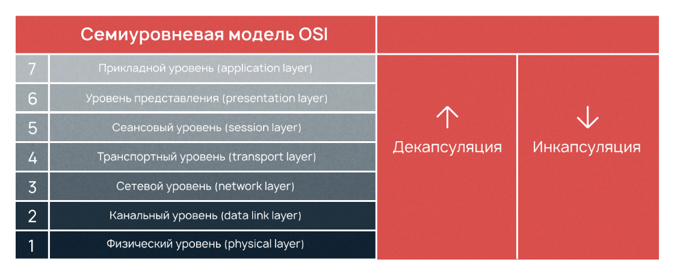

        - [Подробно](https://selectel.ru/blog/osi-for-beginners/)
   </details>

  ---

  #### 144. Расскажите об уровнях модели TCP/IP.

    - <details><summary>Ответ:</summary>

      [Стек протоколов TCP/IP](https://4systems.ru/inf/skolko-urovnej-v-setevoj-modeli-tcp-ip/) — набор сетевых
      протоколов передачи данных, используемых в сетях, включая сеть Интернет. Название TCP/IP происходит из двух
      наиважнейших протоколов семейства — Transmission Control Protocol (TCP) и Internet Protocol (IP), которые были
      разработаны и описаны первыми в данном стандарте. Также изредка упоминается как модель DOD в связи с историческим
      происхождением от сети ARPANET из 1970 годов (под управлением DARPA, Министерства обороны США).

        - 
        - 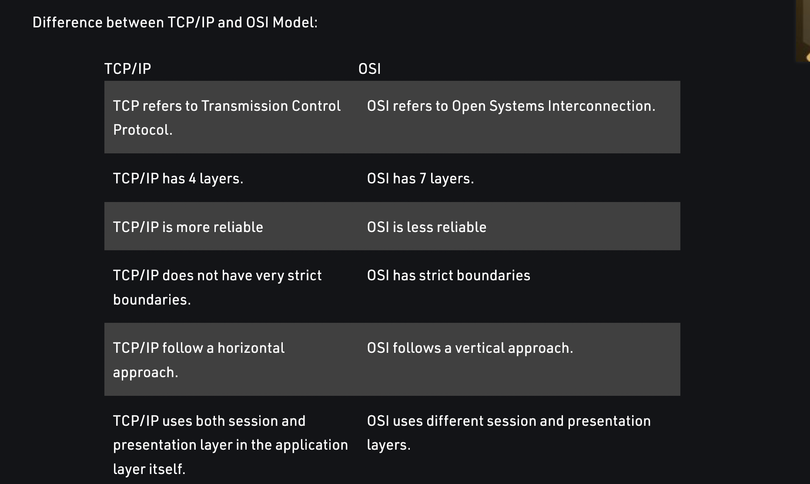
        - 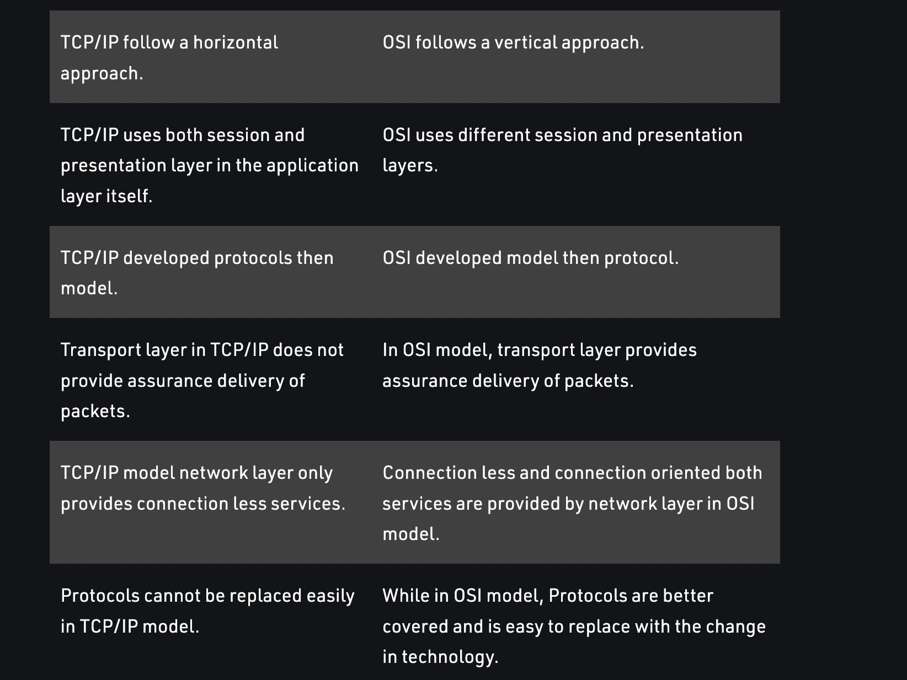

    </details>

  ---

  #### 145. Что такое IP-адрес?

    - <details><summary>Ответ:</summary>

        - [IP-адрес](https://ru.wikipedia.org/wiki/IP-%D0%B0%D0%B4%D1%80%D0%B5%D1%81) (от англ. Internet Protocol) —
          уникальный числовой идентификатор устройства в компьютерной сети, работающей по протоколу IP.

      ##### Еще раз про IP-адреса

        - IP-адрес (v4) состоит из 32-бит. Любой уважающий себя админ, да и вообще айтишник (про сетевых инженеров
          молчу) должен уметь, будучи разбуженным среди ночи или находясь в состоянии сильного алкогольного опьянения,
          правильно отвечать на вопрос «из скольки бит состоит IP-адрес». Желательно вообще-то и про IPv6 тоже: 128 бит.
          ```
          Обстоятельство первое. Всего теоретически IPv4-адресов может быть:
          2 32 = 2 10 *2 10 *2 10 *2 2 = 1024*1024*1024*4 ≈ 1000*1000*1000*4 = 4 млрд.
          Ниже мы увидим, что довольно много из них «съедается» под всякую фигню.
          ```
        - Записывают IPv4-адрес, думаю, все знают, как. Четыре октета (то же, что байта, но если вы хотите блеснуть, то
          говорите
          «октет» — сразу сойдете за своего) в десятичном представлении без начальных нулей, разделенные точками:
          «192.168.11.10».

        - В заголовке IP-пакета есть поля source IP и destination IP: адреса источника (кто посылает) и назначения (
          кому). Как
          на почтовом конверте. Внутри пакетов у IP-адресов нет никаких масок. Разделителей между октетами тоже нет.
          Просто
          32-бита на адрес назначения и еще 32 на адрес источника.

        - Однако, когда IP-адрес присваивается интерфейсу (сетевому адаптеру или как там его еще называют) компьютера
          или
          маршрутизатора, то кроме самого адреса данного устройства ему назначают еще и маску подсети. Еще раз: маска не
          передается в заголовках IP-пакетов.

        - Компьютерам маска подсети нужна для определения границ — ни за что не угадаете чего — подсети. Чтоб каждый мог
          определить, кто находится с ним в одной [под]сети, а кто — за ее пределами. (Вообще-то можно говорить просто
          «сети»,
          часто этот термин используют именно в значении «IP-подсеть».) Дело в том, что внутри одной сети компьютеры
          обмениваются пакетами «напрямую», а когда нужно послать пакет в другую сеть — шлют их шлюзу по умолчанию (
          третий
          настраиваемый в сетевых свойствах параметр, если вы помните). Разберемся, как это происходит.

        - Маска подсети — это тоже 32-бита. Но в отличии от IP-адреса, нули и единицы в ней не могут чередоваться.
          Всегда
          сначала идет сколько-то единиц, потом сколько-то нулей. Не может быть маски

        - Но может быть маска

        - Сначала N единиц, потом 32-N нулей. Несложно догадаться, что такая форма записи является избыточной. Вполне
          достаточно
          числа N, называемого длиной маски. Так и делают: пишут 192.168.11.10/21 вместо 192.168.11.10 255.255.248.0.
          Обе формы
          несут один и тот же смысл, но первая заметно удобнее.

        - Чтобы определить границы подсети, компьютер делает побитовое умножение (логическое И) между IP-адресом и
          маской,
          получая на выходе адрес с обнуленными битами в позициях нулей маски. Рассмотрим пример 192.168.11.10/21:

        ```
        11000000.10101000.00001011.00001010
        11111111.11111111.11111000.00000000
        ———————————————
        11000000.10101000.00001000.00000000 = 192.168.8.0
        ```

    </details>

  ---

  #### 146. Для чего используется маска подсети?

    - <details><summary>Ответ:</summary>

        - Маска подсети (network mask, subnet mask) — это битовая маска (bitmask), которая используется для определения
          к какой подсети принадлежит определенный ИП адрес. Она не отправляется в заголовках IP-пакетов, т.е. не
          является ее частью, поэтому по айпи узнать ее просто никак нельзя.

        - Как и IP-адрес в IPv4 имеет размер в 32-бита. В двоичном формате, ноли и единицы не должны в ней чередоваться,
          так вначале всегда идут единички, а уже потом ноли.

        - Чаще всего пишется префиксом, например, 192.168.11.4/19. Посчитать префикс довольно легко, например, у
          255.255.224.000, префикс будет — 19. Посчитайте просто все первые единички в двоичном формате.

      ##### Для чего нужна маска сети
        - Она позволяет определить, кто находится с вами в одной (под)сети, а кто не в ней. Компьютеры, находящиеся
          внутри одной сети, обмениваются данными между собой напрямую, например, в локальной. Но если нужно выйти в
          глобальную паутину, то запрос идет уже через роутер — шлюз по умолчанию.
        - 
    </details>

  ---

  #### 147. Какая разница между IPv4 и IPv6?

    - <details><summary>Ответ:</summary>

        - IPv4 и IPv6 — это интернет-протокол версии 4 и интернет-протокола версии 6, IP-версия 6 — это новая версия
          интернет-протокола, которая намного лучше, чем IP-версия 4, с точки зрения сложности и эффективности.

      ##### Разница между IPv4 и IPv6:
        - 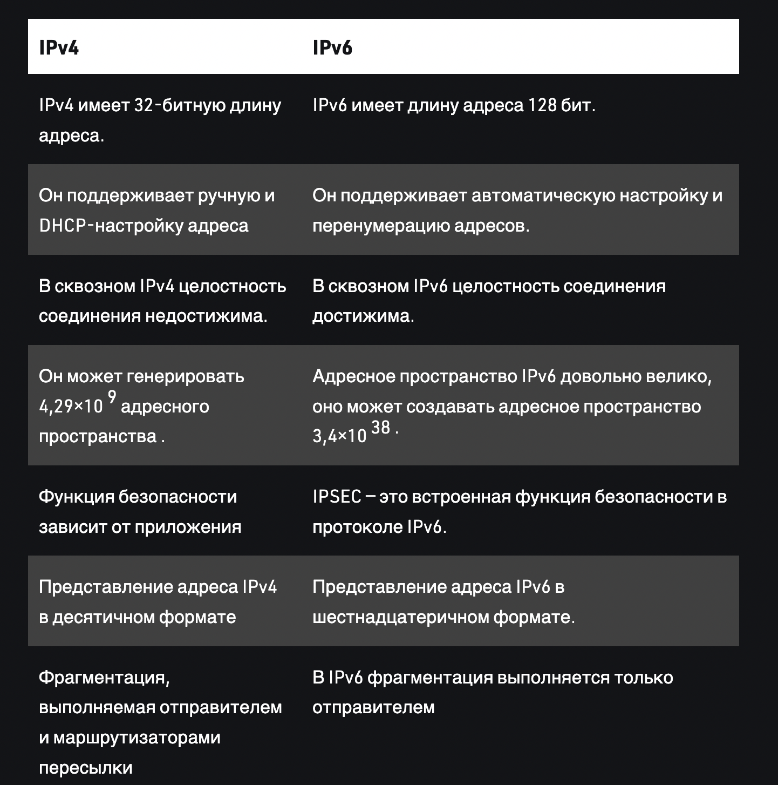
        - 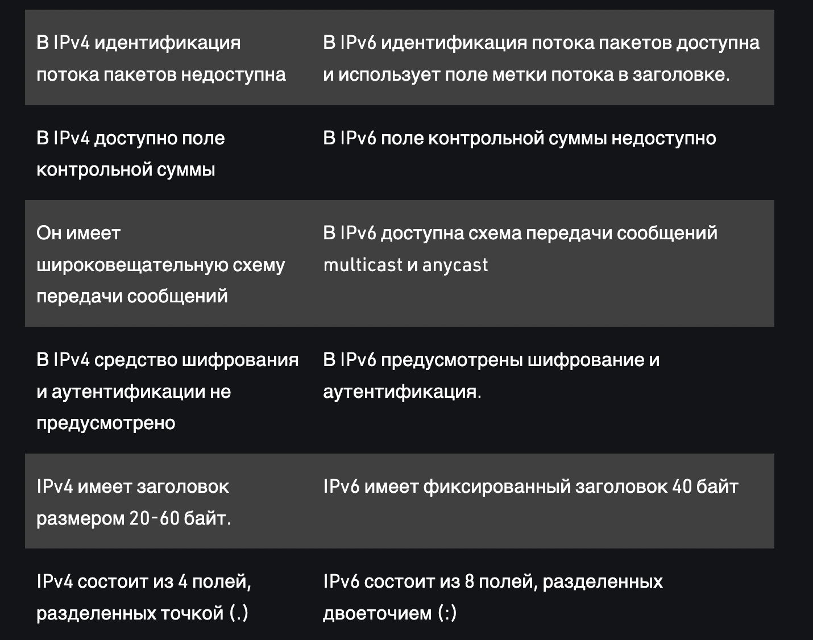
        - 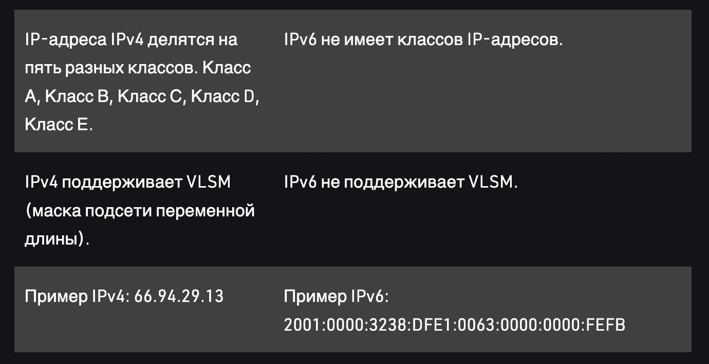

    </details>

  ---

  #### 148. Сколько памяти необходимо для хранения IPv4?

    - <details><summary>Ответ:</summary>

        - Адрес IPv4 имеет длину 32 бита. IP-адрес отображается в виде 4 десятичных чисел, представляющих 4 байта: dddd,
          где d = десятичное число (0–255). Старшие биты — это идентификатор сети, а младшие биты — это идентификатор
          [хоста](https://docslib.org/doc/9191257/how-many-bits-in-length-is-an-ipv4-address).
    </details>

  ---

  #### 149. Для чего нужен порт?

    - <details><summary>Ответ:</summary>
      - Сетевой порт – это сетевой ресурс, отображаемый в виде числа, которое определяет назначение входящих или исходящих сетевых потоков данных на заданном устройстве. Порт принято записывать как 16 битное число от 1 до 65535, которое используется приложениями для обмена данными.
   </details>

  ---

  #### 150. Сколько максимально может быть портов?

    - <details><summary>Ответ:</summary>

        - 1-65535 доступны, и порты в диапазоне 1-1023 являются привилегированными : приложение должно быть запущено от
          имени пользователя root для прослушивания этих портов.

        - Хотя 1-65535 являются законными портами TCP, и верно, что 1-1023 предназначены для хорошо известных служб
          портов. Вы можете столкнуться со случайными проблемами с вашими собственными сервисами, если они запускаются
          после того, как эфемерный порт установлен. Для тех, кто может не знать, эфемерные порты — это те, которые
          подключены локально для удаленных конечных точек (или что-то в этом роде). Так что, если вы напишите
          TCP-сервис, который прослушивает порт 20001. Возможно, вам будет хорошо сегодня . и завтра. Но однажды ваш
          сервис может запуститься и попытаться привязаться к 20001, и он потерпит неудачу, потому что он был принят как
          эфемерный порт. Есть решение. Вы должны иметь своего администратора или себя, чтобы изменить системную
          политику диапазона портов на вашем сервере. В системах Linux это делается в два этапа:
    </details>

  ---

  #### 151. Какая разница между TCP и UDP?

    - <details><summary>Ответ:</summary>

        - Короткий пример, чтобы четко понять различия:
          предположим, что есть два дома, H1 и H2, и письмо должно быть отправлено из H1 в H2. Но между этими двумя
          домами есть река. Теперь, как мы можем отправить письмо?
          Решение 1: Сделать мост через реку и тогда его можно будет доставить.
          Решение 2. Доставьте его через голубя.

        - Рассмотрим первое решение как TCP. Для доставки данных (письма) необходимо установить соединение (мост).
          Данные надежны, потому что они напрямую достигают другого конца без потери данных или ошибок.
          И второе решение — это UDP. Для отправки данных подключение не требуется.
          Процесс быстрый по сравнению с TCP, где нам нужно установить соединение (мост). Но данные ненадежны: мы не
          знаем, пойдет ли голубь в правильном направлении, уронит ли письмо по пути, или возникнет какая-то проблема в
          середине пути.
        - 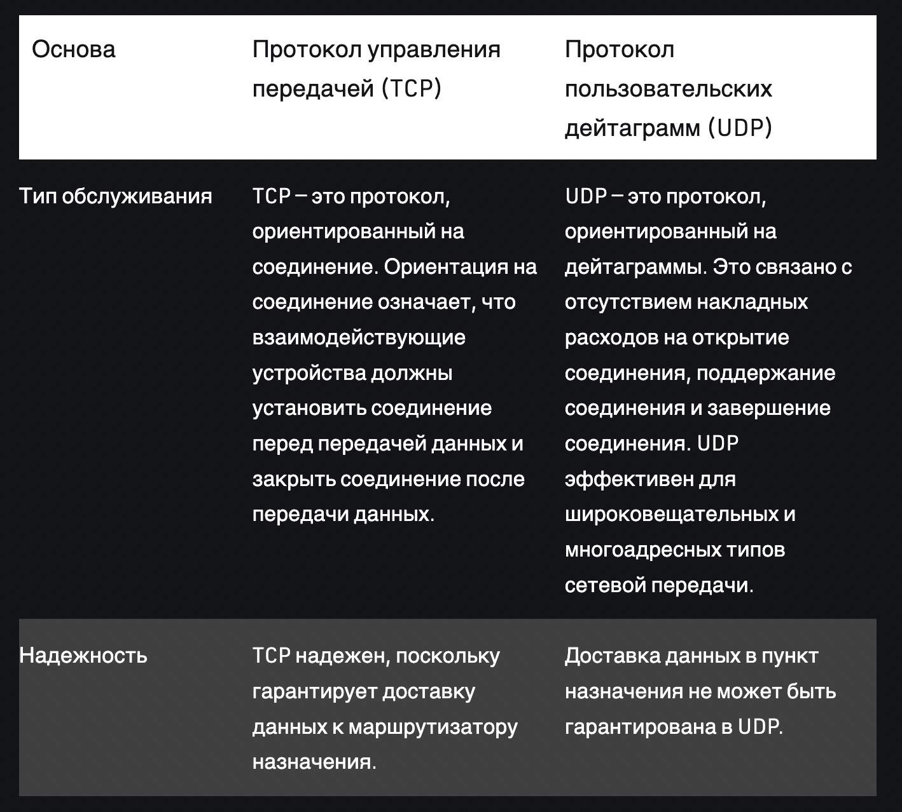
        - 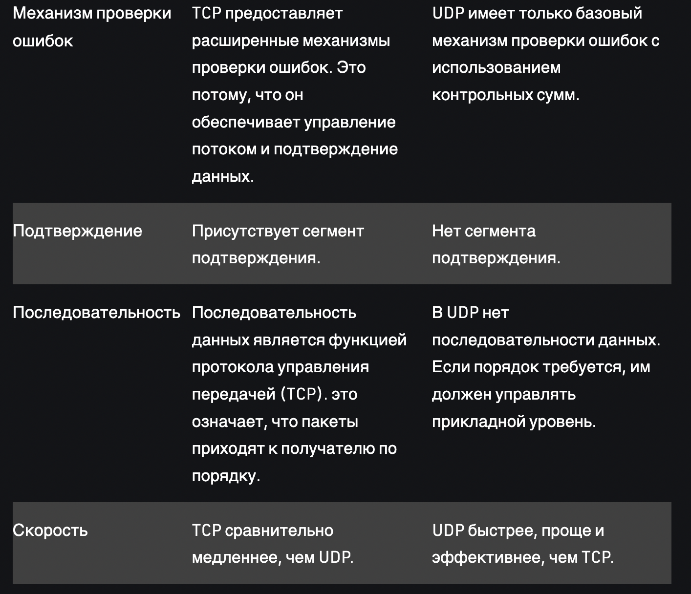
        - 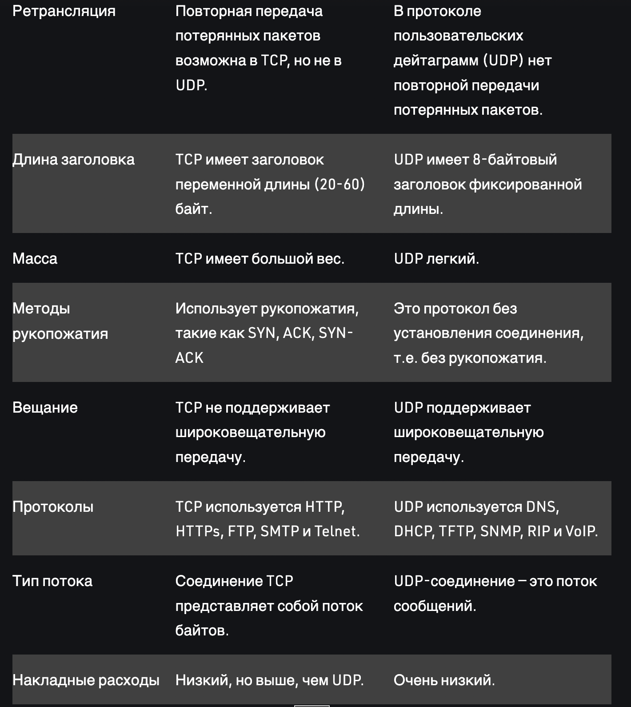

    </details>

  --- 

  #### 152. Для чего такой ненадежный UDP-протокол?

    - <details><summary>Ответ:</summary>

        - UDP не может гарантировать получение каждой дейтаграммы.
        - При UDP-флудах злоумышленники отправляют дейтаграммы на открытые не-UDP порты, чтобы сгенерировать столько
          ответов ICMP, что целевая система выйдет из строя.
          [Дополнительно](https://www.twingate.com/blog/tcp-vs-udp/)
    </details>

  ---

---

- ### OS/Linux

  #### 153. Что такое менеджер пакетов?

    - <details><summary>Ответ:</summary>

        - Система управления пакетами (также иногда «менеджер пакетов» или «пакетный менеджер») — набор программного
          обеспечения, позволяющего управлять процессом установки, удаления, настройки и обновления различных
          компонентов программного обеспечения. Системы управления пакетами активно используются в различных
          дистрибутивах операционной системы Linux и других UNIX-подобных операционных системах.

      What is a package manager in [Linux](https://itsfoss.com/package-manager/)

    </details>

  ---

  #### 154. Какие бывают менеджеры пакетов?

    - <details><summary>Ответ:</summary>

        - Список систем управления программными пакетами
          Из Википедии,
          бесплатной [энциклопедии](https://en.wikipedia.org/wiki/List_of_software_package_management_systems)
    </details>

  ---

  #### 155. Какие бывают дистрибутивы Linux?

    - <details><summary>Ответ:</summary>

        - List of Linux [distros]()
    </details>

  ---

  #### 156. Что такое PID?

    - <details><summary>Ответ:</summary>

        - Сокращение от идентификатора процесса. PID — это уникальный номер, который идентифицирует каждый запущенный
          процесс в операционной системе, такой как Linux, Unix, macOS и Microsoft Windows. Вывод ниже показывает
          несколько процессов, запущенных в Windows, и связанные с ними PID, перечисленные в столбце PID.
        - 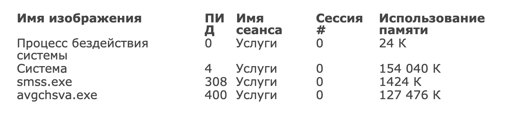

      [Дополнительно ](https://www.computerhope.com/jargon/p/pid.htm)
    </details>

  ---

  #### 157. Для чего используют файловые дескрипторы?

    - <details><summary>Ответ:</summary>

        - Проще говоря, когда вы открываете файл, операционная система создает запись для представления этого файла и
          хранения информации об этом открытом файле. Таким образом, если в вашей ОС открыто 100 файлов, то в ОС будет
          100 записей (где-то в ядре). Эти записи представлены целыми числами, такими как (...100, 101, 102....). Этот
          номер записи является дескриптором файла. Таким образом, это просто целое число, которое однозначно
          представляет открытый файл для процесса. Если ваш процесс открывает 10 файлов, в таблице процессов будет 10
          записей для дескрипторов файлов.

          Точно так же, когда вы открываете сетевой сокет, он также представляется целым числом и называется
          дескриптором сокета. Я надеюсь, вы понимаете.
     </details>

  ---

  #### 158. Расскажите о стандартных файловых дескрипторах процесса.

    - <details><summary>Ответ:</summary>

      `Ответ требует доработки`
        - Дескриптор файла — это непрозрачный дескриптор, который используется в интерфейсе между пользователем и
          пространством ядра для идентификации ресурсов файла/сокета. Поэтому, когда вы используете `open()`
          или `socket()`(
          системные вызовы для взаимодействия с ядром), вам предоставляется дескриптор файла, который является целым
          числом (на самом деле это индекс в структуре процессов, но это не важно). Поэтому, если вы хотите напрямую
          взаимодействовать с ядром, используя системные вызовы `read()`, `write()` и `close()` т. д., вы используете
          дескриптор
          файла.

        - На системные вызовы накладывается слой абстракции, который представляет собой `stdio` интерфейс. Это
          обеспечивает
          больше функциональных возможностей/возможностей, чем базовые системные вызовы. Для этого интерфейса
          непрозрачный дескриптор, который вы получаете, представляет собой FILE*, который возвращается `fopen()`
          вызовом.
          Существует множество функций, использующих `stdio` интерфейс `fprintf()`, `fscanf()`, `fclose()`, которые
          облегчают
          вашу жизнь. В `C`, `stdin`, `stdout` и , `stderr` которые `FILE*` в `UNIX` соответственно сопоставляются с
          файловыми
          дескрипторами `0`, `1` и `2`.
    </details>

  ---

  #### 159. Что такое Pipe?

    - <details><summary>Ответ:</summary>

        1. Говоря о компьютерной памяти, PIPE — это временный раздел компьютерной памяти, способный связать два или
           более компьютерных процессора для повышения общей эффективности компьютера.
        2. PIPE может относиться к кабелю, используемому для передачи больших объемов данных для одного или нескольких
           человек в Интернете. Термин «pipe» используется в названиях компаний, таких как `FatPipe`, которые
           предоставляют доступ в Интернет, и в сленге, таком как `Huge pipe`, для описания кого-то с большой
           пропускной способностью. Дополнительную информацию см. на наших основных и основных страницах.
    </details>

  ---

  #### 160. Что такое Named Pipe?

    - <details><summary>Ответ:</summary>

      В вычислениях [Named pipe]() ( также известный как FIFO из- за его поведения) является расширением традиционной
      концепции канала в Unix и Unix-подобных системах и является одним из методов межпроцессного взаимодействия (IPC).
      Эта концепция также встречается в OS/2 и Microsoft Windows , хотя семантика существенно различается. Традиционная
      трубка « безымянная »." и существует только до тех пор, пока существует процесс. Однако именованный канал может
      существовать до тех пор, пока система работает, за пределами жизни процесса. Его можно удалить, если он больше не
      используется. Обычно именованный канал отображается в виде файла , а вообще процессы к нему прицепляются для IPC.
    </details>

  --- 

  #### 161. Что такое UID?

    - <details><summary>Ответ:</summary>

        - Уникальный идентификатор [(UID)](https://en.wikipedia.org/wiki/UID) — это числовая или буквенно-цифровая
          строка, связанная с одним объектом в данной системе. UID позволяют обращаться к этому объекту, чтобы к нему
          можно было получить доступ и взаимодействовать с ним.
    </details>

  ---

  #### 162. Расскажите о командах bash.

    - <details><summary>Ответ:</summary>

        - ls — Список содержимого каталога
        - echo — Выводит текст в окно терминала
        - touch — создает файл
        - mkdir — создать каталог
        - grep — поиск
        - man — распечатать руководство или получить справку по команде
        - pwd — Распечатать рабочий каталог
        - cd — Изменить каталог
        - mv — Переместить или переименовать каталог
        - rmdir — Удалить каталог
        - locate — найти определенный файл или каталог
        - less — просмотреть содержимое текстового файла
        - compgen — показывает все доступные команды, псевдонимы и функции
        - `>` — перенаправить стандартный вывод
        - cat — прочитать файл, создать файл и объединить файлы
        - | — Pipe
        - head — прочитать начало файла
        - tail — прочитать конец файла
        - chmod — устанавливает флаг прав доступа к файлу или папке.
        - exit — выйти из каталога

     </details>

  --- 

---

- ### SCM / CI / CD

  #### 163. Какие есть виды SCM?

    - <details><summary>Ответ:</summary>

        1. Отслеживание и управление изменениями в процессе разработки программного обеспечения.
        2. Это обеспечивает повышение производительности программного приложения с минимальной ошибкой.
        3. Он обеспечивает плавный рабочий процесс внутри процесса разработки.
        4. Легко общаться с членами команды для улучшения качества продукта.
        5. Чтобы отслеживать каждого члена команды с состоянием рабочего процесса проекта.
        6. Он обновляет код каждого члена команды параллельно, учитывая различные системы управления версиями.
        7. Для управления различными инструментами и процессами разработки в программном продукте.
        8. Он используется для управления программным и аппаратным обеспечением внутри приложения.
        9. Он используется для контроля и управления дефектами, командной работы и процесса.
        10. Он обрабатывает бюджетирование программного обеспечения в соответствии с изменениями в приложении.
     </details>

  ---

  #### 164. Для чего используют системы контроля версий?

    - <details><summary>Ответ:</summary>

        - пустим, программист в одиночку работает над плагином для Wordpress. Заказчик добавил в техническое задание
          обязательное условие — использование Git или аналогов. У него большие планы по разработке продукта, поэтому он
          хочет, чтобы данные находились в свободном доступе.

        - Программист создаёт репозиторий и начинает работать над плагином. В основной ветке у него хранится первая
          рабочая версия продукта. После каждого изменения разработчик добавляет новый коммит, а для внедрения
          масштабных изменений создаёт параллельные ветки.
        - 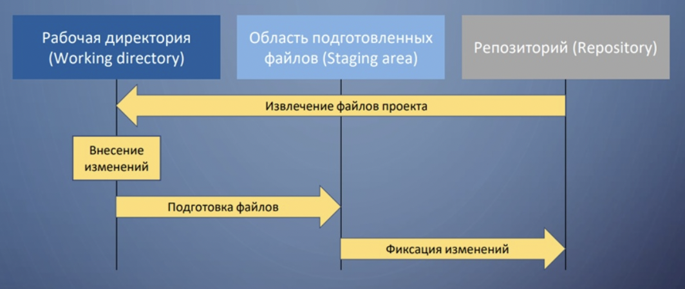

        - Дело близится к релизу, но заказчик внезапно обнаруживает серьёзный баг, который нужно срочно исправить.
          Разработчик возвращается к контрольной точке (коммиту), в которой он допустил ошибку, исправляет её и
          обновляет основную ветку.

        - Теперь представьте, что разработка плагина велась на компьютере программиста. Он не использовал систему
          контроля версий и не хранил промежуточные копии плагина. Ему придётся либо переписывать проект почти с нуля,
          либо сильно постараться, чтобы исправить баг без изменения основной логики.

        - Если над сайтом, плагином или сервисом работает команда разработчиков, без системы контроля версий не
          обойтись. Каждый из них отделится от master-ветки и будет работать над своими задачами. После завершения
          работы, коллеги проведут кодревью и проект можно собрать воедино.

        - Git не только позволяет сохранять контрольные точки проекта, но и помогает устранять конфликты. Часто бывает
          так, что программисты одновременно работают над одной функцией и заливают изменения в репозиторий. В этом
          случае система обнаруживает конфликт и пытается исправить его автоматически.

        - Если Git не решит проблему самостоятельно, программисты увидят её и смогут устранить вручную. Окончательное
          решение всегда остаётся за разработчиком. Он контролирует процесс и решает, как будет происходить дальнейшая
          работа.

      Какие задачи решает система контроля версий:
        1. Защищает исходный код от потери. Данные хранятся на удалённом сервере, даже если разработчики удалят файлы с
           локального компьютера, они останутся в репозитории.
        2. Обеспечивает командную работу. Программисту не надо использовать инструменты для командной работы и платить
           за них. Каждый может работать на своём компьютере и обновлять файлы по мере необходимости.
        3. Помогает отменить изменения. В любой момент можно вернуться к контрольной точке, сравнить исходный код с
           текущим и обновить главную ветку после ревью.
        4. Распределённая работа. Необязательно работать с проектом «наживую». Плагин может функционировать на сайте, а
           программисты будут спокойно создавать новую версию.

        - 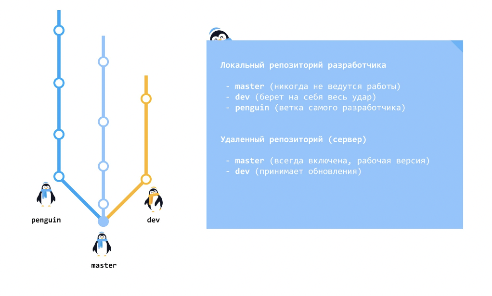
        - Git или другая система контроля версий также важна в работе программиста, как и сохранение бэкапов. В любой
          момент могут понадобиться исходники. И если их не будет, появятся дополнительные проблемы.

    </details>

  ---

  #### 165. Какие есть команды git?

    - <details><summary>Ответ:</summary>

      ##### Команды ветки Git
        - `git branch` – Отображение списка локальных ветвей в вашем репозитории Git.
        - `git branch -a` – Отображение списка как локальных, так и удаленных ветвей в вашем репозитории Git.
        - `git branch -c` – Скопируйте ветку Git.
        - `git branch -d <branch-name>` — Удалить локальную ветку Git . Эта команда не будет работать, если в ветке,
          которую вы пытаетесь удалить, есть неслитые изменения.
        - `git branch -D <branch-name>` – Удалить локальную ветку Git с неслитыми изменениями.
        - `git branch -m <branch-name> <new-branch-name>` – Переименовать ветку Git .
        - `git branch -r` – Показать список удаленных ветвей в вашем репозитории Git.
        - `git push <remote> --delete <remote-branch-name>` — Удалить удаленную ветку Git .
          `git push --set-upstream <remote> <branch>` – Установить восходящую ветвь . Выполнение этой команды переместит
          вашу локальную ветку в новую удаленную ветку.

      ##### Команды Git Checkout
        - `git checkout <branch-name>` — Переключиться на другую ветку Git .
        - `git checkout -b <branch-name>` – Создайте новую ветку и переключитесь на нее.
        - `git checkout -b <branch-name><remote-name>/<branch-name>` – Создайте локальную ветку из удаленной ветки Git и
          извлеките эту ветку.
        - `git checkout <commit hash>` – Проверить предыдущую фиксацию Git .
        - `git checkout <tag name>` – Извлечь тег Git в отсоединенном состоянии HEAD.
        - `git checkout -b <branch-name><tag-name>` – Извлечь тег Git как ветку.

      ##### Команды Git Cherry Pick
        - `git cherry-pick [insert commit reference]` – Применить изменения коммита к другой ветке.

      ##### Git-команды клонирования
        - `git clone <repository-url>` – Клонировать указанный удаленный репозиторий. Ознакомьтесь с рекомендациями
          Git-SCM по удаленному формату URL .
        - `git clone <repository-url> <directory-name>` – Клонируйте репозиторий и назовите локальный каталог.
        - ```git clone <repository-url> --origin <name>``` – Клонируйте репозиторий и назовите удаленный ( <name>). Если
          вы не хотите называть удаленное устройство, Git предоставит имя по умолчанию origin.
        - `git clone <repository-url> --branch <branch-name>` – Клонировать репозиторий и проверить конкретную ветку.
        - `git clone <repository-url> --depth <depth>` – Клонировать репозиторий с заданным количеством
          коммитов ( <depth>).
        - `git clone <repository-url> --no-tags` – Клонировать репозиторий без копирования тегов репо.
      ##### Команды фиксации Git
        - `git status` – Отображение списка файлов в промежуточном каталоге с указанием статуса файла.
        - `git add` - Сценические изменения файла. Выполнение этой команды со связанным именем файла перенесет изменения
          файла в ваш промежуточный каталог.
        - `git commit` – Сохраните изменения в своем репозитории Git. Выполнение этой команды со связанным именем файла
          сохранит изменения файла в вашем репозитории.
        - `git commit -a` — Добавьте все измененные и удаленные файлы в вашем рабочем каталоге в текущий коммит.
        - `git commit --amend` - Изменить коммит Git . Отредактируйте сообщение фиксации Git, добавив сообщение в
          кавычках после команды.
        - `git commit -m` – Добавьте сообщение фиксации Git. Добавьте ваше сообщение в кавычках после команды.
      ##### Команды слияния Git
        - `git merge` – Объединение двух или более историй развития вместе. При использовании в сочетании с выборкой это
          объединит извлеченную историю из удаленной ветки в текущую извлеченную локальную ветку.
        - `git merge <branch-name>` - Объедините изменения из одной ветки в ветку, которую вы в настоящее время
          извлекли.
        - `git merge --abort` – Прерывает процесс слияния и восстанавливает состояние проекта до попытки слияния. Это
          работает как отказоустойчивость при возникновении конфликта.
        - `git merge --continue` – Попытка завершить слияние, которое было остановлено из-за конфликтов файлов после
          разрешения конфликта слияния .
        - `git merge --squash` – Объедините все изменения из объединяемой ветки в один коммит, а не сохраняйте их как
          отдельные коммиты.
        - `git merge --no-commit` – Объединить ветку в текущую ветку, но не делать новый коммит.
        - `git merge --no-ff` – Создает фиксацию слияния вместо попытки быстрой перемотки вперед.
      ##### Команды Git Pull
        - `git pull`— Это выполнит, git fetchза которым следует git merge FETCH_HEAD, и позволит вам получить и
          интегрироваться с другим репозиторием или локальной веткой.
        - `git pull --quiet` – Подавить вывод текста после обоих git fetchи git merge.
        - `git pull --verbose` – Расширить выводимый текст после обоих git fetchи git merge.
      ##### Команды Git Pull, относящиеся к слиянию
        - `git pull --squash` – Объедините все изменения из объединяемой ветки в один коммит, а не сохраняйте отдельные
          коммиты.
        - `git pull --no-commit` – Объедините текущую извлеченную ветвь с удаленной вышестоящей ветвью.
        - `git pull --no-ff` – Создавайте фиксацию слияния во всех случаях, даже если вместо этого слияние может быть
          разрешено как ускоренная перемотка вперед.
      ##### Команды Git Pull, связанные с выборкой
        - `git pull --all` - Принеси все пульты.
        - `git pull --depth=<depth>` – Получить ограниченное количество коммитов.
        - `git pull --dry-run` – Покажите действие, которое будет выполнено без фактического внесения изменений в
          репозиторий.
        - `git pull --prune` – Удалите все удаленные ссылки, которые больше не существуют на удаленном компьютере.
        - `git pull --no-tags` – Не получать теги.
      ##### Git push-команды
        - `git push`  – Отправьте текущую извлеченную ветку на удаленный сервер по умолчанию origin.
        - `git push <remote><branch>` – Отправьте указанную ветку вместе со всеми необходимыми фиксациями в удаленный
          репозиторий назначения.
        - `git push <remote> --force` – Принудительное нажатие Git при слиянии без быстрой перемотки вперед. Этот
          параметр принудительно обновляет удаленную ссылку, даже если она не является предком локальной ссылки. Это
          может привести к потере коммитов в удаленном репозитории, поэтому используйте его с осторожностью.
        - `git push <remote> --all` – Направить все локальные ветки на указанный удаленный сервер.
        - `git push <remote> --tags` – Передать все локальные теги на указанный удаленный сервер. Теги не отправляются
          автоматически при использовании --all.
      ##### Команды Git Rebase
        - `git rebase <target branch name>` – Перебазируйте текущую проверенную ветку на целевую ветку. Это переписывает
          коммиты из исходной ветки и применяет их поверх целевой ветки.
        - `git rebase --continue` – Выполните перебазирование Git после разрешения конфликта между файлами.
        - `git rebase --skip` – Пропустить действие, которое приводит к конфликту, чтобы продолжить перебазирование Git.
        - `git rebase --abort` – Отменить перебазирование Git. Ваша ветка вернется в то состояние, в котором она была до
          начала перебазирования.
        - `git rebase <target branch name> -i` – Инициировать интерактивную перебазировку из вашей текущей извлеченной
          ветки в целевую ветку.
      ##### Команды Git Stash
        - `git stash` – Создайте тайник с локальными изменениями и вернитесь к основному коммиту.
        - `git stash list` – Показать список всех тайников в вашем репозитории.
        - `git stash show` - Просмотр содержимого вашего последнего тайника. Это покажет ваши спрятанные изменения как
          разницу между спрятанным содержимым и фиксацией, когда тайник был создан.
        - `git stash drop <stash>` – Удалить тайник из списка тайников в вашем репозитории.
        - `git stash pop <stash>` - Применить тайник к вершине текущего рабочего дерева и удалить его из списка
          тайников.
        - `git stash apply <stash>` - Применить тайник поверх текущего рабочего дерева. Тайник не будет удален из вашего
          списка тайников.
        - `git stash clear` - Удалите все тайники из вашего репозитория.
    </details>

  ---

  #### 166. Какие этапы во время комита изменений?

    - <details><summary>Ответ:</summary>

      `Ответ треубует дорабтоки!`
    </details>

  ---

  #### 167. Разница между git fetch и git pull?

    - <details><summary>Ответ:</summary>

        - `git fetch` на самом деле только загружает новые данные из удаленного репозитория, но не интегрирует эти новые
          данные в ваши рабочие файлы. Fetch отлично подходит для получения свежего взгляда на все, что произошло в
          удаленном репозитории.
          Из-за его «безвредности» вы можете быть уверены: `fetch` никогда ничего не манипулирует, не уничтожает и не
          испортит. Это означает, что вы никогда не сможете получить достаточно часто.

        - `git pull`, напротив, используется с другой целью: обновить текущую ветку `HEAD` последними изменениями с
          удаленного сервера. Это означает, что `pull` не только загружает новые данные; он также напрямую интегрирует
          его
          в ваши текущие файлы рабочих копий. Это имеет несколько последствий:

        1. Поскольку «git pull» пытается объединить удаленные изменения с вашими локальными, может возникнуть так
           называемый «конфликт слияния». Ознакомьтесь с нашим подробным руководством по устранению конфликтов слияния
           для получения дополнительной информации.
        2. Как и для многих других действий, настоятельно рекомендуется запускать «git pull» только с чистой рабочей
           копией. Это означает, что у вас не должно быть незафиксированных локальных изменений до того, как вы их
           извлечете. Используйте функцию `Git Stash` для временного сохранения локальных изменений .

    </details>

  ---

  #### 168. Какие есть этапы решения merge conflict?

    - <details><summary>Ответ:</summary>

      ##### Есть три способа разрешить конфликт слияния в Git:
        1. Примите локальную версию. Чтобы принять все изменения в файле из локальной версии, запустите:
            - `git checkout --ours <file name>`
              В качестве альтернативы, чтобы принять локальную версию для всех конфликтующих файлов, используйте:
            - `git merge --strategy-option ours`
        2. Примите удаленную версию. Чтобы обновить изменения в файле из удаленной ветки, запустите:
            - `git checkout --theirs <file name`
              Принять удаленную версию для всех конфликтующих файлов с помощью:
            - `git merge --strategy-option theirs`
        3. Просмотрите изменения по отдельности . Последним вариантом является рассмотрение каждого изменения отдельно.
           Этот вариант также является лучшим путем, особенно при работе с несколькими файлами и людьми. Чтобы сделать
           эту работу более управляемой, используйте специальные инструменты для просмотра отдельных конфликтов.
           В конечном счете, выбор того, какие части кода остаются, а какие нет, зависит от решения разработчика для
           текущего проекта.
           ##### Получение конфликта слияния в Git
            - Конфликт слияния в Git возникает, когда команда git mergeвыдает ошибку.
            - 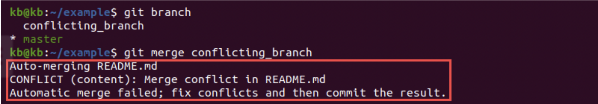
            - Сообщение об ошибке печатает информацию о том, где присутствует конфликт. Проверьт
            - 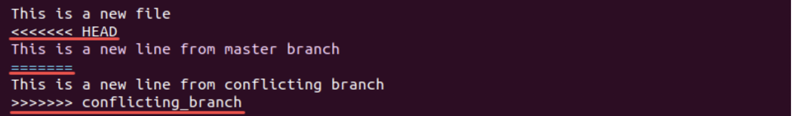
            - Git автоматически добавляет три индикатора рядом с конфликтующими строками кода:
                - `<<<<<<<` (семь символов "меньше"), за которыми следует HEAD , который является псевдонимом текущей
                  ветки. Символы указывают на начало редактирования в этом разделе.
                - `=======` (семь символов «равно»), которые показывают конец ревизий в текущей ветке и начало правок в
                  новой.
                - `>>>>>>>` (семь символов "больше"), за которыми следует ветвь, в которой произошла попытка слияния.
                  Добавленные символы указывают на окончание правок в конфликтующей ветке.
            - Добавленный синтаксис помогает искать в коде место конфликта слияния. Однако гораздо более простым
              подходом является использование инструмента различия/слияния для обнаружения проблем и отслеживания
              изменений.
    </details>

  ---

---

- ### <span style="color:red">Практическая задача<span/>

  #### 169. Посчитайте количество единиц в произвольном числе.

    - <details><summary>Ответ:</summary>

      ```c++
      //counting from double
      int count_one(double d) {
          auto ans_str = std::to_string(d);
          return std::count_if(ans_str.begin(), ans_str.end(), [](auto ch) {return ch- '0' == 1;});
      }
      // counting from integer
       for (const std::uint8_t i : { 0, 0b11111111, 0b01111111, 0b11100011 }) {
        std::cout << "countl_one( " << std::bitset<8>(i) << " ) = "
                  << std::countl_one(i) << '\n';
      }
      ```
      [source code](Codes/code_169_1.cpp)
    </details>

  ---

  #### 170. Есть структура по типу «односвязный список». Напишите функцию, которая разворачивает список. То есть, первый элемент становится последним, а последний - первым.

    - <details><summary>Ответ:</summary>

        - 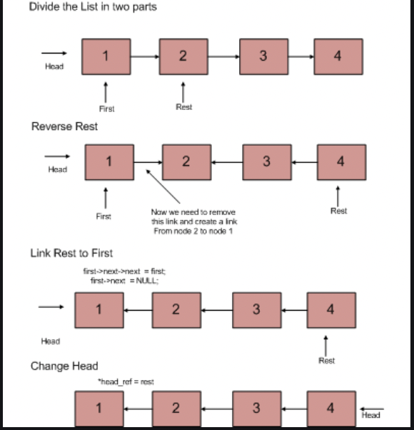

        - Source [code](Codes/code_170_1.cpp)

    </details>

  ---

  #### 171. Напишите реализацию функции int atoi (const char *str); преобразования строки в число.

    - <details><summary>Ответ:</summary>

      ```c++
      int my_atoi(std::string str) {
          int ans = 0;
          for(int i = 0; i <str.size(); i++) 
              ans = ans * 10 + str[i] - '0';
          return ans;
      }
      ```
     </details>

  ---

  #### 172. Для структуры типа односвязный список напишите функцию вставки элемента.

    - <details><summary>Ответ:</summary>

        - Перво создать конструктора
      ```c++
      struct Node {
          int data;
          struct Node* next;
          Node(int data)
          {
              this->data = data;
              next = NULL;
          }
      };
      ```
        - func add
      ```c++
       void push(int data)
      {
          Node* temp = new Node(data);
          temp->next = head;
          head = temp;
      }
      ```
        - source [code](Codes/junior/code_172_1.cpp)
    </details>

  ---

  #### 173. Реализуйте класс vector.

    - <details><summary>Ответ:</summary>
      source [code](https://github.com/Jollu8/Algorithms/blob/main/Containers/Vector.cpp)
     </details>

  ---

  #### 174. Реализуйте бинарный поиск в массиве.

    - <details><summary>Ответ:</summary>

        - recursive binary search

      ```c++
      int binary_search_in_c_array_recursive(int arr[], int l, int r, int length) {
          if (r >= 1) {
              int mid = l + (r - 1) / 2;
              if (arr[mid] == length) return mid;

              if (arr[mid] > length)return binary_search_in_c_array_recursive(arr, l, mid - 1, length);

              return binary_search_in_c_array_recursive(arr, mid + 1, r, length);
          }
          return -1;
      }
      ```

        - none recursive binary search
      ```c++
      int binary_search_in_c_array(int arr[], int l, int r, int length) {
          while (l < -r) {
              int m = l + (r - l) / 2;
              if (arr[m] == length)return m;
              if (arr[m] < length) return m;
              else r = m - 1;
          }
          return -1;
      }
      ```
      source [code](Codes/junior/code_174_1.cpp)
    </details>

  ---

  #### 175. Реализуйте любую сортировку.

    - <details><summary>Ответ:</summary>

        - [All my sorts](https://github.com/Jollu8/Algorithms/tree/main/Sort)
    </details>

  ---

  #### 176. Реализуйте макрос для сравнения двух строк.

    - <details><summary>Ответ:</summary>

      ```c++
      #define min(a,b) (((a) > (b)) ? (a) : (b))
      ```
        - main output

      ```c++
      #include <iostream>
      int main() {
          std::string str1 = "Hello";
          std::string str2 = "Hello1";
          std::cout << min(str1, str2);
      }
      ```
        - source [code](./Codes/junior/code_176_1.cpp)

    </details>

  ---

  #### 177. Реализуйте реверс строк.

    - <details><summary>Ответ:</summary>

        - stl reverse algorithm
      ```c++
      #include <iterator>
      #include <vector>
     
      template<typename T>
      void reverse(T &begin, T &end) {
          using iter_cast = typename std::iterator_traits<T>::iterator_category;
          if constexpr (std::is_base_of_v<std::random_access_iterator_tag, iter_cast>) {
              if (begin == end) return;
              for (--end; begin < end; (void) ++begin, --end)
                  std::iter_swap(begin, end);
          } else while ((begin != end) && (begin != --end)) std::iter_swap(begin++, end);
      } 
      ```
        - main nad output
      ```c++
      #include <vector>
      #include <numeric>

       
      int main() {
          std::vector<int> vec(10);
          std::iota(vec.begin(), vec.end(), 1);
          reverse(vec.begin(), vec.end());
          for (auto i: vec) std::cout << i << ' ';
          }
      ```
        - source [code](./Codes/junior/code_177_1.cpp)

    </details>

  ---

  #### 178. Реализуйте перевода числа из строки в int.

    - <details><summary>Ответ:</summary>

      ```c
       std::string str = "7";
       std::cout << "Stringstream method" << std::endl;
       std::stringstream ss;
       ss << str;
       int n1;
       ss >> n1;
       std::cout << n1 << std::endl;
       std::cout << "Sscanf method " << std::endl;
       int n2;
       sscanf(str.c_str(), "%d", &n2);
       std::cout << n2 << std::endl;
       std::cout << "stoi method" << std::endl;
       int n3 = std::stoi(str);
       std::cout << n3 << std::endl;
      ```
        - source [code ](Codes/junior/code_178_1.cpp)
    </details>

  ---

  #### 179. Реализуйте подсчет слов в предложении.

    - <details><summary>ответ:</summary>

      ```c++
      int count_words(std::string const & str) {
      std::stringstream stream(str);
      return std::distance(std::istream_iterator<std::string>(stream), std::istream_iterator<std::string>());
      }
      ```
    </details>

  ---

  #### 180. Реализуйте подсчет чисел Фибоначчи.

    - <details><summary>Ответ:</summary>

      ```c++
      int count_fib(int low, int high) {
          int f1 = 0, f2 = 1, f3 = 1;
          int result = 0;
          while (f1 <= high) {
              if (f1 >= low) result++;
              f1 = f2;
              f2 = f3;
              f3 = f1 + f2;
          }
          return result;
      }
      ```
      source [code](Codes/junior/code_180_1.cpp)
    </details>

  ---

  #### 181. Найдите такие элементы двух массивов, которые попадаются только в каждом из них. Желательно использовать STL.

    - <details><summary>Ответ:</summary>

      ```c++
      #include <unordered_set>
  
      std::unordered_set<int> copy_element(std::unordered_set<int> &v1, std::unordered_set<int> &v2) {
          std::unordered_set<int> res;
          for (auto it: v1) {
               if (v2.contains(it)) 
               res.insert(it);
          }
          return res;
      }
      ```
      source [code](Codes/junior/code_181_1.cpp)
     </details>

  ---

  #### 182. Удалите из unordered_map элементы, которые делятся на 2 и выведите ключи этих элементов.

    - <details><summary>Ответ:</summary>

       ```c++
       void delete_element_from_u_map(std::unordered_map<int, int> &m) {
           for (auto it = m.begin(); it != m.end();) {
               if (it->second % 2 == 0) {
                   std::cout << it->first << ' ';
                   it = m.erase(it);
               } else it++;
           }
       }
       ```
        - source [code](Codes/junior/code_182_1.cpp)
    </details>

  ---

  #### 183. Напишите класс для логирования, который мог бы логировать к консоли или файлу.

    - <details><summary>Ответ:</summary>

      ```c++
      namespace dj {
          inline bool print(std::ostream& out) {
          return !!(out << std::endl);
          }
          template<typename T>
          bool print(std::ostream& out, T&& value)
          {
              return !!(out << std::forward<T>(value) << std::endl);
          }
          template<typename First, typename ... Rest>
          bool print(std::ostream& out, First&& first, Rest&& ... rest)
          {
              return !!(out << std::forward<First>(first)) && print(out, std::forward<Rest>(rest)...);
          }
          inline std::mutex logger_mtx;
          class log_stream {
          public:
               log_stream(std::string_view str, std::ostream& ifile) : name(str), file(ifile)
               {
                   std::string s{ "[" };
                   name = s + name + "] ";
               }
               template <typename... Args>
               bool operator() (Args&&... args) {
               bool OK = print(file, std::forward<Args>(args)...);
               {
                   std::lock_guard<std::mutex> lck(logger_mtx);
                   print(std::cout, name, std::forward<Args>(args)...);
                   if (!OK) {
                      print(std::cout, name, "-- Error writing to log file. --");
                   }
               }
               return OK;
          }
          private:
              std::string name;
              std::ostream& file;
          };
      }
      ```
        - source [code](./Codes/junior/code_182_1.cpp)
    </details>

  ---

  #### 184. Напишите функцию для определения, является ли определенный год високосным.

    - <details><summary>Ответ:</summary>

      ```c++
      bool leap_year(int year) {
         return (((year%4) == 0) && (((year%100)!=0) || ((year%400) == 0)));
      }
      ```
      leap [years](https://ru.wikipedia.org/wiki/%D0%92%D0%B8%D1%81%D0%BE%D0%BA%D0%BE%D1%81%D0%BD%D1%8B%D0%B9_%D0%B3%D0%BE%D0%B4)
    </details>

  ---

  #### 185. Напишите функцию для определения, является ли определенное слово палиндромом.

    - <details><summary>Ответ:</summary>

      ```c++
      #include <iostream>
      #include <string>
      #include <algorithm>
   
      bool is_palindrome(std::string &pal) {
          std::string s(pal);
          std::reverse(s.begin(), s.end());
          return pal == s; 
      }
   
      int main() {
      std::string s = "madam"; 
      std::cout << std::boolalpha << is_palindrome(s);
      }
      ```
     </details>

  ---

  #### 186. Напишите реализацию паттерна Singleton.

    - <details><summary>Ответ:</summary>

      ```c++
      class Singleton {
      public:
          static Singleton *get_instance();
          Singleton(const Singleton &) = delete;

          Singleton(Singleton &&) = delete;

          Singleton &operator=(const Singleton &) = delete;

          Singleton &operator=(Singleton &&) = delete;

          friend class Singleton_destroyer;

      private:
          Singleton();
    
          ~Singleton();
    
          static Singleton *ptr;
      };
    
      class Singleton_destroyer {
      public:
          ~Singleton_destroyer() {
              delete Singleton::ptr;
          }
      };
      ```
        - More [materials ](https://stackoverflow.com/questions/1008019/c-singleton-design-pattern/1008289#1008289)

    </details>

  ---

  #### 187. Напишите реализацию std::vector с операциями: push_back, push_front, pop_back, pop_front, size, clear.

    - <details><summary>Отвте:</summary>

      ```c++
      #define MAX 100
      class Dequeue {
          int arr[MAX];
          int front,rear, size;
      public:
          Dequeue(int size) {
              front = -1;
              rear = 0;
              this->size = size;
          }

         void insert_front(int n) ;
         void insert_rear(int n);
         void delete_front();
         void delete_rear();
    
         bool is_full();
         bool is_empty();
         int get_front();
         int get_rear();
      };
      ```
      source [code](Codes/junior/code_187_1.cpp)
    </details>

  ---

  #### 188. Напишите рекурсивный поиск значения в дереве бинарного поиска.

    - <details><summary>Ответ:</summary>

      ```c++
      template <class T>
      bool BST<T>::search(const struct Node<T> *root, const T& x) const {
          if (root == NULL)
              return false;
          else
              if (root->data == x)
                  return true;
              else
                  if (root->data < x)
                      return search(root->right, x);
                  else
          return search(root->left, x);
      }
      ```
    </details>

  ---

  #### 189. Напишите функцию, которая проверяет, является ли дерево сбалансированным.

    - <details><summary>Ответ:</summary>

        - Struct Node

      ```c++
      class Node {
      public:
          int data_;
          Node *left_;
          Node *right_;
          Node(int d) {
              int data = d;
              left_ = right_ = NULL;
          }
      };
      ```
        - function to calculate the height =f a tree

      ```c++
      int height(Node * node) {
          if(node == NULL) return 0;
          return 1 + std::max(height(node->left_), height(node->right_));
      }
      ```

        - Function true if binary tree

      ```c++
      bool is_balanced(Node*node) {
          int lhs;
          int rhs;
          if(node == NULL) return 1;
          lhs = height(node->left_);
          rhs = height(node->right_);
          if(std::abs(lhs - rhs) <= 1 && is_balanced(node->left_) && is_balanced(node->right_)) return 1;
          return 0;
      }
      ``` 
      source [code](Codes/junior/code_189_1.cpp)
    </details>

  ---

  #### 190. Напишить функцию для поиска уникального элемента в массиве.

    - <details><summary>Ответ:</summary>

      ```c++
      #include <iostream>
      #include <unordered_set>
      #include <vector>
      
      int main() {
          std::vector<int> vec{1, 2, 3, 4, 4, 5, 3, 2, 1};
          std::unordered_set<int> mySet(vec.begin(), vec.end());
          for (auto i: mySet) std::cout << i << ' ';
      }
      ```
    </details>

  ([Автор вопросов](https://dou.ua/lenta/articles/interview-questions-c-developer/))
