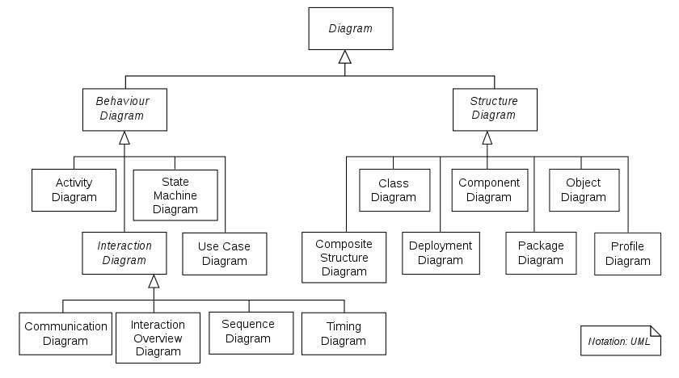

# Junior

### Приветствие

Привет, друг! Если ты выбрал язык C++, то твой путь будет очень интересным и полным "Undefined Behavior". Ты, наверное,
слышал, что язык C++ используется во многих местах, и разработчик на C++ обязан знать, как работает память, как устроены
структуры данных, а также знать множество алгоритмов.

### О курсе

Этот мой небольшой курс предназначен для тех людей, которые хотят стать системным или backend разработчиком. Если же ты
выбрал путь game или gui разработки, то тебе будет недостаточно, и некоторые материалы могут показаться излишними.

Я не гарантирую, что прочитав данный материал полностью, ты станешь опытным специалистом. Потому что, выбрав эту
профессию, ты подписался на то, что будешь учиться всю свою жизнь. Кстати, поздравляю, у тебя еще будет профессиональная
деформация.

Но я уверен, что если ты будешь выполнять все последовательно и применять на практических задачах, которые прикреплены к
прочитанным материалам, то обещаю, что ты быстрее найдешь работу своей мечты.

### Что ты должен уже уметь

- Знать основы языка.
- Иметь знания на базовом уровне функционального программирования (то есть основы языка C).
- Понимать, как устроена компьютерная память.
- Иметь в наличии какую-нибудь IDE, настроенную для работы.
- Иметь базовое представление о структурах данных.

---

## 📑 Содержание

* [➕ C/C++](#-cc)
* [🧳 ООП](#-ооп)
* [🧩 Memory](#выделение-и-управление-памятью)

[//]: # (* [⭐️ Эффективный C++]&#40;#effecive&#41;)

- ### <span style="color:red">*Общие вопросы*</span>

<a id="cc"></a>
## ➕ C/C++

### const

#### Функция

1. Изменение переменной, указывающее на то, что переменная не может быть изменена;
2. Измененные указатели, разделенные на указатели на const (указатель на const) и указатели, которые сами являются
   константами (const указатель, const указатель);
3. Измененные ссылки, ссылки на константы (ссылка на const), используются для типов формальных параметров, что позволяет
   избежать копирования и модификации функции значений;
4. Украшение функции-члена, указывающее на то, что переменные-члены не могут быть изменены внутри функции-члена.

#### Const Указатели и ссылки

* Указатель
    * Указатель на const
    * Указатель на саму константу (const указатель)
* Ссылка
    * Ссылка на const
    * Нет const ссылки, потому что ссылка является псевдонимом объекта, ссылка не является объектом

> (Думайте об этом для удобства) Значение, измененное const (после const), не может быть изменено, например `p2`, `p3` в
> примере использования ниже

#### использование

const использование

```c++
    // класс
    class A
    {
    private:
        const int a;                // константный объект-член, может использовать список инициализации или инициализатор в классе
    
    public:
        // Конструктор
        A() : a(0) { };
        A(int x) : a(x) { };        //  список инициализации
    
        //  const может использоваться для различения перегруженных функций
        int getValue();             //  обычная функция-член
        int getValue() const;       // константная функция-член, не должна изменять значение любого члена данных в классе
    };
    
    void function()
    {
        // объект
        A b;                        // обычный объект, может вызывать все функции-члены
        const A a;                  // константный объект, может вызывать только константные функции-члены
        const A *p = &a;            // переменная указателя, указывает на константный объект
        const A &q = a;             // ссылка на константный объект
    
        // указатель
        char greeting[] = "Hello";
        char* p1 = greeting;                // переменная указателя, указывающая на переменную массива символов
        const char* p2 = greeting;          // переменная указателя, указывающая на константу массива символов (char, за которым следует const, указывает на то, что указываемый символ (char) не может быть изменен)
        char* const p3 = greeting;          // сам по себе является константным указателем на переменную массива символов (const, за которым следует p3, указывает на то, что сам указатель p3 не может быть изменен)
        const char* const p4 = greeting;    // указатель на саму константу, указывающий на константу массива символов
    }
    
    // функция
    void function1(const int Var);           // переданные параметры являются неизменными внутри функции
    void function2(const char* Var);         // Содержимое, на которое указывает параметр указателя, является константой
    void function3(char* const Var);         // параметр указателя является константой
    void function4(const int& Var);          // ссылочный параметр является константой внутри функции
    
    // возвращаемое значение функции
    const int function5();      // возвращает константу
    const int* function6();     // возвращает переменную указателя на константу, используйте: const int * p = function6 ();
    int* const function7();     // возвращает константный указатель на переменную, используйте: int * const p = function7 ();
```

#### #define и const константы

| #define                                         | const константы                |
|-------------------------------------------------|--------------------------------|
| Макроопределения, эквивалентные замене символов | декларации констант            |
| предварительная обработка                       | обработка компилятора          |
| без проверки типов безопасности                 | с проверкой типов безопасности |
| без выделения памяти                            | требуется выделение памяти     |
| хранится в сегменте кода                        | хранится в сегменте данных     |
| Может быть отменено с помощью `#undef`          | Не отменяемый                  |

### static

#### Функция

1. Изменение обычных переменных, изменение области хранения и жизненного цикла переменных, делает переменные, хранящиеся
   в статической области, выделяет пространство перед запуском функции `main`, если есть начальное значение,
   инициализирует его начальным значением, если нет начального значения, система использует значение по умолчанию для
   его инициализации.
2. Изменение обычных функций для указания области действия функции, которая может использоваться только в файле, где
   определена функция. При разработке проекта с несколькими людьми, чтобы предотвратить дублирование имен от функций в
   пространствах имен других людей, вы можете позиционировать функции как статические.
3. Декорирование переменных-членов. Декорирование переменных-членов так, что все объекты содержат только одну из
   переменных, и вы можете получить доступ к члену без создания объекта.
4. Декорирование функций-членов. Декорирование функций-членов так, чтобы к ним можно было получить доступ без создания
   объектов, но в статических функциях не могут быть доступны нестатические члены.

### указатель this

1. Указатель `this` - это специальный указатель, скрытый в каждой нестатической функции-члене. Он указывает на объект,
   который вызвал функцию-член.
2. При вызове функции-члена на объекте компилятор сначала присваивает адрес объекта указателю `this`, а затем вызывает
   функцию-член. Каждый раз, когда функция-член обращается к члену данных, неявно используется указатель `this`.
3. Когда вызывается функция-член, автоматически передается неявный параметр, который является указателем на объект, где
   находится функция-член.
4. Указатель `this` неявно объявлен как: `ClassName * const this`, что означает, что указатель `this` не может быть
   присвоен; в `const` функции-члене класса `ClassName` тип указателя `this` для: `const ClassName * const`, это
   означает, что объект, на который указывает указатель `this`, не может быть изменен (то есть данные члены таких
   объектов не могут быть присвоены);
5. `this` - это не обычная переменная, а rvalue, поэтому вы не можете получить адрес `this` (вы не можете `& this`).
6. Часто необходимо явно ссылаться на указатель `this` в следующих сценариях:
    1. Для реализации цепочечной ссылки на объект;
    2. Чтобы избежать выполнения присваиваний на одном и том же объекте;
    3. При реализации некоторых структур данных, таких как `list`.

### inline функция

#### Особенности

* Эквивалентно записи содержимого inline функции при вызове inline функции;
* Эквивалентно прямому выполнению тела функции без выполнения шагов входа в функцию;
* Эквивалентно макросу, но с большей проверкой типов, чем у макроса, он действительно имеет функциональные
  характеристики;
* Компилятор обычно не встраивает inline функции, которые включают сложные операции, такие как циклы, рекурсия и
  переключение;
* Функции, определенные в объявлениях классов, кроме виртуальных функций, автоматически неявно рассматриваются как
  inline функции.

#### использование

inline использование

```c++
// Утверждение 1 (плюс inline, рекомендуется)
inline int functionName(int first, int second,...);

// утверждение 2 (без inline)
int functionName(int first, int second,...);

// определение
inline int functionName(int first, int second,...) {/****/};

// внутри определения класса, неявно inline
class A {
    int doA() { return 0; }         // неявное встраивание
}

// определение вне класса, необходимо явно встроить
class A {
    int doA();
}
inline int A::doA() { return 0; }   // требуется явное встраивание
```

#### Этапы обработки компилятора для inline функций

1. Скопировать тело inline функции в точку вызова `inline` функции;
2. Выделить пространство памяти для локальных переменных в используемой `inline` функции;
3. Сопоставить входные параметры и возвращаемые значения `inline` функции с пространством локальных переменных
   вызывающего метода;
4. Если у `inline` функции есть несколько точек возврата, превратите ее в ветвь в конце блока кода inline функции (
   используя `GOTO`).

#### Преимущества и недостатки

Преимущества

1. Inline функции, как и макрофункции, выполняют расширение кода на месте вызывающего, устраняя необходимость в толчении
   параметров на стек, открытии и восстановлении стековых кадров и возвращении результатов и т. д., тем самым улучшая
   скорость выполнения программы.
2. По сравнению с макрофункциями, inline функции выполняют проверку безопасности или автоматическое преобразование
   типов (как и обычные функции) при расширении кода, в то время как макроопределения этого не делают.
3. Объявление функции-члена, которое также определено в классе, автоматически преобразует его в inline функцию, поэтому
   inline функции могут получить доступ к переменным-членам класса, в то время как макроопределения не могут.
4. Inline функции можно отладить во время выполнения, в то время как макроопределения - нет.

Недостатки

1. Раздутие кода. Встраивание происходит за счет раздутия кода (копирования), устраняя накладные расходы на вызов
   функций. Если время выполнения кода в теле функции больше, чем стоимость вызова функции, то прирост эффективности
   будет небольшим. С другой стороны, копирование кода для каждого вызова inline функции увеличит общий размер кода
   программы и потребует больше памяти.
2. Inline функцию нельзя обновить с обновлением библиотеки функций. Изменения в inline функции требуют повторной
   компиляции, в отличие от не-inline, которую можно прямо связать.
3. Является ли она inline или нет, находится за пределами контроля программиста. Inline функции - это просто предложения
   компилятору. Решение о встраивании функций принимает компилятор.

#### Может ли виртуальная функция быть inline функцией?

> [Are "inline virtual" member functions ever actually "inlined"?](Http://www.cs.technion.ac.il/users/yechiel/c++-faq/inline-virtuals.html)

* Виртуальная функция может быть inline функцией. Inline может изменить виртуальную функцию, но она не может быть
  встроена, когда виртуальная функция проявляет полиморфизм.
* Встраивание рекомендуется компилятором, а полиморфизм виртуальных функций происходит во время выполнения. Компилятор
  не может знать, какой код вызывается во время выполнения, поэтому виртуальные функции не могут быть встроены во время
  выполнения (runtime).
* `inline virtual` Единственное время, когда она может быть встроена: компилятор знает, какой класс вызывает объект (
  например, `Base::who()` ), только если у компилятора есть фактический объект, а не указатель или ссылка на объект,
  произойдет.

Использование виртуальной функции inline

```c++
#include <iostream>  
using namespace std;
class Base
{
public:
	inline virtual void who()
	{
		cout << "Я Base\n";
	}
	virtual ~Base() {}
};
class Derived : public Base
{
public:
	inline void who()  // Неявное встраивание при не написании inline
	{
		cout << "Я Derived\n";
	}
};

int main()
{
	// Здесь виртуальная функция who () вызывается через конкретный объект (b) класса (Base), который может быть определен во время компиляции, поэтому он может быть встроен, но будет ли он встроен, зависит от компиляции Устройство.
	Base b;
	b.who();

	// Здесь виртуальная функция вызывается через указатель, который является полиморфным и должен быть определен во время выполнения, поэтому он не может быть встроен.
	Base *ptr = new Derived();
	ptr->who();

	// Поскольку Base имеет виртуальный деструктор (virtual ~ Base () {}), при удалении сначала вызывается деструктор Derived, а затем деструктор Base, чтобы предотвратить утечки памяти.
	delete ptr;
	ptr = nullptr;

	system("pause");
	return 0;
} 
```

### volatile

```c++
volatile int i = 10; 
```

* Ключевое слово volatile является модификатором типа, и переменная типа, объявленная с его помощью, указывает, что она
  может быть изменена некоторыми факторами, неизвестными компилятору (операционная система, аппаратное обеспечение,
  другие потоки и т. д.). Таким образом, использование volatile говорит компилятору, что такие объекты не следует
  оптимизировать.
* Переменные, объявленные с помощью ключевого слова volatile, должны быть извлечены из памяти при каждом доступе к ним (
  переменные, которые не изменяются с помощью volatile, могут быть извлечены из регистров CPU из-за оптимизации
  компилятора)
* const может быть volatile (например, регистр состояния только для чтения)
* Указатель может быть volatile

### assert()

Утверждения являются макросами, а не функциями. Прототип макроса assert определен в `<assert.h>` (C), `<cassert>` (
C ++), и его роль заключается в прекращении выполнения программы, если его условие возвращает ошибку. Вы можете
отключить assert, определив `NDEBUG`, но это должно быть в начале исходного кода, перед `include <assert.h>` .

assert () использует

```c++
#define NDEBUG          // Добавьте эту строку, assert не доступен
#include <assert.h>

assert( p != NULL );    // assert не доступен
```

### sizeof()

* sizeof для массивов - получить размер всего массива.
* sizeof для указателей - получить размер пространства, занимаемого самим указателем.

### #pragma pack(n)

Установите структуру, объединение и переменные-члены класса, чтобы быть выровненными по n-байтам

#pragma pack (n) использует

```c++
#pragma pack(push)  // сохранить состояние выравнивания
#pragma pack(4)     // Установить 4-байтовое выравнивание

struct test
{
    char m1;
    double m4;
    int m3;
};

#pragma pack(pop)   // Восстановить выравнивание
```

### Поле битов

```c++
Bit mode: 2;    // mode состоит из 2 цифр
```

Класс может определить свои (нестатические) данные-члены в виде полей битов, которые содержат определенное количество
двоичных битов в поле битов. Когда программа должна передать двоичные данные другим программам или аппаратным
устройствам, обычно используется поле битов.

* Расположение поля битов в памяти зависит от машины
* Тип поля битов должен быть целым или перечисляемым типом. Поведение поля битов в знаковом типе будет зависеть от
  реализации.
* Оператор извлечения (&) не может быть применен к полю битов, и ни один указатель не может указывать на поле битов
  класса

### extern "C"

* Функции или переменные с квалификатором extern имеют тип extern
* Переменные и функции, декорированные с помощью `extern" C "`, компилируются и связываются в C

Функция `extern" C "` заключается в том, чтобы позволить компилятору C ++ рассматривать код, объявленный с
помощью `extern" C "`, как код на языке C, что может избежать проблемы, что код не может быть связан с символами в
библиотеке языка C из-за модификации символов. .

extern "C" демо

```c++
#ifdef __cplusplus
extern "C" {
#endif

void *memset(void *, int, size_t);

#ifdef __cplusplus
}
#endif
```

### struct с typedef struct

#### В C

```c++
// c
typedef struct Student {
    int age; 
} S;
```

Эквивалентно

```c++
// c
struct Student { 
    int age; 
};

typedef struct Student S;
```

В этот момент `S` эквивалентен` struct Student`, но два идентификатора пространства имен различны.

Вы также можете определить `void Student(){}`, который не конфликтует с `struct Student` .

#### На C++

Правила компилятора для размещения символов (правила поиска) изменились, поэтому они отличаются от языка C.

Во-первых, если определено `struct Student {...};` в пространстве идентификаторов класса, при
использовании `Student me;` компилятор будет искать в глобальной таблице идентификаторов. Если `Student` не найден, он
будет искать в идентификаторе класса.

Это означает, что можно использовать `Student` или `struct Student`, как показано ниже:

```c++
// cpp
struct Student { 
    int age; 
};

void f( Student me );       // верно, ключевое слово "struct" можно опустить
```

Если определена функция с тем же именем, что и `Student`, `Student` представляет только функцию, а не структуру, как
показано ниже:

```c++
typedef struct Student { 
    int age; 
} S;

void Student() {}           //Верно, "Student" представляет только эту функцию после определения

//void S() {}               // Ошибка, символ "S" уже определен как псевдоним для "struct Student"

int main() {
    Student(); 
    struct Student me;      // Или "S me";
    return 0;
}
```

### struct и class в C ++

В общем, struct больше подходит для реализации структуры данных, а class больше подходит для реализации объекта.

#### Разница

* Самое существенное отличие - это контроль доступа по умолчанию
    1. Наследуемые права доступа по умолчанию. У struct они публичные, а у class - приватные.
    2. struct как тело реализации структуры данных, его контроль доступа к данным по умолчанию является публичным, а
       class как тело реализации объекта, его контроль доступа к переменным-членам по умолчанию является приватным.

### union union

Union - это специальный класс, который экономит пространство. Union может иметь несколько членов данных, но только один
член данных может иметь значение в любое время. Когда члену присваивается значение, другие члены становятся
неопределенными. Union имеет следующие характеристики:

* Символ контроля доступа по умолчанию - public
* Может содержать конструкторы и деструкторы
* Не может содержать членов типа ссылки
* Не может наследоваться от других классов и не может использоваться в качестве базового класса
* Не может содержать виртуальных функций
* Анонимный union может напрямую обращаться к членам union в области, где он определен
* Анонимный union не может содержать защищенных членов или частных членов
* Глобальный анонимный union должен быть статическим

демо union

```c++
#include<iostream>

union UnionTest {
    UnionTest() : i(10) {};
    int i;
    double d;
};

static union {
    int i;
    double d;
};

int main() {
    UnionTest u;

    union {
        int i;
        double d;
    };

    std::cout << u.i << std::endl;  // Вывод UnionTest union 10

    ::i = 20;
    std::cout << ::i << std::endl;  // Вывод глобального статического анонимного union 20

    i = 30;
    std::cout << i << std::endl;    // Вывод локального анонимного union 30

    return 0;
}
```

### C реализует классы C ++

C реализует объектно-ориентированные особенности C ++ (инкапсуляция, наследование, полиморфизм)

* Инкапсуляция: Используйте указатели на функции для инкапсуляции свойств и методов в структурах
* Наследование: вложенность структур
* Полиморфизм: указатели на функции родительских и дочерних методов отличаются

> [Можно ли написать объектно-ориентированный код на C? [закрыто]](https://stackoverflow.com/a/351745)

### explicit (ключевое слово)

* Модификация конструктора explicit предотвращает неявное преобразование и инициализацию копированием
* Явные преобразования могут предотвратить неявные преобразования, за
  исключением [преобразования по контексту](https://en.cppreference.com/w/cpp/language/implicit_conversion)

демо explicit

```c++
struct A
{
	A(int) { }
	operator bool() const { return true; }
};

struct B
{
	explicit B(int) {}
	explicit operator bool() const { return true; }
};

void doA(A a) {}

void doB(B b) {}

int main()
{
	A a1(1);		// OK: прямая инициализация
	A a2 = 1;		// OK: инициализация копированием
	A a3{ 1 };		// OK: прямая инициализация списка
	A a4 = { 1 };		// OK: инициализация копированием списка
	A a5 = (A)1;		// OK: разрешено явное преобразование static_cast
	doA(1);			// OK: разрешено неявное преобразование из int в A
	if (a1);		// OK: неявное преобразование из A в bool с использованием функции преобразования A ::operator bool()
	bool a6(a1);		// OK: неявное преобразование из A в bool с использованием функции преобразования A::operator bool()
	bool a7 = a1;		// OK: неявное преобразование из A в bool с использованием функции преобразования A::operator bool()
	bool a8 = static_cast<bool>(a1);  // OK: static_cast для прямой инициализации

	B b1(1);		// OK: прямая инициализация
	B b2 = 1;		// Ошибка: объект, измененный с помощью явного конструктора, не может быть инициализирован копированием
	B b3{ 1 };		// OK: прямая инициализация списка
	B b4 = { 1 };		// Ошибка: объект, измененный с помощью явного конструктора, не может инициализировать список копированием
	B b5 = (B)1;		// OK: разрешено явное преобразование static_cast
	doB(1);			// Ошибка: объекты, конструктор которых явно изменен, не могут быть неявно преобразованы из int в B
	if (b1);		// OK: объекты, измененные с помощью явной функции преобразования B::operator bool(), могут быть преобразованы из B в bool по контексту
	bool b6(b1);		// OK: объекты, измененные с помощью явной функции преобразования B::operator bool(), могут быть преобразованы из B в bool по контексту
	bool b7 = b1;		// Ошибка: объекты, измененные с помощью явной функции преобразования B :: operator bool (), не могут быть неявно преобразованы
	bool b8 = static_cast<bool>(b1);  // OK: static_cast выполняет прямую инициализацию

	return 0;
}
```

### friend - класс-друг и функция-друг

* Доступ к приватным членам
* Разрушение инкапсуляции
* Дружба не транзитивна
* Односторонняя дружба
* Нет ограничений на форму и количество деклараций дружбы

### using

#### Использование выражения

`using declaration` вводит только одного члена пространства имен за раз. Это позволяет нам точно знать, какое имя
ссылается в программе. Например:

```c++
using namespace_name :: name;
```

#### Использование декларации конструктора

В C ++ 11 производный класс может повторно использовать конструктор, определенный его непосредственным базовым классом.

```c++
class Derived : Base {
public:
    using Base::Base;
    /* ... */
};
```

Как указано выше, для каждого конструктора базового класса компилятор генерирует соответствующий ему конструктор
производного класса (список параметров точно такой же). Генерируется следующий тип конструктора:

```c++
Derived (parms): Base (args) {}
```

#### Инструкции using

Директива `using` делает видимыми все имена в определенном пространстве имен, поэтому нам не нужно добавлять к ним
никаких префиксных квалификаторов. Например:

```c++
using namespace_name name;
```

#### Минимизация `using directives` для загрязнения пространств имен

> В общем, безопаснее использовать команду using, чем компилировать команду using, потому что она **импортирует только
указанное имя**. Если имя конфликтует с локальным именем, компилятор **выдаст инструкции**. Компилировать команду using
> импортирует все имена, включая имена, которые могут быть не нужны. Если есть конфликт с локальным именем, локальное
> имя
> переопределит версию пространства имен, и компилятор не выдаст предупреждение. Кроме того, открытость пространства
> имен
> означает, что имена пространства имен могут быть разбросаны в разных местах, что затрудняет точное знание, какие имена
> были добавлены.

демо using

Минимизация `using directives`

```c++
using namespace std;
```

Вы должны чаще использовать `using declarations`

```c++
int x;
std::cin >> x ;
std::cout << x << std::endl;
```

или

```c++
using std::cin;
using std::cout;
using std::endl;
int x;
cin >> x;
cout << x << endl;
```

### :: оператор разрешения области видимости

#### классификация

1. Глобальная область видимости (`:: name`): используется перед именами типов (классы, члены класса, функции-члены,
   переменные и т. д.), чтобы указать, что область видимости - это глобальное пространство имен
2. Символ области видимости класса (`class :: name`): используется для указания, что область видимости указанного типа
   относится к классу
3. Область видимости пространства имен (`namespace :: name`): используется для указания, что область видимости
   указанного типа относится к пространству имен

демо ::

```c++
int count = 11;         // Глобальный (: :) count

class A {
public:
	static int count;   // Count (A::count) класса A
};
int A::count = 21;

void fun()
{
	int count = 31;     // Инициализируем локальный count как 31
	count = 32;         // Устанавливаем локальный count как 32
}

int main() {
	::count = 12;       // Тест 1: Устанавливаем глобальный count как 12

	A::count = 22;      // Тест 2: Устанавливаем count класса A как 22

	fun();		        // Тест 3

	return 0;
}
```

### enum - тип enum

#### Область перечисления

```c++
enum class open_modes { input, output, append };
```

#### Неограниченный тип перечисления

```c++
enum color { red, yellow, green };
enum { floatPrec = 6, doublePrec = 10 };
```

### decltype

Ключевое слово decltype используется для проверки объявленного типа или типа выражения и классификации значения
сущности. грамматика:

```c++
decltype ( expression )
```

демо decltype

```c++
// Возврат хвоста позволяет нам объявить тип возврата после списка параметров
template <typename It>
auto fcn(It beg, It end) -> decltype(*beg)
{
    / обработка последовательности
    return *beg;     // возвращаем ссылку на элемент в последовательности
}
// Чтобы использовать члены параметра шаблона, вы должны использовать typename
template <typename It>
auto fcn2(It beg, It end) -> typename remove_reference<decltype(*beg)>::type
{
    // обработка последовательности
    return * beg; // возвращаем копию элемента в последовательности
}
```

### ссылка

#### ссылка lvalue

Обычная ссылка, которая обычно представляет собой идентичность объекта.

#### ссылка rvalue

Ссылка rvalue - это ссылка, которая должна быть связана с rvalue (временным объектом, объектом, подлежащим уничтожению)
и обычно представляет собой значение объекта.

Ссылка rvalue реализует Move Sementics и Perfect Forwarding. Ее основная цель двояка:

* Устранить ненужное копирование объектов при взаимодействии двух объектов, экономя вычислительные ресурсы хранения и
  повышая эффективность.
* Возможность более кратко определить обобщенные функции.

#### Сворачивание ссылок

* `X & &`, `X & &&`, `X && &` могут быть свернуты в `X &`
* `X && &&` может быть свернут в `X &&`

### Макрос

* Определение макроса может реализовать функцию, похожую на функцию, но это все же не функция, и "параметры" в скобках в
  определении макроса - это не настоящие параметры. "Параметры" заменяются один к одному при расширении макроса.

### Список инициализации членов

преимущества

* Более эффективно: Нет необходимости вызывать конструктор по умолчанию еще раз.
* В некоторых случаях необходимо использовать список инициализации:
    1. Константные члены, потому что константы можно только инициализировать и не могут быть присвоены, поэтому они
       должны быть помещены в список инициализации
    2. Типы ссылок. Ссылки должны быть инициализированы в момент определения и не могут быть переназначены, поэтому они
       также должны быть записаны в список инициализации.
    3. Нет класса типа для конструктора по умолчанию, потому что список инициализации можно использовать для
       инициализации без необходимости вызывать конструктор по умолчанию.

### initializer_list список инициализации

Инициализируйте объект с помощью списка инициализаторов в фигурных скобках, где соответствующий конструктор принимает
параметр `std :: initializer_list`.

использование initializer_list

```c++
#include <iostream>
#include <vector>
#include <initializer_list>
 
template <class T>
struct S {
    std::vector<T> v;
    S(std::initializer_list<T> l) : v(l) {
         std::cout << "constructed with a " << l.size() << "-element list\n";
    }
    void append(std::initializer_list<T> l) {
        v.insert(v.end(), l.begin(), l.end());
    }
    std::pair<const T*, std::size_t> c_arr() const {
        return {&v[0], v.size()};  // Copy the list initialization in the return statement
                                   // this does not use std :: initializer_list
    }
};
 
template <typename T>
void templated_fn(T) {}
 
int main()
{
    S<int> s = {1, 2, 3, 4, 5}; // copy initialization
    s.append({6, 7, 8});      // list initialization in function call
 
    std::cout << "The vector size is now " << s.c_arr().second << " ints:\n";
 
    for (auto n : s.v)
        std::cout << n << ' ';
    std::cout << '\n';
 
    std::cout << "Range-for over brace-init-list: \n";
 
    for (int x : {-1, -2, -3}) // auto rules make this band for work
        std::cout << x << ' ';
    std::cout << '\n';
 
    auto al = {10, 11, 12};   // special rules for auto
 
    std::cout << "The list bound to auto has size() = " << al.size() << '\n';
 
//    templated_fn({1, 2, 3}); // Compile error! "{1, 2, 3}" is not an expression,
                              // it has no type, so T cannot infer
    templated_fn<std::initializer_list<int>>({1, 2, 3}); // OK
    templated_fn<std::vector<int>>({1, 2, 3});           // also OK
}
```

### СТОП! Возьмите перерыв :)

- Ваша задача теперь - использовать на практике то, что вы прочитали.
- Перейдите по ссылке и выполните задачи уровня "easy", их около 30. У меня ушло 2 дня на это, когда я был
  новичком. [Удачи вам, и не забудьте вернуться](https://leetcode.com/tag/math/).

- ## <span style="color:red">*ООП*</span>
<a id="oop"></a>
### 🧳 ООП


Объектно-ориентированное программирование (ООП) - это модель программирования программ с объектными концепциями, а также
абстрактный подход к разработке программ.



Три особенности объектно-ориентированного - инкапсуляция, наследование и полиморфизм

### Инкапсуляция

Инкапсулируйте объективные вещи в абстрактные классы, и классы могут использовать только свои собственные данные и
методы для доверенных классов или объектов для работы, и скрывать недоверенную информацию. Ключевые слова: public,
protected, private. Не пишите по умолчанию в private.

* `public` члены: могут быть доступны любой сущности
* `protected` члены: разрешено доступ только подклассам и функциям-членам этого класса
* `private` члены: доступны только функциям-членам, классам-друзьям или функциям-друзьям этого класса

### Наследование

* Базовый класс (родительский класс) ——&gt; производный класс (подкласс)

#### Полиморфизм

* Полиморфизм, то есть множественные состояния (формы). Проще говоря, мы можем определить полиморфизм как способность
  сообщения отображаться в нескольких формах.
* Полиморфизм основан на инкапсуляции и наследовании.
* Классификация и реализация полиморфизма C:
    1. Ad-hoc Полиморфизм (во время компиляции): перегрузка функций, перегрузка операторов
    2. Подтип Полиморфизма (во время выполнения): виртуальная функция
    3. Параметрический Полиморфизм (во время компиляции): шаблон класса, шаблон функции
    4. Принудительный Полиморфизм (компиляция / выполнение): базовое преобразование типов, пользовательское
       преобразование типов

> [Четыре Полиморфизма в C++](https://catonmat.net/cpp-polymorphism)

#### Статический полиморфизм (во время компиляции / раннее связывание)

Перегрузка функций

```c++
class A
{
public:
    void do(int a);
    void do(int a, int b);
};
```

#### Динамический полиморфизм (во время выполнения / позднее связывание)

* Виртуальные функции: украшают функции-члены виртуальными, чтобы сделать их виртуальными
* Динамическое связывание: динамическое связывание происходит, когда виртуальная функция вызывается с использованием
  ссылки или указателя на базовый класс

**заметка:**

* Вы можете присвоить объект производного класса указателю или ссылке базового класса, и наоборот
* Обычные функции (не функции-члены класса) не могут быть виртуальными функциями
* Статические функции (static) не могут быть виртуальными функциями
* Конструктор не может быть виртуальной функцией (потому что когда вызывается конструктор, указатель виртуальной таблицы
  не находится в пространстве памяти объекта, указатель виртуальной таблицы должен быть сформирован после вызова
  конструктора)
* Встроенная функция не может быть виртуальной функцией, когда она показывает полиморфизм. Для объяснения см.:Может ли
  виртуальная функция быть встроенной функцией?

    - <details><summary>Ответ:</summary>
       Виртуальная функция может быть объявлена как встроенная с помощью ключевого слова inline, но компилятор может проигнорировать это объявление. Виртуальные функции обычно не являются встроенными, потому что они используют механизм динамического связывания, который требует определения адреса функции во время выполнения. Встроенные функции, с другой стороны, вставляются непосредственно в точку вызова во время компиляции
      </details>

Демо динамического полиморфизма

```c++
class Shape                     // класс формы
{
public:
    virtual double calcArea()
    {
        ...
    }
    virtual ~Shape();
};
class Circle : public Shape     // класс круга
{
public:
    virtual double calcArea();
    ...
};
class Rect : public Shape       // класс прямоугольника
{
public:
    virtual double calcArea();
    ...
};
int main()
{
    Shape * shape1 = new Circle(4.0);
    Shape * shape2 = new Rect(5.0, 6.0);
    shape1->calcArea();         // вызов метода в классе круга
    shape2->calcArea();         // вызов метода в классе прямоугольника
    delete shape1;
    shape1 = nullptr;
    delete shape2;
    shape2 = nullptr;
    return 0;
}
```

### Виртуальный деструктор

Виртуальный деструктор - это для разрешения указателя базового класса на объект производного класса и удаления объекта
производного класса с помощью указателя базового класса.

Демо виртуального деструктора

```c++
class Shape
{
public:
    Shape();                    // Конструктор не может быть виртуальным
    virtual double calcArea();
    virtual ~Shape();           // виртуальный деструктор
};
class Circle : public Shape     // класс круга
{
public:
    virtual double calcArea();
    ...
};
int main()
{
    Shape * shape1 = new Circle(4.0);
    shape1->calcArea();    
    delete shape1;  // Поскольку у Shape есть виртуальный деструктор, когда delete удаляет память, он сначала вызывает деструктор подкласса, а затем деструктор базового класса, чтобы предотвратить утечки памяти.
    shape1 = NULL;
    return 0；
}
```

### Чистые виртуальные функции

Чистая виртуальная функция - это особый вид виртуальной функции. Вы не можете дать значимую реализацию виртуальной
функции в базовом классе. Вместо этого вы объявляете его как чистую виртуальную функцию. Его реализация оставлена для
производных классов базового класса.

```c++
virtual int A() = 0;
```

### Виртуальные функции и чисто виртуальные функции

* Если в классе объявлена виртуальная функция, она реализуется, даже если она пуста. Её роль заключается в том, чтобы
  позволить этой функции быть переопределенной в подклассах. Так компилятор может использовать позднее связывание для
  достижения полиморфизма. Чисто виртуальная функция — это всего лишь интерфейс. Это объявление функции. Её реализацию
  необходимо оставить в подклассе.
* Виртуальные функции не могут быть переопределены в подклассах, но чисто виртуальные функции должны быть реализованы в
  подклассах для создания экземпляров подклассов.
* Виртуальный класс используется для "наследования реализации". Наследование интерфейса также означает наследование
  реализации родительского класса. Чисто виртуальные функции сосредотачиваются на единообразии интерфейса, а реализация
  выполняется подклассами.
* Класс с чисто виртуальной функцией называется абстрактным классом. Этот класс не может напрямую создавать объекты. Он
  может быть использован только после наследования и переопределения его виртуальной функции. После наследования
  абстрактного класса подклассы могут оставаться абстрактными или стать обычными классами.
* Виртуальный базовый класс — это базовый класс в виртуальном наследовании, подробности см. ниже.

> [C++ и связь виртуальных функций и pure виртуальных функций](./materials/virtual_functs.md)

### Указатель на виртуальную функцию, таблица виртуальных функций

* Указатель на виртуальную функцию: В объекте, содержащем класс виртуальной функции, он указывает на таблицу виртуальных
  функций, которая определяется во время выполнения.
* Таблица виртуальных функций: в программе в разделе только для чтения данных (`.rodata section`,
  см.: [структура хранения объектного файла](https://blog.twofei.com/496/)) хранятся указатели на виртуальные функции.
  Если производный класс реализует виртуальную функцию базового класса, указатель на виртуальную функцию исходного
  базового класса перезаписывается в виртуальной таблице и создается в соответствии с объявлением класса на этапе
  компиляции.

> [Механизм реализации функции (таблицы) C++ и моделирование реализации на языке C](https://blog.twofei.com/496/)

### Виртуальное наследование

Виртуальное наследование используется для решения проблемы ромбовидного наследования в условиях множественного
наследования (тратится место хранения и возникает неоднозначность).

Принцип реализации на нижнем уровне связан с компилятором. Обычно он реализуется с помощью **указателя на виртуальный
базовый класс** и **таблицы виртуального базового класса**. Каждый подкласс, наследуемый виртуально, имеет указатель на
виртуальный базовый класс (занимает место хранения указателя, 4 байта) и таблицу виртуального базового класса (не
занимает место хранения объектов класса) (Следует подчеркнуть, что виртуальный базовый класс все равно будет иметь копию
в подклассе, но будет не более одной копии, а не внутри подкласса); когда подкласс виртуального наследования наследуется
в качестве родительского класса, указатель на виртуальный базовый класс также будет унаследован.

На самом деле, `vbptr` относится к указателю на виртуальную базовую таблицу. Этот указатель указывает на виртуальную
базовую таблицу. Виртуальная таблица записывает смещение адреса виртуального базового класса и этого класса. Смещение
адреса, чтобы были найдены члены виртуального базового класса, и виртуальное наследование не нужно поддерживать две
идентичные копии общего базового класса (виртуального базового класса), как это делается при обычном множественном
наследовании, экономя место хранения.

### Виртуальное наследование, виртуальные функции

* Сходства: Оба используют виртуальные указатели (оба занимают место в классе) и виртуальные таблицы (оба не занимают
  место в классе)
* Разница:
    * Виртуальное наследование
        * Виртуальный базовый класс все еще существует в наследуемом классе и занимает только место в памяти
        * Таблица виртуального базового класса хранит смещение виртуального базового класса относительно прямого
          наследуемого класса
    * Виртуальная функция
        * Виртуальные функции не занимают место в памяти
        * Таблица виртуальных функций хранит адрес виртуальной функции

### Шаблонные классы, шаблоны членов, виртуальные функции

* Виртуальные функции могут использоваться в шаблонных классах
* Шаблон члена класса (будь то обычный класс или шаблон класса) (это функция-член шаблона) не может быть виртуальной
  функцией

### Абстрактный класс, интерфейсный класс, агрегатный класс

* Абстрактный класс: класс, содержащий чистые виртуальные функции
* Интерфейсный класс: Абстрактный класс, содержащий только чистые виртуальные функции
* Агрегатные классы: Пользователи могут напрямую обращаться к их членам и имеют специальный синтаксис инициализации.
  Соответствуют следующим характеристикам:
    * Все члены являются общедоступными
    * Конструктор не определен
    * Нет инициализации в классе
    * Нет базового класса, нет виртуальной функции

### СТОП! Возьмите перерыв :)

- Ваша задача теперь - использовать на практике то, что вы прочитали.
- Перейдите по ссылке и выполните задачи уровня "easy", их около 50. У меня ушло 3 дня на это, когда я был
  новичком. [Удачи вам, и не забудьте вернуться](https://leetcode.com/tag/tree/).


- ### <span style="color:red">*Memory*</span>
<a id="memory"></a>
### Выделение и управление памятью

#### malloc, calloc, realloc, alloca

1. malloc: запросить указанное количество байтов памяти. Начальное значение в запрошенной памяти неопределенно.
2. calloc: для объекта указанной длины выделить память, которая может содержать указанное количество объектов. Каждый
   бит запрошенной памяти инициализируется на 0.
3. realloc: изменить длину ранее выделенной памяти (увеличить или уменьшить). При увеличении длины может потребоваться
   перемещение содержимого ранее выделенной области в другую достаточно большую область, при этом начальное значение в
   новой добавленной области неопределенно.
4. alloca: запросить память на стеке. Когда программа выходит из стека, она автоматически освобождает память. Однако
   следует отметить, что alloca не является переносимой и сложной для реализации на машинах без традиционных стеков.
   alloca не следует использовать в программах, которые должны быть широко портированы. C99 поддерживает массивы
   переменной длины (VLAs) и может использоваться вместо alloca.

#### malloc, free

Используются для выделения и освобождения памяти

Использование malloc, free

Запросить память и подтвердить успешность заявки

```c++
char *str = (char*) malloc(100);
assert(str != nullptr);
```

Указатель пуст после освобождения памяти

```c++
free(p); 
p = nullptr;
```

#### new、delete

1. new / new []: делают две вещи, сначала вызывают malloc на нижнем уровне для выделения памяти, а затем вызывают
   конструктор (создают объект).
2. delete / delete []: также выполняют две вещи, сначала вызывают деструктор (очищают ресурсы), а затем вызывают free на
   нижнем уровне для освобождения пространства.
3. new автоматически вычисляет количество требуемых байтов при запросе памяти, а malloc требует от нас ввода количества
   байтов запрошенного пространства памяти.

Демонстрация new, delete

Запросить память и подтвердить успешность заявки

```c++
int main()
{
    T* t = new T();     // сначала выделение памяти, затем конструктор
    delete t;           // сначала деструктор, затем освобождение памяти
    return 0;
}
```

#### Позиционированный new

Позиционированный new (placement new) позволяет нам передавать дополнительные адресные параметры в new для создания
объектов в заранее указанной области памяти.

```c++
new (place_address) type
new (place_address) type (initializers)
new (place_address) type [size]
new (place_address) type [size] { braced initializer list }
```

* `place_address` - это указатель
* `initializers` предоставляет (возможно, пустой) список начальных значений, разделенных запятыми

### delete this - это законно?

> [Законно ли (и морально) для функции-члена сказать delete this?](https://isocpp.org/wiki/faq/freestore-mgmt#delete-this)

Законно, но:

1. Должно быть гарантировано, что этот объект выделен через `new` (не `new[]`, не позиционированный new, не на стеке, не
   глобальный, не член других объектов)
2. Вы должны гарантировать, что функция-член, которая вызывает delete this, является последней функцией-членом, которая
   вызывает this
3. Вы должны гарантировать, что функция-член не вызывает this после `delete this`
4. Убедитесь, что никто не использует его после delete this

### Как определить класс, который может генерировать объекты только на куче (на стеке)?

> [Как определить класс, который может генерировать объекты только на куче (на стеке)?](https://www.nowcoder.com/questionTerminal/0a584aa13f804f3ea72b442a065a7618)

#### Только на куче

Метод: Сделать деструктор приватным

Причина: C ++ - это язык со статической привязкой. Компилятор управляет жизненным циклом объектов на стеке. Когда
компилятор выделяет стековое пространство для объектов класса, он сначала проверяет доступность деструктора класса. Если
деструктор недоступен, объект не может быть создан на стеке.

#### Только на стеке

Метод: перегрузить new и delete как private

Причина: Объект генерируется на куче с использованием операции new. Процесс делится на два этапа: на первом этапе
используется new для поиска доступной памяти на куче и выделения ее объекту; на втором этапе вызывается конструктор для
создания объекта. Установив операцию new в private, первый этап не может быть завершен, и объекты не могут быть
сгенерированы на куче.

### Умный указатель

#### В стандартной библиотеке C ++ (STL)

файл заголовка：`#include <memory>`

#### C++ 98

```cpp
std::auto_ptr<std::string> ps (new std::string(str))；
```

#### C++ 11

1. shared_ptr
2. unique_ptr
3. weak_ptr
4. auto_ptr (Устарел в C ++ 11)

* Класс shared_ptr реализует концепцию совместного владения. Несколько умных указателей указывают на один и тот же
  объект, и этот объект и его связанные ресурсы освобождаются, когда "последняя ссылка уничтожается". Для выполнения
  вышеуказанной работы в более сложных сценариях стандартная библиотека предоставляет вспомогательные классы, такие как
  weak_ptr, bad_weak_ptr и enable_shared_from_this.
* Класс unique_ptr реализует концепцию исключительного владения или строгого владения, обеспечивая, чтобы только один
  умный указатель мог указывать на объект в одно и то же время. Вы можете передать владение. Это особенно полезно для
  избежания утечек ресурсов, таких как забывание удалить после new.

##### shared_ptr

Несколько умных указателей могут делить один и тот же объект, и последний из объектов имеет обязанность уничтожить
объект и очистить все ресурсы, связанные с объектом.

* Поддержка пользовательского удалителя, которая может предотвратить проблемы Cross-DLL (объект создается с помощью new
  в динамической библиотеке ссылок (DLL), но удаляется другой DLL), и мьютекс автоматически освобождается

##### weak_ptr

weak_ptr позволяет вам делиться, но не владеть объектом. Как только последний умный указатель, который владеет объектом,
теряет владение, любой weak_ptr автоматически становится пустым. Поэтому, в дополнение к конструкторам по умолчанию и
копированию, weak_ptr предоставляет только конструктор "принять shared_ptr".

* Проблема циклов ссылок (два объекта, которые не использовались, фактически ссылаются друг на друга, заставляя их
  появляться в состоянии "использовано")

##### unique_ptr

`unique_ptr` - это тип, который стал доступен только с `C ++ 11`, и это умный указатель, который может помочь избежать
утечек ресурсов во время исключений. Используя исключительное владение, вы можете гарантировать, что объект и его
соответствующий ресурс принадлежат только одному указателю в одно и то же время. Как только вы уничтожите владение или
запрограммируете пустоту, или начнете владеть другим объектом, ранее владеемый объект будет уничтожен, и любые
соответствующие ресурсы будут освобождены.

* unique_ptr используется вместо auto_ptr

##### auto_ptr

Устарел в c ++ 11 из-за отсутствия языковых функций, таких как семантика `std::move` "для конструирования и
присваивания", и других недостатков.

##### Сравнение auto_ptr и unique_ptr

* auto_ptr может быть присвоен копия, и владение передается после копирования; unqiue_ptr не имеет семантики
  присваивания копий, но реализует семантику `move`;
* объекты auto_ptr не могут управлять массивами (разрушительный вызов `delete`), unique_ptr может управлять массивами (
  разрушительный вызов` delete [] `);

### Оператор приведения типов

> [MSDN. Оператор приведения типов](https://msdn.microsoft.com/zh-CN/library/5f6c9f8h.aspx)

#### static_cast

* Для неполиморфных преобразований
* Не выполняет проверку типа во время выполнения (безопасность преобразования не так хороша, как у dynamic_cast)
* Обычно используется для преобразования числовых типов данных (например, float-> int)
* Вы можете перемещать указатель по всей иерархии классов. Это безопасно (восходящее преобразование) для преобразования
  дочернего класса в родительский класс, и это не безопасно для преобразования родительского класса в дочерний класс (
  потому что в дочернем классе могут быть поля или методы, которых нет в родительском классе)

> Восходящее приведение является неявным преобразованием.

#### dynamic_cast

* Для полиморфных преобразований типов
* Выполняет проверку типа во время выполнения
* Применим только к указателям или ссылкам
* Преобразование неоднозначных указателей будет неудачным (вернет nullptr), но исключение не будет выброшено
* Вы можете перемещать указатель по всей иерархии классов, включая восходящее преобразование, нисходящее преобразование

#### const_cast

* Используется для удаления const, volatile и __unaligned свойств (например, преобразование const int в int)

#### reinterpret_cast

* Простое переинтерпретация для битов
* Неправильное использование оператора reinterpret_cast может быть очень рискованным. Если требуемое преобразование само
  по себе не является низкоуровневым, вы должны использовать один из других операторов приведения.
* Позволяет преобразование любого указателя в любой другой тип указателя (например, `char *` в `int *` или `One_class *`
  в `Unrelated_class *`, но само по себе это не безопасно)
* Также позволяет преобразование любого целочисленного типа в любой тип указателя и обратное преобразование.
* Оператор reinterpret_cast не может потерять const, volatile или __unaligned атрибуты.
* Практическое использование reinterpret_cast находится в хеш-функции, которая предназначена для отображения значений на
  индексы, делая два разных значения едва кончаются с тем же индексом.

#### bad_cast

* Оператор dynamic_cast выбрасывает исключение bad_cast, потому что приведение к ссылочному типу не удалось.

Демонстрация bad_cast

```cpp
try {  
    Circle& ref_circle = dynamic_cast<Circle&>(ref_shape);   
}  
catch (bad_cast b) {  
    cout << "Caught: " << b.what();  
} 
```

### Информация о типе во время выполнения (RTTI)

#### dynamic_cast

* Для полиморфных преобразований типов

#### typeid

* Оператор typeid позволяет определить тип объекта во время выполнения
* type \ _id возвращает ссылку на объект type \ _info
* Если вы хотите получить тип данных производного класса через указатель базового класса, базовый класс должен иметь
  виртуальную функцию
* Может получить только фактический тип объекта

#### type_info

* Класс type_info описывает информацию о типе, генерируемую компилятором в программе. Объекты этого класса могут
  эффективно хранить указатели на имена типов. Класс type_info также может хранить закодированные значения, подходящие
  для сравнения, равны ли два типа, или сравнения их порядка перестановки. Правила кодирования и порядок перестановки
  для типов не указаны и могут варьироваться от программы к программе.
* Файл заголовка: `typeinfo`

Демонстрация typeid, type_info

```c++
#include <iostream>
using namespace std;

class Flyable                       // может летать
{
public:
    virtual void takeoff() = 0;     // взлететь
    virtual void land() = 0;        // приземлиться
};
class Bird : public Flyable         // птица
{
public:
    void foraging() {...}           // добывать пищу
    virtual void takeoff() {...}
    virtual void land() {...}
    virtual ~Bird(){}
};
class Plane : public Flyable        // самолет
{
public:
    void carry() {...}              // перевозить
    virtual void takeoff() {...}
    virtual void land() {...}
};

class type_info
{
public:
    const char* name() const;
    bool operator == (const type_info & rhs) const;
    bool operator != (const type_info & rhs) const;
    int before(const type_info & rhs) const;
    virtual ~type_info();
private:
    ...
};

void doSomething(Flyable *obj)                 // делать что-то
{
    obj->takeoff();

    cout << typeid(*obj).name() << endl;        // вывод типа входящего объекта（"class Bird" или "class Plane"）

    if(typeid(*obj) == typeid(Bird))            // определение типа объекта
    {
        Bird *bird = dynamic_cast<Bird *>(obj); // преобразование объекта
        bird->foraging();
    }

    obj->land();
}

int main(){
	Bird *b = new Bird();
	doSomething(b);
	delete b;
	b = nullptr;
	return 0;
}
```

### СТОП! Возьмите перерыв :)

- Ваша задача теперь - использовать на практике то, что вы прочитали.
- Перейдите по ссылкам и выполните задачи уровня "medium": не забудьте вернуться.
- [Tree](https://leetcode.com/tag/tree/)
- [Memoization](https://leetcode.com/tag/memoization/)
- [Dynamic programming](https://leetcode.com/tag/dynamic-programming/)

<a id="effective"></a>

[//]: # (- ### <span style="color:red">*Эффективный C++*</span>)

---

