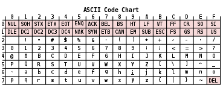
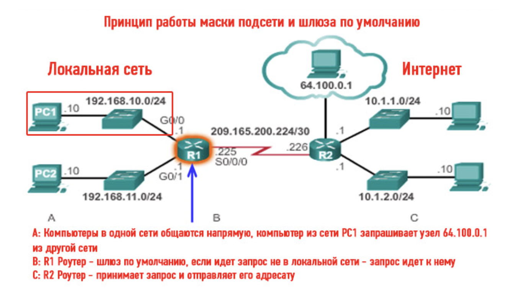

# junior

- ### <span style="color:red">*Общие вопросы*</span>.

  #### 1. В чем заключаются основные принципы ООП?

    - <details><summary>Ответ:</summary>
      Основные принципы ООП включают в себя абстракцию, полиморфизм и наследование. Абстракция означает отделение концепции от ее экземпляра. Полиморфизм позволяет реализовывать задачи одной и той же идеи разными способами. Наследование позволяет создавать новые классы на основе уже существующих</abbr>
      </details>

  #### 2. Что такое сложность алгоритма?

    - <details><summary>Ответ:</summary>
      Сложность алгоритма - это понятие, характеризующее ресурс затратность алгоритма. Она может быть временной (сколько времени нужно центральному процессору для обработки данных) и связанной с памятью (какой объём памяти ЭВМ требуется для программной реализации алгоритма)1. Сложность обычно зависит от размеров входных данных
      </details>

  #### 3. Код работает неправильно. Что делать?
    - <details><summary>Ответ:</summary>

      ## Если ваш код работает неправильно, вы можете попробовать выполнить следующие шаги:
        - Проверьте, правильно ли вы понимаете, что должен делать ваш код.
        - Проверьте входные данные и убедитесь, что они соответствуют ожиданиям.
        - Используйте отладку или добавьте операторы вывода в ключевых местах кода, чтобы увидеть, какие значения
          принимаютпеременные во время выполнения.
        - Проверьте логику вашего кода и убедитесь, что все условия и циклы работают правильно.
        - Если вы используете сторонние библиотеки или функции, убедитесь, что вы используете их правильно.
        - Если проблема не решается, попробуйте обратиться за помощью к другим разработчикам или на форумах
          программистов.

      </details>

  #### 4. Объясните такие структуры данных, как стек и очередь.

    - <details><summary>Ответ:</summary>

        - Стек и очередь - это две разные структуры данных. Стек - это структура данных с доступом к элементам по
          принципу LIFO (Last In First Out - Последний пришел - первый вышел). Это означает, что данные добавляются в
          начало (или конец) стека, откуда же и извлекаются¹.
        - Очередь - это структура данных с доступом к элементам по принципу FIFO (First In First Out - Первый пришел -
          Первый вышел). Это означает, что данные добавляются в конец очереди, а извлекаются из начала¹.
        - В C++ вы можете использовать стандартные контейнеры `stack` и `queue` для работы со стеком и очередью
          соответственно.
        - [(1) c++ - Что такое стеки и очереди? - Stack Overflow на русском.](https://ru.stackoverflow.com/questions/32406/%D0%A7%D1%82%D0%BE-%D1%82%D0%B0%D0%BA%D0%BE%D0%B5-%D1%81%D1%82%D0%B5%D0%BA%D0%B8-%D0%B8-%D0%BE%D1%87%D0%B5%D1%80%D0%B5%D0%B4%D0%B8)
        - [пример кода](Codes/junior/code_4.cpp)
      </details>

  #### 5. Какие книги, связанные с программированием, читали? Чему с них научились?

    - <details><summary>Ответ:</summary>

        - Есть множество книг по программированию на C++, которые могут помочь вам изучить этот язык. Вот несколько
          книг, которые могут быть полезными:
        - Антон Спрол. «Думай как программист. Креативный подход к созданию кода. C++ версия» - эта книга учит решать
          проблемы с помощью программирования и развивать навыки алгоритмического мышления1.
        - Макс Шлее. «Qt 5.10. Профессиональное программирование на C++» - эта книга посвящена использованию фреймворка
          Qt для создания приложений на C++1.
        - Федор Пикус. «Идиомы и паттерны проектирования в современном С++» - эта книга знакомит с идиомами и паттернами
          проектирования, используемыми в современном C++1.
        - Алексей Васильев. «Программирование на C++ в примерах и задачах» - эта книга содержит множество примеров и
          задач для практического изучения C++1.
        - Мариус Бансила. «Решение задач на современном С++» - эта книга посвящена решению различных задач с
          использованием современного C++1.
        - Каждая из этих книг имеет свою специфику и может быть полезна в зависимости от того, что вы хотите изучить.
     </details>

  #### 6. Что интересного нашли в новых стандартах С++17, С++20, C++23 ?

    - <details><summary>Ответ:</summary>

        - Новые стандарты C++17, C++20 и C++23 вводят множество новых возможностей и улучшений в язык C++. Например, в
          C++17 были добавлены такие возможности, как if и switch с инициализацией, структурированные привязки,
          встраиваемые переменные и многое другое.
        - C++20 - это практически новый язык с большим количеством нововведений. Он вводит такие возможности, как
          модули, корутины, концепции и многое другое1.
        - C++23 - это следующая версия стандарта C++, которая находится в разработке. Она будет содержать еще больше
          новых возможностей и улучшений2.
      </details>

  #### 7. Что такое таблица ASCII?

    - <details><summary>Ответ:</summary>

        - Таблица ASCII (American Standard Code for Information Interchange) - это таблица кодировки символов, в которой
          каждой букве, числу или знаку соответствует определенное число. В стандартной таблице ASCII 128 символов,
          пронумерованных от 0 до 1271.
        - Таблица ASCII была разработана и стандартизирована в США в 1963 году и определяет коды для символов, таких как
          десятичные цифры, латинский алфавит, знаки препинания и управляющие символы2.

          
      </details>

  #### 8. Что такое Unicode?

    - <details><summary>Ответ:</summary>

        - Unicode - это стандарт информационных технологий для последовательного кодирования, представления и обработки
          текста, выраженного в большинстве письменных систем мира. Стандарт, который поддерживается Консорциумом
          Unicode, определяет 149 186 символов, охватывающих 161 современный и исторический скрипт, а также символы,
          тысячи эмодзи (включая цветные) и невизуальные управляющие и форматирующие коды1.
        - Успех Unicode в объединении наборов символов привел к его широкому и преобладающему использованию в
          интернационализации и локализации компьютерного программного обеспечения. Стандарт был реализован во многих
          современных технологиях, включая современные операционные системы, XML, JSON и большинство современных языков
          программирования, иногда только в форме UTF-81.

     </details>

  #### 9. Что такое паттерны проектирования и для чего их используют?

    - <details><summary>Ответ:</summary>

        - Паттерны проектирования - это типичные решения общих проблем проектирования, которые возникают при разработке
          программного обеспечения. Они представляют собой проверенные временем и эффективные решения, которые могут
          быть использованы для решения определенных проблем в определенных ситуациях.
        - Один из паттернов проектирования, который может быть использован в C++, - это паттерн Строитель (Builder). Это
          порождающий паттерн проектирования, который позволяет создавать объекты пошагово1. Вот простой пример
          использования этого паттерна в C++:
        - В [этом примере](Codes/junior/code_9.cpp) мы используем паттерн Строитель для создания разных видов пиццы.
          Класс Cook использует объект PizzaBuilder для построения пиццы пошагово. Мы можем использовать разные
          реализации PizzaBuilder (в нашем случае HawaiianPizzaBuilder и SpicyPizzaBuilder) для создания разных видов
          пиццы.
      </details>

  #### 10. Паттерны Singleton, Strategy, Template-Method, Decorator?

    - <details><summary>Ответ:</summary>

        - Singleton, Strategy, Template-Method и Decorator - это четыре разных паттерна проектирования, которые могут
          быть использованы в C++.
        - Singleton - это порождающий паттерн проектирования, который гарантирует, что у класса есть только один
          экземпляр, и предоставляет глобальную точку доступа к этому экземпляру.
        - Strategy - это поведенческий паттерн проектирования, который определяет семейство алгоритмов, инкапсулирует
          каждый из них и делает их взаимозаменяемыми. Он позволяет алгоритму изменяться независимо от клиентов, которые
          его используют.
        - Template-Method - это поведенческий паттерн проектирования, который определяет скелет алгоритма в операции,
          оставляя некоторые шаги для переопределения подклассами. Он позволяет подклассам переопределять определенные
          шаги алгоритма без изменения его структуры.
        - Decorator - это структурный паттерн проектирования, который позволяет динамически добавлять новую
          функциональность к объекту, обертывая его в декоратор.
        - В [этом примере](Codes/junior/jcode_10.cpp) мы используем паттерн Singleton для создания единственного
          экземпляра класса Singleton. Метод getInstance возвращает ссылку на этот единственный экземпляр. Конструктор
          класса Singleton является закрытым, чтобы предотвратить создание дополнительных экземпляров.
      </details>

  #### 11. Для чего нужны модульные тесты?

    - <details><summary>Ответ:</summary>

        - Модульные тесты - это тесты, которые проверяют отдельные модули или компоненты программного обеспечения. Они
          используются для обеспечения того, что каждый модуль работает правильно и соответствует спецификации.
        - Модульные тесты имеют множество преимуществ. Они помогают обнаруживать ошибки на ранних стадиях разработки,
          упрощают внесение изменений в код, улучшают качество кода и увеличивают скорость разработки.
        - ```c++
          #include <gtest/gtest.h>
          int add(int a, int b) {
          return a + b;
          }
          TEST(AddTest, PositiveNumbers) {
            EXPECT_EQ(add(1, 2), 3);
            EXPECT_EQ(add(10, 20), 30);
          }
          TEST(AddTest, NegativeNumbers) {
            EXPECT_EQ(add(-1, -2), -3);
            EXPECT_EQ(add(-10, -20), -30);
          }
          int main(int argc, char **argv) {
            ::testing::InitGoogleTest(&argc, argv);
            return RUN_ALL_TESTS();
          }
          ```
        - В этом примере мы определяем функцию add, которая складывает два числа. Затем мы определяем два модульных
          теста с помощью макросов TEST. Первый тест проверяет, что функция add правильно складывает положительные
          числа. Второй тест проверяет, что функция add правильно складывает отрицательные числа. Мы используем макрос
          EXPECT_EQ для проверки равенства ожидаемого и фактического результатов.
      </details>

  #### 12. Какая разница между модульными и интеграционными тестами?

    - <details><summary>Ответ:</summary>

        - Модульные и интеграционные тесты - это два разных типа тестирования, которые используются для проверки разных
          аспектов программного обеспечения.
        - Модульные тесты фокусируются на проверке отдельных модулей или компонентов программного обеспечения. Они
          используются для обеспечения того, что каждый модуль работает правильно и соответствует спецификации.
          Модульные тесты обычно пишутся разработчиками и выполняются автоматически в процессе разработки.
        - Интеграционные тесты фокусируются на проверке взаимодействия между модулями или компонентами программного
          обеспечения. Они используются для обеспечения того, что различные части программного обеспечения работают
          вместе правильно. Интеграционные тесты могут быть более сложными, чем модульные тесты, так как они требуют
          настройки и запуска всей системы.
        - Основная разница между модульными и интеграционными тестами заключается в том, что модульные тесты
          фокусируются на проверке отдельных модулей, в то время как интеграционные тесты фокусируются на проверке
          взаимодействия между модулями.

      </details>

  #### 13. Что такое TDD?

    - <details><summary>Ответ:</summary>

        - TDD (Test-Driven Development, Разработка через тестирование) - это метод разработки программного обеспечения,
          при котором тесты пишутся до написания кода. В TDD разработчик сначала пишет модульный тест, который описывает
          ожидаемое поведение новой функциональности. Затем разработчик пишет код, который удовлетворяет этому тесту.
          После этого код рефакторится, чтобы улучшить его качество и устранить дублирование.
        - Основная идея TDD - это использование тестов как способа определения требований к коду и обеспечения того, что
          код работает правильно. TDD помогает обнаруживать ошибки на ранних стадиях разработки, упрощает внесение
          изменений в код и улучшает качество кода.
        - TDD состоит из трех основных шагов: красный, зеленый и рефакторинг. На шаге "красный" разработчик пишет тест,
          который не проходит. На шаге "зеленый" разработчик пишет код, который удовлетворяет тесту. На шаге "
          рефакторинг" разработчик улучшает код, не меняя его поведение. Эти шаги повторяются для каждой новой
          функциональности.
      </details>

---

- ### <span style="color:red">Метапрограммирование</span>.

  #### 14. Что такое шаблонный класс и шаблонная функция?
    - <details><summary>Ответ:</summary>

        - Шаблонный класс и шаблонная функция - это два механизма в C++, которые позволяют создавать обобщенные классы и
          функции.
        - Шаблонный класс - это класс, который определяется с использованием параметров типа. Эти параметры типа могут
          быть использованы внутри класса для определения типов данных, которые используются классом. Шаблонный класс
          может быть использован для создания объектов с разными типами данных.
        - В [этом примере](Codes/junior/jcode_14_1.cpp) мы определяем шаблонный класс MyPair, который имеет один
          параметр типа T. Этот параметр типа используется для определения типов данных членов first и second. Мы можем
          использовать этот шаблонный класс для создания объектов с разными типами данных, например int и std::string.
        - Шаблонная функция - это функция, которая определяется с использованием параметров типа. Эти параметры типа
          могут быть использованы внутри функции для определения типов данных, которые используются функцией. Шаблонная
          функция может быть вызвана с разными типами данных.
        - В [этом примере](Codes/junior/jcode_14_2.cpp) мы определяем шаблонную функцию getMax, которая имеет один
          параметр типа T. Этот параметр типа используется для определения типов данных аргументов a и b. Мы можем
          вызывать эту шаблонную функцию с разными типами данных, например int, double и std::string.
      </details>

  #### 15. Что такое конструкторы? Какие типы знаете?

    - <details><summary>Ответ:</summary>

        - Конструктор - это специальный метод класса в C++, который вызывается при создании нового объекта этого класса.
          Конструктор используется для инициализации объекта и установки его начального состояния.
        - В C++ есть несколько типов конструкторов:
            1. Конструктор по умолчанию - это конструктор, который не принимает никаких аргументов. Он вызывается, когда
               объект создается без указания аргументов.
            2. Конструктор с параметрами - это конструктор, который принимает один или несколько аргументов. Он
               используется для инициализации объекта с помощью переданных аргументов.
            3. Конструктор копирования - это конструктор, который принимает ссылку на объект того же класса в качестве
               аргумента. Он используется для создания нового объекта как копии существующего объекта.
            4. Конструктор перемещения - это конструктор, который принимает rvalue-ссылку на объект того же класса в
               качестве аргумента. Он используется для перемещения ресурсов из одного объекта в другой.
        - В этом [примере](Codes/junior/jcode_15.cpp) мы определяем класс MyClass, который имеет четыре конструктора:
          конструктор по умолчанию, конструктор с параметрами, конструктор копирования и конструктор перемещения. Мы
          можем использовать эти конструкторы для создания разных объектов класса MyClass. В функции main мы создаем
          четыре объекта класса MyClass, используя разные типы конструкторов.
      </details>

  #### 16. Может ли конструктор быть шаблонной функцией?
    - <details><summary>Ответ:</summary>

        - Да, конструктор может быть шаблонной функцией. Шаблонные функции позволяют создавать функции, которые могут
          работать с разными типами данных без необходимости переписывать код для каждого типа. Однако, виртуальный
          метод
          не может быть шаблонным
    </details>

  #### 17. Может ли виртуальная функция быть шаблонной?

    - <details><summary>Ответ:</summary>

      Виртуальна функция не может быть шаблонной,
      потому что это слишком большое усложнение устройства таблицы виртуальных функций.
      Шаблонные функции генерируются на этапе компиляции (статическое связывание),
      а объявление функции виртуальной означает, что компилятор должен выполнить позднее связывание (динамическое)
      и на этапе выполнения вызовется "нужная функция" для каждого класса через указатель на таблицу виртуальных функций
      плюс смещение. Эта таблица должна быть фиксированного размера и содержать только одну запись для виртуальной
      функции,
      а в случае шаблонной виртуальной функции их будет несколько и их количество не будет известно
      до трансляции всей программы.

    </details>

  #### 18. Что такое инстанциация шаблона?

    - <details><summary>Ответ:</summary>

        - Инстанциация шаблона - это процесс создания конкретного экземпляра класса или функции из шаблона с
          использованием заданных аргументов шаблона. Во время компиляции компилятор автоматически генерирует код для
          каждого уникального набора аргументов шаблона, которые используются в программе. Этот процесс также называется
          “развертыванием шаблона”

    </details>

  #### 19. Что такое специализация шаблона? Частичная специализация шаблона?

    - <details><summary>Ответ:</summary>

        - Специализация шаблона - это версия шаблона, которая предназначена для определенного набора аргументов шаблона.
          Специализация шаблона может быть полной или частичной. Полная специализация шаблона определяет реализацию
          шаблона для конкретного набора аргументов шаблона, в то время как частичная специализация шаблона определяет
          реализацию для подмножества возможных аргументов шаблона .
        - Частичная специализация шаблона позволяет настроить код шаблона для определенных типов. Например, если шаблон
          имеет несколько типов, и только некоторые из них требуют специализации, то результат для остальных типов
          параметризован шаблоном.

    </details>

  #### 20. Расскажите об имплементации шаблонных классов в срр-файле?

    - <details><summary>Ответ:</summary>

        - Шаблонные классы обычно определяются в заголовочных файлах, а не в файлах с исходным кодом (cpp-файлах). Это
          связано с тем, что компилятору необходимо иметь доступ к полному определению шаблона, чтобы создать экземпляр
          шаблона для конкретного типа. Если определение шаблона находится в cpp-файле, то компилятор не сможет создать
          экземпляры шаблона для других единиц трансляции.
        - Однако, в некоторых случаях можно разделить определение и реализацию шаблонного класса между заголовочным и
          cpp-файлом. В этом случае необходимо явно инстанцировать шаблон для каждого используемого типа в cpp-файле.
          Это может быть полезно для уменьшения времени компиляции и улучшения организации кода, но может привести к
          увеличению размера исполняемого файла 1.

    </details>

----

- ### <span style="color:red"> Препроцессор и компиляция <span/>

  #### 21. Как проходит процесс компиляции срр-файлов в бинарный файл?
    - <details><summary>Ответ:</summary>

        - омпиляция срр-файлов в бинарный файл проходит в несколько этапов. Во-первых, компилятор преобразует исходный
          код
          на языке C++ в объектный код, который представляет собой машинный код, но еще не связан с другими объектными
          файлами. Затем линковщик объединяет объектные файлы и библиотеки в исполняемый бинарный файл.
        - В процессе компиляции компилятор выполняет множество задач, таких как проверка синтаксиса, оптимизация кода и
          генерация кода для целевой архитектуры. Линковщик затем связывает объектные файлы и решает все ссылки на
          символы,
          чтобы создать исполняемый бинарный файл.
        - В зависимости от используемого компилятора и настроек, этот процесс может быть настроен для оптимизации
          скорости
          выполнения или размера исполняемого файла.
    </details>

  #### 22. Что такое препроцессор?

    - <details><summary>Ответ:</summary>

        - Препроцессор - это программа, которая обрабатывает исходный код перед компиляцией. Он выполняет
          макроподстановки и обрабатывает директивы препроцессора, такие как #define, #include и #ifdef. Препроцессор
          работает на уровне текста и не имеет информации о синтаксисе или семантике языка программирования.
        - Препроцессор используется для автоматической генерации кода, условной компиляции и включения заголовочных
          файлов. Он позволяет управлять компиляцией кода с помощью директив препроцессора, которые указывают
          компилятору, какие части кода следует включить или исключить в зависимости от определенных условий.
        - В [этом примере](Codes/junior/jcode_22.cpp), если макрос DEBUG определен (что достигается с помощью директивы
          #define DEBUG), то программа выведет сообщение “Debug mode is ON”. Если же макрос DEBUG не определен (
          например, если строка #define DEBUG закомментирована), то программа выведет сообщение “Debug mode is OFF”.
      </details>

  #### 23. Как работает препроцессор?

    - <details><summary>Ответ:</summary>

        - Препроцессор работает на уровне текста и обрабатывает исходный код перед компиляцией. Он выполняет
          макроподстановки и обрабатывает директивы препроцессора, такие как `#define`, `#include` и `#ifdef`.
        - Вот как работает препроцессор:
            1. Сначала препроцессор сканирует исходный код и ищет директивы препроцессора, которые начинаются с
               символа `#`.
            2. Когда препроцессор находит директиву, он выполняет соответствующее действие. Например,
               директива `#define` используется для определения макроса, а директива `#include` используется для
               включения содержимого другого файла в текущий файл.
            3. Препроцессор также выполняет макроподстановки. Это означает, что он заменяет все вхождения макроса на его
               определение.
            4. После того, как препроцессор обработал все директивы и выполнил все макроподстановки, он генерирует новый
               текстовый файл, который содержит преобразованный код. Этот файл затем передается компилятору для
               компиляции.
        - Препроцессор работает автоматически и является частью процесса компиляции. Он позволяет программистам
          использовать макросы и директивы препроцессора для управления компиляцией кода и автоматической генерации
          кода.
        - В [этом примере](Codes/junior/jcode_23_1.cpp) мы определяем два макроса с помощью директивы #define: PI и
          SQUARE. Макрос PI имеет значение 3.14, а макрос SQUARE является функциональным макросом, который возвращает
          квадрат своего аргумента.
        - В функции main мы используем эти макросы для вывода значения PI и квадрата числа 5. Препроцессор заменит
          макросы на их определения, так что после обработки препроцессором код будет выглядеть так:
        - Этот [код затем](Codes/junior/jcode_23_2.cpp) будет скомпилирован и выполнен.
    </details>

  #### 24. Какие знаете команды препроцессора?

    - <details><summary>Ответ:</summary>

        - Препроцессор C++ поддерживает несколько директив, которые начинаются с символа #. Вот некоторые из наиболее
          часто
          используемых директив препроцессора:
            1. #define - определяет макрос.
            2. #undef - отменяет определение макроса.
            3. #include - включает содержимое другого файла в текущий файл.
            4. #if, #elif, #else, #endif - используются для условной компиляции кода.
            5. #ifdef, #ifndef - проверяют, определен ли макрос.
            6. #error - генерирует ошибку компиляции с указанным сообщением.
            7. #pragma - используется для передачи специфических для реализации инструкций компилятору.

        - Эти директивы позволяют программистам управлять компиляцией кода и использовать макросы для автоматической
          генерации кода. Они являются мощным инструментом, который может упростить написание и поддержку кода, но также
          может привести к сложностям, если используется неправильно.

     </details>

  #### 25. Как работает директива include?

    - <details><summary>Ответ:</summary>

        - Директива #include используется для включения содержимого другого файла в текущий файл. Это позволяет
          программистам разбить код на несколько файлов и повторно использовать код, определенный в одном файле, в
          других файлах.
        - Когда препроцессор находит директиву #include, он заменяет ее содержимым указанного файла. Содержимое файла
          вставляется в точку, где находится директива #include, как если бы оно было написано непосредственно в этом
          месте.
        - Вот простой пример использования директивы #include:
        - ```c++
          // main.cpp
          #include <iostream>
          #include "myheader.h"
          int main() {
            std::cout << "The value of PI is: " << PI << std::endl;
            return 0;
          }
        - ```
          ```c++
          // myheader.h
          #define PI 3.14
          ```
        - В этом примере мы имеем два файла: main.cpp и myheader.h. В файле main.cpp мы используем директиву #include,
          чтобы включить содержимое файла myheader.h. Файл myheader.h содержит определение макроса PI.
        - Когда препроцессор обрабатывает файл main.cpp, он заменит директиву #include "myheader.h" на содержимое файла
          myheader.h. Таким образом, после обработки препроцессором код будет выглядеть так:
        - ```c++
           // main.cpp
           #include <iostream>
           #define PI 3.14
           int main() {
            std::cout << "The value of PI is: " << PI << std::endl;
            return 0;
           }
          ```
        - Этот код затем будет скомпилирован и выполнен.
    </details>

  #### 26. Как работает директива define?

    - <details><summary>Ответ:</summary>

        - Директива #define используется для определения макросов. Макрос - это фрагмент текста, который заменяется на
          другой текст во время обработки препроцессором. Макросы могут быть простыми, например, для определения
          констант, или сложными, например, для генерации кода.
        - Синтаксис директивы #define выглядит так:
        - ```c++
          #define имя_макроса замена
          ```
        - имя_макроса - это имя макроса, которое будет использоваться в коде для ссылки на макрос. замена - это текст,
          который будет вставлен вместо имени макроса при обработке препроцессором.
        - Вот простой пример использования директивы #define:
        - ```c++
          #include <iostream>
          #define PI 3.14
          int main() {
          std::cout << "The value of PI is: " << PI << std::endl;
          return 0;
          }
          ```
        - В этом примере мы используем директиву #define, чтобы определить макрос с именем PI и значением 3.14. В
          функции main мы используем этот макрос для вывода значения PI.
        - Когда препроцессор обрабатывает этот код, он заменит все вхождения макроса PI на его значение 3.14. Таким
          образом, после обработки препроцессором код будет выглядеть так:
        - ```c++
          #include <iostream>
          int main() {
            std::cout << "The value of PI is: " << 3.14 << std::endl;
            return 0;
          }
          ```
        - Этот код затем будет скомпилирован и выполнен.
    </details>

  #### 27. Что именно линкует линкер?

    - <details><summary>Ответ:</summary>

        - Линкер - это программа, которая объединяет несколько объектных файлов и библиотек в один исполняемый файл. Он
          решает все ссылки на символы, которые были определены в других объектных файлах или библиотеках.
        - Объектные файлы содержат машинный код и данные, которые были сгенерированы компилятором из исходного кода. Они
          также содержат информацию о символах, которые определены в этом файле, и ссылки на символы, которые
          используются, но не определены.
        - Линкер проходит по всем объектным файлам и библиотекам и строит таблицу символов, которая содержит информацию
          обо всех определенных символах. Затем он решает все ссылки на символы, заменяя ссылки на адреса
          соответствующих символов в таблице символов.
        - Например, если функция `main` в одном объектном файле вызывает функцию `foo`, которая определена в другом
          объектном файле, то линкер найдет адрес функции `foo` в таблице символов и заменит ссылку на функцию `foo` в
          коде функции `main` на этот адрес.
        - После того, как линкер решил все ссылки на символы, он объединяет код и данные из всех объектных файлов и
          библиотек в один исполняемый файл. Этот файл содержит все необходимое для запуска программы.

        - 

    </details>

  #### 28. Что такое оптимизация компилятора?

    - <details><summary>Ответ:</summary>

        - Оптимизация компилятора - это процесс улучшения эффективности и производительности сгенерированного
          компилятором кода. Компиляторы используют различные техники оптимизации, чтобы улучшить скорость выполнения
          кода, уменьшить размер исполняемого файла и улучшить другие аспекты производительности.
        - Оптимизация компилятора может включать в себя такие техники, как удаление недостижимого кода, устранение общих
          подвыражений, свертка констант, раскрытие циклов и многие другие. Компиляторы могут использовать различные
          уровни оптимизации, которые определяют, какие техники оптимизации будут использоваться и насколько агрессивно
          они будут применяться.
        - Оптимизация компилятора является сложным процессом, который требует глубокого понимания архитектуры компьютера
          и языка программирования. Она может значительно улучшить производительность программы, но также может привести
          к сложностям при отладке и поведению, которое может быть неожиданным для программиста.

    </details> 

  #### 29. Что такое флажки компиляции?

    - <details><summary>Ответ:</summary>

        - Флажки компиляции - это опции командной строки, которые передаются компилятору для управления различными
          аспектами процесса компиляции. Они позволяют программистам настраивать поведение компилятора и влиять на
          результаты компиляции.
        - Например, флажки компиляции могут использоваться для выбора уровня оптимизации, включения или отключения
          предупреждений, указания путей к заголовочным файлам и библиотекам, выбора стандарта языка и многого другого.
        - Флажки компиляции обычно указываются в командной строке при запуске компилятора. Например, чтобы
          скомпилировать файл main.cpp с оптимизацией уровня 3 и предупреждениями обо всех ошибках, можно использовать
          следующую команду (для компилятора GCC):
        - ```c++
          g++ -O3 -Wall main.cpp
          ```
        - В этом примере -O3 - это флажок компиляции, который указывает компилятору использовать уровень оптимизации 3,
          а -Wall - это флажок компиляции, который включает предупреждения обо всех ошибках.
        - Флажки компиляции могут быть разными для разных компиляторов, поэтому важно проверить документацию к вашему
          компилятору, чтобы узнать, какие флажки доступны и как их использовать.
      </details>

  #### 30. Как защитить хедер от повторного включения?

    - <details><summary>Ответ:</summary>

        - Чтобы защитить заголовочный файл (header) от повторного включения, можно использовать так называемые “header
          guards” (стражи заголовков). Header guards - это конструкции препроцессора, которые предотвращают повторное
          включение содержимого заголовочного файла.
        - Header guards работают следующим образом: в начале заголовочного файла определяется макрос с уникальным
          именем, а затем весь остальной код файла заключается в условную конструкцию препроцессора, которая проверяет,
          определен ли этот макрос. Если макрос уже определен, то содержимое файла не будет включено повторно.
        - Вот пример использования header guards в заголовочном файле myheader.h:
        - ```c++
           #ifndef MYHEADER_H
           #define MYHEADER_H

           // содержимое заголовочного файла

           #endif // MYHEADER_H
          ```

        - В этом примере мы используем директивы препроцессора #ifndef, #define и #endif, чтобы создать header guard.
          Макрос MYHEADER_H используется как уникальный идентификатор для этого заголовочного файла.
        - Когда этот файл включается в другой файл с помощью директивы #include, препроцессор проверяет, определен ли
          макрос MYHEADER_H. Если он не определен, то препроцессор определяет его и включает содержимое файла. Если же
          макрос уже определен (например, если файл был включен ранее), то содержимое файла не будет включено повторно.
        - Использование header guards помогает предотвратить проблемы, связанные с повторным включением заголовочных
          файлов, такие как переопределение макросов и функций.

     </details>

  #### 31. Что делает директива include?

    - <details><summary>Ответ:</summary>

        - Директива #include используется для включения содержимого другого файла в текущий файл. Это позволяет
          программистам разбить код на несколько файлов и повторно использовать код, определенный в одном файле, в
          других файлах.
        - Когда препроцессор находит директиву #include, он заменяет ее содержимым указанного файла. Содержимое файла
          вставляется в точку, где находится директива #include, как если бы оно было написано непосредственно в этом
          месте.
        - Вот простой пример использования директивы #include:
        - ```c++
           // main.cpp
           #include <iostream>
           #include "myheader.h"
           int main() {
              std::cout << "The value of PI is: " << PI << std::endl;
              return 0;
            }
          ```
        - ```c++
            // myheader.h
            #define PI 3.14
          ```  
        - В этом примере мы имеем два файла: main.cpp и myheader.h. В файле main.cpp мы используем директиву #include,
          чтобы включить содержимое файла myheader.h. Файл myheader.h содержит определение макроса PI.
        - Когда препроцессор обрабатывает файл main.cpp, он заменит директиву #include "myheader.h" на содержимое файла
          myheader.h. Таким образом, после обработки препроцессором код будет выглядеть так:
        - ```c++
            // main.cpp
            #include <iostream>
            #define PI 3.14
            int main() {
               std::cout << "The value of PI is: " << PI << std::endl;
               return 0;
            }
          ```
          Этот код затем будет скомпилирован и выполнен.
      </details>

  #### 32. Как работают макросы?

    - <details><summary>Ответ:</summary>

        - В языках С и С++ есть такой механизм, как препроцессор. Он обрабатывает исходный код программы ДО того, как
          она будет скомпилирована. Макросы в С и С++ - это инструкции препроцессору, которые позволяют заменять текст в
          исходном коде перед компиляцией1. Препроцессор развертывает макросы во всех строках, кроме директив
          препроцессора, которые имеют # в качестве первого символа, не являющегося пробелом. Он расширяет макросы в
          части некоторых директив, которые не пропускаются в рамках условной компиляции
    </details>

--- 

- ### <span style="color:red"> Язык C<span/>

  #### 33. Как static влияет на глобальные/локальные переменные?

    - <details><summary>Ответ:</summary>

        - Ключевое слово static имеет разные эффекты в зависимости от того,
          используется ли оно с глобальными или локальными переменными. Для глобальных переменных, static ограничивает
          область видимости переменной до файла, в котором она определена. Это означает, что переменная будет доступна
          только внутри этого файла и не будет видна из других файлов1. Для локальных переменных, static изменяет время
          жизни переменной. Обычно локальные переменные создаются при входе в блок кода и уничтожаются при выходе из
          него. Однако, если локальная переменная объявлена как static, ее значение сохраняется между вызовами функции,
          в которой она определена.
        - Этот [код объявляет](Codes/junior/jcode_33.cpp) переменную x, присваивает ей значение 5, затем изменяет его на
          10 и выводит оба значения на экран. Комментарии в коде начинаются с символов // и продолжаются до конца
          строки. Они используются для пояснения кода и не влияют на его выполнение
     </details>

  #### 34. Как сonst влияет на переменную?

    - <details><summary>Ответ:</summary>

        - Ключевое слово const в языке программирования C используется для обозначения переменных, которые не могут быть
          изменены после инициализации. Это может быть использовано при объявлении констант 1. Например, const int x =
          5; означает, что значение x равно 5 и не может быть изменено в дальнейшем.
        - Вот простой пример использования const в C:
        - ```c
          #include <stdio.h>
          int main(void) {
              const int x = 5;
              // x = 10; // Ошибка компиляции: нельзя изменить значение константы
              printf("x = %d\n", x);
              return 0;
          }
          ```
        - В этом примере переменная x объявлена как const int, что означает, что ее значение не может быть изменено
          после инициализации. Если вы попытаетесь раскомментировать строку x = 10;, то получите ошибку компиляции,
          потому что нельзя изменить значение константы.

    </details>

  #### 35. Какие варианты использования extern знаете?∆

    - <details><summary>Ответ:</summary>

        - Ключевое слово extern в C используется для расширения области видимости переменных и функций между несколькими
          файлами исходного кода. В случае функций, ключевое слово extern используется неявно, но для переменных его
          необходимо использовать явно .
        - Один из вариантов использования extern - это объявление глобальных переменных в одном файле и использование их
          в других файлах с помощью ключевого слова extern. Например:
        - ```c
          // file1.
          int x = 10;
          // file2.c
          #include <stdio.h>
          extern int x;
          int main(void) {
            printf("x = %d\n", x);
            return 0;
          }
          ```
        - В этом примере переменная x объявлена как глобальная переменная в файле file1.c, а затем используется в файле
          file2.c с помощью ключевого слова extern. Это позволяет расширить область видимости переменной x между двумя
          файлами. Надеюсь, это помогло вам понять, как использовать ключевое слово extern в C. Если у вас есть
          дополнительные вопросы, не стесняйтесь спрашиват
    </details>

  #### 36. Какие варианты использования volatile знаете?

    - <details><summary>Ответ:</summary>

        - Ключевое слово volatile в C используется для предотвращения оптимизации компилятором переменных, которые могут
          изменяться вне кода программы. Это может быть полезно в нескольких ситуациях, например:
            1. Когда вы работаете с аппаратным обеспечением, которое само изменяет значение переменной.
            2. Когда есть другой поток, который также использует переменную.
            3. Когда есть обработчик сигналов, который может изменить значение переменной 1.
        - Вот простой пример использования volatile в C:
        - ```c
          #include <stdio.h>
          #include <pthread.h>
          volatile int x = 0;
          void *increment(void *arg) {
           for (int i = 0; i < 1000000; i++) {
              x++;
           }
           return NULL;
          }
          int main(void) {
            pthread_t t1, t2;
            pthread_create(&t1, NULL, increment, NULL);
            pthread_create(&t2, NULL, increment, NULL);
            pthread_join(t1, NULL);
            pthread_join(t2, NULL);
            printf("x = %d\n", x);
            return 0;
          }
          ```
    </details>

  #### 37. Какие есть битовые операции?

    - <details><summary>Ответ:</summary>

        - В языке программирования C есть несколько битовых операций, которые позволяют работать с отдельными битами в
          числе. Вот список основных битовых операций:
            1. `&` (битовое И) - выполняет побитовое логическое И между двумя числами.
            2. `|` (битовое ИЛИ) - выполняет побитовое логическое ИЛИ между двумя числами.
            3. `^` (битовое исключающее ИЛИ) - выполняет побитовое логическое исключающее ИЛИ между двумя числами.
            4. `~` (битовое НЕ) - выполняет побитовое логическое НЕ над одним числом.
            5. `<<` (битовый сдвиг влево) - сдвигает биты числа влево на указанное количество позиций.
            6. `>>` (битовый сдвиг вправо) - сдвигает биты числа вправо на указанное количество позиций.
        - [Пример.](Codes/junior/jcode_37.cpp)
    </details>

  #### 38. Что такое булевая алгебра?

    - <details><summary>Ответ:</summary>

      [Булева алгебра](https://ru.wikipedia.org/wiki/%D0%90%D0%BB%D0%B3%D0%B5%D0%B1%D1%80%D0%B0_%D0%BB%D0%BE%D0%B3%D0%B8%D0%BA%D0%B8)
      — это категория алгебры, в которой значения переменных являются значениями истинности, истинными и ложными, обычно
      обозначаемыми `1` и `0` соответственно. Он используется для анализа и упрощения цифровых схем или цифровых
      вентилей. Ее также называют бинарной алгеброй или логической алгеброй. Он был основополагающим при разработке
      цифровой электроники и предусмотрен во всех современных языках программирования. Он также используется в [теории
      множеств](https://ru.wikipedia.org/wiki/%D0%A2%D0%B5%D0%BE%D1%80%D0%B8%D1%8F_%D0%BC%D0%BD%D0%BE%D0%B6%D0%B5%D1%81%D1%82%D0%B2)
      и статистике.

      Важными операциями, выполняемыми в булевой алгебре, являются конъюнкция `∧`, дизъюнкция `∨` и отрицание `¬` .
      Следовательно, эта алгебра сильно отличается от элементарной алгебры, где значения переменных являются числовыми,
      а над
      ними выполняются арифметические операции, такие как сложение, вычитание.
    </details>

  #### 39. Расскажите об этапах разработки библиотеки или программы.

    - <details><summary>Ответ:</summary>

        1. Планирование и анализ требований. На этом этапе определяются цели и требования к программе или библиотеке, а
           также проводится анализ рынка и конкурентов.
        2. Проектирование. На этом этапе разрабатывается архитектура программы или библиотеки, определяются основные
           компоненты и их взаимодействие.
        3. Реализация. На этом этапе происходит непосредственная разработка программы или библиотеки, написание кода и
           тестирование.
        4. Тестирование. На этом этапе проводится тестирование программы или библиотеки для обнаружения и исправления
           ошибок и несоответствий требованиям.
        5. Документирование. На этом этапе создается документация для программы или библиотеки, включая руководство
           пользователя, техническую документацию и примеры использования.
        6. Релиз и поддержка. На этом этапе программа или библиотека выпускается для использования пользователями, а
           также предоставляется поддержка для исправления ошибок и улучшения функциональности.
    </details>

  #### 40. Что такое алгоритмы сортировки и какие вы знаете?

    - <details><summary>Ответ:</summary>

        - Алгоритмы сортировки - это алгоритмы, которые используются для упорядочивания элементов в списке или массиве в
          определенном порядке (например, по возрастанию или убыванию). Существует множество различных алгоритмов
          сортировки, каждый из которых имеет свои преимущества и недостатки.
            1. Вот несколько наиболее распространенных алгоритмов сортировки:
            2. Сортировка пузырьком. Этот алгоритм сравнивает соседние элементы и меняет их местами, если они находятся
               в неправильном порядке. Процесс повторяется до тех пор, пока все элементы не будут отсортированы.
            3. Сортировка вставками. Этот алгоритм выбирает один элемент за другим и вставляет его в правильное место в
               отсортированной части массива.
            4. Сортировка выбором. Этот алгоритм находит наименьший (или наибольший) элемент в неотсортированной части
               массива и меняет его местами с первым (или последним) элементом.
            5. Сортировка слиянием. Этот алгоритм разбивает массив на две части, рекурсивно сортирует каждую из них, а
               затем объединяет их в отсортированный массив.
            6. Быстрая сортировка. Этот алгоритм выбирает опорный элемент, разбивает массив на две части таким образом,
               чтобы элементы меньше опорного были слева от него, а больше - справа, затем рекурсивно сортирует каждую
               из частей.
      </details>

  #### 41. Какие алгоритмы работы со строками знаете?

    - <details><summary>Ответ:</summary>

        - Существует множество алгоритмов для работы со строками на C++. Некоторые из них включают:
            1. Полиномиальное хеширование: позволяет эффективно отвечать на вопрос о равенстве строк, сравнивая их
               хеш-коды.
            2. Алгоритм Кнута – Морриса – Пратта (КМП): используется для поиска подстроки в строке.
            3. Префиксное дерево: используется для хранения и поиска строк.
            4. Алгоритм Ахо – Корасик: используется для поиска нескольких подстрок в тексте.
        - [Пример кода](Codes/junior/jcode_41.cpp)
    </details>

  #### 42. Какие алгоритмы на графах знаете?

    - <details><summary>Ответ:</summary>

        - Существует множество алгоритмов на графах. Некоторые из них включают:
            1. **Поиск в ширину**: используется для обхода графа или поиска кратчайшего пути между двумя вершинами¹.
            2. **Поиск в глубину**: используется для обхода графа или поиска циклов¹.
            3. **Кратчайший путь**: алгоритмы, такие как Дейкстры, Беллмана-Форда и Флойда-Уоршелла, используются для
               поиска кратчайшего пути между вершинами¹.
            4. **Обнаружение циклов**: используется для определения наличия циклов в графе¹.
            5. **Минимальное покрывающее дерево**: алгоритмы, такие как Краскала и Прима, используются для построения
               минимального покрывающего дерева¹.
            6. **Сильно связанные компоненты**: используется для определения сильно связанных компонент в
               ориентированном графе¹.
            7. **Топологическая сортировка**: используется для упорядочивания вершин в ациклическом ориентированном
               графе¹.
            8. **Раскраска графа**: используется для раскраски вершин или ребер графа согласно определенным правилам¹.
        - Это только некоторые из множества алгоритмов на графах. Вы можете узнать больше об этих и других алгоритмах на
          графах на сайтах, таких как [Википедия](https://ru.wikipedia.org/wiki/Категория:Алгоритмы_на_графах) ³.
            - [1] [10 анимированных алгоритмов на графах.](https://bing.com/search?q=%d0%b0%d0%bb%d0%b3%d0%be%d1%80%d0%b8%d1%82%d0%bc%d1%8b+%d0%bd%d0%b0+%d0%b3%d1%80%d0%b0%d1%84%d0%b0%d1%85)
            - [2] [Категория:Алгоритмы на графах — Википедия](https://ru.wikipedia.org/wiki/%D0%9A%D0%B0%D1%82%D0%B5%D0%B3%D0%BE%D1%80%D0%B8%D1%8F:%D0%90%D0%BB%D0%B3%D0%BE%D1%80%D0%B8%D1%82%D0%BC%D1%8B_%D0%BD%D0%B0_%D0%B3%D1%80%D0%B0%D1%84%D0%B0%D1%85)
              .

      </details>

  #### 43. Где может храниться переменная?

    -  <details><summary>Ответ:</summary>

        - В C++ переменные обычно хранятся в оперативной памяти. Место хранения переменной зависит от ее типа и области
          видимости:
            1. На стеке: если переменная является локальной для функции и не имеет статической продолжительности
               хранения1.
            2. На куче: если переменная была выделена с помощью оператора new или функции malloc1.
            3. В области данных: если переменная является глобальной или статической1.
       </details>

  #### 44. Какая разница между calloc и malloc?

    - <details><summary>Ответ:</summary>

        - `calloc` и `malloc` являются функциями для динамического выделения памяти в языке программирования C. Они обе
          выделяют блок памяти в куче, но есть несколько различий между ними:
        - `malloc` выделяет блок памяти указанного размера в байтах и возвращает указатель на начало блока. Содержимое
          блока памяти не инициализируется и может содержать мусорные данные.
        - `calloc` выделяет блок памяти для массива из указанного количества элементов указанного размера и возвращает
          указатель на начало блока. Содержимое блока памяти инициализируется нулями.
        - Основное различие между `calloc` и `malloc` заключается в том, что `calloc` инициализирует выделенную память
          нулями, в то время как `malloc` не инициализирует ее. Кроме того, `calloc` принимает два аргумента (количество
          элементов и размер каждого элемента), а `malloc` принимает только один аргумент (размер блока памяти в байтах)
          .
      </details>

  #### 45. Для чего используют realloc?

    - <details><summary>Ответ:</summary>

        - `realloc` - это функция для динамического выделения памяти в языке программирования C. Она используется для
          изменения размера ранее выделенного блока памяти. Это может быть полезно, если вам необходимо увеличить или
          уменьшить количество памяти, выделенной для массива или другой структуры данных.
        - `realloc` принимает два аргумента: указатель на ранее выделенный блок памяти и новый размер блока в байтах.
          Функция пытается изменить размер блока памяти на новый размер и возвращает указатель на новый блок памяти.
          Если изменение размера блока памяти невозможно, функция возвращает `NULL`.
        - Важно отметить, что `realloc` может переместить блок памяти в другое место, если изменение размера невозможно
          в текущем местоположении. Это означает, что указатели на старый блок памяти могут стать недействительными
          после вызова `realloc`. Поэтому необходимо всегда проверять возвращаемое значение `realloc` и обновлять
          указатели соответствующим образом.
    </details>

  #### 46. Что такое указатель?

    - <details><summary>Ответ:</summary>

        - Указатель - это переменная, которая хранит адрес другой переменной в памяти. Указатели используются для ссылки
          на переменные и передачи их в качестве аргументов функций. Они также используются для работы с массивами и
          динамическим выделением памяти. В языках программирования C и C++ указатели объявляются с помощью символа `*`
          после типа данных. Например, `int *p` объявляет указатель на переменную типа `int`. Значение указателя можно
          получить с помощью оператора `&`, который возвращает адрес переменной. Например, `p = &x` присваивает
          указателю `p` адрес переменной `x`. Чтобы получить значение переменной, на которую указывает указатель,
          используется оператор разыменования `*`. Например, `*p` возвращает значение переменной, на которую
          указывает `p`. Можно также изменять значение переменной, на которую указывает указатель, с помощью оператора
          разыменования. Например, `*p = 5` присваивает значение 5 переменной, на которую указывает `p`. Указатели
          являются мощным инструментом в языках программирования C и C++, но их использование требует осторожности и
          понимания того, как они работают.
    </details>

  #### 47. Каков размер указателя и от чего он зависит?

    - <details><summary>Ответ:</summary>

        - Размер указателя зависит от архитектуры компьютера и операционной системы. Указатель должен быть достаточно
          большим, чтобы хранить адрес любого места в памяти компьютера.
        - На 32-битных системах размер указателя обычно равен 4 байтам, так как максимальный размер адресного
          пространства составляет 2^32 байт. На 64-битных системах размер указателя обычно равен 8 байтам, так как
          максимальный размер адресного пространства составляет 2^64 байт.
        - В языках программирования C и C++ можно использовать оператор `sizeof` для определения размера указателя.
          Например, `sizeof(int*)` возвращает размер указателя на переменную типа `int` в байтах. Размер указателя на
          любой тип данных обычно одинаков, независимо от типа данных.
    </details>

  #### 48. Какие есть операции с указателями?

    - <details><summary>Ответ:</summary>

        - В языках программирования C и C++ существуют несколько операций, которые можно выполнять с указателями.
          Некоторые из них включают:
        - **Инициализация указателя**: указатель может быть инициализирован значением `NULL` или адресом переменной.
          Например:
          ```c++
          int x = 5;
          int *p = &x; // p указывает на x
          ```
        - **Разыменование указателя**: оператор `*` используется для доступа к значению переменной, на которую
          указывает указатель. Например:
          ```c++
          int x = 5;
          int *p = &x;
          int y = *p; // y равно 5
          ```
        - **Изменение значения переменной через указатель**: можно изменить значение переменной, на которую указывает
          указатель,
          используя оператор разыменования. Например:
          ```c++
          int x = 5;
          int *p = &x;
          *p = 10; // x теперь равно 10
          ```
        - **Арифметика указателей**: можно выполнять арифметические операции с указателями, такие как инкремент (`++`) и
          декремент (`--`), а также сложение и вычитание целых чисел. Это полезно при работе с массивами. Например:
          ```c++
          int arr[] = {1, 2, 3};
          int *p = arr; // p указывает на первый элемент массива
          p++; // p теперь указывает на второй элемент массива
          int y = *p; // y равно 2
          ```
        - **Сравнение указателей**: можно сравнивать два указателя с помощью операторов сравнения, таких как `==` и `!=`
          . Это
          полезно для проверки, указывают ли два указателя на одну и ту же переменную. Например:
          ```c++
          int x = 5;
          int *p1 = &x;
          int *p2 = &x;
          if (p1 == p2) {
              // p1 и p2 указывают на одну и ту же переменную
          }
          ```
      Это только некоторые из операций, которые можно выполнять с указателями в C и C++. Указатели являются мощным
      инструментом, но их использование требует осторожности и понимания того, как они работают.

     </details>

  ##### 49. Что такое struct?

    - <details><summary>Ответ:</summary>

        - `struct` (структура) - это составной тип данных в языке программирования C, который позволяет группировать
          переменные разных типов под одним именем. Структуры используются для представления записей, которые содержат
          несколько связанных полей.
        - Структура определяется с помощью ключевого слова `struct`, за которым следует список полей в фигурных скобках.
          Каждое поле имеет имя и тип данных. Например, вот как можно определить структуру для хранения информации о
          точке в двумерном пространстве:
        - ```c
          struct point {
            int x;
            int y;
          };
          ```
        - После определения структуры можно создавать переменные этого типа. Например:
        - ```c
          struct point p1;
          p1.x = 10;
          p1.y = 20;
          ```
        - Структуры могут быть переданы в функции и возвращены из функций. Они также могут быть элементами массивов и
          содержать другие структуры в качестве полей.
        - Структуры являются мощным инструментом для организации данных в программах на языке C.
     </details>

  ##### 50. Как определить размер структур?

    - <details><summary>Ответ:</summary>

        - В языке программирования C размер структуры можно определить с помощью оператора `sizeof`. Оператор `sizeof`
          возвращает размер в байтах объекта или типа, который передается ему в качестве аргумента. Например, чтобы
          определить размер структуры `point`, определенной выше, можно использовать следующий код:
        - ```c
          struct point { 
            int x;
            int y;
          };
        
          size_t size = sizeof(struct point);
          ```
      В этом примере переменная `size` будет содержать размер структуры `point` в байтах.
      Важно отметить, что размер структуры может быть больше суммы размеров ее полей из-за выравнивания памяти.
      Компилятор
      может добавлять дополнительные байты между полями или в конце структуры, чтобы удовлетворить требованиям
      выравнивания
      архитектуры компьютера. Поэтому размер структуры может зависеть от компилятора и архитектуры компьютера.

     </details>

  #### 51. Что такое выравнивание в структурах?

    - <details><summary>Ответ:</summary>

        - Выравнивание в структурах относится к расположению полей структуры в памяти. Некоторые архитектуры компьютеров
          имеют требования к выравниванию, которые определяют, как должны располагаться данные в памяти для эффективного
          доступа. Например, на многих архитектурах переменные типа `int` должны быть выровнены по границе 4 байт, то
          есть их адрес должен быть кратен 4.
        - Компиляторы автоматически учитывают требования к выравниванию при расположении полей структуры в памяти. Они
          могут добавлять дополнительные байты между полями или в конце структуры, чтобы удовлетворить требованиям
          выравнивания. Это может привести к тому, что размер структуры будет больше суммы размеров ее полей.
          Например, рассмотрим следующую структуру:
          ```c
            struct example {
              char a;
              int b;
            };
          ```
        - На архитектуре с требованием выравнивания переменных типа `int` по границе 4 байт компилятор может добавить 3
          дополнительных байта после поля `a`, чтобы поле `b` было выровнено по границе 4 байт. В этом случае размер
          структуры будет равен 8 байтам, а не 5 байтам (1 байт для поля `a` + 3 дополнительных байта + 4 байта для
          поля `b`).
        - Выравнивание может улучшить производительность программы за счет ускорения доступа к данным, но также может
          привести к увеличению размера структур и использованию большего количества памяти.
     </details>

  #### 52. Что такое union?

    - <details><summary>Ответ:</summary>

        - `union` - это тип данных в языке программирования C, который позволяет хранить разные типы данных в одном и
          том же блоке памяти. `union` похож на `struct`, но в отличие от `struct`, где каждое поле имеет свой
          собственный блок памяти, все поля `union` разделяют один и тот же блок памяти.
        - `union` определяется с помощью ключевого слова `union`, за которым следует список полей в фигурных скобках.
          Каждое поле имеет имя и тип данных. Например, вот как можно определить `union`, который может хранить целое
          число или число с плавающей точкой:
        - ```c
          union number {
            int i;
            float f;
          };
          ```
        - После определения `union` можно создавать переменные этого типа. Например:
        - ```c
          union number n;
          n.i = 10; // n хранит целое число
          n.f = 3.14; // теперь n хранит число с плавающей точкой
          ```
        - В этом примере переменная `n` может хранить либо целое число, либо число с плавающей точкой, но не оба
          одновременно. Когда мы присваиваем значение полю `f`, значение поля `i` становится неопределенным.
        - Размер `union` равен размеру самого большого поля. В примере выше размер `union number` будет равен размеру
          типа `float`, так как это самое большое поле.
        - `union` используется для экономии памяти, когда необходимо хранить разные типы данных, но не одновременно.
          Однако использование `union` требует осторожности, так как неправильное использование может привести к
          неопределенному поведению.
     </details>

  #### 53. Какой размер union?

    - <details><summary>Ответ:</summary>

        - Размер `union` в языке программирования C равен размеру самого большого поля в `union`. Поскольку все
          поля `union` разделяют один и тот же блок памяти, размер `union` должен быть достаточно большим, чтобы
          вместить самое большое поле.
        - Например, рассмотрим следующий `union`:
        - ```c
          union example {
            char c;
            int i;
            double d;
          };
          ```
        - В этом примере размер `union example` будет равен размеру типа `double`, так как это самое большое поле. На
          многих архитектурах размер типа `double` равен 8 байтам, поэтому размер `union example` будет равен 8 байтам.
        - Как и в случае со структурами, размер `union` может быть больше суммы размеров его полей из-за выравнивания
          памяти. Компилятор может добавлять дополнительные байты в конце `union`, чтобы удовлетворить требованиям
          выравнивания архитектуры компьютера. Поэтому размер `union` может зависеть от компилятора и архитектуры
          компьютера.
        - В языке программирования C размер `union` можно определить с помощью оператора `sizeof`, как и для любого
          другого типа данных. Например, чтобы определить размер `union example`, определенного выше, можно использовать
          следующий код:
        - ```c
          size_t size = sizeof(union example);
          ```
        - В этом примере переменная `size` будет содержать размер `union example` в байтах.
     </details>

----

- ### <span style="color:red">C++ OOP<span/>

  #### 54. Что такое класс?

    - <details><summary>Ответ:</summary>

        - Класс в C++ - это шаблон для создания объектов, который обеспечивает начальные значения состояний (
          инициализация
          полей-переменных) и реализацию поведения (функции или методы). Класс определяется с помощью ключевого слова
          class, за которым следует имя класса2. Тело класса определяется внутри фигурных скобок и заканчивается точкой
          с
          запятой в конце
    </details>

  #### 55. Какие есть основные типы данных в C++?

    - <details><summary>Ответ:</summary>

        - Основные типы данных в C++ включают:
            1. Целый тип (`int`)
            2. Символьный тип (`char`)
            3. Расширенный символьный тип (`wchar_t`)
            4. Логический тип (`bool`)
            5. Типы с плавающей точкой (`float`, `double` и `long double`)
            6. Тип `void`

            - Также есть составные типы, которые включают типы массивов, типы функций, типы классов (или структур), типы
              объединения, перечисления, ссылки и указатели на нестатические члены класса.
    </details>

  #### 56. Что такое инкапсуляция? Как она реализуется в C++?

    - <details><summary>Ответ:</summary>

        - Инкапсуляция - это сокрытие данных и методов в классе³. В языке C++ уровень доступности определяется с помощью
          специальных модификаторов `private`, `protected`, `public`³. Это позволяет ограничить доступ к данным и
          методам класса, чтобы обеспечить безопасность и предотвратить непреднамеренные изменения.
            1. [C++. Классы. Инкапсуляция. Модификаторы доступа private, protected. ](https://www.bestprog.net/ru/2020/11/08/c-access-modifiers-private-protected-public-encapsulating-data-in-a-class-ru/)
            2. [C++. Классы. Инкапсуляция. Модификаторы доступа private, protected.](https://bing.com/search?q=%d0%b8%d0%bd%d0%ba%d0%b0%d0%bf%d1%81%d1%83%d0%bb%d1%8f%d1%86%d0%b8%d1%8f+C%2b%2b)
            3. [Инкапсуляция в Си++ и Си / Хабр - Habr.](https://habr.com/ru/articles/444602/)
            4. [Инкапсуляция. Принципы ООП - Stack Overflow на русском.](https://ru.stackoverflow.com/questions/794196/%d0%98%d0%bd%d0%ba%d0%b0%d0%bf%d1%81%d1%83%d0%bb%d1%8f%d1%86%d0%b8%d1%8f-%d0%9f%d1%80%d0%b8%d0%bd%d1%86%d0%b8%d0%bf%d1%8b-%d0%9e%d0%9e%d0%9f)
            5. [Инкапсуляция - C++ - Киберфорум.](https://www.cyberforum.ru/cpp-beginners/thread2062534.html)
    </details>

  #### 57. Какие есть встроенные типы в С++?

    - <details><summary>Ответ:</summary>

        - Встроенные типы в C++ включают:
            1. Целый тип (`int`)
            2. Символьный тип (`char`)
            3. Расширенный символьный тип (`wchar_t`)
            4. Логический тип (`bool`)
            5. Типы с плавающей точкой (`float`, `double` и `long double`)
            6. Тип `void`
        - Эти типы задаются стандартом языка C++ и встроены в компилятор, то есть они не определены ни в одном файле
          заголовка.
    </details>

  #### 58. Что такое enum?

    - <details><summary>Ответ:</summary>

        - `enum` - это пользовательский тип данных, который может быть назначен ограниченному набору значений. Эти
          значения определяются программистом во время объявления перечисляемого типа². Значения `enum` являются
          значениями целочисленного типа, известного как базовый тип перечисления¹.
        - Синтаксис объявления `enum` выглядит следующим образом:
        - ```cpp
            enum имя_перечисляемого_типа { значение1, значение2, значение3, ... };
          ```
        - Например:
        - ```cpp
            enum ДниНедели { Понедельник, Вторник, Среда, Четверг, Пятница, Суббота, Воскресенье };
          ```
     </details>

  #### 59. Как соотносится класс и объект?

    - <details><summary>Ответ:</summary>

        - Класс в C++ - это шаблон для создания объектов, который обеспечивает начальные значения состояний (
          инициализация полей-переменных) и реализацию поведения (функции или методы). Объект - это экземпляр класса,
          который создается с помощью конструктора класса и имеет свои собственные значения для полей-переменных,
          определенных в классе. Объекты могут использовать методы, определенные в классе, для выполнения операций и
          изменения своего состояния.

    </details>

  #### 60. Какая разница между структурой и классом?

    - <details><summary>Ответ:</summary>

        - Структуры (`struct`) и классы (`class`) в C++ очень похожи. Оба используются для определения пользовательских
          типов данных с полями-переменными и методами. Однако есть одно ключевое отличие между ними: уровень доступа по
          умолчанию. В структурах уровень доступа по умолчанию для членов является `public`, а в классах - `private`.
          Это означает, что в структурах все члены доступны извне, если не указано иное, а в классах все члены скрыты,
          если не указано иное.
        - Например:
        - ```cpp
            struct MyStruct {
              int x; // public по умолчанию
            };
        
            class MyClass {
              int x; // private по умолчанию
            };
           ```
        - В остальном структуры и классы в C++ функционально эквивалентны. Хотите узнать больше?

    </details>

  #### 61. Разница между private/protected/public и где они используются?

    - <details><summary>Ответ:</summary>

        - `private`, `protected` и `public` являются модификаторами доступа в C++, которые используются для определения
          уровня доступа к членам класса или структуры.
        - `private`: Члены, объявленные как `private`, доступны только внутри самого класса и недоступны извне. Это
          означает, что они могут быть использованы только методами внутри класса.
        - `protected`: Члены, объявленные как `protected`, доступны внутри класса и его производных классов (классов,
          которые наследуются от него), но недоступны извне.
        - `public`: Члены, объявленные как `public`, доступны как внутри, так и снаружи класса. Это означает, что они
          могут быть использованы как методами внутри класса, так и кодом вне класса.
        - Например:
        - ```cpp
          class MyClass {
          private:
              int x; // доступен только внутри MyClass
          protected:
              int y; // доступен внутри MyClass и его производных классов
          public:
              int z; // доступен как внутри, так и снаружи MyClass
          };
          ```
        - Модификаторы доступа используются для инкапсуляции данных и методов в классе, чтобы обеспечить безопасность и
          предотвратить непреднамеренные изменения.
   </details>

  #### 62. Какие методы класса являются стандартными для класса?

    - <details><summary>Ответ:</summary>

        - В C++ есть несколько методов, которые являются стандартными для класса. Они называются специальными методами и
          включают:
        - Конструктор: метод, который вызывается при создании объекта класса. Он используется для инициализации
          полей-переменных объекта.
        - Деструктор: метод, который вызывается при уничтожении объекта класса. Он используется для освобождения
          ресурсов, занятых объектом.
        - Конструктор копирования: метод, который вызывается при создании нового объекта путем копирования существующего
          объекта.
        - Оператор присваивания: метод, который вызывается при присваивании одного объекта другому.
        - Оператор перемещения (C++11): метод, который вызывается при перемещении одного объекта в другой.

      Эти методы могут быть определены явно программистом или неявно сгенерированы компилятором.
    </details>

  #### 63. Что такое абстрактный класс и зачем он?

    - <details><summary>Ответ:</summary>

        - Абстрактный класс в C++ - это класс, который содержит хотя бы одну чисто виртуальную функцию. Чисто
          виртуальная функция - это виртуальная функция, которая не имеет определения в базовом классе и должна быть
          переопределена в производном классе. Абстрактные классы не могут быть инстанцированы, то есть нельзя создать
          объект абстрактного класса.
        - Абстрактные классы используются для определения общего интерфейса для группы связанных классов. Они позволяют
          создавать общий код для работы с объектами разных классов через указатель или ссылку на базовый абстрактный
          класс. Это упрощает код и делает его более гибким и расширяемым.
        - Например, предположим, что у нас есть несколько классов Cat, Dog и Bird, которые наследуются от абстрактного
          класса Animal. Абстрактный класс Animal может содержать чисто виртуальную функцию makeSound(), которая должна
          быть переопределена в каждом производном классе. Тогда мы можем написать код, который работает с объектами
          типа Animal и вызывает их метод makeSound(), не зная конкретного типа объекта.
        - В [этом примере](Codes/junior/jcode_63.cpp) код в функции main работает с массивом указателей на Animal и
          вызывает метод makeSound() для каждого объекта, не зная его конкретного типа.
    </details>

  #### 64. Сколько памяти занимает объект пустого класса class A {}; ?

    - <details><summary>Ответ:</summary>

        - Объект пустого класса class A {}; занимает 1 байт памяти. Это гарантируется стандартом C++, чтобы каждый
          объект имел уникальный адрес в памяти.
    </details>

  #### 65. Что случится с функцией, если к ней добавить ключевое слово static? В контексте члена класса? В контексте метода класса?

    - <details><summary>Ответ:</summary>

        - Ключевое слово `static` имеет разные значения в зависимости от контекста, в котором оно используется.
        - В контексте члена класса, `static` используется для объявления статического поля-переменной. Статическое
          поле-переменная является общей для всех объектов класса, а не уникальной для каждого объекта. Она
          инициализируется только один раз и сохраняет свое значение между вызовами функций.
        - В контексте метода класса, `static` используется для объявления статического метода. Статический метод не
          связан с конкретным объектом класса и может быть вызван без создания объекта. Он имеет доступ только к
          статическим полям-переменным и другим статическим методам класса.
        - [Например:](Codes/junior/jcode_65.cpp)

    </details>

  #### 66. Какие особенности статических полей класса?

    - <details><summary>Ответ:</summary>

        - Статические поля класса в C++ имеют несколько особенностей:
        - Они являются общими для всех объектов класса, а не уникальными для каждого объекта.
        - Они инициализируются только один раз, до начала выполнения программы, и сохраняют свое значение между вызовами
          функций.
        - Они могут быть доступны как внутри, так и снаружи класса, в зависимости от их модификатора доступа (`public`
          , `protected` или `private`).
        - Они должны быть определены вне класса, обычно в файле реализации (`.cpp`), с указанием их начального значения.
        - Они могут быть использованы как в статических, так и в нестатических методах класса.
        - В [этом примере](Codes/junior/jcode_66.cpp) `x` является статическим полем-переменной класса `MyClass`, а `y`
            - нестатическим полем-переменной. Изменение значения `x` через объект `obj1` отражается на значении `x` у
              объекта `obj2`, так как они оба ссылаются на одно и то же статическое поле-переменную.
    </details>

  #### 67. Какая особенность константных методов-членов класса?

    - <details><summary>Ответ:</summary>

        - Константные методы-члены класса в C++ - это методы, которые объявлены с ключевым словом `const` после списка
          параметров. Они имеют особенность того, что не могут изменять поля-переменные объекта, для которого
          вызываются.
        - Константные методы используются для определения операций, которые не изменяют состояние объекта. Они могут
          быть вызваны для константных и неконстантных объектов, но не могут вызывать неконстантные методы.
        - [Например:](Codes/junior/jcode_67.cpp)
        - В этом примере `nonConstMethod()` является неконстантным методом, а `constMethod()` - константным методом.
          Изменение значения поля-переменной `x` допустимо в `nonConstMethod()`, но недопустимо в `constMethod()`.
    </details>

  #### 68. Как изменить поле класса в константном методе класса?

    - <details><summary>Ответ:</summary>

        - В константном методе класса в C++ нельзя напрямую изменять поля-переменные объекта. Однако можно изменить
          поле, объявленное как `mutable`. Ключевое слово `mutable` используется для объявления поля-переменной, которое
          может быть изменено даже в константном методе.
        - [Например:](Codes/junior/jcode_68.cpp)
        - В этом примере `x` является неизменяемым полем-переменной, а `y` - изменяемым полем-переменной. Изменение
          значения `y` допустимо в константном методе `constMethod()`, но изменение значения `x` недопустимо.

    </details>

  #### 69. Какие методы можно вызвать из константных объектов?

    - <details><summary>Ответ:</summary>

        - Из константных объектов в C++ можно вызывать только константные методы. Константные методы - это методы,
          которые объявлены с ключевым словом `const` после списка параметров. Они не могут изменять поля-переменные
          объекта, для которого вызываются, и используются для определения операций, которые не изменяют состояние
          объекта.
        - [Например:](Codes/junior/jcode_69.cpp)
        - В этом примере `nonConstMethod()` является неконстантным методом, а `constMethod()` - константным методом.
          Вызов `nonConstMethod()` для константного объекта `constObj` недопустим, а вызов `constMethod()` для
          константного объекта `constObj` допустим.

    </details>

  #### 70. Что такое куча и стек? Различия, принцип работы.

    - <details><summary>Ответ:</summary>

        - Куча и стек - это два типа памяти, используемые в языках программирования, таких как C++. Стек используется
          для хранения локальных переменных и параметров, передаваемых в функции. Он работает как структура данных типа
          LIFO (последний вошел, первый вышел), где переменные добавляются и удаляются с вершины стека. Размер стека
          ограничен, и он не должен использоваться для хранения больших объемов данных.
        - Куча, с другой стороны, используется для динамического выделения памяти во время выполнения программы.
          Объекты, созданные с помощью оператора `new` в C++, располагаются в куче. Куча имеет больше места для хранения
          данных по сравнению со стеком, но выделение и освобождение памяти в куче может занимать больше времени.
        - Основное различие между кучей и стеком заключается в том, что стек используется для временного хранения
          данных, а куча - для долгосрочного хранения данных.

     </details>

  #### 71. В чем разница между указателем и ссылкой?

    - <details><summary>Ответ:</summary>

        - Указатель и ссылка в C++ - это два разных механизма доступа к переменным. Указатель - это переменная, которая
          хранит адрес другой переменной. Для доступа к значению, на которое указывает указатель, необходимо
          использовать оператор разыменования `*`. Ссылка же является псевдонимом для уже существующей переменной и не
          может быть изменена после инициализации[¹](https://www.geeksforgeeks.org/pointers-vs-references-cpp/).
        - Основные различия между указателями и ссылками:
            1. Указатель может быть переназначен, тогда как ссылка не
               может[¹](https://stackoverflow.com/questions/57483/what-are-the-differences-between-a-pointer-variable-and-a-reference-variable)
               .
            2. Указатель может быть инициализирован значением `NULL`, тогда как ссылка не
               может[¹](https://www.geeksforgeeks.org/pointers-vs-references-cpp/).
            3. Указатель имеет свой собственный адрес в памяти, тогда как ссылка использует тот же адрес, что и исходная
               переменная¹.
            4. Можно иметь указатель на указатель, предлагающий дополнительные уровни косвенности, тогда как ссылки
               предлагают только один уровень косвенности[¹](https://www.geeksforgeeks.org/pointers-vs-references-cpp/).
        - В целом, указатели и ссылки используются для разных целей и имеют свои собственные преимущества и недостатки.
        - [1] [Pointers vs References in C++ GeeksforGeeks.]( https://www.geeksforgeeks.org/pointers-vs-references-cpp/)
        - [2] [c++ - What are the differences between a pointer](https://stackoverflow.com/questions/57483/what-are-the-differences-between-a-pointer-variable-and-a-reference-variable)
   </details>

  #### 72. Для чего нужен указатель на функцию? Как его объявить?

    - <details><summary>Ответ:</summary>

        - Указатель на функцию в C++ используется для хранения адреса функции. Он может быть использован для вызова
          функции или передачи в качестве аргумента другой
          функции[³](https://www.educba.com/function-pointer-in-c-plus-plus/).
        - Чтобы объявить указатель на функцию, необходимо указать тип возвращаемого значения, имя указателя и типы
          параметров функции в круглых скобках. Например, чтобы объявить указатель на функцию, которая принимает два
          аргумента типа `int` и возвращает значение типа `int`, можно использовать следующий синтаксис:
        - ```c++
          int (*funcPtr)(int, int);
          ```
        - Чтобы инициализировать указатель на функцию, можно использовать оператор `&` для получения адреса функции и
          присвоить его указателю:
        - ```c++
          funcPtr = &myFunc;
          ```
        - Также можно вызвать функцию, используя указатель на
          нее[¹](https://www.geeksforgeeks.org/function-pointer-in-cpp/):
        - ```c++
          int result = funcPtr(4, 5);
          ```
     </details>

  #### 73. Что будет, если забыть вызвать delete? Когда освободится эта память?

    - <details><summary>Ответ:</summary>

        - Если вы забудете вызвать `delete` для освобождения памяти, выделенной с помощью `new`, это приведет к утечке
          памяти. Это означает, что память будет занята, но не будет использоваться вашей программой. Утечка памяти
          может привести к снижению производительности и другим
          проблемам[¹](https://stackoverflow.com/questions/14987318/what-happens-if-i-dont-delete).
        - Однако, когда ваша программа завершается, операционная система обычно автоматически освобождает всю память,
          выделенную для
          процесса[¹](https://stackoverflow.com/questions/1232262/memory-leak-in-c-c-forgot-to-do-free-delete). Это
          означает, что утечка памяти будет устранена после завершения программы. Однако
          это не означает, что можно игнорировать утечки памяти - хорошей практикой является всегда освобождать память с
          помощью `delete`, когда она больше не нужна.

    </details>

  #### 74. Что такое умный указатель? Какие умные указатели есть в стандартной библиотеке?

    - <details><summary>Ответ:</summary>

        - Умный указатель - это объект, который хранит указатель на динамически выделенный объект и управляет его
          жизненным циклом. Он автоматически освобождает память, когда объект больше не нужен, что помогает
          предотвратить утечки памяти и упрощает управление
          ресурсами[¹](https://en.cppreference.com/book/intro/smart_pointers).
        - В стандартной библиотеке C++ есть несколько типов умных указателей:
            1. `unique_ptr` - уникальный указатель, который обеспечивает эксклюзивное владение объектом. Он не может
               быть скопирован, но может быть перемещен.
            2. `shared_ptr` - разделяемый указатель, который использует подсчет ссылок для управления жизненным циклом
               объекта. Несколько `shared_ptr` могут указывать на один и тот же объект, и он будет удален только тогда,
               когда все `shared_ptr` будут уничтожены.
            3. `weak_ptr` - слабый указатель, который используется вместе с `shared_ptr` для предотвращения циклических
               ссылок. Он не увеличивает счетчик ссылок и не предотвращает удаление объекта.
        - Все эти типы умных указателей определены в заголовочном
          файле `<memory>`[¹](https://en.cppreference.com/book/intro/smart_pointers).

    </details>

  #### 75. Как работает std::unique_ptr?

    - <details><summary>Ответ:</summary>

        - `std::unique_ptr` - это умный указатель, который обеспечивает эксклюзивное владение объектом. Он хранит
          указатель на динамически выделенный объект и автоматически удаляет его, когда `std::unique_ptr` уничтожается.
          Это помогает предотвратить утечки памяти и упрощает управление ресурсами.
        - Одним из ключевых свойств `std::unique_ptr` является то, что он не может быть скопирован. Это гарантирует, что
          только один `std::unique_ptr` владеет объектом в любой момент времени. Однако `std::unique_ptr` может быть
          перемещен с помощью move-семантики, что позволяет передать владение объектом другому `std::unique_ptr`.
        - `std::unique_ptr` также предоставляет набор методов для управления объектом, таких как `reset`, который
          позволяет заменить текущий объект новым, и `release`, который позволяет отказаться от владения объектом без
          его удаления. ё
        - Вот простой пример использования `std::unique_ptr`:
        - ```c++
           
           #include <memory>
           #include <iostream>
        
           int main() {
               std::unique_ptr<int> ptr(new int(5));
               std::cout << *ptr << std::endl; // выводит 5
               ptr.reset(new int(10));
               std::cout << *ptr << std::endl; // выводит 10
           }
          ```
        - В [этом примере](https://github.com/Jollu8/Algorithms/blob/main/SmartPointes/UniquePtr.cpp) мы
          создаем `std::unique_ptr`, который владеет динамически выделенным объектом типа `int`. Затем
          мы используем метод `reset` для замены этого объекта новым. Когда вызывается `reset`, старый объект
          автоматически удаляется.
     </details>

  #### 76. Как работает std::shared_ptr?

    - <details><summary>Ответ:</summary>

        - `std::shared_ptr` - это умный указатель, который использует подсчет ссылок для управления жизненным циклом
          объекта. Это означает, что несколько `shared_ptr` могут указывать на один и тот же объект, и он будет удален
          только тогда, когда все `shared_ptr`, указывающие на него, будут уничтожены.
        - Когда вы создаете `shared_ptr`, он увеличивает счетчик ссылок на объект. Когда `shared_ptr` уничтожается, он
          уменьшает счетчик ссылок. Если счетчик ссылок достигает нуля, это означает, что больше нет `shared_ptr`,
          указывающих на объект, и он может быть безопасно удален.
        - `std::shared_ptr` также предоставляет набор методов для управления объектом, таких как `reset`, который
          позволяет заменить текущий объект новым, и `use_count`, который возвращает текущее количество `shared_ptr`,
          указывающих на объект.
        - Вот простой пример использования `std::shared_ptr`:
        - ```c++
          #include <memory>
          #include <iostream>
          int main() {
             std::shared_ptr<int> ptr1(new int(5));
             std::cout << *ptr1 << std::endl; // выводит 5
             std::cout << ptr1.use_count() << std::endl; // выводит 1
          {
          std::shared_ptr<int> ptr2 = ptr1;
          std::cout << ptr1.use_count() << std::endl; // выводит 2
           }
           std::cout << ptr1.use_count() << std::endl; // выводит 1
          }
          ```
        - В этом примере мы создаем `std::shared_ptr`, который владеет динамически выделенным объектом типа `int`. Затем
          мы создаем еще один `shared_ptr`, который указывает на тот же объект. Когда второй `shared_ptr` выходит из
          области видимости и уничтожается, счетчик ссылок уменьшается, но объект не удаляется, потому что все еще есть
          другой `shared_ptr`, указывающий на него.

        - [Мой исходный код](https://github.com/Jollu8/Algorithms/blob/main/SmartPointes/SharedPtr.cpp)
    </details>

  #### 77. Расскажите о константности переменной, ссылки, указателя. Что такое константный указатель и указатель на константу? Размер указателя в памяти?

    - <details><summary>Ответ:</summary>

        - Константность в C++ используется для обозначения того, что значение переменной не может быть изменено. Это
          достигается с помощью ключевого слова `const`. Например, чтобы объявить константную переменную типа `int`,
          можно использовать следующий синтаксис:
        - ```c++
             const int x = 5;
          ```
        - После объявления константной переменной ее значение не может быть изменено.
        - Константность также может быть применена к ссылкам и указателям. Константная ссылка - это ссылка, которая не
          может быть использована для изменения значения переменной, на которую она указывает. Например:
        - ```c++
          int x = 5;
          const int& ref = x;
          ref = 10; // Ошибка: нельзя изменить значение через константную ссылку
          ```
        - Константный указатель - это указатель, который не может быть изменен после инициализации. Это означает, что он
          всегда будет указывать на один и тот же адрес в памяти. Например:
        - ```c++
          int x = 5;
          int y = 10;
          int* const ptr = &x;
          ptr = &y; // Ошибка: нельзя изменить значение константного указателя
          ```
        - Указатель на константу - это указатель, который указывает на константное значение. Это означает, что значение,
          на которое указывает указатель, не может быть изменено через этот указатель. Например:
        - ```c++
          int x = 5;
          const int* ptr = &x;
          *ptr = 10; // Ошибка: нельзя изменить значение через указатель на константу
          ```
        - Размер указателя в памяти зависит от аппаратной архитектуры и операционной системы. На 32-битных системах
          размер указателя обычно равен 4 байтам, а на 64-битных системах - 8 байтам. Однако это не является строгим
          правилом, и размер указателя может отличаться в зависимости от конкретной системы.

    </details>

  #### 78. Расскажите о передаче аргументов по значению, по ссылке и по указателю.

    - <details><summary>Ответ:</summary>

        - В C++ есть три способа передачи аргументов в функцию: по значению, по ссылке и по указателю.
        - **Передача по значению** означает, что когда вы передаете аргумент в функцию, создается его копия, и функция
          работает с этой копией. Изменения, внесенные в копию внутри функции, не затрагивают исходный аргумент.
          Например:
        - ```c++
           void increment(int x) {
            x++;
          }
        
          int main() {
            int a = 5;
            increment(a);
            std::cout << a << std::endl; // выводит 5
          }
          ```
          В этом примере функция `increment` принимает аргумент `x` по значению. Когда мы вызываем эту функцию и
          передаем ей переменную `a`, создается копия `a`, и функция работает с этой копией. Изменения, внесенные в
          копию внутри функции, не затрагивают исходную переменную `a`.
        - **Передача по ссылке** означает, что когда вы передаете аргумент в функцию, передается ссылка на этот
          аргумент, и функция работает непосредственно с исходным аргументом. Изменения, внесенные в аргумент внутри
          функции, затрагивают исходный аргумент. Например:
        - ```c++
           void increment(int& x) {
            x++;
           }
        
           int main() {
            int a = 5;
            increment(a);
            std::cout << a << std::endl; // выводит 6
          }
          ```
        - В этом примере функция `increment` принимает аргумент `x` по ссылке. Когда мы вызываем эту функцию и передаем
          ей переменную `a`, передается ссылка на `a`, и функция работает непосредственно с переменной `a`. Изменения,
          внесенные в `a` внутри функции, затрагивают исходную переменную.
        - **Передача по указателю** похожа на передачу по ссылке, но использует указатели вместо ссылок. Когда вы
          передаете аргумент в функцию по указателю, передается указатель на этот аргумент, и функция работает
          непосредственно с исходным аргументом через указатель. Например:
        - ```c++
           void increment(int* x) {
            (*x)++;
           }
        
           int main() {
            int a = 5;
            increment(&a);
            std::cout << a << std::endl; // выводит 6
           }
           ```
        - В этом примере функция `increment` принимает аргумент `x` по указателю. Когда мы вызываем эту функцию и
          передаем ей адрес переменной `a`, передается указатель на `a`, и функция работает непосредственно с
          переменной `a` через указатель. Изменения, внесенные в `a` внутри функции, затрагивают исходную переменную.
     </details>

  #### 79. Расскажите о порядке вычисления аргументов функции?

    - <details><summary>Ответ:</summary>

        - В C++ порядок вычисления аргументов функции не определен. Это означает, что компилятор может вычислять
          аргументы в любом порядке, и этот порядок может отличаться от вызова к вызову. Например, рассмотрим следующую
          функцию:
        - ```c++
          void foo(int a, int b, int c) {
              // ...
          }
          ```

        - И предположим, что мы вызываем эту функцию следующим образом:
        - ```c++
          foo(x(), y(), z());
          ```

        - В этом случае компилятор может вычислить аргументы в порядке `x()`, `y()`, `z()`, или в порядке `z()`, `y()`
          , `x()`, или в любом другом порядке. Порядок вычисления аргументов не определен.
        - Это может привести к неожиданным результатам, если вычисление одного аргумента зависит от другого. Например,
          рассмотрим следующий код
        - ```c++
          int i = 0;
          void foo(int a, int b) {
               std::cout << a << " " << b << std::endl;
          }
          int bar() {
              i++;
              return i;
          }
          
          int main() {
              foo(bar(), bar());
          }
          ```

        - В этом примере мы вызываем функцию `foo` с двумя аргументами, каждый из которых является результатом вызова
          функции `bar`. Однако, поскольку порядок вычисления аргументов не определен, мы не можем точно сказать, какой
          будет вывод этого кода. Он может быть `1 2` или `2 1`, в зависимости от того, в каком порядке компилятор
          вычисляет аргументы.
        - Таким образом, важно избегать зависимостей между аргументами функции и убедиться, что порядок их вычисления не
          имеет значения для корректности программы.
    </details>

  #### 80. Что произойдет, если вернуть ссылку на временный объект?

    - <details><summary>Ответ:</summary>

        - Возвращение ссылки на временный объект является ошибкой, которая может привести к неопределенному поведению.
          Временные объекты уничтожаются в конце выражения, в котором они были созданы. Если вы возвращаете ссылку на
          временный объект, то ссылка будет указывать на уничтоженный объект, и попытка доступа к нему может привести к
          ошибкам.
        - Например, рассмотрим следующий код:
        - ```c++
          #include <iostream>
          int& foo() {
            int x = 5;
            return x;
          }
          int main() {
            int& y = foo();
            std::cout << y << std::endl;
          ```

        - В этом примере функция `foo` возвращает ссылку на локальную переменную `x`. Однако, когда функция завершается,
          переменная `x` уничтожается, и ссылка `y` в функции `main` указывает на уничтоженный объект. Попытка доступа к
          этому объекту через ссылку `y` может привести к неопределенному поведению. Чтобы избежать этой ошибки,
          необходимо убедиться, что ссылка возвращается только на объекты, которые существуют после завершения функции.
          Это могут быть глобальные переменные, статические локальные переменные или объекты, выделенные в динамической
          памяти.
    </details>

  #### 81. Что такое перегрузки функции? Виды перегрузки.

    - <details><summary>Ответ:</summary>

        - Перегрузка функций в C++ позволяет иметь несколько функций с одинаковым именем, но с разными параметрами.
          Компилятор выбирает правильную версию функции для вызова на основе типов и количества передаваемых аргументов.
        - Например, рассмотрим следующий код:
        - ```c++
           #include <iostream>
           void print(int x) {
           std::cout << "int: " << x << std::endl;
      
           void print(double x) {
               std::cout << "double: " << x << std::endl;
           }
           void print(const char* x) {
           std::cout << "const char*: " << x << std::endl;
           }
           int main() {
           print(5);
           print(5.0);
           print("Hello");
           }
          ```

        - В этом примере мы имеем три перегруженные версии функции `print`, каждая из которых принимает разные типы
          аргументов. Когда мы вызываем функцию `print` в функции `main`, компилятор выбирает правильную версию функции
          на
          основе типа передаваемого аргумента.

        - Перегрузка функций может быть полезна, когда необходимо обеспечить одинаковое поведение для разных типов
          данных.
          Она позволяет создавать более универсальный и легко читаемый код.
            1. Однако, есть несколько правил, которые необходимо соблюдать при перегрузке функций:
            2. Перегруженные функции должны отличаться по типам или количеству параметров.
            3. Перегруженные функции не могут отличаться только по типу возвращаемого значения.

            4. Порядок параметров также имеет значение: функция, принимающая `int` и `double`, считается отдельной от
               функции, принимающей `double` и `int`.
    </details>

  #### 82. Что такое явное и неявное приведение типов в С++? Расскажите о функциях явного приведения типов в C++.

    - <details><summary>Ответ:</summary>

        - Приведение типов в C++ используется для преобразования значения одного типа данных в значение другого типа
          данных. В C++ есть два вида приведения типов: явное и неявное.
        - **Неявное приведение типов** происходит автоматически, когда компилятор пытается присвоить значение одного
          типа переменной другого типа или передать значение одного типа в функцию, ожидающую другой тип. Например:
        - ```c++
          int x = 5;
          double y = x; // неявное приведение типа int к double
          ```

        - В этом примере переменная `x` имеет тип `int`, а переменная `y` имеет тип `double`. Когда мы присваиваем
          значение `x` переменной `y`, компилятор автоматически преобразует значение `x` из `int` в `double`.
        - **Явное приведение типов** используется, когда необходимо явно указать компилятору, какой тип должен быть
          преобразован в какой. В C++ есть несколько способов выполнения явного приведения типов, включая C-стиль
          приведения и функции приведения типов C++.
        - C-стиль приведения выполняется с помощью круглых скобок и имени целевого типа:
        - ```c++
          int x = 5;
          double y = (double)x; // явное приведение типа int к double
          ```

        - В этом примере мы явно указываем компилятору, что значение `x` должно быть преобразовано из `int` в `double`.

        - Функции приведения типов C++ предоставляют более безопасный и удобный способ выполнения явного приведения
          типов. В C++ есть четыре функции приведения типов: `static_cast`, `dynamic_cast`, `const_cast`
          и `reinterpret_cast`.`static_cast` используется для выполнения обычных преобразований типов, таких как
          преобразование целочисленных типов в числа с плавающей точкой и наоборот:
        - ```c++
          int x = 5;
          double y = static_cast<double>(x); // явное приведение типа int к double
          ```

        - `dynamic_cast` используется для безопасного преобразования указателей и ссылок на базовые и производные классы
          в иерархии наследования.
        - `const_cast` используется для изменения константности или volatile-свойства объекта.
        - `reinterpret_cast` используется для выполнения низкоуровневых преобразований, таких как преобразование
          указателя в целое число или наоборот.
    </details>

  #### 83. Что такое инициализация переменной в if?

    - <details><summary>Ответ:</summary>

        - Инициализация переменной в if - это функция, добавленная в C++17, которая позволяет объявлять и
          инициализировать переменную непосредственно в условном выражении if. Эта переменная существует только в
          области видимости if и else блоков.
        - В этом [примере](Codes/junior/jcode_83.cpp) мы используем инициализацию переменной в if для объявления и
          инициализации переменной it непосредственно в условном выражении if. Переменная it существует только в области
          видимости if и else блоков, и мы можем использовать ее для доступа к данным, найденным с помощью метода find.
          Инициализация переменной в if может быть полезна, когда необходимо объявить переменную для использования
          только внутри if или else блоков. Она позволяет сделать код более чистым и удобным для чтения.
    </details>

  #### 84. Что такое ленивые вычисления в С++?

    - <details><summary>Ответ:</summary>

        - Ленивые вычисления (lazy evaluation) - это стратегия вычисления, при которой вычисление выражения
          откладывается до тех пор, пока его результат не потребуется. Это может привести к улучшению
          производительности, поскольку избегается вычисление ненужных значений.
        - В C++ нет встроенной поддержки ленивых вычислений, но их можно реализовать с помощью различных техник.
          Например, можно использовать лямбда-выражения и функции высшего порядка для создания ленивых вычислений. Вот
          простой пример:
        - ```c++
          #include <iostream>
          #include <functional>
          int main() {
              std::function<int()> lazy_pow = []() {
                 std::cout << "Computing 2^2..." << std::endl;
                 return 2 * 2;
              };
              std::cout << "Before calling lazy_pow" << std::endl;
              int result = lazy_pow();
              std::cout << "After calling lazy_pow: " << result << std::endl;
          }
          ```

        - В этом примере мы создаем лямбда-выражение, которое вычисляет значение `2^2`, и присваиваем его
          переменной `lazy_pow`. Вычисление значения откладывается до тех пор, пока мы не вызовем `lazy_pow`. Когда мы
          вызываем `lazy_pow`, лямбда-выражение выполняется и возвращает результат. Этот подход может быть полезен,
          когда вычисление значения занимает много времени или ресурсов, и мы хотим отложить его до тех пор, пока
          результат действительно не потребуется.
    </details>

  #### 85. Расскажите о циклах for и range-for.

    - <details><summary>Ответ:</summary>

        - Цикл `for` в C++ используется для повторения набора инструкций определенное количество раз. Он имеет следующий
          синтаксис:
        - ```c++
          for (initialization; condition; increment) { 
              // тело цикла
          }
          ```

        - В начале цикла выполняется инициализация. Затем проверяется условие. Если условие истинно, выполняется тело
          цикла, а затем выполняется инкремент. Этот процесс повторяется до тех пор, пока условие остается истинным.
          Когда условие становится ложным, цикл завершается.
        - Например, вот как можно использовать цикл `for` для вывода чисел от 1 до 5:
        - ```c++
          #include <iostream>
          int main() {
              for (int i = 1; i <= 5; i++) {
                  std::cout << i << std::endl;
              }
          }
          ```

        - В этом примере мы инициализируем переменную `i` значением 1, а затем проверяем, что `i` меньше или равно 5.
          Если это так, мы выводим значение `i`, увеличиваем его на 1 и повторяем процесс. Когда `i` становится больше
          5, цикл завершается. Цикл `range-for` (или цикл по диапазону) - это функция, добавленная в C++11, которая
          позволяет итерировать по элементам контейнера или другого диапазона значений. Он имеет следующий синтаксис:
        - ```c++
          for (declaration : range) { 
             // тело цикла
          }
          ```

        - В этом случае `declaration` объявляет переменную, которая будет использоваться для доступа к текущему элементу
          диапазона на каждой итерации цикла. `range` - это выражение, представляющее диапазон значений, по которым
          нужно итерировать.
        - Например, вот как можно использовать цикл `range-for` для вывода элементов массива:
        - ```c++
          #include <iostream>
          int main() {
              int data[] = {1, 2, 3, 4, 5};
              for (int x : data) {
                 std::cout << x << std::endl;
              }
          }
          ```

        - В этом примере мы используем цикл `range-for` для итерации по элементам массива `data`. На каждой итерации
          переменная `x` принимает значение текущего элемента массива, и мы можем использовать ее в теле цикла для
          доступа к этому элементу.
    </details>

  #### 86. Что делает ключевое слово auto? auto-определение return-типа, аргументов функции?

    - <details><summary>Ответ:</summary>

        - Ключевое слово `auto` в C++ используется для автоматического определения типа переменной на основе ее
          инициализатора. Компилятор вычисляет тип инициализатора и использует его в качестве типа переменной. Например:
        - ```c++
          auto x = 5; // тип x - int
          auto y = 5.0; // тип y - double
          ```

        - В этом примере мы используем ключевое слово `auto` для объявления переменных `x` и `y`. Компилятор вычисляет
          типы их инициализаторов (целое число и число с плавающей точкой соответственно) и использует их в качестве
          типов переменных.
        - Ключевое слово `auto` также может использоваться для автоматического определения типа возвращаемого значения
          функции, если оно указано с помощью `decltype(auto)` или в лямбда-выражениях. Например:
        - ```c++
          #include <iostream>
          int add(int x, int y) {
              return x + y;
          }
          int main() {
              auto result = add(5, 3);
              std::cout << result << std::endl;
          }
          ```

        - В этом примере мы используем ключевое слово `auto` для объявления переменной `result`, которая хранит
          результат вызова функции `add`. Компилятор вычисляет тип возвращаемого значения функции `add` (в данном
          случае `int`) и использует его в качестве типа переменной `result`. Однако, ключевое слово `auto` не может
          использоваться для автоматического определения типов аргументов функции. Типы аргументов функции должны быть
          явно указаны при объявлении функции.
     </details>

  #### 87. Чем отличаются delete и delete [ ] ? Что случится, если вызвать delete у объекта, созданного через new [ ] ?

    - <details><summary>Ответ:</summary>

        - Операторы `delete` и `delete[]` в C++ используются для освобождения памяти, выделенной с помощью
          операторов `new` и `new[]` соответственно. Оператор `delete` используется для освобождения памяти, выделенной
          для одного объекта, а оператор `delete[]` - для освобождения памяти, выделенной для массива объектов.
        - Например, рассмотрим следующий код:
        - ```c++
          int* x = new int;
          delete x;
          int* y = new int[5];
          delete[] y;
          ```

        - В этом примере мы выделяем память для одного объекта типа `int` с помощью оператора `new` и освобождаем ее с
          помощью оператора `delete`. Затем мы выделяем память для массива из 5 объектов типа `int` с помощью
          оператора `new[]` и освобождаем ее с помощью оператора `delete[]`.
        - Если вы используете неправильный оператор для освобождения памяти (например, используете `delete`
          вместо `delete[]`), это может привести к неопределенному поведению, такому как повреждение кучи или утечка
          памяти. Например:
        - ```c++
          int* y = new int[5];
          delete y; // Ошибка: должно быть delete[]
          ```

        - В этом примере мы выделяем память для массива из 5 объектов типа `int`, но затем ошибочно используем
          оператор `delete` вместо `delete[]` для освобождения памяти. Это может привести к неопределенному поведению.
          Таким образом, важно всегда использовать правильный оператор для освобождения памяти: `delete` для памяти,
          выделенной с помощью `new`, и `delete[]` для памяти, выделенной с помощью `new[]`.

    </details>

  #### 88. Обработка ошибок в С++. Каки конструкции используют при обработке exception?

    - <details><summary>Ответ:</summary>

        - В C++ для обработки ошибок используются исключения (exceptions). Исключения позволяют обнаруживать ошибки во
          время выполнения программы и передавать информацию об ошибках вверх по стеку вызовов до тех пор, пока она не
          будет обработана.
        - Для генерации исключения используется оператор `throw`. Он принимает в качестве аргумента значение, которое
          представляет информацию об ошибке. Это значение может быть любого типа, но обычно используются специальные
          классы исключений, определенные в стандартной библиотеке или созданные пользователем.
        - Для обработки исключений используются блоки `try`/`catch`. Блок `try` содержит код, который может генерировать
          исключения. Блок `catch` содержит код, который обрабатывает исключения. Например:
        - В этом [примере](Codes/junior/jcode_88.cpp) функция `divide` генерирует исключение типа `std::runtime_error`,
          если ее второй аргумент равен нулю. В функции `main` мы вызываем функцию `divide` внутри блока `try` и
          обрабатываем возможные исключения в блоке `catch`. Если функция `divide` генерирует исключение, выполнение
          переходит в блок `catch`, где мы можем обработать ошибку.
        - В блоке `catch` можно указать тип исключения, которое нужно обработать. Если тип сгенерированного исключения
          совпадает с типом, указанным в блоке `catch`, то выполнение переходит в этот блок. Можно указать несколько
          блоков `catch` с разными типами исключений для обработки разных ошибок.
        - Также можно использовать специальный блок `catch (...)`, который перехватывает все исключения, независимо от
          их типа. Однако этот подход следует использовать с осторожностью, поскольку он может скрыть ошибки, которые
          должны быть обработаны отдельно.
    </details>

  #### 89. Можно ли выбрасывать exception из конструктора? Какие поля будут сконструированы, какие поля будут разрушены?

    - <details><summary>Ответ:</summary>

        - Да, можно выбрасывать исключения из конструктора в C++. Если конструктор неудачно завершается и выбрасывает
          исключение, то деструктор объекта не будет вызван, но будут вызваны деструкторы для уже созданных полей класса
    </details>

  #### 90. Что такое memory leak?

    - <details><summary>Ответя:</summary>

        - `Memory leak` - это тип утечки ресурсов, который происходит, когда компьютерная программа неправильно
          управляет выделением памяти таким образом, что память, которая больше не нужна, не освобождается . Это может
          привести к истощению доступной системной памяти по мере работы приложения, что может вызвать снижение
          производительности компьютера или даже сбои в работе программы или системы.
        - 

    </details>

  #### 91. Можно ли выбрасывать exception из деструктора?

    - <details><summary>Ответ:</summary>

        - Выбрасывание исключения из деструктора может привести к неопределенному поведению . После C++11 деструкторы по
          умолчанию помечены как noexcept, и это вызовет terminate, если исключение выходит за пределы деструктора
      </details>

  #### 92. Как отловить деление на 0 в С++?

    - <details><summary>Ответ:</summary>

        - Деление на ноль в С++ является неопределенным поведением и не может быть отловлено с помощью `try/catch`.
          Однако, вы можете проверить знаменатель перед делением и обработать эту ситуацию соответствующим образом.
     </details>

  #### 93. Как работают константные методы?

    - <details><summary>Ответ:</summary>

        - Константные методы используются для определения того, что можно сделать с классом без побочного действия на
          его состояние и что изменяет его состояние. Это позволяет пользователю класса, в котором правильно расставлены
          const, в некоторых случаях избежать лишнего копирования объектов без потери данных. Также при правильном
          использовании const на уровне компиляции исключается случайное изменение объекта в методе, который не должен
          ничего в объекте менять.
    </details>

  #### 94. Что такое лямбда-функция в С++? Как получить доступ к переменным во внешней области видимости?

    - <details><summary>Ответ:</summary>

        - Лямбда-функция в С++ - это безымянная функция, которую можно использовать как локальную функцию внутри блока
          кода. Она может захватывать переменные из внешней области видимости и использовать их в своем теле. Вот
          пример:
        - ```cpp
          #include <iostream>
          #include <vector>
          #include <algorithm>
          int main() {
              std::vector<int> numbers = {1, 2, 3, 4, 5};
              int sum = 0;
              std::for_each(numbers.begin(), numbers.end(), [&sum](int x) { sum += x; });
              std::cout << "Sum: " << sum << std::endl;
          }
          ```

        - В этом примере мы используем лямбда-функцию в качестве третьего аргумента для алгоритма `for_each`.
          Лямбда-функция захватывает переменную `sum` из внешней области видимости по ссылке (обозначается с
          помощью `[&sum]`) и использует ее в своем теле для вычисления суммы элементов вектора. Вы можете захватывать
          переменные по ссылке (с помощью `&`) или по значению (с помощью `=`). Вы также можете использовать `[&]` для
          захвата всех переменных по ссылке или `[=]` для захвата всех переменных по значению.
    </details>

  #### 95. Для чего использовать namespace, anonymous namespace?

    - <details><summary>Ответ:</summary>

        - Пространства имен используются для организации кода в виде логических групп и с целью избежания конфликтов
          имен, которые могут возникнуть, особенно в таких случаях, когда база кода включает несколько библиотек .
        - Анонимные пространства имен позволяют ограничить область действия того, что находится внутри него, только
          текущим файлом. Это может быть сделано программистом, чтобы избежать конфликтов имен . Таким образом,
          анонимные пространства имен позволяют убедиться, что никакие глобальные имена не будут конфликтовать,
          поскольку имена функций в каждом пространстве имен имеют приоритет над внешними именами функций
      </details>

  #### 96. Как вызвать объект из nested namespace?

    - <details><summary>Ответ:</summary>

        - Да, пространства имен могут быть вложенными в C++, и разрешение переменных пространства имен является
          иерархическим . Чтобы вызвать объект из вложенного пространства имен, вы можете использовать оператор
          разрешения области видимости `::` для указания полного пути к объекту. Например, если у вас есть вложенное
          пространство имен `outer::inner`, то вы можете вызвать объект `myObject` из этого пространства имен,
          используя `outer::inner::myObject`.

    </details>

  #### 97. Как работают inline-функции? Может ли такая функция быть рекурсивной?

    - <details><summary>Ответ:</summary>

        - Inline-функции - это функции, которые компилятор пытается вставить непосредственно в код вызывающей программы,
          чтобы уменьшить накладные расходы на вызов функций. Это означает, что вместо того, чтобы генерировать
          инструкции для вызова функции и возврата из нее, компилятор пытается заменить вызов функции на ее фактический
          код . Да, inline-функция может быть рекурсивной. Однако, если функция является рекурсивной и не
          имеет `#pragma inline_recursion(on)` заданного значения, то компилятор может не выполнять подстановку
          рекурсивных функций.

   </details>

  #### 98. Что такое полиморфизм?

    - <details><summary>Ответ:</summary>

        - Полиморфизм в C++ - это концепция, которая позволяет обрабатывать объекты разных типов так, как если бы они
          были одного типа, и по-разному реагировать на одни и те же методы
          или [функции](https://vertex-academy.com/tutorials/ru/chto-takoe-polimorfizm-java/). Это означает, что вызов
          функции-члена вызовет выполнение другой функции в зависимости от типа объекта, который вызывает эту
          функцию [¹](https://highload.today/polymorphism/).
        - Полиморфизм позволяет упростить код с помощью абстракции и обеспечивает гибкость и расширяемость программного
          обеспечения. Он может быть достигнут с помощью использования виртуальных функций и наследования.
    </details>

  #### 99. Для чего используется наследование?

    - <details><summary>Ответ:</summary>

        - Наследование в программировании - это механизм, который позволяет создавать новые классы на основе уже
          существующих классов, повторно используя, расширяя и изменяя их поведение 1. Это позволяет уменьшить
          дублирование кода и упростить его поддержку 2.
        - Наследование также способствует независимому расширению программного обеспечения через открытые классы и
          интерфейсы 3. Оно позволяет создавать более специализированные классы, которые наследуют общие свойства и
          методы от базового класса, а затем добавляют или переопределяют их для реализации более специфического
          поведения.
    </details>

  #### 100. Какие бывают типы наследования?

    - <details><summary>Ответ:</summary>

        - В C++ существует несколько типов наследования, которые определяют уровень доступа к членам базового класса в
          производном классе. Они включают:
            1. **Публичное наследование (public)**: при этом типе наследования все публичные и защищенные члены базового
               класса
               становятся соответственно публичными и защищенными членами производного класса. Это наиболее
               распространенный тип
               наследования.
            2. **Защищенное наследование (protected)**: при этом типе наследования все публичные и защищенные члены
               базового класса
               становятся защищенными членами производного класса.

            3. **Приватное наследование (private)**: при этом типе наследования все публичные и защищенные члены
               базового класса
               становятся приватными членами производного класса.
               Тип наследования определяется в объявлении производного класса с помощью ключевых слов `public`
               , `protected`
               или `private`. Если тип наследования не указан явно, то по умолчанию используется приватное наследование.

        - 

    </details>

  #### 101. Для чего используют виртуальное наследование?

    - <details><summary>Ответ:</summary>

        - Виртуальное наследование используется в C++ для решения проблемы, которая может возникнуть при множественном
          наследовании, когда один и тот же базовый класс наследуется несколько раз через разные пути иерархии
          наследования. Эта проблема называется **ромбовидным наследованием** ¹.
        - Виртуальное наследование позволяет производному классу наследовать только один экземпляр общего базового
          класса, что устраняет неоднозначность и позволяет избежать дублирования данных ². Для этого в объявлении
          класса используется ключевое слово `virtual` перед указанием базового класса.
        - Например, [предположим](Codes/junior/jcode_101.cpp), что у нас есть базовый класс `Animal`, от которого
          наследуются два класса `Mammal`
          и `WingedAnimal`. Затем мы создаем класс `Bat`, который наследует от обоих этих классов. Без виртуального
          наследования в объекте класса `Bat` будет два экземпляра класса `Animal`, что может привести к неоднозначности
          и дублированию данных. Чтобы избежать этого, мы можем использовать виртуальное наследование при объявлении
          классов `Mammal` и `WingedAnimal`:
        - Теперь в объекте класса `Bat` будет только один экземпляр класса `Animal`, что позволит избежать
          неоднозначности и дублирования данных.

   </details>

  #### 102. Как можно решить проблему ромбовидного наследования без использования виртуального наследования?

    - <details><summary>Овтет:</summary>

        - Проблему ромбовидного наследования можно решить несколькими способами, помимо использования виртуального
          наследования. Один из них - это изменение иерархии наследования, чтобы избежать множественного наследования от
          одного и того же базового класса. Это может быть достигнуто путем переорганизации классов или использования
          композиции вместо наследования.
        - Например, вместо того, чтобы создавать класс `Bat`, который наследует от классов `Mammal` и `WingedAnimal`,
          которые оба наследуют от класса `Animal`, можно создать класс `WingedMammal`, который наследует от
          класса `Mammal` и добавляет функциональность крыльев. Затем класс `Bat` может наследовать только от
          класса `WingedMammal`. Это позволит избежать ромбовидного наследования.
        - ```c++
          class Animal {
          public: 
               virtual void eat();
               ...
          };
          class Mammal : public Animal {
          public:
              Color getHairColor();
              ...
          };
          class WingedMammal : public Mammal {
          public:
              void flap();
              ...
          };
          class Bat : public WingedMammal {};
          ```

        - Также можно использовать композицию, чтобы добавить функциональность крыльев к классу `Bat`, вместо
          использования наследования. Например, можно создать класс `Wings`, который содержит всю необходимую
          функциональность, а затем добавить объект этого класса как член в класс `Bat`.
        - ```c++
          class Animal {
          public:
              virtual void eat();
              ...
          };
          class Mammal : public Animal {
          public:
              Color getHairColor();
              ...
          };
          class Wings {
          public:
              void flap();
              ...
          };
          class Bat : public Mammal {
          public:
               Wings wings;
          };
          ```

        - В этом случае класс `Bat` наследует только от класса `Mammal`, но также имеет доступ к функциональности
          крыльев через объект класса `Wings`. Это также позволяет избежать ромбовидного наследования.
     </details>

  #### 103. Что случится, если класс-наследник передать по значению в функцию, которая принимает базовый класс?

    - <details><summary>Ответ:</summary>

        - Если класс-наследник передается по значению в функцию, которая принимает базовый класс, то произойдет срезка
          объекта (object slicing). Это означает, что при передаче объекта производного класса в функцию, которая
          принимает объект базового класса по значению, будет создана копия объекта, но только часть, соответствующая
          базовому классу, будет скопирована. Все дополнительные данные и поведение, определенные в производном классе,
          будут утеряны.
        - Например, предположим, что у нас есть базовый класс `Shape` и производный класс `Circle`, который добавляет
          новое свойство `radius`. Если мы передадим объект класса `Circle` в функцию, которая принимает объект
          класса `Shape` по значению, то внутри функции будет доступна только часть объекта, соответствующая
          классу `Shape`. Свойство `radius` и любые другие данные или методы, определенные в классе `Circle`, будут
          недоступны.

        - ```c++
            class Shape {
            public:
                int x;
                int y;
            };
            
            class Circle : public Shape {
            public:
                int radius;
            };
            
            void printShape(Shape shape) {
                std::cout << "x: " << shape.x << ", y: " << shape.y << std::endl;
            }
            
            int main() {
                Circle circle;
                circle.x = 10;
                circle.y = 20;
                circle.radius = 5;
            
                printShape(circle); // Object slicing occurs
            }
            ```

        - В этом примере функция `printShape` принимает объект класса `Shape` по значению. Когда мы передаем объект
          класса `Circle` в эту функцию, происходит срезка объекта и внутри функции доступны только свойства `x` и `y`,
          определенные в классе `Shape`. Свойство `radius`, определенное в классе `Circle`, недоступно. Чтобы избежать
          срезки объекта, можно передавать объекты по ссылке или указателю. В этом случае в функции будет доступен
          полный объект производного класса.

        -   ```c++
            void printShape(const Shape& shape) {
                std::cout << "x: " << shape.x << ", y: " << shape.y << std::endl;
            }
            
            int main() {
                Circle circle;
                circle.x = 10;
                circle.y = 20;
                circle.radius = 5;
            
                printShape(circle); // No object slicing occurs
            }
            ```

        - В этом примере функция `printShape` принимает ссылку на объект класса `Shape`. Когда мы передаем объект
          класса `Circle` в эту функцию, срезка объекта не происходит и внутри функции доступен полный объект
          класса `Circle`.
    </details>

  #### 104. Что случится, если пронаследоваться от базового класса, который не имеет виртуального конструктора?

    - <details><summary>Ответ:</summary>

        - Если вы наследуетесь от базового класса, который не имеет виртуального деструктора, то это может привести к
          неправильному освобождению ресурсов при удалении объекта производного класса через указатель на базовый класс.
          Виртуальный деструктор гарантирует, что при удалении объекта через указатель на базовый класс будет вызван
          деструктор соответствующего производного класса. Это позволяет корректно освободить все ресурсы, которые были
          выделены в производном классе.
        - Если же базовый класс не имеет виртуального деструктора, то при удалении объекта через указатель на базовый
          класс будет вызван только деструктор базового класса. Это может привести к утечкам памяти и другим проблемам,
          если в производном классе были выделены какие-то ресурсы, которые требуют освобождения.
        - Например, предположим, что у нас есть базовый класс `Shape` и производный класс `Circle`, который выделяет
          память для хранения точек окружности:
        - ```c++
          class Shape {
          public:
              Shape() { std::cout << "Shape constructor" << std::endl; }
              ~Shape() { std::cout << "Shape destructor" << std::endl; }
          };
          class Circle : public Shape {
          public:
              Circle() : points(new int[10]) { std::cout << "Circle constructor" << std::endl; }
              ~Circle() { delete[] points; std::cout << "Circle destructor" << std::endl; }
          private:
              int* points;
          };
          int main() {
              Shape* shape = new Circle();
              delete shape;
          }
          ```

        - В этом примере базовый класс `Shape` не имеет виртуального деструктора. Когда мы создаем объект
          класса `Circle` и присваиваем его указателю на `Shape`, а затем удаляем этот объект через указатель на `Shape`
          , то вызывается только деструктор класса `Shape`. Деструктор класса `Circle` не вызывается, поэтому память,
          выделенная для массива `points`, не освобождается и происходит утечка памяти. Чтобы избежать этой проблемы,
          нужно объявить деструктор базового класса как виртуальный:
        - ```c++
          class Shape {
          public:
             Shape() { std::cout << "Shape constructor" << std::endl; }
             virtual ~Shape() { std::cout << "Shape destructor" << std::endl; }
          };
          class Circle : public Shape {
          public:
              Circle() : points(new int[10]) { std::cout << "Circle constructor" << std::endl; }
              ~Circle() { delete[] points; std::cout << "Circle destructor" << std::endl; }
          private:
              int* points;
          };
          int main() {
              Shape* shape = new Circle();
              delete shape;
          }
          ```

        - Теперь при удалении объекта через указатель на `Shape` вызывается деструктор соответствующего производного
          класса (`Circle`), который корректно освобождает выделенную память. Это предотвращает утечку памяти и другие
          проблемы.

    </details>

  #### 105. Что случится, если вызвать переопределенную virtual function из конструктора? Может ли конструктор быть виртуальным?

    - <details><summary>Ответ:</summary>

        - Если вы вызовете виртуальную функцию из конструктора, то будет вызвана версия этой функции, определенная в том
          же классе, что и конструктор. Это происходит потому, что во время выполнения конструктора объект еще не
          полностью создан и таблица виртуальных функций еще не настроена для использования версий функций из
          производных классов. Это может привести к непредсказуемому поведению, если виртуальная функция использует
          данные, которые еще не были инициализированы. Поэтому вызов виртуальных функций из конструктора является
          плохой практикой и следует избегать этого.
        - Например, предположим, что у нас есть базовый класс `Shape` с виртуальной функцией `print`, которая
          переопределена в производном классе `Circle`. Если мы вызовем функцию `print` из конструктора класса `Shape`,
          то будет вызвана версия этой функции, определенная в классе `Shape`, а не в классе `Circle`.

        -  ```c++
            class Shape {
            public:
                Shape() { print(); }
                virtual void print() { std::cout << "Shape" << std::endl; }
            };
            
            class Circle : public Shape {
            public:
                Circle() : radius(5) {}
                void print() override { std::cout << "Circle with radius " << radius << std::endl; }
            
            private:
                int radius;
            };
            
            int main() {
                Circle circle;
            }
           ```

        - В этом примере конструктор класса `Shape` вызывает виртуальную функцию `print`. Однако, поскольку вызов
          происходит до того, как объект `Circle` полностью создан, вызывается версия функции `print`, определенная в
          классе `Shape`, а не в классе `Circle`. В результате выводится строка "Shape", а не "Circle with radius 5".
        - Что касается второго вопроса, то нет, конструктор не может быть виртуальным. Виртуальные функции используются
          для реализации полиморфизма времени выполнения, когда тип объекта определяется динамически во время выполнения
          программы. Однако конструкторы используются для создания объектов и их тип должен быть известен статически во
          время компиляции. Поэтому нет смысла делать конструктор виртуальным.
    </details>

  #### 106. Может ли pure virtual function иметь имплементацию? Что случится, если вызвать pure virtual function из конструктора?

    - <details><summary>Ответ:</summary>

        - Да, чисто виртуальная функция (pure virtual function) может иметь реализацию в базовом классе. Чтобы
          определить реализацию для чисто виртуальной функции, нужно определить ее за пределами объявления класса, как
          обычную функцию. Однако, поскольку функция является чисто виртуальной, производные классы все равно должны
          предоставить свою реализацию этой функции.
        - Например, предположим, что у нас есть базовый класс `Shape` с чисто виртуальной функцией `print`. Мы можем
          определить реализацию этой функции в классе `Shape` следующим образом:

        -  ```c++
            class Shape {
            public:
                virtual void print() = 0;
            };
            
            void Shape::print() {
                std::cout << "Shape" << std::endl;
            }
            ```

        - В этом примере функция `print` объявлена как чисто виртуальная в классе `Shape`, но также имеет реализацию за
          пределами объявления класса. Эта реализация может быть вызвана из производных классов с помощью синтаксиса
          области видимости (`Shape::print()`).
        - Если вы вызовете чисто виртуальную функцию из конструктора или деструктора, то это приведет к неопределенному
          поведению. Во время выполнения конструктора или деструктора объект еще не полностью создан или уже начал
          уничтожаться, поэтому таблица виртуальных функций еще не настроена для использования версий функций из
          производных классов. Это может привести к ошибке времени выполнения или другим проблемам. Поэтому вызов чисто
          виртуальных функций из конструктора или деструктора является плохой практикой и следует избегать этого.
      </details>

  #### 107. Какие методы генерируются для класса по умолчанию? В каком случае такие методы не будут генерироваться? Как заставить компилятор добавить/удалить эти методы?

    - <details><summary>Ответ:</summary>

        - Для класса в C++ компилятор автоматически генерирует несколько специальных методов, если они не были явно
          определены программистом. Эти методы включают:
            1. **Конструктор по умолчанию**: конструктор, который не принимает аргументов и используется для создания
               объектов без явного указания начальных значений.
            2. **Конструктор копирования**: конструктор, который принимает объект того же класса по константной ссылке и
               используется для создания нового объекта как копии существующего.
            3. **Оператор присваивания**: оператор, который принимает объект того же класса по константной ссылке и
               используется для присваивания значения одного объекта другому.
            4. **Деструктор**: метод, который вызывается при уничтожении объекта и используется для освобождения
               ресурсов, выделенных для объекта.
            5. **Конструктор перемещения** (начиная с C++11): конструктор, который принимает rvalue-ссылку на объект
               того же класса и используется для создания нового объекта путем перемещения ресурсов из существующего
               объекта.
            6. **Оператор перемещения** (начиная с C++11): оператор, который принимает rvalue-ссылку на объект того же
               класса и используется для перемещения ресурсов из одного объекта в другой.

        - Эти методы генерируются компилятором только в том случае, если они могут быть сгенерированы без ошибок и не
          определены явно программистом. Например, если класс содержит константные или ссылочные члены данных или члены
          данных, которые не имеют конструктора по умолчанию, то компилятор не сможет сгенерировать конструктор по
          умолчанию. Аналогично, если класс содержит члены данных, которые не могут быть скопированы или перемещены, то
          компилятор не сможет сгенерировать соответствующие конструкторы копирования и перемещения или операторы
          присваивания.
        - Начиная с C++11 можно использовать ключевое слово `default` для явного указания компилятору сгенерировать
          специальный метод по умолчанию. Например, чтобы заставить компилятор сгенерировать конструктор по умолчанию
          для класса `MyClass`, можно написать:

        - ```c++
          class MyClass {
          public:
              MyClass() = default;
          };
          ```

        - Аналогично можно использовать ключевое слово `delete` для явного указания компилятору не генерировать
          специальный метод. Например, чтобы запретить копирование объектов класса `MyClass`, можно написать:

        - ```c++
          class MyClass {
          public:
              MyClass(const MyClass&) = delete;
              MyClass& operator=(const MyClass&) = delete;
          };
          ```

        - В этом случае попытка скопировать объект класса `MyClass` приведет к ошибке компиляции.
      </details>

  #### 108. Как запретить наследовать класс?

    - <details><summary>Ответ:</summary>

        - В C++11 и более поздних версиях можно запретить наследование класса, объявив его как `final`. Это означает,
          что класс не может быть использован в качестве базового для других классов. Попытка наследовать от класса,
          объявленного как `final`, приведет к ошибке компиляции.
        - Например, предположим, что у нас есть класс `Base`, который мы хотим запретить наследовать:

        - ```c++
            class Base final {
            public:
                void foo() {}
            };
            
            class Derived : public Base {}; // Error: cannot derive from 'final' base 'Base'
            ```

        - В этом примере класс `Base` объявлен как `final`, поэтому попытка создать класс `Derived`, который наследует
          от класса `Base`, приводит к ошибке компиляции.

        - В версиях C++ до C++11 не существует встроенного способа запретить наследование класса. Однако можно
          использовать различные трюки, чтобы сделать это невозможным или затруднительным. Например, можно сделать все
          конструкторы класса приватными и предоставить статический метод для создания объектов. Это не позволит
          производным классам вызывать конструкторы базового класса, что сделает наследование невозможным.

        -  ```c++
            class Base {
            public:
                static Base create() { return Base(); }
                void foo() {}
            
            private:
                Base() {}
            };
            
            class Derived : public Base {}; // Error: 'Base::Base()' is private
            ```
        - В этом примере все конструкторы класса `Base` являются приватными, поэтому попытка создать класс `Derived`,
          который
          наследует от класса `Base`, приводит к ошибке компиляции. Однако объекты класса `Base` все еще можно создавать
          с помощью
          статического метода `create`.
     </details>

  #### 109. Какой порядок конструирования и разрушения классов в иерархии? Порядок инициализации полей класса?

    - <details><summary>Ответ:</summary>

        - В иерархии наследования классов в C++ порядок конструирования объекта начинается с самого базового класса и
          продвигается вниз по иерархии к производным классам. Это означает, что конструкторы базовых классов вызываются
          до конструкторов производных классов.
        - Например, предположим, что у нас есть базовый класс `Base` и производный класс `Derived`, который наследует от
          класса `Base`. Если мы создадим объект класса `Derived`, то сначала будет вызван конструктор класса `Base`, а
          затем конструктор класса `Derived`.

        -  ```c++
            class Base {
            public:
                Base() { std::cout << "Base constructor" << std::endl; }
            };
            
            class Derived : public Base {
            public:
                Derived() { std::cout << "Derived constructor" << std::endl; }
            };
            
            int main() {
                Derived derived;
            }
            ```

        - В этом примере при создании объекта класса `Derived` сначала вызывается конструктор класса `Base`, который
          выводит строку "Base constructor", а затем вызывается конструктор класса `Derived`, который выводит строку "
          Derived constructor". Порядок разрушения объекта в иерархии наследования является обратным порядку
          конструирования. Это означает, что деструкторы производных классов вызываются до деструкторов базовых классов.

        - Например, используя тот же пример с классами `Base` и `Derived`, если мы удалим объект класса `Derived`, то
          сначала будет вызван деструктор класса `Derived`, а затем деструктор класса `Base`.

        - ```c++
            class Base {
            public:
                Base() { std::cout << "Base constructor" << std::endl; }
                ~Base() { std::cout << "Base destructor" << std::endl; }
            };
            
            class Derived : public Base {
            public:
                Derived() { std::cout << "Derived constructor" << std::endl; }
                ~Derived() { std::cout << "Derived destructor" << std::endl; }
            };
            
            int main() {
                Derived derived;
            }
            ```

        - В этом примере при удалении объекта класса `Derived` сначала вызывается деструктор класса `Derived`, который
          выводит строку "Derived destructor", а затем вызывается деструктор класса `Base`, который выводит строку "Base
          destructor". Что касается порядка инициализации полей класса, то поля инициализируются в том порядке, в
          котором они объявлены в классе. Это означает, что если у нас есть два поля `x` и `y`, объявленные в этом
          порядке, то поле `x` будет инициализировано до поля `y`.

        - Например:

        -  ```c++
            class MyClass {
            public:
                MyClass(int a, int b) : y(a), x(y + b) {}
                void print() { std::cout << "x: " << x << ", y: " << y << std::endl; }
            
            private:
                int x;
                int y;
            };
            
            int main() {
                MyClass myClass(1, 2);
                myClass.print();
            }
            ```
        - В этом примере поля `x` и `y` объявлены в этом порядке, поэтому поле `x` инициализируется до поля `y`. Однако
          в списке инициализации конструктора мы пытаемся инициализировать поле `y` до поля `x`. Это не имеет эффекта на
          порядок инициализации, поэтому поле `x` все равно инициализируется до поля `y`. В результате значение поля `x`
          не определено, так как оно зависит от значения поля `y`, которое еще не было инициализировано. Поэтому вывод
          программы может быть непредсказуемым.
    </details>

  #### 110. Какие есть способы инициализации полей класса?

    - <details><summary>Ответ:</summary>

        - В C++ существует несколько способов инициализации полей класса:

        1. **Список инициализации**: поля класса могут быть инициализированы в списке инициализации конструктора. Этот
           список находится после объявления конструктора и перед его телом и начинается с двоеточия. В списке
           инициализации указывается имя поля, за которым следует значение в круглых скобках.

        - ```c++
            class MyClass {
            public:
              MyClass(int a, int b) : x(a), y(b) {}
            private:
              int x;
              int y;
            };
          ```

        - В этом примере поля `x` и `y` инициализируются значениями `a` и `b` соответственно с помощью списка
          инициализации
          конструктора.

        2. **Присваивание в теле конструктора**: поля класса могут быть инициализированы путем присваивания значений в
           теле
           конструктора.

        - ```c++
          class MyClass {
          public:
              MyClass(int a, int b) {
                  x = a;
                  y = b;
              }
          private:
              int x;
              int y;
          };
          ```

        - В этом примере поля `x` и `y` инициализируются значениями `a` и `b` соответственно путем присваивания в теле
          конструктора.

        3. **Инициализация по умолчанию**: начиная с C++11, поля класса могут быть инициализированы значениями по
           умолчанию
           непосредственно в объявлении класса.

        - ```c++
          class MyClass {
          public:
              MyClass() {}
          private:
              int x = 0;
              int y = 0;
          };
          ```

        - В этом примере поля `x` и `y` инициализируются нулями по умолчанию при создании объекта класса `MyClass`.
        - Стоит отметить, что разные типы полей могут иметь разные требования к способу инициализации. Например, поля
          ссылочного
          типа или константные поля должны быть инициализированы в списке инициализации конструктора, так как они не
          могут быть
          изменены после создания объекта.
    </details>

#### 111. Может ли деструктор быть виртуальным?

    - <details><summary>Ответ:</summary>

      Виртуальный деструктор необходим, когда в классе есть хоть одна виртуальная функция или класс является базовым.
      При удалении объекта производного класса через указатель на базовый класс, деструктор которого не является
      виртуальным, результат не определен. Чаще всего результатом будет утечка памяти, так как не вызовется деструктор
      производного класса.

      Пример:

      ```c++
      #include <iostream>
    
      class A{
      public:
          A(){ std::cout << "A constructor\n"; }
          ~A(){ std::cout << "A destructor\n"; }
      };
      class B : public A{
      public:
          B(){ std::cout << "B constructor\n"; }
          ~B(){ std::cout << "B destructor\n"; }
      };
    
      int main() {
          A *pb = new B;
          delete pb;
      }
      ```
    </details>

  ---

#### 112. Что делает ключевое слово virtual?

    - <details><summary>Ответ:</summary>

      Если функция объявлена виртуальной в базовом классе, то она становится виртуальной и в производных классах и там
      писать слово virtual избыточно. Тело этой функции может быть переопределено в производном классе. Для
      безошибочного переопределения виртуальной функции лучше добавлять ключевое слово override.
        - Пример:

      ```virtual void draw() = 0;```
    </details>

  --- 

#### 113. Для чего используют виртуальный деструктор?

    - <details><summary>Ответ:</summary>

      Деструктор — это функция-член экземпляра, которая вызывается автоматически всякий раз, когда объект будет
      уничтожен. Это означает, что деструктор — это последняя функция, которая будет вызываться перед уничтожением
      объекта.

        - Деструктор также является специальной функцией-членом, такой, как конструктор. Деструктор уничтожает объекты
          класса, созданные конструктором.
        - Деструктор имеет то же имя, что и имя их класса, которому предшествует мозаичный символ `-`.
        - Невозможно определить более одного деструктора.
        - Деструктор — это только один из способов уничтожить объект, созданный конструктором. Следовательно, деструктор
          не может быть перегружен.
        - Деструктор не требует никаких аргументов и не возвращает никакого значения.
        - Он вызывается автоматически, когда объект выходит за пределы области видимости.
        - Деструктор освобождает место в памяти, занятое объектами, созданными конструктором.
        - В деструкторе объекты уничтожаются в обратном порядке создания объекта.

      Здесь следует отметить, что если объект создается с использованием new или конструктор использует `new` для
      выделения памяти, которая находится в куче памяти или в свободном хранилище, деструктор должен
      использовать `delete`
      для освобождения памяти.
    </details>

  ---

#### 114. Что такое глубокое копирование?

    - <details><summary>Ответ:</summary>

      В Deep copy объект создается путем копирования данных всех переменных, а также выделяет объекту аналогичные
      ресурсы памяти с тем же значением. Чтобы выполнить глубокое копирование, нам нужно явно определить конструктор
      копирования и при необходимости также выделить динамическую память. Кроме того, требуется динамическое выделение
      памяти для переменных в других конструкторах.

      

        - Пример:

      ```c++
      #include <iostream>
      using namespace std;
    
      // Box Class
      class box {
      private:
          int length;
          int* breadth;
          int height; 
      public:
          // Constructor
          box()
          {
              breadth = new int;
          }

          // Function to set the dimensions
          // of the Box
          void set_dimension(int len, int brea, int heig)
          {
              length = len;
              *breadth = brea;
              height = heig;
          }
 
          // Function to show the dimensions
          // of the Box
          void show_data()
          {
              cout << " Length = " << length << "\n Breadth = " << *breadth
                   << "\n Height = " << height
                   << endl;
          }
 
          // Parameterized Constructors for
          // for implementing deep copy
          box(box& sample)
          {
              length = sample.length;
              breadth = new int;
              *breadth = *(sample.breadth);
              height = sample.height;
          }
 
          // Destructors
          ~box()
          {
              delete breadth;
          }
      };
    
      // Driver Code
      int main()
      {
          // Object of class first
          box first;

          // Set the dimensions
          first.set_dimension(12, 14, 16);
 
          // Display the dimensions
          first.show_data();
 
          // When the data will be copied then
          // all the resources will also get
          // allocated to the new object
          box second = first;
 
          // Display the dimensions
          second.show_data();
 
          return 0; 
      }
      ````
    </details>

  ---

#### 115. Что такое виртуальные функции и зачем они нужны?

    - <details><summary>Ответ:</summary>

      виртуальная функция - это функция, объявление которой содержит ключевое слово `virtual`. Если функция объявлена
      виртуальной в базовом классе, то она становится виртуальной и в производных классах и там писать слово `virtual`
      избыточно. Тело этой функции может быть переопределено в производном классе. Для безошибочного переопределения
      виртуальной функции лучше добавлять ключевое слово `override`.

      При вызове виртуальной функции происходит динамическое или позднее связывание компилятор вставляет в программу
      фрагмент кода для определения и вызова правильной функции, зависящей от типа объекта.

      Как работает механизм определения типа объекта: компилятор создает таблицу `VTABLE` виртуальных функций для
      каждого
      класса, содержащего виртуальные функции. И помещает туда адреса виртуальных функций данного класса. В каждом таком
      классе скрыто хранится указатель на таблицу виртуальных функций VPTR. При вызове виртуальной функции через
      указатель на базовый класс, компилятор вставляет в программу код, который получает указатель `VPTR` и добавляет
      смещение для нужной функции.

      Чисто виртуальная функция - это функция, тело которой отсутствует и `= 0`; Её необходимо определить в производном
      классе.

    </details>

  ---

#### 116. Как защитить объект от копирования?

    - <details><summary>Ответ:</summary>

      ```Foo(Foo &foo) = delete;```
    </details>

  ---

#### 117. Что такое семантика перемещения?

    - <details><summary>Ответ:</summary>

      Мне проще всего понять семантику перемещения на примере кода. Начнем с очень простого строкового класса, который
      содержит только указатель на блок памяти, выделенный в куче:

      ```c++
      #include <cstring>
      #include <algorithm>
    
      class string
      {
         char* data;
      public:
          string(const char* p)
          {
              size_t size = std::strlen(p) + 1;
              data = new char[size];
              std::memcpy(data, p, size);
          }
      ```

      Поскольку мы решили сами управлять памятью, нам нужно
      следовать [правилу трех](https://en.wikipedia.org/wiki/Rule_of_three_%28C++_programming%29). Я собираюсь отложить
      написание
      оператора присваивания и пока реализую только деструктор и конструктор копирования:

      ```c++
      ~string()
      {
          delete[] data;
      }
      string(const string& that)
      {
          size_t size = std::strlen(that.data) + 1;
          data = new char[size];
          std::memcpy(data, that.data, size);
      }
      ```

      Конструктор копирования определяет, что означает копирование строковых объектов. Параметр `const string&
      that` привязывается ко всем выражениям типа `string`, что позволяет делать копии в следующих примерах:

      ```c++
      string a(x); // Line 1
      string b(x + y); // Line 2
      string c(some_function_returning_a_string()); // Line 3
      ```

      Теперь приходит ключевое понимание семантики ходов. Обратите внимание, что `x` эта глубокая копия действительно
      необходима
      только в первой строке, которую мы копируем, потому что мы могли бы захотеть проверить `x` позже и были бы очень
      удивлены,
      если бы что-xто изменилось. Вы заметили, что я только что сказал `x` три раза (четыре раза, если включить это
      предложение)
      и каждый раз имел в виду один и тот же объект ? Мы вызываем такие выражения, как `x` «lvalues».

      Аргументы в строках 2 и 3 являются не `lvalue`, а `r-value`, потому что базовые строковые объекты не имеют имен,
      поэтому у
      клиента нет возможности проверить их снова в более поздний момент времени. `r-values` обозначают временные
      объекты,
      которые уничтожаются в следующей точке с запятой (точнее, в конце полного выражения, которое лексически содержит
      `r-value`). Это важно, потому что во время инициализации `b` и `c` мы могли делать с исходной строкой все, что
      хотели, и клиент не
      мог
      заметить разницы !

      C++0x представляет новый механизм под названием «ссылка на `r-value`», который, среди прочего, позволяет нам
      обнаруживать
      аргументы rvalue посредством перегрузки функций. Все, что нам нужно сделать, это написать конструктор со ссылочным
      параметром rvalue. Внутри этого конструктора мы можем делать с источником все, что захотим , пока мы оставляем его
      в
      каком-то допустимом состоянии:

      ```c++
      string(string&& that)   // string&& is an rvalue reference to a string
      {
          data = that.data;
          that.data = nullptr;
      }
      ```

      Что мы здесь сделали? Вместо того чтобы глубоко копировать данные кучи, мы просто скопировали указатель, а затем
      установили исходный указатель в нуль (чтобы предотвратить «delete []» из деструктора исходного объекта от
      выпуска
      наших «только что украденных данных»). По сути, мы «украли» данные, которые изначально принадлежали исходной
      строке.
      Опять же, ключевым моментом является то, что ни при каких обстоятельствах клиент не может обнаружить, что источник
      был
      изменен. Поскольку здесь мы не делаем копию, мы называем этот конструктор «конструктором перемещения». Его работа
      заключается в перемещении ресурсов из одного объекта в другой, а не в их копировании.

      Поздравляем, теперь вы понимаете основы семантики движений! Продолжим реализацию оператора присваивания. Если вы
      не
      знакомы с идиомой [copy and swap](https://stackoverflow.com/questions/3279543/what-is-the-copy-and-swap-idiom),
      изучите ее и вернитесь, потому что это потрясающая идиома C++, связанная с
      безопасностью исключений.

      ```c++
      string& operator=(string that)
      {
          std::swap(data, that.data);
          return *this;
      }
      };
      ```

      А, это все? "Где ссылка на r-value?" Вы можете спросить. "Нам это здесь не нужно!" это мой ответ :)

      Обратите внимание, что мы передаем параметр `that` по значению, поэтому `that` он должен быть инициализирован так
      же,
      как и
      любой другой строковый объект. Как именно `that` будет инициализировано? В старые времена C++98 ответ был бы "
      конструктором
      копирования". В C++0x компилятор выбирает между конструктором копирования и конструктором перемещения в
      зависимости от
      того, является ли аргумент оператора присваивания `l-value` или `r-value`.

      Поэтому, если вы скажете a = b, конструктор копирования инициализируется `that`(поскольку выражение `b`
      является `l-value`), а
      оператор присваивания заменяет содержимое только что созданной глубокой копией. Это и есть определение идиомы
      копирования и подкачки: сделайте копию, замените содержимое копией, а затем избавьтесь от копии, покинув область
      действия. Здесь нет ничего нового.

      Но если вы скажете a = x + y, конструктор перемещения будет инициализирован that(поскольку выражение x + y
      является
      значением r), так что не будет задействовано глубокое копирование, только эффективное перемещение. `that`
      по-прежнему
      является независимым объектом от аргумента, но его конструкция была тривиальной, поскольку данные кучи не нужно
      было
      копировать, а просто перемещать. Его не нужно было копировать, потому что x + y это `r-value`, и опять же, можно
      перейти от
      строковых объектов, обозначенных `r-values`.

      Подводя итог, конструктор копирования делает глубокую копию, потому что источник должен оставаться нетронутым.
      Конструктор перемещения, с другой стороны, может просто скопировать указатель, а затем установить указатель в
      источнике
      равным нулю. Можно «аннулировать» исходный объект таким образом, потому что у клиента нет возможности снова
      проверить
      объект.

      Я надеюсь, что этот пример донес основную мысль. Существует гораздо больше ссылок на `r-value` и перемещения
      семантики,
      которые я намеренно опустил, чтобы упростить задачу. Если вы хотите получить более подробную информацию, см. мой
      дополнительный ответ.

    </details>

  ---

---

- ### <span style="color:red">STL / Algorithms<span/>

  #### 118 Из чего состоит STL?

    - <details><summary>Ответ:</summary>

      Википедия пишет: Стандартная библиотека шаблонов `STL` — это программная библиотека, первоначально разработанная
      Александром Степановым для языка программирования C++ , которая повлияла на многие части стандартной библиотеки
      C++. Он предоставляет четыре компонента: `алгоритмы`, `контейнеры`, `функции` и `итераторы`.

      STL предоставляет набор общих для C++ классов, таких как контейнеры и ассоциативные массивы , которые можно
      использовать с любым встроенным типом и с любым определяемым пользователем типом, поддерживающим некоторые
      элементарные
      операции (такие, как копирование и присваивание). Алгоритмы STL не зависят от контейнеров, что значительно снижает
      сложность библиотеки.

    </details>

  ---

  ### 119. Какие алгоритмы применяли с STL? В чем преимущество использования алгоритмов перед собственноручно написанными функциями?

    - <details><summary>Ответ:</summary>

      Стоит ли изобретать велосипеды? вот и все ответ

        - Список [алгоритмов](https://cplusplus.com/reference/algorithm/)
    </details>
    
  ---

  #### 120. Расскажите о контейнерах стандартной библиотеки vector, list, map, unordered_map.

    - <details><summary>Ответ:</summary>

        - [std::vector](https://en.cppreference.com/w/cpp/container/vector) представляет собой контейнер
          последовательности, который инкапсулирует массивы динамического
          размера.
        - [std::list ](https://en.cppreference.com/w/cpp/container/list)— это контейнер, который поддерживает вставку и
          удаление элементов с постоянным временем из любого
          места в контейнере. Быстрый произвольный доступ не поддерживается. Обычно он реализуется в виде двусвязного
          списка. По сравнению с [std::forward_list](https://en.cppreference.com/w/cpp/container/forward_list) этот
          контейнер обеспечивает возможность двунаправленной итерации, при
          этом занимая меньше места.
        - [std::map](https://en.cppreference.com/w/cpp/container/map) представляет собой отсортированный ассоциативный
          контейнер, содержащий пары ключ-значение с
          уникальными ключами. Ключи сортируются с помощью функции сравнения Compare. Операции поиска, удаления и
          вставки имеют логарифмическую сложность. Карты обычно реализуются в
          виде [красно-черных деревьев ](https://en.wikipedia.org/wiki/Red%E2%80%93black_tree).
        - [std::unordered_map](https://en.cppreference.com/w/cpp/container/unordered_map) это ассоциативный контейнер,
          содержащий пары ключ-значение с уникальными ключами. Поиск, вставка и удаление элементов имеют среднюю
          сложность с постоянным временем.

          Внутри элементы не сортируются в каком-либо определенном порядке, а организованы в сегменты. В какое ведро
          помещается элемент, полностью зависит от хэша его ключа. Ключи с одинаковым хеш-кодом появляются в одном
          сегменте.
          Это обеспечивает быстрый доступ к отдельным элементам, поскольку после вычисления хэша он относится к точному
          сегменту, в который помещен элемент.
    </details>

  ---

  #### 121. Какие знаете типы итераторов? Чем они отличаются? В каких контейнерах используются?

    - <details><summary>Ответ:</summary>

        - 

      Типы итераторов. В зависимости от функциональности итераторов их можно разделить на пять основных категорий:
        - Итераторы ввода: они самые слабые из всех итераторов и имеют очень ограниченную функциональность. Их можно
          использовать только в однопроходных алгоритмах, т. е. таких алгоритмах, которые обрабатывают контейнер
          последовательно, так что ни к одному элементу не обращаются более одного раза.
        - Итераторы вывода: Так же, как итераторы ввода , они также очень ограничены в своей функциональности и могут
          использоваться только в однопроходном алгоритме, но не для доступа к элементам, а для присвоения элементов.
        - Прямой итератор: они выше в иерархии, чем входные и выходные итераторы , и содержат все функции,
          присутствующие в этих двух итераторах. Но, как следует из названия, они также могут двигаться только в прямом
          направлении, и это тоже шаг за шагом.
        - Двунаправленные итераторы: у них есть все функции прямых итераторов , а также тот факт, что они преодолевают
          недостаток прямых итераторов, поскольку они могут двигаться в обоих направлениях, поэтому их имя
          двунаправленное.
        - Итераторы с произвольным доступом: это самые мощные итераторы. Они не ограничены последовательным
          перемещением, как следует из их названия, они могут произвольно обращаться к любому элементу внутри
          контейнера. Это те, чья функциональность такая же, как у указателей.

      Следующая диаграмма показывает разницу в их функциональности по отношению к различным операциям

        - 

    </details>

  ---

  #### 122. Какая разница между std::set, std::map, std::unordered_multimap?

    - <details><summary>Ответ:</summary>

      Оба [std::set](https://en.cppreference.com/w/cpp/container/set)
      и [std::map](https://en.cppreference.com/w/cpp/container/map) есть `associative containers`. Разница в том, что
      std::set содержат только ключ,
      в то время как в std::map есть связанное значение, то есть если `A->B` , то `map[A]=B` , это работает
      как `hashing` но не `O(1)`, вместо этого `O(log N)`.

      Вы можете дополнительно посмотреть [unordered_map](https://en.cppreference.com/w/cpp/container/unordered_map),
      который обеспечивает работу во `O(1)` времени.

      std::set сохраняет данные в отсортированном формате.
      Реализация обоих выполняется с помощью сбалансированных деревьев (например, AVL или красно-черных деревьев), что
      `O(logN)`
      усложняет время.

      Unordered multimap — это неупорядоченный ассоциативный контейнер, который поддерживает эквивалентные ключи (
      unordered_multimap может содержать несколько копий каждого значения ключа) и связывает с ключами значения другого
      типа. Класс unordered_multimap поддерживает прямые итераторы. Поиск, вставка и удаление имеют среднюю сложность с
      постоянным временем.

      Но важно отметить, что оба могут хранить уникальные значения . Чтобы преодолеть это, вы также должны видеть
      [multimap](https://en.cppreference.com/w/cpp/container/multimap) и
      [multiset](https://en.cppreference.com/w/cpp/container/multiset).

    </details>

  ---

  #### 123. Что такое идиома remove-erase?

    - <details><summary>Ответ:</summary>

      Идиома [стереть-удалить](https://en.wikipedia.org/wiki/Erase%E2%80%93remove_idiom) — это распространенный метод
      C++ для удаления элементов, соответствующих определенному критерию, из контейнера стандартной библиотеки C++
    </details>

  ---

  #### 124. Как получить наименьшее значение типа?

    - <details><summary>Ответ:</summary>

      ```c++
      #include <algorithm>
      #include <iostream>
      #include <vector>
    
      int main()
      {
          std::vector<int> v{3, 1, 4, 1, 5, 9};

          std::vector<int>::iterator result = std::min_element(v.begin(), v.end());
          std::cout << "min element at: " << std::distance(v.begin(), result);
      }
      ```
     </details>

  ---

  #### 125. Какая разница между std::map и std::hashmap?

    - <details><summary>Ответ:</summary>

        - map использует красно-черное дерево в качестве структуры данных, поэтому элементы, которые вы туда помещаете,
          сортируются, а вставка/удаление выполняется за O(log(n)). Элементы нужно реализовать хотя бы `operator<`.

        - hashmap использует хэш, поэтому элементы не сортируются, вставка/удаление выполняется за O(1). Элементы нужно
          реализовать как минимум `operator==` и нужна хеш-функция.

    </details>

  ---

  #### 126. Как подсчитать количество элементов в std::list?

    - <details><summary>Ответ:</summary>

      ```c++
     
      #include <list>
      #include <iostream>

      int main()
      {
          std::list<int> nums {1, 3, 5, 7};

          std::cout << "nums contains " << nums.size() << " elements.\n";
      }
      ```
    </details>

  ---

  #### 127. Что такое сложность алгоритма и от чего она зависит?

    - <details><summary>Ответ:</summary>

      [Вычисли́тельная сло́жность](https://habr.com/ru/post/188010/) — понятие в информатике и теории алгоритмов,
      обозначающее функцию зависимости объёма
      работы, которая выполняется некоторым алгоритмом, от размера входных данных. Раздел, изучающий вычислительную
      сложность, называется теорией сложности вычислений. Объём работы обычно измеряется абстрактными понятиями времени
      и пространства, называемыми вычислительными ресурсами.
    </details>

  ---

  #### 128. В чем разница между vector и list и в каких случаях их лучше использовать?

    - <details><summary>Ответ:</summary>

        - [std::vector](https://en.cppreference.com/w/cpp/container/vector): Вектор — это тип динамического массива,
          который может автоматически изменять размер после вставки или
          удаления элементов. Элементы в векторе размещаются в непрерывном хранилище, чтобы к ним можно было получить
          доступ и пройти с помощью итераторов. Элемент вставляется в конец вектора.
        - [std::list](https://en.cppreference.com/w/cpp/container/list): Список представляет собой двойную связанную
          последовательность, которая поддерживает как прямой, так и
          обратный обход. Время, затрачиваемое на вставку и удаление в начале, конце и середине, постоянно. Он имеет
          несмежную память и не имеет предварительно выделенной памяти.

        

    </details>

  ---

---

- ### <span style="color:red">Многопоточность<span/>

  #### 129. Что вам известно о многопоточности?

    - <details><summary>Ответ:</summary>

      Поддержка многопоточности была введена в C+11. До C++11 нам приходилось использовать
      потоки  [POSIX threads or p threads library in C](https://www.geeksforgeeks.org/multithreading-c-2/). Хотя эта
      библиотека выполняла свою работу, отсутствие какого-либо стандартного языкового набора функций вызывало серьезные
      проблемы с переносимостью. C++ 11 избавился от всего этого и дал нам std::thread . Классы потоков и связанные с
      ними функции определены в заголовочном файле потока .

      [std::thread](https://en.cppreference.com/w/cpp/thread/thread) — это класс потока, представляющий один поток в
      C++. Чтобы запустить поток, нам просто нужно создать новый
      объект потока и передать исполняемый код, который будет вызываться (т. е. вызываемый объект) в конструктор
      объекта.
      После создания объекта запускается новый поток, который будет выполнять код, указанный в callable.

      Вызываемый может быть любым из трех

        - Указатель функции
        - Функциональный объект
        - Лямбда-выражение

      После определения callable передайте его конструктору.

      ```c++
      #include<thread>
      std::thread thread_object(callable)
      ```

      Запуск потока с помощью указателя на функцию
      В следующем фрагменте кода показано, как это делается.

      ```c++
      void foo(param)
      {
          // Do something
      }

      // The parameters to the function are put after the comma
      std::thread thread_obj(foo, params);
      ```

      Запуск потока с использованием лямбда-выражения

      Следующий фрагмент кода демонстрирует, как это делается

      ```c++
           // Define a lamda expression
           auto f = [](params) {
          // Do Something
      };
    
      // Pass f and its parameters to thread
      // object constructor as
      std::thread thread_object(f, params);
      ```

      Мы также можем передавать лямбда-функции непосредственно в конструктор.

      ```c++
      std::thread thread_object([](params) {
      // Do Something
      };, params);
      ```

      Запуск потоков с использованием функциональных объектов

      Следующий фрагмент кода демонстрирует, как это делается

      ```c++
      // Define the class of function object
      class fn_object_class {
          // Overload () operator
          void operator()(params)
          {
          // Do Something
          }
      }
    
      // Create thread object
      std::thread thread_object(fn_object_class(), params)
      ```

      Ожидание завершения потоков

      После запуска потока нам может потребоваться дождаться завершения потока, прежде чем мы сможем предпринять
      какие-либо действия. Например, если мы передаем задачу инициализации графического интерфейса приложения потоку,
      нам нужно дождаться завершения потока, чтобы убедиться, что графический интерфейс загружен правильно.

      Чтобы дождаться потока, используйте функцию std::thread::join() . Эта функция заставляет текущий поток ждать, пока
      поток, указанный *this , не завершит выполнение.
      Например, чтобы заблокировать основной поток до завершения потока t1, мы должны сделать

      ```c++
      int main()
      {
          // Start thread t1
          std::thread t1(callable);
    
          // Wait for t1 to finish
          t1.join();
      
          // t1 has finished do other stuff
      
          ...
      }
      ```

      Полная программа на C++

      Программа C++ приведена ниже. Он запускает три потока из основной функции. Каждый поток вызывается с
      использованием одного из вызываемых объектов, указанных выше.

      ```c++
      // CPP program to demonstrate multithreading
      // using three different callables.
      #include <iostream>
      #include <thread>
      using namespace std;
     
      // A dummy function
      void foo(int Z)
      {
          for (int i = 0; i < Z; i++) {
          cout << "Thread using function"
               " pointer as callable\n";
          }
      }
    
      // A callable object
      class thread_obj {
      public:
          void operator()(int x)
          {
              for (int i = 0; i < x; i++)
                  cout << "Thread using function"
                      " object as  callable\n";
          }
      };
    
      int main()
      {
          cout << "Threads 1 and 2 and 3 "
              "operating independently" << endl;

          // This thread is launched by using 
          // function pointer as callable
          thread th1(foo, 3);
  
          // This thread is launched by using
          // function object as callable
          thread th2(thread_obj(), 3);
  
           // Define a Lambda Expression
           auto f = [](int x) {
               for (int i = 0; i < x; i++)
                   cout << "Thread using lambda"
                       " expression as callable\n";
           };
   
          // This thread is launched by using 
          // lamda expression as callable
          thread th3(f, 3);
  
          // Wait for the threads to finish
          // Wait for thread t1 to finish
          th1.join();
  
          // Wait for thread t2 to finish
          th2.join();
  
          // Wait for thread t3 to finish
          th3.join();
  
          return 0;
      }
      ```

    </details>

  ---

  #### 130. Что общего и различного в процессах и потоках?

    - <details><summary>ответ:</summary>

        - Процесс. Процессы — это в основном программы, которые отправляются из состояния готовности и планируются в ЦП
          для
          выполнения. PCB (блок управления процессом) содержит концепцию процесса. Процесс может создавать другие
          процессы, которые называются дочерними процессами. Процессу требуется больше времени для завершения, и он
          изолирован, что означает, что он не использует память совместно с каким-либо другим процессом.

        - Поток: поток — это сегмент процесса, что означает, что процесс может иметь несколько потоков, и эти несколько
          потоков содержатся внутри процесса. Поток имеет три состояния: выполняется, готов и заблокирован.

          Поток занимает меньше времени для завершения по сравнению с процессом, но, в отличие от процесса, потоки не
          изолируются.

       

      Разница между процессом и потоком:

      

      

  </details>

  ---

  #### 131. Как синхронизировать передачи информации между потоками?

    - <details><summary>Ответ:</summary>

      Ответ требует доработки!
        - https://www.modernescpp.com/index.php/c-core-guidelines-sharing-data-between-threads

    </details>

  --- 

  #### 132. Какая разница между мьютексом и семафором?

    - <details><summary>Ответ:</summary>

      В чем разница между мьютексом и семафором? Когда вы должны использовать мьютекс и когда вы должны использовать
      семафор?

        - Для проектирования/разработки интеллектуальных приложений требуется конкретное понимание концепций
          операционной системы. Наша цель — обучить читателя этим концепциям и поучиться у других опытных гиков.

        - Согласно терминологии операционной системы, мьютексы и семафоры — это ресурсы ядра, предоставляющие службы
          синхронизации (также называемые примитивами синхронизации ). Зачем нужны такие примитивы синхронизации? Не
          будет ли достаточно одного? Чтобы ответить на эти вопросы, нам нужно понять несколько ключевых слов.
          Пожалуйста, прочтите посты об атомарности и критическом разделе . Мы проиллюстрируем их примерами, чтобы лучше
          понять эти концепции, а не следовать обычному текстовому описанию ОС.

      ##### Проблема [производителя-потребителя](https://en.wikipedia.org/wiki/Producer%E2%80%93consumer_problem) :

        - Обратите внимание, что содержание является обобщенным объяснением. Практические детали зависят от реализации.

        - Рассмотрим стандартную проблему производителя-потребителя. Предположим, у нас есть буфер длиной 4096 байт.
          Поток-производитель собирает данные и записывает их в буфер. Поток-потребитель обрабатывает собранные данные
          из буфера. Цель состоит в том, чтобы оба потока не запускались одновременно.

      ##### Использование мьютекса:

        - Мьютекс обеспечивает взаимное исключение, либо производитель, либо потребитель могут иметь ключ (мьютекс) и
          продолжать свою работу. Пока буфер заполнен производителем, потребитель должен ждать, и наоборот.

        - В любой момент времени со всем буфером может работать только один поток. Концепцию можно обобщить с помощью
          семафора.

      ##### Использование семафора:

        - `Семафор` — это обобщенный мьютекс. Вместо одного буфера мы можем разделить буфер размером 4 КБ на четыре
          буфера по 1 КБ (идентичные ресурсы). С этими четырьмя буферами может быть связан семафор. Потребитель и
          производитель могут одновременно работать с разными буферами.

      ##### Заблуждение:

        - Существует неоднозначность между двоичным семафором и мьютексом . Возможно, мы сталкивались с тем, что мьютекс
          — это двоичный семафор. Но это не так ! Назначение мьютекса и семафора различно. Возможно, из-за схожести их
          реализации мьютекс будет называться бинарным семафором.

        - Строго говоря, мьютекс — это `блокирующий механизм`, используемый для синхронизации доступа к ресурсу. Только
          одна задача (может быть поток или процесс на основе абстракции ОС) может получить мьютекс. Это означает, что с
          мьютексом связано право собственности, и только владелец может снять блокировку (мьютекс).

        - `Семафор` — это сигнальный механизм («я закончил, можешь продолжать»). Например, если вы слушаете песни (
          предположим, что это одна задача) на своем мобильном телефоне, и в то же время вам звонит ваш друг,
          срабатывает прерывание, после чего процедура обслуживания прерывания (ISR) сигнализирует задаче обработки
          вызова, чтобы вставай.

      ##### Основные вопросы:

        1. Может ли поток получить более одной блокировки (мьютекс)?
            - Да, возможно, что потоку требуется более одного ресурса, отсюда и блокировка. Если какая-либо блокировка
              недоступна, поток будет ожидать (блокировать) блокировку.
        2. Можно ли блокировать мьютекс более одного раза?
            - Мьютекс — это замок. С ним связано только одно состояние (заблокировано/разблокировано). Однако
              рекурсивный мьютекс может быть заблокирован более одного раза (системы, совместимые с POSIX), в которых с
              ним связан счет, но при этом сохраняется только одно состояние (заблокировано/разблокировано). Программист
              должен разблокировать мьютекс столько раз, сколько он был заблокирован.
        3. Что произойдет, если нерекурсивный мьютекс блокируется более одного раза.
            - Тупик. Если поток, который уже заблокировал мьютекс, попытается снова заблокировать мьютекс, он войдет в
              список ожидания этого мьютекса, что приведет к взаимоблокировке. Это потому, что никакой другой поток не
              может разблокировать мьютекс. Разработчик операционной системы может тщательно идентифицировать владельца
              мьютекса и вернуться, если он уже заблокирован тем же потоком, чтобы предотвратить взаимоблокировки.
        4. Бинарный семафор и мьютекс — одно и то же?
            - Нет. Мы предлагаем рассматривать их отдельно, как это объясняется в разделе «Механизмы сигнализации и
              блокировки». Но с бинарным семафором могут возникать те же критические проблемы (например, инверсия
              приоритета), что и с мьютексом. Мы рассмотрим их в следующей статье.
            - Программист может предпочесть мьютекс, а не создание семафора со счетчиком 1.
        5. Что такое мьютекс и критическая секция?
            - Некоторые операционные системы используют один и тот же критический раздел слова в API. Обычно мьютекс
              является дорогостоящей операцией из-за связанных с ним протоколов защиты. Наконец, целью мьютекса является
              атомарный доступ. Есть и другие способы добиться атомарного доступа, такие как отключение прерываний,
              которые могут быть намного быстрее, но снижают скорость отклика. Альтернативный API использует отключение
              прерываний.
        6. Что такое события?
            - Семантика мьютекса, семафора, события, критической секции и т. д. одинакова. Все являются примитивами
              синхронизации. По стоимости их использования они разные. Мы должны обратиться к документации ОС для
              получения точных деталей.
        7. Можем ли мы получить мьютекс/семафор в подпрограмме обслуживания прерывания?
            - ISR будет работать асинхронно в контексте текущего запущенного потока. Не рекомендуется запрашивать (
              блокировать вызов) доступность примитивов синхронизации в ISR. Предполагается, что ISR должен быть
              коротким, вызов мьютекса/семафора может заблокировать текущий запущенный поток. Однако ISR может
              сигнализировать о семафоре или разблокировать мьютекс.
        8. Что мы подразумеваем под «блокировкой потока на мьютексе/семафоре», когда они недоступны?
            - Каждый примитив синхронизации имеет связанный с ним список ожидания. Когда ресурс недоступен,
              запрашивающий поток будет
              перемещен из списка работающих процессоров в список ожидания примитива синхронизации. Когда ресурс
              доступен, поток с
              более высоким приоритетом в списке ожидания получает ресурс (точнее, это зависит от политик планирования).
        9. Нужно ли, чтобы поток всегда блокировался, когда ресурс недоступен?
            - Необязательно. Если проект уверен, что « что нужно сделать, когда ресурс недоступен », поток может взять
              на себя эту
              работу (другая ветвь кода). Для поддержки требований приложений ОС предоставляет неблокирующий API.

            - Например, API POSIX pthread_mutex_trylock(). Когда мьютекс недоступен, функция немедленно возвращает
              значение, в то
              время как API pthread_mutex_lock() блокирует поток до тех пор, пока ресурс не будет доступен.

      ##### Использованная литература:
        - [Mutexes and Semaphores Demystified](http://www.netrino.com/node/202)

    </details>

  ---

  #### 133. Что такое deadlock?

    - <details><summary>Ответ:</summary>

      `Block` возникает , когда несколько процессов пытаются одновременно получить доступ к одному и тому же ресурсу.

      Один процесс проигрывает и должен ждать завершения другого.

      Взаимная блокировка (`Deadlock`) возникает, когда ожидающий процесс все еще удерживает другой ресурс, который
      нужен первому, прежде чем он сможет завершиться.

      Итак, пример:

      Ресурс A и ресурс B используются процессом X и процессом Y.

        - Х начинает использовать А.
        - X и Y пытаются начать использовать B
        - Y «выигрывает» и получает B первым
        - теперь Y нужно использовать A
        - A заблокирован X, который ждет Y
        - Лучший способ избежать взаимных блокировок — избежать такого пересечения процессов. Уменьшите необходимость
          блокировать что-либо настолько, насколько это возможно.

      В базах данных избегайте внесения большого количества изменений в разные таблицы в одной транзакции, избегайте
      триггеров и максимально переключайтесь на оптимистическое/грязное чтение/чтение без блокировки.

    </details>

  --- 

  #### 134. Является ли С++ thread-safe?

    - <details><summary>Ответ:</summary>

      Существует несколько способов, которыми функция может быть потокобезопасной.

        - Он может быть реентерабельным . Это означает, что функция не имеет состояния и не затрагивает какие-либо
          глобальные или статические переменные, поэтому ее можно вызывать из нескольких потоков одновременно. Этот
          термин происходит от разрешения одному потоку войти в функцию, в то время как другой поток уже находится
          внутри нее.

        - Он может иметь критическую секцию . Этот термин часто используется, но, честно говоря, я предпочитаю
          критические данные . Критическая секция возникает каждый раз, когда ваш код касается данных, которые совместно
          используются несколькими потоками. Поэтому я предпочитаю сосредоточить внимание на этих важных данных.

        - Если вы используете мьютекс правильно, вы можете синхронизировать доступ к критическим данным, должным образом
          защищая от модификаций, небезопасных для потоков. Мьютексы и блокировки очень полезны, но с большой силой
          приходит и большая ответственность. Вы не должны блокировать один и тот же мьютекс дважды в одном потоке (это
          самоблокировка). Вы должны быть осторожны, если вы приобретаете более одного мьютекса, так как это увеличивает
          риск взаимоблокировки. Вы должны постоянно защищать свои данные с помощью мьютексов.

        - Если все ваши функции являются потокобезопасными и все ваши общие данные должным образом защищены, ваше
          приложение должно быть потокобезопасным.

        - Как
          сказал [Сумасшедший Эдди](https://www.mentalfloss.com/article/77976/crazy-eddie-rise-and-fall-electronics-stores-insanely-successful-criminal-enterprise)
          , это огромная тема. Я рекомендую читать о потоках повышения и использовать их соответствующим образом.

      _предостережение низкого уровня_: компиляторы могут переупорядочивать операторы, что может нарушить безопасность
      потоков. При использовании нескольких ядер каждое ядро ​​имеет свой собственный кеш, и вам необходимо правильно
      синхронизировать кеши, чтобы обеспечить безопасность потоков. Кроме того, даже если компилятор не меняет порядок
      операторов, это может сделать аппаратное обеспечение. Таким образом, полная, гарантированная потокобезопасность
      сегодня невозможна. Однако вы можете пройти 99,99% пути, и работа ведется с поставщиками компиляторов и
      производителями процессоров, чтобы исправить это затянувшееся предостережение.

      В любом случае, если вы ищете контрольный список, чтобы сделать класс потокобезопасным:

        1. Определите любые данные, которые совместно используются в потоках (если вы пропустите их, вы не сможете их
           защитить).
        2. создайте член `boost::mutex m_mutex` и используйте его всякий раз, когда вы пытаетесь получить доступ к этим
           общим данным члена (в идеале общие данные являются частными для класса, поэтому вы можете быть более уверены,
           что защищаете их должным образом).
        3. почистить глобальные. В любом случае глобальные переменные — это плохо, и удачи вам в попытках сделать
           что-нибудь поточно-ориентированное с глобальными переменными.
        4. Остерегайтесь `static` ключевого слова. На самом деле это не `потокобезопасно`. Поэтому, если вы пытаетесь
           сделать
           `синглтон`, это не сработает.
        5. Остерегайтесь парадигмы двойной проверки блокировки. Большинство людей, которые его используют, в некоторых
           тонкостях ошибаются, и он склонен к поломке из-за предостережения низкого уровня.

      Это неполный контрольный список. Я добавлю больше, если подумаю об этом, но, надеюсь, этого достаточно, чтобы вы
      начали.

   </details>

  ---

  #### 135. Что такое race-condition?

    - <details><summary>Ответ:</summary>

        - Состояние гонки возникает, когда два или более потока могут получить доступ к общим данным и одновременно
          попытаться их изменить. Поскольку алгоритм планирования потоков может переключаться между потоками в любое
          время, вы не знаете порядок, в котором потоки будут пытаться получить доступ к общим данным. Таким образом,
          результат изменения данных зависит от алгоритма планирования потоков, т.е. оба потока «соревнуются» в
          доступе/изменении данных.

        - Проблемы часто возникают, когда один поток выполняет действие «проверить, а затем действовать» (например,
          «проверить», если значение равно X, затем «действовать», чтобы сделать что-то, что зависит от значения,
          равного X), а другой поток делает что-то со значением в «проверкой» и «актом». Например:

      ```c++
      if (x == 5) // The "Check"
      {
          y = x * 2; // The "Act"
    
          // If another thread changed x in between "if (x == 5)" and "y = x * 2" above,
          // y will not be equal to 10.
      }
      ```

        - Дело в том, что у может быть 10 или что угодно, в зависимости от того, изменил ли другой поток х между
          проверкой и действием. У вас нет реального способа узнать.

    </details>

  ---

  #### 136. Как избежать состояния гонки?

    - <details><summary>Ответ:</summary>

        - Чтобы предотвратить возникновение условий гонки, вы обычно блокируете общие данные, чтобы гарантировать, что
          только один поток может получить доступ к данным за раз. Это будет означать что-то вроде этого:

      ```c++
      // Obtain lock for x
      if (x == 5)
      {
          y = x * 2; // Now, nothing can change x until the lock is released.
          //Therefore, y = 10
      }
      // release lock for x
      ```
      </details>
  ---

  #### 137. Что такое атомарная операция?

    - <details><summary>Ответ:</summary>

      Библиотека atomic предоставляет компоненты для мелкозернистых атомарных операций, позволяющих параллельное
      программирование без блокировки. Каждая атомарная операция неделима по отношению к любой другой атомарной
      операции, в которой задействован тот же объект. Атомарные объекты свободны от гонок данных

      Читать [подробно ](https://blog.devgenius.io/a-simple-guide-to-atomics-in-c-670fc4842c8b)

    </details>

  ---

  #### 138. Как работать с std::mutex?

    - <details><summary>Ответ:</summary>

        - Многие люди бегут к одинокой телефонной будке (мобильных телефонов у них нет), чтобы поговорить со своими
          близкими. Первый, кто поймает ручку двери будки, тот, кому разрешено пользоваться телефоном. Ему приходится
          держаться за ручку двери, пока он разговаривает по телефону, иначе кто-то еще схватится за ручку, вышвырнет
          его и поговорит с женой:) Очереди как таковой нет. Когда человек закончит свой звонок, выйдет из будки и
          отпустит дверную ручку, следующий человек, который возьмется за дверную ручку, получит право пользоваться
          телефоном.

        - Поток: каждый человек. Мьютекс : дверная ручка. Замок : рука человека . Ресурс : телефон.

        - Любой поток, который должен выполнить некоторые строки кода, которые не должны быть изменены другими потоками
          в то же время (используя телефон для разговора с женой), должен сначала получить блокировку мьютекса (сжимая
          дверную ручку будки). ). Только тогда поток сможет запустить эти строки кода (сделать телефонный звонок).

        - Как только поток выполнит этот код, он должен снять блокировку мьютекса, чтобы другой поток мог получить
          блокировку мьютекса (другие люди могли получить доступ к телефонной будке).

      [Концепция наличия мьютекса немного абсурдна при рассмотрении монопольного доступа в реальном мире, но в мире программирования, я думаю, не было другого способа позволить другим потокам «видеть», что поток уже выполняет некоторые строки кода. Существуют концепции рекурсивных мьютексов и т. д., но этот пример предназначен только для того, чтобы показать вам основную концепцию. Надеюсь, что пример дает вам четкое представление о концепции. ]

      ##### С потоками С++ 11:

        ```c++
        #include <iostream>
        #include <thread>
        #include <mutex>
    
        std::mutex m;//you can use std::lock_guard if you want to be exception safe
        int i = 0;
    
        void makeACallFromPhoneBooth()
        {
            m.lock();//man gets a hold of the phone booth door and locks it. The other men wait outside
            //man happily talks to his wife from now....
            std::cout << i << " Hello Wife" << std::endl;
            i++;//no other thread can access variable i until m.unlock() is called
            //...until now, with no interruption from other men
            m.unlock();//man lets go of the door handle and unlocks the door
        }
    
        int main()
        {
            //This is the main crowd of people uninterested in making a phone call
 
            //man1 leaves the crowd to go to the phone booth
            std::thread man1(makeACallFromPhoneBooth);
            //Although man2 appears to start second, there's a good chance he might
            //reach the phone booth before man1
            std::thread man2(makeACallFromPhoneBooth);
            //And hey, man3 also joined the race to the booth
           std::thread man3(makeACallFromPhoneBooth);

            man1.join();//man1 finished his phone call and joins the crowd
            man2.join();//man2 finished his phone call and joins the crowd
            man3.join();//man3 finished his phone call and joins the crowd
            return 0;
        }
        ```
      Скомпилируйте и запустите с помощью `g++-std=c++0x -pthread -o thread thread.cpp;./thread`

        - Вместо явного использования `lock and unlock` вы можете использовать квадратные скобки , как показано здесь ,
          если
          вы используете блокировку с ограниченной областью действия для того преимущества, которое она дает . Однако
          замки
          с ограниченной областью действия имеют небольшое снижение производительности.

    </details>

  ---

---

- ### Networking

  #### 139. Что такое сокет?

    - <details><summary>Ответ:</summary>

        - Сокеты обеспечивают связь между двумя разными процессами на одной или разных машинах. Точнее, это способ
          общения с другими компьютерами с использованием стандартных файловых дескрипторов Unix. В Unix каждое действие
          ввода-вывода выполняется путем записи или чтения файлового дескриптора. Дескриптор файла — это просто целое
          число, связанное с открытым файлом, и это может быть сетевое соединение, текстовый файл, терминал или что-то
          еще.

        - Для программиста сокет выглядит и ведет себя как низкоуровневый файловый дескриптор. Это связано с тем, что
          такие команды, как `read()` и `write()`, работают с сокетами так же, как с файлами и каналами

      Читать С++ [socket](https://beej.us/guide/bgnet/html/#client-server-background)
    </details>

  ---

  #### 140. Какие операции можно делать с сокетом?

    - <details><summary>Ответ:</summary>

        - constructing(immediate)
        - Binding(immediate)
        - Listening(immediate)
        - Accepting(delayed)
        - Connecting(delayed)
        - Reading(delayed)
        - Writing(delayed)
        - Disconnecting down(immediate)
        - Shutting down(immediate)
        - Closing(immediate or delayed)

      Доп материал
        - [Socket operations](https://blog.stephencleary.com/2009/05/socket-operations.html)
        - [Socket operations C++](https://www.geeksforgeeks.org/socket-programming-cc/)
  </details>

  ---

  #### 141. Какая информация нужна, чтобы создать сокет?

    - <details><summary>Ответ:</summary>

        - Domain
        - type
        - Protocol

      ```c++
      #include <sys/socket.h>
      int socket (int domain, int type, int protocol);
      ```

    </details>

  ---

  #### 142. Какие бывают модели сетей?

    - <details><summary>Ответ:</summary>

      `Ответ требует доработки!`

        - Сетевая модель является расширением иерархической структуры, поскольку она позволяет управлять отношениями
          «многие ко многим» в древовидной структуре, допускающей наличие нескольких родителей.

        - Есть две фундаментальные концепции сетевой модели:

            1. Записи содержат поля, которые нуждаются в иерархической организации.
            2. Наборы используются для определения отношений «один ко многим» между записями, которые содержат одного
               владельца и множество членов.

        - Запись может действовать как владелец в любом количестве наборов и член в любом количестве наборов.

        - PS Набор не следует путать с математическим набором.

        - Набор создается с помощью круговых связанных списков, где один тип записи, владелец набора, также называемый
          родительским, появляется один раз в каждом круге, а второй тип записи, также известный как подчиненный или
          дочерний, может появляться несколько раз. раз в каждом круге.

        - Иерархия устанавливается между любыми двумя типами записей, где один тип (A) является владельцем другого
          типа (B). В то же время может быть разработан другой набор, в котором последний набор (B) является владельцем
          первого набора (A). В этой модели принадлежность определяется направлением, поэтому все множества составляют
          общий ориентированный граф. Доступ к записям обеспечивается структурой индексации круговых связанных списков.

        - Сетевая модель имеет следующие основные особенности:
            1. Он может отображать избыточность данных более эффективно, чем в иерархической модели.
            2. Может быть более одного пути от предыдущего узла к последующему узлу/узлам.
            3. Операции сетевой модели поддерживаются структурой индексирования связанного списка (кругового), где
               программа
               поддерживает текущую позицию и переходит от одной записи к другой, следуя отношениям, в которых участвует
               запись.
            4. Записи также можно найти, указав ключевые значения.

        - Следующая диаграмма изображает сетевую модель. Агент представляет нескольких клиентов и управляет несколькими
          артистами.
          Каждый клиент назначает любое количество встреч и производит оплату агенту за свои услуги. Каждый артист
          выполняет
          несколько заданий и может играть в различных музыкальных стилях.

        - 

        - Набор записей представлен узлом, а структура набора помогает установить связь в сети, которая помогает. Эта
          разработка помогает связать пару узлов вместе, используя один узел в качестве владельца, а другой узел в
          качестве члена. Связь «один ко многим» управляется структурой набора, что означает, что запись в
          узле-владельце может быть связана с одной или несколькими записями в узле-члене, но одна запись в узле-члене
          связана только с одной записью в узле-члене. узел владельца.

        - Кроме того, запись в узле-члене не может существовать без связи с существующей записью в узле-владельце.
          Например, клиент должен быть назначен агенту, но агент без клиентов может быть указан в базе данных.
        - 

        - На приведенной выше диаграмме показана диаграмма структуры базового набора. Между определенной парой узлов
          может быть определено одно или несколько множеств (соединений), а также один узел может быть вовлечен в другие
          множества с другими узлами в базе данных.

        - К данным можно легко получить доступ внутри сетевой модели с помощью соответствующей структуры набора. нет
          ограничений на выбор корневого узла, доступ к данным возможен через любой узел и прогон назад или вперед с
          помощью связанных наборов.

        - Например, когда пользователь хочет найти агента, забронировавшего конкретное мероприятие. Он/она начинает с
          поиска соответствующей записи задания в узле ЗАЯВЛЕНИЯ, а затем определяет, какой клиент «владеет» этой
          записью задания с помощью структуры набора расписаний. Наконец, он/она идентифицирует агента, который
          «владеет» записью клиента, через структуру набора представлений.

      ##### Преимущества

        - быстрый доступ к данным.
        - Это также позволяет пользователям создавать более сложные запросы, чем те, которые они создали с помощью
          иерархической базы данных. Таким образом, по этой модели можно выполнять различные запросы.
      ##### Недостатки

        - Пользователь должен хорошо знать структуру базы данных, чтобы работать с заданными структурами.
        - Обновление внутри этой базы данных является утомительной задачей. Нельзя изменить заданную структуру, не
          повлияв на прикладные программы, использующие эту структуру для навигации по данным. Если вы изменяете
          структуру набора, вы также должны изменить все ссылки, сделанные в прикладной программе, на эту структуру.
          раджа

      Читать [1](https://habr.com/ru/post/307252/)

      Читать [2](https://selectel.ru/blog/osi-for-beginners/)
    </details>

  ---

  #### 143. Расскажите об уровнях модели OSI.

    - <details><summary>Ответ:</summary>

        - 

        - [Подробно](https://selectel.ru/blog/osi-for-beginners/)
   </details>

  ---

  #### 144. Расскажите об уровнях модели TCP/IP.

    - <details><summary>Ответ:</summary>

      [Стек протоколов TCP/IP](https://4systems.ru/inf/skolko-urovnej-v-setevoj-modeli-tcp-ip/) — набор сетевых
      протоколов передачи данных, используемых в сетях, включая сеть Интернет. Название TCP/IP происходит из двух
      наиважнейших протоколов семейства — Transmission Control Protocol (TCP) и Internet Protocol (IP), которые были
      разработаны и описаны первыми в данном стандарте. Также изредка упоминается как модель DOD в связи с историческим
      происхождением от сети ARPANET из 1970 годов (под управлением DARPA, Министерства обороны США).

        - 
        - 
        - 

    </details>

  ---

  #### 145. Что такое IP-адрес?

    - <details><summary>Ответ:</summary>

        - [IP-адрес](https://ru.wikipedia.org/wiki/IP-%D0%B0%D0%B4%D1%80%D0%B5%D1%81) (от англ. Internet Protocol) —
          уникальный числовой идентификатор устройства в компьютерной сети, работающей по протоколу IP.

      ##### Еще раз про IP-адреса

        - IP-адрес (v4) состоит из 32-бит. Любой уважающий себя админ, да и вообще айтишник (про сетевых инженеров
          молчу) должен уметь, будучи разбуженным среди ночи или находясь в состоянии сильного алкогольного опьянения,
          правильно отвечать на вопрос «из скольки бит состоит IP-адрес». Желательно вообще-то и про IPv6 тоже: 128 бит.
          ```
          Обстоятельство первое. Всего теоретически IPv4-адресов может быть:
          2 32 = 2 10 *2 10 *2 10 *2 2 = 1024*1024*1024*4 ≈ 1000*1000*1000*4 = 4 млрд.
          Ниже мы увидим, что довольно много из них «съедается» под всякую фигню.
          ```
        - Записывают IPv4-адрес, думаю, все знают, как. Четыре октета (то же, что байта, но если вы хотите блеснуть, то
          говорите
          «октет» — сразу сойдете за своего) в десятичном представлении без начальных нулей, разделенные точками:
          «192.168.11.10».

        - В заголовке IP-пакета есть поля source IP и destination IP: адреса источника (кто посылает) и назначения (
          кому). Как
          на почтовом конверте. Внутри пакетов у IP-адресов нет никаких масок. Разделителей между октетами тоже нет.
          Просто
          32-бита на адрес назначения и еще 32 на адрес источника.

        - Однако, когда IP-адрес присваивается интерфейсу (сетевому адаптеру или как там его еще называют) компьютера
          или
          маршрутизатора, то кроме самого адреса данного устройства ему назначают еще и маску подсети. Еще раз: маска не
          передается в заголовках IP-пакетов.

        - Компьютерам маска подсети нужна для определения границ — ни за что не угадаете чего — подсети. Чтоб каждый мог
          определить, кто находится с ним в одной [под]сети, а кто — за ее пределами. (Вообще-то можно говорить просто
          «сети»,
          часто этот термин используют именно в значении «IP-подсеть».) Дело в том, что внутри одной сети компьютеры
          обмениваются пакетами «напрямую», а когда нужно послать пакет в другую сеть — шлют их шлюзу по умолчанию (
          третий
          настраиваемый в сетевых свойствах параметр, если вы помните). Разберемся, как это происходит.

        - Маска подсети — это тоже 32-бита. Но в отличии от IP-адреса, нули и единицы в ней не могут чередоваться.
          Всегда
          сначала идет сколько-то единиц, потом сколько-то нулей. Не может быть маски

        - Но может быть маска

        - Сначала N единиц, потом 32-N нулей. Несложно догадаться, что такая форма записи является избыточной. Вполне
          достаточно
          числа N, называемого длиной маски. Так и делают: пишут 192.168.11.10/21 вместо 192.168.11.10 255.255.248.0.
          Обе формы
          несут один и тот же смысл, но первая заметно удобнее.

        - Чтобы определить границы подсети, компьютер делает побитовое умножение (логическое И) между IP-адресом и
          маской,
          получая на выходе адрес с обнуленными битами в позициях нулей маски. Рассмотрим пример 192.168.11.10/21:

        ```
        11000000.10101000.00001011.00001010
        11111111.11111111.11111000.00000000
        ———————————————
        11000000.10101000.00001000.00000000 = 192.168.8.0
        ```

    </details>

  ---

  #### 146. Для чего используется маска подсети?

    - <details><summary>Ответ:</summary>

        - Маска подсети (network mask, subnet mask) — это битовая маска (bitmask), которая используется для определения
          к какой подсети принадлежит определенный ИП адрес. Она не отправляется в заголовках IP-пакетов, т.е. не
          является ее частью, поэтому по айпи узнать ее просто никак нельзя.

        - Как и IP-адрес в IPv4 имеет размер в 32-бита. В двоичном формате, ноли и единицы не должны в ней чередоваться,
          так вначале всегда идут единички, а уже потом ноли.

        - Чаще всего пишется префиксом, например, 192.168.11.4/19. Посчитать префикс довольно легко, например, у
          255.255.224.000, префикс будет — 19. Посчитайте просто все первые единички в двоичном формате.

      ##### Для чего нужна маска сети
        - Она позволяет определить, кто находится с вами в одной (под)сети, а кто не в ней. Компьютеры, находящиеся
          внутри одной сети, обмениваются данными между собой напрямую, например, в локальной. Но если нужно выйти в
          глобальную паутину, то запрос идет уже через роутер — шлюз по умолчанию.
        - 
    </details>

  ---

  #### 147. Какая разница между IPv4 и IPv6?

    - <details><summary>Ответ:</summary>

        - IPv4 и IPv6 — это интернет-протокол версии 4 и интернет-протокола версии 6, IP-версия 6 — это новая версия
          интернет-протокола, которая намного лучше, чем IP-версия 4, с точки зрения сложности и эффективности.

      ##### Разница между IPv4 и IPv6:
        - 
        - 
        - 

    </details>

  ---

  #### 148. Сколько памяти необходимо для хранения IPv4?

    - <details><summary>Ответ:</summary>

        - Адрес IPv4 имеет длину 32 бита. IP-адрес отображается в виде 4 десятичных чисел, представляющих 4 байта: dddd,
          где d = десятичное число (0–255). Старшие биты — это идентификатор сети, а младшие биты — это идентификатор
          [хоста](https://docslib.org/doc/9191257/how-many-bits-in-length-is-an-ipv4-address).
    </details>

  ---

  #### 149. Для чего нужен порт?

    - <details><summary>Ответ:</summary>
      - Сетевой порт – это сетевой ресурс, отображаемый в виде числа, которое определяет назначение входящих или исходящих сетевых потоков данных на заданном устройстве. Порт принято записывать как 16 битное число от 1 до 65535, которое используется приложениями для обмена данными.
   </details>

  ---

  #### 150. Сколько максимально может быть портов?

    - <details><summary>Ответ:</summary>

        - 1-65535 доступны, и порты в диапазоне 1-1023 являются привилегированными : приложение должно быть запущено от
          имени пользователя root для прослушивания этих портов.

        - Хотя 1-65535 являются законными портами TCP, и верно, что 1-1023 предназначены для хорошо известных служб
          портов. Вы можете столкнуться со случайными проблемами с вашими собственными сервисами, если они запускаются
          после того, как эфемерный порт установлен. Для тех, кто может не знать, эфемерные порты — это те, которые
          подключены локально для удаленных конечных точек (или что-то в этом роде). Так что, если вы напишите
          TCP-сервис, который прослушивает порт 20001. Возможно, вам будет хорошо сегодня . и завтра. Но однажды ваш
          сервис может запуститься и попытаться привязаться к 20001, и он потерпит неудачу, потому что он был принят как
          эфемерный порт. Есть решение. Вы должны иметь своего администратора или себя, чтобы изменить системную
          политику диапазона портов на вашем сервере. В системах Linux это делается в два этапа:
    </details>

  ---

  #### 151. Какая разница между TCP и UDP?

    - <details><summary>Ответ:</summary>

        - Короткий пример, чтобы четко понять различия:
          предположим, что есть два дома, H1 и H2, и письмо должно быть отправлено из H1 в H2. Но между этими двумя
          домами есть река. Теперь, как мы можем отправить письмо?
          Решение 1: Сделать мост через реку и тогда его можно будет доставить.
          Решение 2. Доставьте его через голубя.

        - Рассмотрим первое решение как TCP. Для доставки данных (письма) необходимо установить соединение (мост).
          Данные надежны, потому что они напрямую достигают другого конца без потери данных или ошибок.
          И второе решение — это UDP. Для отправки данных подключение не требуется.
          Процесс быстрый по сравнению с TCP, где нам нужно установить соединение (мост). Но данные ненадежны: мы не
          знаем, пойдет ли голубь в правильном направлении, уронит ли письмо по пути, или возникнет какая-то проблема в
          середине пути.
        - 
        - 
        - 

    </details>

  --- 

  #### 152. Для чего такой ненадежный UDP-протокол?

    - <details><summary>Ответ:</summary>

        - UDP не может гарантировать получение каждой дейтаграммы.
        - При UDP-флудах злоумышленники отправляют дейтаграммы на открытые не-UDP порты, чтобы сгенерировать столько
          ответов ICMP, что целевая система выйдет из строя.
          [Дополнительно](https://www.twingate.com/blog/tcp-vs-udp/)
    </details>

  ---

---

- ### OS/Linux

  #### 153. Что такое менеджер пакетов?

    - <details><summary>Ответ:</summary>

        - Система управления пакетами (также иногда «менеджер пакетов» или «пакетный менеджер») — набор программного
          обеспечения, позволяющего управлять процессом установки, удаления, настройки и обновления различных
          компонентов программного обеспечения. Системы управления пакетами активно используются в различных
          дистрибутивах операционной системы Linux и других UNIX-подобных операционных системах.

      What is a package manager in [Linux](https://itsfoss.com/package-manager/)

    </details>

  ---

  #### 154. Какие бывают менеджеры пакетов?

    - <details><summary>Ответ:</summary>

        - Список систем управления программными пакетами
          Из Википедии,
          бесплатной [энциклопедии](https://en.wikipedia.org/wiki/List_of_software_package_management_systems)
    </details>

  ---

  #### 155. Какие бывают дистрибутивы Linux?

    - <details><summary>Ответ:</summary>

        - List of Linux [distros]()
    </details>

  ---

  #### 156. Что такое PID?

    - <details><summary>Ответ:</summary>

        - Сокращение от идентификатора процесса. PID — это уникальный номер, который идентифицирует каждый запущенный
          процесс в операционной системе, такой как Linux, Unix, macOS и Microsoft Windows. Вывод ниже показывает
          несколько процессов, запущенных в Windows, и связанные с ними PID, перечисленные в столбце PID.
        - 

      [Дополнительно ](https://www.computerhope.com/jargon/p/pid.htm)
    </details>

  ---

  #### 157. Для чего используют файловые дескрипторы?

    - <details><summary>Ответ:</summary>

        - Проще говоря, когда вы открываете файл, операционная система создает запись для представления этого файла и
          хранения информации об этом открытом файле. Таким образом, если в вашей ОС открыто 100 файлов, то в ОС будет
          100 записей (где-то в ядре). Эти записи представлены целыми числами, такими как (...100, 101, 102....). Этот
          номер записи является дескриптором файла. Таким образом, это просто целое число, которое однозначно
          представляет открытый файл для процесса. Если ваш процесс открывает 10 файлов, в таблице процессов будет 10
          записей для дескрипторов файлов.

          Точно так же, когда вы открываете сетевой сокет, он также представляется целым числом и называется
          дескриптором сокета. Я надеюсь, вы понимаете.
     </details>

  ---

  #### 158. Расскажите о стандартных файловых дескрипторах процесса.

    - <details><summary>Ответ:</summary>

      `Ответ требует доработки`
        - Дескриптор файла — это непрозрачный дескриптор, который используется в интерфейсе между пользователем и
          пространством ядра для идентификации ресурсов файла/сокета. Поэтому, когда вы используете `open()`
          или `socket()`(
          системные вызовы для взаимодействия с ядром), вам предоставляется дескриптор файла, который является целым
          числом (на самом деле это индекс в структуре процессов, но это не важно). Поэтому, если вы хотите напрямую
          взаимодействовать с ядром, используя системные вызовы `read()`, `write()` и `close()` т. д., вы используете
          дескриптор
          файла.

        - На системные вызовы накладывается слой абстракции, который представляет собой `stdio` интерфейс. Это
          обеспечивает
          больше функциональных возможностей/возможностей, чем базовые системные вызовы. Для этого интерфейса
          непрозрачный дескриптор, который вы получаете, представляет собой FILE*, который возвращается `fopen()`
          вызовом.
          Существует множество функций, использующих `stdio` интерфейс `fprintf()`, `fscanf()`, `fclose()`, которые
          облегчают
          вашу жизнь. В `C`, `stdin`, `stdout` и , `stderr` которые `FILE*` в `UNIX` соответственно сопоставляются с
          файловыми
          дескрипторами `0`, `1` и `2`.
    </details>

  ---

  #### 159. Что такое Pipe?

    - <details><summary>Ответ:</summary>

        1. Говоря о компьютерной памяти, PIPE — это временный раздел компьютерной памяти, способный связать два или
           более компьютерных процессора для повышения общей эффективности компьютера.
        2. PIPE может относиться к кабелю, используемому для передачи больших объемов данных для одного или нескольких
           человек в Интернете. Термин «pipe» используется в названиях компаний, таких как `FatPipe`, которые
           предоставляют доступ в Интернет, и в сленге, таком как `Huge pipe`, для описания кого-то с большой
           пропускной способностью. Дополнительную информацию см. на наших основных и основных страницах.
    </details>

  ---

  #### 160. Что такое Named Pipe?

    - <details><summary>Ответ:</summary>

      В вычислениях [Named pipe]() ( также известный как FIFO из- за его поведения) является расширением традиционной
      концепции канала в Unix и Unix-подобных системах и является одним из методов межпроцессного взаимодействия (IPC).
      Эта концепция также встречается в OS/2 и Microsoft Windows , хотя семантика существенно различается. Традиционная
      трубка « безымянная »." и существует только до тех пор, пока существует процесс. Однако именованный канал может
      существовать до тех пор, пока система работает, за пределами жизни процесса. Его можно удалить, если он больше не
      используется. Обычно именованный канал отображается в виде файла , а вообще процессы к нему прицепляются для IPC.
    </details>

  --- 

  #### 161. Что такое UID?

    - <details><summary>Ответ:</summary>

        - Уникальный идентификатор [(UID)](https://en.wikipedia.org/wiki/UID) — это числовая или буквенно-цифровая
          строка, связанная с одним объектом в данной системе. UID позволяют обращаться к этому объекту, чтобы к нему
          можно было получить доступ и взаимодействовать с ним.
    </details>

  ---

  #### 162. Расскажите о командах bash.

    - <details><summary>Ответ:</summary>

        - ls — Список содержимого каталога
        - echo — Выводит текст в окно терминала
        - touch — создает файл
        - mkdir — создать каталог
        - grep — поиск
        - man — распечатать руководство или получить справку по команде
        - pwd — Распечатать рабочий каталог
        - cd — Изменить каталог
        - mv — Переместить или переименовать каталог
        - rmdir — Удалить каталог
        - locate — найти определенный файл или каталог
        - less — просмотреть содержимое текстового файла
        - compgen — показывает все доступные команды, псевдонимы и функции
        - `>` — перенаправить стандартный вывод
        - cat — прочитать файл, создать файл и объединить файлы
        - | — Pipe
        - head — прочитать начало файла
        - tail — прочитать конец файла
        - chmod — устанавливает флаг прав доступа к файлу или папке.
        - exit — выйти из каталога

     </details>

  --- 

---

- ### SCM / CI / CD

  #### 163. Какие есть виды SCM?

    - <details><summary>Ответ:</summary>

        1. Отслеживание и управление изменениями в процессе разработки программного обеспечения.
        2. Это обеспечивает повышение производительности программного приложения с минимальной ошибкой.
        3. Он обеспечивает плавный рабочий процесс внутри процесса разработки.
        4. Легко общаться с членами команды для улучшения качества продукта.
        5. Чтобы отслеживать каждого члена команды с состоянием рабочего процесса проекта.
        6. Он обновляет код каждого члена команды параллельно, учитывая различные системы управления версиями.
        7. Для управления различными инструментами и процессами разработки в программном продукте.
        8. Он используется для управления программным и аппаратным обеспечением внутри приложения.
        9. Он используется для контроля и управления дефектами, командной работы и процесса.
        10. Он обрабатывает бюджетирование программного обеспечения в соответствии с изменениями в приложении.
     </details>

  ---

  #### 164. Для чего используют системы контроля версий?

    - <details><summary>Ответ:</summary>

        - пустим, программист в одиночку работает над плагином для Wordpress. Заказчик добавил в техническое задание
          обязательное условие — использование Git или аналогов. У него большие планы по разработке продукта, поэтому он
          хочет, чтобы данные находились в свободном доступе.

        - Программист создаёт репозиторий и начинает работать над плагином. В основной ветке у него хранится первая
          рабочая версия продукта. После каждого изменения разработчик добавляет новый коммит, а для внедрения
          масштабных изменений создаёт параллельные ветки.
        - 

        - Дело близится к релизу, но заказчик внезапно обнаруживает серьёзный баг, который нужно срочно исправить.
          Разработчик возвращается к контрольной точке (коммиту), в которой он допустил ошибку, исправляет её и
          обновляет основную ветку.

        - Теперь представьте, что разработка плагина велась на компьютере программиста. Он не использовал систему
          контроля версий и не хранил промежуточные копии плагина. Ему придётся либо переписывать проект почти с нуля,
          либо сильно постараться, чтобы исправить баг без изменения основной логики.

        - Если над сайтом, плагином или сервисом работает команда разработчиков, без системы контроля версий не
          обойтись. Каждый из них отделится от master-ветки и будет работать над своими задачами. После завершения
          работы, коллеги проведут кодревью и проект можно собрать воедино.

        - Git не только позволяет сохранять контрольные точки проекта, но и помогает устранять конфликты. Часто бывает
          так, что программисты одновременно работают над одной функцией и заливают изменения в репозиторий. В этом
          случае система обнаруживает конфликт и пытается исправить его автоматически.

        - Если Git не решит проблему самостоятельно, программисты увидят её и смогут устранить вручную. Окончательное
          решение всегда остаётся за разработчиком. Он контролирует процесс и решает, как будет происходить дальнейшая
          работа.

      Какие задачи решает система контроля версий:
        1. Защищает исходный код от потери. Данные хранятся на удалённом сервере, даже если разработчики удалят файлы с
           локального компьютера, они останутся в репозитории.
        2. Обеспечивает командную работу. Программисту не надо использовать инструменты для командной работы и платить
           за них. Каждый может работать на своём компьютере и обновлять файлы по мере необходимости.
        3. Помогает отменить изменения. В любой момент можно вернуться к контрольной точке, сравнить исходный код с
           текущим и обновить главную ветку после ревью.
        4. Распределённая работа. Необязательно работать с проектом «наживую». Плагин может функционировать на сайте, а
           программисты будут спокойно создавать новую версию.

        - 
        - Git или другая система контроля версий также важна в работе программиста, как и сохранение бэкапов. В любой
          момент могут понадобиться исходники. И если их не будет, появятся дополнительные проблемы.

    </details>

  ---

  #### 165. Какие есть команды git?

    - <details><summary>Ответ:</summary>

      ##### Команды ветки Git
        - `git branch` – Отображение списка локальных ветвей в вашем репозитории Git.
        - `git branch -a` – Отображение списка как локальных, так и удаленных ветвей в вашем репозитории Git.
        - `git branch -c` – Скопируйте ветку Git.
        - `git branch -d <branch-name>` — Удалить локальную ветку Git . Эта команда не будет работать, если в ветке,
          которую вы пытаетесь удалить, есть неслитые изменения.
        - `git branch -D <branch-name>` – Удалить локальную ветку Git с неслитыми изменениями.
        - `git branch -m <branch-name> <new-branch-name>` – Переименовать ветку Git .
        - `git branch -r` – Показать список удаленных ветвей в вашем репозитории Git.
        - `git push <remote> --delete <remote-branch-name>` — Удалить удаленную ветку Git .
          `git push --set-upstream <remote> <branch>` – Установить восходящую ветвь . Выполнение этой команды переместит
          вашу локальную ветку в новую удаленную ветку.

      ##### Команды Git Checkout
        - `git checkout <branch-name>` — Переключиться на другую ветку Git .
        - `git checkout -b <branch-name>` – Создайте новую ветку и переключитесь на нее.
        - `git checkout -b <branch-name><remote-name>/<branch-name>` – Создайте локальную ветку из удаленной ветки Git и
          извлеките эту ветку.
        - `git checkout <commit hash>` – Проверить предыдущую фиксацию Git .
        - `git checkout <tag name>` – Извлечь тег Git в отсоединенном состоянии HEAD.
        - `git checkout -b <branch-name><tag-name>` – Извлечь тег Git как ветку.

      ##### Команды Git Cherry Pick
        - `git cherry-pick [insert commit reference]` – Применить изменения коммита к другой ветке.

      ##### Git-команды клонирования
        - `git clone <repository-url>` – Клонировать указанный удаленный репозиторий. Ознакомьтесь с рекомендациями
          Git-SCM по удаленному формату URL .
        - `git clone <repository-url> <directory-name>` – Клонируйте репозиторий и назовите локальный каталог.
        - ```git clone <repository-url> --origin <name>``` – Клонируйте репозиторий и назовите удаленный ( <name>). Если
          вы не хотите называть удаленное устройство, Git предоставит имя по умолчанию origin.
        - `git clone <repository-url> --branch <branch-name>` – Клонировать репозиторий и проверить конкретную ветку.
        - `git clone <repository-url> --depth <depth>` – Клонировать репозиторий с заданным количеством
          коммитов ( <depth>).
        - `git clone <repository-url> --no-tags` – Клонировать репозиторий без копирования тегов репо.
      ##### Команды фиксации Git
        - `git status` – Отображение списка файлов в промежуточном каталоге с указанием статуса файла.
        - `git add` - Сценические изменения файла. Выполнение этой команды со связанным именем файла перенесет изменения
          файла в ваш промежуточный каталог.
        - `git commit` – Сохраните изменения в своем репозитории Git. Выполнение этой команды со связанным именем файла
          сохранит изменения файла в вашем репозитории.
        - `git commit -a` — Добавьте все измененные и удаленные файлы в вашем рабочем каталоге в текущий коммит.
        - `git commit --amend` - Изменить коммит Git . Отредактируйте сообщение фиксации Git, добавив сообщение в
          кавычках после команды.
        - `git commit -m` – Добавьте сообщение фиксации Git. Добавьте ваше сообщение в кавычках после команды.
      ##### Команды слияния Git
        - `git merge` – Объединение двух или более историй развития вместе. При использовании в сочетании с выборкой это
          объединит извлеченную историю из удаленной ветки в текущую извлеченную локальную ветку.
        - `git merge <branch-name>` - Объедините изменения из одной ветки в ветку, которую вы в настоящее время
          извлекли.
        - `git merge --abort` – Прерывает процесс слияния и восстанавливает состояние проекта до попытки слияния. Это
          работает как отказоустойчивость при возникновении конфликта.
        - `git merge --continue` – Попытка завершить слияние, которое было остановлено из-за конфликтов файлов после
          разрешения конфликта слияния .
        - `git merge --squash` – Объедините все изменения из объединяемой ветки в один коммит, а не сохраняйте их как
          отдельные коммиты.
        - `git merge --no-commit` – Объединить ветку в текущую ветку, но не делать новый коммит.
        - `git merge --no-ff` – Создает фиксацию слияния вместо попытки быстрой перемотки вперед.
      ##### Команды Git Pull
        - `git pull`— Это выполнит, git fetchза которым следует git merge FETCH_HEAD, и позволит вам получить и
          интегрироваться с другим репозиторием или локальной веткой.
        - `git pull --quiet` – Подавить вывод текста после обоих git fetchи git merge.
        - `git pull --verbose` – Расширить выводимый текст после обоих git fetchи git merge.
      ##### Команды Git Pull, относящиеся к слиянию
        - `git pull --squash` – Объедините все изменения из объединяемой ветки в один коммит, а не сохраняйте отдельные
          коммиты.
        - `git pull --no-commit` – Объедините текущую извлеченную ветвь с удаленной вышестоящей ветвью.
        - `git pull --no-ff` – Создавайте фиксацию слияния во всех случаях, даже если вместо этого слияние может быть
          разрешено как ускоренная перемотка вперед.
      ##### Команды Git Pull, связанные с выборкой
        - `git pull --all` - Принеси все пульты.
        - `git pull --depth=<depth>` – Получить ограниченное количество коммитов.
        - `git pull --dry-run` – Покажите действие, которое будет выполнено без фактического внесения изменений в
          репозиторий.
        - `git pull --prune` – Удалите все удаленные ссылки, которые больше не существуют на удаленном компьютере.
        - `git pull --no-tags` – Не получать теги.
      ##### Git push-команды
        - `git push`  – Отправьте текущую извлеченную ветку на удаленный сервер по умолчанию origin.
        - `git push <remote><branch>` – Отправьте указанную ветку вместе со всеми необходимыми фиксациями в удаленный
          репозиторий назначения.
        - `git push <remote> --force` – Принудительное нажатие Git при слиянии без быстрой перемотки вперед. Этот
          параметр принудительно обновляет удаленную ссылку, даже если она не является предком локальной ссылки. Это
          может привести к потере коммитов в удаленном репозитории, поэтому используйте его с осторожностью.
        - `git push <remote> --all` – Направить все локальные ветки на указанный удаленный сервер.
        - `git push <remote> --tags` – Передать все локальные теги на указанный удаленный сервер. Теги не отправляются
          автоматически при использовании --all.
      ##### Команды Git Rebase
        - `git rebase <target branch name>` – Перебазируйте текущую проверенную ветку на целевую ветку. Это переписывает
          коммиты из исходной ветки и применяет их поверх целевой ветки.
        - `git rebase --continue` – Выполните перебазирование Git после разрешения конфликта между файлами.
        - `git rebase --skip` – Пропустить действие, которое приводит к конфликту, чтобы продолжить перебазирование Git.
        - `git rebase --abort` – Отменить перебазирование Git. Ваша ветка вернется в то состояние, в котором она была до
          начала перебазирования.
        - `git rebase <target branch name> -i` – Инициировать интерактивную перебазировку из вашей текущей извлеченной
          ветки в целевую ветку.
      ##### Команды Git Stash
        - `git stash` – Создайте тайник с локальными изменениями и вернитесь к основному коммиту.
        - `git stash list` – Показать список всех тайников в вашем репозитории.
        - `git stash show` - Просмотр содержимого вашего последнего тайника. Это покажет ваши спрятанные изменения как
          разницу между спрятанным содержимым и фиксацией, когда тайник был создан.
        - `git stash drop <stash>` – Удалить тайник из списка тайников в вашем репозитории.
        - `git stash pop <stash>` - Применить тайник к вершине текущего рабочего дерева и удалить его из списка
          тайников.
        - `git stash apply <stash>` - Применить тайник поверх текущего рабочего дерева. Тайник не будет удален из вашего
          списка тайников.
        - `git stash clear` - Удалите все тайники из вашего репозитория.
    </details>

  ---

  #### 166. Какие этапы во время комита изменений?

    - <details><summary>Ответ:</summary>

      `Ответ треубует дорабтоки!`
    </details>

  ---

  #### 167. Разница между git fetch и git pull?

    - <details><summary>Ответ:</summary>

        - `git fetch` на самом деле только загружает новые данные из удаленного репозитория, но не интегрирует эти новые
          данные в ваши рабочие файлы. Fetch отлично подходит для получения свежего взгляда на все, что произошло в
          удаленном репозитории.
          Из-за его «безвредности» вы можете быть уверены: `fetch` никогда ничего не манипулирует, не уничтожает и не
          испортит. Это означает, что вы никогда не сможете получить достаточно часто.

        - `git pull`, напротив, используется с другой целью: обновить текущую ветку `HEAD` последними изменениями с
          удаленного сервера. Это означает, что `pull` не только загружает новые данные; он также напрямую интегрирует
          его
          в ваши текущие файлы рабочих копий. Это имеет несколько последствий:

        1. Поскольку «git pull» пытается объединить удаленные изменения с вашими локальными, может возникнуть так
           называемый «конфликт слияния». Ознакомьтесь с нашим подробным руководством по устранению конфликтов слияния
           для получения дополнительной информации.
        2. Как и для многих других действий, настоятельно рекомендуется запускать «git pull» только с чистой рабочей
           копией. Это означает, что у вас не должно быть незафиксированных локальных изменений до того, как вы их
           извлечете. Используйте функцию `Git Stash` для временного сохранения локальных изменений .

    </details>

  ---

  #### 168. Какие есть этапы решения merge conflict?

    - <details><summary>Ответ:</summary>

      ##### Есть три способа разрешить конфликт слияния в Git:
        1. Примите локальную версию. Чтобы принять все изменения в файле из локальной версии, запустите:
            - `git checkout --ours <file name>`
              В качестве альтернативы, чтобы принять локальную версию для всех конфликтующих файлов, используйте:
            - `git merge --strategy-option ours`
        2. Примите удаленную версию. Чтобы обновить изменения в файле из удаленной ветки, запустите:
            - `git checkout --theirs <file name`
              Принять удаленную версию для всех конфликтующих файлов с помощью:
            - `git merge --strategy-option theirs`
        3. Просмотрите изменения по отдельности . Последним вариантом является рассмотрение каждого изменения отдельно.
           Этот вариант также является лучшим путем, особенно при работе с несколькими файлами и людьми. Чтобы сделать
           эту работу более управляемой, используйте специальные инструменты для просмотра отдельных конфликтов.
           В конечном счете, выбор того, какие части кода остаются, а какие нет, зависит от решения разработчика для
           текущего проекта.
           ##### Получение конфликта слияния в Git
            - Конфликт слияния в Git возникает, когда команда git mergeвыдает ошибку.
            - 
            - Сообщение об ошибке печатает информацию о том, где присутствует конфликт. Проверьт
            - 
            - Git автоматически добавляет три индикатора рядом с конфликтующими строками кода:
                - `<<<<<<<` (семь символов "меньше"), за которыми следует HEAD , который является псевдонимом текущей
                  ветки. Символы указывают на начало редактирования в этом разделе.
                - `=======` (семь символов «равно»), которые показывают конец ревизий в текущей ветке и начало правок в
                  новой.
                - `>>>>>>>` (семь символов "больше"), за которыми следует ветвь, в которой произошла попытка слияния.
                  Добавленные символы указывают на окончание правок в конфликтующей ветке.
            - Добавленный синтаксис помогает искать в коде место конфликта слияния. Однако гораздо более простым
              подходом является использование инструмента различия/слияния для обнаружения проблем и отслеживания
              изменений.
    </details>

  ---

---

- ### <span style="color:red">Практическая задача<span/>

  #### 169. Посчитайте количество единиц в произвольном числе.

    - <details><summary>Ответ:</summary>

      ```c++
      //counting from double
      int count_one(double d) {
          auto ans_str = std::to_string(d);
          return std::count_if(ans_str.begin(), ans_str.end(), [](auto ch) {return ch- '0' == 1;});
      }
      // counting from integer
       for (const std::uint8_t i : { 0, 0b11111111, 0b01111111, 0b11100011 }) {
        std::cout << "countl_one( " << std::bitset<8>(i) << " ) = "
                  << std::countl_one(i) << '\n';
      }
      ```
      [source code](Codes/code_169_1.cpp)
    </details>

  ---

  #### 170. Есть структура по типу «односвязный список». Напишите функцию, которая разворачивает список. То есть, первый элемент становится последним, а последний - первым.

    - <details><summary>Ответ:</summary>

        - 

        - Source [code](Codes/code_170_1.cpp)

    </details>

  ---

  #### 171. Напишите реализацию функции int atoi (const char *str); преобразования строки в число.

    - <details><summary>Ответ:</summary>

      ```c++
      int my_atoi(std::string str) {
          int ans = 0;
          for(int i = 0; i <str.size(); i++) 
              ans = ans * 10 + str[i] - '0';
          return ans;
      }
      ```
     </details>

  ---

  #### 172. Для структуры типа односвязный список напишите функцию вставки элемента.

    - <details><summary>Ответ:</summary>

        - Перво создать конструктора
      ```c++
      struct Node {
          int data;
          struct Node* next;
          Node(int data)
          {
              this->data = data;
              next = NULL;
          }
      };
      ```
        - func add
      ```c++
       void push(int data)
      {
          Node* temp = new Node(data);
          temp->next = head;
          head = temp;
      }
      ```
        - source [code](Codes/junior/code_172_1.cpp)
    </details>

  ---

  #### 173. Реализуйте класс vector.

    - <details><summary>Ответ:</summary>
      source [code](https://github.com/Jollu8/Algorithms/blob/main/Containers/Vector.cpp)
     </details>

  ---

  #### 174. Реализуйте бинарный поиск в массиве.

    - <details><summary>Ответ:</summary>

        - recursive binary search

      ```c++
      int binary_search_in_c_array_recursive(int arr[], int l, int r, int length) {
          if (r >= 1) {
              int mid = l + (r - 1) / 2;
              if (arr[mid] == length) return mid;

              if (arr[mid] > length)return binary_search_in_c_array_recursive(arr, l, mid - 1, length);

              return binary_search_in_c_array_recursive(arr, mid + 1, r, length);
          }
          return -1;
      }
      ```

        - none recursive binary search
      ```c++
      int binary_search_in_c_array(int arr[], int l, int r, int length) {
          while (l < -r) {
              int m = l + (r - l) / 2;
              if (arr[m] == length)return m;
              if (arr[m] < length) return m;
              else r = m - 1;
          }
          return -1;
      }
      ```
      source [code](Codes/junior/code_174_1.cpp)
    </details>

  ---

  #### 175. Реализуйте любую сортировку.

    - <details><summary>Ответ:</summary>

        - [All my sorts](https://github.com/Jollu8/Algorithms/tree/main/Sort)
    </details>

  ---

  #### 176. Реализуйте макрос для сравнения двух строк.

    - <details><summary>Ответ:</summary>

      ```c++
      #define min(a,b) (((a) > (b)) ? (a) : (b))
      ```
        - main output

      ```c++
      #include <iostream>
      int main() {
          std::string str1 = "Hello";
          std::string str2 = "Hello1";
          std::cout << min(str1, str2);
      }
      ```
        - source [code](./Codes/junior/code_176_1.cpp)

    </details>

  ---

  #### 177. Реализуйте реверс строк.

    - <details><summary>Ответ:</summary>

        - stl reverse algorithm
      ```c++
      #include <iterator>
      #include <vector>
     
      template<typename T>
      void reverse(T &begin, T &end) {
          using iter_cast = typename std::iterator_traits<T>::iterator_category;
          if constexpr (std::is_base_of_v<std::random_access_iterator_tag, iter_cast>) {
              if (begin == end) return;
              for (--end; begin < end; (void) ++begin, --end)
                  std::iter_swap(begin, end);
          } else while ((begin != end) && (begin != --end)) std::iter_swap(begin++, end);
      } 
      ```
        - main nad output
      ```c++
      #include <vector>
      #include <numeric>

       
      int main() {
          std::vector<int> vec(10);
          std::iota(vec.begin(), vec.end(), 1);
          reverse(vec.begin(), vec.end());
          for (auto i: vec) std::cout << i << ' ';
          }
      ```
        - source [code](./Codes/junior/code_177_1.cpp)

    </details>

  ---

  #### 178. Реализуйте перевода числа из строки в int.

    - <details><summary>Ответ:</summary>

      ```c
       std::string str = "7";
       std::cout << "Stringstream method" << std::endl;
       std::stringstream ss;
       ss << str;
       int n1;
       ss >> n1;
       std::cout << n1 << std::endl;
       std::cout << "Sscanf method " << std::endl;
       int n2;
       sscanf(str.c_str(), "%d", &n2);
       std::cout << n2 << std::endl;
       std::cout << "stoi method" << std::endl;
       int n3 = std::stoi(str);
       std::cout << n3 << std::endl;
      ```
        - source [code ](Codes/junior/code_178_1.cpp)
    </details>

  ---

  #### 179. Реализуйте подсчет слов в предложении.

    - <details><summary>ответ:</summary>

      ```c++
      int count_words(std::string const & str) {
      std::stringstream stream(str);
      return std::distance(std::istream_iterator<std::string>(stream), std::istream_iterator<std::string>());
      }
      ```
    </details>

  ---

  #### 180. Реализуйте подсчет чисел Фибоначчи.

    - <details><summary>Ответ:</summary>

      ```c++
      int count_fib(int low, int high) {
          int f1 = 0, f2 = 1, f3 = 1;
          int result = 0;
          while (f1 <= high) {
              if (f1 >= low) result++;
              f1 = f2;
              f2 = f3;
              f3 = f1 + f2;
          }
          return result;
      }
      ```
      source [code](Codes/junior/code_180_1.cpp)
    </details>

  ---

  #### 181. Найдите такие элементы двух массивов, которые попадаются только в каждом из них. Желательно использовать STL.

    - <details><summary>Ответ:</summary>

      ```c++
      #include <unordered_set>
  
      std::unordered_set<int> copy_element(std::unordered_set<int> &v1, std::unordered_set<int> &v2) {
          std::unordered_set<int> res;
          for (auto it: v1) {
               if (v2.contains(it)) 
               res.insert(it);
          }
          return res;
      }
      ```
      source [code](Codes/junior/code_181_1.cpp)
     </details>

  ---

  #### 182. Удалите из unordered_map элементы, которые делятся на 2 и выведите ключи этих элементов.

    - <details><summary>Ответ:</summary>

       ```c++
       void delete_element_from_u_map(std::unordered_map<int, int> &m) {
           for (auto it = m.begin(); it != m.end();) {
               if (it->second % 2 == 0) {
                   std::cout << it->first << ' ';
                   it = m.erase(it);
               } else it++;
           }
       }
       ```
        - source [code](Codes/junior/code_182_1.cpp)
    </details>

  ---

  #### 183. Напишите класс для логирования, который мог бы логировать к консоли или файлу.

    - <details><summary>Ответ:</summary>

      ```c++
      namespace dj {
          inline bool print(std::ostream& out) {
          return !!(out << std::endl);
          }
          template<typename T>
          bool print(std::ostream& out, T&& value)
          {
              return !!(out << std::forward<T>(value) << std::endl);
          }
          template<typename First, typename ... Rest>
          bool print(std::ostream& out, First&& first, Rest&& ... rest)
          {
              return !!(out << std::forward<First>(first)) && print(out, std::forward<Rest>(rest)...);
          }
          inline std::mutex logger_mtx;
          class log_stream {
          public:
               log_stream(std::string_view str, std::ostream& ifile) : name(str), file(ifile)
               {
                   std::string s{ "[" };
                   name = s + name + "] ";
               }
               template <typename... Args>
               bool operator() (Args&&... args) {
               bool OK = print(file, std::forward<Args>(args)...);
               {
                   std::lock_guard<std::mutex> lck(logger_mtx);
                   print(std::cout, name, std::forward<Args>(args)...);
                   if (!OK) {
                      print(std::cout, name, "-- Error writing to log file. --");
                   }
               }
               return OK;
          }
          private:
              std::string name;
              std::ostream& file;
          };
      }
      ```
        - source [code](./Codes/junior/code_182_1.cpp)
    </details>

  ---

  #### 184. Напишите функцию для определения, является ли определенный год високосным.

    - <details><summary>Ответ:</summary>

      ```c++
      bool leap_year(int year) {
         return (((year%4) == 0) && (((year%100)!=0) || ((year%400) == 0)));
      }
      ```
      leap [years](https://ru.wikipedia.org/wiki/%D0%92%D0%B8%D1%81%D0%BE%D0%BA%D0%BE%D1%81%D0%BD%D1%8B%D0%B9_%D0%B3%D0%BE%D0%B4)
    </details>

  ---

  #### 185. Напишите функцию для определения, является ли определенное слово палиндромом.

    - <details><summary>Ответ:</summary>

      ```c++
      #include <iostream>
      #include <string>
      #include <algorithm>
   
      bool is_palindrome(std::string &pal) {
          std::string s(pal);
          std::reverse(s.begin(), s.end());
          return pal == s; 
      }
   
      int main() {
      std::string s = "madam"; 
      std::cout << std::boolalpha << is_palindrome(s);
      }
      ```
     </details>

  ---

  #### 186. Напишите реализацию паттерна Singleton.

    - <details><summary>Ответ:</summary>

      ```c++
      class Singleton {
      public:
          static Singleton *get_instance();
          Singleton(const Singleton &) = delete;

          Singleton(Singleton &&) = delete;

          Singleton &operator=(const Singleton &) = delete;

          Singleton &operator=(Singleton &&) = delete;

          friend class Singleton_destroyer;

      private:
          Singleton();
    
          ~Singleton();
    
          static Singleton *ptr;
      };
    
      class Singleton_destroyer {
      public:
          ~Singleton_destroyer() {
              delete Singleton::ptr;
          }
      };
      ```
        - More [materials ](https://stackoverflow.com/questions/1008019/c-singleton-design-pattern/1008289#1008289)

    </details>

  ---

  #### 187. Напишите реализацию std::vector с операциями: push_back, push_front, pop_back, pop_front, size, clear.

    - <details><summary>Отвте:</summary>

      ```c++
      #define MAX 100
      class Dequeue {
          int arr[MAX];
          int front,rear, size;
      public:
          Dequeue(int size) {
              front = -1;
              rear = 0;
              this->size = size;
          }

         void insert_front(int n) ;
         void insert_rear(int n);
         void delete_front();
         void delete_rear();
    
         bool is_full();
         bool is_empty();
         int get_front();
         int get_rear();
      };
      ```
      source [code](Codes/junior/code_187_1.cpp)
    </details>

  ---

  #### 188. Напишите рекурсивный поиск значения в дереве бинарного поиска.

    - <details><summary>Ответ:</summary>

      ```c++
      template <class T>
      bool BST<T>::search(const struct Node<T> *root, const T& x) const {
          if (root == NULL)
              return false;
          else
              if (root->data == x)
                  return true;
              else
                  if (root->data < x)
                      return search(root->right, x);
                  else
          return search(root->left, x);
      }
      ```
    </details>

  ---

  #### 189. Напишите функцию, которая проверяет, является ли дерево сбалансированным.

    - <details><summary>Ответ:</summary>

        - Struct Node

      ```c++
      class Node {
      public:
          int data_;
          Node *left_;
          Node *right_;
          Node(int d) {
              int data = d;
              left_ = right_ = NULL;
          }
      };
      ```
        - function to calculate the height =f a tree

      ```c++
      int height(Node * node) {
          if(node == NULL) return 0;
          return 1 + std::max(height(node->left_), height(node->right_));
      }
      ```

        - Function true if binary tree

      ```c++
      bool is_balanced(Node*node) {
          int lhs;
          int rhs;
          if(node == NULL) return 1;
          lhs = height(node->left_);
          rhs = height(node->right_);
          if(std::abs(lhs - rhs) <= 1 && is_balanced(node->left_) && is_balanced(node->right_)) return 1;
          return 0;
      }
      ``` 
      source [code](Codes/junior/code_189_1.cpp)
    </details>

  ---

  #### 190. Напишить функцию для поиска уникального элемента в массиве.

    - <details><summary>Ответ:</summary>

      ```c++
      #include <iostream>
      #include <unordered_set>
      #include <vector>
      
      int main() {
          std::vector<int> vec{1, 2, 3, 4, 4, 5, 3, 2, 1};
          std::unordered_set<int> mySet(vec.begin(), vec.end());
          for (auto i: mySet) std::cout << i << ' ';
      }
      ```
    </details>

  ([Автор вопросов](https://dou.ua/lenta/articles/interview-questions-c-developer/))
