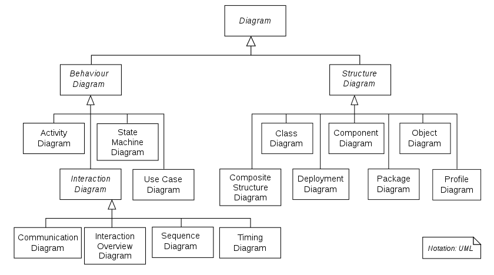

## <span style="color:red">*ООП*</span>

Объектно-ориентированное программирование (ООП) - это модель программирования программ с объектными концепциями, а также
абстрактный подход к разработке программ.



Три особенности объектно-ориентированного - инкапсуляция, наследование и полиморфизм

### Инкапсуляция

Инкапсулируйте объективные вещи в абстрактные классы, и классы могут использовать только свои собственные данные и
методы для доверенных классов или объектов для работы, и скрывать недоверенную информацию. Ключевые слова: public,
protected, private. Не пишите по умолчанию в private.

* `public` члены: могут быть доступны любой сущности
* `protected` члены: разрешено доступ только подклассам и функциям-членам этого класса
* `private` члены: доступны только функциям-членам, классам-друзьям или функциям-друзьям этого класса

### Наследование

* Базовый класс (родительский класс) ——&gt; производный класс (подкласс)

#### Полиморфизм

* Полиморфизм, то есть множественные состояния (формы). Проще говоря, мы можем определить полиморфизм как способность
  сообщения отображаться в нескольких формах.
* Полиморфизм основан на инкапсуляции и наследовании.
* Классификация и реализация полиморфизма C:
    1. Ad-hoc Полиморфизм (во время компиляции): перегрузка функций, перегрузка операторов
    2. Подтип Полиморфизма (во время выполнения): виртуальная функция
    3. Параметрический Полиморфизм (во время компиляции): шаблон класса, шаблон функции
    4. Принудительный Полиморфизм (компиляция / выполнение): базовое преобразование типов, пользовательское
       преобразование типов

> [Четыре Полиморфизма в C++](https://catonmat.net/cpp-polymorphism)

#### Статический полиморфизм (во время компиляции / раннее связывание)

Перегрузка функций

```c++
class A
{
public:
    void do(int a);
    void do(int a, int b);
};
```

#### Динамический полиморфизм (во время выполнения / позднее связывание)

* Виртуальные функции: украшают функции-члены виртуальными, чтобы сделать их виртуальными
* Динамическое связывание: динамическое связывание происходит, когда виртуальная функция вызывается с использованием
  ссылки или указателя на базовый класс

**заметка:**

* Вы можете присвоить объект производного класса указателю или ссылке базового класса, и наоборот
* Обычные функции (не функции-члены класса) не могут быть виртуальными функциями
* Статические функции (static) не могут быть виртуальными функциями
* Конструктор не может быть виртуальной функцией (потому что когда вызывается конструктор, указатель виртуальной таблицы
  не находится в пространстве памяти объекта, указатель виртуальной таблицы должен быть сформирован после вызова
  конструктора)
* Встроенная функция не может быть виртуальной функцией, когда она показывает полиморфизм. Для объяснения см.:Может ли
  виртуальная функция быть встроенной функцией?

    - <details><summary>Ответ:</summary>
       Виртуальная функция может быть объявлена как встроенная с помощью ключевого слова inline, но компилятор может проигнорировать это объявление. Виртуальные функции обычно не являются встроенными, потому что они используют механизм динамического связывания, который требует определения адреса функции во время выполнения. Встроенные функции, с другой стороны, вставляются непосредственно в точку вызова во время компиляции
      </details>

Демо динамического полиморфизма

```c++
class Shape                     // класс формы
{
public:
    virtual double calcArea()
    {
        ...
    }
    virtual ~Shape();
};
class Circle : public Shape     // класс круга
{
public:
    virtual double calcArea();
    ...
};
class Rect : public Shape       // класс прямоугольника
{
public:
    virtual double calcArea();
    ...
};
int main()
{
    Shape * shape1 = new Circle(4.0);
    Shape * shape2 = new Rect(5.0, 6.0);
    shape1->calcArea();         // вызов метода в классе круга
    shape2->calcArea();         // вызов метода в классе прямоугольника
    delete shape1;
    shape1 = nullptr;
    delete shape2;
    shape2 = nullptr;
    return 0;
}
```

### Виртуальный деструктор

Виртуальный деструктор - это для разрешения указателя базового класса на объект производного класса и удаления объекта
производного класса с помощью указателя базового класса.

Демо виртуального деструктора

```c++
class Shape
{
public:
    Shape();                    // Конструктор не может быть виртуальным
    virtual double calcArea();
    virtual ~Shape();           // виртуальный деструктор
};
class Circle : public Shape     // класс круга
{
public:
    virtual double calcArea();
    ...
};
int main()
{
    Shape * shape1 = new Circle(4.0);
    shape1->calcArea();    
    delete shape1;  // Поскольку у Shape есть виртуальный деструктор, когда delete удаляет память, он сначала вызывает деструктор подкласса, а затем деструктор базового класса, чтобы предотвратить утечки памяти.
    shape1 = NULL;
    return 0；
}
```

### Чистые виртуальные функции

Чистая виртуальная функция - это особый вид виртуальной функции. Вы не можете дать значимую реализацию виртуальной
функции в базовом классе. Вместо этого вы объявляете его как чистую виртуальную функцию. Его реализация оставлена для
производных классов базового класса.

```c++
virtual int A() = 0;
```

### Виртуальные функции и чисто виртуальные функции

* Если в классе объявлена виртуальная функция, она реализуется, даже если она пуста. Её роль заключается в том, чтобы
  позволить этой функции быть переопределенной в подклассах. Так компилятор может использовать позднее связывание для
  достижения полиморфизма. Чисто виртуальная функция — это всего лишь интерфейс. Это объявление функции. Её реализацию
  необходимо оставить в подклассе.
* Виртуальные функции не могут быть переопределены в подклассах, но чисто виртуальные функции должны быть реализованы в
  подклассах для создания экземпляров подклассов.
* Виртуальный класс используется для "наследования реализации". Наследование интерфейса также означает наследование
  реализации родительского класса. Чисто виртуальные функции сосредотачиваются на единообразии интерфейса, а реализация
  выполняется подклассами.
* Класс с чисто виртуальной функцией называется абстрактным классом. Этот класс не может напрямую создавать объекты. Он
  может быть использован только после наследования и переопределения его виртуальной функции. После наследования
  абстрактного класса подклассы могут оставаться абстрактными или стать обычными классами.
* Виртуальный базовый класс — это базовый класс в виртуальном наследовании, подробности см. ниже.

> [C++ и связь виртуальных функций и pure виртуальных функций](virtual_functs.md)

### Указатель на виртуальную функцию, таблица виртуальных функций

* Указатель на виртуальную функцию: В объекте, содержащем класс виртуальной функции, он указывает на таблицу виртуальных
  функций, которая определяется во время выполнения.
* Таблица виртуальных функций: в программе в разделе только для чтения данных (`.rodata section`,
  см.: [структура хранения объектного файла](https://blog.twofei.com/496/)) хранятся указатели на виртуальные функции.
  Если производный класс реализует виртуальную функцию базового класса, указатель на виртуальную функцию исходного
  базового класса перезаписывается в виртуальной таблице и создается в соответствии с объявлением класса на этапе
  компиляции.

> [Механизм реализации функции (таблицы) C++ и моделирование реализации на языке C](https://blog.twofei.com/496/)

### Виртуальное наследование

Виртуальное наследование используется для решения проблемы ромбовидного наследования в условиях множественного
наследования (тратится место хранения и возникает неоднозначность).

Принцип реализации на нижнем уровне связан с компилятором. Обычно он реализуется с помощью **указателя на виртуальный
базовый класс** и **таблицы виртуального базового класса**. Каждый подкласс, наследуемый виртуально, имеет указатель на
виртуальный базовый класс (занимает место хранения указателя, 4 байта) и таблицу виртуального базового класса (не
занимает место хранения объектов класса) (Следует подчеркнуть, что виртуальный базовый класс все равно будет иметь копию
в подклассе, но будет не более одной копии, а не внутри подкласса); когда подкласс виртуального наследования наследуется
в качестве родительского класса, указатель на виртуальный базовый класс также будет унаследован.

На самом деле, `vbptr` относится к указателю на виртуальную базовую таблицу. Этот указатель указывает на виртуальную
базовую таблицу. Виртуальная таблица записывает смещение адреса виртуального базового класса и этого класса. Смещение
адреса, чтобы были найдены члены виртуального базового класса, и виртуальное наследование не нужно поддерживать две
идентичные копии общего базового класса (виртуального базового класса), как это делается при обычном множественном
наследовании, экономя место хранения.

### Виртуальное наследование, виртуальные функции

* Сходства: Оба используют виртуальные указатели (оба занимают место в классе) и виртуальные таблицы (оба не занимают
  место в классе)
* Разница:
    * Виртуальное наследование
        * Виртуальный базовый класс все еще существует в наследуемом классе и занимает только место в памяти
        * Таблица виртуального базового класса хранит смещение виртуального базового класса относительно прямого
          наследуемого класса
    * Виртуальная функция
        * Виртуальные функции не занимают место в памяти
        * Таблица виртуальных функций хранит адрес виртуальной функции

### Шаблонные классы, шаблоны членов, виртуальные функции

* Виртуальные функции могут использоваться в шаблонных классах
* Шаблон члена класса (будь то обычный класс или шаблон класса) (это функция-член шаблона) не может быть виртуальной
  функцией

### Абстрактный класс, интерфейсный класс, агрегатный класс

* Абстрактный класс: класс, содержащий чистые виртуальные функции
* Интерфейсный класс: Абстрактный класс, содержащий только чистые виртуальные функции
* Агрегатные классы: Пользователи могут напрямую обращаться к их членам и имеют специальный синтаксис инициализации.
  Соответствуют следующим характеристикам:
    * Все члены являются общедоступными
    * Конструктор не определен
    * Нет инициализации в классе
    * Нет базового класса, нет виртуальной функции
