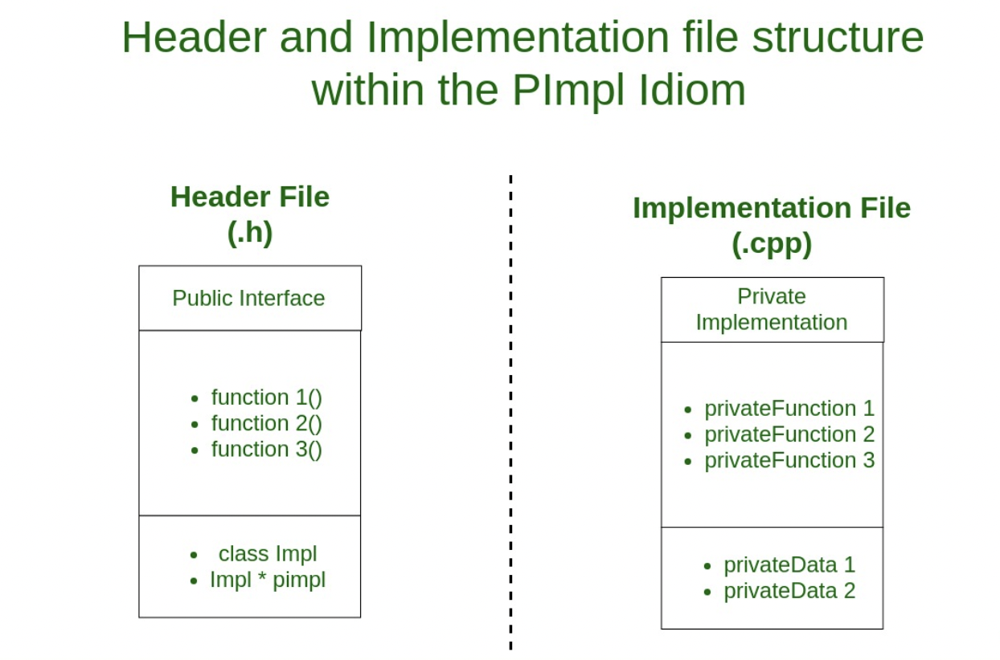
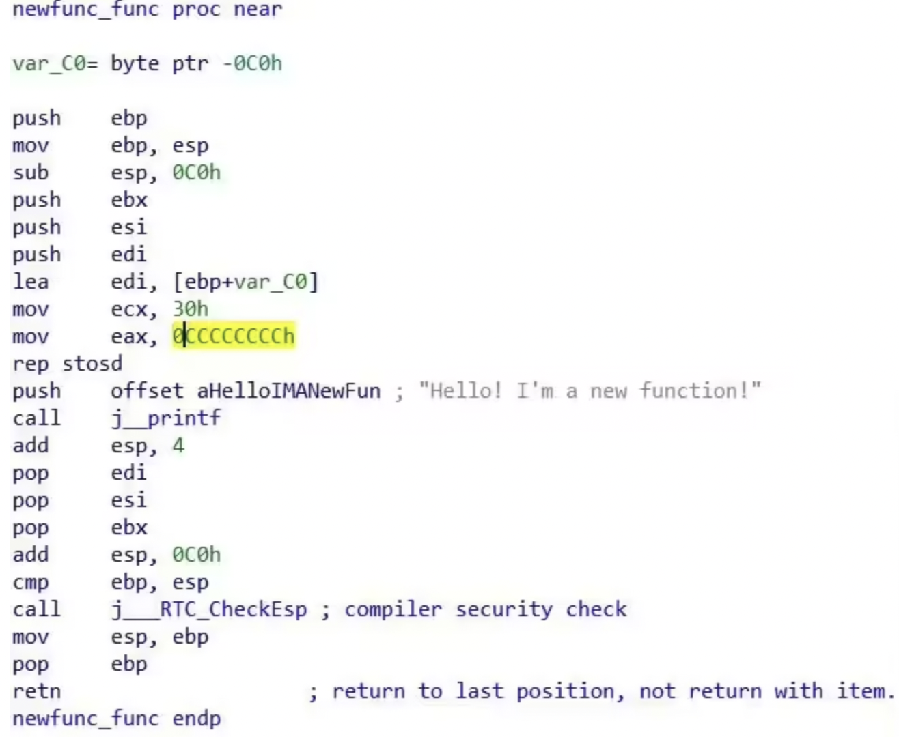
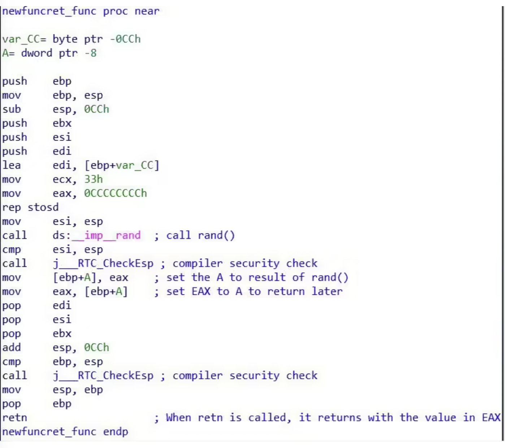
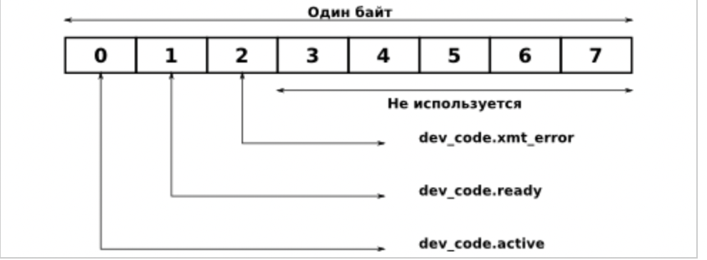
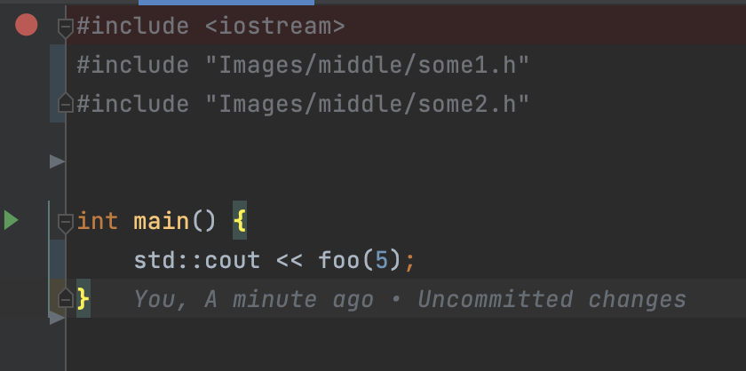
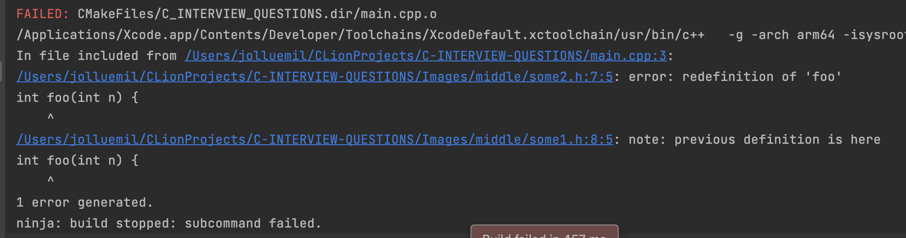

# Middle

- ## <span style="color:red">Общее</span>

  #### 1. Какие курсы прошли или книги прочитали за этот год? Чему научились?

    - <details><summary>Ответ:</summary>

        - Otus [C++ professional](https://otus.ru/lessons/cpp-specialization/)
        - intel [multithreading](https://www.intel.com/content/www/us/en/support/ru-banner-inside.html)
        - [coding-interview-university](https://github.com/jwasham/coding-interview-university)
        - [Algorithms](https://github.com/Jollu8/Algorithms)
        - [LeetCode](https://leetcode.com/)
    </details>

  ---

  #### 2. Что нравится и не нравится в С++? Чего не хватает?

    - <details><summary>Ответ:</summary>

        - likes
            - Smart pointers
            - Pointers
            - free memory
            - OOP
            - C++
            - Data race
            - STL
            - Algorithms
            - I love my life because of C++

        - Unlike
            - Pointers
            - C++
            - I hate my life because it has to do with C++
    </details>

  ---

  #### 3. Что интересного нашли в новых стандартах С++17, С++20 (конкретные фичи)?

    - <details><summary>Ответ:</summary>

        - C++17
            - Nested Namespaces
            - Variable declaration in if and switch
            - if constexpr statement
            - Structured bindings
            - Fold Expressions
            - Direct list initialization of enums

        - C++20
            - C++ Concepts library
            - 3-way comparisons
            - Map contains
            - Range-based for loop
            - New identifiers ( import, module)
            - Calendar and time zone library
            - std::string functions
            - Array bounded/unbounded
            - std::to_array
            - Likely and unlikely attributes
    </details>

  ---

  #### 4. Расскажите о фичах, которые появились в разных версиях языка.

    - <details><summary>Ответ:</summary>

        - C++ best [futures](https://en.cppreference.com/w/cpp/standard_library)
    </details>

  ---

  #### 5. Расскажите о модели памяти, которая появилась в С++11 стандарте.

    - <details><summary>Ответ:</summary>

        - Модель памяти была разработана для C++11 и принята C11. Лоуренс Кроул проделал большую работу, чтобы интерфейс
          для атомарных операций был как можно ближе.
        - ##### Модель памяти С++ 11
            - Модель памяти, также известная как модель согласованности памяти, представляет собой спецификацию
              допустимого поведения многопоточных программ, выполняющихся с общей памятью. Самой базовой моделью
              является последовательная согласованность (SC), где все инструкции из всех потоков (кажутся) формируют
              общий порядок, который согласуется с порядком программы в каждом потоке.

            - Одной из наиболее важных особенностей C++11 является предоставление модели памяти с поддержкой
              многопоточности, которая позволяет писать многопоточные программы, не полагаясь на расширения для
              конкретной платформы.
            - Sequential consistency
                - SC означает, что все потоки соглашаются с порядком выполнения операций с памятью, и этот порядок
                  согласуется с порядком операций в исходном коде программы.
                - Некоторые языки программирования предлагают SC в многопроцессорной среде. В C++11 вы можете объявить
                  все общие переменные как атомарные типы C++11 с ограничениями порядка использования памяти по
                  умолчанию. В Java вы можете пометить все общие переменные как volatile[ 1 ] [ 2 ].
                - Компилятор вставляет дополнительные инструкции за кулисами, например, ограничения памяти, чтобы
                  обеспечить соблюдение порядка.

                ```c++
                std::atomic<int> x(0), y(0);
                //thread1
                x = 1;
                //thread2
                y = 1;
                //thread3
                if(x==1 && y==0)
                    print ("x first");
                //thread4
                if(y==1 && x==0)
                    print ("y first");
                // Атомарные типы C++11 гарантируют SC, поэтому для вывода обоих сообщений требуется impsbl.
                ```
                - [1. Последовательная согласованность_1](http://bartoszmilewski.com/2008/11/11/who-ordered-sequential-consistency/)
                - [2. Последовательная согласованность_2](http://preshing.com/20120612/an-introduction-to-lock-free-programming/#sequential-consistency)
            - Concurrency needs sync
                - Для повышения производительности современные процессоры часто выполняют инструкции не по порядку,
                  чтобы полностью использовать ресурсы. Поскольку аппаратное обеспечение обеспечивает целостность
                  инструкций, мы никогда не заметим этого при выполнении одного потока. Однако для нескольких потоков
                  это может привести к непредсказуемому поведению.
                - При многопоточном выполнении неконтролируемое планирование приводит к гонке данных, где результаты
                  зависят от времени выполнения кода. При некотором невезении (например, при переключении контекста в
                  несвоевременные моменты выполнения) мы получаем неверный результат.
                - (i) взаимное исключение ( атомарное )
                - Для достижения атомарности мы можем запросить у аппаратного обеспечения несколько полезных инструкций
                  для построения взаимного исключения, которое гарантирует, что если один поток выполняется в
                  критической секции, другие не смогут этого сделать.
                - (ii) ожидание другого ( условная переменная)
                - Во многих случаях поток продолжает свое выполнение только при выполнении некоторого условия. Таким
                  образом, один поток должен ждать, пока другой завершит какое-либо действие, прежде чем
                  продолжить.
                - [1. Потоки OSTEP](http://pages.cs.wisc.edu/~remzi/OSTEP/threads-intro.pdf)
                - [2. Условная переменная OSTEP](http://pages.cs.wisc.edu/~remzi/OSTEP/threads-cv.pdf)
                - [3. Условная переменная Wiki](http://en.cppreference.com/w/cpp/thread/condition_variable)
                - [4. Ограждение памяти](http://stackoverflow.com/questions/286629/what-is-a-memory-fence)
            - Memory ordering is crucial
                - Порядок операций с памятью в системе по умолчанию очень расслаблен, и ЦП имеет большую свободу
                  переупорядочивать операции, и компиляторы также могут располагать инструкции, которые он выдает, в
                  любом порядке, который им нравится, при условии, что это не влияет на очевидную работу программы.
                - В многопоточном сценарии, чтобы избежать условий гонки, следует применять порядок доступа из разных
                  потоков.
                - (i) Ограниченные гарантии ЦП
                  на любом ЦП зависимые обращения к памяти будут выполняться по порядку;
                  перекрывающиеся загрузки и сохранения внутри определенного ЦП будут казаться упорядоченными внутри
                  этого ЦП;
                  перекрывающиеся обращения к памяти могут быть объединены или отброшены.
                  (ii) преобразование кода
                  ЦП и другие устройства в системе могут использовать различные приемы для повышения производительности,
                  включая переупорядочивание, отсрочку и комбинацию операций с памятью; спекулятивные нагрузки;
                  спекулятивное предсказание переходов и различные виды кэширования.
                - оптимизация компилятора
                  что знает компилятор
                  --> все операции с памятью в этом потоке и что именно они делают, включая зависимости данных;
                  --> как быть достаточно консервативным перед лицом псевдонимов psbl
                  что не знает
                  --> какие ячейки памяти являются "изменяемыми общими" переменными и могут изменяться асинхронно из-за
                  операции с памятью
                  в другом потоке
                  --> как быть достаточно консервативным перед лицом совместного использования psbl
                  решение: скажите --> каким-то образом определите операции над "изменяемыми общими" локациями
                  Независимые операции с памятью эффективно выполняются в случайном порядке, но это может быть проблемой
                  для
                  взаимодействия CPU-CPU и для ввода-вывода, и, следовательно, нам нужен порядок.
                - (iii) заказ является контрактом
                  Вы обещаете: правильно синхронизировать вашу программу (без условий гонки)
                  «Система» обещает: обеспечить иллюзию выполнения написанной вами программы
            - Ordering techniques
                - Чтобы гарантировать SC, вы должны подумать, как предотвратить переупорядочивание памяти. Пути могут
                  быть облегченной синхронизацией или ограждением, полным ограждением или семантикой
                  приобретения/освобождения .
                - Хранилище выпуска делает свои предыдущие доступы видимыми для потока, выполняющего загрузку, который
                  видит (сопряжение) с этим хранилищем.
                - Автоматизация получения и выпуска:
                  --> не пишите заборы вручную.
                  --> заставьте компилятор писать барьеры для вас, используя абстракции «критической области»: мьютексы
                  и переменные std::
                  atomic<> .
                - (i) #1: используйте мьютексы
                  используйте блокировки мьютекса для защиты кода, который читает/записывает общие переменные.
                  Плюсы:
                  Минусы: требует осторожности при каждом использовании общих переменных.
                - ```c++
                  //Lock acquire/release:
                  mut_x.lock(); //"acquire" mut_x ==> ld.acq mut_x
                  ... read/write x ...
                  mut_x.unlock(); //"release" mut_x ==> st.rel mut_x
                  ```
                - (ii) #2: std::atomic<>
                  специальные атомарные типы автоматически защищены от переупорядочения.
                  Плюсы: просто пометьте переменную, а не везде, где она используется. Минусы: написать правильный
                  атомарный код сложнее, чем кажется.
                - ```c++
                  std::atomics: read=acquire, write=release
                  while(whose_turn != me){} //read whose_turn ==> ld.acq whose_turn
                  ... read/write x ...
                  whose_turn = someone_else; //write whose_turn ==> st.rel whose_turn
                  ```
                - (iii) #3: заборы и заказанные API
                  Ограждение/барьер памяти — это класс инструкций, обеспечивающих загрузку/сохранение памяти в ожидаемом
                  порядке. В
                  отличие от мьютексов высокого уровня и атомарных объектов, ограничения памяти зависят от аппаратного
                  обеспечения.

                - Свободное от
                    - блокировок программирование Свободная от блокировок программа никогда не может быть полностью
                      остановлена ​​ни одним
                      потоком. Полная «блокировка» может быть любой, например, тупиковой, живой или даже злонамеренной
                      диспетчерской.

                - [1. Последовательная согласованность](http://preshing.com/20120612/an-introduction-to-lock-free-programming/#sequential-consistency)
                - [2. Блокировка свободного программирования](http://stackoverflow.com/questions/14011849/lock-free-multithreaded-programming)
                - [3. Получение и освобождение семантики](http://preshing.com/20120913/acquire-and-release-semantics/)
            - Object layout
                - Все данные в программе C++ состоят из объектов, каждый из которых представляет собой «область
                  хранения».
                  Объекты могут быть простого фундаментального типа, такого как int или float, а также могут быть
                  экземплярами определяемых пользователем классов.
                  Независимо от типа объект хранится в одной или нескольких ячейках памяти. Каждая такая ячейка памяти
                  является либо объектом (или подобъектом) скалярного типа, например, short или my_class*, либо
                  последовательностью смежных.
                - Каждая переменная является объектом, включая те, которые являются членами других объектов.
                  Каждый объект занимает как минимум одну ячейку памяти.
                  Переменные фундаментального типа (например, int или char ) представляют собой точно одну ячейку
                  памяти, независимо от их размера, даже если они являются смежными или являются частью массива.
                  Смежные битовые поля являются частью одной и той же ячейки памяти.
                  Учитывая две глобальные переменные char c и char d :
                - ```c++
                  //Thread 1
                  { lock_guard<mutex> lock(cMutex);
                      c = 1;
                  }
                  //Thread 2
                  { lock_guard<mutex> lock(dMutex);
                      d = 1;
                  }
                  ```
                - В идеальном C++11 нет расы, но в реальной жизни это psbl (например, и смежные битовые поля как один
                  объект):
                - ```c++
                  //system lays out c then d contiguously
                  char tmp[4]; //32-bit scratchpad
                  memcpy(&tmp[0], &c, 4); //read 32b starting at c
                  tmp[1] = 1; //set only bits of d
                  memcpy(&c, &temp[0], 4); //write 32 bits back
                  //thread 2 sliently also write to c without holding cMutex
                  ```
              [1. Битовое поле](http://en.cppreference.com/w/cpp/language/bit_field)
              [2. Ложное совместное использование](https://software.intel.com/en-us/articles/avoiding-and-identifying-false-sharing-among-threads)
                - Спекуляция и размещение реестра
                    - предположение:
                      система (компилятор, ЦП, кеш, ...) предполагает, что условие может быть истинным (например,
                      предсказание ветвления),
                      или имеет основания полагать, что условие часто верно (например, оно было истинным последние 100
                      раз). мы выполнили
                      этот код)
                      Чтобы сэкономить время, мы можем оптимистично начать дальнейшее выполнение, основываясь на этом
                      предположении. Если
                      это правильно, мы сэкономили время. Если это неправильно, мы должны отменить любую спекулятивную
                      работу.
                    - ```c++
                      if(cond)    | {
                           lock x | unique_lock<mutex> hold(mut, defer_lock)
                              ... | if(cond)
                      if(cond)    | hold.lock();
                            use x | ...
                              ... | if(cond)
                      if(cond)    | use x
                         unlock x | ...
                                  | }//as-if "if(cond) hold.unlock()"
                      ```
                    - Приведенный выше общий шаблон безопасен для MM C++11. Но остерегайтесь ошибок компилятора...
                    - ```c++
                      //x is a shared var
                      if(cond)
                      x = 42;
                      //cond is speculated to be true, rewrite code
                      r1 = x; //read what's there
                      x = 42; //oops: optimistic write is NOT conditional
                      if(!cond) //check if we guessed wrong
                      x = r1; //oops: back-out write is NOT sc
                - размещение регистра
                - условные блокировки :
                  --> Проблема: ваш код использует блокировку по условию, но в вашей системе есть ошибка, которая
                  изменяет условную
                  запись на безусловную.
            - C++11 techniques
                - (i) std::lock_guard
                  Класс lock_guard — это оболочка мьютекса, предоставляющая удобный механизм в стиле RAII для владения
                  мьютексом на время действия блока с областью действия.
                  Когда создается объект защиты блокировки, он пытается завладеть предоставленным ему мьютексом. Когда
                  управление покидает область, в которой был создан объект защиты блокировки, блокировка_защиты
                  разрушается, а мьютекс освобождается.
                - ```c++
                  #include <thread>
                  #include <mutex>
                  #include <iostream>
    
                  int g_i = 0;
                  std::mutex g_i_mutex; //protects g_i
    
                  void safe_incremenet(){
                      std::lock_guard<std::mutex> lock(g_i_mutex);
                      ++g_i;
                      std::cout << std::this_thread::get_id() << ":" << g_i << '\n';
     
                      //g_i_mutex is automatically released when lock goes out of scope
                  }
    
                  int main(){
                      std::cout << __func__ << ": " << g_i << '\n';
                      std::thread t1(safe_increment);
                      std::thread t2(safe_increment); 
                      t1.join();
                      t2.join(); 
                      std::cout << __func__ << ": " << g_i << '\n';
                  }
                  ```
                - (ii) Используйте std::atomic для параллелизма
                  Экземпляры шаблона std::atomic предлагают операции, которые гарантированно будут восприниматься
                  другими потоками как атомарные. После создания объекта std::atomic операции над ним ведут себя так,
                  как если бы они находились внутри критической секции, защищенной мьютексом, но операции обычно
                  реализуются с использованием специальных машинных инструкций, которые более эффективны, чем в случае,
                  если бы мьютекс был занят.
                - ```c++
                  std::atomic<int> ai(0); //init ai to 0
                  ai = 10; //atomically set AI to 10
                  std::cout << ai; //atomically read AI's value
                  ++ai; //atomically increment ai to 11
                  --ai; //atomically decrement ai to 10
                  ```
                - Во время выполнения этих операторов другие потоки, читающие ai, могут видеть только значения 0, 10 или
                    11. Никакие
                        другие значения невозможны (предположим, что это единственный поток, изменяющий ai).
                - std::atomic гарантирует только то, что чтение ai является атомарным, но не гарантирует, что весь
                  оператор будет
                  выполняться атомарно.
                - Между моментом чтения значения ai и вызовом оператора << для записи в стандартный вывод другой поток
                  мог изменить
                  значение ai.
                - после создания объекта std::atomic все его функции-члены, в том числе содержащие операции RMW,
                  гарантированно будут
                  восприниматься другими потоками как атомарные.
            - (iii) Непереносимые функции по своей сути
              Для поддержки низкоуровневого программирования C++ определяет некоторые функции, зависящие от машины.
                - Битовые поля
                  Битовое поле содержит определенное количество битов, а структура памяти битового поля зависит от
                  машины.
                - volatile
                  Ключевое слово volatile указывает компилятору, что он не должен выполнять оптимизацию таких объектов.
            - потоки С++
                - (1) Управление потоками
                - (i) базовое управление
                  detach thread
                  отсоединяет поток, представленный объектом, от вызывающего потока, позволяя им выполняться независимо
                  друг от друга.
                  Оба потока продолжают работать без блокировки и синхронизации.
                  Когда любой из них завершает выполнение, его ресурсы освобождаются.

                - Вызов detach() для объекта потока оставляет поток работать в фоновом режиме, и к нему больше нельзя
                  присоединиться.

                - join thread
                  Функция возвращается после завершения выполнения потока.

                - передача владения потоком std::thread t2=std::move(t1)

                - [1 Отделение нити](http://www.cplusplus.com/reference/thread/thread/detach/)
                - [2 Соединение нити](http://www.cplusplus.com/reference/thread/thread/join/)
                - ```c++
                  //compile: -std=c++0x -pthread
                  //the func we want to execute on the new thread
                  void task1(string msg){
                      cout << "task1 says: " << msg;
                  }

                  int main(){
                      //constructs the new thread and runs it
                      //form: thread(Function&& f, Args&&... args);
                      thread t1(task1, "Hello");

                      //makes the main thread wait for the new thread to finish, then continue
                      t1.join();
                  }
                  ```
                - ```c++
                  void pause_thread(int n){
                      std::this_thread::sleep_for (std::chrono::seconds(n));
                      std::cout << "pause of " << n << " seconds ended\n";
                  }

                  int main(){
                      std::cout << "spawning and detaching 3 threads ...\n";
                      std::thread(pause_thread, 1).detach();
                      std::thread(pause_thread, 2).detach();
                      std::thread(pause_thread, 3).detach();

                      std::cout << "Done spawning thread.\n";
                      //give the detached threads time to finish, but no guarantee
                      pause_thread(5);
                      return 0;
                  }
                  ```
    </details>

  ---

  #### 6. Что такое сериализация? Какие библиотеки знаете?

    - <details><summary>Ответ:</summary>

        - [Сериализация](https://habr.com/ru/post/479462/) — процесс перевода структуры данных в последовательность
          байтов. Обратной к операции сериализации
          является операция десериализации — создание структуры данных из битовой последовательности. Сериализация
          используется для передачи объектов по сети и для сохранения их в файлы.

    </details>

  ---

  #### 7. Какие знаете паттерны проектирования?

    - <details><summary>Ответ:</summary>

        - Ссылка на [материал](https://cpphinditutorials.com/dev-cpp/16-basic-patterns-programs-in-cpp/)
        - [GoF](http://www.dre.vanderbilt.edu/~schmidt/qualcomm/GoF-patterns.html)
    </details>

  ---  

  #### 8. Что такое операционная система? Какие существуют типы по назначению?

    - <details><summary>Ответ:</summary>

      OS [wiki](https://en.wikipedia.org/wiki/Operating_system)
    </details>

  --- 

  #### 9. Назвать основные составляющие и принципы работы ОС Linux в качестве примера системы общего назначения.

    - <details><summary>Ответ:</summary>

      5 основных принципов безопасности системы Linux
      До сих пор часто люди не знают, с чего начать, когда дело доходит до информационной безопасности. С помощью 5
      основных принципов мы можем улучшить безопасность системы Linux и задаться вопросом, достаточно ли мы сделали.

        1. Знайте свою систему (системы)
           Первый принцип заключается в том, чтобы знать, что должна делать ваша система. Какова его основная роль,
           какие
           программные пакеты ему нужны и кому нужен доступ?
           Зная роль системы, вы сможете лучше защитить ее от известных и неизвестных угроз.
           ##### Меры безопасности:
            - Политика паролей
            - Надлежащее управление исправлениями программного обеспечения
            - Управление конфигурацией
            - Документация
        2. Наименьшее количество привилегий
           Каждый запущенный процесс или установленный пакет может стать целью. Специалисты по безопасности называют это
           «поверхностью атаки». Что вам нужно, так это свести к минимуму эту поверхность атаки, удалив ненужные
           компоненты,
           ограничив доступ и по умолчанию используя стратегию «запретить, если только». Последнее означает, что доступ
           по
           умолчанию заблокирован, если вы его не разрешите (внесение в белый список).
           ##### Меры безопасности:
            - Использовать минимальную/базовую установку
              Разрешайте доступ только тем, кто действительно в этом нуждается
        3. Выполняйте глубокую защиту,
           защитите систему, применяя несколько уровней безопасности. Этот принцип называется «защита в глубину» и его
           можно
           сравнить с луковицей: чтобы добраться до сердцевины, нужно чистить слой за слоем. Одна сломанная защита может
           помочь
           нам защититься от полной компрометации.
           ##### Меры безопасности:
            - IP-таблицы/Nftables
            - Усиление программных компонентов
        4. Защита — это ключ, обнаружение — необходимость
           Безопасность фокусируется на защите активов. Хотя это основная цель, мы должны учитывать, что однажды наша
           защита
           будет сломана. Поэтому мы хотим узнать это как можно скорее, чтобы мы могли правильно действовать. Здесь
           связаны оба
           принципа 3 и 4. Установите надлежащие методы обнаружения, подобные растяжкам, используемым военными.
           ##### Меры безопасности:
            - Фреймворк аудита Linux
            - Удаленное ведение журнала
            - Создавайте резервные копии и тестируйте их
        5. Знай своего врага
           Вы можете правильно защитить систему только в том случае, если знаете, с какими угрозами вы сталкиваетесь.
           Почему эта
           система должна быть целью и кто будет нацеливаться на нее? Проведите анализ рисков и определите, каким
           потенциальным
           угрозам может подвергнуться ваша система.
           ##### Меры безопасности:
            - Сканирование уязвимостей
            - Тесты на проникновение
            - Анализ риска

        - [materials](https://slidetodoc.com/the-linux-system-design-principles-design-principles-linux/)
    </details>

  ---

  #### 10 Что такое SFINAE и PIMPL?

    - <details><summary>Ответ:</summary>

        - SFINAE
            - SFINAE расшифровывается как Substitution Failure Is Not An Error. _ __Плохо сформированный код,
              возникающий в результате подстановки типов (или значений) для создания экземпляра шаблона функции или
              шаблона класса, не является серьезной ошибкой компиляции, он рассматривается только как ошибка вывода.
            - Неудачи вывода при создании экземпляров шаблонов функций или специализаций шаблонов классов удаляют этого
              кандидата из множества рассматриваемых, как если бы этот неудачный кандидат не существовал с самого
              начала.
            - ```c++
              template <class T>
              auto begin(T& c) -> decltype(c.begin()) { return c.begin(); }
              template <class T, size_t N>
              T* begin(T (&arr)[N]) { return arr; } 
              int vals[10];
              begin(vals); // OK. The first function template substitution fails because
                           // vals.begin() is ill-formed. This is not an error! That function
                           // is just removed from consideration as a viable overload candidate,
                           // leaving us with the array overload.
              ```
            - Только ошибки замены в непосредственном контексте считаются ошибками дедукции, все остальные считаются
              серьезными ошибками.
            - ```c++
              template <class T>
              void add_one(T& val) { val += 1; }
              int i = 4;
              add_one(i); // ok
              std::string msg = "Hello";
              add_one(msg); // error. msg += 1 is ill-formed for std::string, but this
                            // failure is NOT in the immediate context of substituting T
              ```
        - PIMPLS
            - Когда в заголовочный файл вносятся изменения, все исходники, включая его, необходимо перекомпилировать. В
              больших проектах и библиотеках это может вызвать проблемы со временем сборки из-за того, что даже при
              внесении небольшого изменения в реализацию всем приходится ждать некоторое время, пока они не скомпилируют
              свой код. Один из способов решить эту проблему — использовать PImpl Idiom, который скрывает реализацию в
              заголовках и включает файл интерфейса, который компилируется мгновенно.
            - Идиома PImpl (указатель на IMPLementation) — это метод, используемый для отделения реализации от
              интерфейса. Он сводит к минимуму раскрытие заголовков и помогает программистам уменьшить количество
              зависимостей при сборке за счет перемещения закрытых данных-членов в отдельный класс и доступа к ним через
              непрозрачный указатель.
            - 
            - Как реализовать:
                1. Создайте отдельный класс (или структуру) для реализации
                2. Поместите все частные члены из заголовка в этот класс.
                3. Определите класс реализации (Impl) в файле заголовка.
                4. В заголовочном файле создайте предварительное объявление (указатель) , указывающее на класс
                   реализации.
                5. Определите деструктор и операторы копирования /присваивания .
            - Причина явного объявления деструктора заключается в том, что при компиляции интеллектуальный указатель (
              std::unique_ptr ) проверяет, существует ли в определении типа видимый деструктор, и выдает ошибку
              компиляции, если он объявлен только вперед.
            - Использование интеллектуального указателя является лучшим подходом, поскольку указатель берет на себя
              управление жизненным циклом PImpl.

        - ##### Пример:
            - Определение класса во включенном заголовочном файле является общедоступным интерфейсом класса.
            - Мы определяем уникальный указатель вместо необработанного, поскольку за время жизни объекта отвечает
              объект интерфейсного типа.
            - Поскольку std::unique_ptr является полным типом, для завершения класса реализации требуется
              объявленный пользователем деструктор и операторы копирования/присваивания.
            - Подход pimpl прозрачен с точки зрения пользователя. Внутренние изменения, внесенные в структуру
              IMPLementation, влияют только на содержащий ее файл (User.cpp) . Это означает, что пользователю не
              нужно перекомпилировать, чтобы применить эти изменения.

            ```c++
                /* |INTERFACE| User.h file */

                #pragma once
                #include <memory> // PImpl
                #include <string>
                using namespace std;

                class User {
                public:
                // Constructor and Destructors
                    ~User();
                    User(string name);
                    // Assignment Operator and Copy Constructor
                    User(const User& other);
                    User& operator=(User rhs);
                    // Getter
                    int getSalary();
                    // Setter
                    void setSalary(int);
                private:
                // Internal implementation class
                class Impl;
                // Pointer to the internal implementation
                unique_ptr<Impl> pimpl;
                };
            ```

            ```c++
                  /* |IMPLEMENTATION| User.cpp file */
                  #include "User.h"
                  #include <iostream>
                  using namespace std;
                  struct User::Impl {
                      Impl(string name) : name(move(name)){};
                      ~Impl();
                      void welcomeMessage()
                      {
                          cout << "Welcome, " << name << endl;
                      }
                      string name;
                      int salary = -1;
                      };
                      // Constructor connected with our Impl structure
                      User::User(string name) : pimpl(new Impl(move(name)))
                      {
                          pimpl->welcomeMessage();
                      }
                      // Default Constructor
                      User::~User() = default;
                      // Assignment operator and Copy constructor
                      User::User(const User& other) : pimpl(new Impl(*other.pimpl))
                      {
                      }
                      User& User::operator=(User rhs)
                      {
                          swap(pimpl, rhs.pimpl);
                          return *this;
                      }
                      // Getter and setter
                      int User::getSalary()
                      {
                          return pimpl->salary;
                      }
                      void User::setSalary(int salary)
                      {
                          pimpl->salary = salary;
                          cout << "Salary set to "
                              << salary << endl;
                      }
           ```

            - Преимущества PIMPl:
              Двоичная совместимость: двоичный интерфейс не зависит от приватных полей. Внесение изменений в
              реализацию
              не нарушит зависимый код.
              Время компиляции: время компиляции сокращается из-за того, что нужно пересобирать только файл
              реализации
              вместо того, чтобы каждый клиент перекомпилировал свой файл.
              Скрытие данных: можно легко скрыть определенные внутренние детали, такие как методы реализации и
              другие
              библиотеки, используемые для реализации общедоступного интерфейса.
              Недостатки PImpl:

            - Управление памятью: возможное увеличение использования памяти из-за большего выделения памяти, чем
              со
              структурой по
              умолчанию, что может иметь решающее значение при разработке встроенного программного обеспечения.
              Усилия по обслуживанию: обслуживание становится более сложным из-за дополнительного класса для
              использования pimpl и
              дополнительной косвенности указателя (Интерфейс можно использовать только через указатель/ссылку)
              .
              Наследование : Скрытая реализация не может быть унаследована, хотя класс PImpl может
    </details>

  ---

  #### 11. Назовите порождающие, структурные и поведенческие паттерны программирования и приведите примеры их использования.

    - <details><summary>Ответ:</summary>

        - ###### ПОРОЖДАЮЩИЕ ПАТТЕРНЫ
            - Согласно Википедии, порождающие шаблоны (creational patterns) — шаблоны проектирования, которые позволяют
              сделать систему независимой от способа создания, композиции и представления объектов.
            - Проще говоря, порождающие паттерны предназначены для создания экземпляра объекта или группы связанных
              объектов. К ним относятся:

            1. Singleton, или Одиночка
            2. Builder, или Строитель
            3. Factory Method, или Фабричный метод
            4. Prototype, или Прототип
            5. Abstract Factory, или Абстрактная фабрика

        - ##### Структурные паттерны
            - Структурные паттерны рассматривают вопросы о компоновке системы на основе классов и объектов. При этом
              могут использоваться следующие механизмы:
                - Наследование, когда базовый класс определяет интерфейс, а подклассы - реализацию. Структуры на основе
                  наследования получаются статичными.
                - Композиция, когда структуры строятся путем объединения объектов некоторых классов. Композиция
                  позволяет получать структуры, которые можно изменять во время выполнения.
                  Кратко рассмотрим особенности структрурных паттернов (шаблонов).

            1. Паттерн Adapter представляет собой программную обертку над уже существующими классами и предназначен для
               преобразования
               их интерфейсов к виду, пригодному для последующего использования в новом программном проекте.

            2. Паттерн Bridge отделяет абстракцию от реализации так, что то и другое можно изменять независимо.

            3. Паттерн Composite группирует схожие объекты в древовидные структуры. Рассматривает единообразно простые и
               сложные
               объекты.

            4. Паттерн Decorator используется для расширения функциональности объектов. Являясь гибкой альтернативой
               порождению
               классов, паттерн Decorator динамически добавляет объекту новые обязанности.

            5. Паттерн Facade предоставляет высокоуровневый унифицированный интерфейс к набору интерфейсов некоторой
               подсистемы, что
               облегчает ее использование.

            6. Паттерн Flyweight использует разделение для эффективной поддержки множества объектов.

            7. Паттерн Proxy замещает другой объект для контроля доступа к нему.

        - ##### ПОВЕДЕНЧЕСКИЕ ПАТТЕРНЫ
            - Согласно Википедии, поведенческие шаблоны (behavioral patterns) — шаблоны проектирования, определяющие
              алгоритмы и способы реализации взаимодействия различных объектов и классов.
            - Проще говоря, поведенческие паттерны связаны с распределением обязанностей между объектами и описывают
              структуру и шаблоны для передачи сообщений / связи между компонентами.
            - К ним относятся:
                - Template Method, или Шаблонный метод;
                - Iterator, или Итератор;
                - Observer, или Наблюдатель;
                - Chain of Responsibility, или Цепочка обязанностей;
                - Command, или Команда;
                - Mediator, или Посредник;
                - Memento, или Хранитель;
                - Visitor, или Посетитель;
                - Strategy, или Стратегия;
                - State, или Состояние.
    </details>

---

- ## <span style="color:red">Препроцессор и компиляция</span>

  #### 12. Расскажите о системах автоматизации билд-процесса.

    - <details><summary>Ответ:</summary>

        - [подробно](https://www.softwaretestinghelp.com/best-build-automation-software-tools/)
    </details>

  ---

  #### 13. Какая разница между статической и динамической библиотеками?

    - <details><summary>Ответ:</summary>

        - Библиотека динамической компоновки позволяет исполняемому модулю включать только ту информацию, которая
          необходима во время выполнения для поиска исполняемого кода для функции DLL. Все необходимые функции
          загружаются во время выполнения в зависимости от требований. Он будет отображаться на адрес DLL. Динамическая
          связанная библиотека также зависит от распространяемого MFC. Потому что он загружается только во время
          выполнения.

        - Статическая библиотека получает все указанные функции из библиотеки статической ссылки и помещает их вместе с
          вашим кодом в исполняемый файл. Таким образом, размер файла будет больше, чем у динамически связанной
          библиотеки. Но статическая связанная библиотека не будет зависеть ни от каких других DLL
     </details>

  ---

  #### 14. Какая разница между исполнительным файлом и динамической библиотекой?

    - <details><summary>Ответ:</summary>

        - Основное различие между EXE и DLL заключается в том, что файлы EXE могут выполняться с помощью операционной
          системы. Им не нужно какое-либо другое приложение для запуска. DLL-файлы, с другой стороны, не являются
          независимыми для запуска. Для их выполнения требуется EXE-файл.

     </details>

  ---

  #### 15. Что такое DLL hell?

    - <details><summary>Ответ:</summary>

        - [Когда приложение](https://en.wikipedia.org/wiki/DLL_Hell) А устанавливает общую библиотеку DLL версии 1.0,
          приходит приложение Б и обновляет общую библиотеку библиотеки до версии 1.1, которая должна быть совместима,
          но поведение немного отличается, затем приложение А перестает работать правильно и переустанавливает версию
          1.0, затем приложение Б останавливается. работает ... теперь представьте себе это с более чем 2 приложениями,
          скажем, дюжиной: `DLL Hell`.
    </details>

  ---

  #### 16. Что такое флажки компиляции (fPIC)?

    - <details><summary>Ответ:</summary>

        - Это `f` префикс `gcc` для параметров, которые «управляют соглашениями об интерфейсе, используемыми при
          генерации кода».
          Расшифровывается как  `PICPosition Independent Code`, это специализация `fpic` для m68K и SPARC.
          Изменить: после
          прочтения [11-й страницы документа, на который ссылается 0x6adb015](https://www.akkadia.org/drepper/dsohowto.pdf)
          Этот параметр имеет смысл только для общих библиотек, и вы сообщаете ОС, что используете глобальную таблицу
          смещения,
        - `GOT`. Это означает, что все ваши ссылки на адреса относятся к GOT, а код может использоваться несколькими
          процессами.
          В противном случае без этой опции загрузчику пришлось бы самому модифицировать все смещения.
          Излишне говорить, что мы почти всегда используем -fpic/PIC.
        - `man gcc`
            - ```
              -fpic
               Сгенерируйте позиционно-независимый код (PIC), пригодный для использования в совместно используемом
               библиотека, если она поддерживается для целевой машины. Такой код обращается ко всем
               постоянные адреса через глобальную таблицу смещений (GOT). Динамика
               загрузчик разрешает записи GOT при запуске программы (динамический
               загрузчик не является частью GCC; это часть операционной системы). Если
               размер GOT для связанного исполняемого файла превышает машинно-зависимый размер
               максимальный размер, вы получите сообщение об ошибке от компоновщика, указывающее
               что -fpic не работает; в этом случае перекомпилируйте с параметром -fPIC.
               (Эти максимальные значения составляют 8 тыс. для SPARC и 32 тыс. для m68k и RS/6000.
               У 386 такого ограничения нет.)

               Позиционно-независимый код требует специальной поддержки, и поэтому
               работает только на определенных машинах. Для 386 GCC поддерживает PIC для
               System V, но не для Sun 386i. Код, сгенерированный для
               IBM RS/6000 всегда не зависит от позиции.

               -fPIC
                Если поддерживается для целевой машины, сгенерируйте позиционно-независимый код,
                подходит для динамического связывания и позволяет избежать каких-либо ограничений на размер
                глобальная таблица смещений. Эта опция имеет значение на m68k
                и Spark.

                Позиционно-независимый код требует специальной поддержки, и поэтому
                работает только на определенных машинах.
                ```
    </details>

  ---

  #### 17. В чем разница между дебаженной и релизной сборкой?

    - <details><summary>Ответ:</summary>

        - Самое главное, что в режиме Debug нет оптимизаций, а в режиме Release оптимизации есть. Это важно, потому что
          компилятор очень продвинутый и может сделать довольно хитрое низкоуровневое улучшение вашего кода. В
          результате некоторые строки вашего кода могут остаться вообще без каких-либо инструкций, а некоторые могут
          быть перепутаны. Пошаговая отладка была бы невозможна. Кроме того, локальные переменные часто оптимизируются
          таинственным образом, поэтому контрольные значения и быстрые контрольные значения часто не работают, поскольку
          переменная «оптимизирована». А также множество других оптимизаций. Попробуйте как-нибудь отладить
          оптимизированный код .NET, и вы увидите.

        - Еще одно ключевое отличие заключается в том, что из-за этого параметры выпуска по умолчанию не беспокоят
          создание обширной информации об отладочных символах. Это файл .PDB, который вы могли заметить, и он позволяет
          отладчику выяснить, какие инструкции сборки соответствуют какой строке кода и т. д.

    </details>

  ---

  #### 18. Что нужно для использования сторонней библиотеки?

    - <details><summary>Ответ:</summary>

        - Чтобы ответить на этот вопрос, необходимо охватить несколько аспектов, ниже вы найдете два раздела:
            - пакет конфигурационного файла
            - Модуль ExternalProject CMake
        - ##### пакет конфигурационного файла
            - Если вы хотите интегрировать библиотеки, которые не входят в рамки вашего проекта, первым делом убедитесь,
              что все библиотеки предоставляют пакет файла конфигурации.

            - Пакет конфигурационных файлов обычно включает такие файлы, как `FooConfig.cmake`
              , `FooConfigVersion.cmakeи` `FooTargets.cmake`.

            - Вообще говоря, если библиотека `Foo` уже использует `CMake` и уже предоставляет пакет файла конфигурации,
              настройка вашего проекта `-DFoo_DIR:PATH=/path/to/build-or-install-dir/` позволит вам
              вызывать `find_package(Foo REQUIRED)` из вашего собственного проекта. Это позволит импортировать
              цели `CMake`, которые вы можете связать со своими собственными библиотеками или исполняемыми файлами.

            - Теперь, если библиотека `Foo` еще не использует `CMake`, есть варианты:
                - Случай 1:
                    - (a) библиотека `Foo` уже использует `CMake`
                    - (b) но НЕ предоставляйте пакет конфигурационного файла
                    - action : Предлагаю улучшить их систему сборки
                - Случай 2:
                    - (1) библиотека `Foo` не использует `CMake`
                    - (2) и сопровождающий `Foo` готовы перейти на `CMake` (или, по крайней мере, иметь `CMakeLists.txt`
                      рядом с их текущей системой сборки)
                    - action : Предлагаю улучшить их систему сборки
                - Случай 3:
                    - (1) библиотека `Foo` не использует `CMake`
                    - (2) и сопровождающий `Foo` не хотят переходить на `CMake`
                    - (3) но сопровождающий хочет сгенерировать пакет конфигурационного файла из своей текущей системы
                      сборки
                    - action : Я предлагаю им помочь. Это, например, то, что было сделано для `Qt5`, теперь он
                      предоставляет пакет конфигурационного файла.
                - Случай 4:
                    - (1) библиотека `Foo` не использует `CMake`
                    - (2) и сопровождающий `Foo` не хотят (или не готовы) переходить на `CMake`.
                    - (3) и текущая система сборки не работает должным образом, или библиотеку сложно собрать с помощью
                      более широкого набора компиляторов, или она не поддерживает кросс-компиляцию
                    - action : создайте проект (в идеале на GitHub) с именем foo-cmake-buildsystem, которое позволит
                      собрать библиотеку либо
                        - настройка проекта с указанием пути к существующему исходному дереву
                        - наличие проекта, загружающего исходный код для вас
                        - это, например, сделано для CPython. python-cmake-buildsystemНа GitHub доступен проект с именем
                - Случай 5:
                    - (1) по какой-либо причине сопровождающий Fooне хочет переходить, или поддержка альтернативной
                      системы сборки невозможна, или библиотека уже доступна в системе
                    - action : Вы можете создать объект FindFoo.cmake, который будет создавать импортированные цели.
                        - такой файл может быть специфичен для вашего проекта или может быть напрямую добавлен в CMake.
                        - это, например, случай FindOpenSSL.cmake, FindGit.cmake, ...
            - Чтобы узнать больше о пакете файла конфигурации,
              см. https://cmake.org/cmake/help/latest/manual/cmake-packages.7.html .

        - Модуль ExternalProject CMake
          Если библиотека Foo:
            - (1) недоступно в системе:
                - или не может быть установлен с помощью менеджера пакетов
                - или работа с сообществом, поддерживающим пакеты (debian, conda-forge, Chocolatey, ...), чтобы иметь
                  такой пакет невозможно
            - (2) или должен быть скомпилирован специально для вашего проекта
        - Затем ExternalProjectмодуль CMake позволит вам загружать, настраивать, создавать... эти проекты из вашего
          собственного проекта.

        - Есть несколько подходов к тому, чтобы это произошло.

        - Вот один из них, который работает хорошо: вы можете настроить двухуровневую систему сборки, которую мы
          называем: SuperBuild.

        - Чтобы поддержать этот SuperBuildподход, ваш CMakeLists.txt может иметь следующую структуру:

        - ```
          project(AwesomeProject)
          option(Awesome_ENABLE_EXTRA "Enable more awesome stuff" OFF)
          option(AwesomeProject_SUPERBUILD "Build ${PROJECT_NAME} and the projects it depends on." ON)
          if(AwesomeProject_SUPERBUILD)
          include("${CMAKE_CURRENT_SOURCE_DIR}/SuperBuild.cmake")
          return()
          endif()
          find_package(Foo REQUIRED)

          add_library(AwesomeLib ....)
          target_link_libraries(AwesomeLib PUBLIC Foo)
          ```
        - Затем в файле `SuperBuild.cmake` у вас будут примерно два вызова:
        - ```
          ExternalProject_Add(Foo
          GIT_REPOSITORY "git://github.com/Foo/Foo"
          GIT_TAG "123456"
          SOURCE_DIR ${CMAKE_BINARY_DIR}/Foo
          BINARY_DIR ${CMAKE_BINARY_DIR}/Foo-build
          CMAKE_CACHE_ARGS
          -DFOO_ENABLE_BAR:BOOL=1
          INSTALL_COMMAND ""
          )
 
          ExternalProject_Add(AwesomeProject
          SOURCE_DIR ${CMAKE_CURRENT_SOURCE_DIR}
          BINARY_DIR ${CMAKE_BINARY_DIR}/AwesomeProject-build
          DOWNLOAD_COMMAND ""
          UPDATE_COMMAND ""
          CMAKE_CACHE_ARGS
          -Foo_DIR:PATH=${CMAKE_BINARY_DIR}/Foo-build
          -DAwesome_ENABLE_EXTRA:BOOL=${Awesome_ENABLE_EXTRA}
          INSTALL_COMMAND ""
          )
          ```

        - Это означает, что обычное дерево сборки теперь находится в подкаталоге `AwesomeProject-build`.

        - Обратите внимание, что `Foo-build` и `AwesomeProject-build` являются двумя независимыми деревьями сборки,
          связующим звеном
          между ними является рассмотренный выше конфиг-файл пакета.

        - Это стало возможным благодаря настройке `AwesomeProject`
          подпроекта `-Foo_DIR:PATH=${CMAKE_BINARY_DIR}/Foo-build` и вызову
          `find_package(Foo REQUIRED)`.

        - Если вы используете такие инструменты, как `VisualStudio`, вы можете открыть файл решения, найденный в любом
          из этих
          подкаталогов.

        - Чтобы узнать больше о внешнем проекте: [here](https://cmake.org/cmake/help/latest/module/ExternalProject.html)

        - ##### вывод
            - Есть еще много деталей, но я надеюсь, что это позволит вам лучше понять, что возможно.
    </details>

  ---

  #### 19. Что такое internal linkage?

    - <details><summary>Ответ:</summary>

        - Часто довольно трудно провести различие между масштабом и связью, а также ролью, которую они играют. Эта
          статья фокусируется на области действия и связи, а также на том, как они используются в языке C.
          Примечание. Все программы на C были скомпилированы на 64-битной версии GCC 4.9.2. Кроме того, в этой статье
          термины «идентификатор» и «имя» используются взаимозаменяемо.

        - ##### Определения
            - Область действия. Область действия идентификатора — это часть программы, в которой идентификатор может
              быть доступен напрямую. В C все идентификаторы имеют лексическую (или статическую) область видимости.
              Связывание: Связывание описывает, как имена могут или не могут ссылаться на один и тот же объект во всей
              программе или в одной единице перевода.
              Вышеупомянутое похоже на Scope, но это не так. Чтобы понять, что означает вышеизложенное, давайте
              углубимся в процесс компиляции.
              Единица перевода: Единица перевода — это файл, содержащий исходный код, файлы заголовков и другие
              зависимости. Все эти источники сгруппированы вместе, чтобы сформировать единую единицу трансляции, которая
              затем может использоваться компилятором для создания одного исполняемого объекта. Важно правильно связать
              источники. Например, компилятор должен знать, что `printf` определение находится в stdioзаголовочном
              файле.
        - В C и C++ программа, состоящая из нескольких файлов с исходным кодом, компилируется по одному . До
          процесса компиляции переменная может быть описана ее областью видимости. Это свойство связи вступает в
          игру только тогда, когда начинается процесс связывания. Таким образом, область видимости — это свойство,
          обрабатываемое компилятором, тогда как компоновка — это свойство, обрабатываемое компоновщиком.

        - Компоновщик связывает ресурсы вместе на этапе связывания процесса компиляции. Компоновщик — это программа,
          которая
          принимает несколько файлов машинного кода в качестве входных данных и создает исполняемый объектный код.
          Он разрешает
          символы (т. е. извлекает определение символов, таких как «+» и т. д.) и упорядочивает объекты в адресном
          пространстве.

        - Связывание — это свойство, описывающее, как компоновщик должен связать переменные. Должна ли быть доступна
          переменная
          для использования в другом файле? Следует ли использовать переменную только в объявленном файле? Оба
          определяются
          связью.
          Таким образом, связывание позволяет вам связывать имена вместе для каждого файла, область действия
          определяет
          видимость этих имен.
          Существует 2 типа связи:

            - Внутренняя связь : идентификатор, реализующий внутреннюю связь, недоступен за пределами единицы перевода,
              в которой он
              объявлен. Любой идентификатор внутри единицы может получить доступ к идентификатору, имеющему внутреннюю
              связь. Он
              реализуется ключевым словом static. Внутренне связанный идентификатор хранится в инициализированном или
              неинициализированном сегменте оперативной памяти. ( примечание: static также имеет значение в отношении
              области
              действия, но здесь это не обсуждается).
              Некоторые примеры:

        - ##### Животные.cpp
            ```c
            // C code to illustrate Internal Linkage
            #include <stdio.h>
            static int animals = 8;
            const int i = 5;
            int call_me(void)
            {
                printf("%d %d", i, animals);
            }
            ```

            - Приведенный выше код реализует статическую привязку к идентификатору `animals`. Учтите `Feed.cpp`, что
              находится в той же
              единице перевода.

        - ##### Feed.cpp
            - ```c
              // C code to illustrate Internal Linkage
              #include <stdio.h>
              int main()
              {
                  call_me();
                  animals = 2;
                  printf("%d", animals);
                  return 0;
              }
              ```
            - При компиляции сначала `Animals.cpp`, а затем `Feed.cpp` мы получаем

            - `Выход: 5 8 2`
            - Теперь учтите, что Feed.cpp находится в другой единице перевода. Он будет скомпилирован и запущен, как
              указано выше,
              только если мы используем #include "Animals.cpp".
              Рассмотрим Wash.cpp, расположенный в 3-й единице трансляции.

            - ##### Wash.cpp
            - ```c
               // C code to illustrate Internal Linkage
               #include <stdio.h>
               #include "animal.cpp" // note that animal is included.
               int main()
               {
                   call_me();
                   printf("\n having fun washing!");
                   animals = 10;
                   printf("%d\n", animals);
                   return 0;
               }
               ```
            - При компиляции получаем:
            - ```
               Вывод : 5 8`
               весело стираю!
               10
               ```
            - Есть 3 единицы перевода (животные, корм, стирка), которые используют `animals` код.
              Это приводит нас к выводу, что каждая единица перевода обращается к своей собственной копии
              файла `animals`.
              Поэтому мы
              имеем `animals= 8` для `Animals.cpp`, `animals= 2` для `Feed.cpp` и `animals= 10` для `Wash.cpp`. Файл.
              Такое поведение
              потребляет
              память и снижает производительность.

            - Еще одно свойство внутренней компоновки заключается в том, что она реализуется только в том случае, если
              переменная
              имеет глобальную область видимости , а все константы по умолчанию связаны внутри.

            - Использование: Как мы знаем, переменная с внутренней связью передается путем копирования. Таким образом,
              если
              заголовочный файл имеет функцию fun1()и исходный код, в который она включена, также имеет ее, fun1()но с
              другим
              определением, то эти две функции не будут конфликтовать друг с другом. Таким образом, мы обычно используем
              внутреннюю
              компоновку, чтобы скрыть локальные вспомогательные функции модуля перевода от глобальной области
              видимости. Например,
              мы можем включить заголовочный файл, содержащий метод чтения ввода от пользователя, в файл, который может
              описывать
              другой метод чтения ввода от пользователя. Обе эти функции независимы друг от друга, когда связаны.

            - Внешняя связь: идентификатор, реализующий внешнюю связь, виден каждой единице перевода . Внешне связанные
              идентификаторы совместно используются единицами перевода и считаются расположенными на самом внешнем
              уровне программы.
              На практике это означает, что вы должны определить идентификатор в месте, которое видно всем, чтобы у него
              было только
              одно видимое определение. Это связь по умолчанию для глобальных переменных и функций. Таким образом, все
              экземпляры
              определенного идентификатора с внешней связью ссылаются на один и тот же идентификатор в программе.
              Ключевое слово
              `extern` реализует внешнюю связь.
              Когда мы используем ключевое слово extern, мы говорим компоновщику искать определение в другом месте.
              Таким образом,
              объявление внешнего идентификатора не занимает места. `Extern` идентификаторы обычно хранятся в
              инициализированном/неинициализированном или текстовом сегменте ОЗУ.

            - Пожалуйста, пройдитеПонимание ключевого слова extern в `C` , прежде чем переходить к следующим
              примерам.
              Можно использоват `extern` переменную в локальной области видимости. В нем должны быть дополнительно
              изложены
              различия
              между увязкой и объемом. Рассмотрим следующий код:
            - ```c
              // C code to illustrate External Linkage
              #include <stdio.h>

              void foo()
              {
              int a;
              extern int b; // line 1
              }

              void bar()
              {
              int c;
              c = b; // error
              }

              int main()
              {
              foo();
              bar();
              }
              ```
            - Ошибка: «b» не был объявлен в этой области

            - Объяснение: переменная bимеет локальную область действия в функции foo, даже если это
              externпеременная. Обратите
              внимание, что компиляция выполняется перед компоновкой; т.е. область действия — это концепция, которую
              можно
              использовать только на этапе компиляции. После того, как программа скомпилирована, нет такого понятия,
              как «область
              действия переменной».

            - При компиляции учитывается объем b. Он имеет локальную область действия в foo(). Когда компилятор видит
              externобъявление, он полагает, что где-то есть определение, bи позволяет компоновщику обработать все
              остальное.

            - Однако тот же компилятор будет проходить через bar()функцию и пытаться найти переменную b. Поскольку bбыл
              объявлен
              extern, компилятор еще не выделил ему память; его еще не существует. Компилятор позволит компоновщику
              найти
              определение bв единице перевода, а затем компоновщик присвоит bзначение, указанное в определении. Только
              тогда bона
              будет существовать и будет назначена память. Однако, поскольку во время компиляции в области действия
              bar()или даже в
              глобальной области нет объявления, компилятор выдает указанную выше ошибку.

            - Учитывая, что работа компилятора состоит в том, чтобы убедиться, что все переменные используются в
              пределах их области
              видимости, он жалуется, когда видит bin bar(), когда bбыл объявлен в foo()области видимости . Компилятор
              остановит
              компиляцию, и программа не будет передана компоновщику.

            - Мы можем исправить программу, объявив bее глобальной переменной, переместив строку 1 перед fooопределением

            - Давайте посмотрим на другой пример

            - ```c
              // C code to illustrate External Linkage
              #include <stdio.h>

              int x = 10;
              int z = 5;
              int main()
              {
                   extern int y; // line 2
                   extern int z;
                   printf("%d %d %d", x, y, z);
              }
              int y = 2;
              ```
            - `Выход: 10 2 5`
            - Мы можем объяснить вывод, наблюдая за поведением внешней связи. Мы определяем 2 переменные xи zв
              глобальной области
              видимости. По умолчанию оба они имеют внешнюю связь. Теперь, когда мы объявляем yas extern, мы сообщаем
              компилятору,
              что существует a yс некоторым определением в той же единице перевода. Обратите внимание, что это
              происходит на этапе
              компиляции, когда компилятор доверяет externключевому слову и компилирует остальную часть программы.
              Следующая строка
              extern int zне влияет на z, так как zпо умолчанию связана с внешней ссылкой, когда мы объявили ее как
              глобальную
              переменную вне программы. Когда мы сталкиваемся со printfстрокой, компилятор видит 3 переменные, все 3
              были объявлены
              ранее, и все 3 используются в своих областях (вprintfфункция). Таким образом, программа успешно
              компилируется, даже
              если компилятор не знает определенияy

            - Следующий этап — связывание. Компоновщик просматривает скомпилированный код xи zсначала находит. Поскольку
              они
              являются глобальными переменными, по умолчанию они связаны извне. Затем компоновщик обновляет значение xи
              zво всей
              единице перевода как 10 и 5. Если есть какие-либо ссылки на xи zв любом другом файле в единице перевода,
              они
              устанавливаются равными 10 и 5.

            - Теперь компоновщик приходит в себя extern int yи пытается найти какое-либо определение yв единице
              перевода. Он
              просматривает каждый файл в единице перевода, чтобы найти определение y. Если он не найдет никакого
              определения, будет
              выдана ошибка компоновщика. В нашей программе мы дали определение снаружи main(), которое уже для нас
              скомпилировано.
              Таким образом, компоновщик находит это определение и обновляет его y.
    </details>

---

- ### C

  #### 20. Что будет, если дважды вызвать free?

    - <details><summary>Ответ:</summary>

        - Double free error возникают, когда free()вызывается более одного раза с одним и тем же адресом памяти в
          качестве аргумента.
          Двойной вызов free()одного и того же значения может привести к утечке памяти. Когда программа вызывается
          free()дважды с одним и тем же аргументом, структуры данных управления памятью программы повреждаются и могут
          позволить злоумышленнику записывать значения в произвольные области памяти. Это повреждение может привести к
          сбою программы или, в некоторых случаях, к изменению потока выполнения. Перезаписывая определенные регистры
          или области памяти, злоумышленник может заставить программу выполнять код по своему выбору, что часто приводит
          к созданию интерактивной оболочки с повышенными разрешениями.
          Когда буфер free()'d', считывается связанный список свободных буферов, чтобы переупорядочить и объединить
          фрагменты свободной памяти (чтобы иметь возможность выделять буферы большего размера в будущем). Эти фрагменты
          располагаются в виде двойного связанного списка, который указывает на предыдущий и следующий фрагменты.
          Отключение неиспользуемого буфера (что происходит при free()его вызове) может позволить злоумышленнику
          записать произвольные значения в память; существенно перезаписывая ценные регистры, вызывая шеллкод из
          собственного буфера.
        - ##### Последствия
            - Контроль доступа: двойное освобождение памяти может привести к условию «записать что и где», что позволит
              злоумышленнику выполнить произвольный код.
    </details>

  ---

  #### 21. Как происходит вызов функции?

    - <details><summary>Ответ:</summary>

        - Функции используются в программировании повсеместно, поэтому реверс-инженер должен хорошо понимать общие
          принципы построения программного кода при вызове функций. В этой заметке мы рассмотрим 3 вида функций:
            1. Функции, которые не возвращают значение (void).
            2. Функции, которые возвращают целое число.
            3. Функции с параметрами.
        - Вызов функций выглядит следующим образом:
      ```c
      newfunc();
      newfuncret();
      funcparams(intvar, stringvar, charvar);
      ```
        - Давайте глянем, каким образом осуществляется вызов функций newfunc() и newfuncret() без параметров, и как это
          выглядит в машинном коде:
      ```asm
      call newfunc
      call newfuncret
      ```

        - Функция `newfunc()` просто осуществляет вывод сообщения «Hello! I’m a new function!»:
      ```c
      void newfunc() { // новая функция, не имеющая параметров
      printf("Hello! I'm a new function"!);
      }
      ```
        - Функция newfunc() в машинном коде:
        - 
        - Здесь функция задействует инструкцию `retn`, но только лишь для возврата к предыдущему местоположению (это
          необходимо, чтобы программа смогла продолжить работу после завершения функции).

        - Теперь давайте посмотрим на функцию `newfuncret()`, генерирующую случайное целое число посредством функции С++
          rand() с последующим его возвратом.
      ```c
      int newfuncret() { // новая функция, которая что-то возвращает
          int A = rand();
          return A;
      }
      ```

        - Функция `newfuncret()` в машинном коде:
        - 
        - Итак, в первую очередь выделяется место под переменную A. Далее происходит вызов функции rand(), результат
          которой помещается в EAX-регистр. Потом значение EAX помещается в место, которое выделено под переменную A, по
          сути, присваивая результат функции rand() переменной A. В конце концов, переменная A помещается в регистр EAX,
          что необходимо для того, чтобы функция смогла его применять в качестве возвращаемого параметра.

        - В принципе, мы разобрались с тем, каким образом осуществляется вызов функций без параметров, а также с тем,
          что именно происходит при возврате значения из функции. Теперь пришло время поговорить о вызове функции с
          параметрами. Такой вызов выглядит так:

        - ```funcparams(intvar, stringvar, charvar);```

        - Вызов функции с параметрами в машинном коде:
        - `sorry bad img`
        - 
    </details>

  ---

  #### 22. Как происходит передача параметров в функцию?

    - <details><summary>Ответ:</summary>

        - Обмен информацией между вызываемой и вызывающей функциями осуществляется с помощью механизма передачи
          параметров. Список_переменных, указанный в заголовке функции называется формальными параметрами или просто
          параметрами функции. Список_переменных в операторе вызова функции — это фактические параметры или аргументы.
        - Передача параметров выполняется следующим образом. Вычисляются выражения, стоящие на месте фактических
          параметров. Затем формальным параметрам присваиваются значения фактических. Выполняется проверка типов и при
          необходимости выполняется их преобразование.
        - Передача параметров в функцию может осуществляться по значению и по адресу.
        - При передачи данных по значению функция работает с копиями фактических параметров, и доступна к исходным
          значениям аргументов у нее нет. При передачи по адресу в функцию передается не переменная, а ее адрес, и,
          следовательно, функция имеет доступ к ячейкам памяти, в которых хранятся аргументов. Таким образом, данные,
          переданные по значению, функция изменить не может, в отличие от данных, переданных по адресу.
        - Если требуется запретить изменение параметра внутри функции, используют модификатор const. Заголовок функции в
          общем виде будет выглядеть так:
        - ```тип имя_функции (const тип_переменной* имя_переменной, …)```
        - ##### Пример
        - ```c
          #include "stdafx.h"
          #include <iostream>
          using namespace std;
          int f1(int i) //данные передаются по значению
          {
              return (i++);
          }
          int f2 (int* j) //данные передаются по адресу
          { 
              //при подстановке фактического параметра,
              //для получения его значения, применяется операция разадресации *
              return((*j)++);
          }
          int f3 (const int* k) //изменение параметра не предусмотрено
          {
              return (*k);
          }
          int main ()
          {
              int a;
              cout<<"a=";
              cin>>a;
              f1(a);
              cout<<"a="<<a<<"\n";
              f2(&a); //для передачи фактического параметра
              //используется операция взятия адреса &
              cout<<"a="<<a<<"\n";
              f3(&a);
              cout<<"a="<<a<<"\n";
              system ("pause");
              return 0;
          }
          ```
    </details>

  ---

  #### 23. Как прорабатывается константа переменных?

    - <details><summary>Ответ:</summary>

        - [Повторение](https://thelib.info/informatika/1865133-konstanty-i-konstantnye-peremennye/)
        - В Си существует всего лишь несколько базовых типов:
        - ü char - единичный байт, который может содержать один символ из допустимого символьного набора;
        - ü int - целое, обычно отображающее естественное представление целых в машине;
        - ü float - число с плавающей точкой одинарной точности;
        - ü double - число с плавающей точкой двойной точности
    </details>

  ---

  #### 24. Что означает ключевое слово inline?

    - <details><summary>Ответ:</summary>

        - Встроенная функция — одна из важных особенностей C++. Итак, давайте сначала разберемся, почему используются
          встроенные функции и какова цель встроенных функций?
        - Когда программа выполняет инструкцию вызова функции, ЦП сохраняет адрес памяти инструкции, следующей за
          вызовом функции, копирует аргументы функции в стек и, наконец, передает управление указанной функции. Затем ЦП
          выполняет код функции, сохраняет возвращаемое значение функции в предопределенной ячейке памяти/регистре и
          возвращает управление вызывающей функции. Это может стать накладным, если время выполнения функции меньше, чем
          время переключения с вызывающей функции на вызываемую функцию (вызываемую). Для функций, которые являются
          большими и/или выполняют сложные задачи, накладные расходы на вызов функции обычно незначительны по сравнению
          с количеством времени, которое требуется для выполнения функции. Однако для небольших часто используемых
          функций время, необходимое для вызова функции, часто намного превышает время, необходимое для фактического
          выполнения кода функции. Эти накладные расходы возникают для небольших функций, поскольку время выполнения
          небольшой функции меньше, чем время переключения.
        - C++ предоставляет встроенные функции для уменьшения накладных расходов на вызов функций. Встроенная функция —
          это функция, которая раскрывается в строке при вызове. Когда вызывается встроенная функция, весь код
          встроенной функции вставляется или заменяется в точке вызова встроенной функции. Эта замена выполняется
          компилятором C++ во время компиляции. Встроенная функция может повысить эффективность, если она небольшая.
          Синтаксис для определения встроенной функции:
        - встроенное имя-функции возвращаемого типа (параметры)
        - ```c
          {
          // код функции
          }
          ```  
        - Помните, встраивание — это только запрос к компилятору, а не команда. Компилятор может игнорировать запрос на
          встраивание. Компилятор может не выполнять встраивание в таких случаях, как:
            1) Если функция содержит цикл. (for, while, do-while)
            2) Если функция содержит статические переменные.
            3) Если функция рекурсивная.
            4) Если тип возвращаемого значения функции отличен от void, а оператор return не существует в теле функции.
            5) Если функция содержит оператор switch или goto.

        - Встроенные функции обеспечивают следующие преимущества:
            1) Не возникает накладных расходов на вызов функций.
            2) Это также сохраняет накладные расходы на переменные push/pop в стеке при вызове функции.
            3) Это также экономит накладные расходы на обратный вызов функции.
            4) Когда вы встраиваете функцию, вы можете разрешить компилятору выполнять специфичную для контекста
               оптимизацию тела
               функции. Такая оптимизация невозможна для обычных вызовов функций. Другие оптимизации могут быть получены
               путем
               рассмотрения потоков вызывающего контекста и вызываемого контекста.
            5) Встроенная функция может быть полезна (если она небольшая) для встраиваемых систем, потому что встроенная
               функция
               может дать меньше кода, чем преамбула и возврат вызова функции.

        - Недостатки встроенной функции:
            1) Добавленные переменные из встроенной функции потребляют дополнительные регистры. После встроенной
               функции, если число
               переменных, которые будут использовать регистр, увеличивается, это может создать накладные расходы на
               использование
               ресурсов переменной регистра. Это означает, что при подстановке тела встроенной функции в точке вызова
               функции также
               вставляется общее количество переменных, используемых функцией. Таким образом, количество регистров,
               которые будут
               использоваться для переменных, также будет увеличено. Таким образом, если после встраивания функций
               количество
               переменных резко возрастет, это наверняка вызовет накладные расходы на использование регистров.
            2) Если вы используете слишком много встроенных функций, размер двоичного исполняемого файла будет большим
               из-за
               дублирования одного и того же кода.
            3) Слишком частое встраивание также может снизить частоту попаданий в кэш инструкций, тем самым снизив
               скорость выборки
               инструкций из кэш-памяти в первичную память.
            4) Встроенная функция может увеличить время компиляции, если кто-то изменит код внутри встроенной функции,
               тогда все
               места вызова должны быть перекомпилированы, потому что компилятору потребуется заменить весь код еще раз,
               чтобы
               отразить изменения, в противном случае он продолжит работу со старой функциональностью. .
            5) Встроенные функции могут быть бесполезны для многих встраиваемых систем. Потому что во встраиваемых
               системах размер
               кода важнее скорости.
            6) Встроенные функции могут вызвать перегрузку, поскольку встраивание может увеличить размер двоичного
               исполняемого
               файла. Переполнение памяти приводит к снижению производительности компьютера.

        - Следующая программа демонстрирует использование встроенной функции.
        - ```c
          #include <iostream>
          using namespace std;
          inline int cube(int s)
          {
              return s*s*s;
          }
          int main()
          {
              cout << "The cube of 3 is: " << cube(3) << "\n";
              return 0;
          }
          ```
        - Встроенная функция и классы.
          Также возможно определить встроенную функцию внутри класса. На самом деле все функции, определенные внутри
          класса, неявно встроены. Таким образом, здесь также применяются все ограничения встроенных функций. Если вам
          нужно явно объявить встроенную функцию в классе, просто объявите функцию внутри класса и определите ее вне
          класса, используя ключевое слово inline.
        - Например:
        - ```c
          class S
          {
          public:
              inline int square(int s) // redundant use of inline
              {
                   // this function is automatically inline
                   // function body
              }
          };
          ```
        - Вышеприведенный стиль считается плохим стилем программирования. Лучший стиль программирования — просто
          написать прототип функции внутри класса и указать его как встроенный в определении функции.
          Например:
        - ```c++
          class S
          {
          public:
              int square(int s); // declare the function
          };
    
          inline int S::square(int s) // use inline prefix
          {
    
          }
          ```
        - Следующая программа демонстрирует эту концепцию:
        - ```c++
          #include <iostream>
          using namespace std;
          class operation
          {
              int a,b,add,sub,mul;
              float div;
          public:
              void get();
              void sum();
              void difference();
              void product();
              void division();
          };
          inline void operation :: get()
          {
              cout << "Enter first value:";
              cin >> a;
              cout << "Enter second value:";
              cin >> b;
          }
    
          inline void operation :: sum()
          {
              add = a+b;
              cout << "Addition of two numbers: " << a+b << "\n";
          }
    
          inline void operation :: difference()
          {
              sub = a-b;
              cout << "Difference of two numbers: " << a-b << "\n";
          }
    
          inline void operation :: product()
          {
              mul = a*b;
              cout << "Product of two numbers: " << a*b << "\n";
          }
    
          inline void operation ::division()
          {
              div=a/b;
              cout<<"Division of two numbers: "<<a/b<<"\n" ;
          }
    
          int main()
          {
              cout << "Program using inline function\n";
              operation s;
              s.get();
              s.sum();
              s.difference();
              s.product();
              s.division();
              return 0;
          }
          ```

    </details>

  ---

  #### 25. Для чего используют выравнивания, можно ли его контролировать?

    - <details><summary>Ответ:</summary>

        - [Ссылка](https://youtu.be/PZvoTX4pXV8)
    </details>

  ---

  #### 26. Расскажите о битовых полях.

    - <details><summary>Ответ:</summary>

        - В противоположность другим компьютерным языкам С имеет возможность, называемую битовыми полями, позволяющую
          работать с отдельными битами. Битовые поля полезны по нескольким причинам. Ниже приведены три из них:
            1. Если ограничено место для хранения информации, можно сохранить несколько логических (истина/ложь)
               переменных в одном байте.
            2. Некоторые интерфейсы устройств передают информацию, закодировав биты в один байт.
            3. Некоторым процедурам кодирования необходимо получить доступ к отдельным битам в байте.
        - Хотя все эти функции могут выполняться с помощью битовых операторов, битовые поля могут внести большую ясность
          в программу.
        - Метод использования битовых полей для доступа к битам основан на структурах. Битовое поле, на самом деле, -
          это просто особый тип структуры, определяющей, какую длину имеет каждый член. Стандартный вид объявления
          битовых полей следующий:

        - ```
          struct имя структуры {
          тип имя1: длина;
          тип имя2: длина;
          тип имяN: длина;
          };
          ```
        - Битовые поля должны объявляться как int, unsigned или signed. Битовые поля длиной 1 должны объявляться как
          unsigned, поскольку 1 бит не может иметь знака. Битовые поля могут иметь длину от 1 до16 бит для 16-битных
          сред и от 1 до 32 бит для 32-битных сред. В Borland С++ самый левый бит является знаковым.
        - ##### Рассмотрим приведенное ниже определение структуры:
        - ```c
          struct device {
              unsigned active : 1;
              unsigned ready : 1;
              unsigned xmt_error : 1;
          } dev_code;
          ```
        - Данная структура определяет три переменные по одному биту каждая. Структурная переменная dev_code может,
          например, использоваться для декодирования информации из порта ленточного накопителя. Для такого
          гипотетического ленточного накопителя следующий фрагмент кода записывает байт информации на ленту и проверяет
          на ошибки, используя dev_code:
        - ```c
          void wr_tape(char с)
          {
            while(!dev_code.ready) rd(&dev_code); /* ждать */
            wr_to__tape (с); /* запись байта */
            while(dev_code.active) rd(&dev_code); /* ожидание окончания записи информации */
            if(dev_code.xmt error) printf("Write Error");
          }
          ```
        - Здесь `rd()` возвращает статус ленточного накопителя `wr_to_tape()`, записывает данные. Рисунок показывает,
          как выглядит переменная `dev_code` в памяти.
        - Рисунок: Размещение битового поля `dev_code` в памяти
        - 
        - Как можно видеть из предыдущего примера, к каждому полю происходит обращение с помощью оператора "точка". Тем
          не менее если обращение к структуре происходит с помощью указателя, то следует использовать оператор ->.
        - Нет необходимости обзывать каждое битовое поле. К полю, имеющему название, легче получить доступ. Например,
          если ленточный накопитель возвращает информацию, о наступлении конца ленты в пятом бите, следует изменить
          структуру device следующим образом:
        - ```c
          struct device {
              unsigned active : 1;
              unsigned ready : 1;
              unsigned xmt_error : 1;
              unsigned : 2;
              unsigned EOT : 1;
          } dev_code;
          ```
        - Битовые поля имеют некоторые ограничения. Нельзя получить адрес переменной битового поля. Переменные битового
          поля не могут помещаться в массив. Переходя с компьютера на компьютер нельзя быть уверенным в порядке
          изменения битов (слева направо или справа налево). Любой код, использующий битовые поля, зависит от
          компьютера.
        - Наконец, можно смешивать различные структурные переменные в битовых полях. Например:
        - ```c
          struct emp {
              struct addr address;
              float pay;
              unsigned lay_off:1;
              unsigned hourly:1;
              unsigned deductions:3;
          };
          ``` 
        - определяет запись служащего, использующую только один байт для хранения трех частей информации - статуса
          служащего, получил ли он зарплату и ра/змер удержаний. Без использования битовых полей данная информация
          заняла
          бы три байта.
    </details>

  ---

  #### 27. Для чего нужен extern "C"?

    - <details><summary>Ответ:</summary>

        - Я уверен, что этот пост будет столь же интересен и информативен для C-девственников (т.е. начинающих), как и
          для тех, кто хорошо разбирается в C. Итак, позвольте мне начать с того, что ключевое слово extern применяется
          к C-переменным (объектам данных). ) и C-функции. По сути, ключевое слово extern расширяет видимость переменных
          C и функций C. Вероятно, поэтому он был назван extern.
          Хотя большинство людей, вероятно, понимают разницу между «объявлением» и «определением» переменной или
          функции, для полноты картины я хотел бы их пояснить.
            - Объявление переменной или функции просто объявляет, что переменная или функция существует где-то в
              программе, но память для них не выделена. Объявление переменной или функции играет важную роль — оно
              сообщает программе, какой будет ее тип. В случае объявлений функций он также сообщает программе аргументы,
              их типы данных, порядок этих аргументов и возвращаемый тип функции. Так что это все о декларации.
            - Переходя к определению , когда мы определяем переменную или функцию, в дополнение ко всему, что делает
              объявление, оно также выделяет память для этой переменной или функции. Следовательно, мы можем думать об
              определении как о надмножестве объявления (или о объявлении как о подмножестве определения).
            - `Extern` — это сокращенное название внешнего.
            - используется, когда определенным файлам необходимо получить доступ к переменной из другого файла.
        - ```c
          #include <stdio.h>
          extern int a;     // int var;  ->  declaration and definition
          // extern int var;  -> declaration
    
          int main()
          {
            printf("%d", a);
    
            return 0;
          }
          ```
        - Когда мы пишем extern some_data_type some_variable_name; память не выделяется. Анонсируется только
          свойство переменной.
        - В файле разрешено несколько объявлений внешней переменной. Это не относится к автоматическим
          переменным.
        - Внешняя переменная говорит компилятору: «выйдите за пределы моей области видимости, и вы найдете
          определение переменной, которую я объявил».
        - Компилятор считает, что все, что говорит эта внешняя переменная, верно и не вызывает ошибок.
          Компоновщик выдает ошибку, когда обнаруживает, что такой переменной не существует.
        - Когда внешняя переменная инициализируется, для нее выделяется память, и она будет считаться
          определенной.
        - Переменная или функция могут быть объявлены любое количество раз, но определены только один раз. (
          Помните основной принцип, что у вас не может быть двух местоположений одной и той же переменной или
          функции).
        - Теперь вернемся к ключевому слову extern. Во-первых, давайте рассмотрим использование extern в функциях.
          Оказывается, когда функция объявлена ​​или определена, ключевое слово extern предполагается неявно. Когда
          мы пишем.
        - ```int foo(int arg1, char arg2);```
        - Компилятор обрабатывает это как:
        - ```extern int foo(int arg1, char arg2);```
        - Поскольку ключевое слово extern расширяет видимость функции на всю программу, функцию можно
          использовать (вызывать) в любом месте в любом из файлов всей программы при условии, что эти файлы
          содержат объявление функции. (С объявлением функции компилятор знает, что определение функции
          существует где-то еще, и компилирует файл). Итак, это все о extern и функциях.
        - Теперь давайте рассмотрим использование extern с переменными. Начнем с того, как бы вы объявили
          переменную, не определяя ее? Вы бы сделали что-то вроде этого:
        - ```внешний интервал переменная;```
        - Здесь была объявлена переменная целочисленного типа с именем var (она еще не определена, поэтому пока
          нет выделения памяти для var). И мы можем делать это объявление столько раз, сколько захотим. Все идет
          нормально. 🙂
        - Теперь, как бы вы определили var? Вы бы сделали это:
        - ```интервал переменная = 10;```
        - В этой строке объявлена и определена переменная целочисленного типа с именем var (помните, что
          определение является надмножеством объявления ). Поскольку это определение, также выделяется память
          для var. А вот и сюрприз. Когда мы объявляли/определяли функцию, мы видели, что ключевое слово extern
          присутствует неявно. Но это не относится к переменным. Если бы это было так, память никогда не была бы
          выделена для них. Поэтому нам нужно явно включать ключевое слово extern, когда мы хотим объявить
          переменные без их определения. Кроме того, поскольку ключевое слово extern расширяет видимость всей
          программы, используя ключевое слово extern с переменной, мы можем использовать эту переменную в любом
          месте программы, при условии, что мы включили ее объявление, переменная где-то определена.
        - Теперь давайте попробуем понять extern на примерах.
        - ```c
          int var;
          int main(void)
          {
          var = 10;
          return 0;
          }
          ```
        - Эта программа успешно компилируется. var определяется (и объявляется неявно) глобально.
        - Пример 2:
        - ```c
          extern int var;
          int main(void)
          {
          return 0;
          }
          ```
        - Эта программа успешно компилируется. Здесь объявляется только var. Обратите внимание, что var никогда
          не используется, поэтому проблем не возникает.
        - Пример 3:
        - ```c
          extern int var;
          int main(void)
          {
          var = 10;
          return 0;
          }
          ```
        - Эта программа выдает ошибку при компиляции (на этапе компоновки, подробнее здесь ), потому что
          переменная var объявлена, но нигде не определена. По сути, var не выделяется никакой памяти. И
          программа пытается изменить значение на 10 переменной, которой вообще не существует.
        - Пример 4:
        - ```c
          #include "somefile.h"
          extern int var;
          int main(void)
          {
          var = 10;
          return 0;
          }
          ```
        - Если предположить, что файл somefile.h содержит определение var, эта программа будет успешно
          скомпилирована.
        - Пример 5:
        - ```c
          extern int var = 0;
          int main(void)
          {
          var = 10;
          return 0;
          }
          ```
        - Как вы думаете, эта программа будет работать? А вот и еще один сюрприз от стандартов C. Они говорят,
          что... если переменная только объявлена, и с этим объявлением также предоставляется инициализатор,
          тогда будет выделена память для этой переменной - другими словами, эта переменная будет считаться
          определенной. Следовательно, согласно стандарту C, эта программа будет успешно компилироваться и
          работать.
          Итак, это был предварительный взгляд на ключевое слово extern в C.
          Короче говоря, мы можем сказать:

        - Объявление может быть сделано любое количество раз, но определение только один раз.
          ключевое слово extern используется для расширения видимости переменных/функций.
          Поскольку по умолчанию функции видны во всей программе, использование extern в объявлениях или
          определениях функций не требуется. Его использование является неявным.
          Когда extern используется с переменной, она только объявляется, а не определяется.
          В виде исключения, когда переменная extern объявляется с инициализацией, она также принимается за
          определение переменной.
    </details>

  ---

  #### 28. Что будет, если в двух файлах сделать функцию с одинаковым именем и параметрами? На каком этапе возникнет ошибка?

    - <details><summary>Ответ:</summary>

        - Создал два файла в одном каталоге. Назвал их `some1.h`, `some2.h`
        - 
        - 
        - Result:
        - 

    </details>

  #### 29. Как экспортировать/импортировать функции из динамической библиотеки?

    - <details><summary>Ответ:</summary>

        - [Динамические библиотеки в C++](https://open-std.org/jtc1/sc22/wg21/docs/papers/2002/n1418.html#Note%204)
    </details>

  #### 30. Какая разница между С-style приведением типов и C++ приведением?

    - <details><summary>Ответ:</summary>

        - Нет никакой разницы в конечном эффекте.
        - Приведение заключается в использовании явного общего встроенного обозначения приведения для преобразования.
        - Хотя в некоторых случаях мы говорим «up-cast», когда имеем в виду неявное преобразование из `Derived*`
          в `Base*` (или из `Derived&` в `Base&`).
        - А в некоторых случаях определяется новое обозначение приведения.
        - Вышеприведенное определение терминологии является просто рабочим определением, то есть это не определение, из
          которого вы можете сделать вывод, что что-то является приведением. Приведения — это только те, которые
          определены как приведения. :-) Например, `bool(x)` это приведение, а !!x, которое делает то же самое, а также
          является явным обозначением, не является приведением.
        - В C++ вы можете и предпочтительно должны использовать именованные приведения типов `static_cast, и const_cast`
          , с возможным исключением для явного приведения арифметических встроенных типов. Одна из причин заключается в
          том, что приведение в стиле `C` или в нотации, специфичной для `C++`, может выполнять разные действия в
          зависимости от контекста, и, в частности, при небольшом изменении кода значение приведения в стиле C может
          измениться. Другая причина заключается в том, что поиск приведения в стиле C
          затруднен. `dynamic_castreinterpret_cast(Other*)pOtherPtr(p)`
        - Тем не менее хорошего всего избегать бросков, насколько это возможно.
      
    </details>
  
