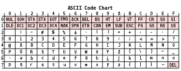
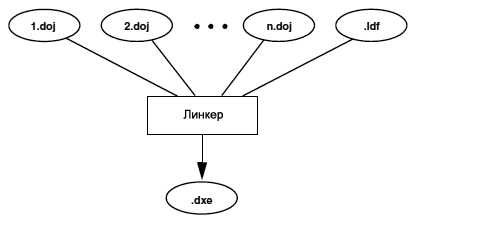

# ВОПРОСЫ НА СОБЕСЕДОВАНИИ ПО С++

- ### [1.Junior](#junior)
- ### [2.Middle](#middle)
- ### [3.Senior](#senior)

## **junior**

- ### Общие вопросы

  #### 1. В чем заключаются основные принципы ООП?

    - <details><summary>Ответ:</summary>

        - Абстракция — отделение концепции от ее экземпляра;
        - Полиморфизм — реализация задач одной и той же идеи разными способами;
        - Наследование — способность объекта или класса базироваться на другом объекте или классе. Это главный механизм
          для
          повторного использования кода.
        - Наследственное отношение классов четко определяет их иерархию;
        - Инкапсуляция — размещение одного объекта или класса внутри другого для разграничения доступа к ним.</abbr>
  </details>

  ---

  #### 2. Что такое сложность алгоритма?

    - <details><summary>Ответ:</summary>
       Сложность алгоритмов обычно оценивают по времени выполнения или по используемой памяти. В обоих случаях сложность зависит от размеров входных данных: массив из 100 элементов будет обработан быстрее, чем аналогичный из 1000. При этом точное время мало кого интересует: оно зависит от процессора, типа данных, языка программирования и множества других параметров. Важна лишь асимптотическая сложность, т. е. сложность при стремлении размера входных данных к бесконечности.
       Допустим, некоторому алгоритму нужно выполнить 4n3 + 7n условных операций, чтобы обработать n элементов входных данных. При увеличении n на итоговое время работы будет значительно больше влиять возведение n в куб, чем умножение его на 4 или же прибавление 7n. Тогда говорят, что временная сложность этого алгоритма равна О(n3), т. е. зависит от размера входных данных кубически.

      Использование заглавной буквы О (или так называемая О-нотация) пришло из математики, где её применяют для
      сравнения
      асимптотического поведения функций. Формально O(f(n)) означает, что время работы алгоритма (или объём занимаемой
      памяти) растёт в зависимости от объёма входных данных не быстрее, чем некоторая константа, умноженная на f(n).
    </details>

  ---

  #### 3. Код работает неправильно. Что делать?

    - <details><summary>Ответ:</summary>
            <a href="https://wpsites.net/wordpress-tips/reasons-code-doesnt-work-how-to-fix-it"> 24+ причины, по которым код не работает и как это исправить</a>

        </details>

  ---

  #### 4. Объясните такие структуры данных, как стек и очередь.

    - <details><summary>Ответ:</summary>

        - ### [Stack](https://en.cppreference.com/w/cpp/container/stack)

      Стек — это коллекция, элементы которой получают по принципу «последний вошел,
      первый вышел» (Last-In-First-Out или LIFO). Это значит,
      что мы будем иметь доступ только к последнему добавленному элементу.

        - ### [Очередь](https://en.cppreference.com/w/cpp/container/queue)
      Очереди очень похожи на стеки. Они также не дают доступа к произвольному элементу, но, в отличие от стека,
      элементы
      кладутся (enqueue) и забираются (dequeue) с разных концов. Такой метод называется «первый вошел, первый вышел» (
      First-In-First-Out или FIFO). То есть забирать элементы из очереди мы будем в том же порядке, что и клали. Как
      реальная очередь или конвейер.

      </details>

  ---

  #### 5. Какие книги, связанные с программированием, читали? Чему с них научились?

    - <details><summary>Ответ:</summary>

        -
      Рао ["Освой самостоятельно C++ по одному часу в день"](https://www.ozon.ru/product/osvoy-samostoyatelno-c-po-odnomu-chasu-v-den-142089790/?sh=Pm_7mIz-pQ)
        - Липпман
          Лажойе [Язык программирования С++. Базовый курс, 5-е изд.2014](https://www.ozon.ru/product/yazyk-programmirovaniya-c-bazovyy-kurs-137901227/?sh=Pm_7mLl1aQ)
        -
      Мейерс [Эффективный и современный C++ 2016](https://www.ozon.ru/product/meyers-skott-effektivnyy-i-sovremennyy-s-42-rekomendatsii-po-ispolzovaniyu-s-11-i-s-14-633967164/?asb=2UJejNHj5RiO2grkh5kiw3daU2aFs5ezngamK3OLKrs%253D&asb2=Oxg9aE4DrZNIAR1pSmbhzQn_7roz9BTQCjFLW3x1nLkUHjQujAjBcPQNpMCe8vDv&keywords=%D0%BC%D0%B5%D0%B9%D0%B5%D1%80%D1%81+-+%D1%8D%D1%84%D1%84%D0%B5%D0%BA%D1%82%D0%B8%D0%B2%D0%BD%D1%8B%D0%B9+%D0%B8+%D1%81%D0%BE%D0%B2%D1%80%D0%B5%D0%BC%D0%B5%D0%BD%D0%BD%D1%8B%D0%B9+c+-+2016&sh=Pm_7mDGkcg)

        </details>

  ---

  #### 6. Что интересного нашли в новых стандартах С++17, С++20?
    - <details><summary>Ответ:</summary>

        - #### [C++17](https://en.wikipedia.org/wiki/C%2B%2B17)
                std::string_view,
                std::optional,
                std::any,
                Захват лямбда-объектом *this,
                std::search
        - #### [C++20](https://en.wikipedia.org/wiki/C%2B%2B20)
              operator <=>,
              std::atomic<std::shared_ptr<T>>,
              std::ranges,
              <coroutine>,
              <span>
      </details>

  ----

  #### 7. Что такое таблица ASCII?

    - <details><summary>Ответ:</summary>
      Кодировка символов (часто называемая также кодовой страницей
      это набор числовых значений, которые ставятся в соответствие группе алфавитно-цифровых символов, знаков пунктуации и специальных символов.

      В [ASCII](https://ru.wikipedia.org/wiki/ASCII) первые 128 символов всех кодовых страниц состоят из базовой таблицы
      символов. Первые 32 кода базовой таблицы,
      начиная с нулевого, размещают управляющие коды.

        

        </details>

  ---

  #### 8. Что такое Unicode?

    - <details><summary>Ответ:</summary>

      [Юникод](https://ru.wikipedia.org/wiki/%D0%AE%D0%BD%D0%B8%D0%BA%D0%BE%D0%B4) или Юникод (от англ. слова Unicode)
      является стандартом кодирования знаков-символов.
      Он даёт возможность быть представленными в кодировке почти всем письменным языкам.

        </details>

  ---

  #### 9. Что такое паттерны проектирования и для чего их используют?

    - <details><summary>Ответ:</summary>

      [Паттерн](https://otus.ru/journal/patterny-v-razrabotke-chto-eto/) - это некое поведение кода по заранее
      обусловленной
      схеме,
      для решения типовых задач. Чем больше Вы знаете таких паттернов (схем),
      тем меньше Вам придется изобретать велосипед для реализации задач общего назначения.

        </details>

  ---

  #### 10. Паттерны Singleton, Strategy, Template-Method, Decorator?

    - <details><summary>Ответ:</summary>

      #### Да!

        - #### Порождающие

            - Abstract Factory - Абстрактная фабрика
            - Builder — Строитель
            - Factory Method — Фабричный метод
            - Prototype — Прототип
            - Singleton — Одиночка

        - #### Структурные
            - Adapter — Адаптер
            - Bridge — Мост
            - Composite — Компоновщик
            - Decorator — Декоратор
            - Facade — Фасад
            - Flyweight — Приспособленец
            - Proxy — Заместитель
        - #### Поведенческие
            - Chain of responsibility — Цепочка обязанностей
            - Command — Команда
            - Interpreter — Интерпретатор
            - Iterator — Итератор
            - Mediator — Посредник
            - Memento — Хранитель
            - Observer — Наблюдатель
            - State — Состояние
            - Strategy — Стратегия
            - Template method — Шаблонный метод
            - Visitor — Посетитель

        </details>

  --- 

  #### 11. Для чего нужны модульные тесты?

    - <details><summary>Ответ:</summary>
      Что такое модульное тестирование?

      Модульное тестирование [Unit Testing](https://en.wikipedia.org/wiki/Unit_testing) – это тип тестирования
      программного
      обеспечения, при котором тестируются отдельные модули или компоненты программного обеспечения. Его цель
      заключается в
      том, чтобы проверить, что каждая единица программного кода работает должным образом. Данный вид тестирование
      выполняется разработчиками на этапе кодирования приложения. Модульные тесты изолируют часть кода и проверяют его
      работоспособность. Единицей для измерения может служить отдельная функция, метод, процедура, модуль или объект.

      В моделях разработки [SDLC](https://www.tutorialspoint.com/sdlc/sdlc_overview.htm)
      , [STLC](https://www.tutorialspoint.com/stlc/stlc_overview.htm), V Model модульное тестирование – это первый
      уровень
      тестирования, выполняемый перед интеграционным тестированием. Модульное тестирование – это метод тестирования
      WhiteBox, который обычно выполняется разработчиком. На деле же из-за нехватки времени или халатности
      разработчиков,
      иногда модульное тестирование приходится проводить [QA](https://en.wikipedia.org/wiki/Quality_assurance)
      инженерам.

      Зачем нужно модульное тестирование?

        </details>

  ---

  #### 12. Какая разница между модульными и интеграционными тестами?

    - <details><summary>Ответ:</summary>
       A единица теста - это тест, написанный программистом для проверки того, что относительно небольшой фрагмент кода делает то, что он должен делать. Они узки по объему, их должно быть легко писать и выполнять, и их эффективность зависит от того, что программист считает полезным. Тесты предназначены для использования программистом, они не являются непосредственно полезными для кого-либо еще, хотя, если они выполняют свою работу, тестеры и пользователи вниз по течению должны получать выгоду от меньшего количества жуки.

      часть того, чтобы быть модульным тестом, подразумевает, что вещи вне тестируемого кода высмеиваются или
      заглушаются.
      Модульные тесты не должны зависеть от внешних систем. Они проверяют внутреннюю согласованность, а не доказывают,
      что
      они хорошо играют с какой-то внешней системой.

      An интеграционного тестирования делается для демонстрации того, что различные части системы работают вместе.
      Интеграционные тесты охватывают целые приложения, и они требуют гораздо большего усилие, чтобы собрать вместе.
      Обычно
      для них требуются такие ресурсы, как экземпляры базы данных и аппаратное обеспечение. Интеграционные тесты делают
      более убедительную работу по демонстрации работы системы (особенно для не программистов), чем набор модульных
      тестов,
      по крайней мере, в той степени, в какой среде интеграционных тестов похожа на производство.

      на самом деле "интеграционный тест" используется для самых разных вещей, от полноценных системных тестов против
      среды,
      напоминающей производство для любого теста, который использует ресурс (например, базу данных или очередь), который
      не
      высмеивается.

    </details>

  ---

  #### 13. Что такое TDD?

    - <details><summary>Ответ:</summary>

      [ Test-driven development](https://ru.wikipedia.org/wiki/%D0%A0%D0%B0%D0%B7%D1%80%D0%B0%D0%B1%D0%BE%D1%82%D0%BA%D0%B0_%D1%87%D0%B5%D1%80%D0%B5%D0%B7_%D1%82%D0%B5%D1%81%D1%82%D0%B8%D1%80%D0%BE%D0%B2%D0%B0%D0%BD%D0%B8%D0%B5)

    </details>

--- 

- ### Метапрограммирование

  #### 14. Что такое шаблонный класс и шаблонная функция?
    - <details><summary>Ответ:</summary>
        Шаблоны служат основанием для универсального программирования на C++. В качестве строго типизированного языка C++ требует, чтобы все переменные имели конкретный тип, либо явно объявленный программистом, либо выведенный компилятором. Однако многие структуры данных и алгоритмы выглядят одинаково независимо от типа, на котором они работают. Шаблоны позволяют определить операции класса или функции и предоставить пользователю указание конкретных типов, с которыми должны работать эти операции

        - Шаблонный класс:

           ```c++ 
              template<typename T>
              class Account {
                private:
                  T id;
                public:
                  Account(T id) : id(id) {
                  }
                  T getId() {
                  return id;
                  }
              };
          ```

            - Шаблонна функция

           ```c++
                 template<class Type>
                 Type _min(Type a, Type b) {
                   if (a < b) {
                     return a;
                   }
                   return b;
                 }
            ```

         </details> 
  ---

  #### 15. Что такое конструкторы? Какие типы знаете?

    - <details><summary>Ответ:</summary>
       Конструкторы - это специальные функции-члены, которые определяют способ инициализации объекта класса. Конструкторы обычно инициализируют элементы данных класса, и они выполняются при создании объекта класса. Некоторые особенности функций-конструкторов заключаются в том, что они имеют то же имя, что и сам класс, и не могут иметь возвращаемый тип. Обычно в классе есть несколько конструкторов, которые перегружают друг друга, но у них должно быть разное количество или типы параметров.

        - [Виды конструкторов](https://ru.wikipedia.org/wiki/%D0%9A%D0%BE%D0%BD%D1%81%D1%82%D1%80%D1%83%D0%BA%D1%82%D0%BE%D1%80_(%D0%BE%D0%B1%D1%8A%D0%B5%D0%BA%D1%82%D0%BD%D0%BE-%D0%BE%D1%80%D0%B8%D0%B5%D0%BD%D1%82%D0%B8%D1%80%D0%BE%D0%B2%D0%B0%D0%BD%D0%BD%D0%BE%D0%B5_%D0%BF%D1%80%D0%BE%D0%B3%D1%80%D0%B0%D0%BC%D0%BC%D0%B8%D1%80%D0%BE%D0%B2%D0%B0%D0%BD%D0%B8%D0%B5)#%D0%92%D0%B8%D0%B4%D1%8B_%D0%BA%D0%BE%D0%BD%D1%81%D1%82%D1%80%D1%83%D0%BA%D1%82%D0%BE%D1%80%D0%BE%D0%B2)
            - Конструктор с параметрами
            - Конструктор по умолчанию
            - Именованный Конструктор
            - Конструктор копирования
            - Конструктор преобразования
            - Конструктор перемещения
            - Виртуальный конструктор

      </details>

  ---

  #### 16. Может ли конструктор быть шаблонной функцией?
    - <details><summary>Ответ:</summary>

      `Ответ требует доработки!`
    </details>

  ---

  #### 17. Может ли виртуальная функция быть шаблонной?

    - <details><summary>Ответ:</summary>
        Виртуальна функция не может быть шаблонной,
        потому что это слишком большое усложнение устройства таблицы виртуальных функций.
        Шаблонные функции генерируются на этапе компиляции (статическое связывание),
        а объявление функции виртуальной означает, что компилятор должен выполнить позднее связывание (динамическое)
        и на этапе выполнения вызовется "нужная функция" для каждого класса через указатель на таблицу виртуальных функций 
        плюс смещение. Эта таблица должна быть фиксированного размера и содержать только одну запись для виртуальной функции,
        а в случае шаблонной виртуальной функции их будет несколько и их количество не будет известно 
        до трансляции всей программы.

      </details>

  ---

  #### 18. Что такое инстанциация шаблона?

    - <details><summary>Ответ:</summary>

      `Ответ треубет доработки!`

      Вообще-то в C++ термин "инстанцирование" применяется к шаблонам.
      Шаблон определяет семейство классов или функций.  
      Результат инстанцирования этого шаблона с указанием его аргументов - класс или функция.

      Например, вот это инстанцирование:

      ```c++
         typedef std::complex<int>  T_int_complex; 
      ```

      И вот это тоже:
      ```c++
        std::complex<char> char_c;
      ```
  </details>

  ---

  #### 19. Что такое специализация шаблона? Частичная специализация шаблона?

    - <details><summary>Ответ:</summary>

      шаблон класса или функции можно специализировать,
      то есть указать реализацию для конкретных аргументов. А частичная специализация означает, что параметров у шаблона
      несколько и для одного или нескольких указываются конкретные аргументы, или, возможно, указывается, что параметры
      имеют один и тот же тип.

      ```c++
        // Это шаблон:
        template<typename T1, typename T2>
        class A{
            ...
        };
      ```

      ```c++
        // Частичная специализация (указан конкретный аргумент double):
        template<typename T1>
        class A<T1, double>{
           ...
        };

        // Частичная специализация (указано, что параметры имеют один и тот же тип):
        template <typename T>
        class A<T, T> {
           ...
        };
      ```

  </details>

  ---

  #### 20. Расскажите об имплементации шаблонных классов в срр-файле?

    - <details><summary>Ответ:</summary>

      `Ответ трубет доработки!`
  </details>

---

- ### Препроцессор и компиляция

  ---

  #### 21. Как проходит процесс компиляции срр-файлов в бинарный файл?
    - <details><summary>Ответ:</summary>

      Когда вы компилируете свой код, вы можете ожидать,
      что компилятор компилирует код именно в том виде,
      как вы его написали. На самом деле это не
      так.([источник](https://kompyutery-programmy.ru/voprosy/kak-prohodit-process-kompilyacii-srr-fajlov-v-binarnyj-fajl.html))

   </details>

   ---

  #### 22. Что такое препроцессор?

    - <details><summary>Ответ:</summary>

      [Препроцессор](https://ru.wikipedia.org/wiki/%D0%9F%D1%80%D0%B5%D0%BF%D1%80%D0%BE%D1%86%D0%B5%D1%81%D1%81%D0%BE%D1%80_%D0%A1%D0%B8)
      языка программирования С++ входит в компиляторе языка. Это программа, которая выполняет обработку исходного текста
      программы прежде, чем он будет компилироваться, выполняет подготовку к компиляции программы.

      </details>
  ---
  #### 23. Как работает препроцессор?

    - <details><summary>Ответ:</summary>

      Препроцессоры - это директивы, которые дают инструкции компилятору для предварительной обработки информации до
      начала фактической компиляции.
        - 1 ([источник](https://unetway.com/tutorial/c-preprocessor))
        - 2 ([источник](https://habr.com/ru/post/478124/))
  </details>

  ---

  #### 24. Какие знаете команды препроцессора?

    - <details><summary>Ответ:</summary>

        - `#define` Заменяет макрос препроцессора.
        - `#include` Вставляет определенный заголовок из другого файла.
        - `#undef` Отменяет определение макроса препроцессора.
        - `#ifdef` Возвращает истину, если этот макрос определен.
        - `#elif` В одном операторе есть #else и #if.
        - `#endif` Условный препроцессор завершен.
        - `#ошибка` Он печатает сообщение об ошибке на stderr.
        - `#pragma` Он выдает специальные команды компилятору, используя стандартизованный метод.
    </details>

  ---

  #### 25. Как работает директива include?

    - <details><summary>Ответ:</summary>

      `#include` - Указывает препроцессору включить содержимое указанного файла в точку, где отображается директива.

      `Синтаксис:`
        - `#include` "путь — спецификация"
        - `#include` <путь — спецификация>

      Подключаемый файл это файл, содержащий определения функций и переменных, а также макроопределения вместе с
      некоторыми исходными файлами. Для использования в программе подключаемых файлов применяется директива
      препроцессора ‘#include’.
      [(Источник)](https://docs.microsoft.com/ru-ru/cpp/preprocessor/hash-include-directive-c-cpp?view=msvc-170)

    </details>

  ---

  #### 26. Как работает директива define?

    - <details><summary>Ответ:</summary>

      [#define](https://docs.microsoft.com/ru-ru/cpp/preprocessor/hash-define-directive-c-cpp?view=msvc-170) - это
      директива препроцессора, программы подготавливающей код программы на языке C/C++ к компиляции.

      Директива `#define` служит для замены часто использующихся констант, ключевых слов, операторов или выражений
      некоторыми идентификаторами.

      В вашем случае код, написанный вами будет заменен на:

      ```c++
      #define  MAX(x,y) ((x)>(y))?(x):(y)
      /*Эта директива заменит фрагмент*/
             t=MAX(i,s[i]);
      /*на фрагмент*/
             t=((i)>(s[i])?(i):(s[i]);
      ```

      Вообще, для этих целей, лучше использовать оператор `const`.

    </details>

  ---

  #### 27. Что именно линкует линкер?

    - <details><summary>Ответ:</summary>

      [Линкер ](http://microsin.net/programming/dsp/linker-and-utilities-manual-chapter-2.html)- это часть процесса
      компиляции программ.

      Короче, пишешь ты программу на своем любимом языке.

      Но процессор не понимает этот язык, поэтому нужен компилятор, который переведет программу на язык процессора.

      Код генератор собственно переводит модуль программы на язык процессора и создает объектный файл для каждого
      модуля (единицы компиляции).

      Но объектный файл - не исполняемый файл, который можно запустить двойным щелчком, надо как минимум слить все
      модули в кучу. Эту функцию и выполняет линкер. Но, а кроме того, есть стандартные библиотеки со стандартными
      функциями. Если вызовы этих функций есть в твоей программе, то линкер добавляет в исполняемый файл еще и код этих
      модулей.

      Вот процесс работы линкера - это и есть линкер
      

    </details>

  ---

  #### 28. Что такое оптимизация компилятора?

    - <details><summary>Ответ:</summary>

      [Оптимизация](https://ru.wikipedia.org/wiki/%D0%9E%D0%BF%D1%82%D0%B8%D0%BC%D0%B8%D0%B7%D0%B8%D1%80%D1%83%D1%8E%D1%89%D0%B8%D0%B9_%D0%BA%D0%BE%D0%BC%D0%BF%D0%B8%D0%BB%D1%8F%D1%82%D0%BE%D1%80)
      – это метод преобразования программы, который пытается улучшить код, заставляя его потреблять меньше ресурсов (т.
      Е. ЦП, память) и обеспечивать высокую скорость.

      При оптимизации общие программные конструкции высокого уровня заменяются очень эффективными низкоуровневыми
      программными кодами. Процесс оптимизации кода должен следовать трем правилам, приведенным ниже:

        - Выходной код никоим образом не должен изменять значение программы
        - Оптимизация должна увеличить скорость программы и, если возможно, программа должна потреблять меньше ресурсов.
        - Оптимизация должна быть быстрой и не должна задерживать весь процесс компиляции.

        1. [Источник](https://docs.microsoft.com/ru-ru/archive/msdn-magazine/2015/february/compilers-what-every-programmer-should-know-about-compiler-optimizations)
        2. [Источник](https://habr.com/ru/company/enterra/blog/250199/)
        3. [Источник](https://habr.com/ru/post/124131/)

   </details> 

  ---

  #### 29. Что такое флажки компиляции?

    - <details><summary>Ответ:</summary>

      Флаг компилятора - это просто флаг. Флаг определяется как «сигнализировать или помечать что-то, чтобы привлечь
      чье-то внимание». Он служит той же цели — что-то помечает, чтобы компилятор обратил внимание на какой-то
      конкретный запрос. Он может сообщить компилятору, что пользователь хочет оптимизировать код для отладки или что
      пользователь не хочет включать какие-либо оптимизации, чтобы было легче понять, почему код ведет себя так, как он
      есть.

      Этот термин обычно используется в инструментах командной строки и служит механизмом, дающим указание программе
      выполнить операцию или вести себя определенным образом.

    </details>

  ---

  #### 30. Как защитить хедер от повторного включения?

    - <details><summary>Ответ:</summary>

      `#pragma once`
      [Подробно](https://stackoverflow.com/questions/14909997/why-arent-my-include-guards-preventing-recursive-inclusion-and-multiple-symbol/14909999#14909999)

      </details>

  ---

  #### 31. Что делает директива include?

    - <details><summary>Ответ:</summary>

      Логично, что именно копирование/вставка и происходит. Боюсь, больше ничего нет. Однако вам не нужен `;`.

      Ваш конкретный пример описан в спецификации, раздел [6.10.2](https://en.cppreference.com/w/c/preprocessor/include)
      Включение исходного файла, пункт 3
     </details>

  ---

  #### 32. Как работают макросы?

    - <details><summary>Ответ:</summary>

      Препроцессор не знает `C`. Он работает с токенами. Насколько известно препроцессору, `for` это токен вроде . `rof`
      Итак, бит, который следует за макросом? Препроцессор не знает, что это часть `for` оператора. Как только он увидит
      закрытие `)` , `cimg_for` `(` это будет сделано. Без дальнейших замен.

      В вашем случае `cimg_for(*this,ptrd,T)` устанавливает:
        - `imgкthis`
        - `ptrsкptrd`
        - `T_ptrsto T` (Тип указателей)
          Этот код странный, BTW: если у вас есть `C++`, вам не нужны эти макросы.
    </details>

--- 

- ### Язык C

  #### 33. Как static влияет на глобальные/локальные переменные?

    - <details><summary>Ответ:</summary>

      `Static` это ключевое слово со многими значениями, и в данном конкретном случае оно означает не глобальное (
      перефразируя)

      Это означает, что в каждом `main.cpp` файле есть своя копия переменной. Таким образом, когда вы инициализируете
      в `main.cpp`, он инициализируется ТОЛЬКО в `main.cpp`. В других файлах он все еще не инициализирован.
      Первое, что нужно исправить, это удалить ключевое слово `static`. Это вызовет «проблему с несколькими
      определениями». Чтобы исправить это, вы должны определить переменную в `.cpp` файле и просто `extern` объявить ее
      в заголовочном файле.

      Ключ вот в чем
      ```c++
         static int *pieces;
      ```

      ```c++
        extern int *pieces;
        extern int init_pieces();
      ```
      И в каждом файле вы делаете это.
      ```c++
        static const size_t num_pieces = 128;
        int *pieces = 0;
        int init_pieces()
        {
        pieces = malloc( num_pieces * sizeof(int) );
        return pieces != NULL;
        }
      ```     

    </details>

  ---

  #### 34. Как сonst влияет на переменную?

    - <details><summary>Ответ:</summary>

      Если вы не хотите, чтобы другие (или вы сами) переопределяли существующие значения переменных,
      используйте `const` ключевое слово (это объявит переменную как «постоянную»,
      что означает неизменяемость и доступ только для чтения):

      Пример:
      ```c++

      const int myNum = 15;  // myNum will always be 15
      myNum = 10;  // error: assignment of read-only variable 'myNum'
      ``` 
    </details>

  ---

  #### 35. Какие варианты использования extern знаете?

    - <details><summary>Ответ:</summary>

      Вы наверняка знаете, что ключевое слово extern применяют для того, чтобы совместно использовать одну и ту же
      переменную в разных модулях кода на языке C/C++. С помощью `extern` переменные становятся глобальными. Но что в
      реальности происходит, когда используется extern? Что такое декларация? Какая область действия у переменной? Как
      правильно использовать `extern`?

      Использование extern уместно только в тех случаях, когда построенная Вами программа состоит из нескольких исходных
      файлов, соединяемых вместе на этапе линковки, где некоторые переменные определены, например, в исходном
      файле `file1.cpp`, и к ним нужно обращаться в других исходных файлах, таких как `file2.cpp`.

      Важно понимать разницу между терминами "определение переменной" (`defining a variable`) и "декларирование
      переменной" (иногда говорят "объявление переменной", `declaring a variable`). Причем можно определять и
      декларировать не только переменные, но и константы. Вот смысл этих понятий:

      ```c++
        // file3.h (пример заголовочного файла с декларацией переменной)
        extern int global_variable;  /* Декларация переменной */
      ```

      ```c++
         //file1.c (пример модуля исходного кода с определением переменной)
         #include "file3.h"  /* В этом месте доступна декларация переменной */
         #include "prog1.h"  /* Декларация функции */
         /* Здесь переменная определяется */
         int global_variable = 37;    /* Определение будет сверено с декларацией */
         int increment(void) { return global_variable++; }
       ```

       ```c++
          //file2.c (в этом месте используется глобальная переменная)
          #include "file3.h"
          #include "prog1.h"
          #include < stdio.h >
          void use_it(void)
          {
          printf("Global variable: %d\n", global_variable++);
          }
        ```

      Подобным образом можно декларировать и определять функции. Пример (функции increment и use_it):

      ```c++
      extern void use_it(void);
      extern int increment(void);
      ```
      </details>

  ---

  #### 36. Какие варианты использования volatile знаете?

    - <details><summary>Ответ:</summary>

      В языках С/С++ volatile занимает особое место: это ключевое слово заставляет компилятор при оптимизации исходного
      кода по-другому обходиться с переменными.
      Добавляя это volatile к переменной, мы предупреждаем, что «потусторонние силы» (какие — расскажем дальше) могут
      модифицировать ее значение в любой момент. И компилятор никогда не сможет предвидеть или вычислить это заранее.

          - Когда нужно использовать `volotile`?

      Значение переменной может измениться за пределами области видимости программы (или ее части), в которой она была
      объявлена и проинициализирована. Это происходит под воздействием:

          - операционной системы (модификация переменной при работе прерываний — IRQ);
          - сторонних процессов или потоков (они могут совместно использовать нашу переменную);
          - периферийных устройств и другого железа (взаимодействие через порты ввода/вывода).

      Представим, что есть некое периферийное устройство с каким-то I/O- портом:
      `volatile uint32 * statusPtr = 0xF1230000;`
      Здесь statusPtr указывает на участок памяти, который в любой момент может быть перезаписан. Наша программа, в
      которой объявлен и проинициализирован этот указатель, не знает, когда это может произойти. От нее тут ничего не
      зависит!
      Но благодаря ключевому слову volatile можно надеяться, что при каждом обращении по этому адресу мы будем получать
      актуальное изменяемое значение

      Давайте рассмотрим более развернутый пример, как volatile переворачивает игру.

      ##### Как компилятор оптимизирует код с volatile

      

      Как видите, преобразование исходного кода в исполняемый файл происходит в три этапа. Сейчас нас интересует этап
      компиляции.

      Вообще, типичный компилятор C/C++ много чего умеет. Например, перед оптимизацией он анализирует исходный код (
      синтаксис и семантику), а после оптимизации генерирует объектный код. Это все — машинный код со служебными
      данными, необходимыми для сборки исполняемого файла.
      Оптимизация помогает улучшить несколько важных характеристик программы.
        - `Две самые важные цели оптимизации — увеличить скорость работы и сократить размер кода.`

          Кроме того, не мешало бы снизить энергопотребление.

          Но иногда случается ситуация под известным названием «за что боролись, на то и напоролись»: если вы не
          поставите
          volatile около переменной, находящейся под властью потусторонних сил, — оптимизация изменит логику программы.
          В
          большинстве случаев это приводит к сбою в работе приложения или, что еще хуже, — к редкому плохо
          воспроизводимому
          дефекту.

          Рассмотрим два похожих фрагмента кода. Единственное отличие — это присутствие слова `volatile` во втором
          фрагменте.

          Пример 1. Нет волатильной переменной:
          ```c++
            int buffer_full;
            int read_stream(void)
            {
            int count = 0;
            while (!buffer_full)
            {
            count++;
            }
            return count;
            }
          ```

          Оба фрагмента кода запускают цикл (спойлер: в одном из них он не прервется никогда). Он крутится до тех пор,
          пока
          флаг `buffer_full` не примет значение 1 (то есть true). Его значение асинхронно меняют другие (сторонние)
          процессы. А оба наших фрагмента кода одинаково ничего не знают об этом.

          Но после оптимизации из маленькой разницы (то есть присутствия `volatile` в исходном коде) вырастает большая
          разница на уровне машинного кода.

          Я использовал вот такой компилятор и такие флаги оптимизации:

          `armclang --target=arm-arm-none-eabi -march=armv8-a -Os -S`

          ##### Меры и предосторожности
          Переменные в таких ситуациях (как в этом примере с `buffer_full`) не должны участвовать в оптимизации: мы
          показали, что компилятор не может и не должен делать какие-либо предположения о них. Это опасно.

          Наличие слишком большого количества волатильных переменных в вашей программе приведет к росту
          неоптимизированных
          фрагментов кода. Так что здесь, как и везде, нужно знать меру.

          [Источник](https://highload.today/klyuchevoe-slovo-volatile-v-c-c-kogda-i-zachem-ego-ispolzovat/)

      </details>

[//]: # ([Автор вопросов]&#40;https://dou.ua/lenta/articles/interview-questions-c-developer/&#41;)
