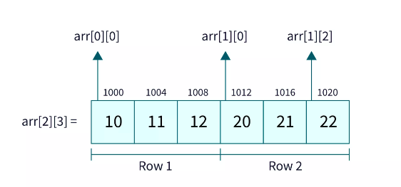
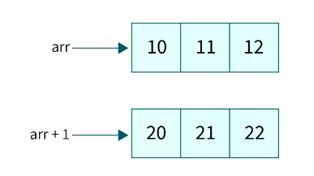
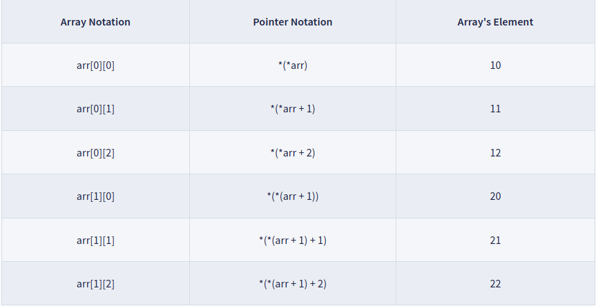
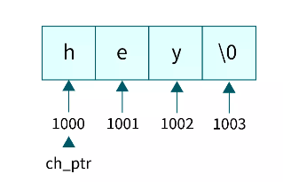

# ВОПРОСЫ НА СОБЕСЕДОВАНИИ ПО С++

- ### [1.Junior](#junior)
- ### [2.Middle](#middle)
- ### [3.Senior](#senior)

## **junior**

- ### Общие вопросы

  #### 1. В чем заключаются основные принципы ООП?

    - <details><summary>Ответ:</summary>

        - Абстракция — отделение концепции от ее экземпляра;
        - Полиморфизм — реализация задач одной и той же идеи разными способами;
        - Наследование — способность объекта или класса базироваться на другом объекте или классе. Это главный механизм
          для
          повторного использования кода.
        - Наследственное отношение классов четко определяет их иерархию;
        - Инкапсуляция — размещение одного объекта или класса внутри другого для разграничения доступа к ним.</abbr>
  </details>

  ---

  #### 2. Что такое сложность алгоритма?

    - <details><summary>Ответ:</summary>
       Сложность алгоритмов обычно оценивают по времени выполнения или по используемой памяти. В обоих случаях сложность зависит от размеров входных данных: массив из 100 элементов будет обработан быстрее, чем аналогичный из 1000. При этом точное время мало кого интересует: оно зависит от процессора, типа данных, языка программирования и множества других параметров. Важна лишь асимптотическая сложность, т. е. сложность при стремлении размера входных данных к бесконечности.
       Допустим, некоторому алгоритму нужно выполнить 4n3 + 7n условных операций, чтобы обработать n элементов входных данных. При увеличении n на итоговое время работы будет значительно больше влиять возведение n в куб, чем умножение его на 4 или же прибавление 7n. Тогда говорят, что временная сложность этого алгоритма равна О(n3), т. е. зависит от размера входных данных кубически.

      Использование заглавной буквы О (или так называемая О-нотация) пришло из математики, где её применяют для
      сравнения
      асимптотического поведения функций. Формально O(f(n)) означает, что время работы алгоритма (или объём занимаемой
      памяти) растёт в зависимости от объёма входных данных не быстрее, чем некоторая константа, умноженная на f(n).
    </details>

  ---

  #### 3. Код работает неправильно. Что делать?

    - <details><summary>Ответ:</summary>
            <a href="https://wpsites.net/wordpress-tips/reasons-code-doesnt-work-how-to-fix-it"> 24+ причины, по которым код не работает и как это исправить</a>

        </details>

  ---

  #### 4. Объясните такие структуры данных, как стек и очередь.

    - <details><summary>Ответ:</summary>

        - ### [Stack](https://en.cppreference.com/w/cpp/container/stack)

      Стек — это коллекция, элементы которой получают по принципу «последний вошел,
      первый вышел» (Last-In-First-Out или LIFO). Это значит,
      что мы будем иметь доступ только к последнему добавленному элементу.

        - ### [Очередь](https://en.cppreference.com/w/cpp/container/queue)
      Очереди очень похожи на стеки. Они также не дают доступа к произвольному элементу, но, в отличие от стека,
      элементы
      кладутся (enqueue) и забираются (dequeue) с разных концов. Такой метод называется «первый вошел, первый вышел» (
      First-In-First-Out или FIFO). То есть забирать элементы из очереди мы будем в том же порядке, что и клали. Как
      реальная очередь или конвейер.

      </details>

  ---

  #### 5. Какие книги, связанные с программированием, читали? Чему с них научились?

    - <details><summary>Ответ:</summary>

        -
      Рао ["Освой самостоятельно C++ по одному часу в день"](https://www.ozon.ru/product/osvoy-samostoyatelno-c-po-odnomu-chasu-v-den-142089790/?sh=Pm_7mIz-pQ)
        - Липпман
          Лажойе [Язык программирования С++. Базовый курс, 5-е изд.2014](https://www.ozon.ru/product/yazyk-programmirovaniya-c-bazovyy-kurs-137901227/?sh=Pm_7mLl1aQ)
        -
      Мейерс [Эффективный и современный C++ 2016](https://www.ozon.ru/product/meyers-skott-effektivnyy-i-sovremennyy-s-42-rekomendatsii-po-ispolzovaniyu-s-11-i-s-14-633967164/?asb=2UJejNHj5RiO2grkh5kiw3daU2aFs5ezngamK3OLKrs%253D&asb2=Oxg9aE4DrZNIAR1pSmbhzQn_7roz9BTQCjFLW3x1nLkUHjQujAjBcPQNpMCe8vDv&keywords=%D0%BC%D0%B5%D0%B9%D0%B5%D1%80%D1%81+-+%D1%8D%D1%84%D1%84%D0%B5%D0%BA%D1%82%D0%B8%D0%B2%D0%BD%D1%8B%D0%B9+%D0%B8+%D1%81%D0%BE%D0%B2%D1%80%D0%B5%D0%BC%D0%B5%D0%BD%D0%BD%D1%8B%D0%B9+c+-+2016&sh=Pm_7mDGkcg)

        </details>

  ---

  #### 6. Что интересного нашли в новых стандартах С++17, С++20?
    - <details><summary>Ответ:</summary>

        - #### [C++17](https://en.wikipedia.org/wiki/C%2B%2B17)
                std::string_view,
                std::optional,
                std::any,
                Захват лямбда-объектом *this,
                std::search
        - #### [C++20](https://en.wikipedia.org/wiki/C%2B%2B20)
              operator <=>,
              std::atomic<std::shared_ptr<T>>,
              std::ranges,
              <coroutine>,
              <span>
      </details>

  ----

  #### 7. Что такое таблица ASCII?

    - <details><summary>Ответ:</summary>
      Кодировка символов (часто называемая также кодовой страницей
      это набор числовых значений, которые ставятся в соответствие группе алфавитно-цифровых символов, знаков пунктуации и специальных символов.

      В [ASCII](https://ru.wikipedia.org/wiki/ASCII) первые 128 символов всех кодовых страниц состоят из базовой таблицы
      символов. Первые 32 кода базовой таблицы,
      начиная с нулевого, размещают управляющие коды.

        

        </details>

  ---

  #### 8. Что такое Unicode?

    - <details><summary>Ответ:</summary>

      [Юникод](https://ru.wikipedia.org/wiki/%D0%AE%D0%BD%D0%B8%D0%BA%D0%BE%D0%B4) или Юникод (от англ. слова Unicode)
      является стандартом кодирования знаков-символов.
      Он даёт возможность быть представленными в кодировке почти всем письменным языкам.

        </details>

  ---

  #### 9. Что такое паттерны проектирования и для чего их используют?

    - <details><summary>Ответ:</summary>

      [Паттерн](https://otus.ru/journal/patterny-v-razrabotke-chto-eto/) - это некое поведение кода по заранее
      обусловленной
      схеме,
      для решения типовых задач. Чем больше Вы знаете таких паттернов (схем),
      тем меньше Вам придется изобретать велосипед для реализации задач общего назначения.

        </details>

  ---

  #### 10. Паттерны Singleton, Strategy, Template-Method, Decorator?

    - <details><summary>Ответ:</summary>

      #### Да!

        - #### Порождающие

            - Abstract Factory - Абстрактная фабрика
            - Builder — Строитель
            - Factory Method — Фабричный метод
            - Prototype — Прототип
            - Singleton — Одиночка

        - #### Структурные
            - Adapter — Адаптер
            - Bridge — Мост
            - Composite — Компоновщик
            - Decorator — Декоратор
            - Facade — Фасад
            - Flyweight — Приспособленец
            - Proxy — Заместитель
        - #### Поведенческие
            - Chain of responsibility — Цепочка обязанностей
            - Command — Команда
            - Interpreter — Интерпретатор
            - Iterator — Итератор
            - Mediator — Посредник
            - Memento — Хранитель
            - Observer — Наблюдатель
            - State — Состояние
            - Strategy — Стратегия
            - Template method — Шаблонный метод
            - Visitor — Посетитель

        </details>

  --- 

  #### 11. Для чего нужны модульные тесты?

    - <details><summary>Ответ:</summary>
      Что такое модульное тестирование?

      Модульное тестирование [Unit Testing](https://en.wikipedia.org/wiki/Unit_testing) – это тип тестирования
      программного
      обеспечения, при котором тестируются отдельные модули или компоненты программного обеспечения. Его цель
      заключается в
      том, чтобы проверить, что каждая единица программного кода работает должным образом. Данный вид тестирование
      выполняется разработчиками на этапе кодирования приложения. Модульные тесты изолируют часть кода и проверяют его
      работоспособность. Единицей для измерения может служить отдельная функция, метод, процедура, модуль или объект.

      В моделях разработки [SDLC](https://www.tutorialspoint.com/sdlc/sdlc_overview.htm)
      , [STLC](https://www.tutorialspoint.com/stlc/stlc_overview.htm), V Model модульное тестирование – это первый
      уровень
      тестирования, выполняемый перед интеграционным тестированием. Модульное тестирование – это метод тестирования
      WhiteBox, который обычно выполняется разработчиком. На деле же из-за нехватки времени или халатности
      разработчиков,
      иногда модульное тестирование приходится проводить [QA](https://en.wikipedia.org/wiki/Quality_assurance)
      инженерам.

      Зачем нужно модульное тестирование?

        </details>

  ---

  #### 12. Какая разница между модульными и интеграционными тестами?

    - <details><summary>Ответ:</summary>
       A единица теста - это тест, написанный программистом для проверки того, что относительно небольшой фрагмент кода делает то, что он должен делать. Они узки по объему, их должно быть легко писать и выполнять, и их эффективность зависит от того, что программист считает полезным. Тесты предназначены для использования программистом, они не являются непосредственно полезными для кого-либо еще, хотя, если они выполняют свою работу, тестеры и пользователи вниз по течению должны получать выгоду от меньшего количества жуки.

      часть того, чтобы быть модульным тестом, подразумевает, что вещи вне тестируемого кода высмеиваются или
      заглушаются.
      Модульные тесты не должны зависеть от внешних систем. Они проверяют внутреннюю согласованность, а не доказывают,
      что
      они хорошо играют с какой-то внешней системой.

      An интеграционного тестирования делается для демонстрации того, что различные части системы работают вместе.
      Интеграционные тесты охватывают целые приложения, и они требуют гораздо большего усилие, чтобы собрать вместе.
      Обычно
      для них требуются такие ресурсы, как экземпляры базы данных и аппаратное обеспечение. Интеграционные тесты делают
      более убедительную работу по демонстрации работы системы (особенно для не программистов), чем набор модульных
      тестов,
      по крайней мере, в той степени, в какой среде интеграционных тестов похожа на производство.

      на самом деле "интеграционный тест" используется для самых разных вещей, от полноценных системных тестов против
      среды,
      напоминающей производство для любого теста, который использует ресурс (например, базу данных или очередь), который
      не
      высмеивается.

    </details>

  ---

  #### 13. Что такое TDD?

    - <details><summary>Ответ:</summary>

      [ Test-driven development](https://ru.wikipedia.org/wiki/%D0%A0%D0%B0%D0%B7%D1%80%D0%B0%D0%B1%D0%BE%D1%82%D0%BA%D0%B0_%D1%87%D0%B5%D1%80%D0%B5%D0%B7_%D1%82%D0%B5%D1%81%D1%82%D0%B8%D1%80%D0%BE%D0%B2%D0%B0%D0%BD%D0%B8%D0%B5)

    </details>

----

- ### Метапрограммирование

  #### 14. Что такое шаблонный класс и шаблонная функция?
    - <details><summary>Ответ:</summary>
        Шаблоны служат основанием для универсального программирования на C++. В качестве строго типизированного языка C++ требует, чтобы все переменные имели конкретный тип, либо явно объявленный программистом, либо выведенный компилятором. Однако многие структуры данных и алгоритмы выглядят одинаково независимо от типа, на котором они работают. Шаблоны позволяют определить операции класса или функции и предоставить пользователю указание конкретных типов, с которыми должны работать эти операции

        - Шаблонный класс:

           ```c++ 
              template<typename T>
              class Account {
                private:
                  T id;
                public:
                  Account(T id) : id(id) {
                  }
                  T getId() {
                  return id;
                  }
              };
          ```

            - Шаблонна функция

           ```c++
                 template<class Type>
                 Type _min(Type a, Type b) {
                   if (a < b) {
                     return a;
                   }
                   return b;
                 }
            ```

         </details> 
  ---

  #### 15. Что такое конструкторы? Какие типы знаете?

    - <details><summary>Ответ:</summary>
       Конструкторы - это специальные функции-члены, которые определяют способ инициализации объекта класса. Конструкторы обычно инициализируют элементы данных класса, и они выполняются при создании объекта класса. Некоторые особенности функций-конструкторов заключаются в том, что они имеют то же имя, что и сам класс, и не могут иметь возвращаемый тип. Обычно в классе есть несколько конструкторов, которые перегружают друг друга, но у них должно быть разное количество или типы параметров.

        - [Виды конструкторов](https://ru.wikipedia.org/wiki/%D0%9A%D0%BE%D0%BD%D1%81%D1%82%D1%80%D1%83%D0%BA%D1%82%D0%BE%D1%80_(%D0%BE%D0%B1%D1%8A%D0%B5%D0%BA%D1%82%D0%BD%D0%BE-%D0%BE%D1%80%D0%B8%D0%B5%D0%BD%D1%82%D0%B8%D1%80%D0%BE%D0%B2%D0%B0%D0%BD%D0%BD%D0%BE%D0%B5_%D0%BF%D1%80%D0%BE%D0%B3%D1%80%D0%B0%D0%BC%D0%BC%D0%B8%D1%80%D0%BE%D0%B2%D0%B0%D0%BD%D0%B8%D0%B5)#%D0%92%D0%B8%D0%B4%D1%8B_%D0%BA%D0%BE%D0%BD%D1%81%D1%82%D1%80%D1%83%D0%BA%D1%82%D0%BE%D1%80%D0%BE%D0%B2)
            - Конструктор с параметрами
            - Конструктор по умолчанию
            - Именованный Конструктор
            - Конструктор копирования
            - Конструктор преобразования
            - Конструктор перемещения
            - Виртуальный конструктор

      </details>

  ---

  #### 16. Может ли конструктор быть шаблонной функцией?
    - <details><summary>Ответ:</summary>

      `Ответ требует доработки!`

      Деструкторы и конструкторы копирования не могут быть шаблонами, но могут быть другими специальными
      функциями-членами.
      Если объявлен конструктор шаблона, экземпляр которого может быть создан с помощью сигнатуры типа конструктора
      копирования, вместо него используется неявно объявленный конструктор копирования.

      Шаблон функции-члена не может быть виртуальным, а шаблон функции-члена в производном классе не может
      переопределять
      виртуальную функцию-член из базового класса.
    </details>

  ---

  #### 17. Может ли виртуальная функция быть шаблонной?

    - <details><summary>Ответ:</summary>

      Виртуальна функция не может быть шаблонной,
      потому что это слишком большое усложнение устройства таблицы виртуальных функций.
      Шаблонные функции генерируются на этапе компиляции (статическое связывание),
      а объявление функции виртуальной означает, что компилятор должен выполнить позднее связывание (динамическое)
      и на этапе выполнения вызовется "нужная функция" для каждого класса через указатель на таблицу виртуальных функций
      плюс смещение. Эта таблица должна быть фиксированного размера и содержать только одну запись для виртуальной
      функции,
      а в случае шаблонной виртуальной функции их будет несколько и их количество не будет известно
      до трансляции всей программы.

    </details>

  ---

  #### 18. Что такое инстанциация шаблона?

    - <details><summary>Ответ:</summary>

      `Ответ треубет доработки!`

      Вообще-то в C++ термин "инстанцирование" применяется к шаблонам.
      Шаблон определяет семейство классов или функций.  
      Результат инстанцирования этого шаблона с указанием его аргументов - класс или функция.

      Например, вот это инстанцирование:

      ```c++
      typedef std::complex<int>  T_int_complex;
      ```

      И вот это тоже:
      ```c++
      std::complex<char> char_c;
      ```

    </details>

  ---

  #### 19. Что такое специализация шаблона? Частичная специализация шаблона?

    - <details><summary>Ответ:</summary>

      шаблон класса или функции можно специализировать,
      то есть указать реализацию для конкретных аргументов. А частичная специализация означает, что параметров у шаблона
      несколько и для одного или нескольких указываются конкретные аргументы, или, возможно, указывается, что параметры
      имеют один и тот же тип.

      ```c++
      // Это шаблон:
      template<typename T1, typename T2>
      class A{
          ...
      };
      ```

      ```c++
      // Частичная специализация (указан конкретный аргумент double):
      template<typename T1>
      class A<T1, double>{
           ...
      };

      // Частичная специализация (указано, что параметры имеют один и тот же тип):
      template <typename T>
      class A<T, T> {
          ...
      };
      ```

    </details>

  ---

  #### 20. Расскажите об имплементации шаблонных классов в срр-файле?

    - <details><summary>Ответ:</summary>

      `Ответ трубет доработки!`

    </details>

----

- ### Препроцессор и компиляция

  #### 21. Как проходит процесс компиляции срр-файлов в бинарный файл?
    - <details><summary>Ответ:</summary>

      Когда вы компилируете свой код, вы можете ожидать,
      что компилятор компилирует код именно в том виде,
      как вы его написали. На самом деле это не
      так.([источник](https://kompyutery-programmy.ru/voprosy/kak-prohodit-process-kompilyacii-srr-fajlov-v-binarnyj-fajl.html))

   </details>

   ---

  #### 22. Что такое препроцессор?

    - <details><summary>Ответ:</summary>

      [Препроцессор](https://ru.wikipedia.org/wiki/%D0%9F%D1%80%D0%B5%D0%BF%D1%80%D0%BE%D1%86%D0%B5%D1%81%D1%81%D0%BE%D1%80_%D0%A1%D0%B8)
      языка программирования С++ входит в компиляторе языка. Это программа, которая выполняет обработку исходного текста
      программы прежде, чем он будет компилироваться, выполняет подготовку к компиляции программы.

      </details>
  ---
  #### 23. Как работает препроцессор?

    - <details><summary>Ответ:</summary>

      Препроцессоры - это директивы, которые дают инструкции компилятору для предварительной обработки информации до
      начала фактической компиляции.
        - 1 ([источник](https://unetway.com/tutorial/c-preprocessor))
        - 2 ([источник](https://habr.com/ru/post/478124/))
  </details>

  ---

  #### 24. Какие знаете команды препроцессора?

    - <details><summary>Ответ:</summary>

        - `#define` Заменяет макрос препроцессора.
        - `#include` Вставляет определенный заголовок из другого файла.
        - `#undef` Отменяет определение макроса препроцессора.
        - `#ifdef` Возвращает истину, если этот макрос определен.
        - `#elif` В одном операторе есть #else и #if.
        - `#endif` Условный препроцессор завершен.
        - `#ошибка` Он печатает сообщение об ошибке на stderr.
        - `#pragma` Он выдает специальные команды компилятору, используя стандартизованный метод.
    </details>

  ---

  #### 25. Как работает директива include?

    - <details><summary>Ответ:</summary>

      `#include` - Указывает препроцессору включить содержимое указанного файла в точку, где отображается директива.

      `Синтаксис:`
        - `#include` "путь — спецификация"
        - `#include` <путь — спецификация>

      Подключаемый файл это файл, содержащий определения функций и переменных, а также макроопределения вместе с
      некоторыми исходными файлами. Для использования в программе подключаемых файлов применяется директива
      препроцессора ‘#include’.
      [(Источник)](https://docs.microsoft.com/ru-ru/cpp/preprocessor/hash-include-directive-c-cpp?view=msvc-170)

    </details>

  ---

  #### 26. Как работает директива define?

    - <details><summary>Ответ:</summary>

      [#define](https://docs.microsoft.com/ru-ru/cpp/preprocessor/hash-define-directive-c-cpp?view=msvc-170) - это
      директива препроцессора, программы подготавливающей код программы на языке C/C++ к компиляции.

      Директива `#define` служит для замены часто использующихся констант, ключевых слов, операторов или выражений
      некоторыми идентификаторами.

      В вашем случае код, написанный вами будет заменен на:

      ```c++
      #define  MAX(x,y) ((x)>(y))?(x):(y)
      /*Эта директива заменит фрагмент*/
             t=MAX(i,s[i]);
      /*на фрагмент*/
             t=((i)>(s[i])?(i):(s[i]);
      ```

      Вообще, для этих целей, лучше использовать оператор `const`.

    </details>

  ---

  #### 27. Что именно линкует линкер?

    - <details><summary>Ответ:</summary>

      [Линкер ](http://microsin.net/programming/dsp/linker-and-utilities-manual-chapter-2.html)- это часть процесса
      компиляции программ.

      Короче, пишешь ты программу на своем любимом языке.

      Но процессор не понимает этот язык, поэтому нужен компилятор, который переведет программу на язык процессора.

      Код генератор собственно переводит модуль программы на язык процессора и создает объектный файл для каждого
      модуля (единицы компиляции).

      Но объектный файл - не исполняемый файл, который можно запустить двойным щелчком, надо как минимум слить все
      модули в кучу. Эту функцию и выполняет линкер. Но, а кроме того, есть стандартные библиотеки со стандартными
      функциями. Если вызовы этих функций есть в твоей программе, то линкер добавляет в исполняемый файл еще и код этих
      модулей.

      Вот процесс работы линкера - это и есть линкер
      

    </details>

  ---

  #### 28. Что такое оптимизация компилятора?

    - <details><summary>Ответ:</summary>

      [Оптимизация](https://ru.wikipedia.org/wiki/%D0%9E%D0%BF%D1%82%D0%B8%D0%BC%D0%B8%D0%B7%D0%B8%D1%80%D1%83%D1%8E%D1%89%D0%B8%D0%B9_%D0%BA%D0%BE%D0%BC%D0%BF%D0%B8%D0%BB%D1%8F%D1%82%D0%BE%D1%80)
      – это метод преобразования программы, который пытается улучшить код, заставляя его потреблять меньше ресурсов (т.
      Е. ЦП, память) и обеспечивать высокую скорость.

      При оптимизации общие программные конструкции высокого уровня заменяются очень эффективными низкоуровневыми
      программными кодами. Процесс оптимизации кода должен следовать трем правилам, приведенным ниже:

        - Выходной код никоим образом не должен изменять значение программы
        - Оптимизация должна увеличить скорость программы и, если возможно, программа должна потреблять меньше ресурсов.
        - Оптимизация должна быть быстрой и не должна задерживать весь процесс компиляции.

        1. [Источник](https://docs.microsoft.com/ru-ru/archive/msdn-magazine/2015/february/compilers-what-every-programmer-should-know-about-compiler-optimizations)
        2. [Источник](https://habr.com/ru/company/enterra/blog/250199/)
        3. [Источник](https://habr.com/ru/post/124131/)

   </details> 

  ---

  #### 29. Что такое флажки компиляции?

    - <details><summary>Ответ:</summary>

      Флаг компилятора - это просто флаг. Флаг определяется как «сигнализировать или помечать что-то, чтобы привлечь
      чье-то внимание». Он служит той же цели — что-то помечает, чтобы компилятор обратил внимание на какой-то
      конкретный запрос. Он может сообщить компилятору, что пользователь хочет оптимизировать код для отладки или что
      пользователь не хочет включать какие-либо оптимизации, чтобы было легче понять, почему код ведет себя так, как он
      есть.

      Этот термин обычно используется в инструментах командной строки и служит механизмом, дающим указание программе
      выполнить операцию или вести себя определенным образом.

    </details>

  ---

  #### 30. Как защитить хедер от повторного включения?

    - <details><summary>Ответ:</summary>

      `#pragma once`
      [Подробно](https://stackoverflow.com/questions/14909997/why-arent-my-include-guards-preventing-recursive-inclusion-and-multiple-symbol/14909999#14909999)

      </details>

  ---

  #### 31. Что делает директива include?

    - <details><summary>Ответ:</summary>

      Логично, что именно копирование/вставка и происходит. Боюсь, больше ничего нет. Однако вам не нужен `;`.

      Ваш конкретный пример описан в спецификации, раздел [6.10.2](https://en.cppreference.com/w/c/preprocessor/include)
      Включение исходного файла, пункт 3
     </details>

  ---

  #### 32. Как работают макросы?

    - <details><summary>Ответ:</summary>

      Препроцессор не знает `C`. Он работает с токенами. Насколько известно препроцессору, `for` это токен вроде . `rof`
      Итак, бит, который следует за макросом? Препроцессор не знает, что это часть `for` оператора. Как только он увидит
      закрытие `)` , `cimg_for` `(` это будет сделано. Без дальнейших замен.

      В вашем случае `cimg_for(*this,ptrd,T)` устанавливает:
        - `imgкthis`
        - `ptrsкptrd`
        - `T_ptrsto T` (Тип указателей)
          Этот код странный, BTW: если у вас есть `C++`, вам не нужны эти макросы.
    </details>

--- 

- ### Язык C

  #### 33. Как static влияет на глобальные/локальные переменные?

    - <details><summary>Ответ:</summary>

      `Static` это ключевое слово со многими значениями, и в данном конкретном случае оно означает не глобальное (
      перефразируя)

      Это означает, что в каждом `main.cpp` файле есть своя копия переменной. Таким образом, когда вы инициализируете
      в `main.cpp`, он инициализируется ТОЛЬКО в `main.cpp`. В других файлах он все еще не инициализирован.
      Первое, что нужно исправить, это удалить ключевое слово `static`. Это вызовет «проблему с несколькими
      определениями». Чтобы исправить это, вы должны определить переменную в `.cpp` файле и просто `extern` объявить ее
      в заголовочном файле.

      Ключ вот в чем
      ```c++
         static int *pieces;
      ```

      ```c++
        extern int *pieces;
        extern int init_pieces();
      ```
      И в каждом файле вы делаете это.
      ```c++
        static const size_t num_pieces = 128;
        int *pieces = 0;
        int init_pieces()
        {
        pieces = malloc( num_pieces * sizeof(int) );
        return pieces != NULL;
        }
      ```     

    </details>

  ---

  #### 34. Как сonst влияет на переменную?

    - <details><summary>Ответ:</summary>

      Если вы не хотите, чтобы другие (или вы сами) переопределяли существующие значения переменных,
      используйте `const` ключевое слово (это объявит переменную как «постоянную»,
      что означает неизменяемость и доступ только для чтения):

      Пример:
      ```c++

      const int myNum = 15;  // myNum will always be 15
      myNum = 10;  // error: assignment of read-only variable 'myNum'
      ``` 
    </details>

  ---

  #### 35. Какие варианты использования extern знаете?

    - <details><summary>Ответ:</summary>

      Вы наверняка знаете, что ключевое слово extern применяют для того, чтобы совместно использовать одну и ту же
      переменную в разных модулях кода на языке C/C++. С помощью `extern` переменные становятся глобальными. Но что в
      реальности происходит, когда используется extern? Что такое декларация? Какая область действия у переменной? Как
      правильно использовать `extern`?

      Использование extern уместно только в тех случаях, когда построенная Вами программа состоит из нескольких исходных
      файлов, соединяемых вместе на этапе линковки, где некоторые переменные определены, например, в исходном
      файле `file1.cpp`, и к ним нужно обращаться в других исходных файлах, таких как `file2.cpp`.

      Важно понимать разницу между терминами "определение переменной" (`defining a variable`) и "декларирование
      переменной" (иногда говорят "объявление переменной", `declaring a variable`). Причем можно определять и
      декларировать не только переменные, но и константы. Вот смысл этих понятий:

      ```c++
        // file3.h (пример заголовочного файла с декларацией переменной)
        extern int global_variable;  /* Декларация переменной */
      ```

      ```c++
         //file1.c (пример модуля исходного кода с определением переменной)
         #include "file3.h"  /* В этом месте доступна декларация переменной */
         #include "prog1.h"  /* Декларация функции */
         /* Здесь переменная определяется */
         int global_variable = 37;    /* Определение будет сверено с декларацией */
         int increment(void) { return global_variable++; }
       ```

       ```c++
          //file2.c (в этом месте используется глобальная переменная)
          #include "file3.h"
          #include "prog1.h"
          #include < stdio.h >
          void use_it(void)
          {
          printf("Global variable: %d\n", global_variable++);
          }
        ```

      Подобным образом можно декларировать и определять функции. Пример (функции increment и use_it):

      ```c++
      extern void use_it(void);
      extern int increment(void);
      ```
      </details>

  ---

  #### 36. Какие варианты использования volatile знаете?

    - <details><summary>Ответ:</summary>

      В языках С/С++ volatile занимает особое место: это ключевое слово заставляет компилятор при оптимизации исходного
      кода по-другому обходиться с переменными.
      Добавляя это volatile к переменной, мы предупреждаем, что «потусторонние силы» (какие — расскажем дальше) могут
      модифицировать ее значение в любой момент. И компилятор никогда не сможет предвидеть или вычислить это заранее.

          - Когда нужно использовать `volotile`?

      Значение переменной может измениться за пределами области видимости программы (или ее части), в которой она была
      объявлена и проинициализирована. Это происходит под воздействием:

          - операционной системы (модификация переменной при работе прерываний — IRQ);
          - сторонних процессов или потоков (они могут совместно использовать нашу переменную);
          - периферийных устройств и другого железа (взаимодействие через порты ввода/вывода).

      Представим, что есть некое периферийное устройство с каким-то I/O- портом:
      `volatile uint32 * statusPtr = 0xF1230000;`
      Здесь statusPtr указывает на участок памяти, который в любой момент может быть перезаписан. Наша программа, в
      которой объявлен и проинициализирован этот указатель, не знает, когда это может произойти. От нее тут ничего не
      зависит!
      Но благодаря ключевому слову volatile можно надеяться, что при каждом обращении по этому адресу мы будем получать
      актуальное изменяемое значение

      Давайте рассмотрим более развернутый пример, как volatile переворачивает игру.

      ##### Как компилятор оптимизирует код с volatile

      

      Как видите, преобразование исходного кода в исполняемый файл происходит в три этапа. Сейчас нас интересует этап
      компиляции.

      Вообще, типичный компилятор C/C++ много чего умеет. Например, перед оптимизацией он анализирует исходный код (
      синтаксис и семантику), а после оптимизации генерирует объектный код. Это все — машинный код со служебными
      данными, необходимыми для сборки исполняемого файла.
      Оптимизация помогает улучшить несколько важных характеристик программы.
        - `Две самые важные цели оптимизации — увеличить скорость работы и сократить размер кода.`

          Кроме того, не мешало бы снизить энергопотребление.

          Но иногда случается ситуация под известным названием «за что боролись, на то и напоролись»: если вы не
          поставите
          volatile около переменной, находящейся под властью потусторонних сил, — оптимизация изменит логику программы.
          В
          большинстве случаев это приводит к сбою в работе приложения или, что еще хуже, — к редкому плохо
          воспроизводимому
          дефекту.

          Рассмотрим два похожих фрагмента кода. Единственное отличие — это присутствие слова `volatile` во втором
          фрагменте.

          Пример 1. Нет волатильной переменной:
          ```c++
            int buffer_full;
            int read_stream(void)
            {
            int count = 0;
            while (!buffer_full)
            {
            count++;
            }
            return count;
            }
          ```

          Оба фрагмента кода запускают цикл (спойлер: в одном из них он не прервется никогда). Он крутится до тех пор,
          пока
          флаг `buffer_full` не примет значение 1 (то есть true). Его значение асинхронно меняют другие (сторонние)
          процессы. А оба наших фрагмента кода одинаково ничего не знают об этом.

          Но после оптимизации из маленькой разницы (то есть присутствия `volatile` в исходном коде) вырастает большая
          разница на уровне машинного кода.

          Я использовал вот такой компилятор и такие флаги оптимизации:

          `armclang --target=arm-arm-none-eabi -march=armv8-a -Os -S`

          ##### Меры и предосторожности
          Переменные в таких ситуациях (как в этом примере с `buffer_full`) не должны участвовать в оптимизации: мы
          показали, что компилятор не может и не должен делать какие-либо предположения о них. Это опасно.

          Наличие слишком большого количества волатильных переменных в вашей программе приведет к росту
          неоптимизированных
          фрагментов кода. Так что здесь, как и везде, нужно знать меру.

          [Источник](https://highload.today/klyuchevoe-slovo-volatile-v-c-c-kogda-i-zachem-ego-ispolzovat/)

      </details>

  ---

  #### 37. Какие есть битовые операции?

    - <details><summary>Ответ:</summary>

      [Битовые операции](https://ru.wikipedia.org/wiki/%D0%91%D0%B8%D1%82%D0%BE%D0%B2%D0%B0%D1%8F_%D0%BE%D0%BF%D0%B5%D1%80%D0%B0%D1%86%D0%B8%D1%8F)
      — это тестирование, установка или сдвиг битов в байте или слове, которые соответствуют
      стандартным типам языка `С` `char` и `int`. Битовые операторы не могут использоваться с `double` и сложными
      типами.

      

      Операторы сдвига >> и `<<` сдвигают биты в переменной вправо и влево на указанное число. Общий вид оператора
      сдвига вправо:
      переменная `>>` число сдвигов,
      а общий вид оператора сдвига влево:
      переменная `<<` число сдвигов
      Помните, что сдвиг — это не то же самое, что и вращение, то есть биты, сдвигающиеся на один конец, не появляются с
      другого. Сдвинутые биты теряются, а с другого конца появляются нули. В том случае, если вправо сдвигается
      отрицательное число, слева появляются единицы (поддерживается знаковый бит).
      Битовые операторы `И`, `ИЛИ`, НЕ используют ту же таблицу истинности, что и их логические эквиваленты, за тем
      исключением, что они работают побитовое.
      Исключающее `ИЛИ` имеет следующую таблицу истинности:

      

      Как следует из таблицы, исключающее `ИЛИ` выдает истину, если только один из операндов истинен. В противном случае
      получается ложь.
      Битовое И чаще всего используется для выключения битов. Любой бит, установленный в `0`, вызывает установку
      соответствующего бита в другом операнде также в `0`.

      ```
        11000001     исходное состояние байта
        01111111     127 в двоичном представлении выполнение битового И
        & ------—     побитовое И
        01000001     исходный байт с зануленным старшим битом
      
      ```
      Битовое ИЛИ может использоваться для установки битов. Любой бит, установленный в любом операнде, вызывает
      установку соответствующего бита в другом операнде. Например, в результате операции `128 | 3` получаем

      ```
        10000000     128 в двоичном представлении
        00000011     3 в двоичном представлении
        | ------—     побитовое ИЛИ
        10000011     результат

      ```

      Исключающее `ИЛИ` или как его называют, `XOR` устанавливает бит, если соответствующие биты в операндах отличаются.
      Например, в результате операции `127 ^ 120` получаем
      ```
        01111111     127 в двоичном представлении
        01111000     120 в двоичном представлении
        ^ ------—     побитовое исключающее ИЛИ
        00000111     результат
      ```
      Итого, побитовые `И`, `ИЛИ` и исключающее `ИЛИ` применяются к каждому биту переменной.
      Использование их в условных операторах обычно является ошибкой!
      Например: если `х` содержит `7`, то `х && 8` выдаст `1`, в то время как `х & 8` выдаст `0`.
      Оператор дополнение, `~`, инвертирует состояние каждого бита указанной переменной, то есть `1` устанавливается
      в `0`, а `0` — в `1`.
    </details>

  ---

  #### 38. Что такое булевая алгебра?

    - <details><summary>Ответ:</summary>

      [Булева алгебра](https://ru.wikipedia.org/wiki/%D0%90%D0%BB%D0%B3%D0%B5%D0%B1%D1%80%D0%B0_%D0%BB%D0%BE%D0%B3%D0%B8%D0%BA%D0%B8)
      — это категория алгебры, в которой значения переменных являются значениями истинности, истинными и ложными, обычно
      обозначаемыми `1` и `0` соответственно. Он используется для анализа и упрощения цифровых схем или цифровых
      вентилей. Ее также называют бинарной алгеброй или логической алгеброй. Он был основополагающим при разработке
      цифровой электроники и предусмотрен во всех современных языках программирования. Он также используется в [теории
      множеств](https://ru.wikipedia.org/wiki/%D0%A2%D0%B5%D0%BE%D1%80%D0%B8%D1%8F_%D0%BC%D0%BD%D0%BE%D0%B6%D0%B5%D1%81%D1%82%D0%B2)
      и статистике.

      Важными операциями, выполняемыми в булевой алгебре, являются конъюнкция `∧`, дизъюнкция `∨` и отрицание `¬` .
      Следовательно, эта алгебра сильно отличается от элементарной алгебры, где значения переменных являются числовыми,
      а над
      ними выполняются арифметические операции, такие как сложение, вычитание.
    </details>

  ---

  #### 39. Расскажите об этапах разработки библиотеки или программы.

    - <details><summary>Ответ:</summary>

      Различные этапы разработки компьютерной программы:

        1. Определение проблемы
        2. Дизайн программы
        3. Кодирование
        4. Отладка
        5. Тестирование
        6. Документация
        7. Обслуживание

      

      ##### Определение проблемы:
        - Первым шагом в процессе разработки программы является полное понимание и идентификация проблемы, для решения
          которой должна быть разработана программа или программное обеспечение.
        - На этом этапе задача должна быть определена формально.
        - На этом этапе необходимо учитывать все факторы, такие как ввод/вывод, требования к обработке, требования к
          памяти, обработка ошибок, взаимодействие с другими программами.
      ##### Дизайн программы:
        - Следующий этап – разработка программы. Разработчик программного обеспечения использует такие инструменты, как
          алгоритмы и блок-схемы, для разработки дизайна программы.
            - Алгоритм
            - Блок-схема
      ##### Кодирование:
        - Как только процесс проектирования завершен, создается настоящая компьютерная программа, т. е. инструкции
          пишутся на языке программирования.
        - Кодирование, как правило, является очень небольшой частью всего процесса разработки программы, а также в
          действительности занимает меньше времени.
        - В этом процессе устраняются все синтаксические ошибки, т.е. ошибки, связанные с правописанием, пропущенными
          запятыми, неопределенными метками и т. д.
        - Для эффективного кодирования применяются следующие направляющие линии:
            - Использование осмысленных имен и меток переменных,
            - Простые и понятные выражения,
            - Модульность с упором на обобщение модулей,
            - Использование комментариев и правильный отступ кода,
            - Избегание скачков в программе передачи управления.
      ##### Отладка:
        - На этом этапе выявляются и исправляются ошибки в программах.
        - Этот этап разработки программы является важным процессом. Отладка также известна как проверка программы.
        - Некоторые распространенные ошибки, которые могут возникнуть в программах, включают:
            - Un инициализация переменных.
            - Обратный порядок операндов.
            - Путаница цифр и символов.
            - Инвертирование условий, например, переход на ноль, а не на ненулевое значение.
      ##### Тестирование:
        - Программа тестируется на ряде подходящих тестовых случаев.
        - План тестирования программы должен быть сделан на этапе проектирования самой программы.
        - Это гарантирует полное понимание спецификаций.
        - Самые тривиальные и самые частные случаи должны быть идентифицированы и протестированы.
        - Всегда полезно включать максимальные и минимальные значения всех переменных в качестве тестовых данных.
      ##### Документация:
        - Документация является очень важным шагом в разработке программы.
        - Документация помогает пользователям и людям, которые поддерживают программное обеспечение.
        - Это гарантирует, что будущая модификация, если потребуется, может быть легко выполнена. Также требуется при
          перепроектировании и обслуживании.
      ##### Обслуживание:
        - Обновление и корректировка программы под изменившиеся условия и полевой опыт учитывается в техническом
          обслуживании.
        - Техническое обслуживание становится необходимым в следующих ситуациях:
            - Изменение спецификации,
            - Смена снаряжения,
            - Ошибки, обнаруженные во время фактического выполнения программы.

      [Дополнительно](https://codilime.com/blog/the-stages-of-the-sdlc/)
      </details>

  --- 

  #### 40. Что такое алгоритмы сортировки и какие вы знаете?

    - <details><summary>Ответ:</summary>

      В компьютерных науках [алгоритм сортировки](https://en.wikipedia.org/wiki/Sorting_algorithm) — это алгоритм,
      который упорядочивает элементы списка

      ##### Лучшие алгоритмов сортировки

        - [Selection sort](https://github.com/Jollu8/Algorithms/blob/main/Sort/Selection.cpp)
        - [Bubble sort](https://github.com/Jollu8/Algorithms/blob/main/Sort/Bubble.cpp)
        - [Insertion sort](https://github.com/Jollu8/Algorithms/blob/main/Sort/Insertion.cpp)
        - [Merge sort](https://github.com/Jollu8/Algorithms/blob/main/Sort/Merge.cpp)
        - [Quick sort](https://github.com/Jollu8/Algorithms/blob/main/Sort/Quick.cpp)
        - [Quick recursive sort](https://github.com/Jollu8/Algorithms/blob/main/Sort/QuicSortRecursive.cpp)
        - [Shell sort](https://github.com/Jollu8/Algorithms/blob/main/Sort/Shell.cpp)
        - [Stupid sort](https://github.com/Jollu8/Algorithms/blob/main/Sort/Stupid.cpp)
        - Radix sort
        - Heap sort
        - Tim sort
        - Cycle sort
        - Standard sort
        - Bitcoin sort
        - Tree sort
        - Gnome sort

      [Подробно](https://ru.wikipedia.org/wiki/%D0%90%D0%BB%D0%B3%D0%BE%D1%80%D0%B8%D1%82%D0%BC_%D1%81%D0%BE%D1%80%D1%82%D0%B8%D1%80%D0%BE%D0%B2%D0%BA%D0%B8)
      </details>

  ---

  #### 41. Какие алгоритмы работы со строками знаете?

    - <details><summary>Ответ:</summary>

      Ответ требует доработки(требуется ру контент)

      ##### Тематики

        - [Алгоритмы точного сопоставления строк](https://www.hackerearth.com/practice/notes/exact-string-matching-algorithms/)
        - [Алгоритмы приближенного сопоставления строк](https://stackoverflow.com/questions/49263/approximate-string-matching-algorithms/50110#50110)

        1. ##### Алгоритмы, основанные на сравнении символов:

            - [Наивный алгоритм поиска шаблонов](https://www.tutorialspoint.com/Naive-Pattern-Searching)
            - [Алгоритм KMP для поиска шаблонов](https://www.tutorialcup.com/interview/algorithm/kmp-algorithm.htm)
            - [Алгоритм Бойера Мура для поиска по образцу](https://en.wikipedia.org/wiki/Boyer%E2%80%93Moore_string-search_algorithm)
            - [Trie | (Insert and Search)](https://www.techiedelight.com/trie-implementation-insert-search-delete)

        2. ##### Метод детерминированного конечного автомата (DFA):

            - [Алгоритм конечных автоматов для поиска шаблонов](https://tutorialspoint.dev/algorithm/pattern-searching-algorithms/searching-for-patterns-set-5-finite-automata)

        3. ##### Алгоритмы на основе Bit (метод параллелизма)

            - [Алгоритм Ахо-Корасика для поиска шаблонов](https://github.com/cjgdev/aho_corasick)

        4. ##### Алгоритмы сопоставления хэш-строки:

            - [Алгоритм Рабина-Карпа для поиска образов](https://en.wikipedia.org/wiki/Rabin%E2%80%93Karp_algorithm#Use_of_hashing_for_shifting_substring_search)

      </details>

  ---

  #### 42. Какие алгоритмы на графах знаете?

    - <details><summary>Ответ:</summary>

      [Граф](https://ru.wikipedia.org/wiki/%D0%93%D1%80%D0%B0%D1%84_(%D0%BC%D0%B0%D1%82%D0%B5%D0%BC%D0%B0%D1%82%D0%B8%D0%BA%D0%B0))
      — это нелинейная структура данных, состоящая из узлов и ребер. Узлы иногда также называют вершинами, а ребра —
      линиями или дугами, соединяющими любые два узла в графе. Более формально график можно определить как

      Ниже приведены некоторые основные определения, относящиеся к графам. Вы можете обратиться к рисунку 1 для
      примеров.

        - Порядок: количество вершин в графе
        - Размер: количество ребер в графе.
        - Степень вершины: количество ребер, инцидентных вершине.
        - Изолированная вершина: вершина, которая не связана ни с какими другими вершинами графа.
        - Самостоятельная петля : ребро из вершины в себя
        - Направленный граф: граф, в котором все ребра имеют направление, указывающее начальную и конечную вершины.
        - Неориентированный граф: граф с ребрами, не имеющими направления .
        - Взвешенный граф: ребра графа имеют веса
        - Невзвешенный граф: ребра графа не имеют весов.

      ##### Алгоритмы

        - Поиск в ширину `DFS`
        - Поиск в глубину `DFS`
        - Кратчайший путь `Алгоритм кратчайшего пути Дейкстры`
        - Кратчайший путь `Алгоритм Беллмана - Ворда`
        - Обнаружение цикла `Алгоритм обнаружения цикла Флойда`
        - Обнаружение цикла `Алгоритм Брента`
        - Минимальное остовное дерево `Алгоритма Прима`
        - Минимальное остовное дерево `Алгоритм Крусакала`
        - Компоненты сильной связи `Алгоритм Косараджу`
        - Компоненты сильной связи `Алгоритм сильно связанных компонентов Тарьяна`
        - Топологическая сортировка `Алгоритм Кана`
        - Топологическая сортировка `Алгоритм, основанный на поиск в  глубину`
        - Раскраска графика `Алгорритм, использующие поиск в ширину или поиск в  глубину`
        - Раскраска графика `Жадная раскраска`
        - Максимальный расход `Алгоритм Форда-Фалкерсона`
        - Максимальный расход `Алгоритм Эдионса- Канда`
        - Максимальный расход `Алгоритм Динка`
        - Соответствие `Алгоритм Хопкрофта-Карпа`

    </details>

  ---

  #### 43. Где может храниться переменная?

    -  <details><summary>Ответ:</summary>

       В стеке, если они являются локальными переменными функции.
       `C++` называет это [автоматической памятью](https://en.cppreference.com/w/cpp/language/storage_duration) и не
       требует, чтобы это был стек вызовов `asm`, а в некоторых редких реализациях это не так. Но в основных реализациях
       это так.
       В области данных для каждого процесса, если они являются глобальными или `static`.
       `C++` называет это «статическим классом хранения»; это реализовано на ассемблере путем размещения/резервирования
       байтов в `section .data`, `.bss`, `.rodata` или т п.

       Если переменная является указателем, инициализированным с помощью `int *p = new int[10];` или подобным,
       переменная
       указателя `p` будет помещена в автоматическое хранилище или статическое хранилище, как указано выше. Указанный
       объект в
       памяти:

        - В куче (что `C++` называет динамическим хранилищем), выделенном с помощью `new` или `malloc` и т. д.
        - В ассемблере это означает вызов функции-распределителя, которая в конечном итоге может получить новую память
          из
          `ОС` через
          какой-то системный вызов, если ее свободный список пуст. «Куча» не является единой непрерывной областью в
          современных
          реализациях ОС/С++.

       C и C++ не выполняют автоматическую сборку мусора, а именованные переменные сами по себе не могут находиться в
       динамической памяти ("куче"). Объекты в динамическом хранилище анонимны, за исключением того, что на них
       указывают
       другие объекты, некоторые из которых могут быть правильными переменными. (Объект типа структуры или класса, в
       отличие от
       примитивных типов, таких как int, может позволить вам ссылаться на именованные члены класса в этом анонимном
       объекте. В
       функции-члене они даже выглядят одинаково.)

       Вот почему вы не можете (безопасно/полезно) вернуть указатель или ссылку на локальную переменную.

       Это все в оперативной памяти, конечно. Кэширование прозрачно для процессов пользовательского пространства, хотя
       оно
       может заметно влиять на производительность.

       Компиляторы могут оптимизировать код для хранения переменных в регистрах. Это сильно зависит от компилятора и
       кода, но
       хорошие компиляторы будут делать это агрессивно.

       Забавный факт: `auto` в `C++03` и более ранних версиях, а также в `C` это означало автоматический `storage-class`
       , но теперь (C++11) он выводит типы

    </details>

  ---

  #### 44. Какая разница между calloc и malloc?

    - <details><summary>Ответ:</summary>

      Попробуйте сделать это: выделите немного памяти, используя `malloc`, например

        ```c++
          char* pszKuchBhi ;
          pszKuchBhi = malloc(10) ;
          printf( "%s\n", pszKuchBhi ) ;  
          // Will give some junk values as the memory allocated is not initialized and
          // was storing some garbage values
        ```
      Теперь сделайте то же самое, заменив malloc на `calloc`. Увидеть разницу.

        ```c++
          char* pszKuchBhi ;
          pszKuchBhi = calloc( 10, 1 ) ;
          printf( "%s\n", pszKuchBhi ) ;
          //Will print nothing as the memory is initialized to 0
        ```
      Память, назначаемая `calloc`, инициализируется до `0`. Для новичков полезно инициализировать память, но с точки
      зрения
      производительности `calloc` работает медленно, поскольку ему приходится выделять, а затем инициализировать. Для
      лучшего разъяснения вы всегда можете погуглить тот же вопрос, но лучше испытать его, чтобы заглянуть внутрь. Вы
      также можете следить за своей памятью, чтобы убедиться в этом самостоятельно.

      [Дополнительно](https://byjus.com/gate/difference-between-malloc-and-calloc-functions/)
      </details>

  ---

  #### 45. Для чего используют realloc?

    -  <details><summary>Ответ:</summary>

       Что такое `realloc()`?
       `realloc()` — это функция библиотеки C для добавления большего объема памяти к уже выделенным блокам памяти. Цель
       `realloc` в C — расширить текущие блоки памяти, оставив исходное содержимое без изменений. Функция `realloc()`
       помогает уменьшить размер ранее выделенной памяти функциями `malloc` или `calloc`. `realloc` означает
       перераспределение
       памяти.

       Синтаксис для `realloc` в `C`

         ```c
          ptr = realloc (ptr,newsize);
       ``` 
       Приведенный выше оператор выделяет новое пространство памяти с указанным размером в переменной `new size`. После
       выполнения функции указатель будет возвращен на первый байт блока памяти. Новый размер может быть больше или
       меньше предыдущего объема памяти. Мы не можем быть уверены, что новый выделенный блок будет указывать на то же
       место, что и предыдущий блок памяти. Функция `realloc` в C скопирует все предыдущие данные в новую область. Это
       гарантирует, что данные останутся в безопасности.

         ```c
           #include <stdio.h>
           int main () {
             char *ptr;
             ptr = (char *) malloc(10);
             strcpy(ptr, "Programming");
             printf(" %s,  Address = %u\n", ptr, ptr);

             ptr = (char *) realloc(ptr, 20); //ptr is reallocated with new size
             strcat(ptr, " In 'C'");
             printf(" %s,  Address = %u\n", ptr, ptr);
             free(ptr);
             return 0;
             }
         ```

       ##### Как использовать realloc()
       В приведенной ниже программе на C показано, как использовать `realloc` в `C` для перераспределения памяти.

          ```c
            #include <stdio.h>
            #include <stdlib.h>
            int main() {
              int i, * ptr, sum = 0;
              ptr = malloc(100);
              if (ptr == NULL) {
                printf("Error! memory not allocated.");
                 exit(0);
              }

              ptr = realloc(ptr,500);
              if(ptr != NULL)
                printf("Memory created successfully\n");
           
            return 0;

            }
          ```

       | Распределители памяти часто используются для строк, которые должны сохраниться после завершения функции. Вы
       платите (небольшую) стоимость во время использования `realloc()`(и позже `free()`). Если строка не нужна после
       завершения функции и вы можете определить для нее разумный размер, то использование локальной переменной будет
       быстрее, а пространство автоматически освобождается при завершении функции, тогда как вы должны освободить (
       `free()`) явно выделенную память себя — в противном случае у вас будет случай ужасной «утечки памяти». Итак,
       используйте локальные строки, когда можете; используйте выделенные строки, когда вам нужно.|

    </details>

  ---

  #### 46. Что такое указатель?

    - <details><summary>Ответ:</summary>

      [Указатель](https://ru.wikipedia.org/wiki/%D0%A3%D0%BA%D0%B0%D0%B7%D0%B0%D1%82%D0%B5%D0%BB%D1%8C_(%D1%82%D0%B8%D0%BF_%D0%B4%D0%B0%D0%BD%D0%BD%D1%8B%D1%85))
      в C++ — это переменная, в которой хранится адрес (или место в памяти) другой переменной. Другими
      словами, указатель указывает на адрес другой переменной. Как и обычные переменные, указатели в C++ имеют типы
      данных. Указатель должен иметь тот же тип данных, что и переменная, на которую он указывает.

          - `Примечание. Причина, по которой мы объявляем типы данных указателей, заключается в том, чтобы знать, сколько байтов данных используется переменной, адрес которой она хранит. Если мы увеличиваем (или уменьшаем) указатель, мы увеличиваем (или уменьшаем) указатель на размер типа данных, на который он указывает.`

      ##### Оператор ссылки и оператор разыменования

      Указатели и ссылки, операторы разыменования идут рука об руку. Давайте узнаем о каждом из этих операторов.

      Ссылочный оператор ( `&` )
      Оператор ссылки ( `&` ) возвращает адрес любой переменной (включая указатели).

      Например:

      ```c
        float a = 23.4;
        // using the reference operator
        std::cout << &a;
      ```

      выxод:
      `0x7ffe0734e9b4`

        - `Примечание: адрес каждой переменной отличается в разных системах.`

      Как известно, указатели в C++ используются для хранения адресов переменных. Чтобы сохранить адрес любой переменной
      в указателе, мы используем оператор ссылки. Другими словами, мы можем назначать адреса указателям с помощью
      оператора ссылки.

      Пример:

      ```c++
        int var = 45;
        int* ptr;
        ptr = &var;
        std::cout << "The value of &var is: " << &var << std::endl;
        std::cout << "The value of ptr is: " << ptr;
      ```

      Выход:

      ```c++
        The value of &var is: 0x7ffc1e98dfa4
        The value of ptr is: 0x7ffc1e98dfa4
      ```

      Переменная-указатель `ptr` теперь содержит адрес переменной `var`.

      Оператор разыменования (`*`)
      Символ звездочки (`*`) называется оператором разыменования, когда он используется с указателями. Мы можем получить
      доступ к значениям, хранящимся в переменной, на которую указывает указатель, используя идентификатор указателя и
      оператор разыменования.

      По отношению к указателям символ звездочки (`*`) имеет два разных значения. Когда * используется в объявлении
      переменной, значение, записанное справа от знака `=`, должно быть адресом переменной (присутствующей в памяти).
      Унарный
      оператор (`*`) при использовании с указателем позволяет нам получить или присвоить значение, хранящееся в ячейке
      памяти,
      на которую указывает указатель. Унарный оператор может быть прочитан как `<<` значение, на которое указывает `>>`.

      Например:

      ```c++
        int var = 45;
        int* ptr;
        ptr = &var;
        // using the dereference operator
        stdd::cout << "The value returned by ptr is: " << ptr << std::endl;
        std::cout << "The value returned by *ptr is: " << *ptr;
      ```

      Выход:

      ```c++
        The value returned by ptr is: 0x7fff40bf6674
        The value returned by *ptr is: 45
      ```

      Как мы видим, чтобы получить значение переменной var , мы использовали *ptr .

      ##### Синтаксис объявления указателя

      Указатели в C++ объявляются с использованием следующего синтаксиса:

      ```c++
        datatype *pointer_name;  
        // or
        datatype* pointer_name;
        // or
        datatype * pointer_name;
      ```

      Мы используем символ звездочки (`*`) для обозначения переменной в качестве указателя в C++. Символ звездочки может
      быть
      размещен в любом месте перед именем указателя и после типа данных.

      Если нам нужно объявить два (или более) указателя вместе в одной строке, нам нужно будет использовать символ
      звездочки
      перед каждым именем переменной. Например:

      ```c++
        int* var1, *var2; // Both var1 and var2 are pointers
        int* var1, var2; // var1 is a pointer, var2 is an integer variable
      ```

      ##### Как использовать указатели в C++?

      Нам нужно выполнить несколько шагов, чтобы использовать указатели в C++:

        - Создайте переменную-указатель.
        - Присвойте указателю адрес другой переменной с помощью оператора & .
        - Доступ к значению по адресу с помощью оператора `\` .

      ##### Символы, используемые в указателях

      В следующей таблице показаны символы, используемые с указателями.

      

      Давайте теперь возьмем пример, чтобы понять указатели:

      ```c++
        #include <iostream>
        using namespace std;
        int main()
        {
          int var = 23;
          int *ptr;
          ptr = &var;
          std::cout << "Initial value of var is: " << var << std::endl;
          std::cout << "Initial value of *ptr is: " << *ptr << std::endl << std::endl;
          // changing the value of var using ptr
          *ptr = 50;
          std::cout << "New value of *ptr is: " << *ptr << std::endl;
          std::cout << "New value of var is: " << var << std::endl;
          return 0; 
        }
      ```
      Выход:
        ```c++
          Initial value of var is: 23
      
          Initial value of *ptr is: 23
          New value of *ptr is: 50
          New value of var is: 50
        ```

      В приведенном выше примере мы использовали оператор ссылки для сохранения адреса `var` в указателе `ptr`. Затем мы
      изменили значение переменной `var`, используя оператор разыменования с указателем (`*ptr`).

      ##### Способы передачи аргументов C++ в функцию
      В C++ мы можем передавать аргументы функциям тремя различными способами. Это:

        - Вызов по значению
        - Вызов по ссылке с аргументом указателя
        - Вызов по ссылке со ссылочным аргументом

      Давайте сделаем краткий обзор каждого из них.

      ##### Вызов по значению
      По умолчанию C++ использует метод вызова по значению. Этот метод копирует реальное значение аргумента в параметр
      функции. Таким образом, если параметр внутри функции будет изменен, это не повлияет на аргумент.

      Давайте возьмем пример, чтобы понять метод вызова по значению.

      ```c++
        #include <iostream>
        // Call by Value
        int triple(int var)
        {
          // address of var in triple() is different from var in main()
          std::cout << "Address of var in triple(): " << &var << std::endl;

          var = var * 3;
          return var;
        }

        int main()
        {
          int var = 10;
          std::cout << "Original value of var in main(): " << var << std::endl; 
    
          std::cout << "Address of var in main(): " << &var << std::endl << std::endl;
          triple(var);
          std::cout << "Value of var after executing triple(): " << var;

          return 0;
        }
      ```

      Выход:

      ```c++
      Original value of var in main(): 10
      Address of var in main(): 0x7ffe04a244a4

      Address of var in triple(): 0x7ffe04a2447c
      Value of var after executing triple(): 10
      ```
      Из приведенного выше примера мы можем заметить, что адрес переменной `var` внутри функции `Triple()` был другим.
      Кроме того, изменение `var` внутри функции `Triple()` никак не повлияло на `var`, присутствующий в
      функции `main()`.

      ##### Вызов по ссылке с аргументом указателя
      При вызове по ссылке с _аргументом-указателем_ мы передаем адреса переменных в качестве аргументов параметрам
      функции. Вот почему исходные переменные изменяются, если мы вносим изменения в параметры функции.

      Давайте возьмем пример, чтобы понять вызов по ссылке с аргументом указателя.

      ```c++
      #include <iostream>
      // Call by Reference with pointer argument
      void triple(int *var)
      {
      // Note that var is a pointer here
      // address of var in triple() is same as var in main() 
      std::cout << "Address of var in triple(): " << var << std::endl;  
    
      *var = *var * 3; 
      }

      int main()
      {
        int var = 10;
        std::cout << "Original value of var in main(): " << var << std::endl;  
        cout << "Address of var in main(): " << &var  << std::endl << std::endl;
        // passing the address of var in triple()
        triple(&var);
        std::cout << "Value of var after executing triple(): " << var; 
        return 0; 
      }
      ```
      Выход:
      ```c++
      Original value of var in main(): 10
      Address of var in main(): 0x7ffeb0676644
      
      Address of var in triple(): 0x7ffeb0676644
      Value of var after executing triple(): 30
      ```

      Поскольку в приведенном выше примере мы использовали вызов по ссылке, адрес переменной `var` был одинаковым как в
      функциях `triple()` , так и в `main()` . Это означает, что обе переменные `var` используют одну и ту же ячейку
      памяти.
      Вот почему изменение значения var внутри `Triple()` привело к изменению `var` внутри `main()`.

      Вызов по ссылке со ссылочным аргументом
      При вызове по ссылке со _ссылкой-аргументом_ мы передаем адреса переменных в качестве аргументов. Между двумя
      типами
      вызова по ссылкам есть только одно различие. Вызов по ссылке с _аргументом-указателем_ принимает указатели
      (указывающие на расположение аргументов в памяти) в качестве параметров функции. С другой стороны, вызов по ссылке
      с аргументом ссылки принимает исходную переменную (а не копию переменных) в качестве параметров функции.

      Чтобы передать исходную переменную в качестве параметра функции, мы используем оператор ссылки (`&`) в объявлении
      параметров функции.

      Давайте возьмем пример, чтобы понять вызов по ссылке со ссылочным аргументом.

      ```c++
      #include <iostream>
      // Call by Reference with reference argument
      void triple(int &var)  
      {
        // Note that var is an integer variable, not a pointer
        // address of var in triple() is same as var in main() 
        std::cout << "Address of var in triple(): " << &var << std::endl; 
    
        // no need of dereference operator
        var = var * 3;
      }

      int main()
      {
        int var = 10;
        std::cout << "Original value of var in main(): " << var << std::endl;
        std::cout << "Address of var in main(): " << &var << std::endl << std::endl;
        // passing var in triple()
        triple(var);
        std::cout << "Value of var after executing triple(): " << var;
      return 0;
      }
      ```

      Выход:
      ```c++
      Original value of var in main(): 10
      Address of var in main(): 0x7ffeb0676644

      Address of var in triple(): 0x7ffeb0676644
      Value of var after executing triple(): 30
      ```
      В приведенном выше примере, поскольку мы определили int& в качестве параметра вместо int , исходная переменная var
      была передана в качестве аргумента в функцию Triple() .

      ##### Расширенная нотация указателя
      Мы можем получить доступ к элементам двумерного массива, используя нотацию указателя. Элементы двумерного массива
      хранятся построчно. Можно сказать, что двумерный массив представляет собой набор нескольких одномерных массивов,
      расположенных один за другим.

      Например, рассмотрим следующий массив:
      ```c++
      int arr[2][3] = {{10, 11, 12}, {20, 21, 22}};
      ```

      

      На изображении выше мы можем рассматривать каждую строку как одномерный массив. Итак, массив arr
      содержит 22 элементы, где каждый элемент представляет собой одномерный массив, содержащий 33 целые числа.

      Мы знаем, что `arr` указывает на 22 элемент, т.е. 3 1D массивов. Точно так же `arr + 1` указывает на `1^{st}1st`
      элемент, т.е. `1^{st}1st`
      `1D` массив. Изображение ниже представляет то же самое.

      

      В общем случае можно сказать, что `arr + n` указывает на `0^{й}`
      элемент массива `arr`, где элемент `arr + 1` представляет собой одномерный массив. Следовательно, разыменование
      `arr + n (i.e *(arr + n))` даст нам адрес `0^{й}`
      элемент (_базовый адрес_), присутствующий в этом массиве `1D`.

      Теперь, когда мы знаем базовый адрес `n^{й}`
      `1D` массив, мы сможем получить адрес `m^{й}`
      элемент одномерного массива с помощью `*(arr + n) + m`. Наконец, разыменование `*(arr + n) + m` , то
      есть `*(*(arr + n) + m)`
      даст нам значение отдельного целого числа 2D-массива.

      Итак, в приведенном выше примере `*(*(arr + 1) + 2)` вернет 22. Точно так же `*(*(arr) + 1)` вернет 11.
      В общем, `arr[n][m]` равно `*(*(arr + n) + m)`.

      Теперь давайте посмотрим, как получить доступ к каждому элементу этого массива, используя расширенную нотацию
      указателя.

      

      ##### Имя массива как указатели
      Имя массива действует как указатель, потому что адрес первого элемента массива хранится в его имени. Итак, если
      указатель содержит адрес первого элемента массива, мы можем использовать этот указатель для доступа ко всем
      элементам массива.

      Например:

      ```c++
      #include <iostream>
      int main()
      {
        int arr[3] = {1, 2, 3};
        int *ptr;
        // assigning address of arr[0] to ptr
        ptr = arr;
        // ptr = &arr[0] will do the same thing
         std::cout << "The elements of the array are: "
         << ptr[0] << " "  // using ptr[0] instead of arr[0]
         << ptr[1] << " "
         << ptr[2] << endl;
    
       return 0;
       }
      ``` 
      Выход:

      ```c++
      The elements of the array are: 1 2 3
      ```

      В приведенном выше примере мы присвоили адрес arr[0] указателю ptr . Вот почему мы можем получить доступ ко всем
      элементам массива с помощью указателя (мы увидим это в следующем разделе).

      ##### Выражения указателя и арифметика указателя
      Мы можем выполнять только ограниченное количество арифметических операций над указателями в C++. Эти
      арифметические операции:

        1. Оператор приращения ( ++ )
        2. Оператор декремента ( -- )
        3. Дополнение ( + )
        4. Вычитание ( - )

      Давайте разберемся с арифметикой указателей с помощью нескольких примеров.

      ##### Пример 1: Использование оператора приращения
      Когда мы увеличиваем указатель с помощью оператора приращения ( ++ ), адрес указателя увеличивается. Увеличение
      адреса
      указателя равно размеру его типа данных.

      Поскольку все элементы массива хранятся в непрерывной памяти, мы можем использовать оператор приращения для
      указателей
      для доступа к элементам массива.

      ```c++
      #include <iostream>
      int main () {
         int arr[3] = {10, 20, 30};
          // storing address of arr in a pointer
          int  *ptr = arr;
          for (int i = 0; i < 3; i++)
          {
              std::cout << "Value of var[" << i << "] is: " << *ptr << std::endl;
              std::cout << "Address of var[" << i << "] is: " << ptr << std::endl << std::endl;
    	      // point to the next location
    	      ptr++;
          }
        return 0;
      }
      ```

      Выход:

      ```c++
      Value of var[0] is: 10
      Address of var[0] is: 0x7fff9e39b200

      Value of var[1] is: 20
      Address of var[1] is: 0x7fff9e39b204
     
      Value of var[2] is: 30
      Address of var[2] is: 0x7fff9e39b208
      ```

      В приведенном выше примере мы использовали `ptr++` для доступа к каждому элементу массива `arr`. Так как `ptr`
      имел тип
      `int`,
      адрес был увеличен на 4(потому что размер int4), когда мы использовали `ptr++`.

      ##### Пример 2: Использование оператора декремента
      Оператор декремента ( -- ) подобен оператору инкремента. Оператор декремента уменьшает адрес указателя на размер
      его
      типа данных.

      Оператор декремента также можно использовать с массивами для доступа к их элементам.

      ```c++
      #include <iostream>
      int main () {
          int arr[3] = {10, 20, 30};
          // storing address of last element of arr in a pointer
          int  *ptr = &arr[2];
          for (int i = 2; i >= 0; i--)
          {
              std::cout << "Value of var[" << i << "] is: " << *ptr << std::endl;
              std::cout << "Address of var[" << i << "] is: " << ptr << std::endl << std::endl; 
    	      // point to the previous location
    	      ptr--; 
          }
        return 0;
      }
      ```

      Выход:

      ```c++
      Value of var[2] is: 30
      Address of var[2] is: 0x7ffd19a65bb4
      Value of var[1] is: 20
      Address of var[1] is: 0x7ffd19a65bb0

      Value of var[0] is: 10
      Address of var[0] is: 0x7ffd19a65bac
      ```

      В приведенном выше примере указатель `ptr` указывал на последний элемент массива `arr`. Чтобы получить доступ к
      каждому
      элементу массива с помощью `ptr`, мы использовали `ptr--` внутри цикла `for`.

      ##### Константные указатели на константу
      В константных указателях на константу указатель указывает на константную переменную, а сам указатель является
      константой (т.е. он не может указывать куда-то еще). Таким образом, мы не можем изменить значение переменной,
      на которую он указывает, и мы даже не можем использовать указатель для хранения адреса новой переменной.

      ###### Синтаксис:
      ```c++
      const datatype *const pointer_name;
      ```

      Например:

      ```c++
      #include <iostream>
      int main()
      {
          // declaring constant variables
          const int var1 = 10;
          const int var2 = 55;
          // declaring constant pointer to constant
          const int* const ptr = &var1;
          // *ptr = 12;
          // Error: assignment of read-only

          // ptr = &var2;
          // Error: assignment of read-only

          // Address of var1
          std::cout << "Address of var1: " << ptr << std::endl;

          // Value of var1
          std::cout << "Value of var1: "<< *ptr;

          return 0;

      }
      ```

      Выход:

      ```c++
      Address of var1: 0x7ffffbd58e04
      Value of var1: 10
      ```

      В приведенном выше примере мы объявили «постоянный указатель на константу» `ptr`. Из-за этого мы не могли изменить
      значение переменной, на которую указывает `ptr`, и даже не могли сохранить в ptr другой адрес.

      ##### Указатели на функции
      Как и переменные, функции также имеют адреса. Таким образом, C++ предлагает функциональные возможности для
      создания
      указателей, которые могут хранить эти адреса. Указатели, которые могут хранить адреса функций, называются
      указателями на
      функции или указателями функций.

      Обычно указатели на функции используются, когда нам нужно передать функцию в качестве аргумента другой функции.

      ###### Синтаксис:
      ```c++
      return_type (*function_pointer_name)(parameter_type);
      ```

      Давайте посмотрим на пример, чтобы понять указатели на функции:

      ```c++
      #include<iostream>
      // creating a function
      int square(int x)
      {
          return x * x;
      }

      int main()
      {
          int num = 9;
          int result;

          // creating a pointer to function
          int (*fp)(int);

          // storing the address of square() in fp
          fp = square;
    
          // using fp to call the function square()
          result = (*fp)(num);
    
          std::cout << "The square of 9 is: " << result;
    
          return 0;
      }
      ```

      Выход:

      ```c++
      The square of 9 is: 81
      ```

      В приведенном выше примере мы создали указатель на функцию `fp`. Мы использовали этот указатель на функцию для
      хранения
      адреса функции square(). Затем мы использовали сам указатель fp для вызова функции и вычисления квадрата
      переменной num

      ##### Указатели и строковые литералы
      Строковые литералы — это массивы, содержащие последовательности символов, заканчивающиеся нулем ( \0 ). Каждый
      элемент
      строкового литерала имеет тип const char .

      Например:

      ```c++
      const char *ch_ptr = "hey";
      ```
      Строка «hey» — это массив. Указатель `ch_ptr` указывает на первый элемент этого массива, т.е. 'h'.

      Если мы предположим, что «hey» хранится в ячейках памяти, начинающихся с адреса 1000, то мы можем представить
      объявления как:

      

      Как мы знаем, массивы и указатели в C++ имеют одинаковое поведение в выражениях, мы можем использовать ch_ptr для
      доступа к символам строкового литерала.

      Например:

      ```c++
      const char *ch_ptr = "hey";
       
      char ch1 = *(ch_ptr + 1);
      char ch2 = ch_ptr[1];
      ```

      В приведенном выше примере и `ch1`, и `ch2` указывают на один и тот же символ строкового литерала.

      ##### Указатели на указатели
      Указатель на указатель — это цепочка указателей. Когда мы определяем указатель на указатель, первый указатель
      указывает
      на второй указатель, а второй указатель указывает на реальную переменную.

      

      Чтобы объявить указатель на указатель, мы используем один унарный оператор (*) для каждого уровня цепочки
      указателей.

      Например:

      ```c++
      #include <iostream>
      int main()
      {
          float var = 10;

          std::cout << "Value of &var is: " << &var << std::endl << std::endl;

          // declaring a pointer
          float *ptr1;

          // declaring a pointer to a pointer
          float **ptr2;

          // assigning address of variable var to ptr1
          ptr1 = &var;

          std::cout << "Value of ptr1 is: " << ptr1 << std::endl;
          std::cout << "Value of &ptr1 is: " << &ptr1 << std::endl << std::endl;

          // assigning address of pointer ptr1 to ptr2;
          ptr2 = &ptr1;

          std::cout << "Value of ptr2 is: " << ptr2 << std::endl;
          std::cout << "Value of *ptr2 is: " << *ptr2 << std::endl << endl;

          return 0;
       }
      ```

      Выход:

      ```c++
      Value of &var is: 0x7ffe3fbb711c

      Value of ptr1 is: 0x7ffe3fbb711c
      Value of &ptr1 is: 0x7ffe3fbb7120

      Value of ptr2 is: 0x7ffe3fbb7120
      Value of *ptr2 is: 0x7ffe3fbb711c
      ```

      В приведенном выше примере мы создали переменную var и два указателя `ptr1` и `ptr2`. Адрес var хранился в `ptr1`,
      а
      адрес `ptr1` сохранялся в `ptr2`.

      ##### void указатели
      Указатели, которые указывают на переменную, не имеющую типа данных, известны как void указатели. Поскольку
      указатели [void](https://ru.wikipedia.org/wiki/Void) не указывают ни на какой конкретный тип данных, эти указатели
      могут быть приведены к любому типу
      данных и могут использоваться для хранения адреса любого типа.

      void указатели не могут быть разыменованы напрямую. Чтобы уважать их, нам нужно преобразовать их в другой тип
      указателя, который указывает на любой конкретный тип данных.

      Например:

      ```c++
      #include <iostream>
      int main()
      {
          char var1 = 'a';
          int var2 = 1;

          // declaring a void pointer
          void *ptr;

          ptr = &var1; // void pointer holds address of char var1
    
          ptr = &var2; // void pointer holds address of int var2
    
          // dereferencing ptr without converting it to 1 particular data type
          std::cout << *ptr;  // this will generate an error
    
          // This will work:
          // cout << *(int *)ptr;
    
          return 0;
      }
      ```

      Выход:

      ```c++
      error: 'void*' is not a pointer-to-object type
      ```

      В приведенном выше примере мы создали void указатель `ptr`. Поскольку `ptr` был пустым, мы могли хранить адреса
      переменных `int` и `char` в `ptr`. Однако, когда мы попытались разыменовать `ptr`, компилятор выдал ошибку, потому
      что
      мы не
      привели `ptr` к одному конкретному типу данных.

      ##### Invalid указатели
      Указатель в C++ считается действительным, если:

        - Это значение указателя NULL или
        - указывает на объект или
        - Он указывает на элемент массива, находящийся за пределами границ диапазона, отличного от
          диапазона `array_name`
          до
          `arrry_name + array_size` (оба включительно).

      Указатель, не удовлетворяющий ни одному из трех условий, написанных выше, называется недействительным
      указателем.
      Действительный указатель может стать недействительным, если объект, на который (или после которого) он
      указывает,
      завершает свой жизненный цикл, т. е. освобождается место в памяти, на которое он указывает.

      Недопустимые указатели могут вызывать или не вызывать ошибки в программе. Доступ к этим указателям может привести
      к
      неожиданному поведению программы. Следовательно, мы всегда должны избегать недопустимых указателей.

      Например:

      ```c++
      #include <iostream>
      int main()
      {
          int *ptr1; // invalid pointer because
          // it does not point to anything

          int arr[5];
    
          int *ptr2 = &arr[0] + 7; // invalid pointer because
                             // it points to a non-existing address
    
         return 0;
      }
      ```

      В приведенном выше примере мы создали два указателя `ptr1` и `ptr2`. Указатель `ptr1` недействителен, так как он
      не
      указывает
      ни на один адрес. Указатель `ptr2` недействителен, так как `&arr[0] + 7` не указывает ни на один объект в этой
      программе.

      ##### НУЛЕВЫЕ указатели
      Мы можем
      присвоить [NULL](https://ru.wikipedia.org/wiki/Null_object_(%D1%88%D0%B0%D0%B1%D0%BB%D0%BE%D0%BD_%D0%BF%D1%80%D0%BE%D0%B5%D0%BA%D1%82%D0%B8%D1%80%D0%BE%D0%B2%D0%B0%D0%BD%D0%B8%D1%8F))
      указателю в C++. Значение `NULL` равно нулю. Указатель, которому присвоено значение `NULL`,
      называется нулевым указателем.

      `NULL` позволяет нам создавать действительные указатели без сохранения адреса какой-либо переменной в указателе.
      Рекомендуется присваивать NULL во время объявления указателя. В противном случае компилятор может сгенерировать
      ошибку
      времени выполнения.

      Например:

      ```c++
      #include <iostream>
      int main ()
      {
          // defining a null pointer
          int *ptr = NULL;

          std::cout << "The value of ptr: " << ptr;

          return 0;
      }
      ```

      Выход:

      ```c++
      The value of ptr: 0
      ```

      Как мы видим, мы создали нулевой указатель, а затем напечатали его значение в приведенном выше примере.

      ##### Распространенные ошибки при работе с указателями
      Давайте теперь рассмотрим несколько распространенных ошибок, которые допускают люди при использовании указателей.

      ```c++
      int *ptr, var;

      // Wrong
      ptr = var;

      // Correct
      ptr = &var;
      ```

      В приведенном выше примере `var` — это переменная, а не адрес. Итак, нам нужно написать `&var`, чтобы сохранить
      адрес
      `var` в
      `ptr`.

      ```c++
      int var = 10, *ptr;
      ptr = &var;
      var = 20;
      // Wrong
      *ptr = &var;
      // Correct
      *ptr = var;
      ```

      В приведенном выше примере *ptr обозначает значение, хранящееся в переменной `var`, а `&var` обозначает
      адрес `var`.
      Если мы
      хотим сохранить значение var в `*ptr`, нам нужно удалить `&` из `&var`.

      ##### Преимущества использования указателей
      Ниже приведены преимущества использования указателей:

      Мы можем динамически выделять и освобождать память с помощью указателей.
      Указатели более эффективны при работе с массивами и таблицами данных.
      Указатели можно использовать для возврата нескольких значений из функции. Это можно сделать, передав аргументы с
      их
      адресами и изменив значения аргументов с помощью указателей.
      Указатели эффективны при обработке динамических структур данных, таких как связанные списки, деревья и т. д.

      ##### Вывод
        - Указатели могут хранить адрес памяти переменных, других указателей и функций.
        - Мы можем передавать аргументы функции тремя способами: вызов по значению, вызов по ссылке с
          аргументом-указателем и вызов по ссылке с аргументом-ссылкой.
        - Мы можем выполнять четыре арифметические операции над массивами: увеличение, уменьшение, сложение и вычитание.
        - Мы можем использовать ключевое слово const с указателями, и мы можем перебирать элементы массива с помощью
          указателей.
        - Указатель может стать недействительным, если он не является указателем NULL, не указывает ни на какой
          объект/память или указывает на индекс массива, выходящий за пределы.
        - Указатели без типа данных называются пустыми указателями. Кроме того, мы можем присвоить указателям значение
          `NULL`.

    </details>

  ---

  #### 47. Каков размер указателя и от чего он зависит?

    - <details><summary>Ответ:</summary>

      Указатель — это абстракция, предоставляемая языком высокого уровня; теоретически это может быть вообще любая
      ширина. Это полностью зависит от прихоти компилятора.

      На практике это обычно связано с шириной адресов памяти базового оборудования, поскольку это обычно наиболее
      эффективная
      вещь для реализации компилятором. Однако есть исключения; например, указатель на функцию-член C++ не имеет прямого
      сопоставления с аппаратными адресами, поскольку ему необходимо представлять две сущности (функцию и некоторое
      понятие
      типа).

      Однако, даже если оставить это в стороне, все равно остаются сложности. Например:

      На большинстве современных аппаратных средств ваша программа будет работать с адресами виртуальной памяти, а не с
      физическими адресами (которые могут иметь разную ширину). Если вы не пишете код пространства ядра.
      В некоторых архитектурах (например, x86) базовое оборудование использует сегментированное адресное пространство.
      Это
      действительно сложно, но в основном абстрагируется ОС и системой виртуальной памяти. Однако, если вы пишете код
      пространства ядра или код для действительно старых x86, вам придется иметь с этим дело.
      В текущих x86-64 (виртуальные) адреса памяти на самом деле имеют ширину всего 48 бит.
      x86-64 поддерживает как 32-битные, так и 64-битные исполняемые файлы.
      Вы можете работать внутри виртуальной машины, которая опять же может делать все, что захочет (относительно базовой
      физической машины).
      </details>

  ---

  #### 48. Какие есть операции с указателями?

    - <details><summary>Ответ:</summary>

        - Увеличение/уменьшение указателя
        - Добавление/вычитание постоянного числа к указателю
        - Вычитание одного указателя из другого
        - Сравнение двух указателей

      ##### 1. Увеличение/уменьшение указателя

      Любая переменная-указатель при увеличении указывает на следующую ячейку памяти своего типа.

      Например:

      ```c++
      int a = 5,*x;
      x = &a;
      x++;
      ```

      Теперь предположим, что ячейка памяти, где хранится a, равна 63420 .
      Итак, x теперь содержит значение 63420 . Также обратите внимание, что x хранит адрес целочисленной переменной
      размером 4 байта. Как только значение x увеличивается, оно не сохраняет 63421, а сохраняет 63434, которое является
      следующей ячейкой памяти для целочисленной переменной. Таким образом, указатель увеличивается в соответствии с
      типом данных значения, которое он хранит. То же самое и в случае уменьшения значения переменной-указателя. Он
      указывает на предыдущую ячейку памяти своего типа.

      Эти операции не влияют на значение, хранящееся в любой из ячеек памяти.

      Вот программа, которая показывает значения увеличения и уменьшения переменной-указателя:

      ```c++
       #include <stdio.h>

       int main()
       {
         //declaring the pointer for integer variable
         int a = 5, *x;

         //declaring the pointer for char variable
         char b = 'z', *y;

         //storing the memory location of variable a in pointer variable x
         x = &a;

         /*The corresponding values of the increment and decrement operations on pointer variable x are given below*/
         //printing the actual value of x
         printf("x= %d\n", x);

         //the value gets incremented by 4 bytes because the size of one int variable is 4 bytes
         x++;
         printf("x++= %d\n", x);

         //the value gets decremented by 4 bytes and changes back to the original value
         x--;
         printf("x--= %d\n", x);

         //storing the memory location of variable b in pointer variable y
         y = &b;

         /*The corresponding values of the increment and decrement operations on pointer variable y are given below*/
         //printing the actual value of y
         printf("y= %d\n", y);

         //the value gets incremented by 1 byte because the size of one char variable is 1 bytes
         y++;
         printf("y++= %d\n", y);

         //the value gets decremented by 1 byte and changes back to the original value
         y--;
         printf("y--= %d\n", y);

         return 0;
       }
      ```

      ##### 2. Сложение/вычитание постоянного числа с указателем

      Добавление или вычитание постоянного числа к указателю разрешено. Результат аналогичен оператору увеличения или
      уменьшения с той лишь разницей, что увеличивается или уменьшается ячейка памяти на заданное постоянное число.

      Кроме того, не забывайте, что значения увеличиваются или уменьшаются в зависимости от типа хранимой переменной.

      В следующей программе показан пример сложения и вычитания постоянного числа из указателя:
      *Примечание:* – Вывод может меняться каждый раз при запуске программы, потому что ячейки памяти могут различаться
      при каждом выполнении.

      ```c++
      #include <stdio.h>

      int main()
      {
          //declaring the pointer for integer variable
          int a = 5, *x;

          //declaring the pointer for char variable
          char b = 'z', *y;

          //storing the memory location of variable a in pointer variable x
          x = &a;

          /*The corresponding values of the addition and subtraction operations on pointer variable x are given below*/
          //printing the actual value of x
          printf("x= %d\n", x);

          //the value incremented by 3
          printf("x+3= %d\n", x + 3);

          //the value decremented by 2
          printf("x-2= %d\n", x - 2);

          //storing the memory location of variable b in pointer variable y
          y = &b;

          /*The corresponding values of the addition and subtraction operations on pointer variable y are given below*/
          //printing the actual value of y
          printf("y= %d\n", y);

          //the value incremented by 3
          printf("y+3= %d\n", y + 3);

          //the value decremented by 2
          printf("y-2= %d\n", y - 2);
          return 0;
      }
      ```

      ##### 3. Вычитание одного указателя из другого

      Переменная - указатель может быть вычтена из другой переменной-указателя, только если они указывают на элементы
      одного и того же массива. Кроме того, вычитание одного указателя из другого указателя, указывающего на элементы
      того же массива, дает количество элементов между элементами массива, указанными указателем.

      Следующий пример показывает это:

      ```c++
      #include <stdio.h>
      int main()
      {
          int num[10] = {1, 5, 9, 4, 8, 3, 0, 2, 6, 7}, *a, *b;

          //storing the address of num[2] in variable a
          a = &num[2];

          //storing the address of num[6] in variable b
          b = &num[6];

          printf("a = %d\n", a);
          printf("b = %d\n", b);

          //prints the number of elements between the two elements indicated by the pointers
          printf("a-b = %d\n", b - a);

          //prints the difference in value of the two elements
          printf("*a-*b = %d\n", *a - *b);

          return 0;
      }
      ```

      ```
      Выход:-
      а= 2686680
      б = 2686696
      аб = 4
      *а-*б = 9
      ```
      Мы получаем результат как 4, который не является арифметической разностью значений адресов двух переменных. Мы
      скорее получаем количество элементов, разделяющих соответствующие элементы массива. *a-*b дает разницу значений,
      хранящихся в соответствующих позициях в массиве.

      ##### 4. Сравнение двух указателей

      Сравнение двух переменных-указателей возможно только в том случае, если эти две переменные-указатели имеют один и
      тот же тип. Становится удобнее, если они указывают на элементы одного и того же массива. Эти сравнения
      предназначены для проверки равенства или неравенства. Результат будет истинным , если оба указателя указывают на
      одно и то же место в памяти, и ложным, если они указывают на разные места в памяти.

      Программа ниже показывает результат сравнения указателей:

      ```c++
      #include <stdio.h>
      int main()
      {
          int num[10] = {1, 5, 9, 4, 8, 3, 0, 2, 6, 7}, *a, *b, *c;

          //storing the address of num[2] in variable a
          a = &num[2];

          //base address plus 2 stores the address of num[2] in the variable b
          b = (num + 2);

           //storing the address of num[6] in variable b
           c = &num[6];

           //Print values of all the pointers
           printf("a= %d\n", a);
           printf("b= %d\n", b);
           printf("c= %d\n", c);

           //comparing for equality
           if (a == b)
           printf("a and b point to the same location and the value is: %d\n", *a);

           //comparing for inequality
           if (a != c)
           printf("a and c do not point to the same location in the memory");
           return 0;
      }
      ```

      ```
      Выход:-
      а= 2686676
      б = 2686676
      с= 2686692
      a и b указывают на одно и то же место, и значение: 9
      a и c не указывают на одно и то же место в памяти
      ```

      ##### 5. Операции с указателями невозможны
      Есть несколько операций, которые невозможны с указателями. Это:

        - Добавление двух переменных-указателей
        - Умножение указателя на постоянное значение
        - Деление указателя с постоянным значением

      </details>

  ---

  ##### 49. Что такое struct?

    - <details><summary>Ответ:</summary>

      В
      языке [Си](https://ru.wikipedia.org/wiki/%D0%A1%D1%82%D1%80%D1%83%D0%BA%D1%82%D1%83%D1%80%D0%B0_(%D1%8F%D0%B7%D1%8B%D0%BA_%D0%A1%D0%B8))
      , структура (struct) — композитный тип данных, инкапсулирующий без сокрытия набор значений различных типов.
      Порядок размещения значений в памяти задаётся при определении типа и сохраняется на протяжении времени жизни
      объектов, что даёт возможность косвенного доступа (например, через указатели).

      ##### Важно:
      ```
      Общая идиома использует оба:

      typedef struct S {
      int x;
      } S;
      Это разные определения. Чтобы сделать обсуждение более понятным, я разделю предложение:

      struct S {
      int x;
      };

      typedef struct S S;

      В первой строке вы определяете идентификатор Sв пространстве имен структуры (не в смысле C++). Вы можете использовать
      его и определять переменные или аргументы функции вновь определенного типа, определяя тип аргумента как struct S:

      void f( struct S argument ); // struct is required here

      Вторая строка добавляет псевдоним типа Sв глобальное пространство имен и, таким образом, позволяет вам просто написать:

      void f( S argument ); // struct keyword no longer needed
      Обратите внимание, что, поскольку оба пространства имен идентификаторов различны, определение Sкак в структурах, так и в
      глобальных пространствах не является ошибкой, поскольку это не переопределение одного и того же идентификатора, а
      создание другого идентификатора в другом месте.

      Чтобы разница была понятнее:

      typedef struct S {
      int x;
      } T;

      void S() { } // correct

      //void T() {} // error: symbol T already defined as an alias to 'struct S'
      Вы можете определить функцию с тем же именем, что и у структуры, поскольку идентификаторы хранятся в разных местах, но
      вы не можете определить функцию с тем же именем, что и у a, typedefпоскольку эти идентификаторы сталкиваются.

      В C++ это немного отличается, так как правила поиска символа немного изменились. C++ по-прежнему сохраняет два разных
      пространства идентификаторов, но в отличие от C, когда вы определяете символ только в пространстве идентификатора
      класса, вам не требуется указывать ключевое слово struct/class:

      // C++
      struct S {
        int x;
      }; // S defined as a class

      void f( S a ); // correct: struct is optional
      Какие меняются правила поиска, а не где определяются идентификаторы. Компилятор будет искать глобальную таблицу
      идентификаторов, и после того S, как не будет найден, он будет искать Sвнутри идентификаторов класса.

      Код, представленный ранее, ведет себя точно так же:

      typedef struct S {
        int x;
      } T;

      void S() {} // correct [*]

      //void T() {} // error: symbol T already defined as an alias to 'struct S'
      После определения Sфункции во второй строке структура Sне может быть автоматически разрешена компилятором, и для
      создания объекта или определения аргумента этого типа вы должны вернуться к включению structключевого слова:

      // previous code here...
      int main() {
        S();
        struct S s;
      }
      ```

      </details>

  ---

  ##### 50. Как определить размер структур?

    - <details><summary>Ответ:</summary>

      `Ответ требует доработку`

      Вам придется самостоятельно отслеживать совокупный размер вашей структуры.

      Инфраструктура C не знает, какая память выделена для каких указателей. Даже создать сильную, обобщенную концепцию
      «владения» памятью указателя чрезвычайно сложно.

      Чтобы проиллюстрировать, поймите, что элементы вашей структуры могут содержать другие указатели, которые ссылаются
      на
      другую память. Некоторые из этих ссылок могут быть зациклены (циклически связанный список, неориентированные
      графы).

      В этом случае подсчет памяти может стать невероятно сложным. Если два разных элемента указывают на одну и ту же
      память,
      следует ли считать ее дважды или один раз? Какая система будет отслеживать, какая память учитывается, а какая нет?
      Как
      эта система впишется в минималистскую парадигму `C++`?

      Чтобы сделать то, что вы просите, я думаю, вам нужен язык с _рефлексией/самоанализом_, такой как `Java`
      или `.Net(C#)`.

    </details>

  ---

  #### 51. Что такое выравнивание в структурах?

    - <details><summary>Ответ:</summary>

      `Вопрос требует корректность`

      Стандарты C и C++ не дают никаких советов или, по крайней мере, жестких правил о том, каким должно быть
      выравнивание. Выбор правильной политики зависит от каждого компилятора (и, конечно, от того, для какой цели он
      предназначен). Часто предпочтительнее, если эта политика работает для цели... ;)

      Поскольку `FPU` включая `SSE` в скалярном режиме x86 может читать «двойное число» с любого байтового адреса, и я
      считаю,
      что нет прямой выгоды ни в добавлении более 3 байтов между элементами `b` и `c`, ни в выравнивании всей структуры
      с
      чем-то
      большим. Чем 4 байта. Если делать больше, это приведет к пустой трате памяти.

      В какой-то другой архитектуре это может быть большим преимуществом (или требованием для правильной работы цели),
      и,
      таким образом, оно будет выравнивать целое `struct`до 8 байтов

      [Выравнивание памяти структуры C++](https://carlosvin.github.io/langs/en/posts/cpp-pragma-pack/)

      </details>

  ---

  #### 52. Что такое union?

    - <details><summary>Ответ:</summary>

      Цель `union` довольно очевидна, но почему-то люди довольно часто ее упускают.

      Целью `uninio` является экономия памяти за счет использования одной и той же области памяти для хранения разных
      объектов в разное время. Вот и все.

      Это как номер в гостинице. В нем живут разные люди непересекающиеся промежутки времени. Эти люди никогда не
      встречаются и вообще ничего не знают друг о друге. При правильном управлении разделением времени между номерами (
      т. е. путем обеспечения того, чтобы разные люди не были назначены в один и тот же номер в одно и то же время),
      относительно небольшая гостиница может предоставить жилье относительно большому количеству людей, что и делают
      отели. для.

      Именно это и делает `union`. Если вы знаете, что несколько объектов в вашей программе содержат значения с
      непересекающимися значениями времени жизни, то вы можете "объединить" эти объекты в объединение и таким образом
      сэкономить память. Точно так же, как в гостиничном номере есть не более одного «активного» арендатора в каждый
      момент
      времени, у `union` есть не более одного «активного» члена в каждый момент времени программы. Только «активный»
      член
      может
      быть прочитан. Написав другому члену, вы переключаете «активный» статус на этого другого члена.

      По какой-то причине эта первоначальная цель союза была «переопределена» чем-то совершенно другим: запись одного
      члена
      союза, а затем проверка его через другого члена. Этот вид переосмысления памяти (также известный как «каламбур»)
      не
      ~~является допустимым использованием союзов. Обычно это приводит к неопределенному поведению~~, которое
      описывается
      как
      создание поведения, определяемого реализацией в `C89/90`.

      Использование союзов для каламбура типов (т.е. запись одного члена, а затем чтение другого) было дано более
      подробное определение в одном из технических исправлений стандарта C99
      ( см. [DR#257](https://www.open-std.org/jtc1/sc22/wg14/www/docs/dr_257.htm)
      и [DR#283](https://www.open-std.org/jtc1/sc22/wg14/www/docs/dr_283.htm)). Однако имейте в
      виду, что формально это не защищает вас от неопределенного поведения при попытке прочитать представление ловушки

    </details>

  ---

  #### 53. Какой размер union?

    - <details><summary>Ответ:</summary>

      `union` всегда занимает столько же места, сколько и самый большой член. Неважно, что используется в данный момент.

       ```c++
       union {
       short x;
       int y;
       long long z;
       }
      ```

      Экземпляр вышеперечисленного `union` всегда будет занимать как минимум a long `long` для хранения.

      Примечание: как написано [здесь](https://stackoverflow.com/questions/740577/sizeof-a-union-in-c-c/740653#740653),
      фактическое пространство, которое займет любой тип (`union`, `struct`,),
      зависит от других проблем, таких как выравнивание компилятором. `class` Я не делал этого для простоты, так как
      просто
      хотел
      сказать, что объединение учитывает самый большой элемент. Важно знать, что фактический размер зависит от
      [выравнивания](https://docs.microsoft.com/en-us/cpp/cpp/alignment-cpp-declarations?view=msvc-170).
    </details>

----

- ### C++ OOP

  #### 54. Что такое класс?

    - <details><summary>Ответ:</summary>

      Я постараюсь дать более техническое объяснение, потому что класс связан понятием `Объект`  
      Я думаю, что такие определения, как «класс — это план, а объект — это что-то, сделанное из этого плана», непонятны
      новичкам просто потому, что такие определения абстрактны и вне контекста.

      Классы и объекты имеют чисто абстрактное значение в объектно-ориентированном мире, но для простоты я уменьшу
      определение
      до более практичного.

      Рассмотрим следующее утверждение:

      `int a;`

      «int» — это тип, а «a» — это переменная, имеющая тип «int».

      C++ предоставляет программисту различные способы определения новых типов;

      Например:

      ```c++
      typedef int *int_ptr;
      int_ptr a;
      ```

      В этом примере определен новый тип `int_ptr`. `int_ptr` — это тип, `a` — это переменная, имеющая тип `int_ptr`.

      Другой пример:

      ```c++
      struct Point {
          int x;
          int y;
      };
      Point a;
      ```

      Здесь определяется новый тип «Точка», а «а» — это переменная, имеющая тип «Точка».

      Так что же такое класс в C++? Класс — это еще один способ определить новый тип, как и другие способы, упомянутые
      выше.

      Что такое объект? Объект — это переменная, тип которой определяется с помощью ключевого слова class.

      Например:

      ```c++
      class SmartPoint {
      public:
          Point(x, y);
          Move(x, y);
      protecteed:
          int x, y;
      };
      SmartPoint a;
      ```

      В этом примере определен новый тип «SmartPoint», а «a» — это переменная, имеющая тип «SmartPoint».

      Тогда вы можете спросить, в чем разница между типом, определенным с помощью ключевого слова «class», ключевого
      слова
      «struct» или «typedef» — но это тема для другого обсуждения.

    </details>

  ---

  #### 55. Какие есть основные типы данных в C++?

    - <details><summary>Ответ:</summary>

      ##### Примитивные:

        - `integer`
        - `character`
        - `boolean`
        - `floating point`
        - `double Floating  point`
        - `valueless void`
        - `wide character`

      ##### Производные:

        - `function`
        - `array`
        - `pointer`
        - `reffernce`

      ##### Абстрактные или пользовательские:

        - `class`
        - `structure`
        - `union`
        - `enumeration`
        - `typedef define datatype`

    </details>

  ---

  #### 56. Что такое инкапсуляция? Как она реализуется в C++?

    - <details><summary>Ответ:</summary>

      В обычных
      условиях [Инкапсуляция](https://ru.wikipedia.org/wiki/%D0%98%D0%BD%D0%BA%D0%B0%D0%BF%D1%81%D1%83%D0%BB%D1%8F%D1%86%D0%B8%D1%8F_(%D0%BF%D1%80%D0%BE%D0%B3%D1%80%D0%B0%D0%BC%D0%BC%D0%B8%D1%80%D0%BE%D0%B2%D0%B0%D0%BD%D0%B8%D0%B5))
      определяется как объединение данных и информации в единое целое. В
      объектно-ориентированном программировании инкапсуляция определяется как связывание вместе данных и функций,
      которые ими манипулируют. Рассмотрим пример инкапсуляции из реальной жизни: в компании есть разные разделы, такие
      как раздел счетов, финансовый раздел, отдел продаж и т. д. Финансовый раздел обрабатывает все финансовые
      транзакции и ведет учет всех данных, связанных с финансами. Точно так же отдел продаж обрабатывает все действия,
      связанные с продажами, и ведет учет всех продаж. Теперь может возникнуть ситуация, когда сотруднику финансового
      отдела по каким-то причинам нужны все данные о продажах в конкретном месяце. В этом случае ему не разрешен прямой
      доступ к данным раздела продаж. Сначала ему придется связаться с другим сотрудником отдела продаж, а затем
      попросить его предоставить конкретные данные. Вот что такое инкапсуляция. Здесь данные отдела продаж и
      сотрудников, которые могут ими манипулировать, объединены одним названием «отдел продаж».

      Мы не можем получить доступ к какой-либо функции из класса напрямую. Нам нужен объект для доступа к этой функции,
      которая использует член переменной этого класса.

      Функция, которую мы делаем внутри класса, должна использовать все переменные-члены, только тогда она называется
      инкапсуляцией.

      Если мы не создаем функцию внутри класса, которая использует переменную-член класса, мы не называем это
      инкапсуляцией.

      

      Инкапсуляция также приводит к абстрагированию или сокрытию данных. Поскольку использование инкапсуляции также
      скрывает данные. В приведенном выше примере данные любого раздела, такого как продажи, финансы или счета, скрыты
      от любого другого раздела. В C++ инкапсуляция может быть реализована с использованием [модификаторов класса и
      доступа](https://www.geeksforgeeks.org/access-modifiers-in-c/). Посмотрите на приведенную ниже программу:

      ```c++
      // c++ program to explain
      // Encapsulation

      #include<iostream>
      using namespace std;

      class Encapsulation
      {
          private:
          // data hidden from outside world
          int x;

	  public:
		  // function to set value of
		  // variable x
		  void set(int a)
		  {
			  x =a;
		  }
		
		  // function to return value of
		  // variable x
		  int get()
		  {
			  return x;
		  }
      };

      // main function
      int main()
      {
          Encapsulation obj;

	      obj.set(5);
	
	      cout<<obj.get();
	      return 0;
      }

      ```

      В приведенной выше программе переменная x сделана частной. К этой переменной можно получить доступ и управлять ею
      только с помощью функций get() и set(), которые присутствуют внутри класса. Таким образом, мы можем сказать, что
      здесь переменная x и функции get() и set() связаны вместе, что является ничем иным, как инкапсуляцией.

      ##### Роль спецификаторов доступа в инкапсуляции

      Как мы видели в приведенном выше примере, спецификаторы доступа играют важную роль в реализации инкапсуляции в
      C++.
      Процесс реализации инкапсуляции можно разделить на два этапа:

        - Члены данных должны быть помечены как частные с помощью спецификаторов частного доступа.
        - Функция-член, которая манипулирует элементами данных, должна быть помечена как общедоступная с помощью
          спецификатора
          открытого доступа.

    </details>

  ---

  #### 57. Какие есть встроенные типы в С++?

    - <details><summary>Ответ:</summary>

        - integral type;
        - signed type;
        - arithmetic type;
        - fundamental type;
        - scalar type;
        - standard layout type;
        - trivially copyable type;
        - POD type;
        - trivial type;

      Идея объекта в C++ не такая, как в большинстве других языков, и уж точно не такая, как обычно используется в
      кругах объектно-ориентированного программирования . Объект в C++ — это область хранения.

      Если что-то имеет тип, это либо объект, либо ссылка, либо функция.

      `Какой заголовочный файл показывает, что это такое?`

      Язык просто требует, чтобы тип `int` существовал и имел определенные характеристики (например, целостность и
      наличие
      знака).
      Все известные мне компиляторы просто специально обрабатывают все встроенные типы, и поэтому вы не найдете их
      определения в заголовках стандартных библиотек. На самом деле, они не могут предоставить их определение ни в одном
      заголовке, используя C++, потому что язык не предоставляет никаких средств для определения фундаментальных типов.
      Они
      могли только либо:

      определить его как составной тип (что было бы неправильно); или же
      определите его, используя расширения, специфичные для компилятора.
      Встроенные типы фактически волшебны.

    </details>

  ---

  #### 58. Что такое enum?

    - <details><summary>Ответ:</summary>

      Перечислимый тип (`enum`) — это определяемый пользователем тип данных, которому могут быть присвоены некоторые
      ограниченные значения. Эти значения определяются программистом во время объявления перечисляемого типа.

      Если мы присвоим значение с плавающей запятой в символьном значении, то компилятор выдаст ошибку. Точно так же,
      если мы попытаемся присвоить перечисленным типам данных любое другое значение, компилятор выдаст ошибку. Типы
      значений перечислителя также известны как перечислители. Он также присваивается нулем так же, как и массив. Его
      также можно использовать с операторами switch.
      *Например*: если гендерная переменная создана со значением «мужской» или «женский». Если присваивается какое-либо
      другое значение, кроме мужского или женского, то это не подходит. В этой ситуации можно объявить перечисляемый
      тип, в котором присваиваются только мужские и женские значения.

      Синтаксис:

      `enum enumerated-type-name{value1, value2, value3…..valueN};`

      Ключевое слово enum используется для объявления перечисляемых типов после того, как это имя перечисляемого типа
      было написано, а затем в фигурных скобках определяются возможные значения. После определения переменных типа
      Enumerated создаются. Он может быть создан в двух типах: -

        - Его можно объявить при объявлении перечисляемых типов, достаточно добавить имя переменной перед точкой с
          запятой.
          или же,
        - Кроме того, мы можем создавать переменные перечисляемого типа так же, как и обычные переменные.

      `enumerated-type-name variable-name = value;`

      По умолчанию начальное кодовое значение первого элемента перечисления равно 0 (как и в случае с массивом). Но его
      можно изменить явно.
      Например: `enum перечислимое-тип-имя{значение1=1, значение2, значение3};`
      И последовательные значения перечисления будут иметь следующий набор кодовых значений.

      Например:

      ```c++
      //first_enum is the enumerated-type-name
      enum first_enum{value1=1, value2=10, value3};

      In this case,
      first_enum e;
      e=value3;
      cout<<e;

      Output:
      11
      ```
      ```c++
      #include <bits/stdc++.h>
      using namespace std;
 
      int main()
      {
          // Defining enum Gender
          enum Gender { Male, Female };

	      // Creating Gender type variable
	      Gender gender = Male;

	      switch (gender)
	      {
	          case Male:
		          cout << "Gender is Male";
		          break;
	          case Female:
		          cout << "Gender is Female";
		          break;
	          default:
		          cout << "Value can be Male or Female";
	      }
	      return 0;
      }

      ```
    </details>

  ---

  #### 59. Как соотносится класс и объект?

    - <details><summary>Ответ:</summary>

      Можете ли вы объяснить связь между классом и объектом? Объясните на примере
      Класс определяет свойства и поведение объектов, представленных абстракцией. Абстракция — это свойство
      объектно-ориентированного программирования. Он обозначает основные свойства и поведение объекта. Он скрывает код и
      данные. Таким образом, класс обозначает категорию объектов и выступает в качестве плана для создания таких
      объектов. Объект демонстрирует свойство и поведение, определенные его классом. Как правило, объект является
      экземпляром класса.

      For example:

      ```c++
      // program for adding two numbers

      class sum //declaration of a class 
      {
          int a=10; //declaration of variables
          int b=20;
          int c;
          public void add()// defining a function
          {
              c=a+b;
          System.out.println("The sum is="+c);
          }
          public static void main(String args[])// main function
          {
          sum s= new sum();// making a object of class sum
          s.add();
          //accessing the function with the help of object
          }
      };
      ```

      <details><summary>Неважный ответ:</summary>

      Чтобы ответить на вопрос, спросим у друга: "Что мы называем предметом в реальном мире ?" Оказывается все может
      быть и есть объект ! Деревья, животные , города, автомобили, люди... Даже деятельность можно свести к форме
      объектов! В программировании объектом может быть любое существо, о чем мы думаем. Создавая «мир», вы можете
      создать объект, использование которого будет более «осязаемый» ряд параметров, разбросанных по разным
      переменным. Оно отличается от структурного программирования объектно-ориентированным программированием . Прежде
      чем создавать объект , необходимо определить, что это за объект ? Что он представляет ? Какая это модель ? В
      зависимости от того, хотите ли вы создать виртуальный автомобиль или самолет , вы должны указать две вещи: » Какие
      свойства - характеристики будут иметь это свойство (например , длина) » Какой будет метод работы. (напр .
      акселератор как функция акселератора) Поэтому перед созданием любого объекта необходимо представить компилятору
      его конструкцию (паттерн ), определяющую его класс. Таким образом, класс является объектом программирования и
      определяет, какие свойства и методы будут иметь объекты, которые будет создан на его основе. Однако сам проект
      опять не сделает, чтобы мы получили объекты. Вам по-прежнему необходимо создать объект, что означает простое
      объявление объекта на основе определенного класса.

      </details>

    </details>

  ---

  #### 60. Какая разница между структурой и классом?

    - <details><summary>Ответ:</summary>

      Class:
        - Он определяется с помощью ключевого слова class.
        - Когда данные определены в классе, они сохраняются в памяти как ссылка.
        - Он получает память, выделяемую только тогда, когда создается объект этого класса.
        - Ссылочный тип (до создания объекта) размещается в куче памяти.
        - Они могут иметь конструкторы и деструкторы.
        - Он может использовать наследование для наследования свойств от базового класса.
        - Модификатор доступа «защищенный» можно использовать с элементами данных, определенными внутри класса.

      Struct:
        - Ключевое слово struct используется для определения структуры.
        - Каждому члену в структуре предоставляется уникальная ячейка памяти.
        - Когда значение одного элемента данных изменяется, это не влияет на другие элементы данных в структуре.
        - Это помогает инициализировать несколько элементов одновременно.
        - Общий размер структуры эквивалентен сумме размеров каждого члена данных.
        - Он используется для хранения различных типов данных.
        - Требуется память для каждого члена, присутствующего в структуре.
        - Участник может быть извлечен за один раз.
        - Он поддерживает гибкие массивы.
        - Его экземпляр может быть создан без ключевого слова.
        - Он не поддерживает защищенный модификатор доступа.
        - Он не поддерживает наследование.
        - У него нет конструктора или деструктора.
        - Значения, присвоенные структурам, хранятся в памяти стека.

      В C++ структуры и классы почти одинаковы; единственное отличие состоит в том, что модификаторы доступа (для
      переменных-членов, методов и базовых классов) в классах по умолчанию имеют значение private, а модификаторы
      доступа в структурах — общедоступные.

      Однако в C структура представляет собой просто агрегированный набор (общедоступных) данных и не имеет других
      класс оподобных функций: никаких методов, конструктора, базовых классов и т. д. Хотя C++ унаследовал ключевое
      слово, он расширил семантику. (Однако именно поэтому по умолчанию используются общедоступные структуры in —
      структура, написанная как структура C, ведет себя так же.)

      Хотя в C можно подделать некоторые ООП — например, определить функции, которые все принимают указатель на
      структуру в качестве своего первого параметра, или иногда принуждая структуры с одними и теми же первыми
      несколькими полями быть «подклассами / суперклассами» — это всегда своего рода прикручено и на самом деле не
      является частью языка.

    </details>

  ---

  #### 61. Разница между private/protected/public и где они используются?

    - <details><summary>Ответ:</summary>

      `Public` член доступен из любого места за пределами класса, но внутри программы. Вы можете установить и получить
      значение общедоступных переменных без какого-либо члена.

      `Protected` Доступ к закрытой переменной-члену или функции невозможен, или даже просмотрен из-за пределов класса.
      Доступ к закрытым
      членам имеют только функции класса и друга.

      `Private` переменная или функция-член очень похожа на закрытый член, но предоставляет одно дополнительное
      преимущество,
      заключающееся в том, что к ним можно получить доступ в дочерних классах, которые называются производными классами.

    </details>

  ---

  #### 62. Какие методы класса являются стандартными для класса?

    - <details><summary>Ответ:</summary>

      В С++ 03 их 4:

      Конструктор по умолчанию:
        - объявляется, только если не объявлен пользовательский конструктор. Определяется при
          использовании
        - Конструктор копирования - объявляется только в том случае, если пользователь его не объявил. Определяется,
          если
          используется

        - Оператор копирования-присваивания такой же, как и выше

        - Деструктор такой же, как и выше

      В C++11 есть еще два:

        - Move конструктор
        - Оператор перемещения-присваивания
          Также возможно, что компилятор не сможет сгенерировать некоторые из них. Например, если класс содержит,
          например,
          ссылку (или что-то еще, что нельзя присвоить копированию), то компилятор не сможет сгенерировать для вас
          оператор
          присваивания
          копирования. [Для получения дополнительной информации прочитайте](https://en.cppreference.com/w/cpp/language/classes)

    </details>

  ---

  #### 63. Что такое абстрактный класс и зачем он?

    - <details><summary>Ответ:</summary>

      Абстрактные классы действуют как выражения общих понятий, из которых могут быть получены более конкретные классы.
      Вы не можете создать объект типа абстрактного класса. Однако вы можете использовать указатели и ссылки на типы
      абстрактных классов.

      Вы создаете абстрактный класс, объявляя хотя бы одну чисто виртуальную функцию-член. Это виртуальная функция,
      объявленная с использованием чистого= 0 синтаксиса спецификатора ( ). Классы, производные от абстрактного класса,
      должны реализовывать чисто виртуальную функцию, иначе они тоже являются абстрактными классами.

      Рассмотрим пример, представленный в Виртуальные функции . Цель класса Account— предоставить общую
      функциональность, но объекты типа Accountслишком общие, чтобы быть полезными. Это означает Account, что это
      хороший кандидат для абстрактного класса:

      ```c++
      // deriv_AbstractClasses.cpp
      // compile with: /LD
      class Account {
      public:
         Account( double d );   // Constructor.
         virtual double GetBalance();   // Obtain balance.
         virtual void PrintBalance() = 0;   // Pure virtual function.
      private:
         double _balance;
      };
      ```

      Единственная разница между этим объявлением и предыдущим состоит в том, что PrintBalanceоно объявлено с помощью
      спецификатора pure ( = 0).

      ##### Ограничения на абстрактные классы
        - классы нельзя использовать для:
        - Переменные или данные-члены
        - Типы аргументов
        - Типы возвращаемых функций
        - Типы явных преобразований

      Если конструктор абстрактного класса вызывает чисто виртуальную функцию прямо или косвенно, результат не
      определен.
      Однако конструкторы и деструкторы абстрактных классов могут вызывать другие функции-члены.

      Назначение абстрактного класса — определить общий протокол для набора конкретных подклассов. Это полезно при
      определении объектов, которые имеют общий код, абстрактные идеи и т. д.

      Абстрактные классы не имеют экземпляров. Абстрактный класс должен иметь хотя бы один отложенный метод (или
      функцию). Для этого в C++ объявляется чистая виртуальная функция-член, но не определяется в абстрактном классе:

      ```c++
      class MyClass {
         virtual void pureVirtualFunction() = 0;
      };
      ```

      Попытки создать экземпляр абстрактного класса всегда будут приводить к ошибке компилятора.

      «Что дает определение абстрактного базового класса, чего не дает создание каждой необходимой функции в каждом
      реальном
      классе?»

      Основная идея здесь — повторное использование кода и правильное разделение по классам. Имеет смысл определить
      функцию
      один раз в родительском классе, а не определять ее снова и снова в нескольких подклассах:

      ```c++
      class A {
          void func1();
          virtual void func2() = 0;
      };

      class B : public A {
          // inherits A's func1()
          virtual void func2(); // Function defined in implementation file
      };

      class C : public A {
          // inherits A's func1()
          virtual void func2(); // Function defined in implementation file
      }
    </details>

  ---

  #### 64. Сколько памяти занимает объект пустого класса class A {}; ?

    - <details><summary>Ответ:</summary>

      Цитируя часто задаваемые вопросы по стилю и
      технике [Бьёрна Страуструпа](https://www.stroustrup.com/bs_faq2.html#sizeof-empty), причина, по которой размер не
      равен нулю,
      заключается в том, чтобы «гарантировать, что адреса двух разных объектов будут разными». И размер может быть 1,
      потому что выравнивание здесь не имеет значения, так как не на что смотреть.

    </details>

  ---

  #### 65. Что случится с функцией, если к ней добавить ключевое слово static? В контексте члена класса? В контексте метода класса?

    - <details><summary>Ответ:</summary>

      ##### Статические переменные в функции:
      когда переменная объявлена как статическая, место для нее выделяется на время
      жизни
      программы. Даже если функция вызывается несколько раз, место для статической переменной выделяется только один
      раз, и
      значение переменной в предыдущем вызове передается через следующий вызов функции. Это полезно для реализации
      сопрограмм
      на C/C++ или в любом другом приложении, где необходимо сохранить предыдущее состояние функции.

      ```c++
      // C++ program to demonstrate
      // the use of static Static
      // variables in a Function
      #include <iostream> 
      #include <string>
      using namespace std;

      void demo()
      {
          // static variable
          static int count = 0;
          cout << count << " ";

	      // value is updated and
	      // will be carried to next
	      // function calls
	      count++;
      }

      int main()
      {
          for (int i=0; i<5; i++)
          demo();
          return 0;
      }
      ```

      Вы можете видеть в приведенной выше программе, что переменная count объявлена как статическая. Таким образом,
      его значение передается через вызовы функций. Переменная count не инициализируется при каждом вызове функции.

      #### Статические переменные в классе:
      поскольку переменные, объявленные как статические, инициализируются только один раз, поскольку им выделяется место
      в отдельном статическом хранилище, статические переменные в классе совместно используются объектами. Не может быть
      нескольких копий одних и тех же статических переменных для разных объектов. Также по этой причине статические
      переменные нельзя инициализировать с помощью конструкторов.

      ```c++
      // C++ program to demonstrate static
      // variables inside a class

      #include<iostream>
      using namespace std;

      class GfG
      {
      public:
          static int i;

          GfG()
          {
              // Do nothing
          };
      };

      int main()
      {
          GfG obj1;
          GfG obj2;
          obj1.i =2;
          obj2.i = 3;

          // prints value of i
          cout << obj1.i<<" "<<obj2.i;   
      }
      ```
      Вы можете видеть в приведенной выше программе, что мы попытались создать несколько копий статической переменной i
      для нескольких объектов. Но этого не произошло. Таким образом, статическая переменная внутри класса должна быть
      явно инициализирована пользователем с использованием имени класса и оператора разрешения области действия вне
      класса, как показано ниже

      ##### Объекты класса как статические:
      так же, как и переменные, объекты, объявленные как статические, имеют область действия до времени жизни программы.
      Рассмотрим приведенную ниже программу, в которой объект не является статическим.

      ```c++
      // CPP program to illustrate
      // when not using static keyword
      #include<iostream>
      using namespace std;

      class GfG
      {
          int i;
          public:
          GfG()
          {
              i = 0;
              cout << "Inside Constructor\n";
          }
          ~GfG()
          {
               cout << "Inside Destructor\n";
          }
      };

      int main()
      {
          int x = 0;
          if (x==0)
          {
              GfG obj;
          }
          cout << "End of main\n";
      }
      ```

      *Зависит от контекста:*

      Как и многие вещи в C++, `static` означает разные вещи в зависимости от контекста.

      В C++ очень часто одно и то же слово может означать разные вещи в зависимости от его контекста.

      Например:

      `*` используется для умножения, разыменования указателя и создания указателей.
      `&` используется для получения адреса переменных, для объявления ссылки и в качестве побитового оператора AND.
      Глобальное использование статики:

      Если вы объявляете функцию или переменную статической вне класса и в глобальной области видимости, она относится
      только
      к этому файлу. Если вы попытаетесь использовать эту переменную или функцию в другом файле (через предварительное
      объявление), вы получите ошибку связывания.

      Пример:

      ```c++
      // a.cpp:

      static void fn()
      {
          cout<<"hello a!"<<endl;
      }
      
      // b.cpp:

      void fn();
      void gn()
      {
         fn();//causes linking error
      }
      ```

      Эта функция позволяет вам использовать функцию, которую ни один другой файл никогда не увидит, таким образом, вы
      не
      вызовете возможных ошибок компоновщика символа, определенного несколько раз. Однако предпочтительный способ
      сделать это
      с анонимными пространствами имен:

      ```c++
      // a.cpp:

      namespace
      {
          void fn() // will be static to a.cpp
          {
          cout<<"hello a!"<<endl;
          }
      }
      ```

      Внутри класса использование статического:

      Если вы объявляете функцию или переменную статической внутри класса (или структуры), это функция класса или
      переменная
      класса. Это означает, что существует только один для всего класса. Функция класса может использовать только
      переменные
      класса. Переменная класса является общей для всех экземпляров этого класса.

      ```c++
      class C
      {
      public:
          static void fn()
          {
              y = 4;//<--- compiling error
              // can't access member variable within a static function.
          }

          int y;
      };
      ```

      Это отличная функция, которую можно использовать, если у вас есть что-то, относящееся к классу ваших объектов, но
      не
      относящееся к экземпляру.

      Внутри функции использование статики:

      Если вы объявляете переменную статической внутри функции, вы можете считать, что значение переменной будет
      сохраняться
      при вызовах. Он будет инициализирован только один раз.

      Пример:

      ```c++
      //Will print 0, then 1, then 2, ...
      void persistentPrintX()
      {
          static int x = 0;
          cout << x << endl;
          x++;
      }
      ```

      Я лично стараюсь избегать этого, и вам, вероятно, следует. Нехорошо иметь глобальное состояние. Лучше иметь
      функции,
      которые при одинаковых входных данных гарантируют одинаковый результат.

      Как и в английском языке:

      Концепция контекстно-зависимого значения не специфична для C++, вы даже можете увидеть ее в английском языке.

      Я иду в `screen` кино (Означает показ фильма)
      На `screen` телевизоре сломан (означает, что это часть телевизора)
      Другие значения в других языках программирования:

      В зависимости от языка программирования может быть разное значение, но первое, о чем думает большинство людей,
      когда вы
      говорите static, это переменная/функция класса против переменной/функции-члена.

    </details>

[//]: # ([/: # &#40;[Автор вопросов]&#40;https://dou.ua/lenta/articles/interview-questions-c-developer/&#41;&#41;)
