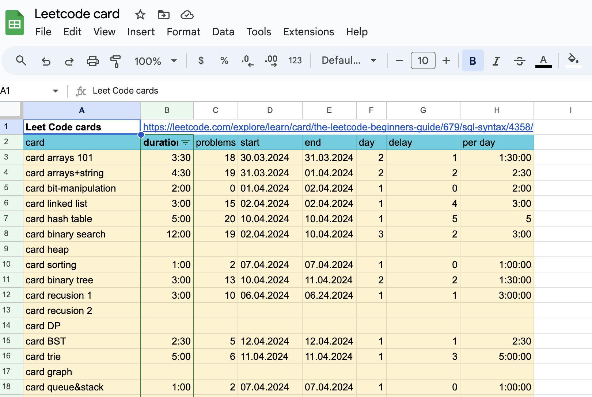

# Вот полный гид для вас

# Важно!

Чтобы быстро стать профессионалом, не делайте следующее:
1. Копипаста
2. Откладывание
3. Прыжки с места (если что-то не получается, отложите и вернитесь к этому через некоторое время)
4. Чтение всех больших книг
---

## 1. Основы языка
- Прежде всего, перейдите:
- [ссылке eng](https://www.hackerrank.com/domains/cpp?filters%5Bstatus%5D%5B%5D=unsolved&badge_type=cpp).
- [база с практикой ru](https://stepik.org/course/7/promo)
- [средний с практикой ru](https://stepik.org/course/3206) 

 Если что-то не получается, прочитайте [гид](./readme.md) по остальным темам.

## 2. DSA
- Как только вы освоите основы языка, перейдите по этой [ссылке](https://leetcode.com/explore/learn/card/the-leetcode-beginners-guide/679/sql-syntax/4358/).
- Если некоторые материалы доступны только для премиум-аккаунта, переходите по этим ссылкам.
- [graph](https://www.hackerearth.com/practice/algorithms/graphs/graph-representation/practice-problems/)
- вот еще [мап](https://neetcode.io/roadmap)
> Прежде начать создай себе вот такую таблицу

 

## 3. SQL
- Выполните все эти [задачи и теория](https://rocksql.com/main_page).

## 4. Проектирование систем
- Перейдите по этой [ссылке](https://leetcode.com/explore/learn/card/system-design/).
- здесь [бесплатно](https://leetdesign.com/library/introduction)

# 5. Работа
- Напишите мне в [Telegram](t.me/LordJollu). Я предоставлю материалы о том, как составить резюме, за чашечку кофе =)
